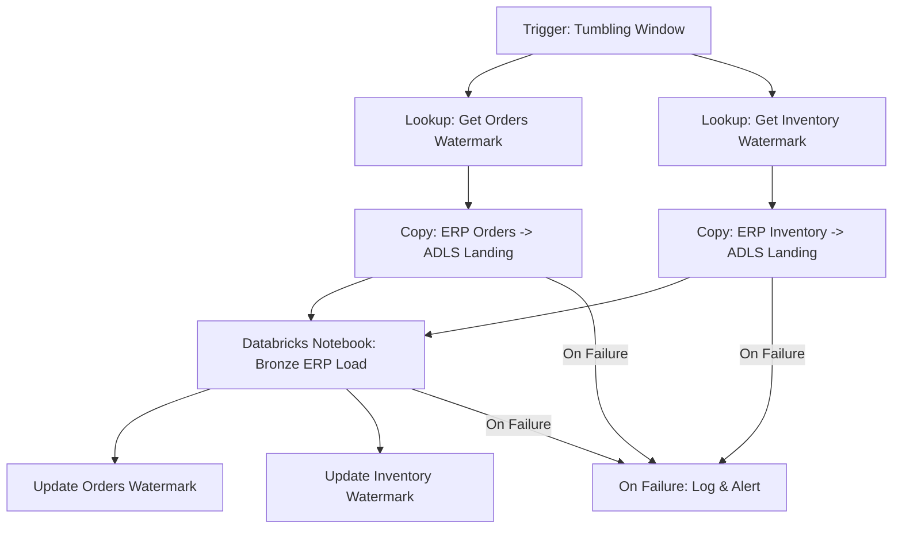
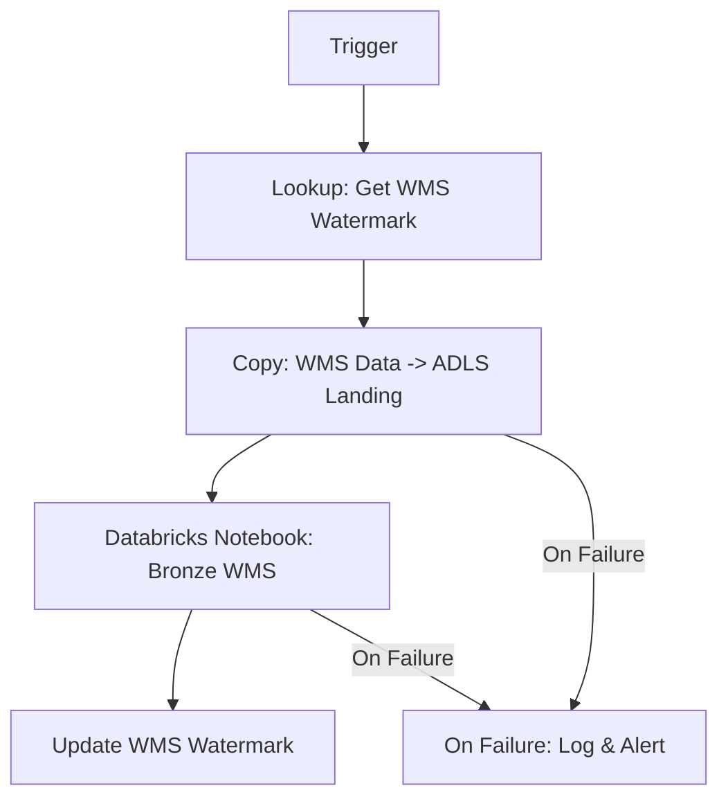
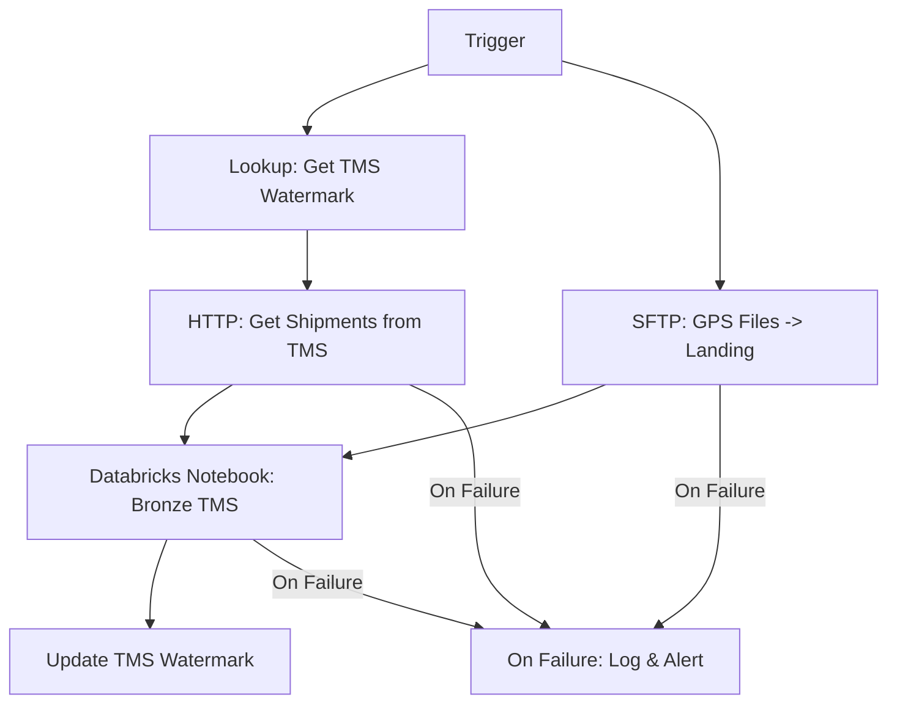
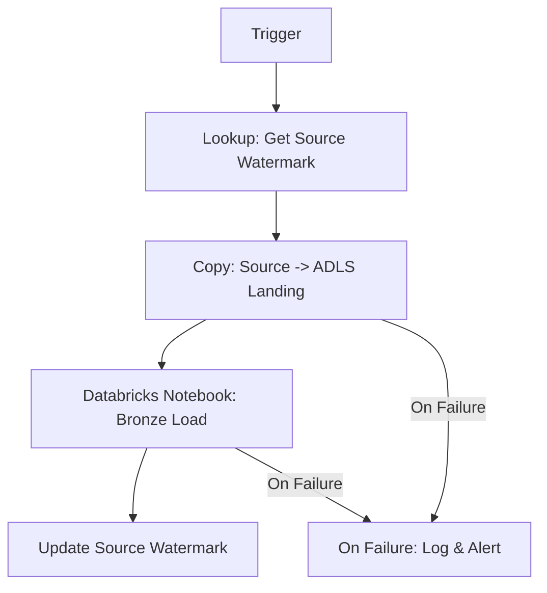
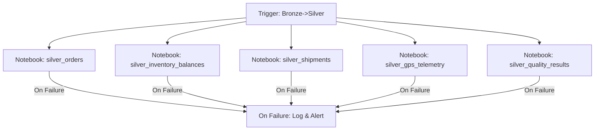
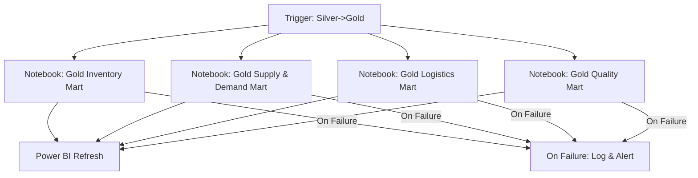

## Cargill – Food Supply Chain & Inventory Data Platform (Azure Data Engineering Design)

### 1. Business Context & Objectives

#### 1.1 Industry Context & Business Drivers

Cargill operates a global food and agriculture supply chain spanning farms, silos, processing plants, warehouses, shipping lanes, and retail distribution. The goal is to build a **unified Azure data platform** that:

- **Improves inventory visibility and freshness** across regions and nodes.
- **Reduces stockouts and overstock**, especially for perishable products.
- **Optimizes logistics** (routes, loads, lead times, carrier performance).
- **Supports demand forecasting** and supply planning with advanced analytics.

**Theoretical Foundation:**
- **Supply Chain Visibility**: End-to-end visibility across the supply chain enables proactive decision-making and reduces the "bullwhip effect" (demand amplification upstream)
- **Inventory Optimization**: Balance between stockout costs (lost sales, customer dissatisfaction) and holding costs (storage, obsolescence, especially for perishables)
- **Perishable Goods Management**: Food products have limited shelf life; effective inventory management requires tracking expiration dates, first-in-first-out (FIFO) principles, and waste minimization
- **Demand Forecasting**: Accurate demand forecasts reduce inventory costs while maintaining service levels; machine learning models can incorporate seasonality, promotions, and external factors
- **Logistics Optimization**: Route optimization, load consolidation, and carrier performance management reduce transportation costs and improve on-time delivery

#### 1.2 Business Challenges & Pain Points

**Current State Issues:**
- **Fragmented Systems**: Multiple ERP, WMS, TMS systems across regions with limited integration
- **Limited Real-Time Visibility**: Inventory positions, shipment status, and demand signals are not visible in real-time across the supply chain
- **Perishable Product Waste**: High waste rates due to poor inventory rotation, lack of expiration tracking, and suboptimal ordering decisions
- **Stockouts & Overstock**: Inability to balance inventory levels leads to stockouts (lost sales) and overstock (waste, especially for perishables)
- **Inefficient Logistics**: Suboptimal routing, poor carrier selection, and lack of real-time shipment tracking
- **Demand-Supply Mismatch**: Limited forecasting capabilities result in production and inventory misalignment with actual demand

**Strategic Objectives:**
1. **Unified Data Platform**: Integrate data from ERP, WMS, TMS, POS, and Quality systems into a single source of truth
2. **Real-Time Inventory Visibility**: Track inventory positions, in-transit quantities, and days-of-cover across all nodes
3. **Demand Forecasting**: Implement ML-based demand forecasting models incorporating historical sales, promotions, seasonality, and external factors
4. **Logistics Optimization**: Optimize routes, loads, and carrier selection to reduce costs and improve on-time delivery
5. **Quality & Compliance**: Track lot-level quality, expiration dates, and compliance events for rapid response to recalls or quality issues
6. **Cost Optimization**: Reduce inventory carrying costs, transportation costs, and waste through data-driven optimization

#### 1.3 Solution Architecture Overview

The solution is an **Azure data engineering platform** using **Azure Data Factory (ADF)** for ingestion and orchestration, **Azure Databricks** with a **Medallion architecture (Bronze/Silver/Gold)** for processing, and consumption via **Power BI** and advanced analytics.

**Architecture Principles:**
- **Cloud-First Approach**: Leverage Azure's global infrastructure for multi-region deployment and scalability
- **Medallion Architecture**: Progressive data refinement from raw (Bronze) to cleansed (Silver) to business-ready (Gold)
- **Real-Time & Batch Hybrid**: Combine batch processing for transactional data with streaming/micro-batch for time-sensitive signals (POS, GPS)
- **Delta Lake Foundation**: Use Delta Lake for ACID transactions, time travel, and efficient upserts
- **Unified Governance**: Unity Catalog provides centralized security, access control, and lineage tracking
- **ML-Enabled**: Built-in support for feature engineering, model training, and deployment for demand forecasting and optimization

---

### 2. Source Systems (5 Data Sources)

#### 2.1 Source System Architecture & Integration Patterns

**Integration Strategy:**
The platform integrates with five distinct source systems representing different aspects of the food supply chain: enterprise planning (ERP), warehouse operations (WMS), transportation (TMS), demand signals (POS), and quality/compliance. Each system has different data characteristics, update frequencies, and integration requirements.

**Data Volume & Velocity Considerations:**
- **High Volume, High Velocity**: POS sales data and GPS telemetry generate millions of events daily
- **Medium Volume, Medium Velocity**: ERP and WMS systems produce thousands of transactions daily
- **Low Volume, Variable Velocity**: Quality and compliance systems generate periodic events but require rapid processing when alerts occur

**Supply Chain Data Flow:**
- **Upstream**: Farms, suppliers → ERP (purchase orders, receipts)
- **Processing**: Plants → ERP (production, inventory)
- **Storage**: Warehouses → WMS (inventory movements, locations)
- **Transportation**: Carriers → TMS/GPS (shipments, routes, tracking)
- **Downstream**: Retailers, customers → POS (sales, demand signals)
- **Quality**: Throughout → Quality systems (inspections, compliance)

---

#### 2.2 Source 1 – ERP (SAP / Oracle) for Orders & Inventory

**System Overview:**
- **Type**: Core ERP system managing purchase orders, sales orders, inventory balances, and financials.
- **Business Purpose**: ERP systems are the central nervous system of supply chain operations, managing planning, execution, and financial transactions across the enterprise.

**Technical Details:**
- **Interface**: ADF **SAP/Oracle connectors** (ODP, OData, or table-based extraction).
  - **ODP (Operational Data Provisioning)**: SAP's framework for real-time data extraction, preferred for SAP S/4HANA
  - **OData (Open Data Protocol)**: RESTful API protocol for accessing SAP/Oracle data
  - **Table Extraction**: Direct table access for legacy systems or when ODP/OData unavailable

**Data Characteristics:**
- **Schema**: Purchase orders, sales orders, stock levels, goods movements, material master, plants/storage locations.
- **Frequency**: Near real-time (every 15-30 minutes) for orders, hourly/daily for inventory balances
- **Volume**: 10-100 GB per day (depends on transaction volume and number of locations)
- **Latency Requirement**: Near real-time for orders (15-30 minutes), daily for inventory snapshots

**Key Data Entities:**
- **Purchase Orders (PO)**: Supplier orders with quantities, delivery dates, prices
- **Sales Orders (SO)**: Customer orders with quantities, delivery dates, pricing
- **Stock Levels**: Current inventory balances by product, location, lot/batch
- **Goods Movements**: Inventory transactions (receipts, issues, transfers, adjustments)
- **Material Master**: Product definitions, specifications, units of measure, pricing
- **Plants/Storage Locations**: Facility hierarchy (plants, warehouses, distribution centers)

**Extraction Strategy:**
- **Incremental Loading**: Use watermark or CDC patterns for transactional data (orders, movements)
- **Full Load**: Periodic full refresh for master data (materials, locations) that changes infrequently
- **Partitioning**: Extract by plant/warehouse and date to enable parallel processing

**Supply Chain Context:**
- **Multi-Echelon Inventory**: Track inventory across multiple echelons (plants, DCs, warehouses, stores)
- **Allocation Logic**: Understand how ERP allocates inventory to orders (FIFO, LIFO, lot-specific)
- **Safety Stock**: Extract safety stock levels and reorder points for inventory optimization

---

#### 2.3 Source 2 – Warehouse Management Systems (WMS)

**System Overview:**
- **Type**: Multiple WMS solutions (on-prem SQL or cloud-hosted).
- **Business Purpose**: WMS systems manage day-to-day warehouse operations including receiving, put-away, picking, shipping, and inventory location management.

**Technical Details:**
- **Interface**: ADF with **Self-hosted Integration Runtime** for on-prem, or REST/SQL connectors for cloud-hosted systems.
  - **Self-Hosted IR**: Required for on-premises WMS databases to enable secure connectivity
  - **REST APIs**: For modern cloud-hosted WMS systems
  - **SQL Connectors**: Direct database access for on-premises systems

**Data Characteristics:**
- **Schema**: Inbound/outbound shipments, picks, put-aways, cycle counts, locations/bins, lot/expiry details.
- **Frequency**: Near real-time (every 15 minutes) for operational visibility
- **Volume**: 1-10 GB per day per warehouse (depends on transaction volume)
- **Latency Requirement**: Near real-time (15 minutes) for operational dashboards

**Key Data Entities:**
- **Inbound Shipments**: Receiving transactions with quantities, lots, expiration dates
- **Outbound Shipments**: Shipping transactions linked to sales orders or transfers
- **Picks**: Picking transactions with locations, quantities, lot selection
- **Put-Aways**: Put-away transactions assigning inventory to storage locations
- **Cycle Counts**: Physical inventory counts for accuracy validation
- **Locations/Bins**: Storage location hierarchy (zone, aisle, rack, shelf, bin)
- **Lot/Expiry Details**: Lot numbers, batch codes, expiration dates, production dates

**WMS-Specific Considerations:**
- **Multi-WMS Support**: Handle different WMS vendors (e.g., Manhattan, HighJump, SAP EWM) with varying schemas
- **Location Hierarchy**: Standardize location codes across different WMS systems
- **Lot Tracking**: Critical for food supply chain to support traceability and expiration management
- **FIFO/LIFO Logic**: Understand how WMS selects lots for picking (first-in-first-out for perishables)

**Integration Challenges:**
- **Schema Variations**: Different WMS systems have different table structures; need standardization
- **Real-Time Requirements**: Warehouse operations require near real-time visibility
- **Data Quality**: Ensure lot numbers, expiration dates, and quantities are accurate

---

#### 2.4 Source 3 – Transportation Management / Telematics (TMS / GPS)

**System Overview:**
- **Type**: Cloud APIs and flat-file exports (CSV/JSON) for carriers and telematics.
- **Business Purpose**: TMS systems manage transportation planning, execution, and tracking. Telematics/GPS systems provide real-time vehicle location and condition monitoring.

**Technical Details:**
- **Interface**: ADF **HTTP** connector (REST APIs) and **SFTP/Blob** connectors for batch files.
  - **REST APIs**: For real-time or near-real-time shipment and GPS data
  - **SFTP/Blob**: For batch file delivery from carriers or telematics providers
  - **OAuth/Authentication**: Handle API authentication (API keys, OAuth tokens)

**Data Characteristics:**
- **Schema**: Shipments, loads, routes, ETAs, GPS pings, temperature logs from refrigerated trucks.
- **Frequency**: 
  - Shipments: Every 15-30 minutes (near real-time)
  - GPS pings: Every 1-5 minutes (high frequency)
  - Temperature logs: Every 5-15 minutes (for refrigerated shipments)
- **Volume**: 
  - Shipments: 100 MB - 1 GB per day
  - GPS pings: 1-10 GB per day (depends on fleet size)
- **Latency Requirement**: Near real-time for tracking dashboards, acceptable delay for historical analysis

**Key Data Entities:**
- **Shipments**: Shipment records with origin, destination, carrier, status, ETA
- **Loads**: Load details (products, quantities, weights, special handling requirements)
- **Routes**: Planned and actual routes with waypoints, distances, estimated times
- **ETAs**: Estimated and actual arrival times at destinations
- **GPS Pings**: Real-time vehicle location (latitude, longitude, timestamp, speed, heading)
- **Temperature Logs**: Temperature readings from refrigerated trucks (critical for food safety)

**TMS-Specific Considerations:**
- **Multi-Carrier Support**: Integrate with multiple carriers (FedEx, UPS, regional carriers) with different APIs
- **Route Optimization**: Extract planned vs. actual routes to analyze route efficiency
- **Temperature Monitoring**: Critical for food safety; track temperature breaches and alert on violations
- **Proof of Delivery**: Extract POD data (signatures, delivery confirmation, exceptions)

**Telematics Integration:**
- **GPS Data Quality**: Handle GPS signal loss, inaccurate readings, and data gaps
- **Geofencing**: Define geofences for warehouses, customer locations to detect arrivals/departures
- **Route Deviation**: Detect when vehicles deviate from planned routes
- **Driver Behavior**: Extract driver behavior data (speeding, harsh braking) if available

---

#### 2.5 Source 4 – Demand & POS Signals

**System Overview:**
- **Type**: Retail POS feeds and customer order portals (often CSV/JSON in S3/SFTP, or APIs).
- **Business Purpose**: POS systems capture actual consumer demand at the point of sale. This is the most accurate demand signal for forecasting and inventory planning.

**Technical Details:**
- **Interface**: ADF copy from **S3-compatible** or **SFTP** endpoints and HTTP APIs.
  - **S3/SFTP**: Batch file delivery from retailers or e-commerce platforms
  - **REST APIs**: Real-time or near-real-time POS data from modern systems
  - **File Formats**: CSV, JSON, Parquet, or proprietary formats

**Data Characteristics:**
- **Schema**: Store-level sales, promotions, online orders, cancellations, returns.
- **Frequency**: 
  - Batch: Daily or multiple times per day (hourly for high-volume retailers)
  - Real-Time: Every 15-30 minutes via APIs
- **Volume**: 1-100 GB per day (depends on number of stores and transaction volume)
- **Latency Requirement**: Near real-time (15-30 minutes) for demand sensing, daily for forecasting

**Key Data Entities:**
- **Store-Level Sales**: Transaction-level or aggregated sales by store, product, time period
- **Promotions**: Promotion details (discounts, BOGO, seasonal campaigns) linked to sales
- **Online Orders**: E-commerce orders with delivery addresses, fulfillment methods
- **Cancellations**: Order cancellations with reasons and timing
- **Returns**: Product returns with reasons, condition, and timing

**POS Data Integration Challenges:**
- **Multi-Retailer Support**: Handle different POS systems with varying data formats and schemas
- **Data Granularity**: Some retailers provide transaction-level data, others provide aggregated summaries
- **Promotion Attribution**: Link sales to promotions to understand promotion effectiveness
- **Seasonality**: Capture seasonal patterns, holidays, and special events
- **External Factors**: Integrate weather, economic indicators, and competitor actions if available

**Demand Signal Quality:**
- **Completeness**: Handle missing stores, products, or time periods
- **Accuracy**: Validate sales quantities and prices against expected ranges
- **Timeliness**: Ensure data freshness for demand sensing and rapid replenishment

---

#### 2.6 Source 5 – Quality & Compliance Systems

**System Overview:**
- **Type**: Quality management, lab results, and compliance events (SQL DBs, flat files).
- **Business Purpose**: Quality and compliance systems track product quality, safety, and regulatory compliance throughout the supply chain. Critical for food safety and recall management.

**Technical Details:**
- **Interface**: ADF SQL and file connectors with self-hosted IR where required.
  - **SQL Databases**: Direct database access for quality management systems
  - **File-Based**: CSV/Excel exports for lab results or compliance reports
  - **APIs**: REST APIs for modern quality management systems

**Data Characteristics:**
- **Schema**: Lot-level quality inspection results, contamination alerts, recalls, certificates, shelf-life tests.
- **Frequency**: 
  - Inspections: As they occur (variable frequency)
  - Alerts: Real-time or near-real-time for critical events
  - Recalls: Immediate when declared
- **Volume**: 100 MB - 1 GB per day (depends on inspection volume)
- **Latency Requirement**: Real-time for alerts and recalls, daily for historical reporting

**Key Data Entities:**
- **Lot-Level Quality Results**: Inspection results by lot/batch with test parameters, pass/fail status
- **Contamination Alerts**: Critical quality events requiring immediate action
- **Recalls**: Product recall declarations with affected lots, products, regions
- **Certificates**: Compliance certificates (organic, kosher, halal, food safety certifications)
- **Shelf-Life Tests**: Product shelf-life testing results and expiration date calculations

**Quality Data Integration Considerations:**
- **Lot Traceability**: Link quality results to specific production lots for root cause analysis
- **Regulatory Compliance**: Ensure data retention and audit trail requirements are met (FDA, USDA, etc.)
- **Alert Escalation**: Rapid processing of contamination alerts and recalls for immediate action
- **Certificate Management**: Track certificate validity periods and renewal requirements
- **Multi-Standard Support**: Handle different quality standards (HACCP, ISO, customer-specific)

**Food Safety Criticality:**
- **Rapid Response**: Quality alerts and recalls require immediate processing and notification
- **Traceability**: Full lot-to-lot traceability from farm to consumer
- **Documentation**: Maintain complete audit trails for regulatory compliance

---

#### 2.7 Source System Integration Best Practices

**Security & Connectivity:**
- **Network Security**: Use VPN, ExpressRoute, or Private Endpoints for secure connectivity
- **Authentication**: Implement service principal or managed identity authentication
- **Credential Management**: Store connection strings and API keys in Azure Key Vault
- **Data Encryption**: Encrypt data in transit (TLS) and at rest

**Performance Optimization:**
- **Parallel Extraction**: Extract from multiple sources concurrently where dependencies allow
- **Incremental Loading**: Use watermark or CDC patterns to extract only changed data
- **Partitioning**: Partition large extractions by date, region, or other logical boundaries
- **Compression**: Compress data during transfer to reduce network bandwidth

**Error Handling & Resilience:**
- **Retry Logic**: Implement exponential backoff retry strategies for transient failures
- **Dead Letter Queues**: Capture failed records for manual review and reprocessing
- **Monitoring**: Track extraction success rates, data volumes, and latency metrics
- **Alerting**: Set up alerts for extraction failures, data quality issues, or SLA breaches

**Data Quality at Source:**
- **Validation**: Validate data structure, required fields, and data types at ingestion
- **Completeness Checks**: Monitor for missing data, gaps in time series, or incomplete records
- **Anomaly Detection**: Flag unusual patterns (sudden spikes, unexpected values)
- **Reconciliation**: Periodically reconcile extracted data with source system reports

---

### 3. High-Level Architecture

- **Ingestion & Orchestration**
  - **Azure Data Factory**:
    - Manages batch ingestion from ERP, WMS, TMS, POS, Quality sources.
    - Schedules pipelines (near real-time for critical feeds, hourly/daily for others).
    - Implements retry logic, logging, and dependencies.

- **Storage**
  - **Azure Data Lake Storage Gen2 (ADLS)**:
    - Central lake split into `bronze`, `silver`, and `gold` zones.
    - Data is stored in **Delta format** whenever possible.

- **Processing & Modeling**
  - **Azure Databricks (with Unity Catalog)**:
    - Medallion architecture (Bronze → Silver → Gold).
    - Handles batch ETL/ELT, streaming or micro-batch (e.g., for near real-time POS/TMS).
    - Supports ML modeling (demand forecasting, inventory optimization).

- **Serving & Analytics**
  - **Power BI**: Global supply-chain dashboards, inventory reports, logistics KPIs.
  - **Databricks SQL** and BI tools: Ad-hoc and self-service analytics.
  - **External consumers**: APIs or exports of curated data to downstream systems.

---

### 4. Medallion Architecture (Bronze / Silver / Gold)

#### 4.1 Medallion Architecture: Theoretical Foundation for Supply Chain

**Concept & Application:**
The Medallion Architecture is a data lakehouse pattern that progressively refines data quality and business value through three distinct layers. For supply chain data, this pattern is particularly valuable because it enables:
- **End-to-End Traceability**: Track products from farm to consumer through multiple systems
- **Multi-System Integration**: Harmonize data from ERP, WMS, TMS, POS, and Quality systems
- **Temporal Accuracy**: Handle late-arriving events (e.g., delayed shipment updates, backdated quality results)
- **Regulatory Compliance**: Maintain audit trails and historical records for food safety and compliance

**Supply Chain-Specific Considerations:**
- **Lot Traceability**: Critical for food safety; must maintain lot-level tracking through all layers
- **Expiration Management**: Track expiration dates and shelf-life throughout the supply chain
- **Multi-Echelon Inventory**: Handle inventory across multiple echelons (plants, DCs, warehouses, stores)
- **Demand-Supply Balance**: Integrate demand signals (POS) with supply data (inventory, shipments) for planning

---

#### 4.2 Bronze Layer – Raw Ingestion

**Purpose & Philosophy:**
- **Immutable Raw Representation**: Store data exactly as received from source systems
- **Preserve Lineage**: Maintain connection to source system, extraction timestamp, and original format
- **Audit Trail**: Provide historical record for compliance, debugging, and traceability investigations
- **Reprocessing Foundation**: Enable reprocessing of Silver/Gold layers if business rules or source data corrections occur

**Storage Convention:**
- **Root**: `adls://supplychain-lake/bronze/`
- **Folder Pattern**: `/bronze/<source_system>/<entity>/<ingestion_date>/`
  - Example: `/bronze/erp/orders/2024/01/15/`
- **File Format**: All core tables as **Delta Lake** format
  - **Rationale**: Delta provides ACID transactions, schema evolution, and efficient upserts
  - **Benefits**: Support for late-arriving corrections, time travel for audit, efficient incremental loads

**Example Bronze Tables (Detailed):**

1. **`bronze_erp_orders`**
   - **Source**: ERP system (SAP/Oracle) via ADF connectors
   - **Schema**: Purchase orders, sales orders with all original fields
   - **Key Fields**: order_id, order_type, customer_id, product_id, quantity, order_date, delivery_date, status
   - **Partitioning**: `ingestion_date`, `order_type` (PO vs SO)
   - **Update Pattern**: Incremental append with watermark

2. **`bronze_erp_inventory`**
   - **Source**: ERP inventory balances and movements
   - **Schema**: Stock levels, goods movements, inventory transactions
   - **Key Fields**: product_id, location_id, lot_id, quantity, movement_type, transaction_date
   - **Partitioning**: `ingestion_date`, `location_id`
   - **Update Pattern**: Incremental append (movements) or snapshot (balances)

3. **`bronze_wms_shipments`**
   - **Source**: WMS systems (multiple vendors)
   - **Schema**: Inbound/outbound shipments, picks, put-aways
   - **Key Fields**: shipment_id, order_id, product_id, lot_id, quantity, location_id, transaction_timestamp
   - **Partitioning**: `ingestion_date`, `warehouse_id`
   - **Update Pattern**: Incremental append

4. **`bronze_tms_shipments`, `bronze_tms_gps_events`**
   - **Source**: TMS APIs and GPS/telematics systems
   - **Schema**: Shipment records, GPS pings, temperature logs
   - **Key Fields**: shipment_id, vehicle_id, latitude, longitude, timestamp, temperature, route_id
   - **Partitioning**: `ingestion_date`, `carrier_id`
   - **Update Pattern**: Streaming or micro-batch append

5. **`bronze_pos_sales`**
   - **Source**: POS systems and e-commerce platforms
   - **Schema**: Store-level sales transactions
   - **Key Fields**: transaction_id, store_id, product_id, quantity, price, sale_date, promotion_id
   - **Partitioning**: `ingestion_date`, `retailer_id`
   - **Update Pattern**: Batch or streaming append

6. **`bronze_quality_events`**
   - **Source**: Quality management and lab systems
   - **Schema**: Quality inspection results, contamination alerts, recalls
   - **Key Fields**: quality_event_id, lot_id, product_id, test_type, result, pass_fail, alert_severity
   - **Partitioning**: `ingestion_date`, `event_type`
   - **Update Pattern**: Event-driven append (as events occur)

**Ingestion Behavior:**
- **Two-Stage Pattern**:
  1. **Landing Stage**: ADF Copy activities land raw data into ADLS landing folders
     - Formats: CSV, JSON, Parquet, or native database formats
     - Location: `/landing/<source_system>/<entity>/<date>/<time>/`
  2. **Bronze Load Stage**: Databricks notebooks read landing data and write to Bronze Delta tables
     - Parse file formats and apply basic schema mapping
     - Add metadata columns (ingestion_timestamp, source_system, file_name, checksum)
     - Handle schema evolution (add new columns, handle missing fields)
     - Write to Delta tables with append operation

**Data Quality at Bronze:**
- **Minimal Validation**: Only structural validation (schema compliance, required fields)
- **No Business Rules**: Preserve all data, including invalid records (flag for downstream processing)
- **Metadata Capture**: Record extraction timestamp, source system version, file checksums
- **Error Records**: Log parsing errors, schema mismatches to separate error tables

#### 4.3 Silver Layer – Cleansed & Harmonized

**Purpose & Philosophy:**
- **Cleaned & Standardized**: Apply data quality rules, handle missing values, and standardize formats
- **Conformed Entities**: Create unified business entities that integrate data from multiple source systems
- **Supply Chain Integration**: Link orders, inventory, shipments, and quality events across systems
- **Business Key Standardization**: Unify identifiers across systems (product codes, customer IDs, facility IDs)
- **Ready for Analytics**: Data is clean enough for analytical queries but not yet optimized for specific use cases

**Storage Convention:**
- **Root**: `adls://supplychain-lake/silver/`
- **Partitioning Strategy**:
  - Aligned with query patterns for optimal performance
  - Common patterns: `business_date`, `region`, `plant_id`, `warehouse_id`
  - Example: `/silver/inventory_balances/region=US/warehouse_id=DC001/business_date=2024-01-15/`
- **File Format**: Delta Lake format for ACID transactions and efficient upserts

**Key Transformations (Detailed):**

1. **Data Quality & Cleansing**:
   - **Missing Value Handling**:
     - **Strategy**: Forward-fill for time-series (inventory, GPS), mean/median for aggregates, null for unknown
     - **Context-Aware**: Different strategies for different data types (quantities vs. codes)
     - **Flagging**: Mark imputed values for transparency
   - **Outlier Detection & Treatment**:
     - **Statistical Methods**: Z-score, IQR for numeric values (quantities, prices, temperatures)
     - **Domain Knowledge**: Apply business rules (e.g., negative inventory, impossible temperatures)
     - **Treatment**: Cap/floor values, remove outliers, flag for investigation
   - **Invalid Data Handling**:
     - **Schema Validation**: Ensure data types match expected formats
     - **Range Validation**: Check values against valid ranges (e.g., quantities > 0, percentages 0-100)
     - **Format Validation**: Validate codes, dates, and string formats

2. **Standardization**:
   - **Units of Measure**:
     - Convert all weights to kilograms (kg vs lbs)
     - Convert all volumes to liters (liters vs gallons)
     - Convert all temperatures to Celsius
     - Maintain original units in separate columns if needed
   - **Currencies**:
     - Convert all monetary values to USD using FX rates
     - Maintain original currency and exchange rate for audit
     - Handle multi-currency transactions correctly
   - **Time Zones**:
     - Convert all timestamps to UTC for consistency
     - Preserve original timezone information in separate columns
     - Handle daylight saving time transitions correctly

3. **Master Data Unification**:
   - **Product Code Harmonization**:
     - Map product codes from different systems (ERP material_number, WMS SKU, POS product_id) to standard SKU
     - Handle product variants, revisions, and supersessions
     - Maintain mapping table for reference
   - **Customer ID Standardization**:
     - Unify customer identifiers across ERP and POS systems
     - Handle customer hierarchies (parent companies, subsidiaries)
   - **Facility ID Standardization**:
     - Map facility codes (ERP plant_code, WMS warehouse_id, TMS location_id) to standard facility_id
     - Build unified facility hierarchy (region → country → facility → location)

4. **Event Linking & Integration**:
   - **Order-Shipment Linking**:
     - Map WMS/TMS shipments to ERP orders using order_id, shipment_id, or reference numbers
     - Handle partial shipments and multi-stop deliveries
   - **POS-Supply Linking**:
     - Link POS sales to upstream inventory and production batches where feasible
     - Enable demand traceability back to supply sources
   - **Quality-Product Linking**:
     - Link quality events to specific lots, batches, and production runs
     - Enable lot-level traceability for recalls and quality investigations

**Example Silver Tables (Detailed):**

1. **`silver_orders`**
   - **Source**: `bronze_erp_orders` + `bronze_pos_sales` (consolidated)
   - **Transformations**:
     - Standardize order statuses across systems
     - Unify customer IDs and product codes
     - Convert currencies to USD
     - Normalize timestamps to UTC
     - Link POS sales to ERP orders where applicable
   - **Schema**:
     ```sql
     order_id: string (standardized)
     order_type: string (purchase_order, sales_order, pos_sale)
     customer_id: string (standardized)
     product_id: string (standardized SKU)
     quantity: double (standardized units)
     unit_price_usd: double (converted to USD)
     order_date: timestamp (UTC)
     delivery_date: timestamp (UTC)
     order_status: string (standardized)
     region: string
     ```
   - **Partitioning**: `region`, `order_date`

2. **`silver_inventory_balances`**
   - **Source**: `bronze_erp_inventory` + `bronze_wms_shipments` (reconciled)
   - **Transformations**:
     - Reconstruct inventory balances by product-location-lot
     - Reconcile discrepancies between ERP and WMS
     - Standardize product codes and location codes
     - Calculate days-of-cover based on demand forecasts
   - **Schema**:
     ```sql
     product_id: string (standardized)
     location_id: string (standardized)
     lot_id: string
     expiration_date: date
     on_hand_quantity: double
     on_order_quantity: double
     in_transit_quantity: double
     available_quantity: double (on_hand - reserved)
     days_of_cover: double (calculated)
     last_updated: timestamp
     ```
   - **Partitioning**: `region`, `warehouse_id`, `business_date`

3. **`silver_shipments`**
   - **Source**: `bronze_wms_shipments` + `bronze_tms_shipments` (integrated)
   - **Transformations**:
     - Integrate shipment data from WMS and TMS
     - Standardize shipment identifiers, carriers, and route info
     - Link shipments to orders
     - Calculate transit times and delivery performance
   - **Partitioning**: `region`, `shipment_date`

4. **`silver_gps_telemetry`**
   - **Source**: `bronze_tms_gps_events` (cleansed)
   - **Transformations**:
     - Clean GPS/temperature outliers
     - Interpolate gaps where appropriate
     - Link GPS events to shipments and routes
     - Detect route deviations and geofence events
     - Flag temperature breaches for refrigerated shipments
   - **Partitioning**: `carrier_id`, `event_date`

5. **`silver_quality_results`**
   - **Source**: `bronze_quality_events` (enriched)
   - **Transformations**:
     - Link quality events to lots, products, and locations
     - Standardize test parameter names and units
     - Calculate pass/fail based on specification limits
     - Flag critical quality events for alerting
     - Link to production batches and shipments
   - **Partitioning**: `region`, `test_date`

**Implementation:**
- **Processing Strategy**:
  - **Incremental Processing**: Read only new/changed records from Bronze using watermark or change detection
  - **Upsert Pattern**: Use Delta Lake MERGE INTO for idempotent updates (handles late-arriving events and corrections)
  - **Batch Processing**: Process in micro-batches (15 minutes to 1 hour) for near real-time analytics
  - **Streaming Processing**: For high-velocity data (POS, GPS), use Structured Streaming with windowing

**ADF Orchestration:**
- **Trigger Strategy**: 
  - Time-based triggers (every 15-30 minutes for operational data)
  - Event-based triggers (after successful Bronze ingestion)
  - Dependency-based (wait for multiple Bronze sources before Silver processing)
- **Job Execution**: ADF invokes Databricks jobs (notebooks or workflows) via Databricks Notebook activity
- **Error Handling**: Capture transformation failures, log to error tables, send alerts

**Data Quality Monitoring:**
- **Quality Metrics**: Track data quality scores (completeness, validity, consistency)
- **Anomaly Detection**: Flag unusual patterns (sudden inventory drops, shipment delays)
- **Data Profiling**: Generate statistics (distributions, cardinality, null rates) for monitoring
- **Alerting**: Notify data engineers when quality thresholds are breached

#### 4.4 Gold Layer – Curated Marts & KPIs

**Purpose & Philosophy:**
- **Analytics-Optimized**: Gold layer is designed specifically for analytical workloads and business intelligence
- **Star Schema Design**: Implements dimensional modeling (Kimball methodology) for intuitive querying and reporting
- **Business Metrics**: Pre-calculated KPIs and aggregates to enable fast dashboard performance
- **Use Case Specific**: Each Gold mart serves a specific business domain (inventory, demand-supply, logistics, quality)
- **Performance Tuned**: Optimized partitioning, indexing, and file sizes for query performance

**Storage Convention:**
- **Root**: `adls://supplychain-lake/gold/`
- **Partitioning Strategy**:
  - Aligned with analytical query patterns and business reporting cycles
  - Common patterns: `fiscal_year_month`, `region`, `product_category`
  - Example: `/gold/inventory_mart/fact_inventory_snapshot/fiscal_year_month=2024-01/region=US/`
- **File Format**: Delta Lake format with Z-ordering and Bloom filters for optimal query performance

**Primary Gold Models (Detailed):**

1. **Inventory Visibility Mart**

   **Business Context:**
   - Provide real-time visibility into inventory positions across the entire supply chain
   - Support inventory optimization, stockout prevention, and waste reduction (especially for perishables)
   - Enable multi-echelon inventory planning and allocation decisions

   **Fact Table: `fact_inventory_snapshot`**
   - **Grain**: One row per product-location-lot-day (or intraday for real-time dashboards)
   - **Key Metrics**:
     ```sql
     -- Inventory Quantities
     on_hand_quantity: double
     on_order_quantity: double
     in_transit_quantity: double
     reserved_quantity: double (allocated to orders)
     available_quantity: double (on_hand - reserved)
     
     -- Inventory Planning Metrics
     safety_stock_quantity: double
     reorder_point_quantity: double
     max_stock_quantity: double
     days_of_cover: double (available / average_daily_demand)
     
     -- Perishable-Specific Metrics
     expiration_date: date
     days_until_expiration: integer
     freshness_score: double (calculated based on days until expiration)
     fifo_priority: integer (for first-in-first-out picking)
     
     -- Financial Metrics
     inventory_value_usd: double
     carrying_cost_usd: double
     ```
   - **Foreign Keys**: product_id, location_id, lot_id, time_id, business_unit_id (dimension keys)
   - **Partitioning**: `fiscal_year_month`, `region`, `warehouse_id`

   **Dimension Tables:**
   - **`dim_product`**: Product attributes (SKU, description, category, specifications, unit_cost)
   - **`dim_location`**: Location hierarchy (region, country, facility_type, facility_name, location_code)
   - **`dim_time`**: Time hierarchy (date, day_of_week, week, month, quarter, year, fiscal_period)
   - **`dim_lot`**: Lot attributes (lot_id, batch_id, production_date, expiration_date, quality_status)
   - **`dim_business_unit`**: Business unit hierarchy (division, business_unit, profit_center)

2. **Supply & Demand Mart**

   **Business Context:**
   - Balance supply (inventory, production, shipments) with demand (sales, forecasts, orders)
   - Support demand forecasting, supply planning, and S&OP (Sales & Operations Planning) processes
   - Enable identification of supply-demand imbalances and planning adjustments

   **Fact Table: `fact_demand_supply_balance`**
   - **Grain**: One row per product-region-week (or day for operational planning)
   - **Key Metrics**:
     ```sql
     -- Demand Metrics
     forecast_quantity: double (ML-based demand forecast)
     actual_sales_quantity: double (from POS and orders)
     open_orders_quantity: double (committed but not yet fulfilled)
     demand_variance: double (actual - forecast)
     
     -- Supply Metrics
     beginning_inventory: double
     planned_production: double
     planned_receipts: double (from purchase orders)
     total_supply: double (beginning + production + receipts)
     
     -- Balance Metrics
     supply_demand_balance: double (total_supply - total_demand)
     days_of_cover: double (ending_inventory / average_daily_demand)
     stockout_risk: double (calculated probability)
     overstock_risk: double (calculated probability, especially for perishables)
     ```
   - **Data Sources**: 
     - `silver_orders` (demand signals)
     - `silver_inventory_balances` (supply positions)
     - ML forecast models (demand forecasts)
   - **Partitioning**: `fiscal_year_week`, `region`, `product_category`

3. **Logistics & Delivery Performance Mart**

   **Business Context:**
   - Track and optimize logistics performance including on-time delivery, transit times, and carrier performance
   - Monitor temperature compliance for refrigerated shipments (critical for food safety)
   - Support route optimization and carrier selection decisions

   **Fact Tables:**
   
   **`fact_shipments`**:
   - **Grain**: One row per shipment
   - **Key Metrics**:
     ```sql
     shipment_id: string
     order_id: string
     carrier_id: string
     origin_location_id: string
     destination_location_id: string
     planned_departure_date: date
     actual_departure_date: date
     planned_arrival_date: date
     actual_arrival_date: date
     transit_time_hours: double
     planned_transit_time_hours: double
     on_time_indicator: boolean
     ```
   
   **`fact_delivery_performance`**:
   - **Grain**: One row per delivery event
   - **Key Metrics**:
     ```sql
     -- OTIF Metrics (On-Time In-Full)
     on_time_indicator: boolean
     in_full_indicator: boolean
     otif_indicator: boolean (on-time AND in-full)
     
     -- Transit Metrics
     lead_time_days: double (order to delivery)
     transit_time_hours: double
     route_deviation_miles: double
     
     -- Temperature Compliance (for refrigerated shipments)
     min_temperature_celsius: double
     max_temperature_celsius: double
     temperature_breach_count: integer
     temperature_breach_duration_minutes: double
     
     -- Cost Metrics
     shipping_cost_usd: double
     cost_per_unit_usd: double
     ```
   - **Data Sources**: 
     - `silver_shipments` (shipment data)
     - `silver_gps_telemetry` (route and temperature data)
   - **Partitioning**: `region`, `shipment_date`, `carrier_id`

4. **Quality & Compliance Mart**

   **Business Context:**
   - Track quality events, defects, and compliance issues throughout the supply chain
   - Support rapid response to recalls and quality issues with lot-level traceability
   - Enable quality trend analysis and root cause identification

   **Fact Tables:**
   
   **`fact_quality_events`**:
   - **Grain**: One row per quality event
   - **Key Metrics**:
     ```sql
     quality_event_id: string
     lot_id: string
     product_id: string
     location_id: string
     event_timestamp: timestamp
     event_type: string (inspection, contamination_alert, recall)
     defect_type: string
     defect_severity: string (critical, major, minor)
     quantity_affected: double
     defect_rate_percent: double
     cost_impact_usd: double
     containment_action: string
     resolution_status: string
     ```
   
   **`fact_recalls`**:
   - **Grain**: One row per recall event
   - **Key Metrics**:
     ```sql
     recall_id: string
     recall_date: date
     product_id: string
     affected_lot_ids: array<string>
     affected_regions: array<string>
     recall_volume_units: double
     recall_cost_usd: double
     time_to_contain_hours: double
     time_to_resolve_days: double
     ```
   - **Data Sources**: `silver_quality_results` enriched with inventory and shipment data
   - **Partitioning**: `region`, `event_date`, `event_type`

**Additional Gold Tables:**

5. **ML Feature Tables**
   - **Purpose**: Pre-computed features for machine learning models
   - **Examples**:
     - **Demand Forecasting Features**: Historical sales patterns, seasonality, promotion effects, external factors
     - **Inventory Optimization Features**: Demand variability, lead times, service level targets
     - **Route Optimization Features**: Distance, traffic patterns, carrier performance, cost factors
   - **Refresh Frequency**: Updated in near real-time or hourly depending on model requirements

6. **Aggregate Tables**
   - **Purpose**: Pre-aggregated summaries for fast dashboard queries
   - **Examples**:
     - Daily/Weekly/Monthly inventory summaries by region and product category
     - Carrier performance summaries (OTIF rates, average transit times)
     - Quality defect trend summaries by product and region

**Consumption Patterns:**
- **Power BI Integration**: Direct Lake, DirectQuery, or Import mode depending on dataset size and real-time requirements
- **Databricks SQL**: Serverless SQL compute for ad-hoc queries and BI tool integration
- **Machine Learning**: Feature Store for centralized feature management, model training, and batch scoring
- **APIs**: REST APIs for downstream systems (ERP, WMS) to consume curated data

---

### 5. ADF Orchestration & Pipelines (End-to-End Flow)

#### 5.1 Ingestion Pipelines

- **Pipeline: `pl_ingest_erp`**
  - Activities:
    - `Copy_erp_orders`: ERP orders → `/landing/erp/orders/`.
    - `Copy_erp_inventory`: ERP inventory balances → `/landing/erp/inventory/`.
    - `Notebook_bronze_erp`: Databricks notebook to parse landing data into `bronze_erp_orders`, `bronze_erp_inventory`.
  - Triggers:
    - Orders: near real-time (every 15–30 minutes).
    - Inventory: hourly or multiple times per day, based on SLA.

- **Pipeline: `pl_ingest_wms`**
  - Activities:
    - `Copy_wms_shipments`: WMS shipments and inventory movements to `/landing/wms/`.
    - `Notebook_bronze_wms`: Load into `bronze_wms_shipments` and related tables.

- **Pipeline: `pl_ingest_tms`**
  - Activities:
    - `Copy_tms_shipments_api`: Invoke TMS API via HTTP to get recent shipments.
    - `Copy_tms_gps_files`: Pull GPS/temperature CSV/JSON files via SFTP.
    - `Notebook_bronze_tms`: Consolidate into `bronze_tms_shipments`, `bronze_tms_gps_events`.

- **Pipeline: `pl_ingest_pos`**
  - Activities:
    - `Copy_pos_sales`: POS and e-commerce orders from SFTP/API to `/landing/pos/`.
    - `Notebook_bronze_pos`: Normalize and load into `bronze_pos_sales`.

- **Pipeline: `pl_ingest_quality`**
  - Activities:
    - `Copy_quality_events`: From quality/compliance systems to `/landing/quality/`.
    - `Notebook_bronze_quality`: Load into `bronze_quality_events`.

Each ingestion pipeline includes:

- Parameterized configurations (regions, systems, date ranges).
- Error handling branches (on failure: log, notify, and optionally retry).
- Logging metadata to an operational table or Log Analytics.

#### 5.2 Transformation Pipelines (Bronze → Silver → Gold)

- **Pipeline: `pl_transform_bronze_to_silver`**
  - Activities (Databricks notebook activities):
    - `Notebook_silver_orders`: Clean and integrate ERP orders and POS signals into `silver_orders`.
    - `Notebook_silver_inventory`: Consolidate `bronze_erp_inventory` and `bronze_wms_shipments` into `silver_inventory_balances`.
    - `Notebook_silver_shipments`: Integrate WMS and TMS shipment data.
    - `Notebook_silver_gps`: Clean GPS telemetry and flag anomalies (e.g., temperature out-of-range).
    - `Notebook_silver_quality`: Prepare `silver_quality_results` and lot-level quality status.
  - Dependencies:
    - Configured so that Silver jobs only run when corresponding Bronze ingestion is successful for that window.

- **Pipeline: `pl_transform_silver_to_gold`**
  - Activities:
    - `Notebook_gold_inventory_mart`: Build `fact_inventory_snapshot` and `dim_*` tables.
    - `Notebook_gold_supply_demand_mart`: Create `fact_demand_supply_balance`.
    - `Notebook_gold_logistics_mart`: Produce `fact_shipments` and `fact_delivery_performance`.
    - `Notebook_gold_quality_mart`: Create `fact_quality_events`, `fact_recalls`.
  - Triggers:
    - Typically hourly or daily, aligned with business reporting cycles (e.g., end-of-day snapshots, weekly planning).

#### 5.3 End-to-End Flow Overview

1. **Extraction & Landing (ADF)**
   - ADF connects to ERP, WMS, TMS, POS, and Quality sources using respective connectors and integration runtimes.
   - Data for each run (incremental window) is copied into ADLS landing folders with metadata (file name conventions, timestamps).
2. **Landing to Bronze (ADF + Databricks)**
   - ADF invokes Databricks notebooks that:
     - Read landing data for the execution window.
     - Apply minimal structure and mapping to unified raw schemas.
     - Append records into **Bronze Delta tables** per entity.
3. **Bronze to Silver (Databricks)**
   - Notebooks:
     - Clean, deduplicate, and standardize data from multiple sources.
     - Use master/reference tables to harmonize products, locations, and customers.
     - Link events across systems (orders ↔ shipments ↔ deliveries ↔ quality events).
     - Populate Silver Delta tables (upsert-based ETL).
4. **Silver to Gold (Databricks)**
   - Notebooks compute core business KPIs and build curated dimensional and fact tables in the Gold layer:
     - Inventory positions and days-of-cover.
     - Demand vs supply balance.
     - OTIF and carrier performance.
     - Quality, recall and compliance metrics.
5. **Consumption & Feedback**
   - Power BI and other tools read from Gold Delta tables for reports and dashboards.
   - Forecasting and optimization models are trained on historical Silver/Gold data and can output recommendations (e.g., reorder points, optimal routes) into separate **Gold recommendation tables**, which are then consumed by planners or even operational systems.

---

### 6. Security, Governance, and Monitoring

- **Security**
  - Use **Azure AD** for authentication and role-based access control.
  - Implement **Unity Catalog** for fine-grained table and column security, including masking of sensitive data (e.g., customer PII).
  - Network-level protection via **Private Endpoints**, **VNET integration**, and restricted access from on-prem environments.

- **Data Governance**
  - Classify data (confidential, internal, public) and apply corresponding policies.
  - Capture data lineage and business glossary using a data catalog (e.g., **Microsoft Purview**).
  - Version control for Databricks notebooks and configuration-as-code for ADF.

- **Monitoring & Observability**
  - Use ADF monitoring and alerts for pipeline status and SLA breaches.
  - Log Databricks jobs and cluster metrics; push logs to **Log Analytics** for centralized observability.
  - Implement data quality checks with alerts on threshold breaches (e.g., missing POS feeds, inventory imbalances).

---

### 7. Use Cases Enabled

- **End-to-end inventory visibility** across global warehouses, plants, and distribution centers.
- **Demand forecasting and supply planning** using historical sales, orders, and seasonality.
- **Logistics optimization**, including route planning, carrier performance management, and OTIF improvement.
- **Shelf-life and freshness tracking** for perishable goods, combining quality data and logistics timelines.
- **Risk and compliance analytics**, enabling rapid response to recalls and quality issues with precise lot/batch traceability.

---

### 8. Detailed End-to-End Flow & Diagrams

This section provides **expanded flows and diagrams** for the Cargill supply-chain platform, focusing on how ADF orchestrates ingestion and how Databricks implements the Medallion pattern.

---

#### 8.1 High-Level Supply Chain Data Flow

**Narrative overview:**

1. **Operational systems** (ERP, WMS, TMS/telematics, POS, Quality) generate transactions and events across the supply chain.  
2. **Azure Data Factory** orchestrates batch and micro-batch ingestion into ADLS landing zones.  
3. **Bronze Layer** in Databricks stores raw, immutable representations of data from each source.  
4. **Silver Layer** cleans, standardizes, and links data into consistent cross-system models (orders, inventory, shipments, quality).  
5. **Gold Layer** exposes curated marts optimized for reporting and planning (inventory snapshots, supply-demand, logistics, quality).  
6. **Analytics & ML** layers use Gold/Silver for dashboards, forecasting, and optimization models.

**High-level flow diagram (conceptual):**

```mermaid
flowchart LR
    subgraph Sources
        ERP[ERP<br/>(Orders & Inventory)]
        WMS[Warehouse<br/>Management]
        TMS[Transportation / Telematics]
        POS[POS & Online Orders]
        QLTY[Quality & Compliance]
    end

    subgraph Ingestion[Ingestion & Orchestration]
        ADF[Azure Data Factory]
    end

    subgraph Lake[Azure Data Lake Gen2]
        BRZ[Bronze Layer<br/>(Raw Delta)]
        SIL[Silver Layer<br/>(Cleansed & Linked)]
        GLD[Gold Layer<br/>(Curated Marts)]
    end

    subgraph Compute[Azure Databricks]
        DBX_BRZ[Bronze ETL]
        DBX_SIL[Silver ETL]
        DBX_GLD[Gold ETL]
    end

    subgraph Consumers[Analytics & Applications]
        PBI[Power BI]
        DBX_SQL[Databricks SQL]
        ML[ML / Forecasting<br/>(Demand, Inventory, Routes)]
    end

    ERP --> ADF
    WMS --> ADF
    TMS --> ADF
    POS --> ADF
    QLTY --> ADF

    ADF --> DBX_BRZ --> BRZ
    BRZ --> DBX_SIL --> SIL
    SIL --> DBX_GLD --> GLD

    GLD --> PBI
    GLD --> DBX_SQL
    GLD --> ML
```

---

#### 8.2 ADF Ingestion Pipelines – Detailed Flows

Each ingestion pipeline in ADF follows a **common pattern**:

- Trigger → Determine incremental window → Copy data to ADLS landing → Invoke Databricks to load Bronze → Log and handle errors.

---

##### 8.2.1 ERP Ingestion (`pl_ingest_erp`)

**Step-by-step:**

1. **Trigger** (Tumbling Window, e.g., every 30 minutes) initiates the pipeline.  
2. **GetLastWatermark_Orders / Inventory** (Lookup/Stored Proc):  
   - Reads last successful extraction timestamp per entity from a metadata table.  
3. **Copy_erp_orders** (Copy Activity):  
   - Source: ERP connector (SAP/Oracle).  
   - Query/filter on `last_modified` or CDC.  
   - Sink: ADLS `/landing/erp/orders/yyyy/mm/dd/hh/`.  
4. **Copy_erp_inventory** (Copy Activity):  
   - Similar pattern, landing into `/landing/erp/inventory/...`.  
5. **Notebook_bronze_erp** (Databricks Notebook):  
   - Reads ERP landing folders for the window.  
   - Validates basic schema, parses dates, normalizes codes.  
   - Appends into `bronze_erp_orders` and `bronze_erp_inventory` Delta tables.  
6. **UpdateWatermark_Orders / Inventory**:  
   - Writes the new max `last_modified` per entity into watermark table.  
7. **OnFailure**:  
   - ADF on-failure path logs to an error log table and sends an alert (email/Teams/Webhook).

**ERP ingestion flow diagram:**



---

##### 8.2.2 WMS Ingestion (`pl_ingest_wms`)

**Steps:**

1. Trigger (e.g., every 15 minutes for near-real-time warehouse events).  
2. Get last sync watermark per WMS system (if multiple regions/instances).  
3. Copy inbound/outbound shipments, stock movements, and cycle counts into `/landing/wms/<system>/<date>/`.  
4. Databricks notebook `Notebook_bronze_wms`:
   - Normalizes schema across WMS systems (common columns, unified event types).  
   - Writes to `bronze_wms_shipments` and `bronze_wms_movements`.  
5. Update watermarks and log row counts.

**WMS ingestion flow diagram:**



---

##### 8.2.3 TMS / Telematics Ingestion (`pl_ingest_tms`)

**Steps:**

1. Trigger (e.g., every 5–15 minutes).  
2. **Copy_tms_shipments_api**:
   - HTTP activity calls TMS API for shipments modified since the last watermark.  
   - Writes JSON/CSV to `/landing/tms/shipments/...`.  
3. **Copy_tms_gps_files**:
   - SFTP connector fetches GPS and temperature logs from telematics provider.  
   - Writes to `/landing/tms/gps/...`.  
4. **Notebook_bronze_tms**:
   - Parses API responses and GPS files.  
   - Writes `bronze_tms_shipments` and `bronze_tms_gps_events` tables.  
5. Update watermarks and log metrics.

**TMS ingestion flow diagram:**



---

##### 8.2.4 POS & Quality Ingestion (`pl_ingest_pos`, `pl_ingest_quality`)

These pipelines mirror the above pattern:

- Trigger → Copy from SFTP/API/DB → Databricks Bronze load → Update watermark → Log and alert on error.  
- POS landing: `/landing/pos/sales/...`, Bronze table: `bronze_pos_sales`.  
- Quality landing: `/landing/quality/events/...`, Bronze table: `bronze_quality_events`.

**Generic POS/Quality ingestion diagram:**



---

#### 8.3 Transformation Flows (Bronze → Silver → Gold)

---

##### 8.3.1 Bronze to Silver (`pl_transform_bronze_to_silver`)

**Step-by-step:**

1. ADF **Trigger** (hourly or after completion of ingestion windows) invokes a transformation pipeline.  
2. **Notebook_silver_orders**:  
   - Reads `bronze_erp_orders` and `bronze_pos_sales`.  
   - Standardizes order statuses, units, currencies, and customer IDs.  
   - Links online orders and POS sales to ERP order references where available.  
   - Writes `silver_orders`.  
3. **Notebook_silver_inventory**:  
   - Reads `bronze_erp_inventory` and `bronze_wms_movements`.  
   - Reconstructs inventory balances by product-location-lot, reconciling discrepancies.  
   - Writes `silver_inventory_balances`.  
4. **Notebook_silver_shipments**:  
   - Integrates `bronze_wms_shipments` and `bronze_tms_shipments`.  
   - Standardizes shipment identifiers, carriers, and route info.  
   - Writes `silver_shipments`.  
5. **Notebook_silver_gps**:  
   - Reads `bronze_tms_gps_events`.  
   - Cleans GPS/temperature outliers, interpolates gaps where appropriate.  
   - Links GPS events to shipments and routes.  
   - Writes `silver_gps_telemetry`.  
6. **Notebook_silver_quality**:  
   - Reads `bronze_quality_events`.  
   - Links quality events to lots, products, and locations.  
   - Writes `silver_quality_results`.  
7. All notebooks log counts and quality metrics; ADF aggregates pass/fail status.

**Bronze → Silver flow diagram:**



---

##### 8.3.2 Silver to Gold (`pl_transform_silver_to_gold`)

**Step-by-step:**

1. **Trigger** (daily for planning, hourly for near-real-time dashboards) starts Gold pipeline.  
2. **Notebook_gold_inventory_mart**:  
   - Reads `silver_inventory_balances`, `silver_orders`, and `silver_shipments`.  
   - Derives `fact_inventory_snapshot` by product-location-lot-day, including on-hand, on-order, and in-transit.  
   - Builds `dim_product`, `dim_location`, `dim_time`, `dim_business_unit`.  
3. **Notebook_gold_supply_demand_mart**:  
   - Combines historical sales (from `silver_orders`/`silver_pos_sales`), open orders, and forecasts (if available).  
   - Creates `fact_demand_supply_balance` at product-region-week grain.  
4. **Notebook_gold_logistics_mart**:  
   - Uses `silver_shipments` and `silver_gps_telemetry`.  
   - Calculates OTIF, late deliveries, temperature breach events, and route deviations.  
   - Writes `fact_shipments` and `fact_delivery_performance`.  
5. **Notebook_gold_quality_mart**:  
   - Reads `silver_quality_results` and joins with inventory and shipment data.  
   - Builds `fact_quality_events` and `fact_recalls`.  
6. Optional: **Power BI Dataset Refresh** via ADF Web Activity or Power BI REST API.

**Silver → Gold flow diagram:**



---

#### 8.4 Example End-to-End Scenario – From Store Sale to Inventory & Logistics Insights

1. A retail store sells several SKUs of a perishable product throughout the day; POS systems send hourly sales batches to Cargill.  
2. ADF `pl_ingest_pos` picks up the POS files via SFTP/API, lands them in ADLS, and Bronze loads them into `bronze_pos_sales`.  
3. Parallelly, ERP and WMS pipelines ingest new orders, shipments, and inventory movements into their respective Bronze tables.  
4. The Bronze→Silver pipeline consolidates POS sales and ERP orders into `silver_orders`, and reconciles stock in `silver_inventory_balances`.  
5. The Silver→Gold pipeline calculates updated `fact_inventory_snapshot` at product-location level, including actual on-hand and days-of-cover for each store and DC.  
6. Power BI dashboards refresh and show planners where stocks are low (risk of stockout) or high (risk of expiry), especially for perishable goods.  
7. Logistics mart (`fact_shipments`, `fact_delivery_performance`) allows planners to see which upcoming shipments could be re-routed to balance supply and demand across regions.  
8. Forecasting models can then suggest replenishment quantities and optimal transfers, writing recommendations into a Gold recommendation table that planners act upon, closing the loop between analytics and operational decisions.

---

### 9. Advanced Operational Flows & Lifecycle Management

To make the Cargill supply-chain platform **production-grade**, it is essential to define not only the happy-path flows but also the **failure handling, backfill, reprocessing, and CI/CD promotion flows**. This section extends the previous diagrams with deeper operational detail.

---

#### 9.1 Failure Handling & Recovery Flows

##### 9.1.1 Ingestion Failure Flow (ERP / WMS / TMS / POS / Quality)

**Scenario:** ERP orders extraction fails due to an API throttle limit or network issue.

**Step-by-step flow:**  
1. **ADF Copy_erp_orders** calls the ERP connector/API.  
2. The API returns a 429 (Too Many Requests) or connection timeout.  
3. ADF marks the activity as **Failed** but, if configured, automatically retries based on the **Retry policy** (e.g., 3 attempts with exponential backoff).  
4. If retries still fail:  
   - ADF triggers the **OnFailure** path:  
     - **LogError_ERP** (Stored Proc / Web Activity) writes a record into an `ops_error_log` table (SQL or Delta) with pipeline_name, activity_name, error_code, error_message, region, time_window.  
     - **Notify_ERP_Team** (Email / Teams / Webhook) sends an alert with context and a link to the failed run.  
5. The ERP support or data engineering team investigates (e.g., API rate limits reached, credentials expired).  
6. Once resolved, they **re-run the pipeline** for the affected window using ADF manual trigger and passing the same `window_start` and `window_end` parameters.  
7. Because Bronze tables are append-only and idempotent (thanks to Delta MERGE and file-based watermarks), re-running does not create duplicates.\n\n**Generic ingestion failure flow diagram:**\n\n```mermaid\nflowchart TD\n    COPY[ADF Copy Activity]\n    RETRY[Retry Policy]\n    FAIL[Failure]\n    LOG_ERR[Log Error (ops_error_log)]\n    ALERT[Send Alert]\n    INVEST[Investigation & Fix]\n    RERUN[Manual Pipeline Re-Run]\n\n    COPY -->|Success| DONE[Next Activity]\n    COPY -->|Failure| RETRY -->|Retries Exhausted| FAIL\n    FAIL --> LOG_ERR --> ALERT --> INVEST --> RERUN --> COPY\n```\n\n##### 9.1.2 Transformation Failure Flow (Bronze → Silver / Silver → Gold)\n\n**Scenario:** `Notebook_silver_inventory` fails due to unexpected negative inventory quantities after reconciling ERP and WMS.\n\n**Step-by-step flow:**  \n1. **Notebook_silver_inventory** runs as part of `pl_transform_bronze_to_silver`.  \n2. During reconciliation logic, the notebook detects negative inventory (a business rule violation).  \n3. The notebook either:  \n   - Raises an exception (hard fail), or  \n   - Writes invalid records to a **quarantine table** (`silver_inventory_anomalies`) and sets a status flag.  \n4. Databricks job is marked as **Failed** (if exception thrown), and ADF Notebook Activity goes to **OnFailure**:  \n   - Logs error details (job_name, notebook_path, error_message, affected_region, time_window).  \n   - Sends alert to data engineering and supply chain operations teams.  \n5. Operations team checks if the negative inventory represents:  \n   - **Data Issue** (e.g., duplicate WMS movement, missing ERP movement).  \n   - **Process Issue** (e.g., physical stock adjustments not recorded yet).  \n6. For data issues: fix source data or adjust reconciliation logic, then **re-run** `Notebook_silver_inventory` for the affected window.  \n7. For process issues: raise a ticket with warehouse/ERP operations to correct the underlying records.\n\n**Transformation failure flow diagram:**\n\n```mermaid\nflowchart TD\n    NB_SIL_INV[Notebook: silver_inventory_balances]\n    DQ_CHECK[Business Rule Checks]\n    ANOMALY[Negative Inventory Detected]\n    QUAR[Write to silver_inventory_anomalies]\n    FAIL_JOB[Job Failure / Status Flag]\n    LOG_ERR[Log Error]\n    ALERT_OPS[Alert DE & Ops]\n    ROOT_CAUSE[Root Cause Analysis]\n    FIX_DATA[Fix Data / Logic]\n    RERUN_WIN[Re-run Affected Window]\n\n    NB_SIL_INV --> DQ_CHECK -->|OK| DONE[Write to Silver]\n    DQ_CHECK -->|Fail| ANOMALY --> QUAR --> FAIL_JOB --> LOG_ERR --> ALERT_OPS --> ROOT_CAUSE\n    ROOT_CAUSE --> FIX_DATA --> RERUN_WIN --> NB_SIL_INV\n```\n\n##### 9.1.3 Data Quality Threshold Breach Flow (Supply Chain KPIs)\n\n**Scenario:** Days-of-cover for a critical SKU falls below a defined threshold in multiple regions.\n\n**Step-by-step flow:**  \n1. During Gold processing (`Notebook_gold_inventory_mart`), the notebook calculates **days_of_cover** for each product-location-day.  \n2. A DQ rule checks: `days_of_cover < safety_threshold` for critical SKUs.  \n3. If threshold is breached:  \n   - Write a record to `dq_supplychain_alerts` Delta table with product_id, location_id, days_of_cover, threshold, severity.  \n   - Set a flag or emit a message to an **Event Grid / Event Hub** for near real-time alerting.  \n4. ADF or Logic App subscribes to the DQ alert event and:  \n   - Sends alert to planners (email/Teams) with affected products/locations.  \n   - Optionally triggers a **what-if simulation notebook** in Databricks (e.g., simulate expedited shipments or transfers).  \n5. Planners review the alert and use Power BI dashboards + simulation results to decide on replenishment or reallocation actions.\n\n**DQ alert flow diagram:**\n\n```mermaid\nflowchart TD\n    NB_GLD_INV[Notebook: Gold Inventory Mart]\n    CALC_DAYS[Calculate Days of Cover]\n    DQ_RULE[Check DQ Rule: days_of_cover < threshold]\n    ALERT_REC[DQ Alert Record]\n    EVENT[Emit Event (Event Grid/Event Hub)]\n    ALERT_FLOW[Alert Workflow (Logic App/ADF)]\n    PLANNERS[Supply Planners]\n    ACTION[Replenishment / Transfer Decision]\n\n    NB_GLD_INV --> CALC_DAYS --> DQ_RULE\n    DQ_RULE -->|OK| CONTINUE[Write Fact Tables]\n    DQ_RULE -->|Breach| ALERT_REC --> EVENT --> ALERT_FLOW --> PLANNERS --> ACTION\n```\n\n---\n\n#### 9.2 Backfill & Historical Reprocessing Flows\n\n##### 9.2.1 Historical Backfill Across the Supply Chain\n\n**Scenario:** Onboard 2–3 years of historical data for ERP, WMS, TMS, POS, and Quality to support long-term trend analysis and model training.\n\n**Step-by-step flow:**  \n1. **Backfill Planning**:  \n   - Define scope by region, product categories, and time range.  \n   - Estimate data volumes per source and plan capacity (Databricks cluster sizing, ADF concurrency).  \n   - Decide on chunking strategy (e.g., monthly per region) to avoid overwhelming source systems.  \n2. **Backfill Pipelines (`pl_backfill_erp`, `pl_backfill_wms`, etc.)**:  \n   - Parameterized ADF pipelines accept `start_date`, `end_date`, `region`, `system_id`.  \n   - Use filters to extract historical slices from each source.  \n   - Land data into dedicated backfill landing paths: `/landing_backfill/<source>/<entity>/<year>/<month>/`.  \n3. **Bronze Backfill Notebooks**:  \n   - Read backfill landing data and append to Bronze tables with `is_backfill` flag.  \n   - Maintain separate checkpoints to avoid interfering with real-time ingestion.  \n4. **Silver/Gold Backfill Jobs**:  \n   - For each chunk (e.g., region-month), run Silver and Gold notebooks with parameters.  \n   - Use **idempotent MERGE** logic to prevent duplicate records.  \n5. **Validation & Reconciliation**:  \n   - Compare aggregated metrics (annual sales, inventory turns) against official reports.  \n   - Validate lot-level traceability for a sample of historical recalls.  \n6. **Cutover to Steady-State**:  \n   - After historical backfill completes, enable regular incremental ingestion and transformation pipelines.\n\n**Backfill flow diagram:**\n\n```mermaid\nflowchart TD\n    PLAN[Plan Backfill Scope]\n    BF_PIPE[ADF Backfill Pipelines]\n    BF_LANDING[Backfill Landing Zones]\n    BF_BRONZE[Bronze Backfill Loads]\n    BF_SILVER[Silver Backfill]\n    BF_GOLD[Gold Backfill]\n    VALIDATE[Validate & Reconcile]\n    CUTOVER[Cutover to Steady-State]\n\n    PLAN --> BF_PIPE --> BF_LANDING --> BF_BRONZE --> BF_SILVER --> BF_GOLD --> VALIDATE --> CUTOVER\n```\n\n##### 9.2.2 Reprocessing After Forecast Model Updates\n\n**Scenario:** A new demand forecasting model version is deployed, and planners want to **recalculate historical forecasts** for the last 18 months for comparison.\n\n**Step-by-step flow:**  \n1. **Model Versioning**: Register new ML model version in MLflow (e.g., `demand_forecast_model:v3`).  \n2. **Feature Consistency**: Ensure Gold feature tables (e.g., `gold_demand_features`) are ready and stable for the historical period.  \n3. **Reforecast Notebook (`nb_reforecast_demand`)**:  \n   - Reads historical features for the last 18 months.  \n   - Applies the new model version to generate `forecast_quantity_v3`.  \n   - Writes results to `fact_demand_forecast` with `model_version` column.  \n4. **Comparison Views**:  \n   - Create views comparing `forecast_quantity_v2` vs `forecast_quantity_v3` vs actual sales.  \n   - Expose comparisons to planners via Power BI.  \n5. **Rollout Strategy**:  \n   - Run a pilot in selected regions/products.  \n   - After validation, update `fact_demand_supply_balance` to use `forecast_quantity_v3` as the primary forecast.  \n6. **Documentation & Training**: Communicate model changes and observed improvements to planners.\n\n**Reforecasting flow diagram:**\n\n```mermaid\nflowchart TD\n    MODEL_NEW[New Forecast Model v3]\n    FEATURES[Gold Demand Features]\n    REFORECAST[nb_reforecast_demand]\n    FACT_FC[fact_demand_forecast (v2, v3)]\n    COMPARE[Comparison Views & Dashboards]\n    DECIDE[Adopt New Model?]\n    UPDATE_MART[Update fact_demand_supply_balance]\n\n    MODEL_NEW --> REFORECAST\n    FEATURES --> REFORECAST --> FACT_FC --> COMPARE --> DECIDE\n    DECIDE -->|Adopt| UPDATE_MART\n```\n\n---\n\n#### 9.3 CI/CD & Environment Promotion Flows\n\n##### 9.3.1 CI/CD for Data & Analytics Assets\n\n**Scope of Automation:**\n- **ADF**: Pipelines, linked services, datasets (exported as ARM/Bicep templates or managed via Git integration)\n- **Databricks**: Notebooks, Jobs, Workflows, Delta Live Tables (DLT) definitions\n- **Infrastructure**: ADLS, Event Hub, Databricks workspaces, Key Vault, Purview (via Terraform/Bicep)\n- **Analytics**: Power BI datasets and reports (where automated deployment is feasible)\n\n**Environment Strategy:**\n- **Dev**: Rapid iteration, feature branches, test with limited data\n- **Test/UAT**: Full pipeline tests with masked/obfuscated production-like data\n- **Prod**: Hardened, monitored, with strict change control\n\n**CI/CD Flow:**\n1. **Development**: Data engineers and analytics engineers develop changes in **Dev** (Databricks Repos + ADF Git integration).  \n2. **Source Control**: All changes committed to Git (feature branches).  \n3. **Pull Requests**: Code review, linting, and unit tests (e.g., PySpark tests, SQL tests) run in CI pipeline.  \n4. **Build Artifacts**: CI pipeline packages ADF templates, Databricks notebooks/jobs, and IaC templates.  \n5. **Test Deployment**: CD pipeline deploys to **Test** environment with environment-specific parameters (connection strings, resource names).  \n6. **Integration & DQ Tests**: Run integration tests and data quality checks in Test.  \n7. **Approval Gates**: Business and platform owners approve promotion to Prod.  \n8. **Prod Deployment**: CD pipeline deploys to **Prod** with change windows and rollback plans.  \n9. **Post-Deployment Monitoring**: Monitor pipelines, jobs, and DQ metrics; roll back if critical issues arise.\n\n**CI/CD flow diagram:**\n\n```mermaid\nflowchart TD\n    DEV[Dev Workspaces]\n    GIT[Git Repos]\n    PR[Pull Request]\n    CI[CI Pipeline: Lint & Unit Tests]\n    ARTIFACTS[Build Artifacts]\n    TEST[Test Environment]\n    INTEG_TESTS[Integration & DQ Tests]\n    APPROVAL[Manual Approval]\n    PROD[Prod Environment]\n    MONITOR[Monitoring & Rollback]\n\n    DEV --> GIT --> PR --> CI --> ARTIFACTS --> TEST --> INTEG_TESTS --> APPROVAL --> PROD --> MONITOR\n```\n\nThese advanced operational flows ensure that the Cargill supply-chain data platform is not only analytically rich but also **resilient, auditable, and maintainable over time**, covering failure scenarios, historical backfill, model reprocessing, and controlled deployments across environments.\n*** End Patch```}izzaassistant to=functions.apply_patchичьjson  Canaു to=functions.apply_patchassistant to=functions.apply_patch-INFRINGEMENT  Md ograniczeń ***

