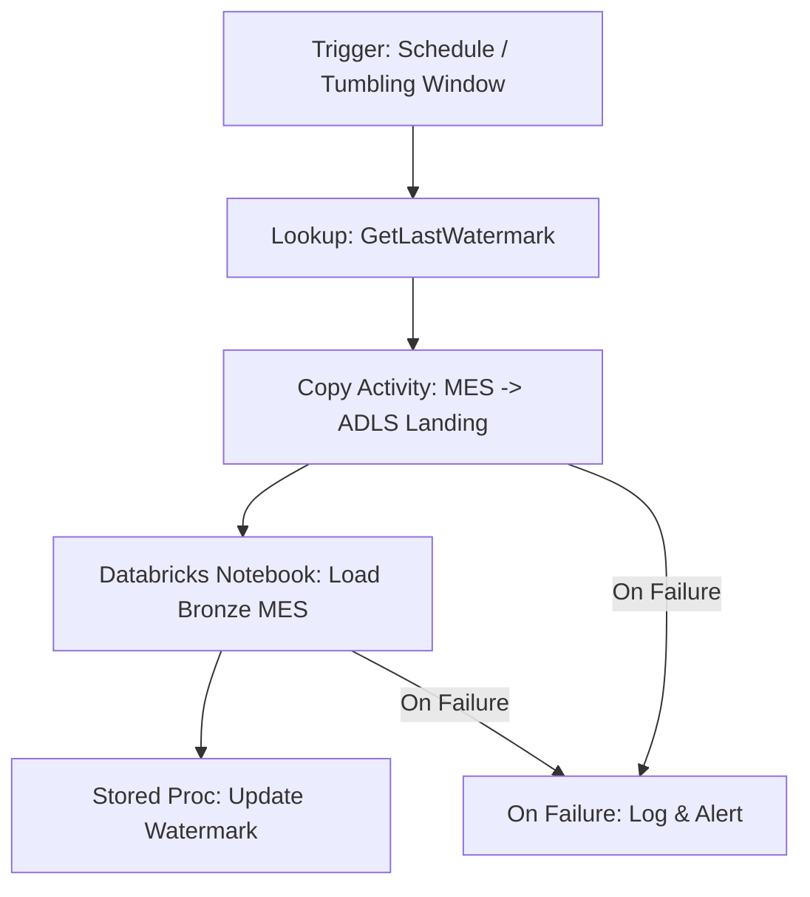
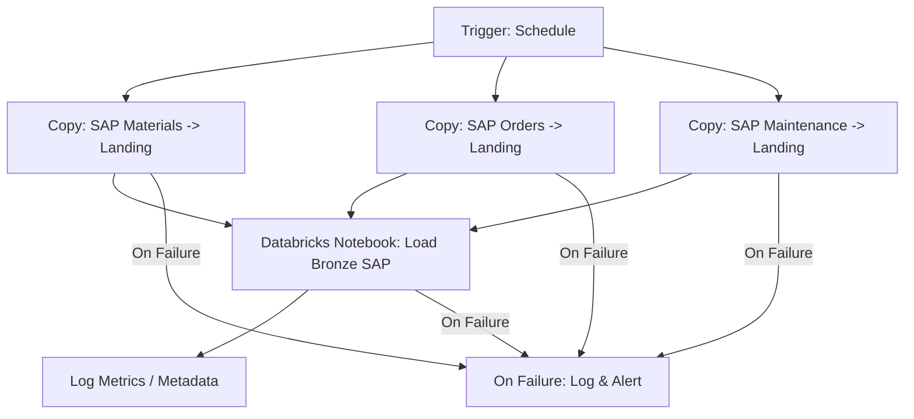
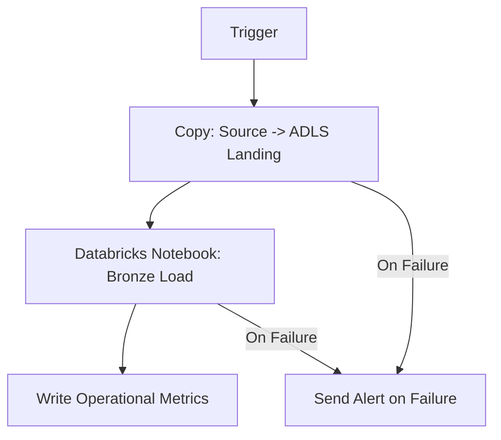
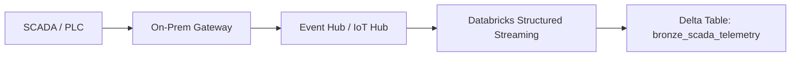
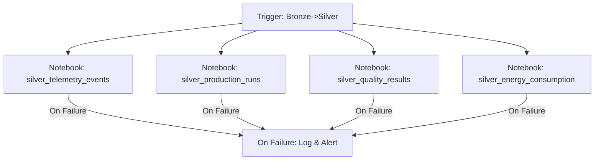
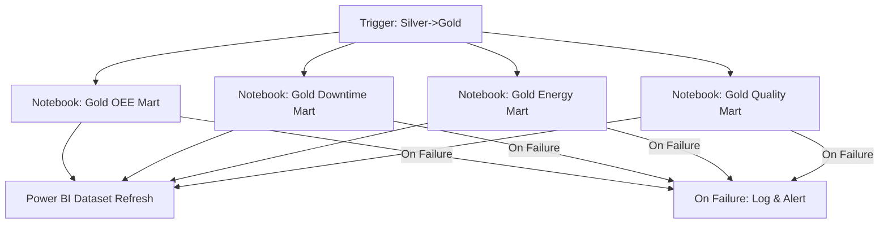

## Saint-Gobain – Manufacturing & Industrial Analytics Platform (Azure Data Engineering Design)

### 1. Business Context & Objectives

#### 1.1 Industry Context & Business Drivers

Saint-Gobain operates multiple manufacturing plants producing glass, insulation, and building materials. Each plant runs heterogeneous systems, and leadership wants a unified analytics platform on Azure to:

- **Improve Overall Equipment Effectiveness (OEE)** across plants.
- **Reduce unplanned downtime** via predictive maintenance.
- **Optimize energy consumption** and raw material usage.
- **Standardize KPIs** (OEE, scrap rate, throughput, MTBF, MTTR) across sites.

**Theoretical Foundation:**
- **OEE (Overall Equipment Effectiveness)** is a critical manufacturing metric calculated as: OEE = Availability × Performance × Quality
  - **Availability**: Percentage of scheduled time that equipment is available (excluding planned downtime)
  - **Performance**: Actual output vs. ideal output at optimal speed
  - **Quality**: Percentage of good parts vs. total parts produced
- **Industry 4.0 Principles**: This platform embodies Industry 4.0 concepts by integrating IoT sensors, real-time analytics, and predictive maintenance to create a "smart factory" ecosystem.
- **Data-Driven Manufacturing**: Moving from reactive to proactive operations through continuous monitoring, pattern recognition, and predictive analytics.

#### 1.2 Business Challenges & Pain Points

**Current State Issues:**
- **Data Silos**: Each plant operates independently with disparate systems (SCADA, MES, ERP, Quality systems) that don't communicate effectively.
- **Lack of Real-Time Visibility**: Plant managers cannot see real-time performance across multiple facilities, making it difficult to identify best practices and share learnings.
- **Reactive Maintenance**: Equipment failures are addressed reactively, leading to unplanned downtime, production losses, and increased maintenance costs.
- **Inconsistent Metrics**: Different plants calculate KPIs differently, making cross-plant comparisons unreliable.
- **Limited Predictive Capabilities**: Historical data exists but isn't leveraged for forecasting equipment failures, quality issues, or energy consumption patterns.

**Strategic Objectives:**
1. **Unified Data Platform**: Create a single source of truth that aggregates data from all manufacturing systems across all plants.
2. **Real-Time Monitoring**: Enable near real-time visibility into equipment performance, production status, and quality metrics.
3. **Predictive Analytics**: Implement machine learning models to predict equipment failures, quality defects, and optimize maintenance schedules.
4. **Standardized Reporting**: Establish consistent KPI definitions and calculation methods across all facilities.
5. **Cost Optimization**: Reduce energy consumption, minimize waste, and optimize raw material usage through data-driven insights.

#### 1.3 Solution Architecture Overview

The solution is an **Azure-native data platform** using **ADF for ingestion** and **Azure Databricks with a Medallion architecture (Bronze/Silver/Gold)** for processing and analytics, exposed to **Power BI** and data science workloads.

**Architecture Principles:**
- **Cloud-First Approach**: Leverage Azure's scalability, managed services, and pay-as-you-go model to reduce infrastructure overhead.
- **Medallion Architecture**: Implement a layered data architecture (Bronze → Silver → Gold) that progressively refines data quality and business value.
- **ELT over ETL**: Extract, Load, then Transform approach allows for flexible transformations and schema evolution without re-extracting source data.
- **Delta Lake Foundation**: Use Delta Lake format for ACID transactions, time travel, schema evolution, and efficient upserts.
- **Unified Catalog**: Unity Catalog provides centralized governance, security, and lineage tracking across all data assets.

---

### 2. Source Systems (5 Data Sources)

#### 2.1 Source System Architecture & Integration Patterns

**Integration Strategy:**
The platform integrates with five distinct source systems, each with different data characteristics, update frequencies, and integration requirements. The integration approach follows a **hybrid pattern** combining real-time streaming for time-sensitive data and batch processing for transactional systems.

**Data Volume & Velocity Considerations:**
- **High Volume, High Velocity**: SCADA/PLC telemetry generates millions of events per day per plant
- **Medium Volume, Medium Velocity**: MES and ERP systems produce thousands of transactions daily
- **Low Volume, Low Velocity**: Quality and Energy systems generate periodic snapshots and reports

---

#### 2.2 Source 1 – SCADA/PLC Telemetry (IoT/Time-Series)

**System Overview:**
- **Type**: Time-series data from SCADA (Supervisory Control and Data Acquisition) and PLC (Programmable Logic Controller) systems (per production line).
- **Industry Context**: SCADA systems are the backbone of industrial automation, monitoring and controlling physical processes in real-time. PLCs execute control logic at the machine level.

**Technical Details:**
- **Interface**: MQTT/OPC UA to an on-prem gateway, then to **Azure IoT Hub** / **Event Hub**.
  - **MQTT (Message Queuing Telemetry Transport)**: Lightweight messaging protocol ideal for IoT devices with low bandwidth and battery constraints.
  - **OPC UA (Open Platform Communications Unified Architecture)**: Industrial communication standard for secure, reliable data exchange between industrial equipment and enterprise systems.
  - **Azure IoT Hub**: Managed service for bidirectional communication with IoT devices, providing device management, security, and scalability.
  - **Event Hub**: High-throughput event streaming service capable of processing millions of events per second.

**Data Characteristics:**
- **Schema**: Timestamps, line_id, machine_id, sensor_readings (temperature, pressure, vibration, speed), status codes.
- **Frequency**: Continuous streaming (every few seconds to minutes depending on sensor type)
- **Volume**: 10-100 MB per hour per production line (varies by sensor density)
- **Latency Requirement**: Near real-time (sub-minute) for critical alerts, acceptable delay for historical analysis

**Integration Architecture:**
1. **Edge Layer**: On-premises IoT gateway aggregates sensor data from multiple PLCs/SCADA nodes
2. **Protocol Translation**: Gateway converts OPC UA/MQTT messages to Azure IoT Hub/Event Hub compatible format
3. **Cloud Ingestion**: Azure IoT Hub/Event Hub receives and buffers events
4. **Streaming Processing**: Databricks Structured Streaming consumes from Event Hub and writes to Bronze Delta tables

**Data Quality Considerations:**
- **Missing Values**: Sensors may fail or lose connectivity; implement gap detection and interpolation strategies
- **Outliers**: Erroneous readings due to sensor malfunction; apply statistical filters (e.g., Z-score, IQR)
- **Timestamp Synchronization**: Ensure all sensors use synchronized clocks (NTP) to maintain temporal accuracy

---

#### 2.3 Source 2 – Manufacturing Execution System (MES)

**System Overview:**
- **Type**: Relational database (on-prem SQL Server / Oracle).
- **Business Purpose**: MES systems track and control production processes, managing work orders, production schedules, material consumption, and quality data at the shop floor level.

**Technical Details:**
- **Interface**: Self-hosted **Integration Runtime** in ADF, using incremental extract of transaction tables.
  - **Self-Hosted Integration Runtime (SHIR)**: ADF component installed on-premises to enable secure connectivity to on-premises databases without exposing them to the internet.
  - **Incremental Extract Strategy**: Use Change Data Capture (CDC) or timestamp-based filtering to extract only changed/new records, reducing load on source systems and improving efficiency.

**Data Characteristics:**
- **Schema**: Work orders, shifts, production runs, machine states, operator logs, scrap reasons.
- **Frequency**: Batch extracts every 15-30 minutes (configurable per plant)
- **Volume**: 1-10 GB per day per plant (depends on transaction volume)
- **Latency Requirement**: Near real-time (15-30 minutes acceptable for operational reporting)

**Key Tables & Entities:**
- **Work Orders**: Production orders with material requirements, start/end times, quantities
- **Production Runs**: Actual production execution records with timestamps, quantities produced
- **Machine States**: Equipment status (running, idle, maintenance, breakdown)
- **Operator Logs**: Human operator actions, interventions, and notes
- **Scrap Reasons**: Quality rejections with categorization and root cause codes

**Extraction Strategy:**
- **Watermark Pattern**: Track `last_modified_timestamp` or `last_extract_id` to identify new/changed records
- **CDC (Change Data Capture)**: If source database supports CDC, use it for efficient change tracking
- **Partitioning**: Extract by plant_id and date to enable parallel processing and reduce query load

**Data Quality Considerations:**
- **Referential Integrity**: Ensure work orders reference valid materials and machines
- **Temporal Consistency**: Handle late-arriving transactions and backdated corrections
- **Data Completeness**: Validate that required fields (work_order_id, timestamp, quantity) are populated

---

#### 2.4 Source 3 – ERP (SAP S/4HANA or ECC)

**System Overview:**
- **Type**: SAP ERP (on-prem or hosted).
- **Business Purpose**: ERP systems manage enterprise-wide business processes including materials management, production planning, maintenance, and financial accounting.

**Technical Details:**
- **Interface**: **Azure Data Factory SAP connector** (ODP / OData / Table).
  - **ODP (Operational Data Provisioning)**: SAP's framework for real-time data extraction, preferred for SAP S/4HANA
  - **OData (Open Data Protocol)**: RESTful API protocol for accessing SAP data, suitable for cloud-to-cloud integration
  - **Table Extraction**: Direct table access for legacy systems or when ODP/OData unavailable

**Data Characteristics:**
- **Schema**: Materials, BOMs (Bill of Materials), routings, maintenance orders, cost centers, GL (General Ledger) postings.
- **Frequency**: Daily or hourly extracts depending on business requirements
- **Volume**: 5-50 GB per day (varies by SAP module usage and transaction volume)
- **Latency Requirement**: Daily for planning data, hourly for operational data

**Key Data Entities:**
- **Material Master**: Product definitions, specifications, units of measure, pricing
- **BOMs (Bill of Materials)**: Hierarchical structures defining components required for finished goods
- **Routings**: Manufacturing process definitions with operation sequences and time standards
- **Maintenance Orders**: Planned and unplanned maintenance work orders with equipment references
- **Cost Centers**: Organizational units for cost allocation and financial reporting
- **GL Postings**: Financial transactions for cost accounting and profitability analysis

**SAP-Specific Considerations:**
- **Client-Specific Data**: SAP systems use client (mandant) concept; ensure correct client selection
- **Language-Dependent Fields**: Handle multi-language text fields appropriately
- **Custom Tables**: Identify and extract custom Z-tables and Y-tables used by the organization
- **Authorization**: Ensure ADF service account has appropriate SAP authorizations (transaction codes, table access)

**Extraction Patterns:**
- **Full Load**: Initial historical load of master data (materials, BOMs, routings)
- **Incremental Load**: Delta extraction for transactional data (orders, postings) using ODP change pointers or timestamp fields
- **Snapshot Load**: Periodic full refresh for reference data that changes infrequently

---

#### 2.5 Source 4 – Quality Lab / LIMS

**System Overview:**
- **Type**: SQL database or CSV exports into a secure share.
- **Business Purpose**: LIMS (Laboratory Information Management System) manages quality testing, sample tracking, and compliance documentation for manufactured products.

**Technical Details:**
- **Interface**: ADF copy from **on-prem SQL via IR** or from **Azure File Share / SFTP**.
  - **SQL Database**: Direct database connection for real-time or near-real-time extraction
  - **File-Based**: CSV/Excel exports for systems that don't support direct database access
  - **Azure File Share / SFTP**: Secure file transfer for batch file delivery

**Data Characteristics:**
- **Schema**: Batch IDs, sampling timestamps, test parameters, pass/fail flags, defect codes.
- **Frequency**: Hourly or daily extracts (depends on testing frequency)
- **Volume**: 100 MB - 1 GB per day (varies by testing volume and number of test parameters)
- **Latency Requirement**: Near real-time for critical quality alerts, daily for historical reporting

**Key Data Entities:**
- **Batch IDs**: Unique identifiers linking quality tests to production batches
- **Sampling Timestamps**: When samples were taken from production
- **Test Parameters**: Specific measurements (e.g., thickness, color, strength, chemical composition)
- **Pass/Fail Flags**: Binary quality determination based on specification limits
- **Defect Codes**: Categorized reasons for quality failures (e.g., "thickness_out_of_spec", "color_variation")

**Quality Data Integration Challenges:**
- **Test Method Variations**: Different plants may use different test methods; standardize to common metrics
- **Specification Limits**: Product specifications may change over time; maintain version history
- **Lot Traceability**: Link quality results to specific production lots for root cause analysis
- **Regulatory Compliance**: Ensure data retention and audit trail requirements are met

---

#### 2.6 Source 5 – Energy & Utility Meters

**System Overview:**
- **Type**: CSV/JSON exports from energy monitoring system to an SFTP server or blob.
- **Business Purpose**: Track energy consumption (electricity, gas, water) across manufacturing facilities to optimize costs and reduce environmental impact.

**Technical Details:**
- **Interface**: ADF copy from **SFTP** into **Azure Data Lake Storage Gen2 (ADLS)**.
  - **SFTP (SSH File Transfer Protocol)**: Secure file transfer for batch file delivery
  - **Blob Storage**: Alternative if energy system can write directly to Azure Blob Storage
  - **File Formats**: CSV, JSON, or proprietary formats requiring custom parsing

**Data Characteristics:**
- **Schema**: Meter_id, plant_id, energy_usage_kwh, gas_usage, water_usage, peak demand, tariffs.
- **Frequency**: Hourly or daily extracts (depends on meter reading frequency)
- **Volume**: 10-100 MB per day per plant (depends on number of meters and reading frequency)
- **Latency Requirement**: Daily for cost allocation, hourly for real-time monitoring

**Key Data Entities:**
- **Meter IDs**: Unique identifiers for individual utility meters
- **Plant IDs**: Manufacturing facility identifiers
- **Energy Usage (kWh)**: Electricity consumption in kilowatt-hours
- **Gas Usage**: Natural gas consumption (cubic meters or therms)
- **Water Usage**: Water consumption (liters or gallons)
- **Peak Demand**: Maximum power demand during billing period (affects utility costs)
- **Tariffs**: Utility rate structures (time-of-use, tiered pricing, demand charges)

**Energy Data Integration Considerations:**
- **Unit Standardization**: Convert all energy units to common base units (kWh for electricity, standardized for gas/water)
- **Time Zone Handling**: Ensure meter readings are aligned with correct time zones and daylight saving time transitions
- **Missing Readings**: Handle gaps in meter readings due to communication failures or meter maintenance
- **Cost Calculation**: Integrate tariff information to calculate energy costs per plant, line, or product

---

#### 2.7 Source System Integration Best Practices

**Security & Connectivity:**
- **Network Security**: Use Virtual Private Networks (VPN), ExpressRoute, or Private Endpoints for secure connectivity
- **Authentication**: Implement service principal or managed identity authentication where possible
- **Credential Management**: Store connection strings and credentials in Azure Key Vault
- **Network Isolation**: Use Self-Hosted Integration Runtime for on-premises systems to avoid exposing databases to the internet

**Performance Optimization:**
- **Parallel Extraction**: Extract from multiple sources concurrently where dependencies allow
- **Incremental Loading**: Use watermark or CDC patterns to extract only changed data
- **Partitioning**: Partition large extractions by date, plant, or other logical boundaries
- **Compression**: Compress data during transfer to reduce network bandwidth and storage costs

**Error Handling & Resilience:**
- **Retry Logic**: Implement exponential backoff retry strategies for transient failures
- **Dead Letter Queues**: Capture failed records for manual review and reprocessing
- **Monitoring**: Track extraction success rates, data volumes, and latency metrics
- **Alerting**: Set up alerts for extraction failures, data quality issues, or SLA breaches

---

### 3. High-Level Architecture

#### 3.1 Architecture Overview & Design Principles

The platform follows a **modern data architecture pattern** combining batch and streaming processing, with clear separation of concerns across ingestion, storage, processing, and consumption layers. The architecture is designed for **scalability, reliability, and maintainability**.

**Core Design Principles:**
1. **Separation of Concerns**: Each layer has a distinct responsibility (ingestion, storage, processing, consumption)
2. **Scalability**: Architecture scales horizontally to handle growing data volumes and user concurrency
3. **Reliability**: Built-in fault tolerance, retry mechanisms, and data quality checks
4. **Governance**: Centralized security, access control, and data lineage tracking
5. **Cost Optimization**: Right-size compute resources, use serverless where appropriate, optimize storage tiers

---

#### 3.2 Ingestion & Orchestration Layer

**Azure Data Factory (ADF) - Central Orchestration Engine**

**Purpose & Role:**
- **Central Orchestration**: ADF serves as the control plane for all data movement and transformation workflows
- **Schedule Management**: Manages complex scheduling with dependencies, time windows, and event-driven triggers
- **Monitoring & Alerting**: Provides comprehensive monitoring dashboards, pipeline execution history, and alerting capabilities

**Key Capabilities:**
- **Pipeline Orchestration**: Define multi-step workflows with conditional logic, loops, and error handling
- **Activity Types**: Support for 90+ connectors, data transformations, and control flow activities
- **Integration Runtimes**: 
  - **Azure Integration Runtime**: For cloud-to-cloud data movement
  - **Self-Hosted Integration Runtime**: For on-premises to cloud connectivity
  - **Azure-SSIS Integration Runtime**: For running SQL Server Integration Services packages

**ADF Pipeline Patterns:**
- **Watermark Pattern**: Track last successful extraction timestamp to enable incremental loads
- **Fan-Out Pattern**: Parallel execution of independent activities to improve throughput
- **Fan-In Pattern**: Consolidate results from multiple parallel activities
- **Error Handling Pattern**: Implement retry logic, dead letter queues, and notification mechanisms

**Event Hub / IoT Hub - Real-Time Streaming Infrastructure**

**Purpose & Role:**
- **Event Streaming**: High-throughput event ingestion for time-series telemetry data
- **Buffering**: Temporary storage buffer for streaming data before processing
- **Scalability**: Automatically scales to handle millions of events per second

**Event Hub vs IoT Hub Selection:**
- **IoT Hub**: Use when device management, bidirectional communication, and device authentication are required
- **Event Hub**: Use for pure event streaming scenarios with high throughput requirements

**Streaming Architecture:**
- **Partitioning**: Events are partitioned across multiple partitions for parallel processing
- **Consumer Groups**: Multiple consumers can read from the same Event Hub independently
- **Checkpointing**: Databricks Structured Streaming uses checkpoints to track processing progress and enable fault recovery

---

#### 3.3 Storage Layer

**Azure Data Lake Storage Gen2 (ADLS Gen2) - Unified Data Lake**

**Purpose & Role:**
- **Single Logical Data Lake**: Centralized storage for all data assets across Bronze, Silver, and Gold layers
- **Hierarchical Namespace**: Combines blob storage with file system semantics for efficient directory operations
- **Cost Optimization**: Multiple storage tiers (Hot, Cool, Archive) to optimize costs based on access patterns

**Storage Architecture:**
- **Container Structure**: 
  ```
  manufacturing-lake/
  ├── bronze/          # Raw, immutable source data
  ├── silver/          # Cleaned, conformed data
  ├── gold/            # Curated business marts
  └── landing/         # Temporary staging area for ADF copies
  ```

**Delta Lake Format:**
- **ACID Transactions**: Ensures data consistency even with concurrent writes
- **Time Travel**: Query historical versions of data for auditing and debugging
- **Schema Evolution**: Automatically handle schema changes without breaking existing queries
- **Upsert Support**: Efficient MERGE operations for incremental updates
- **Compaction**: Automatic optimization of small files into larger, efficient files

**Partitioning Strategy:**
- **Bronze Layer**: Partition by `ingestion_date` and `source_system` for efficient querying and lifecycle management
- **Silver Layer**: Partition by `plant_id`, `line_id`, `event_date` aligned with query patterns
- **Gold Layer**: Partition by `fiscal_year_month`, `plant_id`, `product_category` for analytical workloads

**Storage Best Practices:**
- **Lifecycle Management**: Automatically move old data to Cool/Archive tiers based on access patterns
- **Access Control**: Use Azure AD and POSIX-like ACLs for fine-grained access control
- **Encryption**: Enable encryption at rest using Microsoft-managed or customer-managed keys
- **Versioning**: Enable blob versioning for critical data to protect against accidental deletion

---

#### 3.4 Processing / Transformation Layer

**Azure Databricks - Unified Analytics Platform**

**Purpose & Role:**
- **Unified Analytics**: Single platform for ETL/ELT, streaming, SQL analytics, and machine learning
- **Medallion Architecture Implementation**: Orchestrates data flow through Bronze → Silver → Gold layers
- **Delta Lake Foundation**: Native support for Delta Lake format with optimized operations

**Unity Catalog - Centralized Governance**

**Purpose:**
- **Unified Metadata**: Single source of truth for all data assets across workspaces
- **Fine-Grained Access Control**: Table-level and column-level security with row-level filtering
- **Data Lineage**: Track data flow from source systems through transformations to consumption
- **Audit Logging**: Comprehensive audit trail of all data access and modifications

**Workload Types & Optimization:**

1. **ETL/ELT Jobs (Batch Processing)**
   - **Purpose**: Transform data from Bronze to Silver to Gold layers
   - **Cluster Configuration**: Use job clusters with auto-scaling for cost efficiency
   - **Optimization**: 
     - Use Delta Lake Z-ordering and partitioning for query performance
     - Implement incremental processing to avoid full table scans
     - Leverage Delta Lake caching for frequently accessed reference data

2. **Structured Streaming Jobs**
   - **Purpose**: Process real-time telemetry data from Event Hub
   - **Micro-Batch Processing**: Process events in small batches (e.g., every 30 seconds to 5 minutes)
   - **Checkpointing**: Maintain checkpoints for fault tolerance and exactly-once processing
   - **Watermarking**: Handle late-arriving events using watermark strategies

3. **ML Feature Engineering**
   - **Purpose**: Prepare features for machine learning models
   - **Feature Store**: Use Databricks Feature Store for centralized feature management and versioning
   - **Feature Pipelines**: Automated feature computation pipelines that refresh features on schedule

4. **Model Training & Scoring**
   - **MLflow Integration**: Track experiments, log models, and manage model registry
   - **Distributed Training**: Leverage Spark for distributed model training on large datasets
   - **Model Serving**: Deploy models for batch scoring or real-time inference

**Cluster Management:**
- **Job Clusters**: Ephemeral clusters that start for job execution and terminate after completion
- **All-Purpose Clusters**: Long-running clusters for interactive development and ad-hoc analysis
- **Auto-Scaling**: Automatically scale cluster size based on workload demand
- **Instance Pools**: Pre-warm clusters to reduce startup time for time-sensitive jobs

---

#### 3.5 Serving / Consumption Layer

**Power BI - Business Intelligence & Visualization**

**Purpose & Role:**
- **Self-Service Analytics**: Enable business users to explore data and create reports without technical expertise
- **Semantic Models**: Pre-built data models with business logic, calculations, and relationships
- **Dashboards**: Real-time operational dashboards for plant managers and executives

**Integration Patterns:**
- **Direct Lake**: Direct query from Delta Lake tables (preferred for large datasets, no data duplication)
- **DirectQuery**: Live connection to Databricks SQL endpoint (real-time data, limited by query performance)
- **Import Mode**: Import data into Power BI dataset (fast queries, requires refresh schedule)

**Key Dashboards:**
- **OEE Dashboard**: Real-time OEE metrics by plant, line, shift with drill-down capabilities
- **Downtime Analysis**: Root cause analysis, downtime trends, and maintenance scheduling
- **Energy Analytics**: Energy consumption trends, cost analysis, and efficiency metrics
- **Quality Dashboard**: Defect rates, quality trends, and compliance tracking

**Databricks SQL - SQL Analytics & Ad-Hoc Analysis**

**Purpose & Role:**
- **SQL Endpoint**: Serverless SQL compute for querying Delta Lake tables
- **Ad-Hoc Analysis**: Enable data analysts to write SQL queries without managing clusters
- **BI Tool Integration**: Connect third-party BI tools (Tableau, Qlik, Looker) via JDBC/ODBC

**Key Capabilities:**
- **Query Performance**: Optimized query engine with automatic query optimization
- **Cost Efficiency**: Pay only for query execution time (serverless model)
- **Concurrency**: Support for multiple concurrent users without cluster management overhead

**ML/AI - Advanced Analytics & Predictive Models**

**Purpose & Role:**
- **Predictive Maintenance**: ML models to predict equipment failures before they occur
- **Quality Prediction**: Forecast quality defects based on process parameters and historical patterns
- **Energy Optimization**: Models to optimize energy consumption based on production schedules

**MLflow Integration:**
- **Experiment Tracking**: Log parameters, metrics, and artifacts for all model training runs
- **Model Registry**: Centralized repository for model versions with stage management (Staging, Production)
- **Model Deployment**: Deploy models for batch scoring or real-time inference via REST APIs

**Key Use Cases:**
- **Anomaly Detection**: Identify unusual patterns in sensor data that may indicate equipment issues
- **Time Series Forecasting**: Predict future production volumes, energy consumption, or quality metrics
- **Classification Models**: Classify downtime events, quality defects, or maintenance priorities

---

### 4. Medallion Architecture Design (Bronze / Silver / Gold)

#### 4.1 Medallion Architecture: Theoretical Foundation

**Concept & Origin:**
The Medallion Architecture (also known as the Bronze-Silver-Gold architecture) is a data lakehouse pattern that progressively refines data quality and business value through three distinct layers. This pattern was popularized by Databricks and is now widely adopted in modern data platforms.

**Core Principles:**
1. **Progressive Data Quality**: Each layer improves data quality, structure, and business value
2. **Immutable Raw Data**: Bronze layer preserves original source data for auditability and reprocessing
3. **Incremental Refinement**: Data flows unidirectionally from Bronze → Silver → Gold, with each layer adding value
4. **Separation of Concerns**: Each layer serves a distinct purpose (raw storage, cleansing, business modeling)
5. **Schema Evolution**: Delta Lake enables schema changes without breaking downstream consumers

**Benefits:**
- **Data Lineage**: Clear traceability from source to consumption
- **Reprocessing Capability**: Can reprocess Silver/Gold from Bronze if business rules change
- **Flexibility**: Multiple consumers can access different layers based on their needs
- **Cost Optimization**: Store raw data in cheaper storage, optimize frequently accessed layers

---

#### 4.2 Bronze Layer (Raw Ingestion)

**Purpose & Philosophy:**
- **Immutable Raw Representation**: Bronze layer stores data exactly as received from source systems, with minimal transformations
- **Preserve Lineage**: Maintains connection to source system, extraction timestamp, and original format
- **Audit Trail**: Provides historical record for compliance, debugging, and data quality investigations
- **Reprocessing Foundation**: Enables reprocessing of Silver/Gold layers if business rules or source data corrections occur

**Storage Pattern:**
- **Container or Root Folder**: `adls://manufacturing-lake/bronze/`
- **Partitioning Strategy**:
  - Primary: `ingestion_date` (YYYY-MM-DD) for efficient date-based queries and lifecycle management
  - Secondary: `plant_id` or `source_system` for multi-tenant isolation and parallel processing
  - Example: `/bronze/scada/plant_001/2024/01/15/`
- **File Format**: All tables stored as **Delta Lake** format
  - **Rationale**: Delta provides ACID transactions, schema evolution, and efficient upserts even for append-only workloads
  - **Alternative Consideration**: Parquet for pure append-only scenarios, but Delta is preferred for flexibility

**Bronze Tables (Detailed Examples):**

1. **`bronze_scada_telemetry`**
   - **Source**: Event Hub / IoT Hub capture (JSON/Avro format)
   - **Ingestion Method**: 
     - **Streaming**: Databricks Structured Streaming job reads from Event Hub and writes to Delta
     - **Alternative**: Event Hub → ADF → ADLS (for batch processing scenarios)
   - **Schema**: 
     ```sql
     timestamp: timestamp
     line_id: string
     machine_id: string
     sensor_type: string
     sensor_value: double
     status_code: string
     ingestion_timestamp: timestamp
     source_file: string (for batch loads)
     ```
   - **Data Characteristics**: High volume (millions of records per day), append-only, time-series nature
   - **Partitioning**: By `ingestion_date` and `plant_id` for efficient time-range queries

2. **`bronze_mes_production`**
   - **Source**: MES relational database (SQL Server/Oracle)
   - **Ingestion Method**: Incremental extracts via ADF using CDC or timestamp-based filtering
   - **Schema**: Mirrors source MES tables with additional metadata columns
   - **Key Fields**: work_order_id, production_run_id, start_time, end_time, quantity_produced, scrap_quantity
   - **Incremental Strategy**: Watermark pattern tracking `last_modified_timestamp`

3. **`bronze_sap_materials`, `bronze_sap_orders`**
   - **Source**: SAP ERP system via ODP/OData/Table extraction
   - **Ingestion Method**: ADF SAP connector with scheduled extracts
   - **Schema**: SAP table structures with additional extraction metadata
   - **Update Pattern**: Full load for master data (materials), incremental for transactional data (orders)

4. **`bronze_quality_tests`**
   - **Source**: LIMS database or CSV exports
   - **Ingestion Method**: ADF copy from SQL or file-based sources
   - **Schema**: Batch_id, test_timestamp, test_parameters, results, pass/fail flags

5. **`bronze_energy_meters`**
   - **Source**: Energy monitoring system exports (CSV/JSON)
   - **Ingestion Method**: ADF copy from SFTP or Blob Storage
   - **Schema**: Meter_id, reading_timestamp, energy_kwh, gas_usage, water_usage, peak_demand

**ADF Role in Bronze Ingestion:**

**Two-Stage Pattern:**
1. **Stage 1 - Landing**: ADF Copy activities land raw data into ADLS landing folders
   - Example: `/landing/mes/2024/01/15/14/30/work_orders_20240115_1430.csv`
   - Purpose: Temporary staging area before Bronze ingestion
   - Benefits: Decouples extraction from transformation, enables retry without re-extraction

2. **Stage 2 - Bronze Load**: Databricks Notebook activities (invoked by ADF) read landing data and write to Bronze Delta tables
   - **Notebook Responsibilities**:
     - Parse file formats (CSV, JSON, Parquet)
     - Apply basic schema mapping and type casting
     - Add metadata columns (ingestion_timestamp, source_system, file_name)
     - Handle schema evolution (add new columns, handle missing fields)
     - Write to Delta tables with append operation
   - **Error Handling**: Capture failed records in separate error tables for investigation

**Streaming Exception:**
- For SCADA telemetry, Databricks Structured Streaming writes directly to Bronze Delta tables
- ADF role is minimal (job deployment/monitoring) or non-existent
- Streaming jobs use checkpointing for fault tolerance and exactly-once processing

**Data Quality at Bronze Layer:**
- **Minimal Validation**: Only structural validation (schema compliance, required fields)
- **No Business Rules**: Preserve all data, including invalid records (flag for downstream processing)
- **Metadata Capture**: Record extraction timestamp, source system version, file checksums
- **Error Records**: Log parsing errors, schema mismatches to separate error tables

#### 4.3 Silver Layer (Cleansed & Conformed)

**Purpose & Philosophy:**
- **Cleaned & Standardized**: Silver layer applies data quality rules, handles missing values, and standardizes formats
- **Conformed Entities**: Creates unified business entities that integrate data from multiple source systems
- **Data Quality Enforcement**: Validates business rules, referential integrity, and data completeness
- **Business Key Standardization**: Unifies identifiers across systems (e.g., plant codes, material codes, equipment IDs)
- **Ready for Analytics**: Data is clean enough for analytical queries but not yet optimized for specific business use cases

**Storage Pattern:**
- **Root Folder**: `adls://manufacturing-lake/silver/`
- **Partitioning Strategy**:
  - Aligned with query patterns for optimal performance
  - Common patterns: `plant_id`, `line_id`, `event_date` (YYYY-MM-DD)
  - Example: `/silver/telemetry_events/plant_id=001/event_date=2024-01-15/`
- **File Format**: Delta Lake format for ACID transactions and efficient upserts

**Transformation Categories:**

1. **Data Quality & Cleansing**:
   - **Missing Value Handling**:
     - **Strategy Selection**: Mean/median imputation for numeric, mode for categorical, forward-fill for time-series
     - **Context-Aware**: Different strategies for different data types (sensor readings vs. categorical codes)
     - **Flagging**: Mark imputed values for transparency in downstream analysis
   - **Outlier Detection & Treatment**:
     - **Statistical Methods**: Z-score, IQR (Interquartile Range), modified Z-score for robust outlier detection
     - **Domain Knowledge**: Apply business rules (e.g., temperature cannot exceed 1000°C for glass production)
     - **Treatment Options**: Cap/floor values, remove outliers, flag for investigation
   - **Invalid Data Handling**:
     - **Schema Validation**: Ensure data types match expected formats (dates, numbers, strings)
     - **Range Validation**: Check values against valid ranges (e.g., percentages 0-100, positive quantities)
     - **Format Validation**: Validate string formats (e.g., email, phone numbers, codes)

2. **Data Type & Format Standardization**:
   - **Timestamp Normalization**:
     - Convert all timestamps to UTC for consistency
     - Preserve original timezone information in separate columns if needed
     - Handle daylight saving time transitions correctly
   - **Numeric Standardization**:
     - Enforce consistent numeric types (decimal precision, integer vs. float)
     - Handle unit conversions (e.g., convert all temperatures to Celsius)
   - **String Standardization**:
     - Trim whitespace, normalize case (upper/lower as appropriate)
     - Remove special characters, standardize encoding (UTF-8)

3. **Business Rules Application**:
   - **Machine State Derivation**:
     - Combine sensor readings, MES status, and operator logs to determine actual machine state
     - Handle ambiguous states (e.g., machine running but no production)
   - **Production Run State Calculation**:
     - Identify run start/end times from MES events
     - Calculate runtime, idle time, setup time, downtime
     - Classify downtime types (planned maintenance, unplanned breakdown, changeover)
   - **Scrap Classification**:
     - Categorize scrap reasons into standard taxonomies
     - Link scrap events to production runs and quality tests
     - Calculate scrap rates and costs

4. **Key Standardization & Master Data Integration**:
   - **Plant Code Unification**:
     - Map various plant identifiers (SCADA plant_id, MES facility_code, SAP plant_code) to standard plant_id
     - Maintain mapping table for reference
   - **Line Code Standardization**:
     - Unify production line identifiers across systems
     - Handle cases where one logical line has multiple physical machines
   - **Material Code Harmonization**:
     - Map material codes from different systems (MES material_id, SAP material_number) to standard SKU
     - Handle material variants, revisions, and supersessions
   - **Equipment Hierarchy**:
     - Build unified equipment hierarchy (Plant → Line → Machine → Component)
     - Enrich from SAP PM (Plant Maintenance) master data

**Silver Tables (Detailed Examples):**

1. **`silver_telemetry_events`**
   - **Source**: `bronze_scada_telemetry` enriched with master data
   - **Transformations**:
     - Filter invalid sensor readings (outliers, missing values)
     - Join with plant/line master data to add hierarchy
     - Standardize sensor value units (e.g., all temperatures in Celsius)
     - Derive derived metrics (e.g., rate of change, moving averages)
   - **Schema**:
     ```sql
     event_timestamp: timestamp (UTC)
     plant_id: string (standardized)
     line_id: string (standardized)
     machine_id: string (standardized)
     sensor_type: string
     sensor_value: double (cleansed)
     sensor_value_raw: double (original, for audit)
     is_imputed: boolean
     is_outlier: boolean
     plant_name: string (from master data)
     line_name: string (from master data)
     ```
   - **Partitioning**: `plant_id`, `event_date`

2. **`silver_production_runs`**
   - **Source**: `bronze_mes_production` combined with SAP order data
   - **Transformations**:
     - Normalize production run records (handle duplicates, merge related events)
     - Calculate run duration, quantity produced, scrap quantity
     - Enrich with material master data (material_name, specifications)
     - Link to work orders and production orders from SAP
   - **Schema**:
     ```sql
     production_run_id: string
     plant_id: string
     line_id: string
     work_order_id: string
     material_id: string (standardized)
     material_name: string
     start_timestamp: timestamp
     end_timestamp: timestamp
     duration_minutes: double
     quantity_produced: double
     quantity_scrap: double
     scrap_rate: double (calculated)
     run_status: string (completed, in_progress, cancelled)
     ```
   - **Partitioning**: `plant_id`, `run_date` (derived from start_timestamp)

3. **`silver_material_master`**
   - **Source**: `bronze_sap_materials` with enrichment from MES
   - **Transformations**:
     - Consolidate material definitions from multiple systems
     - Standardize material attributes (units, categories, specifications)
     - Handle material revisions and supersessions
   - **Purpose**: Master data reference table for other Silver/Gold tables

4. **`silver_quality_results`**
   - **Source**: `bronze_quality_tests` enriched with production and material data
   - **Transformations**:
     - Link quality tests to production batches and lots
     - Standardize test parameter names and units
     - Calculate pass/fail based on specification limits
     - Flag critical quality events for alerting
   - **Partitioning**: `plant_id`, `test_date`

5. **`silver_energy_consumption`**
   - **Source**: `bronze_energy_meters` with time alignment
   - **Transformations**:
     - Standardize energy units (all to kWh equivalent)
     - Align meter readings to standard time buckets (hourly, daily)
     - Handle missing readings (interpolation, forward-fill)
     - Calculate costs using tariff information
   - **Partitioning**: `plant_id`, `reading_date`

**Implementation in Databricks:**

**Processing Strategy:**
- **Incremental Processing**: Read only new/changed records from Bronze using watermark or change detection
- **Upsert Pattern**: Use Delta Lake MERGE INTO for idempotent updates
  ```sql
  MERGE INTO silver_telemetry_events AS target
  USING bronze_updates AS source
  ON target.event_id = source.event_id
  WHEN MATCHED THEN UPDATE SET ...
  WHEN NOT MATCHED THEN INSERT ...
  ```
- **Batch Processing**: Process in micro-batches (15 minutes to 1 hour) for near real-time analytics
- **Streaming Processing**: For high-velocity data (SCADA), use Structured Streaming with windowing

**ADF Orchestration:**
- **Trigger Strategy**: 
  - Time-based triggers (every 15 minutes for MES, hourly for energy)
  - Event-based triggers (after successful Bronze ingestion)
  - Dependency-based (wait for multiple Bronze sources before Silver processing)
- **Job Execution**: ADF invokes Databricks jobs (notebooks or workflows) via Databricks Notebook activity
- **Error Handling**: Capture transformation failures, log to error tables, send alerts

**Data Quality Monitoring:**
- **Quality Metrics**: Track data quality scores (completeness, validity, consistency)
- **Anomaly Detection**: Flag unusual patterns (sudden spikes in missing values, outlier rates)
- **Data Profiling**: Generate statistics (distributions, cardinality, null rates) for monitoring
- **Alerting**: Notify data engineers when quality thresholds are breached

#### 4.4 Gold Layer (Curated & Business-Ready)

**Purpose & Philosophy:**
- **Analytics-Optimized**: Gold layer is designed specifically for analytical workloads and business intelligence
- **Star Schema Design**: Implements dimensional modeling (Kimball methodology) for intuitive querying and reporting
- **Business Metrics**: Pre-calculated KPIs and aggregates to enable fast dashboard performance
- **Use Case Specific**: Each Gold mart serves a specific business domain (OEE, downtime, energy, quality)
- **Performance Tuned**: Optimized partitioning, indexing, and file sizes for query performance

**Storage Pattern:**
- **Root Folder**: `adls://manufacturing-lake/gold/`
- **Partitioning Strategy**:
  - Aligned with analytical query patterns and business reporting cycles
  - Common patterns: `fiscal_year`, `fiscal_month`, `plant_id`, `product_category`
  - Example: `/gold/oee_mart/fact_oee/fiscal_year=2024/fiscal_month=01/plant_id=001/`
- **File Format**: Delta Lake format with Z-ordering and Bloom filters for optimal query performance

**Dimensional Modeling Principles:**

**Star Schema Structure:**
- **Fact Tables**: Contain business metrics and measurements (e.g., OEE%, downtime hours, energy consumption)
- **Dimension Tables**: Contain descriptive attributes for slicing and dicing (e.g., plant, time, material, shift)
- **Grain Definition**: Clearly defined fact table grain (e.g., one row per line per shift per day)
- **Slowly Changing Dimensions (SCD)**: Handle dimension changes over time (Type 1: overwrite, Type 2: historical tracking)

**Key Gold Models (Detailed):**

1. **OEE Mart (Overall Equipment Effectiveness)**

   **Business Context:**
   - OEE is the gold standard metric for manufacturing efficiency
   - Formula: OEE = Availability × Performance × Quality
   - Target OEE: World-class manufacturing typically achieves 85%+ OEE

   **Fact Table: `fact_oee`**
   - **Grain**: One row per production line per shift per day (or per hour for real-time dashboards)
   - **Key Metrics**:
     ```sql
     -- Availability Metrics
     planned_production_time_minutes: double
     actual_runtime_minutes: double
     downtime_minutes: double (planned + unplanned)
     availability_percent: double (actual_runtime / planned_production_time)
     
     -- Performance Metrics
     ideal_output_quantity: double (at optimal speed)
     actual_output_quantity: double
     performance_percent: double (actual_output / ideal_output)
     
     -- Quality Metrics
     total_quantity_produced: double
     good_quantity: double (total - scrap)
     scrap_quantity: double
     quality_percent: double (good_quantity / total_quantity)
     
     -- Overall OEE
     oee_percent: double (availability × performance × quality)
     
     -- Additional Metrics
     throughput_per_hour: double
     scrap_rate_percent: double
     ```
   - **Foreign Keys**: plant_id, line_id, material_id, shift_id, time_id (dimension keys)
   - **Partitioning**: `fiscal_year`, `fiscal_month`, `plant_id`

   **Dimension Tables:**
   - **`dim_plant`**: Plant attributes (name, location, region, capacity, manager)
   - **`dim_production_line`**: Line attributes (line_name, line_type, capacity, technology)
   - **`dim_time`**: Time hierarchy (date, day_of_week, week, month, quarter, year, fiscal_period)
   - **`dim_material`**: Material attributes (SKU, description, category, specifications)
   - **`dim_shift`**: Shift definitions (shift_name, start_time, end_time, shift_type)

   **Data Sources**: 
   - `silver_production_runs` (for runtime, quantities)
   - `silver_telemetry_events` (for machine states, downtime)
   - `silver_quality_results` (for scrap quantities)

2. **Downtime & Maintenance Mart**

   **Business Context:**
   - Track and analyze equipment downtime to identify root causes and optimize maintenance strategies
   - Support predictive maintenance initiatives

   **Fact Table: `fact_downtime_events`**
   - **Grain**: One row per downtime event
   - **Key Metrics**:
     ```sql
     downtime_start_timestamp: timestamp
     downtime_end_timestamp: timestamp
     downtime_duration_minutes: double
     downtime_type: string (planned_maintenance, unplanned_breakdown, changeover, setup)
     downtime_category: string (mechanical, electrical, material, operator)
     root_cause_code: string
     maintenance_order_id: string (from SAP)
     production_loss_quantity: double (estimated)
     cost_impact_usd: double
     ```
   - **Enrichment**: Join with SAP maintenance orders for maintenance history and costs
   - **Partitioning**: `plant_id`, `downtime_date`

   **Dimension Tables:**
   - **`dim_downtime_reason`**: Hierarchical downtime reason taxonomy
   - **`dim_maintenance_type`**: Maintenance categories (preventive, corrective, predictive)

3. **Energy Efficiency Mart**

   **Business Context:**
   - Monitor and optimize energy consumption to reduce costs and environmental impact
   - Calculate energy intensity metrics (energy per unit produced)

   **Fact Table: `fact_energy_usage`**
   - **Grain**: One row per plant per time period (hourly or daily)
   - **Key Metrics**:
     ```sql
     energy_consumption_kwh: double
     gas_consumption_therms: double
     water_consumption_liters: double
     peak_demand_kw: double
     production_quantity_tons: double (from production runs)
     energy_intensity_kwh_per_ton: double (calculated)
     energy_cost_usd: double (calculated using tariffs)
     co2_equivalent_kg: double (calculated from energy mix)
     ```
   - **Data Sources**: 
     - `silver_energy_consumption` (meter readings)
     - `silver_production_runs` (production quantities for intensity calculations)
   - **Partitioning**: `plant_id`, `usage_date`

4. **Quality Analytics Mart**

   **Business Context:**
   - Track quality defects and trends to identify process improvements
   - Support root cause analysis and quality improvement initiatives

   **Fact Table: `fact_quality_defects`**
   - **Grain**: One row per quality defect event
   - **Key Metrics**:
     ```sql
     defect_timestamp: timestamp
     batch_id: string
     lot_id: string
     defect_type: string
     defect_severity: string (critical, major, minor)
     quantity_affected: double
     defect_rate_percent: double
     cost_impact_usd: double
     containment_action: string
     ```
   - **Data Sources**: `silver_quality_results` enriched with production and material data
   - **Partitioning**: `plant_id`, `defect_date`

   **Dimension Tables:**
   - **`dim_defect_type`**: Defect classification hierarchy
   - **`dim_quality_specification`**: Specification limits and standards

**Additional Gold Tables:**

5. **ML Feature Tables**
   - **Purpose**: Pre-computed features for machine learning models
   - **Examples**:
     - **Predictive Maintenance Features**: Rolling averages, trend indicators, anomaly scores
     - **Quality Prediction Features**: Process parameter aggregations, material characteristics
   - **Refresh Frequency**: Updated in near real-time or hourly depending on model requirements

6. **Aggregate Tables**
   - **Purpose**: Pre-aggregated summaries for fast dashboard queries
   - **Examples**:
     - Daily/Weekly/Monthly OEE summaries
     - Plant-level energy consumption aggregates
     - Quality defect trend summaries

**Consumption Patterns:**

1. **Power BI Integration**:
   - **Direct Lake Mode** (Preferred): 
     - Direct query from Delta Lake tables without data duplication
     - Supports large datasets (billions of rows)
     - Real-time data access (no refresh delay)
     - Requires Power BI Premium or Fabric capacity
   - **DirectQuery Mode**:
     - Live connection to Databricks SQL endpoint
     - Real-time data, but limited by query performance
     - Suitable for smaller datasets or when Direct Lake unavailable
   - **Import Mode**:
     - Import data into Power BI dataset
     - Fast queries, but requires scheduled refresh
     - Suitable for smaller datasets or when real-time not required

2. **Databricks SQL**:
   - **SQL Endpoint**: Serverless SQL compute for ad-hoc queries
   - **BI Tool Integration**: Connect Tableau, Qlik, Looker via JDBC/ODBC
   - **Self-Service Analytics**: Enable analysts to write SQL queries without managing clusters

3. **Machine Learning**:
   - **Feature Store**: Use Databricks Feature Store for centralized feature management
   - **Model Training**: Read from Gold feature tables for model training
   - **Batch Scoring**: Score large datasets using Gold feature tables
   - **Real-Time Inference**: Serve models with features computed from Gold tables

**Performance Optimization:**
- **Z-Ordering**: Optimize Delta tables with Z-ordering on frequently filtered columns
- **Bloom Filters**: Create Bloom filters on high-cardinality columns for fast lookups
- **Compaction**: Regularly compact small files into larger, efficient files
- **Caching**: Cache frequently accessed dimension tables in memory
- **Materialized Views**: Create materialized views for common query patterns (if supported)

---

### 5. ADF Orchestration & Data Pipelines (End-to-End Flow)

#### 5.1 Ingestion Pipelines (Per Source)

- **Pipeline: `pl_ingest_mes`**
  - Activities:
    - `Copy_mes_to_landing`: MES → ADLS `/landing/mes/` (incremental via `last_modified` or CDC).
    - `Notebook_bronze_mes`: Databricks notebook activity to ingest landing files into `bronze_mes_production` Delta.
  - Triggers:
    - Scheduled every 15–30 minutes (configurable per plant).

- **Pipeline: `pl_ingest_sap`**
  - Activities:
    - `Copy_sap_materials`, `Copy_sap_orders` from SAP connector to `/landing/sap/`.
    - `Notebook_bronze_sap`: Consolidate into `bronze_sap_materials`, `bronze_sap_orders`.
  - Triggers:
    - Daily or hourly schedule depending on business requirements.

- **Pipeline: `pl_ingest_quality`**
  - Activities:
    - `Copy_quality_to_landing`: From on-prem SQL or SFTP to `/landing/quality/`.
    - `Notebook_bronze_quality`: Load into `bronze_quality_tests`.

- **Pipeline: `pl_ingest_energy`**
  - Activities:
    - `Copy_energy_to_landing`: From SFTP/Blob to `/landing/energy/`.
    - `Notebook_bronze_energy`: Load into `bronze_energy_meters`.

- **Pipeline: `pl_scada_streaming`**
  - For SCADA, ingestion is typically streaming:
    - A Databricks **structured streaming job** reads from Event Hub / IoT Hub and writes directly to `bronze_scada_telemetry` (Delta) with checkpointing.
    - ADF may be used only for job deployment/start/stop or monitoring.

#### 5.2 Transformation Pipelines (Bronze → Silver → Gold)

- **Pipeline: `pl_transform_bronze_to_silver`**
  - Activities:
    - `Notebook_silver_telemetry`: Clean and conform telemetry.
    - `Notebook_silver_production`: Build `silver_production_runs`.
    - `Notebook_silver_quality`: Clean and harmonize quality tests.
    - `Notebook_silver_energy`: Standardize energy units and align to time buckets.
  - Dependencies:
    - Runs after successful completion of respective ingestion pipelines (using ADF **pipeline dependencies**).

- **Pipeline: `pl_transform_silver_to_gold`**
  - Activities:
    - `Notebook_gold_oee_mart`: Compute OEE metrics, create `fact_oee` and dimensional tables.
    - `Notebook_gold_downtime_mart`, `Notebook_gold_energy_mart`, `Notebook_gold_quality_mart`.
  - Triggers:
    - Time-based triggers (e.g., every 30 minutes / hourly), or event-based (on new Silver data).

#### 5.3 End-to-End Data Flow (Step-by-Step)

1. **Source to Landing (ADF)**
   - ADF pipelines connect to MES, SAP, Quality, Energy, and SCADA exports.
   - Data is copied to ADLS landing zones, maintaining file-level partitions by date/source.
2. **Landing to Bronze (Databricks via ADF)**
   - ADF executes Databricks notebooks that parse files, apply minimal transformations (formatting, basic schema), and append/add to Bronze Delta tables.
   - SCADA streaming bypasses landing (or uses short-lived raw capture) and writes directly to `bronze_scada_telemetry`.
3. **Bronze to Silver (Databricks)**
   - Databricks jobs clean data, standardize schemas, enrich with reference data, and create **Silver conformed tables**.
   - Use Delta **MERGE** for upserts, and apply data quality checks (e.g., expectations, anomaly filters).
4. **Silver to Gold (Databricks)**
   - Business logic to calculate OEE, downtime classification, energy per unit produced, scrap rates.
   - Build Gold star schemas / marts and aggregates.
5. **Consumption**
   - Power BI connects to Gold tables for dashboards (plant efficiency, downtime, energy and quality KPIs).
   - Data scientists query Silver/Gold for advanced analytics (e.g., predictive models).

---

### 6. Security, Governance, and Monitoring

- **Security & Access Control**
  - Use **Azure AD** groups for role-based access: data engineers, analysts, data scientists, and plant managers.
  - Enforce **Unity Catalog** for table-level and column-level permissions.
  - Separate storage containers and Access Control Lists (ACLs) per environment (Dev/Test/Prod).

- **Data Governance**
  - Central **data catalog** with business definitions of KPIs (OEE, scrap rate, etc.).
  - Lineage from source systems → Bronze → Silver → Gold documented using **Purview** (optional).

- **Monitoring**
  - ADF monitoring dashboards for pipeline success/failure, SLAs.
  - Databricks job monitoring, cluster metrics, and streaming query health.
  - Alerts to operations for failed ingestion / transformation steps.

---

### 7. Use Cases Enabled

- **Real-time equipment monitoring** and anomaly detection from SCADA.
- **Standardized OEE dashboards** across all plants and lines.
- **Energy efficiency analytics** correlating consumption with production volume and product mix.
- **Predictive maintenance** using vibration and temperature telemetry combined with maintenance history.
- **Quality root cause analysis**, linking quality failures to upstream process parameters and raw materials.

---

### 8. Detailed End-to-End Flow & Diagrams

This section expands the end-to-end architecture into **step-by-step flows** and **visual diagrams** for both the overall platform and the ADF pipelines. Diagrams are written in a markdown-friendly, tool-agnostic way and can be converted into formal diagrams (e.g., Visio, draw.io, or mermaid) if needed.

---

#### 8.1 High-Level Data Flow (Conceptual Diagram)

**Narrative:**

1. **Source Systems** (SCADA/PLC, MES, SAP, LIMS, Energy systems) continuously or periodically generate operational data.  
2. **Integration & Ingestion**: Azure Data Factory (and Event Hub/IoT Hub for streaming) ingest data into the Azure landing zone in ADLS.  
3. **Raw Storage (Bronze)**: Databricks reads the landed/streaming data and persists it as raw Delta tables in the Bronze layer.  
4. **Cleansing & Conformance (Silver)**: Databricks ETL jobs apply business rules, clean data, and integrate across systems into conformed Silver tables.  
5. **Business Marts (Gold)**: Databricks transforms Silver into Gold fact/dimension models optimized for analytics.  
6. **Consumption**: Power BI, Databricks SQL, and ML workloads consume Gold (and sometimes Silver) data for reporting and advanced analytics.

**Textual flow diagram (conceptual):**

```mermaid
flowchart LR
    subgraph Sources
        SCADA[SCADA / PLC<br/>Telemetry]
        MES[Manufacturing<br/>Execution System]
        SAP[ERP (SAP)]
        LIMS[Quality / LIMS]
        ENERGY[Energy & Utility<br/>Meters]
    end

    subgraph Ingestion
        ADF[Azure Data Factory]
        EH[Event Hub / IoT Hub]
    end

    subgraph Lake[Azure Data Lake Gen2]
        BZ[Bronze Layer<br/>(Raw Delta)]
        SZ[Silver Layer<br/>(Cleansed & Conformed)]
        GZ[Gold Layer<br/>(Curated Marts)]
    end

    subgraph Compute[Azure Databricks]
        DBX_BZ[Bronze ETL / Streaming]
        DBX_SZ[Silver ETL]
        DBX_GZ[Gold ETL & Aggregations]
    end

    subgraph Consumption
        PBI[Power BI<br/>Dashboards]
        SQL[Databricks SQL<br/>Ad-hoc Analytics]
        DS[Data Science / ML<br/>(Predictive Models)]
    end

    SCADA --> EH
    MES --> ADF
    SAP --> ADF
    LIMS --> ADF
    ENERGY --> ADF

    EH --> DBX_BZ
    ADF --> DBX_BZ

    DBX_BZ --> BZ
    BZ --> DBX_SZ
    DBX_SZ --> SZ
    SZ --> DBX_GZ
    DBX_GZ --> GZ

    GZ --> PBI
    GZ --> SQL
    GZ --> DS
```

---

#### 8.2 ADF Ingestion Pipeline Flows (Detailed)

Each source has a dedicated ADF pipeline that **extracts**, **lands**, and **invokes Databricks** for Bronze ingestion.

**8.2.1 MES Ingestion (`pl_ingest_mes`)**

**ADF flow description:**

1. **Trigger** (Schedule or Tumbling Window) fires every 15–30 minutes.  
2. **GetLastWatermark** (Lookup/Stored Proc): Reads last successful `max(last_modified_timestamp)` for MES extraction.  
3. **Copy_mes_to_landing** (Copy Activity):  
   - Source: On-prem MES DB via Self-hosted Integration Runtime.  
   - Query: Select rows where `last_modified_timestamp > last_watermark AND <= current_run_time`.  
   - Sink: ADLS path `/landing/mes/yyyymmdd/hh/`.  
4. **Notebook_bronze_mes** (Databricks Notebook Activity):  
   - Parameters: `run_date`, `window_start`, `window_end`, landing path.  
   - Reads landing files, applies basic schema mapping, writes into `bronze_mes_production` Delta (append).  
5. **UpdateWatermark** (Stored Proc/Lookup with Set Variable):  
   - Persists new watermark to metadata table.  
6. **OnFailure** branch: Log to error table and send alerts (email/Teams/Webhook).

**MES ingestion flow diagram:**



**8.2.2 SAP Ingestion (`pl_ingest_sap`)**

Steps:

1. Trigger (daily/hourly).  
2. Copy materials, orders, and maintenance data from SAP using dedicated Copy activities.  
3. Databricks notebook consolidates landing data into `bronze_sap_materials`, `bronze_sap_orders`, `bronze_sap_maintenance`.  
4. Metadata (row counts, file names, timestamps) written to an operational log table.

**SAP ingestion flow diagram:**



**8.2.3 Quality & Energy Ingestion (`pl_ingest_quality`, `pl_ingest_energy`)**

These follow a similar ADF pattern:

- Trigger → Copy from source (SQL/SFTP/Blob) → Databricks notebook to Bronze → Log and error handling.  
- Landing paths such as `/landing/quality/yyyymmdd/` and `/landing/energy/yyyymmdd/`.

**Generic ingestion pattern diagram:**



**8.2.4 SCADA Streaming Ingestion**

- SCADA/PLC → On-prem gateway → IoT/OPC connector → Event Hub/IoT Hub.  
- Databricks Structured Streaming job:
  - Reads from Event Hub with checkpointing.  
  - Parses messages and writes to `bronze_scada_telemetry` Delta in micro-batches.  
- Optional: ADF pipeline used only to start/stop or monitor streaming jobs.

**Streaming flow (conceptual):**



---

#### 8.3 Transformation Flows (Bronze → Silver → Gold)

**8.3.1 Bronze to Silver (`pl_transform_bronze_to_silver`)**

**Step-by-step:**

1. ADF **Trigger** fires (e.g., every 15 minutes) after ingestion windows complete.  
2. **Notebook_silver_telemetry**:  
   - Reads `bronze_scada_telemetry`.  
   - Filters out invalid sensor readings, normalizes units and timestamps.  
   - Joins with plant/line master data from SAP to derive `plant_id`, `line_id`, `equipment_id`.  
   - Writes to `silver_telemetry_events` using Delta MERGE/overwrite partition.  
3. **Notebook_silver_production**:  
   - Reads `bronze_mes_production` and SAP order data.  
   - Derives production runs, shift assignments, runtime, downtime intervals.  
   - Writes to `silver_production_runs`.  
4. **Notebook_silver_quality** and **Notebook_silver_energy**:  
   - Clean quality and energy data, align with production runs and plants.  
5. ADF monitors notebook run status, captures metrics, and notifies on failure.

**Bronze → Silver flow diagram:**



**8.3.2 Silver to Gold (`pl_transform_silver_to_gold`)**

**Step-by-step:**

1. ADF **Trigger** (e.g., hourly) starts Gold pipeline after Silver completes.  
2. **Notebook_gold_oee_mart**:  
   - Reads `silver_production_runs`, `silver_telemetry_events`, downtime and maintenance data.  
   - Calculates Availability, Performance, Quality, and OEE by line/shift/day.  
   - Creates `fact_oee` and dimensions (`dim_plant`, `dim_line`, `dim_shift`, `dim_time`).  
3. **Notebook_gold_downtime_mart**:  
   - Builds `fact_downtime_events`, joins with SAP maintenance orders for root cause attribution.  
4. **Notebook_gold_energy_mart**:  
   - Joins energy consumption with production volume to compute energy per unit and cost metrics.  
5. **Notebook_gold_quality_mart**:  
   - Creates `fact_quality_defects` with drilldowns by material, plant, cause, and shift.  
6. After success, ADF can trigger dataset refreshes in Power BI (if using REST/linked services).

**Silver → Gold flow diagram:**



---

#### 8.4 Example End-to-End Run (From Plant Event to Dashboard)

1. A machine on Line 3 in Plant A experiences increased vibration and temperature over 10 minutes.  
2. SCADA/PLC publishes sensor readings every few seconds to the on-prem gateway, which forwards them to Azure Event Hub.  
3. The Databricks streaming job reads these events, writes them into `bronze_scada_telemetry`.  
4. MES records a series of micro-stoppages and a final unplanned downtime event; ADF ingests MES transactions into `bronze_mes_production`.  
5. The Bronze→Silver transformation pipeline normalizes sensor values, links telemetry to the correct plant/line, and derives a production run and downtime periods in `silver_telemetry_events` and `silver_production_runs`.  
6. The Silver→Gold pipeline calculates OEE and downtime KPIs, updating `fact_oee` and `fact_downtime_events`.  
7. Power BI refreshes the OEE dashboard, and plant managers see the reduced OEE for Line 3 along with root-cause indicators (e.g., bearing vibration).  
8. Predictive maintenance models can flag that the pattern matches early failure signatures and open a maintenance work order in SAP (through an integration not detailed here), closing the loop between analytics and operations.


