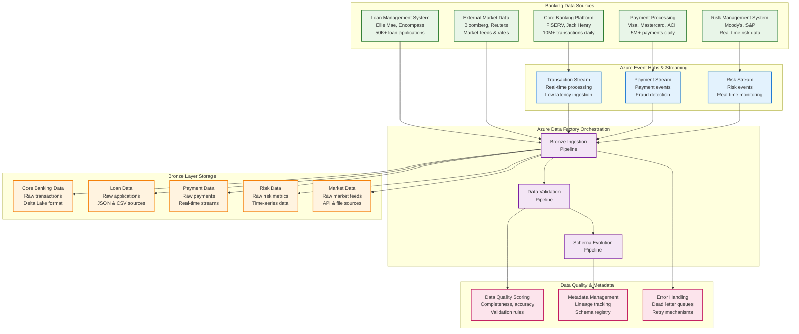
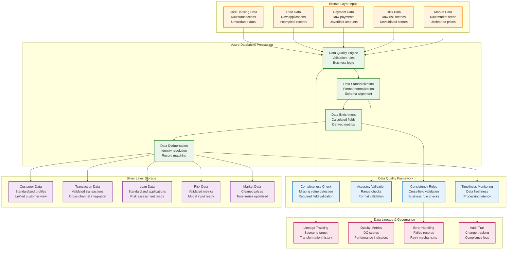
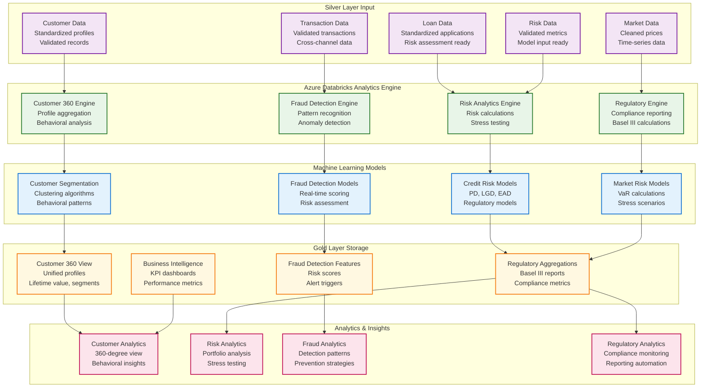
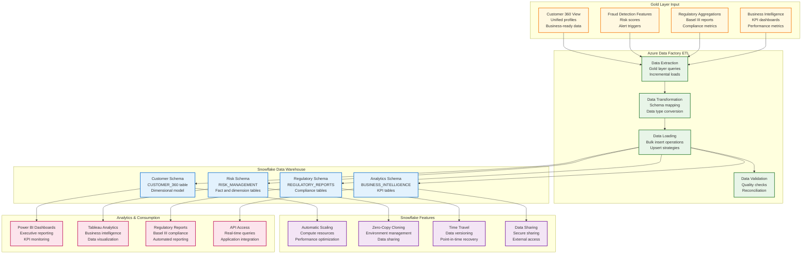

# Enterprise Banking Data Lakehouse Implementation

## Project Overview

The Enterprise Banking Data Lakehouse Implementation is a comprehensive data architecture project designed to modernize banking data infrastructure, enabling real-time analytics, regulatory compliance, and advanced financial insights.

## Architecture Components

### Data Orchestration Layer
- **Azure Data Factory (ADF)**: Central orchestration and data movement
- **Pipeline Management**: Automated scheduling and dependency management
- **Data Lineage**: End-to-end data flow tracking
- **Error Handling**: Comprehensive retry and failure management

### Data Ingestion Layer
- **Real-time Streaming**: Azure Event Hubs for transaction streams
- **Batch Processing**: ADF pipelines for scheduled data loads
- **API Integration**: RESTful APIs for external banking systems
- **File Processing**: Support for CSV, JSON, XML, and EDI formats

### Storage Layer (Medallion Architecture)
- **Bronze Layer**: Raw data ingestion in Azure Data Lake Storage Gen2
- **Silver Layer**: Cleaned and validated data in Delta Lake format
- **Gold Layer**: Business-ready aggregated data in Snowflake
- **Data Catalog**: Azure Purview for metadata management

### Processing Layer
- **Azure Databricks**: PySpark processing for all data transformations
- **Stream Processing**: Azure Databricks Structured Streaming
- **Batch Processing**: Azure Databricks jobs for ETL/ELT
- **Machine Learning**: Azure ML and MLflow for model management

## Key Features

### Data Governance
- **Data Lineage**: End-to-end data tracking
- **Data Quality**: Automated validation and monitoring
- **Security**: Role-based access control (RBAC)
- **Compliance**: GDPR, SOX, Basel III compliance

### Analytics Capabilities
- **Real-time Dashboards**: Power BI or Tableau integration
- **Predictive Analytics**: Fraud detection and risk assessment
- **Regulatory Reporting**: Automated compliance reporting
- **Customer Insights**: 360-degree customer view

## Data Flow Architecture

### Theoretical Foundation of Banking Data Lakehouse Architecture

The banking data lakehouse architecture represents a paradigm shift from traditional data warehousing approaches, combining the flexibility of data lakes with the performance and reliability of data warehouses. This hybrid approach addresses the unique challenges faced by financial institutions, including regulatory compliance, real-time risk management, and the need for advanced analytics on massive datasets. The architecture leverages the medallion pattern (Bronze, Silver, Gold) to ensure data quality and lineage while maintaining the scalability required for modern banking operations.

The medallion architecture pattern provides a structured approach to data processing that ensures data quality, traceability, and business readiness. The Bronze layer serves as the landing zone for raw data, preserving the original format and providing a complete audit trail for regulatory compliance. The Silver layer applies business rules, data quality checks, and standardization processes, transforming raw data into clean, validated datasets. The Gold layer creates business-ready aggregations, customer 360 views, and analytical features that power decision-making systems and regulatory reporting.

Azure Data Factory (ADF) serves as the central orchestration engine, providing enterprise-grade workflow management, dependency handling, and error recovery capabilities. ADF's integration with Azure Databricks enables seamless execution of complex data transformations while maintaining data lineage and governance. The orchestration layer ensures that data flows through the medallion architecture in the correct sequence, with proper error handling and retry mechanisms to maintain data pipeline reliability.

### Comprehensive Data Flow Diagram

```mermaid
graph TB
    subgraph "Data Sources Layer"
        S1[Core Banking Platform<br/>FIS Core Banking System<br/>10M+ transactions daily]
        S2[Loan Management System<br/>Temenos Loan Management<br/>50K+ applications monthly]
        S3[Payment Processing<br/>SWIFT & ACH Processing<br/>5M+ payments daily]
        S4[Risk Management<br/>SAS Risk Platform<br/>1M+ assessments daily]
        S5[External Market Data<br/>Bloomberg & Reuters<br/>100K+ data points daily]
    end

    subgraph "Azure Data Factory Orchestration"
        ADF[Master Pipeline<br/>Banking Data Lakehouse<br/>Orchestration]
        ADF1[Bronze Ingestion<br/>Pipeline]
        ADF2[Silver Processing<br/>Pipeline]
        ADF3[Gold Aggregation<br/>Pipeline]
        ADF4[Snowflake Load<br/>Pipeline]
    end

    subgraph "Bronze Layer - Raw Data Ingestion"
        B1[Core Banking Data<br/>Raw transactions, accounts<br/>Delta Lake format]
        B2[Loan Data<br/>Applications, disbursements<br/>JSON & CSV sources]
        B3[Payment Data<br/>Real-time streams<br/>Event Hub integration]
        B4[Risk Data<br/>Assessments, scores<br/>Database replication]
        B5[Market Data<br/>Prices, rates, indicators<br/>FTP & API feeds]
    end

    subgraph "Silver Layer - Data Cleaning & Validation"
        SL1[Customer Data<br/>Cleaned profiles<br/>Standardized formats]
        SL2[Transaction Data<br/>Validated transactions<br/>Business rules applied]
        SL3[Loan Data<br/>Standardized loans<br/>Credit scoring]
        SL4[Risk Data<br/>Normalized risk scores<br/>Trend analysis]
        SL5[Market Data<br/>Validated prices<br/>Volatility calculations]
    end

    subgraph "Gold Layer - Business Aggregations"
        GL1[Customer 360 View<br/>Unified customer profiles<br/>Lifetime value calculations]
        GL2[Fraud Detection Features<br/>Risk scoring models<br/>Behavioral patterns]
        GL3[Regulatory Reports<br/>Basel III compliance<br/>Capital adequacy]
        GL4[Risk Analytics<br/>Portfolio risk assessment<br/>Stress testing]
    end

    subgraph "Snowflake Data Warehouse"
        SF1[Customer Schema<br/>CUSTOMER_360 table<br/>Business-ready data]
        SF2[Fraud Schema<br/>FRAUD_FEATURES table<br/>ML model inputs]
        SF3[Regulatory Schema<br/>BASEL_REPORT table<br/>Compliance data]
    end

    subgraph "Analytics & Consumption"
        A1[Power BI Dashboards<br/>Executive reporting<br/>Real-time insights]
        A2[ML Models<br/>Fraud detection<br/>Risk assessment]
        A3[Regulatory Reporting<br/>Automated compliance<br/>Audit trails]
        A4[Customer Analytics<br/>360-degree view<br/>Personalization]
    end

    %% Data Flow Connections
    S1 --> ADF1
    S2 --> ADF1
    S3 --> ADF1
    S4 --> ADF1
    S5 --> ADF1

    ADF --> ADF1
    ADF1 --> ADF2
    ADF2 --> ADF3
    ADF3 --> ADF4

    ADF1 --> B1
    ADF1 --> B2
    ADF1 --> B3
    ADF1 --> B4
    ADF1 --> B5

    ADF2 --> SL1
    ADF2 --> SL2
    ADF2 --> SL3
    ADF2 --> SL4
    ADF2 --> SL5

    ADF3 --> GL1
    ADF3 --> GL2
    ADF3 --> GL3
    ADF3 --> GL4

    ADF4 --> SF1
    ADF4 --> SF2
    ADF4 --> SF3

    SF1 --> A1
    SF1 --> A4
    SF2 --> A2
    SF3 --> A3

    %% Styling
    classDef sourceStyle fill:#e1f5fe,stroke:#01579b,stroke-width:2px
    classDef adfStyle fill:#f3e5f5,stroke:#4a148c,stroke-width:2px
    classDef bronzeStyle fill:#fff3e0,stroke:#e65100,stroke-width:2px
    classDef silverStyle fill:#e8f5e8,stroke:#1b5e20,stroke-width:2px
    classDef goldStyle fill:#fff8e1,stroke:#f57f17,stroke-width:2px
    classDef snowflakeStyle fill:#e3f2fd,stroke:#0d47a1,stroke-width:2px
    classDef analyticsStyle fill:#fce4ec,stroke:#880e4f,stroke-width:2px

    class S1,S2,S3,S4,S5 sourceStyle
    class ADF,ADF1,ADF2,ADF3,ADF4 adfStyle
    class B1,B2,B3,B4,B5 bronzeStyle
    class SL1,SL2,SL3,SL4,SL5 silverStyle
    class GL1,GL2,GL3,GL4 goldStyle
    class SF1,SF2,SF3 snowflakeStyle
    class A1,A2,A3,A4 analyticsStyle
```



### Azure Data Factory Orchestration Flow

#### Master Pipeline: Banking Data Lakehouse Orchestration

The Azure Data Factory orchestration layer serves as the central nervous system of the banking data lakehouse, coordinating complex data workflows across multiple systems and ensuring reliable data delivery. The master pipeline implements a sophisticated dependency management system that ensures data flows through the medallion architecture in the correct sequence, with comprehensive error handling and retry mechanisms. This orchestration approach provides enterprise-grade reliability and scalability, essential for banking operations that require 99.9% uptime and regulatory compliance.

The pipeline architecture follows a hierarchical structure where the master pipeline coordinates four primary sub-pipelines: Bronze Ingestion, Silver Processing, Gold Aggregation, and Snowflake Load. Each sub-pipeline is designed to handle specific aspects of the data transformation process, with clear input and output contracts that enable modular development and testing. The dependency management system ensures that downstream processes only execute when upstream processes complete successfully, preventing data corruption and ensuring data lineage integrity.

Error handling and monitoring capabilities are built into every level of the orchestration framework, providing real-time visibility into pipeline execution status, data quality metrics, and performance indicators. The system includes automatic retry mechanisms for transient failures, dead letter queues for permanently failed records, and comprehensive logging for audit trails. This robust error handling is critical for banking environments where data accuracy and regulatory compliance are paramount.

### Bronze Layer: Raw Data Ingestion

#### Detailed Bronze Layer Data Flow Diagram



#### Source Systems and Table Structures

##### Source 1: Core Banking Platform (FISERV)
**System**: FIS Core Banking System  
**Tables and Columns**:

```sql
-- CUSTOMERS table
CUSTOMER_ID (VARCHAR(20)) - Primary Key
FIRST_NAME (VARCHAR(50))
LAST_NAME (VARCHAR(50))
EMAIL_ADDRESS (VARCHAR(100))
PHONE_NUMBER (VARCHAR(20))
DATE_OF_BIRTH (DATE)
SSN (VARCHAR(11)) - Encrypted
ADDRESS_LINE_1 (VARCHAR(100))
CITY (VARCHAR(50))
STATE_CODE (VARCHAR(2))
ZIP_CODE (VARCHAR(10))
COUNTRY_CODE (VARCHAR(3))
CUSTOMER_TYPE (VARCHAR(20)) - INDIVIDUAL, BUSINESS, CORPORATE
KYC_STATUS (VARCHAR(20)) - COMPLETED, PENDING, FAILED
RISK_RATING (VARCHAR(10)) - LOW, MEDIUM, HIGH
REGISTRATION_DATE (DATE)
LAST_LOGIN_DATE (DATE)
CUSTOMER_STATUS (VARCHAR(20)) - ACTIVE, INACTIVE, BLOCKED

-- ACCOUNTS table
ACCOUNT_ID (VARCHAR(20)) - Primary Key
CUSTOMER_ID (VARCHAR(20)) - Foreign Key
ACCOUNT_TYPE (VARCHAR(10)) - CHECKING, SAVINGS, LOAN, CREDIT_CARD
ACCOUNT_STATUS (VARCHAR(10)) - ACTIVE, CLOSED, SUSPENDED, DORMANT
OPEN_DATE (DATE)
CLOSE_DATE (DATE) - Nullable
BALANCE (DECIMAL(15,2))
AVAILABLE_BALANCE (DECIMAL(15,2))
CURRENCY_CODE (VARCHAR(3))
BRANCH_CODE (VARCHAR(10))
PRODUCT_CODE (VARCHAR(10))
INTEREST_RATE (DECIMAL(5,4))
CREDIT_LIMIT (DECIMAL(15,2)) - For credit accounts
MINIMUM_BALANCE (DECIMAL(15,2))
OVERDRAFT_LIMIT (DECIMAL(15,2))

-- TRANSACTIONS table
TRANSACTION_ID (VARCHAR(30)) - Primary Key
ACCOUNT_ID (VARCHAR(20)) - Foreign Key
CUSTOMER_ID (VARCHAR(20)) - Foreign Key
TRANSACTION_DATE (TIMESTAMP)
TRANSACTION_TYPE (VARCHAR(20)) - DEPOSIT, WITHDRAWAL, TRANSFER, PAYMENT
AMOUNT (DECIMAL(15,2))
BALANCE_AFTER (DECIMAL(15,2))
DESCRIPTION (VARCHAR(100))
REFERENCE_NUMBER (VARCHAR(50))
CHANNEL (VARCHAR(20)) - ATM, ONLINE, BRANCH, MOBILE, PHONE
MERCHANT_ID (VARCHAR(20)) - For card transactions
MERCHANT_CATEGORY (VARCHAR(4)) - MCC code
TRANSACTION_STATUS (VARCHAR(20)) - COMPLETED, FAILED, PENDING
AUTHORIZATION_CODE (VARCHAR(10))
PROCESSING_DATE (TIMESTAMP)

-- LOAN_ACCOUNTS table
LOAN_ACCOUNT_ID (VARCHAR(20)) - Primary Key
CUSTOMER_ID (VARCHAR(20)) - Foreign Key
LOAN_TYPE (VARCHAR(20)) - MORTGAGE, PERSONAL, AUTO, BUSINESS
LOAN_AMOUNT (DECIMAL(15,2))
OUTSTANDING_BALANCE (DECIMAL(15,2))
INTEREST_RATE (DECIMAL(5,4))
TERM_MONTHS (INTEGER)
MONTHLY_PAYMENT (DECIMAL(10,2))
LOAN_STATUS (VARCHAR(20)) - ACTIVE, PAID_OFF, DEFAULTED, FORECLOSED
ORIGINATION_DATE (DATE)
MATURITY_DATE (DATE)
COLLATERAL_VALUE (DECIMAL(15,2))
LTV_RATIO (DECIMAL(5,4)) - Loan-to-Value ratio
```

**Example Data Flow**:
```
FISERV.CUSTOMERS → Bronze: /bronze/banking/customers/
FISERV.ACCOUNTS → Bronze: /bronze/banking/accounts/
FISERV.TRANSACTIONS → Bronze: /bronze/banking/transactions/
FISERV.LOAN_ACCOUNTS → Bronze: /bronze/banking/loans/
Volume: 10M+ transactions daily, 2M+ customers, 5M+ accounts
Frequency: Real-time streaming via Event Hubs
```

##### Source 2: Loan Management System (Ellie Mae)
**System**: Ellie Mae Encompass  
**Tables and Columns**:

```sql
-- LOAN_APPLICATIONS table
APPLICATION_ID (VARCHAR(25)) - Primary Key
CUSTOMER_ID (VARCHAR(20)) - Foreign Key
LOAN_TYPE (VARCHAR(20)) - MORTGAGE, PERSONAL, AUTO, BUSINESS
APPLICATION_DATE (DATE)
LOAN_AMOUNT (DECIMAL(15,2))
INTEREST_RATE (DECIMAL(5,4))
TERM_MONTHS (INTEGER)
STATUS (VARCHAR(20)) - PENDING, APPROVED, REJECTED, WITHDRAWN
CREDIT_SCORE (INTEGER)
ANNUAL_INCOME (DECIMAL(12,2))
DEBT_TO_INCOME_RATIO (DECIMAL(5,4))
LOAN_TO_VALUE_RATIO (DECIMAL(5,4))
COLLATERAL_TYPE (VARCHAR(30))
COLLATERAL_VALUE (DECIMAL(15,2))
PROPERTY_ADDRESS (VARCHAR(200))
PROPERTY_TYPE (VARCHAR(30)) - SINGLE_FAMILY, CONDO, MULTI_FAMILY
OCCUPANCY_TYPE (VARCHAR(20)) - PRIMARY, SECONDARY, INVESTMENT
APPLICATION_SOURCE (VARCHAR(30)) - ONLINE, BRANCH, PHONE
LOAN_OFFICER_ID (VARCHAR(20))
UNDERWRITER_ID (VARCHAR(20))
APPROVAL_DATE (DATE)
REJECTION_REASON (VARCHAR(200))

-- LOAN_DISBURSEMENTS table
DISBURSEMENT_ID (VARCHAR(25)) - Primary Key
APPLICATION_ID (VARCHAR(25)) - Foreign Key
LOAN_ACCOUNT_ID (VARCHAR(20)) - Foreign Key
DISBURSEMENT_DATE (DATE)
DISBURSEMENT_AMOUNT (DECIMAL(15,2))
DISBURSEMENT_METHOD (VARCHAR(20)) - WIRE, ACH, CHECK
BANK_ACCOUNT (VARCHAR(20))
ROUTING_NUMBER (VARCHAR(9))
DISBURSEMENT_STATUS (VARCHAR(20)) - PENDING, COMPLETED, FAILED
PROCESSING_FEE (DECIMAL(8,2))
NET_AMOUNT (DECIMAL(15,2))

-- LOAN_PAYMENTS table
PAYMENT_ID (VARCHAR(25)) - Primary Key
LOAN_ACCOUNT_ID (VARCHAR(20)) - Foreign Key
PAYMENT_DATE (DATE)
PAYMENT_AMOUNT (DECIMAL(10,2))
PRINCIPAL_AMOUNT (DECIMAL(10,2))
INTEREST_AMOUNT (DECIMAL(10,2))
ESCROW_AMOUNT (DECIMAL(10,2))
PAYMENT_METHOD (VARCHAR(20)) - ACH, CHECK, ONLINE, PHONE
PAYMENT_STATUS (VARCHAR(20)) - COMPLETED, FAILED, PENDING
LATE_FEE (DECIMAL(8,2))
REMAINING_BALANCE (DECIMAL(15,2))
```

**Example Data Flow**:
```
Ellie_Mae.LOAN_APPLICATIONS → Bronze: /bronze/banking/loans/applications/
Ellie_Mae.LOAN_DISBURSEMENTS → Bronze: /bronze/banking/loans/disbursements/
Ellie_Mae.LOAN_PAYMENTS → Bronze: /bronze/banking/loans/payments/
Volume: 50K+ applications monthly, 2M+ payments monthly
Frequency: Daily batch processing
```

##### Source 3: Payment Processing (Visa/Mastercard)
**System**: Payment Gateway Integration  
**Tables and Columns**:

```sql
-- PAYMENT_TRANSACTIONS table
PAYMENT_ID (VARCHAR(30)) - Primary Key
CARD_NUMBER (VARCHAR(19)) - Masked
CUSTOMER_ID (VARCHAR(20)) - Foreign Key
MERCHANT_ID (VARCHAR(20))
TRANSACTION_AMOUNT (DECIMAL(10,2))
CURRENCY_CODE (VARCHAR(3))
TRANSACTION_DATE (TIMESTAMP)
AUTHORIZATION_CODE (VARCHAR(10))
RESPONSE_CODE (VARCHAR(3))
FRAUD_SCORE (DECIMAL(3,2))
COUNTRY_CODE (VARCHAR(3))
MERCHANT_CATEGORY (VARCHAR(4))

-- PAYMENT_SETTLEMENTS table
SETTLEMENT_ID (VARCHAR(25)) - Primary Key
PAYMENT_ID (VARCHAR(30)) - Foreign Key
SETTLEMENT_DATE (DATE)
SETTLEMENT_AMOUNT (DECIMAL(10,2))
PROCESSING_FEE (DECIMAL(8,2))
NET_AMOUNT (DECIMAL(10,2))
```

**Example Data Flow**:
```
Payment_Gateway.PAYMENT_TRANSACTIONS → Bronze: /bronze/banking/payments/transactions/
Payment_Gateway.PAYMENT_SETTLEMENTS → Bronze: /bronze/banking/payments/settlements/
Volume: 5M+ payments daily
Frequency: Real-time streaming via Event Hubs
```

##### Source 4: Risk Management System (Moody's)
**System**: Moody's Risk Management Platform  
**Tables and Columns**:

```sql
-- RISK_ASSESSMENTS table
ASSESSMENT_ID (VARCHAR(25)) - Primary Key
CUSTOMER_ID (VARCHAR(20)) - Foreign Key
ASSESSMENT_DATE (DATE)
CREDIT_RISK_SCORE (DECIMAL(5,2))
MARKET_RISK_SCORE (DECIMAL(5,2))
OPERATIONAL_RISK_SCORE (DECIMAL(5,2))
OVERALL_RISK_RATING (VARCHAR(5)) - LOW, MEDIUM, HIGH
PD_PROBABILITY (DECIMAL(5,4)) - Probability of Default
LGD_LOSS_GIVEN (DECIMAL(5,4)) - Loss Given Default
EAD_EXPOSURE (DECIMAL(15,2)) - Exposure at Default

-- STRESS_TEST_RESULTS table
STRESS_TEST_ID (VARCHAR(25)) - Primary Key
PORTFOLIO_ID (VARCHAR(20))
SCENARIO_NAME (VARCHAR(50))
TEST_DATE (DATE)
BASELINE_LOSS (DECIMAL(15,2))
STRESS_LOSS (DECIMAL(15,2))
LOSS_RATIO (DECIMAL(5,4))
```

**Example Data Flow**:
```
Moodys.RISK_ASSESSMENTS → Bronze: /bronze/banking/risk/assessments/
Moodys.STRESS_TEST_RESULTS → Bronze: /bronze/banking/risk/stress_tests/
Volume: 1M+ assessments daily
Frequency: Real-time streaming for critical alerts, daily batch for reports
```

##### Source 5: External Market Data (Bloomberg)
**System**: Bloomberg Terminal API  
**Tables and Columns**:

```sql
-- MARKET_RATES table
RATE_ID (VARCHAR(25)) - Primary Key
INSTRUMENT_TYPE (VARCHAR(20)) - BOND, EQUITY, CURRENCY
SYMBOL (VARCHAR(10))
RATE_DATE (DATE)
RATE_VALUE (DECIMAL(10,6))
CURRENCY_CODE (VARCHAR(3))
MATURITY_DATE (DATE)
YIELD_CURVE_POINT (VARCHAR(10))

-- ECONOMIC_INDICATORS table
INDICATOR_ID (VARCHAR(25)) - Primary Key
INDICATOR_NAME (VARCHAR(50)) - GDP, INFLATION, UNEMPLOYMENT
COUNTRY_CODE (VARCHAR(3))
INDICATOR_DATE (DATE)
INDICATOR_VALUE (DECIMAL(10,4))
PERIOD_TYPE (VARCHAR(10)) - MONTHLY, QUARTERLY, ANNUAL
```

**Example Data Flow**:
```
Bloomberg.MARKET_RATES → Bronze: /bronze/banking/market/rates/
Bloomberg.ECONOMIC_INDICATORS → Bronze: /bronze/banking/market/indicators/
Volume: 100K+ data points daily
Frequency: Real-time for rates, daily batch for indicators
```

#### Enterprise Banking Data Model - Entity Relationship Diagram

The following ER diagram illustrates the comprehensive data relationships across all banking systems and their integration into the data lakehouse architecture:

```mermaid
erDiagram
    CUSTOMERS {
        VARCHAR(20) CUSTOMER_ID PK
        VARCHAR(50) FIRST_NAME
        VARCHAR(50) LAST_NAME
        VARCHAR(100) EMAIL_ADDRESS
        VARCHAR(20) PHONE_NUMBER
        DATE DATE_OF_BIRTH
        VARCHAR(11) SSN
        VARCHAR(100) ADDRESS_LINE_1
        VARCHAR(50) CITY
        VARCHAR(2) STATE_CODE
        VARCHAR(10) ZIP_CODE
        VARCHAR(3) COUNTRY_CODE
        VARCHAR(20) CUSTOMER_TYPE
        VARCHAR(20) KYC_STATUS
        VARCHAR(10) RISK_RATING
        DATE REGISTRATION_DATE
        DATE LAST_LOGIN_DATE
        VARCHAR(20) CUSTOMER_STATUS
    }

    ACCOUNTS {
        VARCHAR(20) ACCOUNT_ID PK
        VARCHAR(20) CUSTOMER_ID FK
        VARCHAR(10) ACCOUNT_TYPE
        VARCHAR(10) ACCOUNT_STATUS
        DATE OPEN_DATE
        DATE CLOSE_DATE
        DECIMAL(15,2) BALANCE
        DECIMAL(15,2) AVAILABLE_BALANCE
        VARCHAR(3) CURRENCY_CODE
        VARCHAR(10) BRANCH_CODE
        VARCHAR(10) PRODUCT_CODE
        DECIMAL(5,4) INTEREST_RATE
        DECIMAL(15,2) CREDIT_LIMIT
        DECIMAL(15,2) MINIMUM_BALANCE
        DECIMAL(15,2) OVERDRAFT_LIMIT
    }

    TRANSACTIONS {
        VARCHAR(30) TRANSACTION_ID PK
        VARCHAR(20) ACCOUNT_ID FK
        VARCHAR(20) CUSTOMER_ID FK
        TIMESTAMP TRANSACTION_DATE
        VARCHAR(20) TRANSACTION_TYPE
        DECIMAL(15,2) AMOUNT
        DECIMAL(15,2) BALANCE_AFTER
        VARCHAR(100) DESCRIPTION
        VARCHAR(50) REFERENCE_NUMBER
        VARCHAR(20) CHANNEL
        VARCHAR(20) MERCHANT_ID
        VARCHAR(4) MERCHANT_CATEGORY
        VARCHAR(20) TRANSACTION_STATUS
        VARCHAR(10) AUTHORIZATION_CODE
        TIMESTAMP PROCESSING_DATE
    }

    LOAN_ACCOUNTS {
        VARCHAR(20) LOAN_ACCOUNT_ID PK
        VARCHAR(20) CUSTOMER_ID FK
        VARCHAR(20) LOAN_TYPE
        DECIMAL(15,2) LOAN_AMOUNT
        DECIMAL(15,2) OUTSTANDING_BALANCE
        DECIMAL(5,4) INTEREST_RATE
        INTEGER TERM_MONTHS
        DECIMAL(10,2) MONTHLY_PAYMENT
        VARCHAR(20) LOAN_STATUS
        DATE ORIGINATION_DATE
        DATE MATURITY_DATE
        DECIMAL(15,2) COLLATERAL_VALUE
        DECIMAL(5,4) LTV_RATIO
    }

    LOAN_APPLICATIONS {
        VARCHAR(25) APPLICATION_ID PK
        VARCHAR(20) CUSTOMER_ID FK
        VARCHAR(20) LOAN_TYPE
        DATE APPLICATION_DATE
        DECIMAL(15,2) LOAN_AMOUNT
        DECIMAL(5,4) INTEREST_RATE
        INTEGER TERM_MONTHS
        VARCHAR(20) STATUS
        INTEGER CREDIT_SCORE
        DECIMAL(12,2) ANNUAL_INCOME
        DECIMAL(5,4) DEBT_TO_INCOME_RATIO
        DECIMAL(5,4) LOAN_TO_VALUE_RATIO
        VARCHAR(30) COLLATERAL_TYPE
        DECIMAL(15,2) COLLATERAL_VALUE
        VARCHAR(200) PROPERTY_ADDRESS
        VARCHAR(30) PROPERTY_TYPE
        VARCHAR(20) OCCUPANCY_TYPE
        VARCHAR(30) APPLICATION_SOURCE
        VARCHAR(20) LOAN_OFFICER_ID
        VARCHAR(20) UNDERWRITER_ID
        DATE APPROVAL_DATE
        VARCHAR(200) REJECTION_REASON
    }

    LOAN_DISBURSEMENTS {
        VARCHAR(25) DISBURSEMENT_ID PK
        VARCHAR(25) APPLICATION_ID FK
        VARCHAR(20) LOAN_ACCOUNT_ID FK
        DATE DISBURSEMENT_DATE
        DECIMAL(15,2) DISBURSEMENT_AMOUNT
        VARCHAR(20) DISBURSEMENT_METHOD
        VARCHAR(20) BANK_ACCOUNT
        VARCHAR(9) ROUTING_NUMBER
        VARCHAR(20) DISBURSEMENT_STATUS
        DECIMAL(8,2) PROCESSING_FEE
        DECIMAL(15,2) NET_AMOUNT
    }

    LOAN_PAYMENTS {
        VARCHAR(25) PAYMENT_ID PK
        VARCHAR(20) LOAN_ACCOUNT_ID FK
        DATE PAYMENT_DATE
        DECIMAL(10,2) PAYMENT_AMOUNT
        DECIMAL(10,2) PRINCIPAL_AMOUNT
        DECIMAL(10,2) INTEREST_AMOUNT
        DECIMAL(10,2) ESCROW_AMOUNT
        VARCHAR(20) PAYMENT_METHOD
        VARCHAR(20) PAYMENT_STATUS
        DECIMAL(8,2) LATE_FEE
        DECIMAL(15,2) REMAINING_BALANCE
    }

    PAYMENT_TRANSACTIONS {
        VARCHAR(30) PAYMENT_ID PK
        VARCHAR(19) CARD_NUMBER
        VARCHAR(20) CUSTOMER_ID FK
        VARCHAR(20) MERCHANT_ID
        DECIMAL(10,2) TRANSACTION_AMOUNT
        VARCHAR(3) CURRENCY_CODE
        TIMESTAMP TRANSACTION_DATE
        VARCHAR(10) AUTHORIZATION_CODE
        VARCHAR(3) RESPONSE_CODE
        DECIMAL(3,2) FRAUD_SCORE
        VARCHAR(3) COUNTRY_CODE
        VARCHAR(4) MERCHANT_CATEGORY
    }

    PAYMENT_SETTLEMENTS {
        VARCHAR(25) SETTLEMENT_ID PK
        VARCHAR(30) PAYMENT_ID FK
        DATE SETTLEMENT_DATE
        DECIMAL(10,2) SETTLEMENT_AMOUNT
        DECIMAL(8,2) PROCESSING_FEE
        DECIMAL(10,2) NET_AMOUNT
    }

    RISK_ASSESSMENTS {
        VARCHAR(25) ASSESSMENT_ID PK
        VARCHAR(20) CUSTOMER_ID FK
        DATE ASSESSMENT_DATE
        DECIMAL(5,2) CREDIT_RISK_SCORE
        DECIMAL(5,2) MARKET_RISK_SCORE
        DECIMAL(5,2) OPERATIONAL_RISK_SCORE
        VARCHAR(5) OVERALL_RISK_RATING
        DECIMAL(5,4) PD_PROBABILITY
        DECIMAL(5,4) LGD_LOSS_GIVEN
        DECIMAL(15,2) EAD_EXPOSURE
    }

    STRESS_TEST_RESULTS {
        VARCHAR(25) STRESS_TEST_ID PK
        VARCHAR(20) PORTFOLIO_ID
        VARCHAR(50) SCENARIO_NAME
        DATE TEST_DATE
        DECIMAL(15,2) BASELINE_LOSS
        DECIMAL(15,2) STRESS_LOSS
        DECIMAL(5,4) LOSS_RATIO
    }

    MARKET_RATES {
        VARCHAR(25) RATE_ID PK
        VARCHAR(20) INSTRUMENT_TYPE
        VARCHAR(10) SYMBOL
        DATE RATE_DATE
        DECIMAL(10,6) RATE_VALUE
        VARCHAR(3) CURRENCY_CODE
        DATE MATURITY_DATE
        VARCHAR(10) YIELD_CURVE_POINT
    }

    ECONOMIC_INDICATORS {
        VARCHAR(25) INDICATOR_ID PK
        VARCHAR(50) INDICATOR_NAME
        VARCHAR(3) COUNTRY_CODE
        DATE INDICATOR_DATE
        DECIMAL(10,4) INDICATOR_VALUE
        VARCHAR(10) PERIOD_TYPE
    }

    %% Relationships
    CUSTOMERS ||--o{ ACCOUNTS : "owns"
    CUSTOMERS ||--o{ TRANSACTIONS : "performs"
    CUSTOMERS ||--o{ LOAN_ACCOUNTS : "borrows"
    CUSTOMERS ||--o{ LOAN_APPLICATIONS : "applies"
    CUSTOMERS ||--o{ PAYMENT_TRANSACTIONS : "makes"
    CUSTOMERS ||--o{ RISK_ASSESSMENTS : "assessed"

    ACCOUNTS ||--o{ TRANSACTIONS : "contains"
    ACCOUNTS ||--o{ LOAN_ACCOUNTS : "linked_to"

    LOAN_APPLICATIONS ||--o{ LOAN_DISBURSEMENTS : "disbursed"
    LOAN_APPLICATIONS ||--o{ LOAN_ACCOUNTS : "creates"

    LOAN_ACCOUNTS ||--o{ LOAN_PAYMENTS : "receives"
    LOAN_ACCOUNTS ||--o{ LOAN_DISBURSEMENTS : "funded_by"

    PAYMENT_TRANSACTIONS ||--o{ PAYMENT_SETTLEMENTS : "settled"

    RISK_ASSESSMENTS ||--o{ STRESS_TEST_RESULTS : "tested"
```

#### Theoretical Foundation of Bronze Layer Processing

The Bronze layer represents the foundational tier of the medallion architecture, serving as the immutable landing zone for all raw data entering the banking data lakehouse. This layer is designed to preserve the original format and content of source data without any transformation or cleansing, ensuring complete data lineage and auditability for regulatory compliance. The Bronze layer implements a "write-once, read-many" pattern that maintains data integrity while enabling multiple downstream consumers to access the same raw datasets.

The Bronze layer processing strategy encompasses multiple data ingestion patterns to accommodate the diverse nature of banking data sources. Real-time streaming ingestion handles high-velocity transaction data from core banking systems, payment processing platforms, and risk management systems, ensuring that critical financial data is available for analysis within seconds of generation. Batch ingestion processes handle large volumes of historical data, regulatory reports, and external market data that arrive on scheduled intervals. The hybrid approach provides the flexibility needed to support both operational analytics and regulatory reporting requirements.

Data quality and metadata management are fundamental aspects of Bronze layer design. Every record ingested into the Bronze layer receives comprehensive metadata including ingestion timestamps, source system identifiers, data quality scores, and processing status indicators. This metadata framework enables downstream processes to make informed decisions about data usage and provides the foundation for data lineage tracking. The Bronze layer also implements schema evolution capabilities to handle changing data structures from source systems without breaking existing data pipelines.

#### Core Banking Data Processing

The core banking data processing pipeline handles the most critical data streams in the banking ecosystem, including customer account information, transaction records, and balance updates. This pipeline processes over 10 million transactions daily across multiple banking channels, requiring sophisticated stream processing capabilities and real-time data validation. The processing framework implements event-driven architecture patterns to ensure that transaction data flows through the system with minimal latency while maintaining data consistency and integrity.

The core banking data ingestion process begins with real-time event capture from the FIS Core Banking System, utilizing Azure Event Hubs to provide scalable, reliable message streaming. The ingestion pipeline applies initial data validation rules to identify and flag potentially problematic records while preserving all data for audit purposes. Metadata enrichment processes add critical context including transaction categorization, risk indicators, and compliance flags that enable downstream analytics and regulatory reporting.

Data partitioning and storage optimization strategies are implemented to ensure optimal query performance for both real-time analytics and historical reporting. The Bronze layer utilizes Delta Lake format to provide ACID transaction capabilities, schema evolution support, and time travel functionality that are essential for banking data management. Partitioning strategies are designed around business-relevant dimensions such as transaction date, customer segment, and transaction type to optimize query performance and enable efficient data lifecycle management.

#### Loan Management Data Processing

The loan management data processing pipeline handles the complex lifecycle of lending operations, from initial application through final repayment. This pipeline processes approximately 50,000 loan applications monthly, along with disbursements, repayments, and credit assessments. The processing framework must accommodate the varied data formats and update frequencies typical of loan management systems, including real-time application processing and batch-oriented credit bureau data integration.

The loan data ingestion process handles multiple data sources including JSON-formatted application data, CSV-based disbursement records, and XML-structured credit reports. The processing pipeline implements sophisticated data validation rules specific to lending operations, including credit score validation, income verification checks, and regulatory compliance requirements. Data enrichment processes add calculated fields such as debt-to-income ratios, loan-to-value ratios, and risk assessment scores that are essential for downstream analytics and decision-making systems.

The loan management data processing framework implements comprehensive audit trails and data lineage tracking to support regulatory compliance requirements such as Fair Lending Act compliance and CRA reporting. Every loan record maintains complete history of changes, approvals, and rejections, enabling comprehensive audit capabilities and regulatory reporting. The processing pipeline also implements data quality monitoring to identify and alert on data anomalies that could impact lending decisions or regulatory compliance.

#### Payment Processing Data Integration

The payment processing data integration pipeline handles the high-volume, real-time data streams from SWIFT and ACH payment systems, processing over 5 million payments daily. This pipeline requires ultra-low latency processing capabilities to support real-time fraud detection, compliance monitoring, and customer service operations. The integration framework implements sophisticated stream processing patterns to handle the variable load patterns typical of payment processing systems.

The payment data ingestion process utilizes Azure Event Hubs with custom consumer groups to provide scalable, fault-tolerant message processing. The pipeline implements real-time data validation to identify potentially fraudulent transactions, compliance violations, and data quality issues. Advanced stream processing techniques including windowing, aggregation, and pattern matching are employed to detect suspicious payment patterns and support real-time risk management decisions.

The payment processing pipeline implements comprehensive monitoring and alerting capabilities to ensure system reliability and regulatory compliance. Real-time dashboards provide visibility into payment processing volumes, success rates, and error conditions. The system includes automatic failover capabilities and dead letter queue processing to handle system failures and ensure no payment data is lost. Data retention policies are implemented to balance operational requirements with regulatory compliance obligations.

#### Risk Management Data Processing

The risk management data processing pipeline handles the complex data streams from SAS Risk Management Platform and other risk assessment systems, processing over 1 million risk assessments daily. This pipeline supports both real-time risk monitoring and batch-oriented risk model execution, requiring sophisticated data processing capabilities to handle the varied data formats and update frequencies typical of risk management systems.

The risk data ingestion process handles multiple data sources including real-time market data feeds, batch-oriented credit bureau data, and event-driven risk assessment updates. The processing pipeline implements advanced data validation rules specific to risk management, including data range validation, statistical outlier detection, and model input validation. Data enrichment processes add calculated risk metrics, stress test scenarios, and regulatory capital calculations that are essential for risk management and regulatory reporting.

The risk management data processing framework implements comprehensive model governance and validation capabilities to support regulatory requirements such as Basel III compliance and stress testing mandates. Every risk assessment maintains complete audit trails including model inputs, calculations, and outputs, enabling comprehensive model validation and regulatory reporting. The processing pipeline also implements data quality monitoring to identify and alert on data anomalies that could impact risk calculations or regulatory compliance.

#### External Market Data Integration

The external market data integration pipeline handles the complex data streams from Bloomberg Terminal, Reuters, and other financial data providers, processing over 100,000 market data points daily. This pipeline requires sophisticated data processing capabilities to handle the varied data formats, update frequencies, and quality levels typical of external market data sources. The integration framework implements advanced data validation and enrichment processes to ensure data quality and consistency.

The market data ingestion process handles multiple data formats including real-time price feeds, batch-oriented economic indicators, and event-driven market announcements. The processing pipeline implements sophisticated data validation rules including price range validation, volume consistency checks, and cross-reference validation against multiple data sources. Data enrichment processes add calculated metrics such as price changes, volatility measures, and correlation coefficients that are essential for risk management and trading operations.

The external market data integration framework implements comprehensive data quality monitoring and alerting capabilities to ensure the reliability of market data used for risk calculations and trading decisions. Real-time monitoring provides visibility into data quality metrics, update frequencies, and error conditions. The system includes automatic data validation and correction capabilities to handle data quality issues and ensure consistent data availability for downstream systems.

### Silver Layer: Data Cleaning and Validation

#### Detailed Silver Layer Data Flow Diagram



#### Silver Layer Table Structures and Transformations

##### Silver Table 1: Customer Data Standardization
**Source**: Bronze Layer Customer Data  
**Target**: Silver Layer Customer Profiles

```sql
-- SILVER_CUSTOMER_PROFILES table
CUSTOMER_ID (VARCHAR(20)) - Primary Key
FIRST_NAME (VARCHAR(50)) - Standardized, cleaned
LAST_NAME (VARCHAR(50)) - Standardized, cleaned
EMAIL_ADDRESS (VARCHAR(100)) - Validated format
PHONE_NUMBER (VARCHAR(20)) - Standardized format
DATE_OF_BIRTH (DATE) - Validated range
ADDRESS_LINE_1 (VARCHAR(100)) - Standardized
CITY (VARCHAR(50)) - Standardized
STATE_CODE (VARCHAR(2)) - Standardized
ZIP_CODE (VARCHAR(10)) - Validated format
COUNTRY_CODE (VARCHAR(3)) - Standardized
CUSTOMER_SEGMENT (VARCHAR(20)) - Derived from behavior
RISK_PROFILE (VARCHAR(10)) - LOW, MEDIUM, HIGH
KYC_STATUS (VARCHAR(20)) - COMPLETED, PENDING, FAILED
CREATED_DATE (TIMESTAMP)
UPDATED_DATE (TIMESTAMP)
DATA_QUALITY_SCORE (DECIMAL(3,2))
```

**Transformation Logic**:
```sql
-- Data Quality Rules Applied
1. Email validation: REGEX pattern matching
2. Phone standardization: E.164 format conversion
3. Address standardization: USPS address validation
4. Name cleaning: Remove special characters, title case
5. Date validation: Age range checks (18-120 years)
6. Duplicate detection: Fuzzy matching on name + DOB + address
```

##### Silver Table 2: Transaction Data Processing
**Source**: Bronze Layer Transaction Data  
**Target**: Silver Layer Validated Transactions

```sql
-- SILVER_TRANSACTIONS table
TRANSACTION_ID (VARCHAR(30)) - Primary Key
CUSTOMER_ID (VARCHAR(20)) - Foreign Key, validated
ACCOUNT_ID (VARCHAR(20)) - Foreign Key, validated
TRANSACTION_DATE (TIMESTAMP) - Validated timestamp
TRANSACTION_TYPE (VARCHAR(20)) - Standardized values
AMOUNT (DECIMAL(15,2)) - Validated range, positive/negative
CURRENCY_CODE (VARCHAR(3)) - Validated against ISO codes
DESCRIPTION (VARCHAR(100)) - Cleaned, standardized
MERCHANT_NAME (VARCHAR(100)) - Extracted from description
MERCHANT_CATEGORY (VARCHAR(4)) - MCC code validation
CHANNEL (VARCHAR(20)) - Standardized channel names
LOCATION_COUNTRY (VARCHAR(3)) - Derived from transaction
LOCATION_STATE (VARCHAR(2)) - Derived from transaction
FRAUD_SCORE (DECIMAL(3,2)) - Calculated risk score
TRANSACTION_STATUS (VARCHAR(20)) - COMPLETED, FAILED, PENDING
PROCESSING_DATE (TIMESTAMP)
DATA_QUALITY_SCORE (DECIMAL(3,2))
```

**Transformation Logic**:
```sql
-- Data Quality Rules Applied
1. Amount validation: Range checks, decimal precision
2. Date validation: Future date checks, business day validation
3. Currency validation: ISO 4217 code validation
4. Merchant extraction: NLP-based merchant name extraction
5. Location derivation: IP geolocation, merchant address lookup
6. Fraud scoring: Real-time risk calculation
```

##### Silver Table 3: Loan Data Standardization
**Source**: Bronze Layer Loan Data  
**Target**: Silver Layer Standardized Loans

```sql
-- SILVER_LOAN_APPLICATIONS table
APPLICATION_ID (VARCHAR(25)) - Primary Key
CUSTOMER_ID (VARCHAR(20)) - Foreign Key, validated
LOAN_TYPE (VARCHAR(20)) - Standardized loan categories
APPLICATION_DATE (DATE) - Validated date
LOAN_AMOUNT (DECIMAL(15,2)) - Validated range
INTEREST_RATE (DECIMAL(5,4)) - Validated range (0-50%)
TERM_MONTHS (INTEGER) - Validated range (1-480 months)
STATUS (VARCHAR(20)) - Standardized status values
CREDIT_SCORE (INTEGER) - Validated range (300-850)
ANNUAL_INCOME (DECIMAL(12,2)) - Validated range
DEBT_TO_INCOME_RATIO (DECIMAL(5,4)) - Calculated field
LOAN_TO_VALUE_RATIO (DECIMAL(5,4)) - Calculated field
COLLATERAL_VALUE (DECIMAL(15,2)) - Validated range
PROPERTY_TYPE (VARCHAR(30)) - Standardized categories
OCCUPANCY_TYPE (VARCHAR(20)) - PRIMARY, SECONDARY, INVESTMENT
PROCESSING_DATE (TIMESTAMP)
DATA_QUALITY_SCORE (DECIMAL(3,2))
```

**Transformation Logic**:
```sql
-- Data Quality Rules Applied
1. Credit score validation: Range checks (300-850)
2. Income validation: Reasonable income ranges by loan type
3. DTI calculation: Total debt / Annual income
4. LTV calculation: Loan amount / Property value
5. Rate validation: Market rate range validation
6. Term validation: Standard term validation by loan type
```

##### Silver Table 4: Risk Data Processing
**Source**: Bronze Layer Risk Data  
**Target**: Silver Layer Validated Risk Metrics

```sql
-- SILVER_RISK_ASSESSMENTS table
ASSESSMENT_ID (VARCHAR(25)) - Primary Key
CUSTOMER_ID (VARCHAR(20)) - Foreign Key, validated
ASSESSMENT_DATE (DATE) - Validated date
CREDIT_RISK_SCORE (DECIMAL(5,2)) - Validated range (0-1000)
MARKET_RISK_SCORE (DECIMAL(5,2)) - Validated range (0-1000)
OPERATIONAL_RISK_SCORE (DECIMAL(5,2)) - Validated range (0-1000)
OVERALL_RISK_RATING (VARCHAR(5)) - LOW, MEDIUM, HIGH, CRITICAL
PD_PROBABILITY (DECIMAL(5,4)) - Validated range (0-1)
LGD_LOSS_GIVEN (DECIMAL(5,4)) - Validated range (0-1)
EAD_EXPOSURE (DECIMAL(15,2)) - Validated range
REGULATORY_CAPITAL (DECIMAL(15,2)) - Calculated field
ECONOMIC_CAPITAL (DECIMAL(15,2)) - Calculated field
STRESS_TEST_SCORE (DECIMAL(5,2)) - Calculated field
MODEL_VERSION (VARCHAR(10)) - Model governance
ASSESSMENT_METHOD (VARCHAR(30)) - INTERNAL, EXTERNAL, HYBRID
PROCESSING_DATE (TIMESTAMP)
DATA_QUALITY_SCORE (DECIMAL(3,2))
```

**Transformation Logic**:
```sql
-- Data Quality Rules Applied
1. Score validation: Range checks for all risk scores
2. Probability validation: PD, LGD range validation (0-1)
3. Capital calculation: Regulatory capital = EAD × PD × LGD
4. Rating derivation: Score-to-rating mapping
5. Model versioning: Model governance tracking
6. Stress test calculation: Scenario-based stress testing
```

##### Silver Table 5: Market Data Processing
**Source**: Bronze Layer Market Data  
**Target**: Silver Layer Cleaned Market Data

```sql
-- SILVER_MARKET_RATES table
RATE_ID (VARCHAR(25)) - Primary Key
INSTRUMENT_TYPE (VARCHAR(20)) - Standardized categories
SYMBOL (VARCHAR(10)) - Validated symbol format
RATE_DATE (DATE) - Validated date
RATE_VALUE (DECIMAL(10,6)) - Validated range
CURRENCY_CODE (VARCHAR(3)) - Validated ISO codes
MATURITY_DATE (DATE) - Validated date
YIELD_CURVE_POINT (VARCHAR(10)) - Standardized points
RATE_CHANGE (DECIMAL(10,6)) - Calculated change
RATE_VOLATILITY (DECIMAL(10,6)) - Calculated volatility
MARKET_CONDITION (VARCHAR(20)) - NORMAL, VOLATILE, STRESS
DATA_SOURCE (VARCHAR(20)) - BLOOMBERG, REUTERS, INTERNAL
PROCESSING_DATE (TIMESTAMP)
DATA_QUALITY_SCORE (DECIMAL(3,2))
```

**Transformation Logic**:
```sql
-- Data Quality Rules Applied
1. Rate validation: Reasonable rate ranges by instrument
2. Date validation: Business day validation
3. Change calculation: Day-over-day rate changes
4. Volatility calculation: Rolling volatility windows
5. Market condition: Volatility-based market state
6. Outlier detection: Statistical outlier identification
```

#### Theoretical Foundation of Silver Layer Processing

The Silver layer represents the transformation tier of the medallion architecture, where raw data from the Bronze layer undergoes comprehensive cleaning, validation, and standardization processes. This layer serves as the bridge between raw, unprocessed data and business-ready analytics datasets, implementing sophisticated data quality frameworks and business rule engines that ensure data accuracy and consistency. The Silver layer processing strategy focuses on creating clean, validated datasets that can be reliably used for business intelligence, regulatory reporting, and advanced analytics applications.

The Silver layer implements a comprehensive data quality framework that encompasses multiple dimensions of data quality including completeness, accuracy, consistency, validity, and timeliness. Data quality rules are implemented using a combination of statistical methods, business rule validation, and machine learning-based anomaly detection. The framework includes automated data profiling capabilities that analyze data patterns, identify outliers, and detect data quality issues that may impact downstream analytics and decision-making processes.

The data cleaning and validation processes in the Silver layer are designed to be both comprehensive and auditable, ensuring that all data transformations are documented and traceable for regulatory compliance purposes. The processing framework implements sophisticated error handling and data quality scoring mechanisms that provide visibility into data quality metrics and enable data stewards to make informed decisions about data usage. The Silver layer also implements data lineage tracking to maintain complete visibility into how data has been transformed and enriched throughout the processing pipeline.

#### Customer Data Standardization and Validation

The customer data standardization process in the Silver layer implements comprehensive data quality rules and business logic to ensure that customer information is accurate, complete, and consistent across all banking systems. This process handles the complex challenge of integrating customer data from multiple source systems, each with different data formats, quality levels, and business rules. The standardization framework implements sophisticated data matching and deduplication algorithms to identify and resolve customer identity issues across systems.

The customer data validation process implements multi-layered validation rules including format validation, business rule validation, and cross-reference validation against external data sources. Email address validation utilizes advanced regex patterns and domain validation to ensure email addresses are properly formatted and deliverable. Phone number standardization processes normalize phone numbers to consistent formats while preserving the original data for audit purposes. Address standardization processes implement geocoding and address validation services to ensure address data is accurate and properly formatted.

The customer data quality scoring framework provides comprehensive metrics on data completeness, accuracy, and consistency for each customer record. The scoring system considers multiple factors including the presence of key customer identifiers, the quality of contact information, and the consistency of data across different source systems. This quality scoring enables downstream processes to make informed decisions about data usage and helps identify customers that may require additional data collection or validation efforts.

#### Transaction Data Processing and Validation

The transaction data processing framework in the Silver layer implements sophisticated validation rules and business logic to ensure that transaction data is accurate, complete, and consistent with banking regulations and business rules. This process handles the complex challenge of processing millions of transactions daily while maintaining data quality and regulatory compliance. The validation framework implements real-time and batch processing capabilities to handle both operational analytics and regulatory reporting requirements.

The transaction validation process implements comprehensive business rule validation including amount validation, account validation, and regulatory compliance checks. Amount validation ensures that transaction amounts are within acceptable ranges and consistent with account limits and business rules. Account validation processes verify that transaction accounts exist and are in good standing. Regulatory compliance checks ensure that transactions comply with anti-money laundering (AML) regulations, know-your-customer (KYC) requirements, and other banking regulations.

The transaction data enrichment process adds calculated fields and derived metrics that are essential for downstream analytics and decision-making systems. Transaction categorization processes automatically classify transactions into business-relevant categories based on merchant codes, transaction descriptions, and other available data. Risk scoring processes calculate transaction risk scores based on factors such as transaction amount, frequency, location, and customer behavior patterns. These enriched fields provide valuable context for fraud detection, customer analytics, and regulatory reporting applications.

#### Loan Data Processing and Standardization

The loan data processing framework in the Silver layer implements comprehensive validation rules and business logic specific to lending operations, ensuring that loan data is accurate, complete, and compliant with lending regulations and business policies. This process handles the complex lifecycle of loan data from application through final repayment, implementing sophisticated validation rules that support lending decisions and regulatory compliance requirements.

The loan data validation process implements comprehensive business rule validation including credit score validation, income verification checks, and regulatory compliance requirements. Credit score validation ensures that credit scores are within acceptable ranges and consistent with credit bureau data. Income verification processes validate income information against supporting documentation and external data sources. Regulatory compliance checks ensure that loan applications and decisions comply with Fair Lending Act requirements, CRA regulations, and other applicable lending laws.

The loan data standardization process implements sophisticated data transformation rules to ensure consistency across different loan management systems and data sources. Loan status standardization processes normalize loan status codes across different systems to ensure consistent reporting and analytics. Payment schedule standardization processes normalize payment information to support consistent payment processing and reporting. The standardization framework also implements data enrichment processes that add calculated fields such as debt-to-income ratios, loan-to-value ratios, and payment-to-income ratios that are essential for lending analytics and decision-making systems.

#### Risk Data Processing and Standardization

The risk data processing framework in the Silver layer implements comprehensive validation rules and business logic specific to risk management operations, ensuring that risk data is accurate, complete, and suitable for risk modeling and regulatory reporting. This process handles the complex challenge of integrating risk data from multiple sources including market data feeds, credit bureau data, and internal risk assessment systems. The processing framework implements sophisticated validation rules that support risk modeling, stress testing, and regulatory compliance requirements.

The risk data validation process implements comprehensive business rule validation including data range validation, statistical outlier detection, and model input validation. Data range validation ensures that risk metrics are within acceptable ranges and consistent with historical data patterns. Statistical outlier detection processes identify and flag data points that may indicate data quality issues or unusual market conditions. Model input validation ensures that risk data meets the requirements of risk models and regulatory frameworks such as Basel III and stress testing mandates.

The risk data standardization process implements sophisticated data transformation rules to ensure consistency across different risk management systems and data sources. Risk score normalization processes standardize risk scores across different scales and methodologies to enable consistent risk assessment and reporting. Market data standardization processes normalize market data formats and frequencies to support consistent risk calculations and model execution. The standardization framework also implements data enrichment processes that add calculated risk metrics, stress test scenarios, and regulatory capital calculations that are essential for risk management and regulatory reporting applications.

#### Market Data Processing and Validation

The market data processing framework in the Silver layer implements comprehensive validation rules and business logic specific to financial market data, ensuring that market data is accurate, complete, and suitable for risk calculations and trading operations. This process handles the complex challenge of integrating market data from multiple sources including Bloomberg, Reuters, and other financial data providers. The processing framework implements sophisticated validation rules that support real-time trading, risk management, and regulatory reporting requirements.

The market data validation process implements comprehensive business rule validation including price range validation, volume consistency checks, and cross-reference validation against multiple data sources. Price range validation ensures that market prices are within acceptable ranges and consistent with historical price patterns. Volume consistency checks verify that trading volumes are reasonable and consistent with market conditions. Cross-reference validation processes compare data across multiple sources to identify and resolve data quality issues.

The market data standardization process implements sophisticated data transformation rules to ensure consistency across different market data sources and formats. Price normalization processes standardize price formats and currencies to enable consistent price analysis and risk calculations. Time series standardization processes normalize data frequencies and timestamps to support consistent time series analysis and model execution. The standardization framework also implements data enrichment processes that add calculated metrics such as price changes, volatility measures, and correlation coefficients that are essential for risk management and trading operations.

### Gold Layer: Business Aggregations

#### Detailed Gold Layer Data Flow Diagram



#### Gold Layer Table Structures and Business Aggregations

##### Gold Table 1: Customer 360 View
**Source**: Silver Layer Customer + Transaction + Loan Data  
**Target**: Gold Layer Unified Customer Profiles

```sql
-- GOLD_CUSTOMER_360 table
CUSTOMER_ID (VARCHAR(20)) - Primary Key
CUSTOMER_SEGMENT (VARCHAR(20)) - PREMIUM, STANDARD, BASIC
LIFETIME_VALUE (DECIMAL(15,2)) - Calculated CLV
TOTAL_BALANCE (DECIMAL(15,2)) - Sum of all account balances
TOTAL_LOAN_EXPOSURE (DECIMAL(15,2)) - Sum of all loan amounts
MONTHLY_INCOME (DECIMAL(12,2)) - Derived from applications
CREDIT_SCORE_AVERAGE (DECIMAL(5,2)) - Average credit score
RISK_RATING (VARCHAR(10)) - LOW, MEDIUM, HIGH, CRITICAL
PRODUCT_COUNT (INTEGER) - Number of active products
TRANSACTION_FREQUENCY (DECIMAL(5,2)) - Transactions per month
AVERAGE_TRANSACTION_AMOUNT (DECIMAL(10,2)) - Average transaction size
CHANNEL_PREFERENCE (VARCHAR(20)) - Most used channel
FRAUD_RISK_SCORE (DECIMAL(3,2)) - Overall fraud risk
CUSTOMER_TENURE_MONTHS (INTEGER) - Months since first account
LAST_TRANSACTION_DATE (DATE) - Most recent transaction
CUSTOMER_STATUS (VARCHAR(20)) - ACTIVE, INACTIVE, CHURNED
NEXT_BEST_ACTION (VARCHAR(50)) - Recommended action
CREATED_DATE (TIMESTAMP)
UPDATED_DATE (TIMESTAMP)
```

**Aggregation Logic**:
```sql
-- Business Rules Applied
1. CLV Calculation: (Monthly Revenue × 12) × Customer Tenure × Retention Rate
2. Risk Rating: Weighted average of credit, market, and operational risk
3. Customer Segment: Based on balance, income, and transaction patterns
4. Product Count: Count of active accounts and loans
5. Channel Preference: Most frequently used transaction channel
6. Next Best Action: ML model recommendation for cross-sell/upsell
```

##### Gold Table 2: Fraud Detection Features
**Source**: Silver Layer Transaction + Risk Data  
**Target**: Gold Layer Fraud Analytics

```sql
-- GOLD_FRAUD_DETECTION table
CUSTOMER_ID (VARCHAR(20)) - Primary Key
TRANSACTION_ID (VARCHAR(30)) - Primary Key
FRAUD_SCORE (DECIMAL(3,2)) - Real-time fraud score (0-1)
RISK_FACTORS (VARCHAR(500)) - JSON array of risk factors
TRANSACTION_PATTERN_ANOMALY (BOOLEAN) - Pattern deviation flag
VELOCITY_ANOMALY (BOOLEAN) - High velocity transaction flag
LOCATION_ANOMALY (BOOLEAN) - Unusual location flag
AMOUNT_ANOMALY (BOOLEAN) - Unusual amount flag
TIME_ANOMALY (BOOLEAN) - Unusual time flag
MERCHANT_RISK_SCORE (DECIMAL(3,2)) - Merchant risk assessment
DEVICE_RISK_SCORE (DECIMAL(3,2)) - Device risk assessment
IP_RISK_SCORE (DECIMAL(3,2)) - IP address risk assessment
BEHAVIORAL_RISK_SCORE (DECIMAL(3,2)) - Behavioral pattern risk
OVERALL_RISK_LEVEL (VARCHAR(10)) - LOW, MEDIUM, HIGH, CRITICAL
ALERT_TRIGGERED (BOOLEAN) - Alert generation flag
REVIEW_REQUIRED (BOOLEAN) - Manual review flag
MODEL_VERSION (VARCHAR(10)) - Fraud model version
PROCESSING_DATE (TIMESTAMP)
```

**Feature Engineering Logic**:
```sql
-- ML Features Calculated
1. Transaction Pattern: Deviation from historical patterns
2. Velocity Analysis: Transactions per hour/day compared to baseline
3. Location Analysis: Distance from usual locations
4. Amount Analysis: Deviation from typical transaction amounts
5. Time Analysis: Unusual transaction times
6. Device Analysis: New device or suspicious device patterns
7. Behavioral Analysis: Deviation from customer behavior patterns
```

##### Gold Table 3: Regulatory Aggregations
**Source**: Silver Layer Risk + Market + Transaction Data  
**Target**: Gold Layer Basel III Compliance

```sql
-- GOLD_REGULATORY_CAPITAL table
REPORTING_DATE (DATE) - Primary Key
PORTFOLIO_SEGMENT (VARCHAR(20)) - Primary Key
TOTAL_EXPOSURE (DECIMAL(20,2)) - Total portfolio exposure
CREDIT_RISK_EXPOSURE (DECIMAL(20,2)) - Credit risk component
MARKET_RISK_EXPOSURE (DECIMAL(20,2)) - Market risk component
OPERATIONAL_RISK_EXPOSURE (DECIMAL(20,2)) - Operational risk component
REGULATORY_CAPITAL_REQUIREMENT (DECIMAL(20,2)) - Total capital required
TIER_1_CAPITAL (DECIMAL(20,2)) - Tier 1 capital available
TIER_2_CAPITAL (DECIMAL(20,2)) - Tier 2 capital available
CAPITAL_ADEQUACY_RATIO (DECIMAL(5,4)) - CAR calculation
LEVERAGE_RATIO (DECIMAL(5,4)) - Leverage ratio
LIQUIDITY_COVERAGE_RATIO (DECIMAL(5,4)) - LCR calculation
NET_STABLE_FUNDING_RATIO (DECIMAL(5,4)) - NSFR calculation
STRESS_TEST_RESULT (DECIMAL(20,2)) - Stress test capital impact
REGULATORY_STATUS (VARCHAR(20)) - COMPLIANT, WARNING, BREACH
REPORTING_PERIOD (VARCHAR(10)) - MONTHLY, QUARTERLY, ANNUAL
CREATED_DATE (TIMESTAMP)
```

**Regulatory Calculation Logic**:
```sql
-- Basel III Calculations
1. Credit Risk: EAD × PD × LGD × Risk Weight
2. Market Risk: VaR calculations for trading book
3. Operational Risk: Advanced measurement approach
4. Capital Adequacy: (Tier 1 + Tier 2) / Risk-Weighted Assets
5. Leverage Ratio: Tier 1 Capital / Total Exposure
6. LCR: High-Quality Liquid Assets / Net Cash Outflows
7. NSFR: Available Stable Funding / Required Stable Funding
```

#### Snowflake Data Warehouse Schemas

##### Snowflake Schema 1: Customer Data Warehouse
**Source**: Gold Layer Customer 360 Data  
**Target**: Snowflake Customer Analytics Schema

```sql
-- CUSTOMER_360_DIM table (Dimension)
CUSTOMER_ID (VARCHAR(20)) - Primary Key
CUSTOMER_SEGMENT (VARCHAR(20))
LIFETIME_VALUE (DECIMAL(15,2))
RISK_RATING (VARCHAR(10))
CUSTOMER_TENURE_MONTHS (INTEGER)
CUSTOMER_STATUS (VARCHAR(20))
NEXT_BEST_ACTION (VARCHAR(50))
CREATED_DATE (TIMESTAMP)
UPDATED_DATE (TIMESTAMP)

-- TRANSACTION_FACT table (Fact)
TRANSACTION_ID (VARCHAR(30)) - Primary Key
CUSTOMER_ID (VARCHAR(20)) - Foreign Key
ACCOUNT_ID (VARCHAR(20)) - Foreign Key
TRANSACTION_DATE (DATE) - Foreign Key to DATE_DIM
TRANSACTION_AMOUNT (DECIMAL(15,2))
TRANSACTION_TYPE (VARCHAR(20))
CHANNEL (VARCHAR(20))
MERCHANT_CATEGORY (VARCHAR(4))
FRAUD_SCORE (DECIMAL(3,2))
PROCESSING_DATE (TIMESTAMP)

-- ACCOUNT_DIM table (Dimension)
ACCOUNT_ID (VARCHAR(20)) - Primary Key
CUSTOMER_ID (VARCHAR(20)) - Foreign Key
ACCOUNT_TYPE (VARCHAR(10))
ACCOUNT_STATUS (VARCHAR(10))
BALANCE (DECIMAL(15,2))
OPEN_DATE (DATE)
BRANCH_CODE (VARCHAR(10))
PRODUCT_CODE (VARCHAR(10))
```

##### Snowflake Schema 2: Risk Management Data Warehouse
**Source**: Gold Layer Risk + Regulatory Data  
**Target**: Snowflake Risk Analytics Schema

```sql
-- RISK_ASSESSMENT_FACT table (Fact)
ASSESSMENT_ID (VARCHAR(25)) - Primary Key
CUSTOMER_ID (VARCHAR(20)) - Foreign Key
ASSESSMENT_DATE (DATE) - Foreign Key to DATE_DIM
CREDIT_RISK_SCORE (DECIMAL(5,2))
MARKET_RISK_SCORE (DECIMAL(5,2))
OPERATIONAL_RISK_SCORE (DECIMAL(5,2))
OVERALL_RISK_RATING (VARCHAR(5))
PD_PROBABILITY (DECIMAL(5,4))
LGD_LOSS_GIVEN (DECIMAL(5,4))
EAD_EXPOSURE (DECIMAL(15,2))
REGULATORY_CAPITAL (DECIMAL(15,2))
MODEL_VERSION (VARCHAR(10))
PROCESSING_DATE (TIMESTAMP)

-- REGULATORY_CAPITAL_FACT table (Fact)
REPORTING_DATE (DATE) - Primary Key
PORTFOLIO_SEGMENT (VARCHAR(20)) - Primary Key
TOTAL_EXPOSURE (DECIMAL(20,2))
CREDIT_RISK_EXPOSURE (DECIMAL(20,2))
MARKET_RISK_EXPOSURE (DECIMAL(20,2))
OPERATIONAL_RISK_EXPOSURE (DECIMAL(20,2))
REGULATORY_CAPITAL_REQUIREMENT (DECIMAL(20,2))
CAPITAL_ADEQUACY_RATIO (DECIMAL(5,4))
LEVERAGE_RATIO (DECIMAL(5,4))
LIQUIDITY_COVERAGE_RATIO (DECIMAL(5,4))
REGULATORY_STATUS (VARCHAR(20))
PROCESSING_DATE (TIMESTAMP)

-- DATE_DIM table (Dimension)
DATE_KEY (INTEGER) - Primary Key
FULL_DATE (DATE)
YEAR (INTEGER)
QUARTER (INTEGER)
MONTH (INTEGER)
DAY (INTEGER)
DAY_OF_WEEK (INTEGER)
DAY_NAME (VARCHAR(10))
MONTH_NAME (VARCHAR(10))
QUARTER_NAME (VARCHAR(10))
IS_BUSINESS_DAY (BOOLEAN)
IS_MONTH_END (BOOLEAN)
IS_QUARTER_END (BOOLEAN)
IS_YEAR_END (BOOLEAN)
```

##### Snowflake Schema 3: Regulatory Reporting Data Warehouse
**Source**: Gold Layer Regulatory Aggregations  
**Target**: Snowflake Regulatory Reporting Schema

```sql
-- BASEL_III_REPORTS table
REPORT_ID (VARCHAR(25)) - Primary Key
REPORTING_DATE (DATE)
REPORT_TYPE (VARCHAR(20)) - CAPITAL, LIQUIDITY, LEVERAGE
PORTFOLIO_SEGMENT (VARCHAR(20))
REGULATORY_METRIC (VARCHAR(50))
METRIC_VALUE (DECIMAL(20,4))
THRESHOLD_VALUE (DECIMAL(20,4))
COMPLIANCE_STATUS (VARCHAR(20)) - COMPLIANT, WARNING, BREACH
REPORTING_PERIOD (VARCHAR(10))
SUBMISSION_STATUS (VARCHAR(20)) - DRAFT, SUBMITTED, APPROVED
REGULATORY_DEADLINE (DATE)
CREATED_DATE (TIMESTAMP)
UPDATED_DATE (TIMESTAMP)

-- STRESS_TEST_RESULTS table
STRESS_TEST_ID (VARCHAR(25)) - Primary Key
SCENARIO_NAME (VARCHAR(50))
TEST_DATE (DATE)
PORTFOLIO_SEGMENT (VARCHAR(20))
BASELINE_LOSS (DECIMAL(20,2))
STRESS_LOSS (DECIMAL(20,2))
LOSS_RATIO (DECIMAL(5,4))
CAPITAL_IMPACT (DECIMAL(20,2))
REGULATORY_REQUIREMENT (DECIMAL(20,2))
COMPLIANCE_STATUS (VARCHAR(20))
PROCESSING_DATE (TIMESTAMP)
```

#### Theoretical Foundation of Gold Layer Processing

The Gold layer represents the business intelligence tier of the medallion architecture, where clean, validated data from the Silver layer is transformed into business-ready aggregations, customer 360 views, and analytical features that power decision-making systems and regulatory reporting. This layer implements sophisticated business logic and analytical algorithms to create comprehensive views of banking operations, customer relationships, and risk profiles. The Gold layer serves as the foundation for executive dashboards, regulatory reports, and advanced analytics applications that drive strategic decision-making and operational excellence.

The Gold layer processing strategy focuses on creating comprehensive business views that integrate data from multiple sources to provide holistic insights into banking operations. Customer 360 views combine transaction data, loan information, risk assessments, and market data to create complete customer profiles that support relationship management and personalized service delivery. Risk analytics aggregations integrate market data, credit assessments, and operational metrics to provide comprehensive risk management capabilities. Regulatory reporting aggregations combine data from multiple systems to support compliance with Basel III, stress testing, and other regulatory requirements.

The business aggregation processes in the Gold layer implement sophisticated analytical algorithms and business rules that transform raw data into actionable insights. Customer lifetime value calculations combine transaction history, loan portfolio, and risk assessments to provide comprehensive customer valuation metrics. Fraud detection features utilize behavioral analysis, transaction patterns, and risk indicators to identify potentially fraudulent activities. Regulatory capital calculations integrate risk assessments, market data, and portfolio information to support regulatory compliance and capital planning activities.

#### Customer 360 View Development

The Customer 360 view development process in the Gold layer creates comprehensive customer profiles that integrate data from all banking systems to provide a complete view of customer relationships and value. This process combines transaction data, loan information, risk assessments, and market data to create unified customer profiles that support relationship management, personalized service delivery, and strategic decision-making. The Customer 360 view serves as the foundation for customer analytics, relationship management, and personalized banking services.

The customer aggregation process implements sophisticated algorithms to calculate customer lifetime value, risk profiles, and behavioral patterns. Customer lifetime value calculations combine transaction history, loan portfolio, and risk assessments to provide comprehensive customer valuation metrics that support relationship management and business development activities. Risk profile aggregations integrate credit assessments, transaction patterns, and market data to provide comprehensive risk management capabilities for individual customers. Behavioral pattern analysis utilizes transaction history, engagement data, and demographic information to identify customer preferences and service opportunities.

The Customer 360 view framework implements comprehensive data integration capabilities that combine data from multiple source systems while maintaining data quality and consistency. The integration process handles complex data relationships, temporal data alignment, and data quality reconciliation to ensure that customer profiles are accurate and complete. The framework also implements sophisticated data privacy and security controls to ensure that customer data is protected and used in compliance with regulatory requirements and privacy policies.

#### Fraud Detection Feature Engineering

The fraud detection feature engineering process in the Gold layer creates comprehensive feature sets that support advanced fraud detection algorithms and real-time risk management capabilities. This process combines transaction data, customer behavior patterns, and risk indicators to create sophisticated feature sets that enable machine learning models to identify potentially fraudulent activities with high accuracy and low false positive rates. The feature engineering framework supports both real-time fraud detection and batch-oriented fraud analysis applications.

The fraud detection feature development process implements sophisticated analytical algorithms that identify behavioral patterns, transaction anomalies, and risk indicators associated with fraudulent activities. Behavioral pattern analysis utilizes transaction history, timing patterns, and location data to identify unusual customer behavior that may indicate fraudulent activities. Transaction anomaly detection processes identify transactions that deviate from normal patterns based on amount, frequency, location, and other factors. Risk indicator aggregation combines multiple risk factors to create comprehensive risk scores that support fraud detection and prevention activities.

The fraud detection feature framework implements comprehensive data integration capabilities that combine data from multiple sources while maintaining real-time processing capabilities. The framework supports both streaming and batch processing to ensure that fraud detection features are available for real-time decision-making while also supporting comprehensive historical analysis. The feature engineering process also implements sophisticated data quality controls and validation mechanisms to ensure that fraud detection features are accurate and reliable.

#### Regulatory Reporting Aggregations

The regulatory reporting aggregation process in the Gold layer creates comprehensive datasets that support regulatory compliance with Basel III, stress testing, and other banking regulations. This process combines data from multiple banking systems to create standardized regulatory reports that meet the requirements of banking regulators and support capital planning and risk management activities. The regulatory reporting framework ensures that all regulatory requirements are met while maintaining data accuracy and auditability.

The Basel III compliance aggregation process implements sophisticated algorithms to calculate regulatory capital requirements, risk-weighted assets, and capital adequacy ratios. The process integrates credit risk assessments, market risk calculations, and operational risk metrics to provide comprehensive regulatory capital calculations that meet Basel III requirements. Stress testing aggregations combine market data, portfolio information, and risk models to support regulatory stress testing requirements and internal risk management activities.

The regulatory reporting framework implements comprehensive data governance and audit capabilities to ensure that regulatory reports are accurate, complete, and auditable. The framework includes data lineage tracking, validation controls, and approval workflows to ensure that regulatory reports meet the highest standards of accuracy and compliance. The reporting process also implements sophisticated data quality monitoring and alerting capabilities to identify and resolve data quality issues that could impact regulatory compliance.

### Snowflake Data Warehouse Integration

#### Detailed Snowflake Integration Data Flow Diagram



#### Theoretical Foundation of Snowflake Integration

The Snowflake data warehouse serves as the final destination for processed banking data, providing a high-performance, scalable platform for business intelligence, regulatory reporting, and advanced analytics applications. The integration between the Gold layer and Snowflake implements sophisticated data loading strategies, schema optimization, and performance tuning to ensure optimal query performance and cost efficiency. The Snowflake integration framework provides enterprise-grade security, governance, and compliance capabilities that are essential for banking operations.

The Snowflake data loading process implements comprehensive data transformation and optimization strategies to ensure that data is loaded efficiently and in formats that support high-performance analytics. The loading process includes data type optimization, compression strategies, and clustering key selection to maximize query performance while minimizing storage costs. The integration framework also implements sophisticated data validation and quality checks to ensure that data loaded into Snowflake meets the highest standards of accuracy and completeness.

The Snowflake schema design implements a comprehensive data modeling approach that supports both operational analytics and regulatory reporting requirements. The schema design includes customer-focused data marts, risk management data marts, and regulatory reporting data marts that provide optimized access to specific business domains. The schema also implements comprehensive security and access control mechanisms to ensure that sensitive banking data is protected and accessed only by authorized users and applications.

#### Customer Data Warehouse Schema

The customer data warehouse schema in Snowflake implements a comprehensive data model that supports customer analytics, relationship management, and personalized service delivery. The schema design includes customer dimension tables, transaction fact tables, and aggregated summary tables that provide optimized access to customer data for various analytical and operational applications. The schema implements sophisticated data modeling techniques including star schema design, slowly changing dimensions, and aggregate tables to ensure optimal query performance.

The customer dimension tables provide comprehensive customer profiles that include demographic information, contact details, and relationship attributes. The dimension tables implement slowly changing dimension techniques to maintain historical customer information while supporting current customer analytics. The customer dimension also includes calculated fields such as customer lifetime value, risk scores, and behavioral segments that support advanced customer analytics and relationship management applications.

The transaction fact tables provide detailed transaction information that supports comprehensive transaction analytics, fraud detection, and customer behavior analysis. The fact tables implement comprehensive indexing and partitioning strategies to ensure optimal query performance for both real-time analytics and historical reporting. The transaction facts also include calculated measures such as transaction amounts, frequencies, and patterns that support advanced analytics and machine learning applications.

#### Risk Management Data Warehouse Schema

The risk management data warehouse schema in Snowflake implements a comprehensive data model that supports risk analytics, regulatory reporting, and stress testing applications. The schema design includes risk dimension tables, risk assessment fact tables, and aggregated risk summary tables that provide optimized access to risk data for various risk management and regulatory applications. The schema implements sophisticated data modeling techniques that support both real-time risk monitoring and comprehensive risk analysis.

The risk dimension tables provide comprehensive risk factor information including market risk factors, credit risk factors, and operational risk factors. The dimension tables implement sophisticated categorization and classification schemes that support risk analytics and regulatory reporting requirements. The risk dimensions also include calculated fields such as risk weights, correlation coefficients, and stress test scenarios that support advanced risk management applications.

The risk assessment fact tables provide detailed risk assessment information that supports comprehensive risk analytics, model validation, and regulatory reporting. The fact tables implement comprehensive indexing and partitioning strategies to ensure optimal query performance for both real-time risk monitoring and historical risk analysis. The risk assessment facts also include calculated measures such as risk scores, capital requirements, and stress test results that support advanced risk management and regulatory compliance applications.

#### Regulatory Reporting Data Warehouse Schema

The regulatory reporting data warehouse schema in Snowflake implements a comprehensive data model that supports regulatory compliance with Basel III, stress testing, and other banking regulations. The schema design includes regulatory dimension tables, regulatory fact tables, and aggregated regulatory summary tables that provide optimized access to regulatory data for various compliance and reporting applications. The schema implements sophisticated data modeling techniques that support both automated regulatory reporting and comprehensive regulatory analysis.

The regulatory dimension tables provide comprehensive regulatory factor information including capital requirements, risk weights, and regulatory classifications. The dimension tables implement sophisticated regulatory categorization schemes that support compliance with various banking regulations and reporting requirements. The regulatory dimensions also include calculated fields such as regulatory capital ratios, risk-weighted assets, and capital adequacy measures that support regulatory compliance and capital planning applications.

The regulatory fact tables provide detailed regulatory information that supports comprehensive regulatory reporting, compliance monitoring, and capital planning. The fact tables implement comprehensive indexing and partitioning strategies to ensure optimal query performance for both real-time regulatory monitoring and historical regulatory analysis. The regulatory facts also include calculated measures such as regulatory capital requirements, risk-weighted assets, and capital adequacy ratios that support advanced regulatory compliance and capital management applications.

### Analytics and Consumption Layer

#### Theoretical Foundation of Analytics and Consumption

The analytics and consumption layer represents the final tier of the banking data lakehouse architecture, where processed data from Snowflake is consumed by various business applications, analytical tools, and decision-making systems. This layer implements sophisticated data access patterns, security controls, and performance optimization strategies to ensure that business users, analysts, and automated systems can access the data they need when they need it. The analytics layer serves as the interface between the data platform and business operations, enabling data-driven decision-making across all levels of the organization.

The analytics layer implements comprehensive data access patterns including real-time dashboards, batch reporting, ad-hoc analytics, and machine learning model serving. Real-time dashboards provide executives and operational managers with immediate visibility into key performance indicators, risk metrics, and operational status. Batch reporting systems generate comprehensive regulatory reports, financial statements, and operational reports on scheduled intervals. Ad-hoc analytics capabilities enable business analysts and data scientists to explore data and generate insights for specific business questions and opportunities.

The consumption layer implements sophisticated security and governance controls to ensure that sensitive banking data is accessed only by authorized users and applications. The security framework includes role-based access control, data masking, and audit logging to ensure compliance with banking regulations and privacy requirements. The governance framework includes data lineage tracking, usage monitoring, and quality assurance processes to ensure that data is used appropriately and maintains its quality throughout the consumption process.

#### Executive Dashboards and Business Intelligence

The executive dashboard and business intelligence framework provides comprehensive visibility into banking operations, financial performance, and risk management activities. The dashboard framework implements sophisticated data visualization techniques and real-time data integration to provide executives with immediate access to critical business metrics and performance indicators. The business intelligence framework includes comprehensive reporting capabilities, trend analysis, and predictive analytics to support strategic decision-making and operational excellence.

The executive dashboard system implements comprehensive KPI monitoring including financial performance metrics, operational efficiency indicators, and risk management measures. Financial performance dashboards provide visibility into revenue, profitability, and capital adequacy metrics that are essential for strategic planning and investor relations. Operational efficiency dashboards monitor transaction volumes, processing times, and system performance to ensure optimal operational performance. Risk management dashboards provide real-time visibility into credit risk, market risk, and operational risk metrics that are essential for risk management and regulatory compliance.

The business intelligence framework implements sophisticated analytical capabilities including trend analysis, comparative analysis, and predictive analytics. Trend analysis capabilities identify patterns and trends in banking operations, customer behavior, and market conditions that inform strategic decision-making. Comparative analysis capabilities compare performance across different business units, time periods, and market segments to identify opportunities and challenges. Predictive analytics capabilities utilize machine learning models to forecast future performance, identify risks, and recommend actions to optimize business outcomes.

#### Machine Learning Model Integration

The machine learning model integration framework provides comprehensive capabilities for deploying, managing, and monitoring machine learning models that support banking operations and decision-making. The framework implements sophisticated model serving capabilities, model monitoring, and model governance to ensure that machine learning models are deployed safely and effectively. The integration framework supports both real-time model serving for operational decisions and batch model execution for analytical and reporting applications.

The machine learning model serving framework implements sophisticated real-time inference capabilities that support fraud detection, credit scoring, and risk assessment applications. The serving framework includes model versioning, A/B testing, and rollback capabilities to ensure that model updates are deployed safely and effectively. The framework also implements comprehensive monitoring and alerting capabilities to ensure that models are performing as expected and to identify potential issues before they impact business operations.

The model governance framework implements comprehensive model lifecycle management including model development, validation, deployment, and monitoring processes. The governance framework includes model documentation, validation procedures, and approval workflows to ensure that models meet the highest standards of accuracy, fairness, and compliance. The framework also implements comprehensive model monitoring capabilities to track model performance, data drift, and business impact to ensure that models continue to provide value over time.

#### Regulatory Reporting and Compliance

The regulatory reporting and compliance framework provides comprehensive capabilities for generating, validating, and submitting regulatory reports required by banking regulators and compliance authorities. The framework implements sophisticated report generation capabilities, validation procedures, and submission workflows to ensure that all regulatory requirements are met accurately and on time. The compliance framework includes comprehensive audit trails, data lineage tracking, and approval workflows to ensure that regulatory reports are accurate, complete, and auditable.

The regulatory reporting system implements comprehensive report generation capabilities for Basel III compliance, stress testing, and other regulatory requirements. The system includes automated report generation, validation procedures, and submission workflows to ensure that reports are generated accurately and submitted on time. The system also implements comprehensive data validation and quality checks to ensure that regulatory reports meet the highest standards of accuracy and completeness.

The compliance monitoring framework implements comprehensive monitoring and alerting capabilities to ensure that all regulatory requirements are met and that any compliance issues are identified and resolved quickly. The framework includes automated compliance checks, exception reporting, and escalation procedures to ensure that compliance issues are addressed promptly and effectively. The framework also implements comprehensive audit capabilities to support regulatory examinations and internal audits.

## Implementation Phases

### Phase 1: Foundation (Months 1-3)
- Azure infrastructure setup and configuration
- ADF pipeline development for data orchestration
- Bronze layer data ingestion implementation
- Basic data quality framework
- Security and access control implementation

### Phase 2: Core Features (Months 4-6)
- Silver layer data cleaning and validation
- Real-time streaming implementation with Event Hubs
- Gold layer business aggregations
- Snowflake data warehouse setup
- Analytics dashboard development

### Phase 3: Advanced Analytics (Months 7-9)
- Advanced ML models for fraud detection
- Customer segmentation and personalization
- Regulatory reporting automation
- Performance optimization and tuning

### Phase 4: Production & Optimization (Months 10-12)
- Production deployment and monitoring
- Performance tuning and optimization
- Comprehensive monitoring and alerting setup
- Documentation and training completion

## Technology Stack

### Cloud Platform
- **AWS**: S3, EMR, Glue, Athena, Redshift
- **Azure**: Data Lake Storage, Synapse, Databricks
- **GCP**: BigQuery, Cloud Storage, Dataflow

### Data Processing
- **Apache Spark**: Distributed data processing
- **Apache Kafka**: Real-time data streaming
- **Apache Airflow**: Workflow orchestration
- **Delta Lake**: Data lakehouse architecture

### Analytics & Visualization
- **Power BI**: Business intelligence dashboards
- **Tableau**: Advanced analytics visualization
- **Jupyter Notebooks**: Data science workflows
- **Apache Superset**: Open-source BI platform

## Data Sources (5 Primary Sources)

### Source 1: Core Banking Platform
- **System**: FIS Core Banking System
- **Data Types**: Customer accounts, transactions, balances, account history
- **Integration**: REST API and database direct connection
- **Frequency**: Real-time streaming + daily batch
- **Volume**: 10M+ transactions daily

### Source 2: Loan Management System
- **System**: Temenos Loan Management
- **Data Types**: Loan applications, approvals, disbursements, repayments, credit scores
- **Integration**: SOAP API and file-based transfers
- **Frequency**: Real-time for applications, daily batch for reports
- **Volume**: 50K+ loan applications monthly

### Source 3: Payment Processing System
- **System**: SWIFT and ACH Processing
- **Data Types**: Wire transfers, ACH transactions, payment status, routing information
- **Integration**: Message queues and file drops
- **Frequency**: Real-time streaming
- **Volume**: 5M+ payments daily

### Source 4: Risk Management System
- **System**: SAS Risk Management Platform
- **Data Types**: Credit risk scores, market risk data, operational risk events, compliance reports
- **Integration**: Database replication and API calls
- **Frequency**: Hourly batch updates
- **Volume**: 1M+ risk assessments daily

### Source 5: External Market Data
- **System**: Bloomberg Terminal and Reuters
- **Data Types**: Market prices, exchange rates, economic indicators, regulatory updates
- **Integration**: FTP/SFTP file transfers and API feeds
- **Frequency**: Real-time for prices, daily for reports
- **Volume**: 100K+ market data points daily

## Security & Compliance

### Data Security
- **Encryption**: At-rest and in-transit encryption
- **Access Control**: Multi-factor authentication
- **Audit Logging**: Comprehensive activity tracking
- **Data Masking**: PII protection in non-production

### Regulatory Compliance
- **GDPR**: European data protection compliance
- **SOX**: Sarbanes-Oxley financial reporting
- **Basel III**: Banking capital requirements
- **PCI DSS**: Payment card industry standards

## Performance Metrics

### Data Processing
- **Throughput**: 1M+ transactions per minute
- **Latency**: Sub-second real-time processing
- **Availability**: 99.9% uptime SLA
- **Scalability**: Auto-scaling based on demand

### Analytics Performance
- **Query Response**: <5 seconds for standard reports
- **Dashboard Load**: <3 seconds for real-time dashboards
- **Data Freshness**: Real-time for critical metrics
- **Concurrent Users**: 1000+ simultaneous users

## Business Benefits

### Operational Efficiency
- **Reduced Processing Time**: 70% faster data processing
- **Automated Reporting**: 90% reduction in manual reporting
- **Real-time Insights**: Immediate decision-making capability
- **Cost Optimization**: 40% reduction in data infrastructure costs

### Risk Management
- **Fraud Detection**: 95% accuracy in fraud identification
- **Credit Risk**: Real-time risk assessment
- **Compliance**: Automated regulatory reporting
- **Data Quality**: 99.5% data accuracy rate

### Customer Experience
- **Personalized Services**: AI-driven product recommendations
- **Real-time Support**: Instant customer service insights
- **Proactive Alerts**: Early warning systems
- **360-Degree View**: Complete customer understanding

## Implementation Timeline

| Phase | Duration | Key Deliverables |
|-------|----------|------------------|
| Phase 1 | 3 months | Infrastructure, basic pipelines |
| Phase 2 | 3 months | Core features, dashboards |
| Phase 3 | 3 months | Advanced analytics, ML models |
| Phase 4 | 3 months | Production deployment, optimization |

## Success Criteria

### Technical Metrics
- **Data Quality**: >99% accuracy
- **Performance**: <5 second query response
- **Availability**: 99.9% uptime
- **Security**: Zero security incidents

### Business Metrics
- **Cost Reduction**: 40% infrastructure cost savings
- **Time to Insight**: 80% faster reporting
- **Compliance**: 100% regulatory compliance
- **User Adoption**: 90% user satisfaction

## Risk Mitigation

### Technical Risks
- **Data Migration**: Phased migration approach
- **Performance**: Load testing and optimization
- **Integration**: API-first architecture
- **Scalability**: Cloud-native design

### Business Risks
- **Change Management**: Comprehensive training program
- **Data Governance**: Clear ownership and processes
- **Compliance**: Regular audit and monitoring
- **Vendor Management**: Multi-vendor strategy

## Conclusion

The Enterprise Banking Data Lakehouse Implementation provides a robust, scalable, and secure foundation for modern banking data operations. By leveraging cloud-native technologies and best practices, this solution enables real-time analytics, regulatory compliance, and advanced customer insights while reducing operational costs and improving decision-making capabilities.

The phased implementation approach ensures minimal disruption to existing operations while delivering incremental value throughout the project lifecycle. With proper governance, security, and performance optimization, this data lakehouse will serve as the cornerstone for digital transformation in the banking sector.
