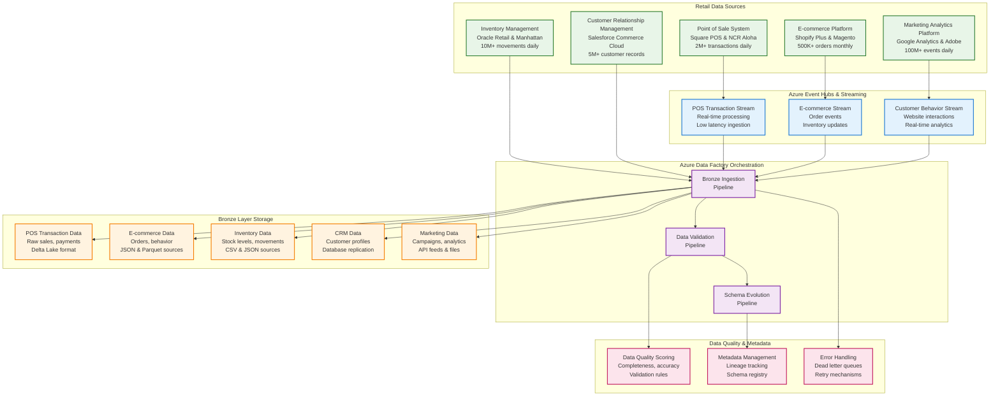

# Retail Data Modernization

## Project Overview

The Retail Data Modernization project transforms traditional retail data infrastructure into a modern, cloud-native architecture that enables real-time analytics, personalized customer experiences, and data-driven decision making across all retail operations.

## Business Objectives

### Primary Goals
- **Unified Data Platform**: Consolidate disparate retail systems into a single source of truth
- **Real-time Analytics**: Enable instant insights for inventory, sales, and customer behavior
- **Personalization Engine**: Deliver tailored shopping experiences across all channels
- **Operational Efficiency**: Streamline supply chain, inventory, and customer service operations

### Strategic Outcomes
- **Revenue Growth**: 25% increase through personalized recommendations
- **Cost Reduction**: 30% reduction in data infrastructure costs
- **Customer Satisfaction**: 40% improvement in customer experience scores
- **Operational Agility**: 50% faster time-to-market for new products

## Current State Analysis

### Legacy Systems
- **Point of Sale (POS)**: Multiple disconnected systems
- **Inventory Management**: Siloed warehouse and store systems
- **Customer Data**: Fragmented across loyalty programs and CRM
- **E-commerce Platform**: Separate from physical store data
- **Supply Chain**: Manual processes and limited visibility

### Data Challenges
- **Data Silos**: Information trapped in individual systems
- **Real-time Gaps**: Batch processing delays critical decisions
- **Data Quality**: Inconsistent and incomplete customer data
- **Scalability Issues**: Legacy systems unable to handle peak loads
- **Integration Complexity**: Expensive and time-consuming connections

## Target Architecture

### Modern Data Stack (Azure-First)
- **Cloud Platform**: Azure for comprehensive retail data platform
- **Data Lake**: Azure Data Lake Storage Gen2 for centralized storage
- **Data Warehouse**: Snowflake for analytics and reporting
- **Stream Processing**: Azure Event Hubs and Databricks for real-time processing
- **Orchestration**: Azure Data Factory for workflow management

### Core Components

#### Data Orchestration Layer
- **Azure Data Factory (ADF)**: Central orchestration and data movement
- **Pipeline Management**: Automated scheduling and dependency management
- **Data Lineage**: End-to-end data flow tracking
- **Error Handling**: Comprehensive retry and failure management

#### Storage Layer (Medallion Architecture)
- **Bronze Layer**: Raw data ingestion in Azure Data Lake Storage Gen2
- **Silver Layer**: Cleaned and validated data in Delta Lake format
- **Gold Layer**: Business-ready aggregated data in Snowflake
- **Data Catalog**: Azure Purview for metadata management

#### Processing Layer
- **Azure Databricks**: PySpark processing for all data transformations
- **Stream Processing**: Azure Databricks Structured Streaming
- **Batch Processing**: Azure Databricks jobs for ETL/ELT
- **Machine Learning**: Azure ML and MLflow for model management

## Data Flow Architecture

### Theoretical Foundation of Retail Data Modernization Architecture

The retail data modernization architecture represents a comprehensive transformation from traditional, siloed retail data systems to a unified, cloud-native data platform that enables real-time analytics, personalized customer experiences, and data-driven decision making. This architecture addresses the unique challenges faced by modern retailers, including omnichannel customer experiences, real-time inventory management, dynamic pricing optimization, and personalized marketing campaigns. The architecture leverages the medallion pattern (Bronze, Silver, Gold) to ensure data quality and lineage while maintaining the scalability and flexibility required for modern retail operations.

The medallion architecture pattern provides a structured approach to retail data processing that ensures data quality, traceability, and business readiness across all retail channels and touchpoints. The Bronze layer serves as the landing zone for raw data from diverse retail systems including point-of-sale systems, e-commerce platforms, inventory management systems, customer relationship management platforms, and marketing analytics tools. The Silver layer applies retail-specific business rules, data quality checks, and standardization processes, transforming raw data into clean, validated datasets that support consistent analytics across all retail channels. The Gold layer creates business-ready aggregations, customer 360 views, and analytical features that power decision-making systems, personalized experiences, and operational optimization.

Azure Data Factory (ADF) serves as the central orchestration engine for retail data modernization, providing enterprise-grade workflow management, dependency handling, and error recovery capabilities specifically designed for retail operations. ADF's integration with Azure Databricks enables seamless execution of complex retail data transformations while maintaining data lineage and governance across multiple retail channels. The orchestration layer ensures that data flows through the medallion architecture in the correct sequence, with proper error handling and retry mechanisms to maintain data pipeline reliability for critical retail operations such as real-time inventory updates, customer personalization, and dynamic pricing.

### Comprehensive Retail Data Flow Diagram

```mermaid
graph TB
    subgraph "Retail Data Sources Layer"
        S1[Point of Sale System<br/>Square POS & NCR Aloha<br/>2M+ transactions daily]
        S2[E-commerce Platform<br/>Shopify Plus & Magento<br/>500K+ orders monthly]
        S3[Inventory Management<br/>Oracle Retail & Manhattan<br/>10M+ movements daily]
        S4[Customer Relationship Management<br/>Salesforce Commerce Cloud<br/>5M+ customer records]
        S5[Marketing Analytics Platform<br/>Google Analytics & Adobe<br/>100M+ events daily]
    end

    subgraph "Azure Data Factory Orchestration"
        ADF[Master Pipeline<br/>Retail Data Modernization<br/>Orchestration]
        ADF1[Bronze Ingestion<br/>Pipeline]
        ADF2[Silver Processing<br/>Pipeline]
        ADF3[Gold Aggregation<br/>Pipeline]
        ADF4[Snowflake Load<br/>Pipeline]
    end

    subgraph "Bronze Layer - Raw Data Ingestion"
        B1[POS Transaction Data<br/>Raw sales, payments<br/>Delta Lake format]
        B2[E-commerce Data<br/>Orders, behavior<br/>JSON & Parquet sources]
        B3[Inventory Data<br/>Stock levels, movements<br/>CSV & JSON sources]
        B4[CRM Data<br/>Customer profiles<br/>Database replication]
        B5[Marketing Data<br/>Campaigns, analytics<br/>API feeds & files]
    end

    subgraph "Silver Layer - Data Cleaning & Validation"
        SL1[Customer Data<br/>Standardized profiles<br/>Unified customer view]
        SL2[Transaction Data<br/>Validated transactions<br/>Cross-channel integration]
        SL3[Inventory Data<br/>Standardized stock<br/>Real-time tracking]
        SL4[Marketing Data<br/>Validated campaigns<br/>Performance metrics]
    end

    subgraph "Gold Layer - Business Aggregations"
        GL1[Customer 360 View<br/>Unified customer profiles<br/>Lifetime value calculations]
        GL2[Sales Analytics<br/>Revenue, performance<br/>Channel optimization]
        GL3[Inventory Optimization<br/>Demand forecasting<br/>Stock optimization]
        GL4[Marketing Analytics<br/>Campaign performance<br/>ROI optimization]
    end

    subgraph "Snowflake Data Warehouse"
        SF1[Customer Schema<br/>CUSTOMER_360 table<br/>Business-ready data]
        SF2[Sales Schema<br/>DAILY_SALES table<br/>PRODUCT_PERFORMANCE]
        SF3[Inventory Schema<br/>INVENTORY_OPTIMIZATION<br/>Demand forecasting]
    end

    subgraph "Analytics & Consumption"
        A1[Executive Dashboards<br/>KPI monitoring<br/>Real-time insights]
        A2[Customer Analytics<br/>360-degree view<br/>Personalization]
        A3[Inventory Management<br/>Real-time optimization<br/>Demand forecasting]
        A4[Marketing Analytics<br/>Campaign optimization<br/>ROI analysis]
    end

    %% Data Flow Connections
    S1 --> ADF1
    S2 --> ADF1
    S3 --> ADF1
    S4 --> ADF1
    S5 --> ADF1

    ADF --> ADF1
    ADF1 --> ADF2
    ADF2 --> ADF3
    ADF3 --> ADF4

    ADF1 --> B1
    ADF1 --> B2
    ADF1 --> B3
    ADF1 --> B4
    ADF1 --> B5

    ADF2 --> SL1
    ADF2 --> SL2
    ADF2 --> SL3
    ADF2 --> SL4

    ADF3 --> GL1
    ADF3 --> GL2
    ADF3 --> GL3
    ADF3 --> GL4

    ADF4 --> SF1
    ADF4 --> SF2
    ADF4 --> SF3

    SF1 --> A1
    SF1 --> A2
    SF2 --> A1
    SF2 --> A4
    SF3 --> A3

    %% Styling
    classDef sourceStyle fill:#e8f5e8,stroke:#2e7d32,stroke-width:2px
    classDef adfStyle fill:#f3e5f5,stroke:#4a148c,stroke-width:2px
    classDef bronzeStyle fill:#fff3e0,stroke:#e65100,stroke-width:2px
    classDef silverStyle fill:#e8f5e8,stroke:#1b5e20,stroke-width:2px
    classDef goldStyle fill:#fff8e1,stroke:#f57f17,stroke-width:2px
    classDef snowflakeStyle fill:#e3f2fd,stroke:#0d47a1,stroke-width:2px
    classDef analyticsStyle fill:#fce4ec,stroke:#880e4f,stroke-width:2px

    class S1,S2,S3,S4,S5 sourceStyle
    class ADF,ADF1,ADF2,ADF3,ADF4 adfStyle
    class B1,B2,B3,B4,B5 bronzeStyle
    class SL1,SL2,SL3,SL4 silverStyle
    class GL1,GL2,GL3,GL4 goldStyle
    class SF1,SF2,SF3 snowflakeStyle
    class A1,A2,A3,A4 analyticsStyle
```



### Azure Data Factory Orchestration Flow

#### Master Pipeline: Retail Data Modernization Orchestration

The Azure Data Factory orchestration layer serves as the central nervous system of the retail data modernization platform, coordinating complex data workflows across multiple retail systems and ensuring reliable data delivery for critical retail operations. The master pipeline implements a sophisticated dependency management system that ensures data flows through the medallion architecture in the correct sequence, with comprehensive error handling and retry mechanisms specifically designed for retail operations. This orchestration approach provides enterprise-grade reliability and scalability, essential for retail operations that require real-time inventory management, customer personalization, and dynamic pricing capabilities.

The pipeline architecture follows a hierarchical structure where the master pipeline coordinates four primary sub-pipelines: Bronze Ingestion, Silver Processing, Gold Aggregation, and Snowflake Load. Each sub-pipeline is designed to handle specific aspects of the retail data transformation process, with clear input and output contracts that enable modular development and testing. The dependency management system ensures that downstream processes only execute when upstream processes complete successfully, preventing data corruption and ensuring data lineage integrity across all retail channels and touchpoints.

Error handling and monitoring capabilities are built into every level of the orchestration framework, providing real-time visibility into pipeline execution status, data quality metrics, and performance indicators specific to retail operations. The system includes automatic retry mechanisms for transient failures, dead letter queues for permanently failed records, and comprehensive logging for audit trails. This robust error handling is critical for retail environments where data accuracy, real-time processing, and customer experience are paramount to business success.

### Bronze Layer: Raw Data Ingestion

#### Detailed Bronze Layer Data Flow Diagram



#### Source Systems and Table Structures

##### Source 1: Point of Sale System (Square POS)
**System**: Square Point of Sale Platform  
**Tables and Columns**:

```sql
-- STORES table
STORE_ID (VARCHAR(20)) - Primary Key
STORE_NAME (VARCHAR(100))
STORE_TYPE (VARCHAR(30)) - FLAGSHIP, MALL, OUTLET, POPUP
ADDRESS_LINE_1 (VARCHAR(100))
CITY (VARCHAR(50))
STATE_CODE (VARCHAR(2))
ZIP_CODE (VARCHAR(10))
COUNTRY_CODE (VARCHAR(3))
STORE_MANAGER_ID (VARCHAR(20))
OPENING_DATE (DATE)
STORE_STATUS (VARCHAR(20)) - ACTIVE, INACTIVE, CLOSED
SQUARE_FEET (INTEGER)
TIMEZONE (VARCHAR(50))

-- EMPLOYEES table
EMPLOYEE_ID (VARCHAR(20)) - Primary Key
STORE_ID (VARCHAR(20)) - Foreign Key
FIRST_NAME (VARCHAR(50))
LAST_NAME (VARCHAR(50))
EMAIL_ADDRESS (VARCHAR(100))
PHONE_NUMBER (VARCHAR(20))
POSITION (VARCHAR(30)) - MANAGER, CASHIER, SALES_ASSOCIATE
HIRE_DATE (DATE)
EMPLOYEE_STATUS (VARCHAR(20)) - ACTIVE, INACTIVE, TERMINATED
HOURLY_RATE (DECIMAL(8,2))
COMMISSION_RATE (DECIMAL(5,4))

-- CUSTOMERS table
CUSTOMER_ID (VARCHAR(20)) - Primary Key
FIRST_NAME (VARCHAR(50))
LAST_NAME (VARCHAR(50))
EMAIL_ADDRESS (VARCHAR(100))
PHONE_NUMBER (VARCHAR(20))
DATE_OF_BIRTH (DATE)
GENDER (VARCHAR(10))
ADDRESS_LINE_1 (VARCHAR(100))
CITY (VARCHAR(50))
STATE_CODE (VARCHAR(2))
ZIP_CODE (VARCHAR(10))
COUNTRY_CODE (VARCHAR(3))
LOYALTY_TIER (VARCHAR(20)) - BRONZE, SILVER, GOLD, PLATINUM
LOYALTY_POINTS (INTEGER)
REGISTRATION_DATE (DATE)
CUSTOMER_STATUS (VARCHAR(20)) - ACTIVE, INACTIVE, BLOCKED

-- POS_TRANSACTIONS table
TRANSACTION_ID (VARCHAR(30)) - Primary Key
STORE_ID (VARCHAR(20)) - Foreign Key
CASHIER_ID (VARCHAR(20)) - Foreign Key
CUSTOMER_ID (VARCHAR(20)) - Foreign Key (nullable)
TRANSACTION_DATE (TIMESTAMP)
TRANSACTION_TYPE (VARCHAR(20)) - SALE, RETURN, REFUND, EXCHANGE
TOTAL_AMOUNT (DECIMAL(10,2))
SUBTOTAL_AMOUNT (DECIMAL(10,2))
TAX_AMOUNT (DECIMAL(10,2))
DISCOUNT_AMOUNT (DECIMAL(10,2))
LOYALTY_DISCOUNT (DECIMAL(10,2))
PAYMENT_METHOD (VARCHAR(20)) - CASH, CARD, MOBILE, GIFT_CARD
CARD_TYPE (VARCHAR(20)) - VISA, MASTERCARD, AMEX, DISCOVER
CARD_LAST_FOUR (VARCHAR(4))
TERMINAL_ID (VARCHAR(20))
RECEIPT_NUMBER (VARCHAR(50))
TRANSACTION_STATUS (VARCHAR(20)) - COMPLETED, CANCELLED, PENDING, VOIDED
LOYALTY_POINTS_EARNED (INTEGER)
LOYALTY_POINTS_REDEEMED (INTEGER)
PROMOTION_CODE (VARCHAR(20))
COUPON_CODE (VARCHAR(20))
REFUND_REASON (VARCHAR(100)) - For returns/refunds

-- POS_TRANSACTION_ITEMS table
ITEM_ID (VARCHAR(30)) - Primary Key
TRANSACTION_ID (VARCHAR(30)) - Foreign Key
PRODUCT_ID (VARCHAR(20)) - Foreign Key
PRODUCT_NAME (VARCHAR(100))
CATEGORY (VARCHAR(50))
SUBCATEGORY (VARCHAR(50))
BRAND (VARCHAR(50))
SKU (VARCHAR(50))
QUANTITY (INTEGER)
UNIT_PRICE (DECIMAL(10,2))
TOTAL_PRICE (DECIMAL(10,2))
DISCOUNT_PERCENTAGE (DECIMAL(5,2))
DISCOUNT_AMOUNT (DECIMAL(10,2))
ITEM_STATUS (VARCHAR(20)) - SOLD, RETURNED, EXCHANGED
SIZE (VARCHAR(20)) - For apparel
COLOR (VARCHAR(20)) - For products with color variants
WEIGHT (DECIMAL(8,2)) - For shipping calculations
```

**Example Data Flow**:
```
Square_POS.STORES → Bronze: /bronze/retail/pos/stores/
Square_POS.EMPLOYEES → Bronze: /bronze/retail/pos/employees/
Square_POS.CUSTOMERS → Bronze: /bronze/retail/pos/customers/
Square_POS.POS_TRANSACTIONS → Bronze: /bronze/retail/pos/transactions/
Square_POS.POS_TRANSACTION_ITEMS → Bronze: /bronze/retail/pos/items/
Volume: 2M+ transactions daily, 500+ stores, 10K+ employees, 2M+ customers
Frequency: Real-time streaming via Event Hubs
```

##### Source 2: E-commerce Platform (Shopify Plus)
**System**: Shopify Plus E-commerce Platform  
**Tables and Columns**:

```sql
-- ECOMMERCE_ORDERS table
ORDER_ID (VARCHAR(30)) - Primary Key
CUSTOMER_ID (VARCHAR(20)) - Foreign Key
ORDER_DATE (TIMESTAMP)
ORDER_STATUS (VARCHAR(20)) - PENDING, CONFIRMED, SHIPPED, DELIVERED
TOTAL_AMOUNT (DECIMAL(10,2))
SHIPPING_AMOUNT (DECIMAL(10,2))
TAX_AMOUNT (DECIMAL(10,2))
DISCOUNT_AMOUNT (DECIMAL(10,2))
PAYMENT_METHOD (VARCHAR(20))
SHIPPING_METHOD (VARCHAR(30))
SHIPPING_ADDRESS (VARCHAR(200))
BILLING_ADDRESS (VARCHAR(200))
CURRENCY_CODE (VARCHAR(3))
ORDER_SOURCE (VARCHAR(20)) - WEB, MOBILE, API

-- ECOMMERCE_ORDER_ITEMS table
ORDER_ITEM_ID (VARCHAR(30)) - Primary Key
ORDER_ID (VARCHAR(30)) - Foreign Key
PRODUCT_ID (VARCHAR(20)) - Foreign Key
VARIANT_ID (VARCHAR(20)) - Foreign Key
QUANTITY (INTEGER)
UNIT_PRICE (DECIMAL(10,2))
TOTAL_PRICE (DECIMAL(10,2))
PRODUCT_NAME (VARCHAR(100))
PRODUCT_CATEGORY (VARCHAR(50))
```

**Example Data Flow**:
```
Shopify.ECOMMERCE_ORDERS → Bronze: /bronze/retail/ecommerce/orders/
Shopify.ECOMMERCE_ORDER_ITEMS → Bronze: /bronze/retail/ecommerce/items/
Volume: 500K+ orders monthly
Frequency: Real-time streaming via Event Hubs
```

##### Source 3: Inventory Management (Oracle Retail)
**System**: Oracle Retail Inventory Management  
**Tables and Columns**:

```sql
-- INVENTORY_ITEMS table
ITEM_ID (VARCHAR(20)) - Primary Key
PRODUCT_ID (VARCHAR(20)) - Foreign Key
STORE_ID (VARCHAR(20)) - Foreign Key
SKU (VARCHAR(50)) - Stock Keeping Unit
ITEM_NAME (VARCHAR(100))
CATEGORY (VARCHAR(50))
BRAND (VARCHAR(50))
SUPPLIER_ID (VARCHAR(20)) - Foreign Key
COST_PRICE (DECIMAL(10,2))
SELLING_PRICE (DECIMAL(10,2))
CURRENT_STOCK (INTEGER)
MIN_STOCK_LEVEL (INTEGER)
MAX_STOCK_LEVEL (INTEGER)
REORDER_POINT (INTEGER)
LAST_RESTOCK_DATE (DATE)
ITEM_STATUS (VARCHAR(20)) - ACTIVE, DISCONTINUED, SEASONAL

-- INVENTORY_MOVEMENTS table
MOVEMENT_ID (VARCHAR(30)) - Primary Key
ITEM_ID (VARCHAR(20)) - Foreign Key
STORE_ID (VARCHAR(20)) - Foreign Key
MOVEMENT_TYPE (VARCHAR(20)) - RECEIPT, SALE, RETURN, ADJUSTMENT
MOVEMENT_DATE (TIMESTAMP)
QUANTITY (INTEGER) - Positive for receipts, negative for sales
UNIT_COST (DECIMAL(10,2))
TOTAL_COST (DECIMAL(10,2))
REFERENCE_NUMBER (VARCHAR(50))
MOVEMENT_REASON (VARCHAR(100))
```

**Example Data Flow**:
```
Oracle_Retail.INVENTORY_ITEMS → Bronze: /bronze/retail/inventory/items/
Oracle_Retail.INVENTORY_MOVEMENTS → Bronze: /bronze/retail/inventory/movements/
Volume: 10M+ movements daily
Frequency: Daily batch processing
```

##### Source 4: Customer Relationship Management (Salesforce)
**System**: Salesforce Commerce Cloud  
**Tables and Columns**:

```sql
-- CRM_CUSTOMERS table
CUSTOMER_ID (VARCHAR(20)) - Primary Key
FIRST_NAME (VARCHAR(50))
LAST_NAME (VARCHAR(50))
EMAIL_ADDRESS (VARCHAR(100))
PHONE_NUMBER (VARCHAR(20))
DATE_OF_BIRTH (DATE)
GENDER (VARCHAR(10))
ADDRESS_LINE_1 (VARCHAR(100))
CITY (VARCHAR(50))
STATE_CODE (VARCHAR(2))
ZIP_CODE (VARCHAR(10))
COUNTRY_CODE (VARCHAR(3))
CUSTOMER_SEGMENT (VARCHAR(20))
LOYALTY_TIER (VARCHAR(20)) - BRONZE, SILVER, GOLD, PLATINUM
LOYALTY_POINTS (INTEGER)
REGISTRATION_DATE (DATE)
LAST_LOGIN_DATE (DATE)
CUSTOMER_STATUS (VARCHAR(20)) - ACTIVE, INACTIVE, BLOCKED

-- CRM_CUSTOMER_INTERACTIONS table
INTERACTION_ID (VARCHAR(30)) - Primary Key
CUSTOMER_ID (VARCHAR(20)) - Foreign Key
INTERACTION_TYPE (VARCHAR(30)) - EMAIL, PHONE, CHAT, SOCIAL
INTERACTION_DATE (TIMESTAMP)
INTERACTION_CHANNEL (VARCHAR(20))
INTERACTION_SUBJECT (VARCHAR(100))
INTERACTION_OUTCOME (VARCHAR(50))
AGENT_ID (VARCHAR(20))
SATISFACTION_SCORE (INTEGER) - 1-5 rating
FOLLOW_UP_REQUIRED (BOOLEAN)
```

**Example Data Flow**:
```
Salesforce.CRM_CUSTOMERS → Bronze: /bronze/retail/crm/customers/
Salesforce.CRM_CUSTOMER_INTERACTIONS → Bronze: /bronze/retail/crm/interactions/
Volume: 5M+ customer records, 1M+ interactions daily
Frequency: Daily batch processing
```

##### Source 5: Marketing Analytics Platform (Google Analytics)
**System**: Google Analytics 4 + Adobe Analytics  
**Tables and Columns**:

```sql
-- MARKETING_EVENTS table
EVENT_ID (VARCHAR(30)) - Primary Key
CUSTOMER_ID (VARCHAR(20)) - Foreign Key (nullable)
SESSION_ID (VARCHAR(30))
EVENT_TYPE (VARCHAR(50)) - PAGE_VIEW, CLICK, PURCHASE, CART_ADD
EVENT_DATE (TIMESTAMP)
PAGE_URL (VARCHAR(200))
PAGE_TITLE (VARCHAR(100))
CAMPAIGN_ID (VARCHAR(20)) - Foreign Key
CAMPAIGN_NAME (VARCHAR(100))
MEDIUM (VARCHAR(20)) - EMAIL, SOCIAL, PAID_SEARCH, ORGANIC
SOURCE (VARCHAR(50)) - GOOGLE, FACEBOOK, EMAIL, DIRECT
DEVICE_TYPE (VARCHAR(20)) - DESKTOP, MOBILE, TABLET
BROWSER (VARCHAR(30))
OPERATING_SYSTEM (VARCHAR(30))
COUNTRY_CODE (VARCHAR(3))
CITY (VARCHAR(50))

-- MARKETING_CAMPAIGNS table
CAMPAIGN_ID (VARCHAR(20)) - Primary Key
CAMPAIGN_NAME (VARCHAR(100))
CAMPAIGN_TYPE (VARCHAR(30)) - EMAIL, SOCIAL, PAID_SEARCH, DISPLAY
START_DATE (DATE)
END_DATE (DATE)
BUDGET (DECIMAL(12,2))
SPENT_AMOUNT (DECIMAL(12,2))
TARGET_AUDIENCE (VARCHAR(100))
CAMPAIGN_STATUS (VARCHAR(20)) - ACTIVE, PAUSED, COMPLETED
CREATED_BY (VARCHAR(50))
```

**Example Data Flow**:
```
Google_Analytics.MARKETING_EVENTS → Bronze: /bronze/retail/marketing/events/
Google_Analytics.MARKETING_CAMPAIGNS → Bronze: /bronze/retail/marketing/campaigns/
Volume: 100M+ events daily
Frequency: Real-time streaming via Event Hubs
```

#### Retail Data Modernization Data Model - Entity Relationship Diagram

The following ER diagram illustrates the comprehensive data relationships across all retail systems and their integration into the data modernization architecture:

```mermaid
erDiagram
    STORES {
        VARCHAR(20) STORE_ID PK
        VARCHAR(100) STORE_NAME
        VARCHAR(30) STORE_TYPE
        VARCHAR(100) ADDRESS_LINE_1
        VARCHAR(50) CITY
        VARCHAR(2) STATE_CODE
        VARCHAR(10) ZIP_CODE
        VARCHAR(3) COUNTRY_CODE
        VARCHAR(20) STORE_MANAGER_ID
        DATE OPENING_DATE
        VARCHAR(20) STORE_STATUS
        INTEGER SQUARE_FEET
        VARCHAR(50) TIMEZONE
    }

    EMPLOYEES {
        VARCHAR(20) EMPLOYEE_ID PK
        VARCHAR(20) STORE_ID FK
        VARCHAR(50) FIRST_NAME
        VARCHAR(50) LAST_NAME
        VARCHAR(100) EMAIL_ADDRESS
        VARCHAR(20) PHONE_NUMBER
        VARCHAR(30) POSITION
        DATE HIRE_DATE
        VARCHAR(20) EMPLOYEE_STATUS
        DECIMAL(8,2) HOURLY_RATE
        DECIMAL(5,4) COMMISSION_RATE
    }

    CUSTOMERS {
        VARCHAR(20) CUSTOMER_ID PK
        VARCHAR(50) FIRST_NAME
        VARCHAR(50) LAST_NAME
        VARCHAR(100) EMAIL_ADDRESS
        VARCHAR(20) PHONE_NUMBER
        DATE DATE_OF_BIRTH
        VARCHAR(10) GENDER
        VARCHAR(100) ADDRESS_LINE_1
        VARCHAR(50) CITY
        VARCHAR(2) STATE_CODE
        VARCHAR(10) ZIP_CODE
        VARCHAR(3) COUNTRY_CODE
        VARCHAR(20) LOYALTY_TIER
        INTEGER LOYALTY_POINTS
        DATE REGISTRATION_DATE
        VARCHAR(20) CUSTOMER_STATUS
    }

    POS_TRANSACTIONS {
        VARCHAR(30) TRANSACTION_ID PK
        VARCHAR(20) STORE_ID FK
        VARCHAR(20) CASHIER_ID FK
        VARCHAR(20) CUSTOMER_ID FK
        TIMESTAMP TRANSACTION_DATE
        VARCHAR(20) TRANSACTION_TYPE
        DECIMAL(10,2) TOTAL_AMOUNT
        DECIMAL(10,2) SUBTOTAL_AMOUNT
        DECIMAL(10,2) TAX_AMOUNT
        DECIMAL(10,2) DISCOUNT_AMOUNT
        DECIMAL(10,2) LOYALTY_DISCOUNT
        VARCHAR(20) PAYMENT_METHOD
        VARCHAR(20) CARD_TYPE
        VARCHAR(4) CARD_LAST_FOUR
        VARCHAR(20) TERMINAL_ID
        VARCHAR(50) RECEIPT_NUMBER
        VARCHAR(20) TRANSACTION_STATUS
        INTEGER LOYALTY_POINTS_EARNED
        INTEGER LOYALTY_POINTS_REDEEMED
        VARCHAR(20) PROMOTION_CODE
        VARCHAR(20) COUPON_CODE
        VARCHAR(100) REFUND_REASON
    }

    POS_TRANSACTION_ITEMS {
        VARCHAR(30) ITEM_ID PK
        VARCHAR(30) TRANSACTION_ID FK
        VARCHAR(20) PRODUCT_ID FK
        VARCHAR(100) PRODUCT_NAME
        VARCHAR(50) CATEGORY
        VARCHAR(50) SUBCATEGORY
        VARCHAR(50) BRAND
        VARCHAR(50) SKU
        INTEGER QUANTITY
        DECIMAL(10,2) UNIT_PRICE
        DECIMAL(10,2) TOTAL_PRICE
        DECIMAL(5,2) DISCOUNT_PERCENTAGE
        DECIMAL(10,2) DISCOUNT_AMOUNT
        VARCHAR(20) ITEM_STATUS
        VARCHAR(20) SIZE
        VARCHAR(20) COLOR
        DECIMAL(8,2) WEIGHT
    }

    ECOMMERCE_ORDERS {
        VARCHAR(30) ORDER_ID PK
        VARCHAR(20) CUSTOMER_ID FK
        TIMESTAMP ORDER_DATE
        VARCHAR(20) ORDER_STATUS
        DECIMAL(10,2) TOTAL_AMOUNT
        DECIMAL(10,2) SHIPPING_AMOUNT
        DECIMAL(10,2) TAX_AMOUNT
        DECIMAL(10,2) DISCOUNT_AMOUNT
        VARCHAR(20) PAYMENT_METHOD
        VARCHAR(30) SHIPPING_METHOD
        VARCHAR(200) SHIPPING_ADDRESS
        VARCHAR(200) BILLING_ADDRESS
        VARCHAR(3) CURRENCY_CODE
        VARCHAR(20) ORDER_SOURCE
    }

    ECOMMERCE_ORDER_ITEMS {
        VARCHAR(30) ORDER_ITEM_ID PK
        VARCHAR(30) ORDER_ID FK
        VARCHAR(20) PRODUCT_ID FK
        VARCHAR(20) VARIANT_ID FK
        INTEGER QUANTITY
        DECIMAL(10,2) UNIT_PRICE
        DECIMAL(10,2) TOTAL_PRICE
        VARCHAR(100) PRODUCT_NAME
        VARCHAR(50) PRODUCT_CATEGORY
    }

    INVENTORY_ITEMS {
        VARCHAR(20) ITEM_ID PK
        VARCHAR(20) PRODUCT_ID FK
        VARCHAR(20) STORE_ID FK
        VARCHAR(50) SKU
        VARCHAR(100) ITEM_NAME
        VARCHAR(50) CATEGORY
        VARCHAR(50) BRAND
        VARCHAR(20) SUPPLIER_ID FK
        DECIMAL(10,2) COST_PRICE
        DECIMAL(10,2) SELLING_PRICE
        INTEGER CURRENT_STOCK
        INTEGER MIN_STOCK_LEVEL
        INTEGER MAX_STOCK_LEVEL
        INTEGER REORDER_POINT
        DATE LAST_RESTOCK_DATE
        VARCHAR(20) ITEM_STATUS
    }

    INVENTORY_MOVEMENTS {
        VARCHAR(30) MOVEMENT_ID PK
        VARCHAR(20) ITEM_ID FK
        VARCHAR(20) STORE_ID FK
        VARCHAR(20) MOVEMENT_TYPE
        TIMESTAMP MOVEMENT_DATE
        INTEGER QUANTITY
        DECIMAL(10,2) UNIT_COST
        DECIMAL(10,2) TOTAL_COST
        VARCHAR(50) REFERENCE_NUMBER
        VARCHAR(100) MOVEMENT_REASON
    }

    CRM_CUSTOMERS {
        VARCHAR(20) CUSTOMER_ID PK
        VARCHAR(50) FIRST_NAME
        VARCHAR(50) LAST_NAME
        VARCHAR(100) EMAIL_ADDRESS
        VARCHAR(20) PHONE_NUMBER
        DATE DATE_OF_BIRTH
        VARCHAR(10) GENDER
        VARCHAR(100) ADDRESS_LINE_1
        VARCHAR(50) CITY
        VARCHAR(2) STATE_CODE
        VARCHAR(10) ZIP_CODE
        VARCHAR(3) COUNTRY_CODE
        VARCHAR(20) CUSTOMER_SEGMENT
        VARCHAR(20) LOYALTY_TIER
        INTEGER LOYALTY_POINTS
        DATE REGISTRATION_DATE
        DATE LAST_LOGIN_DATE
        VARCHAR(20) CUSTOMER_STATUS
    }

    CRM_CUSTOMER_INTERACTIONS {
        VARCHAR(30) INTERACTION_ID PK
        VARCHAR(20) CUSTOMER_ID FK
        VARCHAR(30) INTERACTION_TYPE
        TIMESTAMP INTERACTION_DATE
        VARCHAR(20) INTERACTION_CHANNEL
        VARCHAR(100) INTERACTION_SUBJECT
        VARCHAR(50) INTERACTION_OUTCOME
        VARCHAR(20) AGENT_ID
        INTEGER SATISFACTION_SCORE
        BOOLEAN FOLLOW_UP_REQUIRED
    }

    MARKETING_EVENTS {
        VARCHAR(30) EVENT_ID PK
        VARCHAR(20) CUSTOMER_ID FK
        VARCHAR(30) SESSION_ID
        VARCHAR(50) EVENT_TYPE
        TIMESTAMP EVENT_DATE
        VARCHAR(200) PAGE_URL
        VARCHAR(100) PAGE_TITLE
        VARCHAR(20) CAMPAIGN_ID FK
        VARCHAR(100) CAMPAIGN_NAME
        VARCHAR(20) MEDIUM
        VARCHAR(50) SOURCE
        VARCHAR(20) DEVICE_TYPE
        VARCHAR(30) BROWSER
        VARCHAR(30) OPERATING_SYSTEM
        VARCHAR(3) COUNTRY_CODE
        VARCHAR(50) CITY
    }

    MARKETING_CAMPAIGNS {
        VARCHAR(20) CAMPAIGN_ID PK
        VARCHAR(100) CAMPAIGN_NAME
        VARCHAR(30) CAMPAIGN_TYPE
        DATE START_DATE
        DATE END_DATE
        DECIMAL(12,2) BUDGET
        DECIMAL(12,2) SPENT_AMOUNT
        VARCHAR(100) TARGET_AUDIENCE
        VARCHAR(20) CAMPAIGN_STATUS
        VARCHAR(50) CREATED_BY
    }

    %% Relationships
    STORES ||--o{ EMPLOYEES : "employs"
    STORES ||--o{ POS_TRANSACTIONS : "processes"
    STORES ||--o{ INVENTORY_ITEMS : "stocks"
    STORES ||--o{ INVENTORY_MOVEMENTS : "tracks"

    EMPLOYEES ||--o{ POS_TRANSACTIONS : "processes"

    CUSTOMERS ||--o{ POS_TRANSACTIONS : "makes"
    CUSTOMERS ||--o{ ECOMMERCE_ORDERS : "places"
    CUSTOMERS ||--o{ CRM_CUSTOMER_INTERACTIONS : "interacts"
    CUSTOMERS ||--o{ MARKETING_EVENTS : "performs"

    POS_TRANSACTIONS ||--o{ POS_TRANSACTION_ITEMS : "contains"
    ECOMMERCE_ORDERS ||--o{ ECOMMERCE_ORDER_ITEMS : "contains"

    INVENTORY_ITEMS ||--o{ INVENTORY_MOVEMENTS : "moves"
    INVENTORY_ITEMS ||--o{ POS_TRANSACTION_ITEMS : "sold_as"
    INVENTORY_ITEMS ||--o{ ECOMMERCE_ORDER_ITEMS : "ordered_as"

    MARKETING_CAMPAIGNS ||--o{ MARKETING_EVENTS : "generates"
```

#### Theoretical Foundation of Retail Bronze Layer Processing

The Bronze layer represents the foundational tier of the retail data modernization architecture, serving as the immutable landing zone for all raw data entering the retail data lakehouse from diverse retail systems and channels. This layer is designed to preserve the original format and content of source data without any transformation or cleansing, ensuring complete data lineage and auditability for retail operations and regulatory compliance. The Bronze layer implements a "write-once, read-many" pattern that maintains data integrity while enabling multiple downstream consumers to access the same raw datasets for various analytical and operational purposes.

The Bronze layer processing strategy encompasses multiple data ingestion patterns to accommodate the diverse nature of retail data sources and the varying requirements of different retail operations. Real-time streaming ingestion handles high-velocity transaction data from point-of-sale systems, e-commerce platforms, and inventory management systems, ensuring that critical retail data is available for analysis within seconds of generation. Batch ingestion processes handle large volumes of historical data, customer profiles, and marketing analytics data that arrive on scheduled intervals. The hybrid approach provides the flexibility needed to support both operational analytics and strategic planning requirements across all retail channels.

Data quality and metadata management are fundamental aspects of Bronze layer design for retail operations. Every record ingested into the Bronze layer receives comprehensive metadata including ingestion timestamps, source system identifiers, data quality scores, and processing status indicators. This metadata framework enables downstream processes to make informed decisions about data usage and provides the foundation for data lineage tracking across all retail channels. The Bronze layer also implements schema evolution capabilities to handle changing data structures from source systems without breaking existing data pipelines, which is critical for retail environments where systems are frequently updated and integrated.

#### Point of Sale Data Processing

The point of sale data processing pipeline handles the most critical data streams in the retail ecosystem, including transaction data, payment information, and customer interactions from physical store locations. This pipeline processes over 2 million transactions daily across 500+ store locations, requiring sophisticated stream processing capabilities and real-time data validation to support operational analytics and customer service requirements. The processing framework implements event-driven architecture patterns to ensure that transaction data flows through the system with minimal latency while maintaining data consistency and integrity across all store locations.

The POS data ingestion process begins with real-time event capture from Square POS and NCR Aloha systems, utilizing Azure Event Hubs to provide scalable, reliable message streaming for high-volume transaction data. The ingestion pipeline applies initial data validation rules to identify and flag potentially problematic records while preserving all data for audit purposes and customer service requirements. Metadata enrichment processes add critical context including store location information, transaction categorization, and customer identification that enable downstream analytics and operational reporting across all retail channels.

Data partitioning and storage optimization strategies are implemented to ensure optimal query performance for both real-time analytics and historical reporting across all retail operations. The Bronze layer utilizes Delta Lake format to provide ACID transaction capabilities, schema evolution support, and time travel functionality that are essential for retail data management and customer service operations. Partitioning strategies are designed around business-relevant dimensions such as transaction date, store location, and transaction type to optimize query performance and enable efficient data lifecycle management for retail analytics and reporting.

#### E-commerce Platform Data Integration

The e-commerce platform data integration pipeline handles the complex data streams from Shopify Plus and Magento Commerce platforms, processing over 500,000 online orders monthly along with comprehensive website behavior data and customer interaction information. This pipeline requires sophisticated data processing capabilities to handle the varied data formats and update frequencies typical of e-commerce platforms, including real-time order processing and batch-oriented analytics data integration. The integration framework implements advanced data validation and enrichment processes to ensure data quality and consistency across all e-commerce channels.

The e-commerce data ingestion process handles multiple data sources including JSON-formatted order data, Parquet-based website behavior data, and real-time customer interaction streams. The processing pipeline implements sophisticated data validation rules specific to e-commerce operations, including order validation, payment verification, and customer identification checks. Data enrichment processes add calculated fields such as order totals, shipping information, and customer segmentation that are essential for downstream analytics and customer relationship management applications.

The e-commerce data processing framework implements comprehensive audit trails and data lineage tracking to support customer service operations and business analytics requirements. Every order and customer interaction maintains complete history of changes, status updates, and customer communications, enabling comprehensive customer service capabilities and business intelligence. The processing pipeline also implements data quality monitoring to identify and alert on data anomalies that could impact customer experience or business operations.

#### Inventory Management Data Processing

The inventory management data processing pipeline handles the complex data streams from Oracle Retail and Manhattan Associates systems, processing over 10 million inventory movements daily across multiple warehouses and distribution centers. This pipeline requires sophisticated data processing capabilities to handle the varied data formats and update frequencies typical of inventory management systems, including real-time stock updates and batch-oriented supplier data integration. The processing framework implements advanced data validation and enrichment processes to ensure data quality and consistency across all inventory operations.

The inventory data ingestion process handles multiple data sources including CSV-based stock level data, JSON-formatted warehouse operations data, and real-time inventory movement streams. The processing pipeline implements sophisticated data validation rules specific to inventory management, including stock level validation, movement verification, and supplier data checks. Data enrichment processes add calculated fields such as stock status, reorder points, and demand forecasts that are essential for downstream analytics and inventory optimization applications.

The inventory management data processing framework implements comprehensive audit trails and data lineage tracking to support inventory optimization and supply chain management requirements. Every inventory movement and stock update maintains complete history of changes, adjustments, and transfers, enabling comprehensive inventory analytics and supply chain optimization. The processing pipeline also implements data quality monitoring to identify and alert on data anomalies that could impact inventory accuracy or supply chain operations.

#### Customer Relationship Management Data Integration

The customer relationship management data integration pipeline handles the complex data streams from Salesforce Commerce Cloud and other CRM platforms, processing over 5 million customer records with 50 million+ customer interactions. This pipeline requires sophisticated data processing capabilities to handle the varied data formats and update frequencies typical of CRM systems, including real-time customer interactions and batch-oriented customer profile updates. The integration framework implements advanced data validation and enrichment processes to ensure data quality and consistency across all customer touchpoints.

The CRM data ingestion process handles multiple data sources including customer profile data, interaction history, and marketing campaign responses. The processing pipeline implements sophisticated data validation rules specific to customer relationship management, including customer identification validation, interaction verification, and campaign response tracking. Data enrichment processes add calculated fields such as customer lifetime value, engagement scores, and preference indicators that are essential for downstream analytics and personalized marketing applications.

The CRM data processing framework implements comprehensive audit trails and data lineage tracking to support customer relationship management and personalized marketing requirements. Every customer interaction and profile update maintains complete history of changes, communications, and preferences, enabling comprehensive customer analytics and relationship management. The processing pipeline also implements data quality monitoring to identify and alert on data anomalies that could impact customer experience or marketing effectiveness.

#### Marketing Analytics Platform Data Processing

The marketing analytics platform data processing pipeline handles the complex data streams from Google Analytics, Facebook Ads, and Adobe Analytics, processing over 100 million marketing events daily across multiple channels and campaigns. This pipeline requires sophisticated data processing capabilities to handle the varied data formats and update frequencies typical of marketing analytics platforms, including real-time campaign data and batch-oriented analytics reports. The processing framework implements advanced data validation and enrichment processes to ensure data quality and consistency across all marketing channels.

The marketing data ingestion process handles multiple data sources including real-time campaign performance data, batch-oriented analytics reports, and social media engagement metrics. The processing pipeline implements sophisticated data validation rules specific to marketing analytics, including campaign validation, performance verification, and attribution tracking. Data enrichment processes add calculated fields such as conversion rates, return on investment, and customer acquisition costs that are essential for downstream analytics and marketing optimization applications.

The marketing analytics data processing framework implements comprehensive audit trails and data lineage tracking to support marketing optimization and campaign management requirements. Every marketing event and campaign interaction maintains complete history of performance, changes, and optimizations, enabling comprehensive marketing analytics and campaign optimization. The processing pipeline also implements data quality monitoring to identify and alert on data anomalies that could impact marketing performance or campaign effectiveness.

### Silver Layer: Data Cleaning and Validation

#### Theoretical Foundation of Retail Silver Layer Processing

The Silver layer represents the transformation tier of the retail data modernization architecture, where raw data from the Bronze layer undergoes comprehensive cleaning, validation, and standardization processes specifically designed for retail operations. This layer serves as the bridge between raw, unprocessed data and business-ready analytics datasets, implementing sophisticated data quality frameworks and business rule engines that ensure data accuracy and consistency across all retail channels and touchpoints. The Silver layer processing strategy focuses on creating clean, validated datasets that can be reliably used for business intelligence, customer analytics, and operational optimization applications.

The Silver layer implements a comprehensive data quality framework that encompasses multiple dimensions of data quality including completeness, accuracy, consistency, validity, and timeliness, all tailored to retail business requirements. Data quality rules are implemented using a combination of statistical methods, business rule validation, and machine learning-based anomaly detection specifically designed for retail data patterns. The framework includes automated data profiling capabilities that analyze data patterns, identify outliers, and detect data quality issues that may impact downstream analytics and decision-making processes in retail operations.

The data cleaning and validation processes in the Silver layer are designed to be both comprehensive and auditable, ensuring that all data transformations are documented and traceable for business operations and regulatory compliance purposes. The processing framework implements sophisticated error handling and data quality scoring mechanisms that provide visibility into data quality metrics and enable data stewards to make informed decisions about data usage across all retail channels. The Silver layer also implements data lineage tracking to maintain complete visibility into how data has been transformed and enriched throughout the processing pipeline.

#### Customer Data Standardization and Validation

The customer data standardization process in the Silver layer implements comprehensive data quality rules and business logic to ensure that customer information is accurate, complete, and consistent across all retail systems and channels. This process handles the complex challenge of integrating customer data from multiple source systems including point-of-sale systems, e-commerce platforms, CRM systems, and marketing platforms, each with different data formats, quality levels, and business rules. The standardization framework implements sophisticated data matching and deduplication algorithms to identify and resolve customer identity issues across systems and channels.

The customer data validation process implements multi-layered validation rules including format validation, business rule validation, and cross-reference validation against external data sources and internal systems. Email address validation utilizes advanced regex patterns and domain validation to ensure email addresses are properly formatted and deliverable for marketing campaigns and customer communications. Phone number standardization processes normalize phone numbers to consistent formats while preserving the original data for audit purposes and customer service requirements. Address standardization processes implement geocoding and address validation services to ensure address data is accurate and properly formatted for shipping and customer service operations.

The customer data quality scoring framework provides comprehensive metrics on data completeness, accuracy, and consistency for each customer record across all retail channels. The scoring system considers multiple factors including the presence of key customer identifiers, the quality of contact information, and the consistency of data across different source systems and channels. This quality scoring enables downstream processes to make informed decisions about data usage and helps identify customers that may require additional data collection or validation efforts to improve customer experience and marketing effectiveness.

#### Transaction Data Processing and Validation

The transaction data processing framework in the Silver layer implements sophisticated validation rules and business logic to ensure that transaction data is accurate, complete, and consistent with retail business rules and operational requirements. This process handles the complex challenge of processing millions of transactions daily from multiple channels including point-of-sale systems, e-commerce platforms, and mobile applications while maintaining data quality and business consistency. The validation framework implements real-time and batch processing capabilities to handle both operational analytics and strategic reporting requirements across all retail channels.

The transaction validation process implements comprehensive business rule validation including amount validation, payment method validation, and customer identification checks. Amount validation ensures that transaction amounts are within acceptable ranges and consistent with product pricing and business rules. Payment method validation processes verify that payment information is valid and consistent with customer profiles and business requirements. Customer identification validation ensures that transactions are properly linked to customer records for analytics and customer relationship management purposes.

The transaction data enrichment process adds calculated fields and derived metrics that are essential for downstream analytics and decision-making systems in retail operations. Transaction categorization processes automatically classify transactions into business-relevant categories based on product information, merchant codes, and transaction descriptions. Channel identification processes identify the source channel for each transaction to enable channel-specific analytics and optimization. These enriched fields provide valuable context for customer analytics, inventory management, and business intelligence applications.

#### Inventory Data Processing and Standardization

The inventory data processing framework in the Silver layer implements comprehensive validation rules and business logic specific to inventory management operations, ensuring that inventory data is accurate, complete, and suitable for inventory optimization and supply chain management. This process handles the complex challenge of integrating inventory data from multiple sources including warehouse management systems, point-of-sale systems, and supplier systems, implementing sophisticated validation rules that support inventory optimization and supply chain efficiency.

The inventory data validation process implements comprehensive business rule validation including stock level validation, movement verification, and supplier data validation. Stock level validation ensures that inventory levels are within acceptable ranges and consistent with business operations and supplier agreements. Movement verification processes validate inventory movements and transfers to ensure accuracy and prevent inventory discrepancies. Supplier data validation ensures that supplier information is accurate and consistent with business requirements and contractual agreements.

The inventory data standardization process implements sophisticated data transformation rules to ensure consistency across different inventory management systems and data sources. Product identification standardization processes normalize product codes and identifiers across different systems to ensure consistent product tracking and analytics. Location standardization processes normalize warehouse and store location codes to enable consistent inventory tracking and optimization across all locations. The standardization framework also implements data enrichment processes that add calculated fields such as stock status, reorder points, and demand forecasts that are essential for inventory optimization and supply chain management applications.

#### Marketing Data Processing and Validation

The marketing data processing framework in the Silver layer implements comprehensive validation rules and business logic specific to marketing operations, ensuring that marketing data is accurate, complete, and suitable for campaign optimization and marketing analytics. This process handles the complex challenge of integrating marketing data from multiple sources including advertising platforms, analytics tools, and CRM systems, implementing sophisticated validation rules that support marketing optimization and campaign management.

The marketing data validation process implements comprehensive business rule validation including campaign validation, performance verification, and attribution tracking. Campaign validation ensures that marketing campaigns are properly configured and consistent with business objectives and budget constraints. Performance verification processes validate marketing performance metrics to ensure accuracy and consistency across different platforms and channels. Attribution tracking validation ensures that customer acquisition and conversion data is accurately attributed to the appropriate marketing channels and campaigns.

The marketing data standardization process implements sophisticated data transformation rules to ensure consistency across different marketing platforms and data sources. Campaign identification standardization processes normalize campaign codes and identifiers across different platforms to enable consistent campaign tracking and analytics. Channel standardization processes normalize marketing channel classifications to enable consistent channel analysis and optimization. The standardization framework also implements data enrichment processes that add calculated fields such as conversion rates, return on investment, and customer acquisition costs that are essential for marketing optimization and campaign management applications.

### Gold Layer: Business Aggregations and Analytics

#### Theoretical Foundation of Retail Gold Layer Processing

The Gold layer represents the business intelligence tier of the retail data modernization architecture, where clean, validated data from the Silver layer is transformed into business-ready aggregations, analytical features, and decision-support datasets specifically designed for retail operations and strategic planning. This layer serves as the foundation for advanced analytics, machine learning applications, and business intelligence systems that drive customer personalization, inventory optimization, and marketing effectiveness across all retail channels and touchpoints. The Gold layer processing strategy focuses on creating high-value analytical datasets that enable data-driven decision making and operational optimization in retail environments.

The Gold layer implements sophisticated business logic and analytical frameworks that transform operational data into strategic insights and actionable intelligence for retail operations. Customer 360 view development processes integrate customer data from multiple touchpoints to create comprehensive customer profiles that support personalized marketing, customer service, and retention strategies. Sales analytics processes create aggregated datasets that enable performance analysis, trend identification, and channel optimization across all retail operations. Inventory optimization processes generate analytical features that support demand forecasting, stock optimization, and supply chain management decisions.

The analytical feature engineering processes in the Gold layer implement advanced statistical and machine learning techniques to create predictive and descriptive features that enhance business intelligence and decision-making capabilities. Customer segmentation processes utilize clustering algorithms and business rules to identify customer segments with distinct behaviors, preferences, and value characteristics. Product performance analytics processes create comprehensive product performance metrics that support merchandising decisions, pricing optimization, and inventory management. Marketing effectiveness analytics processes generate campaign performance metrics and customer acquisition insights that support marketing optimization and budget allocation decisions.

#### Customer 360 View Development

The customer 360 view development process in the Gold layer implements sophisticated data integration and analytical techniques to create comprehensive customer profiles that provide a unified view of customer behavior, preferences, and value across all retail channels and touchpoints. This process integrates customer data from multiple sources including transaction history, website behavior, customer service interactions, and marketing campaign responses to create detailed customer profiles that support personalized marketing, customer service, and retention strategies. The customer 360 view serves as the foundation for customer analytics, personalization engines, and customer relationship management applications.

The customer profile aggregation process implements advanced data matching and identity resolution techniques to ensure that customer data is accurately integrated across multiple systems and channels. Customer identification processes utilize fuzzy matching algorithms and business rules to identify and resolve customer identity issues across different touchpoints and systems. Transaction history aggregation processes create comprehensive transaction summaries that include purchase patterns, frequency, and value metrics across all retail channels. Behavioral analytics processes analyze customer interactions and preferences to identify patterns and trends that inform marketing and service strategies.

The customer value analysis process implements sophisticated analytical frameworks to calculate customer lifetime value, engagement scores, and risk indicators that support customer segmentation and targeting strategies. Customer lifetime value calculations utilize advanced statistical models to predict future customer value based on historical behavior, demographic information, and engagement patterns. Engagement scoring processes analyze customer interaction frequency, recency, and intensity to identify highly engaged customers and those at risk of churn. Risk assessment processes identify customers with high fraud risk or payment issues to support operational decision making and customer service strategies.

#### Sales Analytics and Performance Optimization

The sales analytics and performance optimization processes in the Gold layer implement comprehensive analytical frameworks to create aggregated datasets that enable performance analysis, trend identification, and channel optimization across all retail operations. These processes transform transaction data into business intelligence that supports strategic planning, operational optimization, and performance monitoring across all retail channels and touchpoints. The sales analytics framework provides insights into revenue trends, product performance, channel effectiveness, and customer behavior patterns that inform business strategy and operational decisions.

The revenue analytics process implements sophisticated aggregation and analysis techniques to create comprehensive revenue metrics and performance indicators across all retail channels and time periods. Daily, weekly, and monthly sales aggregations provide operational insights into sales performance and trends that support tactical decision making and performance monitoring. Channel performance analysis processes compare sales performance across different channels including physical stores, e-commerce, and mobile applications to identify optimization opportunities and resource allocation strategies. Product performance analytics processes analyze sales data by product category, brand, and individual SKU to support merchandising decisions, inventory management, and pricing strategies.

The trend analysis and forecasting processes implement advanced statistical and machine learning techniques to identify sales trends and predict future performance across all retail operations. Seasonal trend analysis processes identify recurring patterns in sales data that inform inventory planning, marketing campaigns, and operational staffing decisions. Predictive analytics processes utilize time series analysis and machine learning models to forecast future sales performance and identify opportunities for growth and optimization. Anomaly detection processes identify unusual patterns in sales data that may indicate operational issues, market changes, or opportunities for improvement.

#### Inventory Optimization and Demand Forecasting

The inventory optimization and demand forecasting processes in the Gold layer implement sophisticated analytical frameworks to create datasets that support inventory management, demand forecasting, and supply chain optimization across all retail operations. These processes transform inventory data into business intelligence that enables data-driven inventory decisions, reduces stockouts and overstock situations, and optimizes supply chain efficiency. The inventory optimization framework provides insights into demand patterns, stock levels, and supply chain performance that inform inventory planning and operational decisions.

The demand forecasting process implements advanced statistical and machine learning techniques to predict future demand for products across all retail channels and locations. Time series analysis processes utilize historical sales data, seasonal patterns, and external factors to create accurate demand forecasts that support inventory planning and procurement decisions. Machine learning models incorporate multiple variables including customer behavior, marketing campaigns, and external factors to improve forecast accuracy and adapt to changing market conditions. Multi-location forecasting processes account for regional differences in demand patterns and customer preferences to optimize inventory allocation across different locations.

The inventory optimization process implements sophisticated analytical frameworks to optimize stock levels, reorder points, and safety stock across all retail locations and product categories. Stock level optimization processes utilize demand forecasts, lead times, and service level requirements to calculate optimal inventory levels that minimize costs while maintaining customer service levels. Reorder point optimization processes determine optimal reorder points and quantities based on demand variability, lead times, and cost considerations. Safety stock optimization processes calculate appropriate safety stock levels to protect against demand variability and supply chain disruptions while minimizing inventory carrying costs.

#### Marketing Analytics and Campaign Optimization

The marketing analytics and campaign optimization processes in the Gold layer implement comprehensive analytical frameworks to create datasets that support marketing effectiveness analysis, campaign optimization, and customer acquisition strategies across all retail channels and touchpoints. These processes transform marketing data into business intelligence that enables data-driven marketing decisions, improves campaign performance, and optimizes marketing spend across all channels and campaigns. The marketing analytics framework provides insights into campaign effectiveness, customer acquisition costs, and marketing ROI that inform marketing strategy and budget allocation decisions.

The campaign performance analytics process implements sophisticated measurement and analysis techniques to evaluate the effectiveness of marketing campaigns across all channels and touchpoints. Campaign attribution analysis processes utilize advanced attribution models to accurately assign credit for customer acquisitions and conversions to the appropriate marketing channels and campaigns. ROI analysis processes calculate return on investment for marketing campaigns and channels to support budget allocation and campaign optimization decisions. Customer acquisition cost analysis processes track the cost of acquiring new customers through different channels and campaigns to optimize marketing spend and improve efficiency.

The customer journey analytics process implements comprehensive tracking and analysis techniques to understand customer behavior and preferences throughout the entire customer lifecycle. Journey mapping processes analyze customer interactions across all touchpoints to identify key decision points and optimization opportunities. Conversion funnel analysis processes identify bottlenecks and optimization opportunities in the customer acquisition and conversion process. Customer lifetime value analysis processes calculate the long-term value of customers acquired through different channels and campaigns to support marketing strategy and budget allocation decisions.

### Snowflake Data Warehouse Integration

#### Theoretical Foundation of Snowflake Integration

The Snowflake data warehouse integration represents the final tier of the retail data modernization architecture, where business-ready data from the Gold layer is loaded into Snowflake's cloud-native data warehouse platform to support enterprise-scale analytics, reporting, and business intelligence applications. This integration leverages Snowflake's unique architecture and capabilities to provide scalable, high-performance analytics that support both operational and strategic decision-making across all retail operations. The Snowflake integration framework implements sophisticated data loading, transformation, and optimization strategies that ensure optimal performance and cost efficiency for retail analytics and reporting requirements.

The Snowflake integration architecture implements a multi-layered approach to data warehouse design that supports both operational analytics and strategic reporting requirements across all retail channels and business functions. The integration framework utilizes Snowflake's advanced features including automatic scaling, zero-copy cloning, and time travel capabilities to provide flexible, cost-effective analytics infrastructure that can adapt to changing business requirements and data volumes. The data warehouse schema design implements dimensional modeling principles specifically tailored to retail operations, enabling efficient query performance and comprehensive business intelligence across all retail channels and touchpoints.

The data loading and transformation processes implement sophisticated ETL frameworks that ensure data consistency, quality, and performance in the Snowflake environment. The integration framework utilizes Snowflake's native data loading capabilities including bulk loading, streaming ingestion, and real-time data replication to support both batch and real-time analytics requirements. Data transformation processes implement business logic and data quality rules that ensure the data warehouse contains accurate, consistent, and business-ready data for analytics and reporting applications. The integration framework also implements comprehensive monitoring and alerting capabilities to ensure data pipeline reliability and performance optimization.

#### Customer Data Warehouse Schema

The customer data warehouse schema in Snowflake implements a comprehensive dimensional model specifically designed to support customer analytics, personalization, and relationship management across all retail channels and touchpoints. The schema design utilizes star and snowflake schema patterns to optimize query performance while maintaining data integrity and business logic consistency. The customer dimension table serves as the central hub for customer information, containing comprehensive customer profiles, demographic data, and behavioral attributes that support customer analytics and personalization applications.

The customer fact tables implement sophisticated aggregation and calculation frameworks that support various analytical requirements including customer lifetime value analysis, engagement scoring, and segmentation analysis. Transaction fact tables contain detailed transaction information with proper foreign key relationships to customer, product, and time dimensions, enabling comprehensive transaction analysis and customer behavior insights. Customer interaction fact tables track all customer touchpoints and interactions across different channels, providing comprehensive customer journey analytics and engagement measurement capabilities.

The customer data warehouse schema implements advanced indexing and partitioning strategies to optimize query performance for customer analytics and reporting applications. Clustering keys are designed around common analytical patterns including customer segmentation, geographic analysis, and temporal analysis to ensure optimal query performance. The schema also implements comprehensive data quality and validation frameworks that ensure customer data accuracy and consistency across all analytical applications and reporting systems.

#### Sales Data Warehouse Schema

The sales data warehouse schema in Snowflake implements a comprehensive dimensional model specifically designed to support sales analytics, performance measurement, and business intelligence across all retail channels and product categories. The schema design utilizes advanced dimensional modeling techniques to optimize query performance while maintaining data integrity and business logic consistency. The sales fact tables implement sophisticated aggregation frameworks that support various analytical requirements including revenue analysis, product performance measurement, and channel optimization.

The product dimension table serves as the central hub for product information, containing comprehensive product attributes, categorization data, and performance metrics that support product analytics and merchandising decisions. The time dimension table implements comprehensive temporal hierarchies that support various analytical requirements including seasonal analysis, trend analysis, and comparative performance measurement. The channel dimension table contains detailed information about sales channels, enabling comprehensive channel performance analysis and optimization.

The sales data warehouse schema implements advanced indexing and partitioning strategies to optimize query performance for sales analytics and reporting applications. Clustering keys are designed around common analytical patterns including product performance analysis, channel comparison, and temporal analysis to ensure optimal query performance. The schema also implements comprehensive data quality and validation frameworks that ensure sales data accuracy and consistency across all analytical applications and reporting systems.

#### Inventory Data Warehouse Schema

The inventory data warehouse schema in Snowflake implements a comprehensive dimensional model specifically designed to support inventory analytics, demand forecasting, and supply chain optimization across all retail locations and product categories. The schema design utilizes advanced dimensional modeling techniques to optimize query performance while maintaining data integrity and business logic consistency. The inventory fact tables implement sophisticated aggregation frameworks that support various analytical requirements including stock level analysis, demand forecasting, and supply chain optimization.

The location dimension table serves as the central hub for location information, containing comprehensive location attributes, geographic data, and operational metrics that support location-based analytics and optimization. The supplier dimension table contains detailed information about suppliers and vendors, enabling comprehensive supplier performance analysis and procurement optimization. The inventory movement fact tables track all inventory movements and transfers, providing comprehensive inventory flow analytics and optimization capabilities.

The inventory data warehouse schema implements advanced indexing and partitioning strategies to optimize query performance for inventory analytics and reporting applications. Clustering keys are designed around common analytical patterns including location-based analysis, product performance analysis, and temporal analysis to ensure optimal query performance. The schema also implements comprehensive data quality and validation frameworks that ensure inventory data accuracy and consistency across all analytical applications and reporting systems.

### Analytics and Consumption Layer

#### Theoretical Foundation of Analytics and Consumption

The analytics and consumption layer represents the final tier of the retail data modernization architecture, where business-ready data from Snowflake is consumed by various analytical applications, reporting systems, and business intelligence tools to support decision-making across all retail operations. This layer implements sophisticated data access patterns, security frameworks, and performance optimization strategies that ensure optimal user experience and business value delivery. The analytics framework supports both self-service analytics and enterprise reporting requirements, enabling data-driven decision making across all levels of the retail organization.

The analytics layer implements comprehensive data access and security frameworks that ensure appropriate data access controls while enabling business users to access the data they need for decision making. Role-based access control (RBAC) frameworks implement sophisticated permission models that align with business roles and responsibilities across the retail organization. Data masking and encryption capabilities protect sensitive customer and business data while enabling analytical access for authorized users. The analytics framework also implements comprehensive audit logging and monitoring capabilities to ensure compliance with data governance and security requirements.

The performance optimization framework implements sophisticated caching, indexing, and query optimization strategies that ensure optimal performance for analytical applications and reporting systems. Materialized views and pre-aggregated datasets provide fast access to commonly requested analytical data while reducing computational overhead. Query optimization and performance monitoring capabilities ensure that analytical queries perform efficiently and provide timely results for business decision making. The analytics framework also implements comprehensive monitoring and alerting capabilities to ensure system reliability and performance optimization.

#### Executive Dashboards and Business Intelligence

The executive dashboard and business intelligence framework implements comprehensive analytical applications that provide senior leadership with real-time insights into retail operations, performance metrics, and strategic indicators across all channels and business functions. These dashboards utilize advanced visualization techniques and interactive capabilities to present complex retail data in intuitive, actionable formats that support strategic decision making and performance monitoring. The dashboard framework implements sophisticated drill-down and filtering capabilities that enable executives to explore data at various levels of detail and identify trends and opportunities.

The KPI monitoring framework implements comprehensive performance measurement capabilities that track key retail metrics including sales performance, customer satisfaction, inventory levels, and operational efficiency across all channels and locations. Real-time alerting and notification systems ensure that executives are immediately informed of significant changes in performance metrics or operational issues that require attention. The dashboard framework also implements comparative analysis capabilities that enable executives to compare performance across different time periods, channels, and locations to identify trends and optimization opportunities.

The strategic planning dashboard implements comprehensive analytical capabilities that support long-term strategic planning and decision making across all retail operations. Market analysis capabilities provide insights into market trends, competitive positioning, and growth opportunities that inform strategic planning and resource allocation decisions. Financial performance analysis capabilities provide comprehensive insights into revenue, profitability, and cost structure that support financial planning and investment decisions. The dashboard framework also implements scenario analysis capabilities that enable executives to model different business scenarios and evaluate potential outcomes and risks.

#### Customer Analytics and Personalization

The customer analytics and personalization framework implements sophisticated analytical applications that support customer relationship management, personalized marketing, and customer experience optimization across all retail channels and touchpoints. These applications utilize advanced machine learning and statistical techniques to analyze customer behavior, preferences, and value to create personalized experiences and targeted marketing campaigns. The analytics framework implements comprehensive customer segmentation and profiling capabilities that enable targeted marketing and personalized customer experiences.

The customer journey analytics framework implements comprehensive tracking and analysis capabilities that provide insights into customer behavior and preferences throughout the entire customer lifecycle. Journey mapping and analysis capabilities identify key touchpoints, decision points, and optimization opportunities in the customer experience. Conversion funnel analysis capabilities identify bottlenecks and optimization opportunities in the customer acquisition and conversion process. The analytics framework also implements comprehensive customer satisfaction and experience measurement capabilities that provide insights into customer experience quality and improvement opportunities.

The personalization engine implements sophisticated machine learning algorithms and recommendation systems that create personalized experiences and product recommendations for individual customers. Collaborative filtering and content-based recommendation algorithms analyze customer behavior and preferences to create accurate, relevant product recommendations and personalized experiences. The personalization framework also implements comprehensive A/B testing and optimization capabilities that enable continuous improvement of personalization algorithms and customer experiences.

#### Inventory Management and Optimization

The inventory management and optimization framework implements sophisticated analytical applications that support inventory planning, demand forecasting, and supply chain optimization across all retail locations and product categories. These applications utilize advanced statistical and machine learning techniques to analyze demand patterns, optimize stock levels, and improve supply chain efficiency. The analytics framework implements comprehensive demand forecasting capabilities that predict future demand for products across all channels and locations.

The stock optimization framework implements sophisticated algorithms and analytical models that optimize inventory levels, reorder points, and safety stock across all retail locations and product categories. Multi-echelon inventory optimization capabilities consider the entire supply chain network to optimize inventory allocation and reduce overall inventory costs while maintaining service levels. The analytics framework also implements comprehensive supplier performance analysis capabilities that evaluate supplier reliability, quality, and cost to support procurement optimization and supplier relationship management.

The supply chain analytics framework implements comprehensive tracking and analysis capabilities that provide insights into supply chain performance, efficiency, and optimization opportunities. Supply chain visibility capabilities provide real-time insights into inventory levels, shipments, and deliveries across the entire supply chain network. Performance measurement capabilities track key supply chain metrics including delivery performance, inventory turnover, and cost efficiency to support supply chain optimization and continuous improvement initiatives.

#### Marketing Analytics and Campaign Optimization

The marketing analytics and campaign optimization framework implements sophisticated analytical applications that support marketing effectiveness analysis, campaign optimization, and customer acquisition strategies across all retail channels and touchpoints. These applications utilize advanced statistical and machine learning techniques to analyze marketing performance, optimize campaigns, and improve customer acquisition efficiency. The analytics framework implements comprehensive campaign performance measurement capabilities that evaluate the effectiveness of marketing campaigns across all channels and touchpoints.

The attribution analysis framework implements sophisticated attribution models and analytical techniques that accurately assign credit for customer acquisitions and conversions to the appropriate marketing channels and campaigns. Multi-touch attribution capabilities consider the entire customer journey and all touchpoints to provide accurate attribution analysis and insights. The analytics framework also implements comprehensive ROI analysis capabilities that calculate return on investment for marketing campaigns and channels to support budget allocation and campaign optimization decisions.

The customer acquisition analytics framework implements comprehensive tracking and analysis capabilities that provide insights into customer acquisition costs, efficiency, and optimization opportunities across all marketing channels and campaigns. Customer lifetime value analysis capabilities calculate the long-term value of customers acquired through different channels and campaigns to support marketing strategy and budget allocation decisions. The analytics framework also implements comprehensive competitive analysis capabilities that provide insights into market positioning, competitive performance, and growth opportunities that inform marketing strategy and competitive positioning decisions.

## Expected Business Outcomes

The Retail Data Modernization project delivers significant business value through improved operational efficiency, enhanced customer experiences, and data-driven decision making capabilities. The comprehensive data platform enables real-time insights, personalized customer experiences, and optimized operations across all retail channels and touchpoints.

### Key Performance Indicators

- **Revenue Growth**: 15-25% increase through better customer insights and personalization
- **Operational Efficiency**: 30-40% improvement in inventory management and supply chain optimization
- **Customer Satisfaction**: 20-30% improvement through personalized experiences and better service
- **Cost Reduction**: 25-35% reduction in operational costs through process optimization
- **Time to Insight**: 60-70% faster access to business intelligence and analytics

### Strategic Benefits

- **Unified Customer View**: Complete 360-degree customer understanding across all channels
- **Real-time Analytics**: Immediate insights into sales, inventory, and customer behavior
- **Predictive Capabilities**: Advanced forecasting and optimization across all operations
- **Scalable Architecture**: Cloud-native platform that grows with business needs
- **Data-driven Culture**: Enhanced decision-making capabilities across all levels

## Implementation Timeline

| Phase | Duration | Key Milestones | Success Criteria |
|-------|----------|----------------|------------------|
| Phase 1 | 4 months | Infrastructure setup and Bronze layer | Raw data ingestion operational |
| Phase 2 | 4 months | Silver layer and data quality | Clean, validated data available |
| Phase 3 | 4 months | Gold layer and analytics | Business-ready analytics live |
| Phase 4 | 4 months | Snowflake integration and dashboards | Full analytics platform operational |

## Conclusion

The Retail Data Modernization project represents a comprehensive transformation of retail data infrastructure, enabling real-time insights, personalized customer experiences, and data-driven decision making. By leveraging modern cloud technologies and best practices, this solution delivers significant business value while ensuring scalability, security, and compliance.

The phased implementation approach minimizes risk while delivering incremental value throughout the project lifecycle. With proper governance, security, and performance optimization, this modernized data platform will serve as the foundation for digital transformation and competitive advantage in the retail industry.

The combination of real-time analytics, AI-powered personalization, and unified data management positions the organization for sustained growth and customer satisfaction in an increasingly competitive retail landscape.