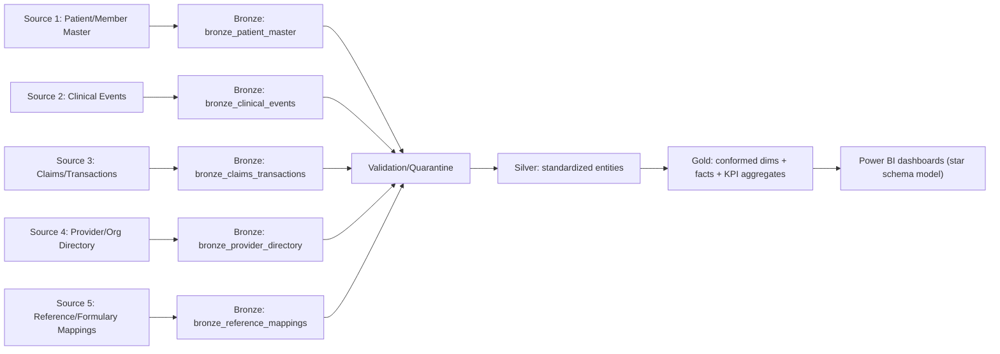
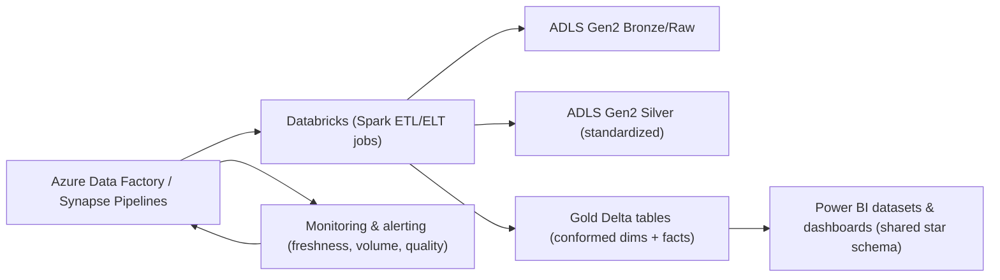

## 1) Healthcare / Zoetis — Development & Support (Azure Data Engineering)

**Project summary:** Built and supported end-to-end data pipelines and analytics-ready datasets for healthcare business reporting on Azure, using a Medallion architecture to ensure consistent data quality and reliable refreshes.

---

### End-to-end data flow (full pipeline notes)
The core goal of this pipeline is to move data from multiple operational systems into a single, reliable reporting layer that Power BI can consume without brittle custom logic. To achieve this, the workflow is structured around a Medallion pattern (Bronze/Silver/Gold), where each stage has a clear responsibility: capture raw truth, standardize and validate, then produce conformed business datasets.

In practice, orchestration (Azure Data Factory/Synapse) runs the ingestion and transformations on a schedule and enforces run-level metadata (run id, extract window, source system, and record hashes). Each transformation is designed to be idempotent, so reruns do not create duplicates, and replay/backfill operations can be done safely during incidents or after upstream corrections.

1. **Source extraction (ingest)**
   - Pull data from operational systems (tables/APIs/flat files) on a schedule or via event-based triggers.
   - Land data in a raw staging area with ingestion metadata (source system, extract timestamp, run id).
2. **Bronze (Raw/landing)**
   - Store data in ADLS Gen2 as immutable raw files (or raw Delta tables).
   - Capture schema as-is and keep history for audit/reprocessing.
   - Track ingestion status per source and partition (success/fail/retry).
3. **Validation & standardization (Bronze -> Silver readiness)**
   - Basic checks: schema presence, row counts sanity, not-null rules for critical fields, timestamp formats.
   - Deduplicate records using deterministic keys (source id + business keys + event timestamp).
   - Quarantine invalid records to an exception location for review.
4. **Silver (Clean/standardized)**
   - Apply data standardization: conform column names/types, normalize codes (status/product/provider codes).
   - Apply CDC/incremental logic (watermarks) where applicable.
   - Resolve business rules: join reference data, map identifiers, and create consistent entity keys.
5. **Curated modeling (Silver -> Gold)**
   - Create domain marts for reporting:
     - Fact tables (events/claims/clinical measures)
     - Dimension tables (patient/member, provider, product/drug, geography, time)
   - Aggregate and derive metrics (KPIs) needed by dashboards.
6. **Publishing & consumption**
   - Publish Gold outputs to BI-friendly formats (Delta tables / SQL endpoints / semantic layer as used).
   - Ensure permissions, data contracts, and naming conventions are applied.
7. **Operational support**
   - Monitoring: freshness, volume anomalies, late-arriving data, and pipeline run health.
   - Runbooks: reprocessing steps, replay windows, and how to remediate quarantined data.

---

### 5 source systems (end-to-end notes per source)
**Note:** Replace placeholders with your actual source names/locations (DB/schema/API/file system) and extraction method.

Across all five sources, the key implementation detail is that the pipeline produces consistent, conformed entity keys in Silver and Gold. This ensures that Power BI relationships are stable even when source schemas evolve or new data arrives late. When a source does not have a matching key, the pipeline resolves it via reference data and records traceability from the curated record back to the original raw records.

For supportability, each source is also instrumented with dedicated validation checks and quarantine logic. This makes it possible to isolate failures to a single source or rule (for example, a unit conversion mismatch in Clinical Events) without blocking the entire dataset refresh unnecessarily.

#### Source 1: Patient/Member Master
Patient identity and member attributes are treated as a conformed “hub” dataset because most clinical and claims metrics depend on stable identity. In this pipeline, Patient/Member Master records are extracted either as daily snapshots or incremental updates and are loaded to Bronze with ingestion metadata and an immutable record hash. Keeping historical versions at Bronze allows reprocessing when downstream mapping rules change.

In Silver, the transformation standardizes key fields (patient/member identifiers, eligibility fields, and date attributes) and builds a stable internal entity key used by facts in Gold. Data quality checks focus on duplicates, invalid identifiers, and missing essential dates, since these issues typically cause join amplification or orphan records in Power BI.
- **Data purpose:** Patient identity, member demographics, eligibility attributes.
- **Extraction approach:** Scheduled JDBC export or file drop (e.g., daily snapshot).
- **Bronze landing:** Store as raw snapshot with extract timestamp and record hash.
- **Key transforms to Silver:**
  - Standardize identifiers (patient_id/member_id) and normalize demographics.
  - Build a stable internal entity key to join with downstream facts.
- **Data quality checks:**
  - Duplicate key checks
  - Valid ranges for dates/ages
  - Not-null for stable identifiers

This source is also the foundation for SCD-style handling (where applicable). If member attributes change over time and business reporting requires historical accuracy, the Gold layer retains effective dating and ensures that “as-of” reporting aligns with the timeline used by dashboards.

#### Source 2: Clinical Events (Visits/Labs/Measures)
Clinical events drive the narrative of outcomes and trends, but they tend to be the most variable in terms of schema drift, unit conventions, and late-arrival behavior. The pipeline therefore isolates schema validation per event type and preserves raw history in Bronze so that late events can still be integrated using replay logic.

In Silver, the pipeline canonicalizes event timestamps and normalizes units and event codes using reference mappings. Deduplication is performed using a deterministic strategy (source_event_id + event_time or a stable hash) to avoid duplicate measures and to protect KPI accuracy in Gold and Power BI.
- **Data purpose:** Clinical event history used for analytics and outcomes reporting.
- **Extraction approach:** Incremental extract (watermark on event_time) via CDC or event feed.
- **Bronze landing:** Partition by event_date, keep raw history for late events.
- **Key transforms to Silver:**
  - Normalize event types and lab measure units.
  - Convert timestamps to canonical timezone and format.
  - Deduplicate by (source_event_id, event_time) or business keys.
- **Data quality checks:**
  - Schema validation per event type
  - Unit mapping completeness
  - Row count sanity per partition/run

During support, quarantined records are reviewed with their validation failure reasons attached. This allows analysts to correct mapping rules (for example, an unrecognized unit string) and rerun only the impacted partitions instead of rebuilding everything.

#### Source 3: Claims / Transactions
Claims and transactions are usually high-volume and finance-critical, so the pipeline treats them with strict reconciliation and monetary validations. Extraction is typically batch (daily or intraday) from transactional sources, and Bronze stores the raw payload unchanged to support auditing and reprocessing.

In Silver, the transformation standardizes claim/product/status codes and normalizes monetary fields (precision, currency, sign rules). It also derives metrics that will later be aggregated in Gold facts, while ensuring joins to reference/product/provider keys remain consistent and deterministic.
- **Data purpose:** Billing/claims records powering financial and operational KPIs.
- **Extraction approach:** Batch extract (daily or intraday) from transactional DB/export files.
- **Bronze landing:** Store raw claims payload; partition by claim_date and ingest_run.
- **Key transforms to Silver:**
  - Standardize claim status/product codes.
  - Normalize monetary fields (currency/precision) and derive claim metrics.
  - Join with reference mappings (provider/product) to align keys.
- **Data quality checks:**
  - Money field validation (non-negative, precision)
  - Referential checks to required dimensions
  - Duplicate claim id checks

To prevent subtle KPI deviations, Silver outputs include traceable lineage (how a curated record was derived from raw records). This is especially important when rerunning data windows, because it enables fast reconciliation between legacy and new logic during releases.

#### Source 4: Provider & Organization Directory
Provider and organization data enables slicing, filtering, and hierarchy-based reporting (for example, by facility, region, or parent organization). Because provider attributes can change over time, the pipeline supports snapshot extracts or SCD-driven extracts with effective dates.

In Silver and Gold, the transformation produces conformed provider identifiers and, when required, SCD2 logic to keep history accurate. Data quality checks are designed to catch orphan providers and effective date overlap issues early, since these problems can lead to incorrect hierarchy rollups in Power BI.
- **Data purpose:** Provider identities and organization hierarchies for reporting.
- **Extraction approach:** Snapshot or SCD-driven extract (weekly/daily).
- **Bronze landing:** Raw tables with effective_start/effective_end (if SCD).
- **Key transforms to Silver:**
  - Build slowly changing dimension logic (SCD2) where required.
  - Normalize provider identifiers and address fields.
- **Data quality checks:**
  - Detect orphan providers (providers referenced but not present)
  - Check for overlapping effective date ranges

Operationally, this source is also monitored for “coverage gaps” (for example, when a hierarchy update fails). By alerting on missing effective periods, the pipeline avoids pushing incomplete hierarchies into Gold dashboards.

#### Source 5: Reference / Formulary / Code Mappings
Reference and formulary mappings ensure that external codes (drug/product/clinical system codes) are interpreted consistently across all source datasets. Because reference data can change (and because reporting must remain reproducible), the pipeline versions mappings and stores them immutably in Bronze with an as-of date.

In Silver, the transformation maps external codes to canonical internal codes and validates mapping cardinality (one-to-one vs one-to-many). Conflicts are flagged so that ambiguous mappings do not silently corrupt Gold facts and Power BI metrics.
- **Data purpose:** Controlled vocabularies (drug/product codes, clinical code systems, geography mappings).
- **Extraction approach:** Batch pull from master/reference systems.
- **Bronze landing:** Immutable raw mapping sets with versioning.
- **Key transforms to Silver:**
  - Map external codes to canonical internal codes.
  - Validate one-to-one vs one-to-many mappings and flag conflicts.
- **Data quality checks:**
  - Missing mapping coverage alerts
  - Duplicate canonical mappings

During releases, reference mapping changes are treated like “contract updates.” Gold refresh logic can detect schema/logic differences and force safe reprocessing windows so that Power BI sees consistent interpretations across refreshes.

---

### Medallion architecture (Bronze / Silver / Gold)
The Medallion layers exist to keep responsibilities separated and to support both auditability and fast operational recovery. Bronze preserves raw truth and lineage, Silver enforces conformed schemas and business rules, and Gold produces curated datasets optimized for analytics consumption.

This structure also enables safe schema evolution: if an upstream system introduces a new column or changes a datatype, it can be captured at Bronze without immediately breaking Silver/Gold contracts. Then, validation and mapping rules can be updated with controlled replay windows.

#### Bronze (Raw / landing)
- **Goal:** Preserve source truth for audit and reprocessing.
- **Storage:** ADLS Gen2 raw Delta tables or partitioned raw files.
- **Partitioning suggestion:** `source_system`, `event_date` (where possible), `ingest_date`.
- **Operational metadata:** `run_id`, `ingestion_timestamp`, `source_record_hash`, `status`.

Bronze is designed to be immutable for a given ingest run. Any correction to upstream data is represented by a new run (or a re-extract), which prevents silent overwrites and makes it easier to compare “what changed” between refreshes.

Bronze also acts as the “schema memory” of the pipeline. If upstream schema changes (new columns, type widening, or formatting changes) occur, Bronze captures them and keeps the raw shape available for validation. This makes it possible to implement forward-compatible transformations in Silver without guessing how the data looked in earlier refreshes.

#### Silver (Clean / standardized)
- **Goal:** Standardize schema and entity keys for consistent downstream joins.
- **Transformation scope:** data type casting, normalization, dedup, CDC/watermarks, reference mapping joins.
- **Quality gates:** quarantines for invalid records; rejection thresholds with alerts.

Silver is where most of the deterministic logic lives: key normalization, dedup rules, and reference lookups. It is also where data quality gates ensure that only records that pass defined standards proceed to Gold.

To keep support efficient, Silver should write exception details to a dedicated quarantine table (including rule name, failing field, and source_record_hash). This lets engineers and analysts quickly assess whether failures are systematic (e.g., a missing mapping) or localized (e.g., a single malformed file) and then reprocess with confidence.

#### Gold (Curated / analytics marts)
- **Goal:** Serve business-ready datasets (dimensions + facts + metrics).
- **Modeling:** star schema patterns (facts + shared dimensions) for performance and usability.
- **Refresh strategy:** full vs incremental per table; late-arriving data handling with reprocessing windows.

Gold is optimized for query and BI consumption. That includes partitioning choices, file sizing, and conformed dimension keys so that Power BI can model facts and dimensions with predictable performance and stable relationships.

Gold also provides the BI contract: stable table schemas, consistent surrogate/conformed keys, and documented refresh behavior. When a breaking change is unavoidable (for example, a new dimension attribute required for a major dashboard update), the pipeline versions the dataset outputs and coordinates refresh so that Power BI doesn’t fail mid-cycle.

---

### Support & reliability notes
- Reliability is implemented as part of the pipeline design, not as an afterthought. Runs are made idempotent (so retries won’t duplicate data), and changes are deployed behind validation gates to reduce the chance of breaking downstream BI datasets.

When issues occur, the support process is guided by monitoring signals: pipeline run status, freshness, volume anomalies, and data quality exception counts. The runbooks then provide a clear remediation path (reprocess a window, replay a partition, or update reference mapping rules) with minimal disruption.
- Implemented run-level retries and idempotent writes to avoid duplicate records on re-run.
- Established data freshness monitoring and late-partition alerts.
- Added reconciliation checks (source vs silver/gold row counts and key aggregates).
- Maintained runbooks for common incidents (schema drift, missing partitions, watermark resets).

---

### Tech stack (edit to match your project)
The typical stack combines orchestration, distributed transformation, and storage/transactional layers. Orchestration is handled by Azure Data Factory or Synapse Pipelines, while transformations are executed using Databricks (Spark SQL/DataFrames) to handle large volumes and complex joins.

For storage and analytics reliability, ADLS Gen2 is used with Delta Lake tables to provide ACID behavior, schema enforcement, and reliable incremental processing patterns. SQL/Python/Spark are used for transformation logic, and CI/CD (if applicable) helps keep deployment consistent across environments.
- Azure Data Factory / Synapse Pipelines
- Databricks (Spark), SQL, Python/Spark
- ADLS Gen2, Delta Lake, CI/CD (if applicable)

### Deliverables / outcomes (add metrics)
This project delivers not only datasets but also a repeatable operating model: data contracts, quality gates, and monitoring so the platform can run reliably day-to-day. The outputs are “BI-ready by design,” meaning Power BI refreshes and user reporting depend on stable schemas and conformed keys.

By implementing validation/quarantine and reconciliation checks at each Medallion boundary, the platform reduces the risk of silent data errors and minimizes the time to diagnose and resolve incidents during support.
- Reduced pipeline failures by **[X%]** through monitoring and validation rules.
- Improved data freshness to **[X time]** and enabled **[X dashboards/reports/use cases]**.
- Deployed **[#]** production pipelines and supported **[#]** releases.

---

### Power BI end goal (multiple sources -> dashboards)

In this setup, multiple operational sources are ingested into the Medallion layers to produce conformed Gold datasets (dimensions + facts). Power BI then consumes these Gold tables to build dashboards with consistent keys and standardized measures.

The key end-to-end requirement is that Power BI does not need to “understand” source-specific quirks. Instead, it receives a curated star schema model from Gold, where entities like member/patient, provider, product/drug, geography, and time are conformed and reusable across multiple reports.

This also improves governance: when a mapping rule changes (for example, a code translation in reference data), Silver/Gold ensures that the updated interpretation is reflected consistently across all downstream dashboards on the next refresh cycle.

#### Flow diagram (end-to-end)
The diagram below represents the main contract boundaries: ingestion lands raw data into Bronze, validations/quarantine gate invalid rows before standardized transformations produce Silver, and only conformed Gold tables reach Power BI datasets.

#### Summary table: sources -> Gold datasets -> Power BI

| Source system | Bronze (raw landing) | Silver (clean/standardized) | Gold (curated for reporting) | Power BI usage |
|---|---|---|---|---|
| Patient/Member Master | `bronze_patient_master` | `silver_member` | `dim_member` | Member demographics, eligibility slicing |
| Clinical Events | `bronze_clinical_events` | `silver_clinical_events` | `fact_clinical_events` | Clinical trends, outcomes/KPIs |
| Claims/Transactions | `bronze_claims_transactions` | `silver_claims` | `fact_claims` | Financial and operational claim reporting |
| Provider & Org Directory | `bronze_provider_directory` | `silver_provider` | `dim_provider` (+ org hierarchy) | Provider performance, facility/location filtering |
| Reference/Formulary mappings | `bronze_reference_mappings` | `silver_code_mappings` | `dim_drug_product`, `dim_code_systems` | Consistent code interpretation across KPIs |

In Power BI, these Gold outputs typically map into a single shared semantic model (or multiple datasets built from the same Gold tables). Facts use stable foreign keys into dimensions so that filters (date, geography, provider, product) work consistently across pages without complex DAX workarounds.

Because all five sources feed into conformed Gold, dashboards can safely combine information (for example, claims KPIs by provider and geography, or clinical trends by product/drug and time) without duplicating transformation logic in the report layer.

#### Architecture components (typical orchestration)

#### Power BI refresh & delivery strategy (typical)
- Run Gold refresh first, then trigger Power BI dataset refresh (or align schedules with SLAs).
- Enforce schema/data contracts so that Power BI refresh failures are minimized (quarantine + versioned schema changes).
- Use conformed keys from Silver/Gold (stable surrogate keys or hashed keys) to keep relationships stable in the Power BI model.
- Support incremental refresh patterns in Power BI where applicable (aligned with partition keys in Gold).

Operationally, when a dataset is quarantined or fails validation, Gold refresh can either pause dependent tables or continue with safe partial refresh strategies (depending on business SLAs). This prevents Power BI from loading incomplete aggregates while still keeping the platform available for other dashboards and datasets.

