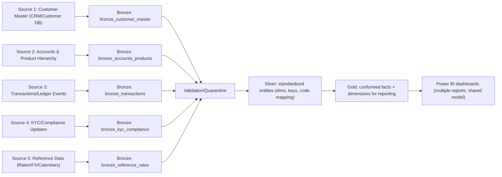
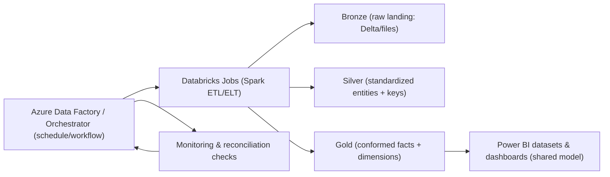

## 2) Banking — Informatica to Databricks Migration

**Project summary:** Migrated legacy Informatica data integration workflows to Databricks (Spark + Delta Lake) for a more scalable, maintainable, and testable banking data platform, while ensuring reconciliation and correctness through parallel run validation.

---

### End-to-end migration flow (full pipeline notes)
This migration converts Informatica-based integration logic into Databricks (Spark + Delta Lake) while preserving business semantics and ensuring measurable correctness. The end-to-end flow is structured to support parallel execution (legacy vs new) during selected windows, so that discrepancies are detected early and resolved before production cutover.

A key principle is that the Databricks implementation must be both deterministic and replay-friendly. For that reason, the pipeline uses canonical keys, idempotent writes (Delta `merge` patterns where appropriate), and explicit watermarking/incremental boundaries. This prevents duplication and ensures that re-running a failed batch only updates the intended time range or partitions.

1. **Discovery and mapping**
   - Inventory Informatica workflows/mappings and dependencies.
   - Identify sources/targets, join logic, filter conditions, and lookup tables.
   - Capture transformation semantics (especially incremental vs full, CDC rules, and late-arrival handling).
2. **Design in Databricks**
   - Translate mappings into Spark jobs (DataFrame/SQL) with equivalent logic.
   - Define Delta table strategy (schema, partitioning, merge keys, and history).
   - Decide orchestration approach (jobs triggered per schedule/workflow dependencies).
3. **Implementation (Bronze/Silver/Gold)**
   - Land raw inputs to Bronze (immutable raw Delta/files).
   - Transform to Silver for standardized schemas, clean entities, and deduplication.
   - Produce Gold marts for downstream analytics and reporting.
4. **Incremental loading & watermarks**
   - Implement watermarking using a canonical “last processed” column.
   - Support reprocessing windows for missed/late data.
   - Keep loads idempotent to allow safe retries and re-runs.
5. **Validation and reconciliation (parallel run)**
   - Run legacy and new pipelines side-by-side for selected time windows.
   - Reconcile record counts, key-level hashes, and aggregated metrics.
   - Resolve logic discrepancies and tune performance.
6. **Operationalization**
   - Implement standardized logging, exception handling, and alerting.
   - Add operational checks (freshness, row-count anomalies, schema drift alarms).
7. **Go-live and stabilization**
   - Execute cutover plan with business verification.
   - Perform hypercare: fix defects, tune join/partition strategy, and improve runbooks.

---

### 5 source systems (end-to-end notes per source)
**Note:** Replace placeholders with your actual source names/DB schemas/file feeds and extraction methods.

The five sources represent both transactional and reference domains that must reconcile cleanly for finance reporting. During migration, the pipeline emphasizes equivalence checks: the same “business meaning” produced by Informatica must be reproduced in Databricks, including incremental cut logic, dedup rules, and lookup behavior.

To keep operational risk low, each source is supported by validations and reconciliation steps. If a particular dataset deviates from the legacy output (for example, transaction amounts or risk statuses), the pipeline quarantines the problematic records and flags the mismatch rather than letting it silently affect Gold aggregates and Power BI.

#### Source 1: Customer Master (CRM / Customer DB)
Customer data is treated as a conformed hub because downstream transaction, risk, and segmentation reporting depend on stable customer identifiers. During discovery, the migration maps Informatica customer logic (including any survivorship rules) to Databricks transformations that preserve history and key consistency.

In Silver, the transformation standardizes customer attributes and builds a canonical customer key used in Gold facts. Quality gates focus on null/invalid identifiers, duplicate records, and effective-date correctness so the semantic model in Power BI can rely on consistent relationships.
- **Data purpose:** Customer identity and demographic attributes.
- **Extraction approach:** Snapshot or incremental changes (created/updated timestamps).
- **Bronze landing:** Raw table per extract run; keep history and record hash.
- **Key transforms to Silver:**
  - Normalize attributes (names, segments, status codes).
  - Create canonical customer key used across facts.
- **Quality checks:**
  - Null/invalid id detection
  - Duplicate prevention and referential integrity checks

Operationally, this source is often the first to break when upstream schema drifts. Because Bronze preserves raw snapshots, the pipeline can detect drift via validation and apply controlled remapping without disrupting the entire reporting chain.

#### Source 2: Accounts & Product Hierarchy
Accounts and products provide the structure needed for finance and portfolio reporting. The migration ensures that effective-dating logic from Informatica is preserved by implementing SCD-style handling in Databricks (where required) and using canonical product/account identifiers for joining to facts.

In Silver, the pipeline translates external product codes into internal canonical product ids and validates effective ranges. This is crucial because inconsistent hierarchy mapping causes incorrect rollups and inconsistent results across Power BI dashboards.
- **Data purpose:** Account-level and product-level attributes used in reporting.
- **Extraction approach:** Incremental based on `effective_from/effective_to` or updated_at.
- **Bronze landing:** Partition by effective_date and ingest_date.
- **Key transforms to Silver:**
  - Build SCD-style logic where needed.
  - Map external product codes to canonical product ids.
- **Quality checks:**
  - Overlapping effective ranges detection
  - Missing product mapping alerts

For reconciliation during migration, the pipeline typically compares key-level counts by effective date and verifies join cardinality (for example, ensuring each transaction maps to exactly one product key, when business rules expect that behavior).

#### Source 3: Transactions / Ledger Events
Transaction data is the primary driver for KPI calculations (balances, transaction counts, posted/unposted amounts). Migration therefore places special emphasis on incremental boundaries: extracting exactly the correct time window, deduplicating reliably, and ensuring currency/amount normalization matches the legacy behavior.

In Silver, the transformation deduplicates using deterministic keys (txn_id + timestamp + source) and applies amount normalization and business flags. It then joins to canonical account/product dimensions so that facts roll up correctly into Gold aggregates and Power BI reports.
- **Data purpose:** Core transactional dataset used for financial KPIs.
- **Extraction approach:** CDC/incremental extraction using sequence ids or timestamps.
- **Bronze landing:** Partition by transaction_date; keep raw event payload.
- **Key transforms to Silver:**
  - Deduplicate using (txn_id, txn_ts) + source.
  - Normalize amounts/currency and derive posted/unposted flags.
  - Join to account/product dimensions via canonical keys.
- **Quality checks:**
  - Amount validation (precision, sign rules)
  - Key-level reconciliation (hash compare)

Because this data is high volume, performance tuning is also a requirement. Partitioning choices, join order, and file sizing directly impact both pipeline SLA adherence and the speed at which Power BI can query refreshed Gold tables.

#### Source 4: KYC / Compliance Updates
KYC and compliance updates affect risk classifications and compliance reporting dashboards. The migration preserves effective dating and standardizes compliance status transitions so that derived risk categories in Gold remain consistent.

In Silver, the pipeline standardizes compliance codes and builds the latest effective record view (and history where needed). Validation checks are designed to catch inconsistent back-dates or impossible status transitions early so that Power BI risk trends remain trustworthy.
- **Data purpose:** Compliance statuses, screening updates, and risk classifications.
- **Extraction approach:** Incremental feed or periodic updates.
- **Bronze landing:** Versioned snapshots with effective timestamps.
- **Key transforms to Silver:**
  - Standardize compliance status codes and risk categories.
  - Create the latest effective record view and history as needed.
- **Quality checks:**
  - Ensure status transitions are consistent (e.g., no impossible back-dates)

During stabilization, the most common issues are lookup mismatches or effective-dating errors. Quarantine and clear exception reasons enable faster remediation than manual investigation across raw payloads.

#### Source 5: Reference Data (Rates, FX, Calendars, Lookups)
Reference data is used for enrichment and for derived metrics such as currency normalization and calendar alignment. The migration treats reference inputs as versioned datasets with as-of timestamps to ensure that computed metrics in Gold match the business’s “as-of” rules.

In Silver, reference data is mapped to canonical ids and validated for coverage across the date ranges required by marts. This prevents missing FX/rate periods from causing nulls or incorrect values in Power BI.
- **Data purpose:** Enrichment data for transformations and derived metrics.
- **Extraction approach:** Batch reference load with versioning.
- **Bronze landing:** Immutable versions; record as-of timestamp.
- **Key transforms to Silver:**
  - Map reference data to canonical ids.
  - Validate coverage for the date ranges used in marts.
- **Quality checks:**
  - Missing FX/rate coverage for required periods

Reprocessing behavior is critical here: if reference updates arrive late, the pipeline can replay impacted partitions in Gold so Power BI reflects updated conversions consistently.

---

### Medallion architecture (Bronze / Silver / Gold)
The Medallion architecture in this migration is used not only for data quality and modularity, but also as a migration control surface. It provides clear checkpoints for validation: Bronze confirms what was extracted, Silver confirms transformation correctness and dedup rules, and Gold confirms that aggregated facts match legacy outputs.

This separation enables incremental adoption: you can migrate one domain (or one target mart) at a time, validate it with parallel runs, and then extend to additional workflow coverage without having to rewrite the whole platform.

#### Bronze (Raw / landing)
- Store raw extracts from Informatica sources into Delta/files.
- Maintain ingest metadata: `run_id`, `ingestion_ts`, `source_system`, `record_hash`.
- Keep raw history for reprocessing and auditing.

Bronze is intentionally kept close to source. That helps isolate where differences originate during reconciliation: extraction mismatch vs transformation mismatch. It also enables auditability and controlled rollback when fixes are required after go-live.

Bronze is also where extraction metadata is recorded and used to drive incremental boundaries. By persisting `run_id`, `ingestion_ts`, and `record_hash`, the pipeline can determine exactly which data arrived in which window and can replay precisely that subset during backfill operations.

#### Silver (Clean / standardized)
- Convert raw fields into canonical schema.
- Implement deduplication, CDC logic, watermarking, and lookups.
- Quarantine bad records and track exceptions per rule.

Silver enforces deterministic mapping logic. When Informatica logic differs subtly (for example, null handling or lookup precedence), the Silver layer is the place where those semantics are encoded and verified.

Silver also standardizes failure behavior. Records that fail business rules are quarantined with clear exception reasons, and rejection thresholds determine when a refresh should pause versus continue with a safe partial refresh strategy aligned to finance SLAs.

#### Gold (Curated / analytics marts)
- Build business-facing marts:
  - Facts: transactions, balances, events
  - Dimensions: customer, account, product, time, risk categories
- Optimize for query performance (partitioning + file sizing + clustering patterns as used).
- Ensure consistent refresh and late-arrival handling.

Gold is designed to be stable for BI consumption. That means consistent table schemas, conformed keys, and partitioning that matches Power BI access patterns and refresh cadence.

Gold finalizes the BI contract by providing stable mart tables and clear refresh behavior (incremental/full rules). This ensures that Power BI refresh and downstream reporting can depend on consistent measures and dimension joins, reducing “metric drift” during post-cutover support.

---

### Migration-specific reliability notes
Migration reliability focuses on correctness, reconciliation, and safe operational behavior under reruns. Because Informatica and Databricks may have different execution characteristics, the implementation includes both record-level and aggregate-level checks.

In addition, the pipeline design accounts for failure modes that are common during cutover: watermark drift, late-arriving changes, schema drift, and reference data updates arriving out-of-order. Runbooks and automated alerts reduce time-to-diagnose and help keep BI refresh windows under control.
- Replaced Informatica “session” error patterns with explicit Spark error handling and retries.
- Ensured idempotent writes using `merge` patterns (when appropriate) and deterministic keys.
- Added reconciliation checks to automatically detect mismatched aggregates early.
- Built a runbook covering: watermark resets, re-run strategies, and rollback/replay procedures.

---

### Tech stack (edit to match your project)
The migration uses Databricks for scalable Spark transformations and Delta Lake for transactional storage. This combination supports both batch and incremental ETL/ELT patterns and allows the pipeline to safely replay partitions when late data or mapping changes occur.

Legacy mapping logic from Informatica is referenced during validation to ensure semantic equivalence. SQL/Python/Scala are used for transformations and data quality checks, and CI/CD (if used) ensures that pipeline code and configuration deploy consistently across environments.
- Databricks (Spark), Delta Lake, SQL, Python/Scala
- Informatica (legacy reference), CI/CD and testing tools (if applicable)

### Deliverables / outcomes (add metrics)
The deliverable outcome of the project is a working data integration platform in Databricks that can replace Informatica for the migrated domains. This includes not just ETL jobs, but also the operational layer: testing, reconciliation, and monitoring that ensures stability after go-live.

By reducing manual checks and improving automated validation, support effort decreases while reliability increases. This supports a smoother BI refresh cycle and more consistent reporting for finance and compliance teams.
- Migrated **[X]** Informatica workflows/mappings into **[Y]** Databricks jobs.
- Improved performance by **[X%]** (or reduced runtime from **[A]** to **[B]**).
- Reduced manual support effort by **[X%]** via standardized monitoring and alerting.

---

### Power BI end goal (multiple sources -> dashboards)

This migration is designed to deliver consistent, reconciled Gold datasets that multiple Power BI reports can reliably consume. The key outcome is that Power BI dashboards use standardized dimensions and facts derived from multiple source systems.

In Power BI, the goal is to create a shared semantic model (or a small set of consistent datasets) where dimensions like `dim_customer`, `dim_account`, `dim_product`, and time are conformed. Facts from transactions and compliance feeds then aggregate correctly without custom report-layer data shaping.

Because Gold is produced from multiple sources and validated through reconciliation, dashboard results remain stable across refresh cycles. This reduces discrepancies during end-of-day reporting and speeds up incident resolution when a refresh fails.

#### Flow diagram (end-to-end)
The diagram below captures the migration end-state: data is extracted/landed into Bronze, standardized in Silver, then modeled into Gold marts. Power BI consumes Gold through stable table schemas and conformed keys, enabling multiple dashboards to share consistent measures.

#### Summary table: sources -> Gold datasets -> Power BI

| Source system | Bronze (raw landing) | Silver (clean/standardized) | Gold (curated for reporting) | Power BI usage |
|---|---|---|---|---|
| Customer Master | `bronze_customer_master` | `silver_customer` | `dim_customer` | Customer segmentation, portfolio slicing |
| Accounts & Product Hierarchy | `bronze_accounts_products` | `silver_accounts_products` | `dim_account`, `dim_product` (+ hierarchy) | Account/product KPIs |
| Transactions/Ledger Events | `bronze_transactions` | `silver_transactions` | `fact_transactions` | Volumes, balances, transaction trends |
| KYC/Compliance Updates | `bronze_kyc_compliance` | `silver_kyc` | `dim_risk_customer` / `dim_compliance` | Risk and compliance dashboards |
| Reference Data | `bronze_reference_rates` | `silver_reference_rates` | `fact_fx_rates` / `dim_calendar` | Derived metrics, currency normalization |

Power BI then uses these Gold outputs to build dashboards with shared filtering behavior. By keeping surrogate/conformed keys consistent, relationships between customer, accounts, products, and transactional facts remain stable, which reduces report fragility and improves refresh reliability.

From a governance perspective, this approach also limits where logic lives: ETL logic belongs in Silver/Gold, while the report layer focuses on visualization and DAX measures that consume stable datasets.

#### Architecture components (typical orchestration)

#### Power BI delivery strategy (typical)
- Gold tables provide the shared dataset foundation for multiple Power BI dashboards.
- Power BI should connect to Gold through a consistent access layer (e.g., Databricks SQL/SQL endpoints) using stable table schemas.
- Use conformed keys (customer_id/account_id/product_id) produced in Silver/Gold to keep relationships stable across the Power BI semantic model.
- Align refresh timing: run pipeline Gold refresh first, then refresh Power BI datasets to match SLAs.
- Apply schema drift handling: quarantine + versioned schema changes so Power BI refresh doesn’t break unexpectedly.

During migration cutover, it’s common to run a controlled comparison window and validate that the Gold outputs match the legacy pipeline’s KPIs. Once that equivalence is confirmed, Power BI can be switched to the new dataset source with minimal disruption and continued reconciliation monitoring in hypercare.

