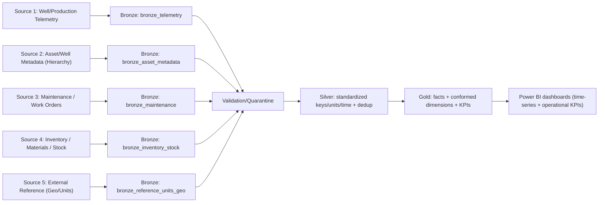
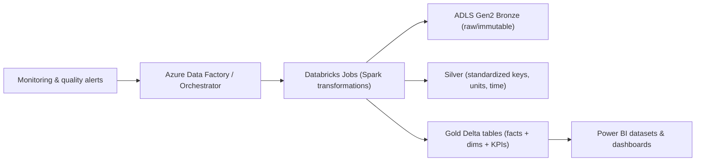
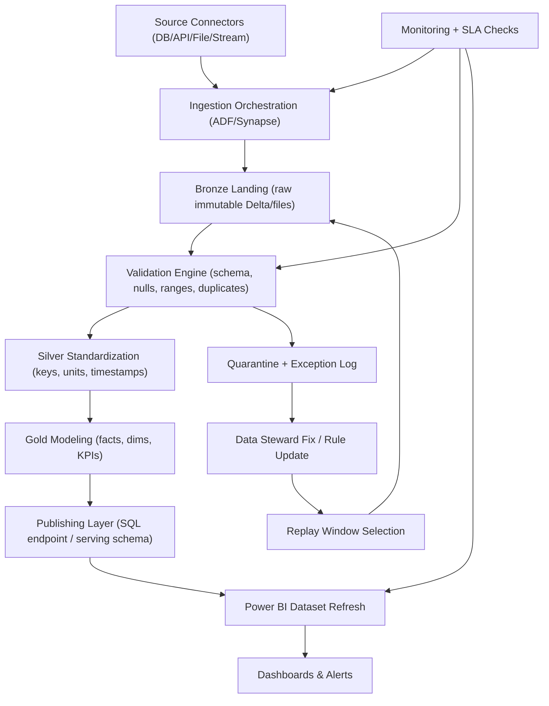
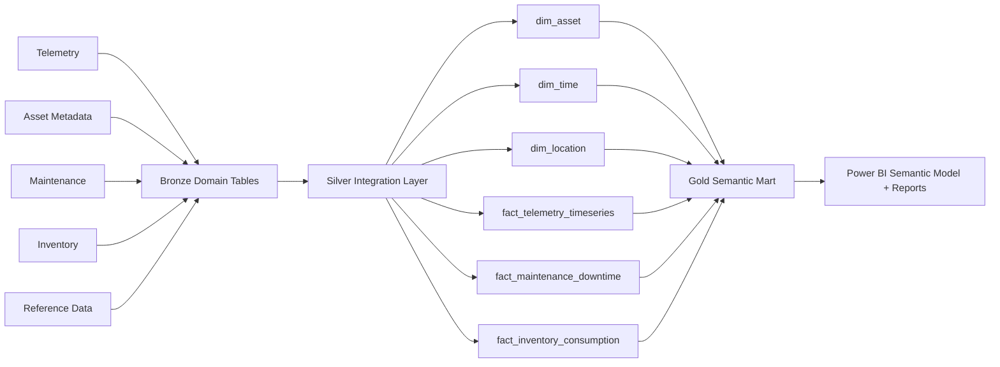
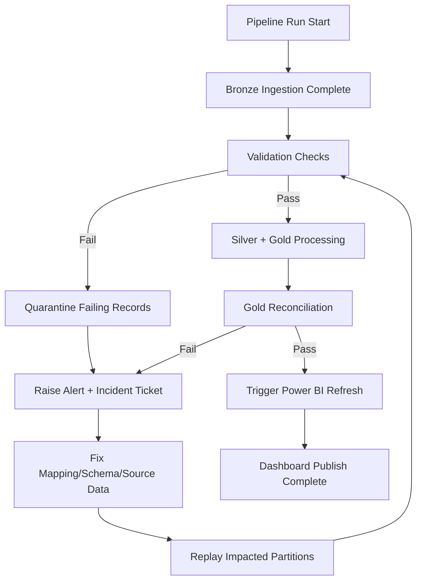
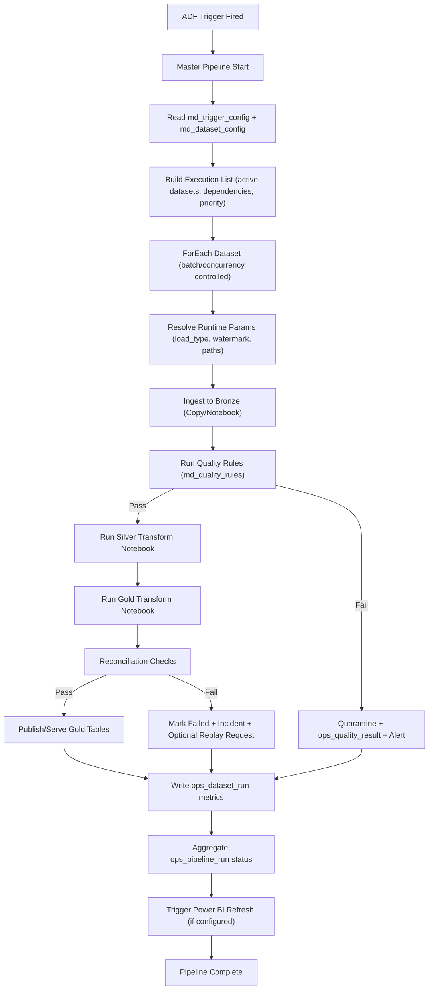
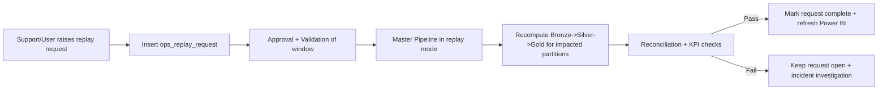

## 3) Oil & Gas — Development Projects (Azure Data Engineering)

**Project summary:** Delivered Azure data engineering development for oil and gas use cases (production/operations analytics), using a Medallion architecture to provide consistent, high-quality data for reporting and downstream models.

---

### End-to-end development flow (full pipeline notes)
The oil & gas development pipelines focus on converting operational/telemetry feeds into reliable, analytics-ready datasets. The end goal is to enable consistent time-series and operational KPIs by combining multiple source systems (telemetry, asset hierarchy, maintenance, inventory, and references) into a conformed Medallion layer.

The pipeline is built for repeatable development and production support. That means every stage includes data contracts (expected schema and key fields), validation checks, quarantine for exceptions, and deterministic transformation logic so that backfills and replay operations do not distort results.

1. **Ingestion planning**
   - Identify telemetry and operational feeds, their frequency, and expected volume.
   - Define partition strategy (by day/hour, asset, and geography where applicable).
   - Establish extraction contracts (schemas, required fields, update cadence).
2. **Bronze landing (raw/immutable)**
   - Ingest data from source systems into ADLS Gen2 Bronze.
   - Store raw payloads as-is (or raw Delta) with ingestion metadata:
     `run_id`, `ingestion_ts`, `source_event_ts`, `asset_id`.
3. **Data quality and normalization (Bronze -> Silver)**
   - Validate schema and required fields per dataset.
   - Normalize timestamps to a canonical timezone and format.
   - Apply deduplication rules (event_id + timestamp, or deterministic hashes).
   - Quarantine invalid records to an exceptions area.
4. **Silver transformations (clean/standardized)**
   - Standardize units (pressure/temperature/volume conversions as required).
   - Conform keys and entity identifiers (asset hierarchy mapping).
   - Join to reference data for enrichment (well/rig/equipment attributes).
   - Handle late-arriving or out-of-order events with replay logic.
5. **Gold modeling (curated/analytics)**
   - Build curated datasets for analytics:
     - time-series facts (measurements, readings)
     - operational facts (maintenance, downtime, events)
     - derived metrics (rates, aggregates, KPIs)
   - Optimize layout for dashboard/query performance.
6. **Publishing & consumption**
   - Publish Gold datasets as Delta tables for BI and data products.
   - Apply access controls and document data contracts.
7. **Operational support & reliability**
   - Monitor pipeline health, freshness, and data quality thresholds.
   - Provide runbooks for incident response, replay, and backfill.

---

### 5 source systems (end-to-end notes per source)
**Note:** Replace placeholders with your actual feed/system names and extraction methods.

Each of the five sources serves a different purpose in the analytics model, so the pipeline maintains clear separation of concerns: telemetry provides measurements, asset metadata provides stable entity keys and hierarchies, maintenance explains downtime/events, inventory provides supply/usage measures, and references provide enrichment and unit/location definitions.

From a Power BI perspective, the common requirement is conformed dimensions and keys. The pipeline standardizes identifiers and time representations in Silver and produces Gold facts/dimensions so that dashboards can filter by asset/location/time consistently and combine metrics across different domains without duplicating transformation logic in the report layer.

#### Source 1: Well / Production Telemetry
Telemetry is typically the highest-volume source and drives most time-series charts and operational KPIs. Because telemetry can arrive late or out of order, Bronze preserves raw history and includes ingestion metadata so that Silver can replay impacted windows and maintain correctness in Gold.

In Silver, the pipeline canonicalizes timestamps, normalizes measurement names, and applies unit conversions based on reference definitions. Deduplication and range validation protect KPI accuracy by removing duplicates and flagging anomalous values before they reach Gold facts used by Power BI.
- **Data purpose:** Continuous or periodic measurements for production analytics.
- **Extraction approach:** Batch/incremental pulls by time window; optionally event-based.
- **Bronze landing:** Partition by `event_date` (and `asset_id` if needed) with raw payload.
- **Key transforms to Silver:**
  - Canonicalize timestamps and measurement names.
  - Normalize units (apply conversion factors).
  - Deduplicate readings and validate value ranges.
- **Data quality checks:**
  - Range checks (min/max per measurement type)
  - Missing timestamp detection
  - Duplicate event detection

During support, validation failures are reviewed with explicit failure reasons. This enables quick remediation (for example, correcting a unit mapping or adjusting threshold rules) followed by targeted reprocessing instead of full rebuilds.

#### Source 2: Asset / Well Metadata (Hierarchy)
Asset hierarchy data is what makes telemetry and events “joinable.” In oil & gas reporting, assets can change ownership or configuration over time, so the pipeline supports snapshot extracts and SCD-style changes with effective date ranges.

In Silver, the transformation builds a canonical `asset_key` and resolves hierarchy attributes so that Gold dimensions stay stable. Quality checks focus on orphans and overlapping effective ranges because these issues can break hierarchy rollups and produce inconsistent dashboard filtering.
- **Data purpose:** Asset hierarchy for mapping wells/rigs/equipment to reporting entities.
- **Extraction approach:** Snapshot or incremental SCD extract (daily/weekly).
- **Bronze landing:** Store effective_start/effective_end if SCD; keep history.
- **Key transforms to Silver:**
  - Build canonical `asset_key` and hierarchy attributes.
  - Resolve changes in asset ownership or topology.
- **Data quality checks:**
  - Orphan asset detection
  - Overlapping effective ranges

When hierarchy updates arrive, the pipeline uses conformed keys so that historical facts can be analyzed by the correct “as-of” entity relationships. This improves the trustworthiness of trend dashboards and reduces confusion during operational reviews.

#### Source 3: Maintenance / Work Orders
Maintenance and work order data connects operational actions to production outcomes. The pipeline models work orders and downtime intervals by extracting incremental updates and reprocessing a controlled window when changes happen.

In Silver, the transformation standardizes work order types/status codes, maps each work order to the canonical asset key, and derives durations and downtime categories based on business rules. Validation ensures start/end time consistency and checks that required asset mappings exist.
- **Data purpose:** Maintenance activity and downtime events for operational insights.
- **Extraction approach:** Incremental extract by `updated_at` plus reprocessing window.
- **Bronze landing:** Partition by `maintenance_date` and ingest date.
- **Key transforms to Silver:**
  - Standardize status codes and work-order types.
  - Map work orders to the canonical asset key.
  - Derive event durations and categorize downtime types (as per business rules).
- **Data quality checks:**
  - Validate start/end times consistency
  - Detect missing asset mappings

For Power BI, this source often supports drill-through into downtime events and correlating maintenance with production drops. Because the pipeline quarantines invalid intervals, dashboards avoid misleading duration charts.

#### Source 4: Inventory / Materials / Stock
Inventory and materials supply information can be used to estimate usage, replenishment, and operational readiness. These datasets are often batch snapshots and can include unit variety, code variants, and periodic corrections, so the pipeline stores raw snapshots with record hashes to preserve history.

In Silver, the pipeline standardizes item/material codes to canonical identifiers and normalizes quantity units. It can also derive consumption metrics when required by the Gold facts so that Power BI dashboards reflect comparable units across time and asset categories.
- **Data purpose:** Materials usage or inventory availability insights.
- **Extraction approach:** Periodic batch snapshots (daily/intraday) with record hashes.
- **Bronze landing:** Store raw snapshots with versioning and ingest metadata.
- **Key transforms to Silver:**
  - Conform item/material codes to canonical ids.
  - Standardize quantity units.
  - Derive consumption metrics (if required by downstream reporting).
- **Data quality checks:**
  - Quantity sanity checks (no negative/unexpected spikes)
  - Code mapping coverage

During support, spikes or mapping gaps are isolated through data quality checks. Then, affected partitions can be replayed after code/reference corrections without impacting unrelated assets.

#### Source 5: External Reference (Geo/Locations/Units)
Reference data is required for consistent enrichment and for making telemetry/maintenance metrics comparable. In oil & gas systems, units and location definitions can vary across sources, so reference datasets are versioned and treated as “as-of truth.”

In Silver, the pipeline enriches assets with location attributes and ensures measurement definitions are consistent. Validation checks confirm referential coverage for required as-of dates and detect conflicting records so that unit/location mismatches do not propagate into Gold facts.
- **Data purpose:** Geospatial or reference mappings and unit definitions.
- **Extraction approach:** Batch pull with versioning; rarely changes.
- **Bronze landing:** Immutable reference versions with `as_of_date`.
- **Key transforms to Silver:**
  - Enrich assets with location attributes.
  - Ensure measurement definitions are consistent across datasets.
- **Data quality checks:**
  - Ensure referential coverage for required as-of periods
  - Detect conflicting reference records

This source is monitored for coverage changes because missing reference records can create null dimensions and break dashboard filters. Versioning ensures that once a reference set is used, it can be reproduced during audits and reprocessing.

---

### Medallion architecture (Bronze / Silver / Gold)
Medallion architecture in this project provides a structured way to handle high-volume telemetry, slowly changing hierarchies, and mixed refresh cadences. Bronze preserves raw feeds and supports schema drift/auditability. Silver standardizes keys, timestamps, units, and exception handling. Gold produces curated facts/dimensions optimized for operational and time-series reporting.

This layered design also helps when requirements evolve during development. You can update Silver logic and rerun impacted windows while keeping Bronze unchanged, ensuring controlled, reproducible changes that are safe for Power BI dashboards.

#### Bronze (Raw / landing)
- **Goal:** Preserve the raw feed for audit, schema drift tracking, and reprocessing.
- **Implementation notes:**
  - Store each source in its own raw area (separate schemas/directories).
  - Partition by time (and optionally asset) for manageable file sizes.

Bronze is the system of record for replays. When an upstream correction is issued or a mapping rule needs adjustment, the pipeline can reprocess from Bronze partitions and guarantee consistency, because the raw inputs remain unchanged for a given ingest run.

Bronze also captures ingestion metadata that is used for support: which source partitions arrived, whether late data was detected, and which record hashes represent unique events/readings. This enables targeted investigation when downstream Gold reconciliation shows unexpected deltas.

#### Silver (Clean / standardized)
- **Goal:** Create consistent, joinable datasets with standardized keys and formats.
- **Implementation notes:**
  - Apply unit conversions, timestamp canonicalization, and deduplication here.
  - Quarantine invalid rows with an error reason and source record hash.

Silver enforces deterministic transformation logic and quality gates. It is the layer where most business rules become explicit (for example: unit conversions, dedup thresholds, and downtime categorization).

Silver is where exception handling becomes actionable. Quarantine rows include error reasons plus the offending source_record_hash, so engineers can quickly identify whether failures are caused by a reference data change, a unit definition update, or malformed telemetry.

#### Gold (Curated / analytics marts)
- **Goal:** Provide business-ready facts/dimensions and derived KPIs.
- **Implementation notes:**
  - Model time-series facts and operational event facts.
  - Keep dimensions (assets, time, locations) conformed across reports.
  - Optimize file sizes and partitioning for frequent dashboard queries.

Gold is optimized for BI consumption, with star schema patterns and stable keys. This allows Power BI datasets to refresh quickly and enables consistent filtering and drill-through experiences across dashboards.

Gold also provides the reporting contract that Power BI relies on: stable dimension keys (e.g., `dim_asset`) and consistent time-series grain. When a correction is required, Gold refresh is coordinated with Power BI to keep “as-of” dashboards consistent.

---

### Support & reliability notes
- Supportability is achieved by making pipeline stages observable and by defining clear remediation runbooks. The platform monitors freshness, pipeline health, and quality thresholds so issues are detected before dashboards produce misleading trends.

Operationally, reliability includes backfill and replay correctness. When late data arrives or a transformation bug is identified, runbooks guide the team to replay only affected partitions/windows and validate reconciliation results between Bronze, Silver, and Gold to ensure Power BI receives accurate outputs.
- Implemented idempotent pipeline runs to support backfills and reprocessing.
- Added data freshness monitoring and late-event detection.
- Built reconciliation checks for:
  - Bronze row counts vs Silver counts (post-validation)
  - Silver aggregates vs Gold aggregates
- Maintained runbooks: replay windows, schema drift handling, and exception triage.

---

### Tech stack (edit to match your project)
The stack uses orchestration plus distributed processing for performance and maintainability. Azure Data Factory/Synapse triggers ingestion and transformations based on schedules and dependencies, while Databricks (Spark) executes the data transformations at scale.

ADLS Gen2 paired with Delta Lake provides transactional reliability (ACID), efficient incremental processing, and consistent schema enforcement. SQL and Python are used for transformation logic and data quality checks, with monitoring/alerting enabling proactive support.
- Azure Data Factory / Synapse Pipelines
- ADLS Gen2, Databricks (Spark), Delta Lake
- SQL, Python
- Monitoring/alerting and CI/CD (if applicable)

### Deliverables / outcomes (add metrics)
The outcomes of this project are production-ready Gold datasets and stable dashboard consumption. Deliverables typically include conformed dims (assets, time, location) and curated facts (telemetry time-series, maintenance/downtime, inventory and consumption).

By implementing quarantine, replay logic, and reconciliation checks, the platform reduces the risk of silent data errors and improves the speed of incident resolution during production support.
- Implemented **[#]** production pipelines and supported **[#]** business reporting domains.
- Improved reliability and reduced data latency by **[X%]**.
- Enabled **[X]** analytics consumption by delivering **[datasets/tables]**.

---

### Power BI end goal (multiple sources -> dashboards)

For oil & gas, the end goal is to combine multiple source feeds (telemetry, asset metadata, maintenance events, inventory, and references) into conformed Gold datasets. Power BI dashboards then consume these curated tables to deliver consistent operational KPIs and time-series reporting.

The dashboard experience depends on consistent conformed dimensions. Gold must provide a stable `dim_asset` hierarchy and standardized time keys so that users can filter by asset or location and see consistent results across different dashboard pages (for example, production trends and downtime impact).

Because late-arriving events and reference updates can affect historical values, the refresh strategy needs to be aligned with replay windows. This ensures that Power BI shows correct results for “as-of” reporting periods without frequent rework by analysts.

#### Flow diagram (end-to-end)
The diagram below shows how each of the five sources lands into Bronze, how validations and standardization produce Silver, and how conformed Gold facts/dimensions become the datasets powering Power BI dashboards.

#### Summary table: sources -> Gold datasets -> Power BI

| Source system | Bronze (raw landing) | Silver (clean/standardized) | Gold (curated for reporting) | Power BI usage |
|---|---|---|---|---|
| Well/Production Telemetry | `bronze_telemetry` | `silver_telemetry` | `fact_telemetry_timeseries` (+ dims) | Production trends, KPIs per asset/time |
| Asset/Well Metadata | `bronze_asset_metadata` | `silver_asset_hierarchy` | `dim_asset` (+ hierarchy attributes) | Filters and consistent asset hierarchy |
| Maintenance / Work Orders | `bronze_maintenance` | `silver_maintenance` | `fact_maintenance_downtime` | Downtime analysis, maintenance effectiveness |
| Inventory / Stock | `bronze_inventory_stock` | `silver_inventory` | `fact_inventory` / `fact_consumption` | Inventory availability and usage metrics |
| External Reference | `bronze_reference_units_geo` | `silver_reference_units` | `dim_location` / `dim_units` | Unit normalization, location slicing |

In Power BI, these Gold datasets are typically combined into a star schema model. Facts (telemetry readings, downtime intervals, and inventory metrics) connect to conformed dimensions (asset/location/time), which enables consistent filtering and accurate drill-through.

This approach keeps report logic clean: transformations and data quality decisions occur in the data platform (Silver/Gold), while Power BI focuses on visualization and business measures. The result is faster refresh reliability and fewer “why is this number different?” support incidents.

#### Architecture components (typical orchestration)

#### Power BI delivery strategy (typical)
- Build Gold datasets first (validated and conformed), then expose them to Power BI through a stable access layer (tables/SQL endpoints).
- Ensure a consistent star schema model in Gold so Power BI relationships remain stable.
- Align refresh cadence: pipeline Gold refresh -> Power BI dataset refresh -> dashboard update.
- Handle late-arriving events using replay windows so Power BI time-series remains correct.

When a dataset fails validation (for example, telemetry unit mapping issues), Power BI can be protected by pausing dependent refreshes or by using safe partial refresh strategies aligned to business SLAs. This keeps dashboards consistent and avoids loading incomplete aggregates.

---

### Detailed flow diagram explanations (step-by-step)

This section explains the diagrams in operational detail, including what happens at each stage, which controls are applied, and how failures are handled without breaking dashboard trust. The intent is to make the architecture easy to review for engineering, operations, and reporting teams in the same document.

In this project, diagrams are not just visuals; they represent pipeline contracts. Each edge in the diagram implies a data contract (schema, keys, and timeliness), and each node implies ownership (ingestion, transformation, quality control, modeling, or consumption).

#### Diagram 1: Full lifecycle with quality gates, replay, and BI refresh

**How to read this diagram:**
- **Ingestion stage:** Source connectors load data into Bronze via orchestrated jobs, preserving raw payload and ingest metadata.
- **Quality gate stage:** Bronze data is validated. Passing records move to Silver; failing records move to Quarantine with explicit error reasons.
- **Correction loop:** Quarantined data is fixed through either source correction or rule/mapping updates, then replayed through controlled time windows.
- **Modeling and serving stage:** Silver outputs become Gold fact/dimension/KPI tables exposed through a serving layer for BI consumption.
- **BI stage:** Power BI refreshes only after Gold refresh completion and quality status checks.
- **Monitoring overlay:** Monitoring watches orchestration, quality gates, and BI refresh SLAs end-to-end.

**Why this matters in production:**
- Prevents bad records from silently reaching dashboards.
- Supports targeted replay instead of expensive full backfills.
- Makes root-cause analysis faster by separating ingestion, validation, and modeling responsibilities.

#### Diagram 2: Medallion data contract and dependency flow

**How to read this diagram:**
- **Left side (source domains):** Each source is ingested independently, preserving decoupling and domain ownership.
- **Center (Silver integration):** The integration layer standardizes keys, time grain, and units to build conformed dimensions/facts.
- **Right side (Gold semantic mart):** Gold combines reusable dimensions with domain facts for reporting.
- **Final consumer:** Power BI connects to a single governed semantic mart rather than many raw/intermediate tables.

**Design principles represented:**
- Conformed dimensions (`dim_asset`, `dim_time`, `dim_location`) are shared across all facts.
- Facts remain domain-specific but join through stable conformed keys.
- Reporting logic is centralized in Gold, not scattered across report-level transformations.

#### Diagram 3: Failure handling and safe recovery flow

**How to read this diagram:**
- A run is not considered complete until Gold reconciliation passes.
- Power BI refresh is gated behind reconciliation to avoid publishing inconsistent numbers.
- Validation failures move through quarantine -> fix -> replay, then re-enter the same control path.

**Operational benefits:**
- Reduces false confidence from “green pipeline, wrong numbers” situations.
- Creates a repeatable incident path for support teams.
- Protects business users from partial or inconsistent dashboard data.

---

### Additional detailed notes for full implementation

#### Data contract standards (recommended)
- Define required columns, expected types, and allowed nullability per source.
- Version schema changes and maintain compatibility policy (additive vs breaking).
- Track source freshness SLA and acceptable late-arrival tolerance per dataset.

#### Partitioning and performance strategy
- Bronze: partition by ingest/event date (and asset when cardinality supports it).
- Silver: optimize joins with normalized keys and compacted file layout.
- Gold: partition by reporting grain (day/week/month) aligned to Power BI query patterns.

#### Reconciliation strategy (Bronze -> Silver -> Gold)
- Row-count and distinct-key checks at every boundary.
- Aggregate reconciliations for critical KPIs (production totals, downtime hours, inventory consumption).
- Threshold-based alerts for expected variance; hard-fail on critical metric drift.

#### Power BI model governance
- Use a shared semantic model with certified measures and business definitions.
- Apply row-level security if required by asset/region ownership.
- Enforce refresh ordering: Gold readiness check -> dataset refresh -> dashboard distribution.

#### Support runbook checklist
- Validate upstream source availability and ingest completeness.
- Confirm quality gate status and quarantine volume by source.
- Execute targeted replay for impacted partitions only.
- Re-run reconciliation and validate top business KPIs before BI refresh.

---

### ADF phase-by-phase theory and metadata-driven pipeline (full notes)

This section describes how to implement the project using a metadata-driven Azure Data Factory (ADF) design. The objective is to avoid hardcoded, source-specific pipelines and instead drive ingestion, transformation, and publishing behavior from control metadata tables. This approach scales across many sources and keeps operations consistent.

At a high level, ADF acts as the orchestration layer, not the transformation engine for complex logic. ADF reads metadata, builds execution context per dataset, calls Databricks/Spark jobs for heavy transformations, and writes operational status back to control tables. The same orchestration template can run for telemetry, hierarchy, maintenance, inventory, and reference feeds with only metadata changes.

#### ADF theory by phase

##### Phase 1: Ingestion orchestration theory
In this phase, ADF determines *what to run* and *how to run it* by querying metadata tables. It resolves source type (DB/API/file), load mode (full/incremental/CDC), watermark column, source/target paths, and dependency rules. The pipeline uses this resolved context to parameterize activities rather than branching with many hardcoded paths.

The core principle is “configuration over code.” Instead of creating one pipeline per table/feed, ADF uses a master pipeline and loops over active metadata entries. This reduces duplication, speeds onboarding of new sources, and makes behavior auditable through metadata history.

##### Phase 2: Landing and standardization theory
ADF lands raw data into Bronze with immutable file conventions and run metadata. For simple copy patterns, ADF Copy activity is sufficient; for schema-heavy parsing, ADF can hand off to Databricks notebooks. The design ensures every load has a run id, ingestion timestamp, source id, and batch window for replay traceability.

Once landed, ADF triggers quality checks and standardization paths (usually Databricks). The quality model should gate downstream execution: pass moves forward, fail routes to quarantine + alert. This guarantees bad data does not silently propagate into Silver/Gold.

##### Phase 3: Business transform and curation theory
ADF coordinates Silver and Gold transformations through notebook/job execution with run parameters (source name, date window, load type, replay flag). The same transformation code can support regular and replay runs if these controls are parameterized correctly.

Gold publishing should only happen after validation + reconciliation checks pass. This phase introduces business conformance: stable conformed keys, standardized dimensions, and KPI facts aligned with dashboard consumption patterns.

##### Phase 4: Observability and SLA theory
ADF should persist execution telemetry for every stage: start/end time, rows read/written, status, error category, retry count, and watermark movement. These metrics feed operational dashboards and on-call runbooks.

SLA theory: freshness SLA, completion SLA, and quality SLA are independent. A run may finish “on time” but still fail quality. The orchestration must reflect that distinction in status reporting to prevent false-green operations.

---

### Metadata-driven ADF architecture (control model)

#### Recommended metadata/control tables

1. **`md_source_system`**
   - Stores source-level settings (`source_id`, `source_name`, `source_type`, auth reference, timezone, active flag).
2. **`md_dataset_config`**
   - Stores dataset rules (`dataset_id`, `source_id`, `object_name`, load_type, watermark_col, key_cols, schedule_group, priority).
3. **`md_pipeline_mapping`**
   - Maps datasets to pipeline/notebook names, target zones, and execution dependencies.
4. **`md_quality_rules`**
   - Stores rule definitions (rule_type, threshold, severity, quarantine behavior, critical flag).
5. **`md_trigger_config`**
   - Stores trigger settings (trigger_type, cron/tumbling window, event filters, concurrency, enabled).
6. **`ops_pipeline_run`**
   - Header run log (run_id, trigger_id, start/end, overall status, SLA status).
7. **`ops_dataset_run`**
   - Per-dataset execution metrics (rows_in, rows_out, watermark_before/after, retry_count, status, error_code).
8. **`ops_quality_result`**
   - Rule-level results (rule_id, pass/fail, failed_count, threshold_used, action_taken).
9. **`ops_replay_request`**
   - Controlled replay/backfill requests (dataset_id, start_date, end_date, reason, approved_by, status).

#### Metadata-driven principles
- Every pipeline activity reads runtime behavior from metadata.
- New dataset onboarding should require only metadata inserts + optional notebook mapping.
- Trigger behavior should be configurable by schedule group, not duplicated by pipeline cloning.
- Replay and backfill should be a first-class path controlled via `ops_replay_request`.

---

### Full metadata-driven ADF flow (how it works end-to-end)

#### Diagram explanation (execution mechanics)
1. **Trigger starts master pipeline** and provides context (trigger type, run window, schedule group).
2. **Master pipeline reads metadata** to select active datasets and resolve dependency order.
3. **ForEach executes datasets** with controlled parallelism (for example, high-volume telemetry separate from low-volume reference loads).
4. **Runtime parameters are resolved** per dataset: watermark boundaries, landing paths, load mode, retry policy.
5. **Bronze ingest runs**, then quality rules execute from metadata-defined rule sets.
6. **Pass path** proceeds to Silver then Gold transforms; **fail path** quarantines + alerts + logs rule failures.
7. **Reconciliation gates publishing** so Gold is only served when checks are successful.
8. **Operational metrics are logged** in `ops_*` tables for SLA and troubleshooting visibility.
9. **Power BI refresh is conditional** on final run status and dataset-level readiness.

---

### ADF master pipeline design (logical modules)

#### 1) `pl_master_orchestrator`
- Reads metadata and initializes run context (`run_id`, `trigger_context`, `window_start/end`).
- Calls child pipelines by zone/stage:
  - `pl_ingest_bronze`
  - `pl_quality_gate`
  - `pl_transform_silver`
  - `pl_transform_gold`
  - `pl_publish_and_notify`

#### 2) `pl_ingest_bronze`
- Uses Copy activity or Databricks Notebook activity based on dataset metadata.
- Handles full/incremental/CDC pattern by dynamic query/path generation.
- Writes `ops_dataset_run` ingest metrics and watermark state.

#### 3) `pl_quality_gate`
- Reads `md_quality_rules` for dataset.
- Executes rule checks and writes `ops_quality_result`.
- Routes to pass/fail branches and controls continuation.

#### 4) `pl_transform_silver` and `pl_transform_gold`
- Executes notebooks/jobs with parameterized inputs.
- Supports replay mode and idempotent writes.
- Updates run metrics and reconciliation outputs.

#### 5) `pl_publish_and_notify`
- Marks final status per dataset and pipeline.
- Sends notifications (mail/Teams/webhook/Event Grid).
- Triggers Power BI refresh only when conditions are met.

---

### Trigger strategy (all trigger types and usage)

ADF trigger design should separate *cadence* from *business criticality*. Not every dataset needs the same trigger type. A metadata-driven trigger strategy avoids unnecessary costs and reduces contention during peak windows.

#### 1) Schedule trigger
- Best for predictable daily/intraday loads.
- Example: reference/inventory snapshot loads every 2 hours.
- Controlled by cron-like schedule in `md_trigger_config`.

#### 2) Tumbling window trigger
- Best for strict time-window processing and guaranteed once-per-window semantics.
- Example: hourly telemetry windows where each window must be tracked and replayable.
- Supports dependency and backfill at window granularity.

#### 3) Event trigger (storage events)
- Best for file-arrival-driven ingestion.
- Example: source drops maintenance extract file to landing container; pipeline starts on blob create.
- Use file filters to avoid accidental trigger storms.

#### 4) Manual/On-demand trigger
- Best for support replay, hotfix validation, or controlled one-off runs.
- Usually combined with `ops_replay_request` approval flow.

#### 5) Chained trigger (pipeline completion driven)
- Trigger downstream pipelines from upstream completion conditions.
- Example: Gold pipeline triggers Power BI refresh pipeline only on pass status.

#### Trigger governance notes
- Keep trigger definitions in metadata where possible.
- Add concurrency limits per trigger group to avoid cluster overload.
- Define blackout windows for maintenance periods.
- Store trigger execution context in `ops_pipeline_run` for audit.

---

### Replay/backfill flow (metadata controlled)

#### Replay operating model
- Replay requests must include dataset, date range, reason, and approval.
- Replay mode should bypass normal watermark advancement until success is confirmed.
- Reconciliation should compare both technical metrics (row counts) and business KPIs.

---

### End-to-end trigger + pipeline timeline example

1. Tumbling window trigger fires for `2026-05-27 10:00-11:00`.
2. Master pipeline reads all active datasets in `telemetry_hourly` schedule group.
3. Bronze ingest runs for telemetry + related reference snapshot.
4. Quality gate checks schema, nulls, duplicates, and range thresholds.
5. Silver transformation standardizes units/time/keys.
6. Gold builds KPI facts and conformed dimensions.
7. Reconciliation verifies row and KPI tolerances.
8. Success status recorded in `ops_pipeline_run` and `ops_dataset_run`.
9. Power BI dataset refresh starts and dashboard SLA status updates.

---

### Practical implementation checklist (ADF + metadata model)

- Build metadata tables first; treat them as productized control plane.
- Ensure every dataset has clear load type and watermark semantics.
- Implement standard activity policies (retry, timeout, secure output logging).
- Use consistent naming conventions for pipelines, parameters, and linked services.
- Separate dev/test/prod metadata with environment tagging.
- Add CI/CD for ADF artifacts and notebook version alignment.
- Create operational dashboards on `ops_*` tables for run health and SLA tracking.

