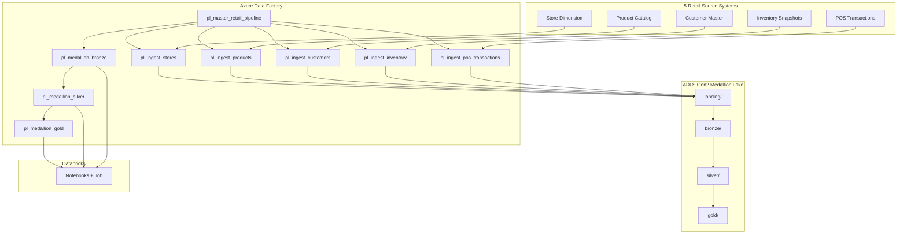

# Retail Data Engineering Pipeline

End-to-end **Azure retail analytics** pipeline: five source systems → **Azure Data Factory (ADF)** landing ingest → **Databricks medallion** (Bronze → Silver → Gold) on **ADLS Gen2**.

Replaces the prior healthcare demo with a production-style layout suitable for **Azure DevOps Repos** and CI/CD.

## Architecture



## Five retail data sources

| Source | Description | Source path | Landing path |
|--------|-------------|-------------|--------------|
| **POS Transactions** | Line-item sales from store POS | `sources/pos_transactions/` | `landing/pos_transactions/` |
| **Inventory** | Daily stock snapshots by store/SKU | `sources/inventory/` | `landing/inventory/` |
| **Customers** | CRM customer master + loyalty tier | `sources/customers/` | `landing/customers/` |
| **Products** | Merchandising product catalog | `sources/products/` | `landing/products/` |
| **Stores** | Store locations and regions | `sources/stores/` | `landing/stores/` |

Sample CSV files for local testing: `data/sample/` (generate with `python scripts/generate-sample-data.py`).

## Project structure

```
Data Engineering Flow/
├── README.md
├── azure-pipelines.yml
├── adf/
│   ├── publish_config.json
│   ├── factory/                    # ARM + factory metadata
│   ├── linkedService/
│   ├── dataset/
│   ├── pipeline/
│   │   ├── pl_master_retail_pipeline.json
│   │   ├── pl_ingest_*.json        # 5 child ingest pipelines
│   │   └── pl_medallion_*.json     # bronze, silver, gold
│   └── trigger/
├── databricks/
│   ├── notebooks/bronze|silver|gold/
│   ├── notebooks/common/
│   └── jobs/retail_medallion_job.json
├── infra/
│   ├── main.bicep
│   └── parameters.dev.json
├── data/sample/                    # Retail CSV samples
└── scripts/
    ├── deploy-infra.ps1
    ├── deploy-adf.ps1
    ├── deploy-databricks.ps1
    ├── push-to-azure-repos.ps1
    ├── upload-sample-sources.ps1
    └── validate-json.ps1
```

## ADF pipeline design

### Master pipeline (`pl_master_retail_pipeline`)

1. **Parallel ingest** — Execute Pipeline activities for all 5 child ingest pipelines (no inter-dependencies).
2. **Bronze** — `pl_medallion_bronze` (5 Databricks notebooks in parallel).
3. **Silver** — `pl_medallion_silver` (cleansing, typing, dedupe).
4. **Gold** — `pl_medallion_gold` (fact sales, inventory analytics, customer segments, dimensions).

### Child ingest pipelines

Each child copies CSV from **source ADLS** → **landing ADLS** with date partitioning (`year=/month=/day=`).

### Parameters (configure per environment)

| Parameter | Example |
|-----------|---------|
| `environment` | `dev` |
| `storageAccountName` | `stretaildatalakedev` |
| `sourceStorageAccountUrl` | `https://stretailsourcesdev.dfs.core.windows.net` |
| `lakeStorageAccountUrl` | `https://stretaildatalakedev.dfs.core.windows.net` |
| `lakeContainer` | `retaildatalake` |
| `databricksWorkspaceUrl` | `https://adb-xxx.0.azuredatabricks.net` |
| `databricksClusterId` | `xxxx-xxxxxx-xxxxx` |

## Databricks medallion

| Layer | Path | Purpose |
|-------|------|---------|
| Bronze | `bronze/{source}/` | Raw Delta from landing + audit columns |
| Silver | `silver/{source}/` | Cleansed, typed, deduplicated |
| Gold | `gold/fact_sales`, `gold/inventory_analytics`, `gold/customer_segments`, `gold/dim_*` | Analytics-ready marts |

Gold outputs:

- **Sales by store** — `gold/fact_sales`
- **Inventory turnover & stockout risk** — `gold/inventory_analytics`
- **Customer segments (RFM-style)** — `gold/customer_segments`
- **Conformed dimensions** — `gold/dim_store`, `dim_product`, `dim_customer`

## Prerequisites

- [Azure CLI](https://learn.microsoft.com/cli/azure/install-azure-cli) (`az login`)
- [Azure PowerShell](https://learn.microsoft.com/powershell/azure/install-azure-powershell) (optional)
- Python 3.10+ (sample data generation)
- Azure subscription with permissions to create RG, Storage, ADF, Databricks, Key Vault

## Step-by-step deployment

### 1. Create resource group and deploy infrastructure

```powershell
cd "c:\Users\Admin\Downloads\Healthcare-APP-main\Data Engineering Flow"

# Login
az login
az account set --subscription "<YOUR_SUBSCRIPTION_ID>"

# Deploy ADLS (lake + sources), Key Vault, ADF, Databricks
.\scripts\deploy-infra.ps1 -ResourceGroupName "rg-retail-de-dev" -Location "eastus"
```

Capture outputs: storage account names, Data Factory name, Databricks workspace URL.

### 2. Push to Azure DevOps Repos

Create an empty repo in Azure DevOps, then:

```powershell
.\scripts\push-to-azure-repos.ps1 `
  -RemoteUrl "https://dev.azure.com/<org>/<project>/_git/retail-data-engineering"
```

### 3. Connect ADF to Git

1. Open **Azure Data Factory Studio** → **Manage** → **Git configuration**.
2. Link Azure DevOps repo:
   - **Root folder:** `/adf`
   - **Collaboration branch:** `main`
   - **Publish branch:** `adf_publish`
3. **Publish** from ADF UI to sync linked services, datasets, pipelines, triggers.

### 4. Configure linked services

Update in ADF (or edit JSON before publish):

- `ls_adls_retail_lake` — lake storage URL
- `ls_adls_retail_sources` — source storage URL
- `ls_databricks_retail` — workspace URL + cluster ID (use Key Vault for tokens)
- Grant ADF **Managed Identity** **Storage Blob Data Contributor** on both storage accounts

### 5. Connect Databricks Repos

1. Databricks → **Repos** → **Add Repo** → same Azure DevOps URL.
2. Path: `/Repos/retail-data-engineering`
3. Create an interactive cluster; note **cluster ID** for ADF linked service.

### 6. Upload sample source data

```powershell
.\scripts\upload-sample-sources.ps1 -StorageAccountName "<source-storage-account>"
```

### 7. Run end-to-end

**Option A — ADF master pipeline**

1. ADF Studio → **pl_master_retail_pipeline** → **Debug** or **Trigger now**.
2. Pass parameters for your storage accounts and Databricks cluster.

**Option B — Databricks job only** (after landing data exists)

```powershell
# Requires Databricks CLI
pip install databricks-cli
databricks configure --token
databricks jobs create --json @databricks/jobs/retail_medallion_job.json
```

**Option C — Daily schedule**

Enable trigger `trg_daily_retail_master` in ADF (starts **Stopped** by default).

## Local validation

```powershell
# Validate all JSON artifacts
.\scripts\validate-json.ps1

# Generate sample retail CSVs
python scripts/generate-sample-data.py
```

## CI/CD

`azure-pipelines.yml` validates JSON on every push to `main`. Configure `AZURE_SERVICE_CONNECTION` and `RESOURCE_GROUP` variables to enable optional Bicep deploy stage.

## What you must configure

| Item | Where |
|------|-------|
| Azure subscription ID | `az account set` |
| Resource group name | `deploy-infra.ps1` |
| Storage account names | Bicep outputs → ADF global parameters |
| Databricks workspace URL & cluster ID | ADF linked service + pipeline parameters |
| Key Vault secrets (optional) | Databricks PAT, storage keys |
| Azure DevOps repo URL | `push-to-azure-repos.ps1` |
| ADF Git root folder | `/adf` |
| RBAC: ADF MI → Storage | Azure Portal / CLI role assignment |

**Do not commit secrets.** Use ADF Key Vault references or Azure DevOps variable groups.

## Security notes

- Storage accounts deploy with HNS, TLS 1.2, no public blob access.
- Key Vault uses RBAC authorization.
- Databricks deploys with `enableNoPublicIp: true` in Bicep (adjust for your network requirements).

## Troubleshooting

| Issue | Fix |
|-------|-----|
| Copy activity auth failure | Grant ADF managed identity Storage Blob Data Contributor |
| Databricks notebook not found | Confirm Repos path matches `/Repos/retail-data-engineering/databricks/notebooks/...` |
| Empty bronze tables | Run `upload-sample-sources.ps1` and verify landing paths |
| Git publish conflicts | Use collaboration branch workflow; publish from ADF UI |

## License

Internal / demo use. Adapt names and SKUs for production workloads.

## Retail Azure pipeline
See [README-RETAIL-AZURE.md](README-RETAIL-AZURE.md) for ADF + Databricks provisioning with Azure CLI.

