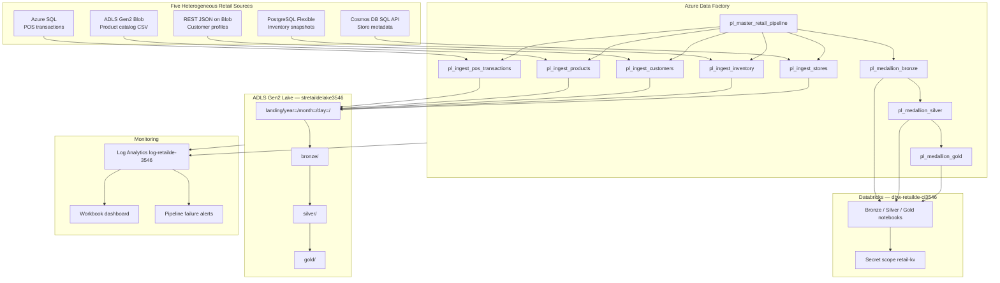
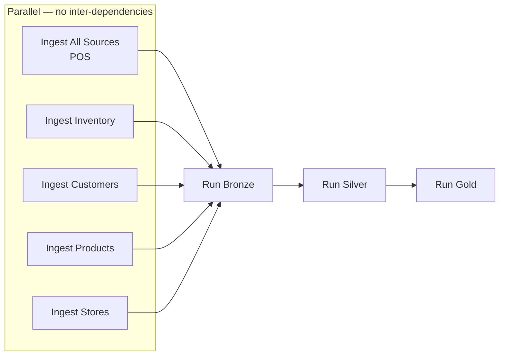

# Retail Azure Data Pipeline — End-to-End Implementation Notes

> **Purpose:** A single technical guide covering everything built in this repository — from business context through Azure provisioning, ADF orchestration, Databricks medallion processing, monitoring, CI/CD, and known deployment issues. Use this document to understand, reproduce, or extend the retail analytics platform.

**Related docs:** [README.md](../README.md) · [README-RETAIL-AZURE.md](../README-RETAIL-AZURE.md) · [infra/provisioned.dev.json](../infra/provisioned.dev.json)

---

## 1. Project Overview

### Business context

This project implements a **production-style retail analytics data platform** on Azure. It replaces an earlier healthcare demo with a coherent **sales-aligned** dataset spanning five heterogeneous source systems. The business goal is to demonstrate how a mid-size retailer would consolidate point-of-sale transactions, product catalog, customer loyalty profiles, inventory snapshots, and store metadata into a single analytics-ready lakehouse.

All sample data shares consistent identifiers:

| Dimension | Values | Count |
|-----------|--------|-------|
| Stores | `S001`–`S005` | 5 locations (Seattle, Bellevue, Portland, Denver, Chicago) |
| Products | `P1001`–`P1008` | 8 SKUs across apparel, footwear, electronics, etc. |
| Customers | `C0001`–`C0008` | 8 loyalty-tier profiles (Bronze → Platinum) |
| POS transactions | May 2025 | 352 line items |
| Inventory snapshots | 2025-05-31 | 40 store×SKU rows (5 stores × 8 products) |

### Medallion architecture

The pipeline follows the **medallion (lakehouse) pattern**:

1. **Landing** — ADF copies raw extracts from each source into date-partitioned CSV files on ADLS Gen2.
2. **Bronze** — Databricks ingests landing CSVs into Delta tables with audit columns (`_ingest_ts`, `_source_file`, `_environment`).
3. **Silver** — Cleansing, typing, deduplication, and business-rule filtering.
4. **Gold** — Analytics marts: fact sales, inventory analytics, customer segments, and conformed dimensions.

### Architecture diagram



---

## 2. Architecture Deep Dive

### Data flow stages

| Stage | Technology | Parallelism | Output |
|-------|------------|-------------|--------|
| Ingest (×5) | ADF Copy activities | All five child pipelines run in parallel | `landing/{source}/year=YYYY/month=MM/day=DD/*.csv` |
| Bronze (×5) | ADF DatabricksNotebook | Five notebooks in parallel | `bronze/{source}/` Delta tables |
| Silver (×5) | ADF DatabricksNotebook | Five notebooks in parallel | `silver/{source}/` Delta tables |
| Gold (×4) | ADF DatabricksNotebook | Three parallel + `gold_dim_retail` depends on fact sales | `gold/fact_sales`, `gold/inventory_analytics`, `gold/customer_segments`, `gold/dim_*` |

### Orchestration pattern

The **master/child** pattern decouples source-specific ingest logic from medallion processing:

- **`pl_master_retail_pipeline`** — Top-level orchestrator with explicit dependency chain: all ingests succeed → bronze → silver → gold.
- **Five child ingest pipelines** — Each encapsulates one source type, linked service, and copy activity configuration.
- **Three medallion pipelines** — Separate bronze, silver, and gold stages so each layer can be re-run independently after landing data exists.

### Cross-region design

Core platform services (storage, ADF, Key Vault, Log Analytics) deploy to **eastus**. Relational and analytical data services deploy to **centralindia** because Azure SQL Database and PostgreSQL Flexible Server were unavailable in eastus/westus2 during provisioning. The `ci3546` suffix on data-service resource names reflects this regional split.

---

## 3. Azure Resources

### Naming convention

| Pattern | Example | Notes |
|---------|---------|-------|
| Resource group | `rg-retailde-dev` | `{prefix}-{environment}` |
| Numeric suffix | `3546` | Fixed via `-FixedSuffix 3546` or random |
| Data services suffix | `ci3546` | Appended to SQL/Postgres/Cosmos/Databricks in centralindia |
| Lake storage | `stretaildelake3546` | `st` + prefix + `lake` + suffix (max 24 chars) |
| Sources storage | `stretaildesrc3546` | Separate account for blob/REST sources |
| Key Vault | `kvretailde3546` | RBAC-enabled, no access policies |
| Data Factory | `adf-retailde-dev3546` | System-assigned managed identity |
| SQL server | `sql-retailde-ci3546` | Database: `sqldb-pos` |
| PostgreSQL | `psql-retailde-ci3546` | Database: `inventory` |
| Cosmos DB | `cosmos-retailde-ci3546` | Database: `retailmetadata`, container: `stores` |
| Databricks | `dbw-retailde-ci3546` | Premium SKU workspace |
| Log Analytics | `log-retailde-3546` | PerGB2018 SKU |

### Deployed resource inventory

All names and URLs are captured in [`infra/provisioned.dev.json`](../infra/provisioned.dev.json).

| Resource type | Name | Region | Role |
|---------------|------|--------|------|
| Resource group | `rg-retailde-dev` | eastus | Container for all resources |
| Storage (lake) | `stretaildelake3546` | eastus | Medallion lake: landing, bronze, silver, gold |
| Storage (sources) | `stretaildesrc3546` | eastus | Product CSV, customer JSON for REST ingest |
| Key Vault | `kvretailde3546` | eastus | SQL/Postgres/Cosmos passwords, lake storage key |
| Data Factory | `adf-retailde-dev3546` | eastus | Orchestration, copy activities, Databricks triggers |
| Azure SQL | `sql-retailde-ci3546` / `sqldb-pos` | centralindia | POS transactional data |
| PostgreSQL Flexible | `psql-retailde-ci3546` / `inventory` | centralindia | Inventory snapshots |
| Cosmos DB | `cosmos-retailde-ci3546` | centralindia | Store dimension documents |
| Databricks | `dbw-retailde-ci3546` | centralindia | Medallion notebook execution |
| Log Analytics | `log-retailde-3546` | eastus | Centralized logs and workbook queries |
| Action group | `ag-retailde-ops-3546` | — | Alert notification target |
| Workbook | `workbook-retail-pipeline-3546` | eastus | Operational dashboard |

### RBAC assignments (critical)

| Principal | Role | Scope | Why |
|-----------|------|-------|-----|
| ADF managed identity | Storage Blob Data Contributor | Lake + sources storage | Copy activities read/write ADLS without keys |
| ADF managed identity | Key Vault Secrets User | Key Vault | SQL/Cosmos linked services read secrets |
| ADF managed identity | Contributor | Databricks workspace | MSI authentication to invoke notebooks |
| Deployer (you) | Key Vault Secrets Officer | Key Vault | Provision scripts write secrets |
| Databricks | Storage Blob Data Contributor (optional) | Lake storage | Alternative to account-key auth via secret scope |

---

## 4. Five Data Sources in Detail

### 4.1 POS Transactions — Azure SQL Database

| Attribute | Value |
|-----------|-------|
| **Pipeline** | `pl_ingest_pos_transactions` |
| **Copy source type** | `AzureSqlSource` |
| **Linked service** | `ls_azure_sql_pos` (password from Key Vault secret `sql-admin-password`) |
| **Landing path** | `landing/pos_transactions/year=…/month=…/day=…/pos_transactions.csv` |

**Schema (`dbo.pos_transactions`):**

| Column | Type | Description |
|--------|------|-------------|
| `transaction_id` | NVARCHAR(32) | Primary line identifier (e.g. `T10001`) |
| `transaction_date` | DATE | Sale date (May 2025) |
| `transaction_time` | NVARCHAR(16) | Time of sale |
| `store_id` | NVARCHAR(16) | `S001`–`S005` |
| `customer_id` | NVARCHAR(16) | `C0001`–`C0008` |
| `product_id` | NVARCHAR(16) | `P1001`–`P1008` |
| `quantity` | INT | Units sold |
| `unit_price` | DECIMAL(10,2) | List price |
| `discount_pct` | DECIMAL(5,2) | Discount percentage |
| `line_total` | DECIMAL(12,2) | Net line amount |
| `payment_method` | NVARCHAR(16) | CASH, CREDIT, DEBIT, MOBILE |

**Sample row:** `T10001, 2025-05-01, S001, C0003, P1004, qty=1, line_total=75.99, MOBILE`

**Seed:** `scripts/seed/pos_transactions.sql` (352 INSERT statements)

---

### 4.2 Product Catalog — ADLS Gen2 CSV (Blob)

| Attribute | Value |
|-----------|-------|
| **Pipeline** | `pl_ingest_products` |
| **Copy source type** | `DelimitedTextSource` (ADLS Gen2 read) |
| **Linked service** | `ls_adls_retail_sources` (MSI auth) |
| **Source path** | `sources/products/products.csv` on `stretaildesrc3546` |
| **Landing path** | `landing/products/…/products.csv` |

**Schema:**

| Column | Example |
|--------|---------|
| `product_id` | `P1001` |
| `product_name` | Organic Cotton T-Shirt |
| `category` | Apparel |
| `subcategory` | Basics |
| `unit_price` | 24.99 |
| `is_active` | Y |

**Sample:** 8 SKUs from `P1001` (T-Shirt, $24.99) through `P1008` (Winter Puffer Jacket, $149.99)

---

### 4.3 Customer Profiles — REST JSON on Blob

| Attribute | Value |
|-----------|-------|
| **Pipeline** | `pl_ingest_customers` |
| **Copy source type** | `RestSource` (GET) |
| **Linked service** | `ls_rest_customers` (HttpServer, anonymous + SAS token in URL) |
| **Source URL** | `https://stretaildesrc3546.blob.core.windows.net/sources/customers/customers.json?{SAS}` |
| **Landing path** | `landing/customers/…/customers.csv` |

**JSON fields (mapped via TabularTranslator):**

| JSON path | CSV column |
|-----------|------------|
| `$['customer_id']` | customer_id |
| `$['first_name']` | first_name |
| `$['last_name']` | last_name |
| `$['email']` | email |
| `$['loyalty_tier']` | loyalty_tier |
| `$['signup_date']` | signup_date |

**Sample:** `C0001, Alice, Johnson, Gold tier, signup 2022-03-15`

**Note:** The REST linked service uses a **read SAS token** generated by `seed-sample-data.ps1` and stored in `provisioned.dev.json` as `restCustomersPath`. The SAS expires 2028-06-01; regenerate by re-running the seed script.

---

### 4.4 Inventory Snapshots — PostgreSQL Flexible Server

| Attribute | Value |
|-----------|-------|
| **Pipeline** | `pl_ingest_inventory` |
| **Copy source type** | `PostgreSqlV2Source` |
| **Linked service** | `ls_postgresql_inventory` (Basic auth, password from Key Vault or inline at deploy) |
| **Landing path** | `landing/inventory/…/inventory.csv` |

**Schema (`inventory_snapshot`):**

| Column | Type | Description |
|--------|------|-------------|
| `store_id` | VARCHAR(16) | Store identifier |
| `product_id` | VARCHAR(16) | SKU |
| `quantity_on_hand` | INT | Current stock |
| `reorder_point` | INT | Replenishment threshold |
| `snapshot_date` | DATE | Snapshot date (2025-05-31) |

**Sample:** `S001, P1001, qty_on_hand=163, reorder_point=13`

**Seed:** `scripts/seed/inventory.sql` (40 rows = 5 stores × 8 products)

---

### 4.5 Store Metadata — Cosmos DB SQL API

| Attribute | Value |
|-----------|-------|
| **Pipeline** | `pl_ingest_stores` |
| **Copy source type** | `CosmosDbSqlApiSource` |
| **Linked service** | `ls_cosmos_stores` (account key from Key Vault secret `cosmos-primary-key`) |
| **Query** | `SELECT c.store_id, c.store_name, c.city, c.state, c.postal_code, c.region, c.opened_date FROM c` |
| **Landing path** | `landing/stores/…/stores.csv` |

**Document fields:**

| Field | Example |
|-------|---------|
| `store_id` | `S001` |
| `store_name` | Downtown Flagship |
| `city` | Seattle |
| `state` | WA |
| `postal_code` | 98101 |
| `region` | West |
| `opened_date` | 2018-01-01 |

Cosmos also stores `annual_sales_usd` in seed data (used in CSV generation) though the ADF query selects a subset for landing.

**Seed:** `scripts/seed/cosmos_stores.py` reading `data/sample/stores.csv`

---

## 5. ADF Pipelines

### 5.1 Master pipeline — `pl_master_retail_pipeline`

**Activity sequence:**



**Master parameters:**

| Parameter | Default (dev) | Purpose |
|-----------|---------------|---------|
| `environment` | `dev` | Passed to Databricks notebooks |
| `storageAccountName` | `stretaildelake3546` | Lake account (short name for abfss paths) |
| `sourceStorageAccountUrl` | `https://stretaildesrc3546.dfs.core.windows.net` | Products copy source |
| `sourceContainer` | `sources` | Sources container name |
| `lakeStorageAccountUrl` | `https://stretaildelake3546.dfs.core.windows.net` | Landing write target |
| `lakeContainer` | `retaildatalake` | Lake file system |
| `landingPathPrefix` | `landing` | Root landing folder |
| `databricksWorkspaceUrl` | `https://adb-7405606963187307.7.azuredatabricks.net` | Workspace URL (full URL at master level) |
| `databricksClusterId` | `0602-032411-xeepuoij` | Existing cluster for notebook runs |
| `databricksWorkspaceResourceId` | ARM resource ID | Required for MSI auth |
| `restCustomersBaseUrl` | Blob base URL | REST linked service base |
| `restCustomersPath` | Path + SAS query string | Full relative URL for customer JSON |

**Important:** The master passes `databricksClusterId` to medallion child pipelines but relies on linked service default parameters for `workspaceUrl` and `workspaceResourceId`. See [Troubleshooting §10](#10-troubleshooting) for parameter wiring issues encountered during deployment.

### 5.2 Child ingest pipelines

| Pipeline | Copy activity | Source → Sink |
|----------|---------------|---------------|
| `pl_ingest_pos_transactions` | Copy POS SQL to Landing | Azure SQL → DelimitedText (ADLS landing) |
| `pl_ingest_products` | Copy Products to Landing | DelimitedText (sources ADLS) → DelimitedText (landing) |
| `pl_ingest_customers` | Copy REST Customers to Landing | RestSource → DelimitedText with JSON field mapping |
| `pl_ingest_inventory` | Copy Inventory PG to Landing | PostgreSqlV2Source → DelimitedText |
| `pl_ingest_stores` | Copy Cosmos Stores to Landing | CosmosDbSqlApiSource → DelimitedText |

All landing writes use dataset `ds_landing_retail_csv`, which adds **date partitioning**:

```
landing/{source}/year=YYYY/month=MM/day=DD/{filename}.csv
```

Bronze notebooks use `recursiveFileLookup=true` to read across partitions.

### 5.3 Medallion pipelines

| Pipeline | Activities | Notebook path pattern |
|----------|------------|----------------------|
| `pl_medallion_bronze` | 5 parallel DatabricksNotebook | `/Repos/retail-data-engineering/databricks/notebooks/bronze/bronze_*` |
| `pl_medallion_silver` | 5 parallel DatabricksNotebook | `…/silver/silver_*` |
| `pl_medallion_gold` | 3 parallel + 1 dependent | `…/gold/gold_fact_sales`, `gold_inventory_analytics`, `gold_customer_segments`, then `gold_dim_retail` |

**Notebook base parameters (all medallion activities):**

```json
{
  "environment": "@pipeline().parameters.environment",
  "storage_account": "@pipeline().parameters.storageAccountName",
  "container": "@pipeline().parameters.lakeContainer"
}
```

### 5.4 Linked services

| Linked service | Type | Auth |
|----------------|------|------|
| `ls_adls_retail_lake` | AzureBlobFS | MSI (ADF identity) |
| `ls_adls_retail_sources` | AzureBlobFS | MSI |
| `ls_azure_sql_pos` | AzureSqlDatabase | SQL auth + Key Vault password |
| `ls_postgresql_inventory` | PostgreSqlV2 | Basic auth + Key Vault or inline password |
| `ls_rest_customers` | HttpServer | Anonymous (SAS in URL path) |
| `ls_cosmos_stores` | CosmosDb | Key Vault account key |
| `ls_databricks_retail` | AzureDatabricks | **MSI** + existing cluster ID |
| `ls_key_vault_retail` | AzureKeyVault | MSI |

**Databricks linked service details:**

- `domain`: host-only, e.g. `adb-7405606963187307.7.azuredatabricks.net` (**no** `https://` prefix)
- `authentication`: `MSI`
- `workspaceResourceId`: full ARM ID of the Databricks workspace
- `existingClusterId`: parameterized cluster ID

### 5.5 Datasets

| Dataset | Used by | Purpose |
|---------|---------|---------|
| `ds_azure_sql_pos` | POS ingest | SQL table reference |
| `ds_postgresql_inventory` | Inventory ingest | PostgreSQL table reference |
| `ds_rest_customers` | Customer ingest | REST relative URL parameter |
| `ds_cosmos_stores` | Store ingest | Cosmos container reference |
| `ds_source_retail_csv` | Products ingest | Parameterized source CSV path |
| `ds_landing_retail_csv` | All ingests | Parameterized landing CSV with date partition |
| `ds_databricks_notebook` | (Reserved) | Notebook path dataset — LS reference without extra URL params |

### 5.6 Triggers

| Trigger | Schedule | Default state | Parameters |
|---------|----------|---------------|------------|
| `trg_daily_retail_master` | Daily at 02:00 UTC | **Stopped** | Requires manual parameter configuration |
| `trg_every_5min_retail_master` | Every 5 minutes | **Stopped** | Pre-populated with dev defaults from `provisioned.dev.json` |

Enable a trigger in ADF Studio (**Manage → Triggers → Start**) after verifying pipeline parameters and cluster availability.

---

## 6. Databricks Medallion Layer

### 6.1 Notebook structure

```
databricks/notebooks/
├── common/config.py          # Lake paths + ADLS auth via secret scope
├── bronze/                   # 5 notebooks — landing CSV → Delta bronze
├── silver/                   # 5 notebooks — cleanse, type, dedupe
└── gold/                     # 4 notebooks — analytics marts
    ├── gold_fact_sales.py
    ├── gold_inventory_analytics.py
    ├── gold_customer_segments.py
    └── gold_dim_retail.py
```

### 6.2 `config.py` — shared utilities

The common config module provides:

- **`configure_lake_access(storage_account)`** — Reads `lake-storage-key` from Databricks secret scope `retail-kv` and sets Spark `fs.azure.account.key.*` configuration for abfss access.
- **Path helpers** — `landing_path`, `bronze_path`, `silver_path`, `gold_path` build consistent abfss URIs.
- **Auto-configuration** — When imported, if `storage_account` widget is set, auth is configured automatically.

Example lake base path:

```
abfss://retaildatalake@stretaildelake3546.dfs.core.windows.net
```

### 6.3 Secret scope

| Scope | Key | Source |
|-------|-----|--------|
| `retail-kv` | `lake-storage-key` | Azure Key Vault `kvretailde3546` |

Create the scope in Databricks (**Settings → Secrets → Create scope**) backed by Key Vault. Grant the cluster's managed identity or an admin SP **Get** permission on the vault secret.

### 6.4 Cluster requirements

Recommended cluster configuration (used by `run-adf-master.ps1` when `DATABRICKS_TOKEN` is set):

| Setting | Value |
|---------|-------|
| Name | `retail-medallion-adf` |
| Spark version | 13.3.x-scala2.12 (LTS) |
| Node type | `Standard_DS3_v2` or `Standard_D2ads_v6` (quota-dependent) |
| Workers | 0 (single-node profile) |
| Auto-termination | 60 minutes |
| Tags | `project=retail-data-pipeline` |

**Deployed cluster ID:** `0602-032411-xeepuoij` (stored in `provisioned.dev.json`)

### 6.5 USER_ISOLATION and ADLS auth

Databricks workspaces with **Enhanced Security** use `USER_ISOLATION` cluster mode. In this mode:

- You **cannot** set `spark.conf` for storage account keys at cluster init via `spark_conf` in the cluster API.
- Account-key auth must happen **at runtime** inside notebooks via `dbutils.secrets.get` — exactly what `config.py` implements.

**Alternative (production):** Unity Catalog external locations with managed identity, or OAuth/PAS-through for storage — not configured in this demo.

### 6.6 Gold layer outputs

| Path | Content |
|------|---------|
| `gold/fact_sales` | Net sales, units, transaction count by store/product/customer/day |
| `gold/inventory_analytics` | Stock levels vs sales velocity, stockout risk indicators |
| `gold/customer_segments` | Loyalty tier analytics, RFM-style segments |
| `gold/dim_store`, `dim_product`, `dim_customer` | Conformed dimensions (via `gold_dim_retail.py`) |

### 6.7 Standalone Databricks job

`databricks/jobs/retail_medallion_job.json` defines a multi-task job that runs bronze → silver → gold outside ADF. Useful for testing medallion after landing data exists:

```powershell
pip install databricks-cli
databricks configure --token
databricks jobs create --json @databricks/jobs/retail_medallion_job.json
```

Update `storage_account` parameters to match your lake account name.

---

## 7. Step-by-Step Implementation Guide

### Phase 0 — Prerequisites

1. **Azure subscription** with Contributor access (subscription used in dev: `c4682434-f940-4f2f-a64f-c69a6054bb10`).
2. **Azure CLI** — [Install](https://learn.microsoft.com/cli/azure/install-azure-cli) and authenticate:

   ```powershell
   az login
   az account set --subscription "YOUR_SUBSCRIPTION_ID"
   ```

3. **PowerShell 5.1+** (Windows) for provisioning scripts.
4. **Python 3.10+** for sample data generation.
5. **Optional tools:** `sqlcmd`, `psql`, Databricks CLI, Azure DevOps CLI.
6. **Optional environment variables:**

   ```powershell
   $env:SQL_ADMIN_PASSWORD = "<strong-password>"
   $env:POSTGRES_ADMIN_PASSWORD = "<strong-password>"
   $env:DATABRICKS_TOKEN = "<personal-access-token>"   # for automated cluster creation
   ```

### Phase 1 — Provision Azure resources

From the repository root:

```powershell
cd "c:\Users\Admin\Downloads\Healthcare-APP-main\Data Engineering Flow"

.\scripts\provision-all-resources.ps1 `
  -FixedSuffix 3546 `
  -DataServicesLocation centralindia
```

This script (`scripts/provision-all-resources.ps1`):

1. Creates resource group `rg-retailde-dev` in **eastus**.
2. Creates lake + sources ADLS Gen2 accounts with HNS enabled.
3. Creates lake folders: `landing`, `bronze`, `silver`, `gold`.
4. Creates Key Vault with RBAC authorization.
5. Creates Azure SQL + PostgreSQL in **centralindia** (with firewall rules for Azure services).
6. Creates Cosmos DB account, database, and `stores` container.
7. Creates Data Factory with MSI and grants **Storage Blob Data Contributor** on both storage accounts.
8. Creates Databricks Premium workspace in centralindia.
9. Writes all resource names to `infra/provisioned.dev.json`.
10. Optionally chains to `seed-sample-data.ps1` unless `-SkipSeed` is passed.

**Why centralindia?** SQL and PostgreSQL provisioning failed in eastus/westus2 due to regional capacity restrictions. The script accepts `-DataServicesLocation` to target an available region.

### Phase 2 — Seed sample data

```powershell
.\scripts\seed-sample-data.ps1 -ProvisionedPath .\infra\provisioned.dev.json
```

This:

1. Runs `generate-sample-data.py` → creates coherent CSV/JSON in `data/sample/`.
2. Runs `build-seed-from-csv.py` → generates SQL and Postgres seed files.
3. Uploads `products.csv` and `customers.json` to sources storage.
4. Generates a **read SAS** for REST ingest and saves URLs to `provisioned.dev.json`.
5. Seeds Azure SQL (352 POS rows), PostgreSQL (40 inventory rows), and Cosmos (5 stores).
6. Stores passwords in Key Vault: `sql-admin-password`, `postgres-admin-password`, `cosmos-primary-key`.

### Phase 3 — Deploy ADF artifacts

```powershell
.\scripts\deploy-adf-artifacts.ps1
```

Deploys linked services, datasets, pipelines, and triggers via `az datafactory` CLI. The script:

- Patches linked service default parameters from `provisioned.dev.json`.
- Injects PostgreSQL password from Key Vault (deletes and recreates LS if needed).
- Sets Databricks LS to host-only domain with MSI auth.
- Grants ADF MSI **Contributor** on Databricks and **Key Vault Secrets User** on Key Vault.

If PostgreSQL ingest fails with auth errors:

```powershell
.\scripts\fix-postgres-linked-service.ps1
```

### Phase 4 — Configure Databricks

1. **Open workspace:** `https://adb-7405606963187307.7.azuredatabricks.net`
2. **Create or verify cluster** — Single-node, Runtime 13.3 LTS. Copy cluster ID to `infra/provisioned.dev.json` → `databricksClusterId`.
3. **Connect Azure DevOps repo** — Repos → Add Repo → same URL as your Azure DevOps project. Path: `/Repos/retail-data-engineering`.
4. **Create secret scope** — Settings → Secrets → Create scope `retail-kv` backed by Key Vault `kvretailde3546`. Add secret ACLs for your user and cluster.
5. **Verify notebook paths** — ADF expects `/Repos/retail-data-engineering/databricks/notebooks/bronze/...` (no `.py` extension in ADF notebook path).
6. **Re-deploy ADF** after cluster ID changes:

   ```powershell
   .\scripts\deploy-adf-artifacts.ps1
   ```

### Phase 5 — Deploy monitoring

```powershell
.\scripts\deploy-monitoring.ps1
```

Or via Bicep:

```powershell
az deployment group create -g rg-retailde-dev `
  -f infra/monitoring/main.bicep `
  -p infra/monitoring/parameters.dev.json
```

Creates Log Analytics workspace, diagnostic settings on all resources, action group, alert rules, and the **Retail Data Pipeline Dashboard** workbook.

### Phase 6 — Run master pipeline

**Option A — Script (recommended):**

```powershell
$env:DATABRICKS_TOKEN = "<pat>"   # optional — auto-creates cluster if missing
.\scripts\run-adf-master.ps1 -Wait
```

**Option B — ADF Studio:**

1. Open `adf-retailde-dev3546` in ADF Studio.
2. Select `pl_master_retail_pipeline` → **Trigger now**.
3. Verify parameters match `provisioned.dev.json`.

**Option C — Enable scheduled trigger:**

```powershell
az datafactory trigger start -g rg-retailde-dev `
  --factory-name adf-retailde-dev3546 `
  --name trg_daily_retail_master
```

Configure trigger parameters first in ADF Studio.

### Phase 7 — Push to Azure Repos

```powershell
.\scripts\push-to-azure-repos.ps1 `
  -RemoteUrl "https://dev.azure.com/<org>/<project>/_git/retail-data-engineering"
```

Then connect ADF Git integration:

- Root folder: `/adf`
- Collaboration branch: `main`
- Publish branch: `adf_publish`

---

## 8. Azure CLI Commands Reference

### Authentication and subscription

```powershell
az login
az account set --subscription "c4682434-f940-4f2f-a64f-c69a6054bb10"
az account show --query "{name:name, id:id}" -o table
```

### Resource group and storage

```powershell
az group create --name rg-retailde-dev --location eastus
az storage account show -g rg-retailde-dev -n stretaildelake3546 --query id -o tsv
az storage fs directory list --account-name stretaildelake3546 --file-system retaildatalake --path landing --auth-mode login
```

### Data Factory

```powershell
# Deploy linked service
az datafactory linked-service create -g rg-retailde-dev `
  --factory-name adf-retailde-dev3546 --name ls_adls_retail_lake `
  --properties "@linked-service-props.json"

# Run master pipeline
az datafactory pipeline create-run -g rg-retailde-dev `
  --factory-name adf-retailde-dev3546 --name pl_master_retail_pipeline `
  --parameters "@adf-master-params.json"

# Check run status
az datafactory pipeline-run show -g rg-retailde-dev `
  --factory-name adf-retailde-dev3546 --run-id "<RUN_ID>" --query status -o tsv

# Query failed activities
az datafactory activity-run query-by-pipeline-run -g rg-retailde-dev `
  --factory-name adf-retailde-dev3546 --run-id "<RUN_ID>" `
  --last-updated-after 2026-06-01T00:00:00Z `
  --last-updated-before 2026-06-03T23:59:59Z -o table
```

### Key Vault and RBAC

```powershell
az keyvault secret show --vault-name kvretailde3546 --name sql-admin-password -o tsv --query value
az role assignment create --assignee "<ADF_PRINCIPAL_ID>" `
  --role "Storage Blob Data Contributor" --scope "<STORAGE_ACCOUNT_RESOURCE_ID>"
```

### Databricks

```powershell
az databricks workspace show -g rg-retailde-dev -n dbw-retailde-ci3546 --query workspaceUrl -o tsv
```

### Monitoring

```powershell
az monitor log-analytics workspace show -g rg-retailde-dev -n log-retailde-3546
az monitor diagnostic-settings list --resource "<RESOURCE_ID>"
```

### Validation

```powershell
.\scripts\validate-json.ps1
python scripts/generate-sample-data.py
```

---

## 9. Monitoring and Dashboard

### Log Analytics workspace

| Property | Value |
|----------|-------|
| Name | `log-retailde-3546` |
| Customer ID | `aef9bd2a-ee2b-4afb-9286-ec92384c5336` |
| SKU | PerGB2018 |

### Diagnostic settings

| Resource | Setting name | Key log categories |
|----------|--------------|-------------------|
| ADF | `diag-adf-retail` | PipelineRuns, ActivityRuns, TriggerRuns |
| Lake storage | `diag-stretaildelake3546` | StorageRead, StorageWrite, Transactions |
| Sources storage | `diag-stretaildesrc3546` | StorageRead, StorageWrite |
| SQL Server + DB | `diag-sql-retail`, `diag-sqldb-pos` | SQLInsights, Errors, QueryStore |
| PostgreSQL | `diag-postgres-retail` | PostgreSQLLogs, QueryStore |
| Cosmos DB | `diag-cosmos-retail` | DataPlaneRequests |
| Databricks | `diag-databricks-retail` | clusters, jobs, notebook |
| Key Vault | `diag-kv-retail` | AuditEvent |

### Alerts

| Alert | Condition | Action group |
|-------|-----------|--------------|
| `alert-adf-pipeline-failure-3546` | ADF pipeline run failures within 15 minutes | `ag-retailde-ops-3546` |
| `alert-storage-ingestion-errors-3546` | Storage activity anomalies | `ag-retailde-ops-3546` |

Alert rules deploy via ARM template: `infra/monitoring/alert-rules.json`

### Workbook dashboard

**Location:** Azure Portal → Monitor → Workbooks → **Retail Data Pipeline Dashboard**

Or: Resource group `rg-retailde-dev` → `workbook-retail-pipeline-3546`

**Source JSON:** `monitoring/workbook-retail-pipeline.json`

**Panels:**

- Pipeline success rate and run timeline
- Ingestion volumes by source
- Sales KPIs (from gold layer / sample queries)
- Storage health metrics
- Recent failure log entries

---

## 10. Troubleshooting

This section documents **real issues encountered** during deployment and how they were resolved.

### 10.1 PostgreSQL ADF authentication (28P01)

**Symptom:** `pl_ingest_inventory` fails with PostgreSQL error `28P01` (invalid password). Python/psql seed works; ADF copy does not.

**Root cause:** ADF linked service retained a stale `REPLACE_AT_DEPLOY` password or encrypted credential from an earlier deploy. CLI updates sometimes do not refresh encrypted fields.

**Fix:**

```powershell
.\scripts\fix-postgres-linked-service.ps1
```

Or manually in ADF Studio: **Manage → Linked services → ls_postgresql_inventory → Edit** → set password from Key Vault secret `postgres-admin-password`.

The deploy script deletes and recreates the LS when a Key Vault password is available.

### 10.2 Databricks quota exceeded (Central India)

**Symptom:** Cluster creation fails with `AZURE_QUOTA_EXCEEDED` — 4 vCPU limit in centralindia.

**Fix:**

1. Use a smaller VM SKU: `Standard_D2ads_v6` or `Standard_DS3_v2`.
2. Set `num_workers = 0` (single-node cluster).
3. Request quota increase in Azure Portal → Subscriptions → Usage + quotas.
4. Alternatively deploy Databricks to a region with available quota and update `provisioned.dev.json`.

### 10.3 Invalid URI on Databricks linked service

**Symptom:** Medallion pipelines fail immediately with **Invalid URI** on DatabricksNotebook activities.

**Root causes (multiple iterations):**

1. **`workspaceUrl` included `https://`** — ADF Databricks LS `domain` field expects host-only: `adb-7405606963187307.7.azuredatabricks.net`.
2. **Pipeline passed stale `workspaceUrl` to LS** — Activity-level LS parameters overrode correct defaults with malformed values.
3. **Missing `workspaceResourceId`** — Required when using MSI authentication.

**Fix:**

1. Set `ls_databricks_retail.json`:
   - `domain`: `@linkedService().workspaceUrl` with default **host-only** (no scheme).
   - `authentication`: `MSI`
   - `workspaceResourceId`: full ARM resource ID.
2. Ensure `deploy-adf-artifacts.ps1` strips `https://` when setting defaults.
3. Grant ADF MSI **Contributor** on the Databricks workspace resource.

### 10.4 ADLS auth on USER_ISOLATION clusters

**Symptom:** Bronze notebooks fail with `Forbidden` or `InvalidConfigurationException` when reading abfss paths. Cluster `spark_conf` with `fs.azure.account.key.*` is rejected.

**Root cause:** USER_ISOLATION mode blocks storage credentials in cluster configuration.

**Fix:** Use runtime secret scope auth in `config.py`:

```python
storage_key = dbutils.secrets.get(scope="retail-kv", key="lake-storage-key")
spark.conf.set(f"fs.azure.account.key.{account}.dfs.core.windows.net", storage_key)
```

Ensure secret scope `retail-kv` exists and is backed by Key Vault.

### 10.5 Parallel bronze pipeline stuck InProgress

**Symptom:** `pl_medallion_bronze` run stays **InProgress** indefinitely. All five notebook activities show InProgress with no completion. Example run ID: `3fca857d-5e38-11f1-8154-9cfce85da44d`.

**Root causes:**

1. Underlying Databricks auth failure (ADLS or Invalid URI) — activities never truly start.
2. Cluster auto-termination or quota termination mid-run.
3. Orphaned Databricks job runs blocking cluster.

**Fix:**

1. Cancel stuck ADF run: ADF Studio → Monitor → Cancel, or wait and cancel via CLI.
2. Fix underlying auth/URI issues first (sections 10.3, 10.4).
3. Cancel orphaned runs in Databricks **Workflows → Runs**.
4. If parallel execution causes resource contention on single-node cluster, consider running bronze notebooks **sequentially** (modify pipeline dependencies) or use a multi-worker cluster.
5. Verify landing data exists with `recursiveFileLookup` — bronze notebooks already enable this for partitioned paths.

### 10.6 Parameter wiring fixes (master → medallion)

**Symptom:** Master pipeline passes `databricksClusterId` to medallion children but **not** `databricksWorkspaceUrl` or `databricksWorkspaceResourceId`. Medallion activities reference LS with `workspaceUrl` and `clusterId` parameters.

**Current behavior:** Linked service defaults (set by deploy script) supply workspace URL and resource ID. Activity-level parameters override only `clusterId` and `workspaceUrl` from pipeline parameters.

**Best practice:**

1. Keep authoritative values in `provisioned.dev.json`.
2. Re-run `deploy-adf-artifacts.ps1` after any cluster or workspace change.
3. When debugging, compare **deployed** LS vs repo JSON:

   ```powershell
   az datafactory linked-service show -g rg-retailde-dev `
     --factory-name adf-retailde-dev3546 `
     --linked-service-name ls_databricks_retail -o json
   ```

4. Ensure master `databricksWorkspaceUrl` default is consistent (full URL at master level; host-only at LS level).

### 10.7 REST customer ingest — SAS expiry

**Symptom:** Customer ingest fails with 403 on blob REST call.

**Fix:** Re-run `seed-sample-data.ps1` to regenerate SAS token. Update `restCustomersPath` in `provisioned.dev.json` and redeploy `ls_rest_customers` / rerun master with updated parameters.

### 10.8 Empty bronze tables

**Symptom:** Bronze Delta paths exist but contain no `_delta_log`.

**Checklist:**

1. Confirm landing CSVs exist: `az storage fs file list --path landing/pos_transactions --recursive …`
2. Confirm cluster ran notebooks successfully (Databricks run history).
3. Confirm secret scope auth works (test `configure_lake_access` in a notebook cell).
4. Re-run `pl_medallion_bronze` only after fixing auth.

---

## 11. Security

### Secrets management

| Secret | Key Vault name | Used by |
|--------|----------------|---------|
| SQL admin password | `sql-admin-password` | ADF `ls_azure_sql_pos` |
| PostgreSQL admin password | `postgres-admin-password` | ADF `ls_postgresql_inventory`, seed scripts |
| Cosmos primary key | `cosmos-primary-key` | ADF `ls_cosmos_stores` |
| Lake storage account key | `lake-storage-key` | Databricks secret scope `retail-kv` |

**Never commit secrets.** The repository `.gitignore` excludes `.env`, credentials, and local provisioned overrides. Use Key Vault references in ADF linked services.

### Managed identities

- **ADF system-assigned MSI** — Primary identity for storage, Key Vault, and Databricks MSI auth.
- **No stored Databricks PAT in ADF** — Linked service uses MSI (`authentication: MSI`), eliminating PAT rotation in ADF.

### Network and storage hardening

- Storage accounts: HNS enabled, TLS 1.2 minimum, public blob access disabled.
- Key Vault: RBAC authorization (no legacy access policies).
- Databricks: deployed with premium SKU; configure VNet injection for production.
- PostgreSQL/SQL: firewall allows Azure services (`0.0.0.0` rule for Azure backbone).

### Least privilege recommendations for production

1. Replace storage account keys with **Azure AD passthrough** or Unity Catalog external locations.
2. Use **private endpoints** for SQL, PostgreSQL, storage, and Key Vault.
3. Store PostgreSQL password only in Key Vault (remove inline SecureString from deploy script after initial setup).
4. Enable **Azure Defender** and soft delete on storage and Key Vault.

---

## 12. CI/CD

### Pipeline file: `azure-pipelines.yml`

**Trigger:** Push to `main` affecting `adf/`, `databricks/`, `infra/`, or `scripts/`.

**Stage 1 — Validate:**

- Python 3.11 on `ubuntu-latest`.
- JSON syntax validation for all ADF, Databricks job, and infra JSON files.
- Runs `generate-sample-data.py` to verify sample data scripts.

**Stage 2 — DeployDev (manual/conditional):**

- Depends on Validate; runs only on `main`.
- Uses deployment environment `retail-de-dev`.
- **Infra deploy is placeholder** — requires configuring Azure DevOps variables:
  - `AZURE_SERVICE_CONNECTION` — service connection name
  - `RESOURCE_GROUP` — target resource group
- Intended command: `az deployment group create -g $(RESOURCE_GROUP) --template-file infra/main.bicep --parameters @infra/parameters.dev.json`

**Not yet automated in CI/CD:**

- ADF artifact deploy (`deploy-adf-artifacts.ps1`)
- Databricks notebook sync
- Monitoring deploy
- Master pipeline trigger

Extend the pipeline with additional stages using the same service connection pattern.

---

## 13. Appendix

### A. Repository file structure

```
Data Engineering Flow/
├── README.md
├── README-RETAIL-AZURE.md
├── azure-pipelines.yml
├── docs/
│   └── END-TO-END-IMPLEMENTATION-NOTES.md    ← this document
├── adf/
│   ├── linkedService/          # 8 linked services
│   ├── dataset/                # 7 datasets
│   ├── pipeline/               # 9 pipelines (1 master + 5 ingest + 3 medallion)
│   ├── trigger/                # daily + 5-minute triggers
│   └── factory/                # ARM templates
├── databricks/
│   ├── notebooks/
│   │   ├── common/config.py
│   │   ├── bronze/             # 5 notebooks
│   │   ├── silver/             # 5 notebooks
│   │   └── gold/               # 4 notebooks
│   └── jobs/retail_medallion_job.json
├── infra/
│   ├── main.bicep              # Core infra template
│   ├── parameters.dev.json     # Bicep parameters
│   ├── provisioned.dev.json    # Live deployment outputs
│   └── monitoring/             # Monitoring Bicep + alert ARM
├── monitoring/
│   └── workbook-retail-pipeline.json
├── data/sample/                # Generated CSV/JSON samples
└── scripts/
    ├── provision-all-resources.ps1
    ├── seed-sample-data.ps1
    ├── deploy-adf-artifacts.ps1
    ├── deploy-monitoring.ps1
    ├── run-adf-master.ps1
    ├── fix-postgres-linked-service.ps1
    ├── push-to-azure-repos.ps1
    ├── validate-json.ps1
    └── generate-sample-data.py
```

### B. Key values from `provisioned.dev.json`

| Key | Value |
|-----|-------|
| `resourceGroup` | `rg-retailde-dev` |
| `coreLocation` | `eastus` |
| `dataServicesLocation` | `centralindia` |
| `suffix` | `3546` |
| `storageLakeAccount` | `stretaildelake3546` |
| `storageSourcesAccount` | `stretaildesrc3546` |
| `dataFactoryName` | `adf-retailde-dev3546` |
| `keyVaultName` | `kvretailde3546` |
| `sqlServer` | `sql-retailde-ci3546` |
| `postgresServer` | `psql-retailde-ci3546` |
| `cosmosAccount` | `cosmos-retailde-ci3546` |
| `databricksWorkspaceUrl` | `https://adb-7405606963187307.7.azuredatabricks.net` |
| `databricksClusterId` | `0602-032411-xeepuoij` |
| `monitoring.logAnalyticsWorkspace` | `log-retailde-3546` |
| `monitoring.workbookName` | `workbook-retail-pipeline-3546` |

### C. Useful Azure Portal links

Replace subscription ID as needed.

| Resource | Portal path |
|----------|-------------|
| Resource group | [rg-retailde-dev](https://portal.azure.com/#@/resource/subscriptions/c4682434-f940-4f2f-a64f-c69a6054bb10/resourceGroups/rg-retailde-dev) |
| Data Factory | [adf-retailde-dev3546](https://portal.azure.com/#@/resource/subscriptions/c4682434-f940-4f2f-a64f-c69a6054bb10/resourceGroups/rg-retailde-dev/providers/Microsoft.DataFactory/factories/adf-retailde-dev3546) |
| Lake storage | [stretaildelake3546](https://portal.azure.com/#@/resource/subscriptions/c4682434-f940-4f2f-a64f-c69a6054bb10/resourceGroups/rg-retailde-dev/providers/Microsoft.Storage/storageAccounts/stretaildelake3546) |
| Databricks | [dbw-retailde-ci3546](https://portal.azure.com/#@/resource/subscriptions/c4682434-f940-4f2f-a64f-c69a6054bb10/resourceGroups/rg-retailde-dev/providers/Microsoft.Databricks/workspaces/dbw-retailde-ci3546) |
| Key Vault | [kvretailde3546](https://portal.azure.com/#@/resource/subscriptions/c4682434-f940-4f2f-a64f-c69a6054bb10/resourceGroups/rg-retailde-dev/providers/Microsoft.KeyVault/vaults/kvretailde3546) |
| Log Analytics | [log-retailde-3546](https://portal.azure.com/#@/resource/subscriptions/c4682434-f940-4f2f-a64f-c69a6054bb10/resourceGroups/rg-retailde-dev/providers/Microsoft.OperationalInsights/workspaces/log-retailde-3546) |

### D. Quick command cheat sheet (full deploy from scratch)

```powershell
cd "c:\Users\Admin\Downloads\Healthcare-APP-main\Data Engineering Flow"
az login
az account set --subscription "c4682434-f940-4f2f-a64f-c69a6054bb10"

$env:SQL_ADMIN_PASSWORD = "<password>"
$env:POSTGRES_ADMIN_PASSWORD = "<password>"

.\scripts\provision-all-resources.ps1 -FixedSuffix 3546 -DataServicesLocation centralindia
.\scripts\seed-sample-data.ps1
.\scripts\deploy-adf-artifacts.ps1
.\scripts\deploy-monitoring.ps1

# Configure Databricks cluster + secret scope, then:
$env:DATABRICKS_TOKEN = "<pat>"
.\scripts\run-adf-master.ps1 -Wait
```

---

*Document generated from the retail Azure data pipeline repository. Last aligned with deployment state in `infra/provisioned.dev.json` (2026-06-01).*
