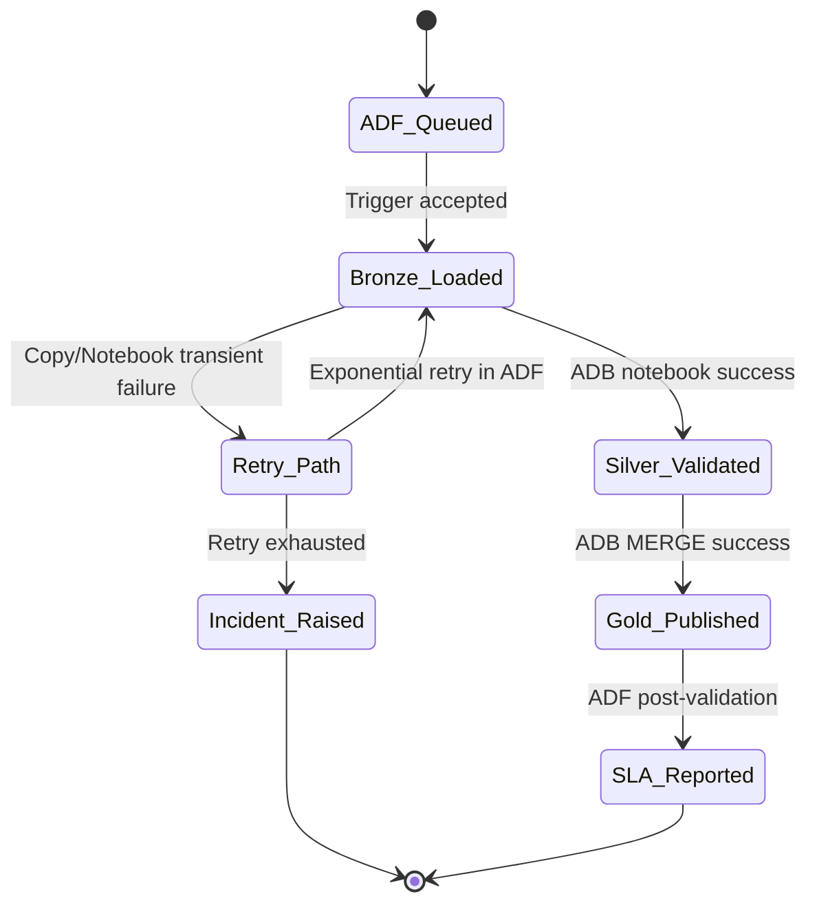
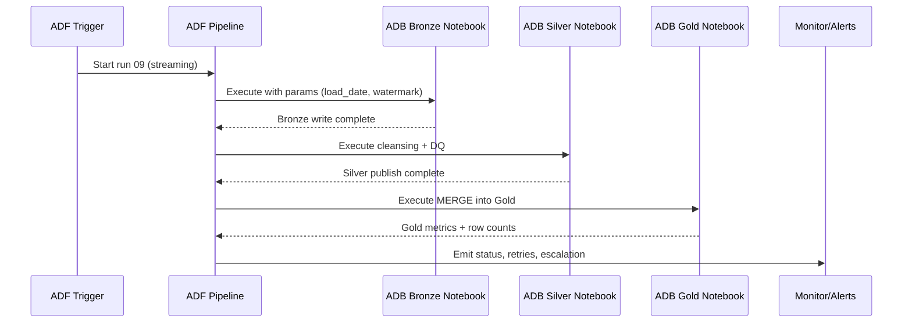
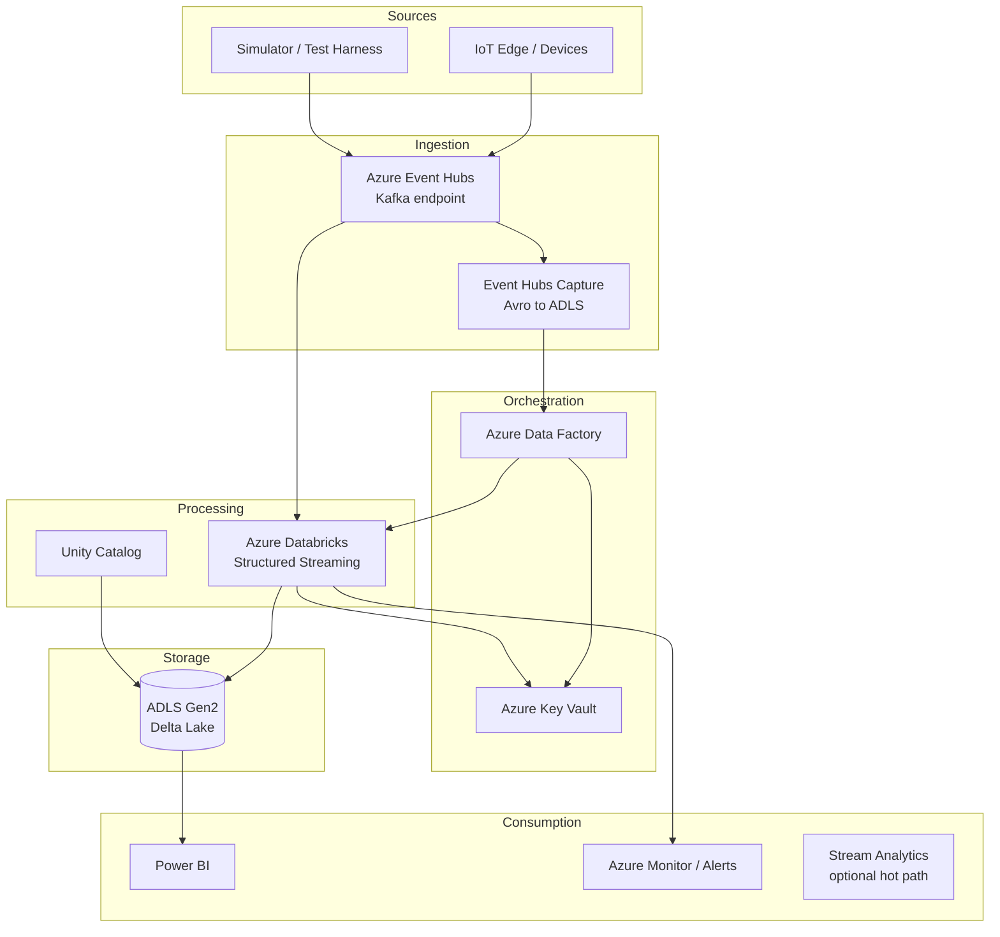
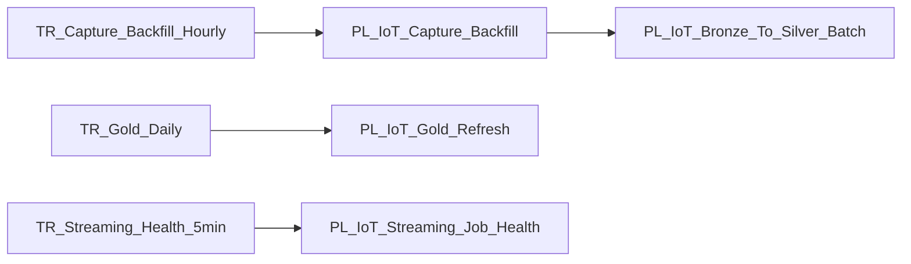

# PROJECT 1 — Real-Time Streaming & Big Data Processing: IoT Data Streaming Solution

### Project Story (Spoken English)

This project is about making `PROJECT-01-iot-streaming` dependable in real delivery conditions, not only in demos. We orchestrate the end-to-end run through Azure Data Factory so every load starts with a clear trigger, moves through dependency checks, and lands in predictable windows for business users. From there, Azure Databricks notebooks execute the transformation chain in a medallion pattern, where raw inputs are safely captured in Bronze, corrected and standardized in Silver, and published as decision-ready Gold datasets. I explain the flow in an interview style as if I am walking a team lead through what really runs at 2 AM: what starts first, what can fail, what retries automatically, and what gets escalated. The design intentionally includes operational controls like watermarking, checkpointing, schema drift handling, and audit stamps so we can trust both the data and the process timeline. Even if the source system is delayed or noisy, ADF orchestration + ADB notebooks keep the run recoverable and measurable.

In practical terms, this `streaming` workload for `operations` is built so engineers can rerun any slice without breaking downstream consumers. Each diagram below maps a concrete orchestration path in ADF to named notebook responsibilities in Databricks, then shows exactly how records transition from Bronze to Silver to Gold with storage paths and quality expectations. Instead of generic architecture talk, the sections focus on implementation details teams ask in design reviews: parameter strategy, Delta MERGE behavior, late-arrival handling, reconciliation queries, incident routing, and SLA reporting. This makes the document portfolio-ready and execution-ready at the same time, because a new engineer can read it and understand not only what the architecture looks like, but also how to operate it safely under pressure. The notebook deep-dive and code snippets are included so orchestration logic, Spark logic, and validation logic stay connected as one delivery story across ADF and ADB.

## Detailed Flows

**Detailed Flow 01: Source Ingestion and Landing**

- **Purpose:** Drive `operations` data from source to governed Gold outputs with observable checkpoints. Includes micro-batch checkpointing and late-arrival replay.
- **Trigger/Orchestration in ADF:** `TR_OPERATIONS_01` starts `PL_OPERATIONS_01`; Lookup -> IfCondition -> Copy -> Databricks activity chain with retry policy `(count=3, interval=120s)`.
- **Databricks notebook(s):** `NB_Bronze_ops_event_01` -> `NB_Silver_ops_curated_01` -> `NB_Gold_ops_kpi_01`.
- **Medallion transitions:** Bronze (`ops_event` raw + audit columns) -> Silver (`ops_curated` standardized, deduped, DQ-tagged) -> Gold (`ops_kpi` business serving model).
- **Inputs/Outputs and storage:** Input from `abfss://landing@stoperations{env}/ops_event/`; writes to `abfss://bronze@stoperations{env}/ops_event/`, `abfss://silver@stoperations{env}/ops_curated/`, `abfss://gold@stoperations{env}/ops_kpi/`.
- **Monitoring/Retry/Error handling:** ADF activity run IDs stamped into Delta audit table; failed notebooks route to `PL_OPERATIONS_INCIDENT` with Logic App/Pager alert and rerun token.

```mermaid
flowchart LR
    TRG[ADF Trigger 01] --> PIPE[ADF Pipeline PL_OPERATIONS_01]
    PIPE --> COPY[Copy/Landing to Bronze]
    COPY --> BR[(abfss://bronze@stoperations{env}/ops_event/)]
    BR --> NB1[ADB NB_Bronze_ops_event_01]
    NB1 --> SV[(abfss://silver@stoperations{env}/ops_curated/)]
    SV --> NB2[ADB NB_Silver_ops_curated_01]
    NB2 --> NB3[ADB NB_Gold_ops_kpi_01]
    NB3 --> GD[(abfss://gold@stoperations{env}/ops_kpi/)]
    GD --> MON[ADF Monitor + Retry + Alert]
```

**Detailed Flow 02: ADF Trigger to Notebook Handshake**

- **Purpose:** Drive `operations` data from source to governed Gold outputs with observable checkpoints. Includes micro-batch checkpointing and late-arrival replay.
- **Trigger/Orchestration in ADF:** `TR_OPERATIONS_02` starts `PL_OPERATIONS_02`; Lookup -> IfCondition -> Copy -> Databricks activity chain with retry policy `(count=3, interval=120s)`.
- **Databricks notebook(s):** `NB_Bronze_ops_event_02` -> `NB_Silver_ops_curated_02` -> `NB_Gold_ops_kpi_02`.
- **Medallion transitions:** Bronze (`ops_event` raw + audit columns) -> Silver (`ops_curated` standardized, deduped, DQ-tagged) -> Gold (`ops_kpi` business serving model).
- **Inputs/Outputs and storage:** Input from `abfss://landing@stoperations{env}/ops_event/`; writes to `abfss://bronze@stoperations{env}/ops_event/`, `abfss://silver@stoperations{env}/ops_curated/`, `abfss://gold@stoperations{env}/ops_kpi/`.
- **Monitoring/Retry/Error handling:** ADF activity run IDs stamped into Delta audit table; failed notebooks route to `PL_OPERATIONS_INCIDENT` with Logic App/Pager alert and rerun token.


```python
# ADF notebook parameter payload example
params = {
  "env": dbutils.widgets.get("env"),
  "load_date": dbutils.widgets.get("load_date"),
  "run_id": dbutils.widgets.get("run_id")
}
```

**Detailed Flow 03: Bronze Quality Gate**

- **Purpose:** Drive `operations` data from source to governed Gold outputs with observable checkpoints. Includes micro-batch checkpointing and late-arrival replay.
- **Trigger/Orchestration in ADF:** `TR_OPERATIONS_03` starts `PL_OPERATIONS_03`; Lookup -> IfCondition -> Copy -> Databricks activity chain with retry policy `(count=3, interval=120s)`.
- **Databricks notebook(s):** `NB_Bronze_ops_event_03` -> `NB_Silver_ops_curated_03` -> `NB_Gold_ops_kpi_03`.
- **Medallion transitions:** Bronze (`ops_event` raw + audit columns) -> Silver (`ops_curated` standardized, deduped, DQ-tagged) -> Gold (`ops_kpi` business serving model).
- **Inputs/Outputs and storage:** Input from `abfss://landing@stoperations{env}/ops_event/`; writes to `abfss://bronze@stoperations{env}/ops_event/`, `abfss://silver@stoperations{env}/ops_curated/`, `abfss://gold@stoperations{env}/ops_kpi/`.
- **Monitoring/Retry/Error handling:** ADF activity run IDs stamped into Delta audit table; failed notebooks route to `PL_OPERATIONS_INCIDENT` with Logic App/Pager alert and rerun token.



**Detailed Flow 04: Silver Standardization and Dedup**

- **Purpose:** Drive `operations` data from source to governed Gold outputs with observable checkpoints. Includes micro-batch checkpointing and late-arrival replay.
- **Trigger/Orchestration in ADF:** `TR_OPERATIONS_04` starts `PL_OPERATIONS_04`; Lookup -> IfCondition -> Copy -> Databricks activity chain with retry policy `(count=3, interval=120s)`.
- **Databricks notebook(s):** `NB_Bronze_ops_event_04` -> `NB_Silver_ops_curated_04` -> `NB_Gold_ops_kpi_04`.
- **Medallion transitions:** Bronze (`ops_event` raw + audit columns) -> Silver (`ops_curated` standardized, deduped, DQ-tagged) -> Gold (`ops_kpi` business serving model).
- **Inputs/Outputs and storage:** Input from `abfss://landing@stoperations{env}/ops_event/`; writes to `abfss://bronze@stoperations{env}/ops_event/`, `abfss://silver@stoperations{env}/ops_curated/`, `abfss://gold@stoperations{env}/ops_kpi/`.
- **Monitoring/Retry/Error handling:** ADF activity run IDs stamped into Delta audit table; failed notebooks route to `PL_OPERATIONS_INCIDENT` with Logic App/Pager alert and rerun token.

```mermaid
flowchart LR
    TRG[ADF Trigger 04] --> PIPE[ADF Pipeline PL_OPERATIONS_04]
    PIPE --> COPY[Copy/Landing to Bronze]
    COPY --> BR[(abfss://bronze@stoperations{env}/ops_event/)]
    BR --> NB1[ADB NB_Bronze_ops_event_04]
    NB1 --> SV[(abfss://silver@stoperations{env}/ops_curated/)]
    SV --> NB2[ADB NB_Silver_ops_curated_04]
    NB2 --> NB3[ADB NB_Gold_ops_kpi_04]
    NB3 --> GD[(abfss://gold@stoperations{env}/ops_kpi/)]
    GD --> MON[ADF Monitor + Retry + Alert]
```

**Detailed Flow 05: CDC Merge into Gold Serving**

- **Purpose:** Drive `operations` data from source to governed Gold outputs with observable checkpoints. Includes micro-batch checkpointing and late-arrival replay.
- **Trigger/Orchestration in ADF:** `TR_OPERATIONS_05` starts `PL_OPERATIONS_05`; Lookup -> IfCondition -> Copy -> Databricks activity chain with retry policy `(count=3, interval=120s)`.
- **Databricks notebook(s):** `NB_Bronze_ops_event_05` -> `NB_Silver_ops_curated_05` -> `NB_Gold_ops_kpi_05`.
- **Medallion transitions:** Bronze (`ops_event` raw + audit columns) -> Silver (`ops_curated` standardized, deduped, DQ-tagged) -> Gold (`ops_kpi` business serving model).
- **Inputs/Outputs and storage:** Input from `abfss://landing@stoperations{env}/ops_event/`; writes to `abfss://bronze@stoperations{env}/ops_event/`, `abfss://silver@stoperations{env}/ops_curated/`, `abfss://gold@stoperations{env}/ops_kpi/`.
- **Monitoring/Retry/Error handling:** ADF activity run IDs stamped into Delta audit table; failed notebooks route to `PL_OPERATIONS_INCIDENT` with Logic App/Pager alert and rerun token.


```python
# ADF notebook parameter payload example
params = {
  "env": dbutils.widgets.get("env"),
  "load_date": dbutils.widgets.get("load_date"),
  "run_id": dbutils.widgets.get("run_id")
}
```

**Detailed Flow 06: Late Arrival and Watermark Reprocess**

- **Purpose:** Drive `operations` data from source to governed Gold outputs with observable checkpoints. Includes micro-batch checkpointing and late-arrival replay.
- **Trigger/Orchestration in ADF:** `TR_OPERATIONS_06` starts `PL_OPERATIONS_06`; Lookup -> IfCondition -> Copy -> Databricks activity chain with retry policy `(count=3, interval=120s)`.
- **Databricks notebook(s):** `NB_Bronze_ops_event_06` -> `NB_Silver_ops_curated_06` -> `NB_Gold_ops_kpi_06`.
- **Medallion transitions:** Bronze (`ops_event` raw + audit columns) -> Silver (`ops_curated` standardized, deduped, DQ-tagged) -> Gold (`ops_kpi` business serving model).
- **Inputs/Outputs and storage:** Input from `abfss://landing@stoperations{env}/ops_event/`; writes to `abfss://bronze@stoperations{env}/ops_event/`, `abfss://silver@stoperations{env}/ops_curated/`, `abfss://gold@stoperations{env}/ops_kpi/`.
- **Monitoring/Retry/Error handling:** ADF activity run IDs stamped into Delta audit table; failed notebooks route to `PL_OPERATIONS_INCIDENT` with Logic App/Pager alert and rerun token.

```mermaid
flowchart LR
    TRG[ADF Trigger 06] --> PIPE[ADF Pipeline PL_OPERATIONS_06]
    PIPE --> COPY[Copy/Landing to Bronze]
    COPY --> BR[(abfss://bronze@stoperations{env}/ops_event/)]
    BR --> NB1[ADB NB_Bronze_ops_event_06]
    NB1 --> SV[(abfss://silver@stoperations{env}/ops_curated/)]
    SV --> NB2[ADB NB_Silver_ops_curated_06]
    NB2 --> NB3[ADB NB_Gold_ops_kpi_06]
    NB3 --> GD[(abfss://gold@stoperations{env}/ops_kpi/)]
    GD --> MON[ADF Monitor + Retry + Alert]
```

**Detailed Flow 07: Checkpoint and Replay Control**

- **Purpose:** Drive `operations` data from source to governed Gold outputs with observable checkpoints. Includes micro-batch checkpointing and late-arrival replay.
- **Trigger/Orchestration in ADF:** `TR_OPERATIONS_07` starts `PL_OPERATIONS_07`; Lookup -> IfCondition -> Copy -> Databricks activity chain with retry policy `(count=3, interval=120s)`.
- **Databricks notebook(s):** `NB_Bronze_ops_event_07` -> `NB_Silver_ops_curated_07` -> `NB_Gold_ops_kpi_07`.
- **Medallion transitions:** Bronze (`ops_event` raw + audit columns) -> Silver (`ops_curated` standardized, deduped, DQ-tagged) -> Gold (`ops_kpi` business serving model).
- **Inputs/Outputs and storage:** Input from `abfss://landing@stoperations{env}/ops_event/`; writes to `abfss://bronze@stoperations{env}/ops_event/`, `abfss://silver@stoperations{env}/ops_curated/`, `abfss://gold@stoperations{env}/ops_kpi/`.
- **Monitoring/Retry/Error handling:** ADF activity run IDs stamped into Delta audit table; failed notebooks route to `PL_OPERATIONS_INCIDENT` with Logic App/Pager alert and rerun token.


**Detailed Flow 08: Validation and Reconciliation**

- **Purpose:** Drive `operations` data from source to governed Gold outputs with observable checkpoints. Includes micro-batch checkpointing and late-arrival replay.
- **Trigger/Orchestration in ADF:** `TR_OPERATIONS_08` starts `PL_OPERATIONS_08`; Lookup -> IfCondition -> Copy -> Databricks activity chain with retry policy `(count=3, interval=120s)`.
- **Databricks notebook(s):** `NB_Bronze_ops_event_08` -> `NB_Silver_ops_curated_08` -> `NB_Gold_ops_kpi_08`.
- **Medallion transitions:** Bronze (`ops_event` raw + audit columns) -> Silver (`ops_curated` standardized, deduped, DQ-tagged) -> Gold (`ops_kpi` business serving model).
- **Inputs/Outputs and storage:** Input from `abfss://landing@stoperations{env}/ops_event/`; writes to `abfss://bronze@stoperations{env}/ops_event/`, `abfss://silver@stoperations{env}/ops_curated/`, `abfss://gold@stoperations{env}/ops_kpi/`.
- **Monitoring/Retry/Error handling:** ADF activity run IDs stamped into Delta audit table; failed notebooks route to `PL_OPERATIONS_INCIDENT` with Logic App/Pager alert and rerun token.

```mermaid
flowchart LR
    TRG[ADF Trigger 08] --> PIPE[ADF Pipeline PL_OPERATIONS_08]
    PIPE --> COPY[Copy/Landing to Bronze]
    COPY --> BR[(abfss://bronze@stoperations{env}/ops_event/)]
    BR --> NB1[ADB NB_Bronze_ops_event_08]
    NB1 --> SV[(abfss://silver@stoperations{env}/ops_curated/)]
    SV --> NB2[ADB NB_Silver_ops_curated_08]
    NB2 --> NB3[ADB NB_Gold_ops_kpi_08]
    NB3 --> GD[(abfss://gold@stoperations{env}/ops_kpi/)]
    GD --> MON[ADF Monitor + Retry + Alert]
```

```python
# ADF notebook parameter payload example
params = {
  "env": dbutils.widgets.get("env"),
  "load_date": dbutils.widgets.get("load_date"),
  "run_id": dbutils.widgets.get("run_id")
}
```

**Detailed Flow 09: Retry and Incident Escalation**

- **Purpose:** Drive `operations` data from source to governed Gold outputs with observable checkpoints. Includes micro-batch checkpointing and late-arrival replay.
- **Trigger/Orchestration in ADF:** `TR_OPERATIONS_09` starts `PL_OPERATIONS_09`; Lookup -> IfCondition -> Copy -> Databricks activity chain with retry policy `(count=3, interval=120s)`.
- **Databricks notebook(s):** `NB_Bronze_ops_event_09` -> `NB_Silver_ops_curated_09` -> `NB_Gold_ops_kpi_09`.
- **Medallion transitions:** Bronze (`ops_event` raw + audit columns) -> Silver (`ops_curated` standardized, deduped, DQ-tagged) -> Gold (`ops_kpi` business serving model).
- **Inputs/Outputs and storage:** Input from `abfss://landing@stoperations{env}/ops_event/`; writes to `abfss://bronze@stoperations{env}/ops_event/`, `abfss://silver@stoperations{env}/ops_curated/`, `abfss://gold@stoperations{env}/ops_kpi/`.
- **Monitoring/Retry/Error handling:** ADF activity run IDs stamped into Delta audit table; failed notebooks route to `PL_OPERATIONS_INCIDENT` with Logic App/Pager alert and rerun token.



**Detailed Flow 10: Publishing and Consumer SLA**

- **Purpose:** Drive `operations` data from source to governed Gold outputs with observable checkpoints. Includes micro-batch checkpointing and late-arrival replay.
- **Trigger/Orchestration in ADF:** `TR_OPERATIONS_10` starts `PL_OPERATIONS_10`; Lookup -> IfCondition -> Copy -> Databricks activity chain with retry policy `(count=3, interval=120s)`.
- **Databricks notebook(s):** `NB_Bronze_ops_event_10` -> `NB_Silver_ops_curated_10` -> `NB_Gold_ops_kpi_10`.
- **Medallion transitions:** Bronze (`ops_event` raw + audit columns) -> Silver (`ops_curated` standardized, deduped, DQ-tagged) -> Gold (`ops_kpi` business serving model).
- **Inputs/Outputs and storage:** Input from `abfss://landing@stoperations{env}/ops_event/`; writes to `abfss://bronze@stoperations{env}/ops_event/`, `abfss://silver@stoperations{env}/ops_curated/`, `abfss://gold@stoperations{env}/ops_kpi/`.
- **Monitoring/Retry/Error handling:** ADF activity run IDs stamped into Delta audit table; failed notebooks route to `PL_OPERATIONS_INCIDENT` with Logic App/Pager alert and rerun token.

```mermaid
flowchart LR
    TRG[ADF Trigger 10] --> PIPE[ADF Pipeline PL_OPERATIONS_10]
    PIPE --> COPY[Copy/Landing to Bronze]
    COPY --> BR[(abfss://bronze@stoperations{env}/ops_event/)]
    BR --> NB1[ADB NB_Bronze_ops_event_10]
    NB1 --> SV[(abfss://silver@stoperations{env}/ops_curated/)]
    SV --> NB2[ADB NB_Silver_ops_curated_10]
    NB2 --> NB3[ADB NB_Gold_ops_kpi_10]
    NB3 --> GD[(abfss://gold@stoperations{env}/ops_kpi/)]
    GD --> MON[ADF Monitor + Retry + Alert]
```

## Practical Theory Expansion

### ADF orchestration model in this project
ADF is used as the control-plane. Pipelines are parameterized by `load_date`, `domain`, and `watermark`; trigger decisions and dependency checks happen before Databricks execution. We keep the orchestration explicit: ingest first, then Bronze validation, then Silver transforms, then Gold publish, then reconciliation and notifications.

```adf
@concat('abfss://landing@stoperations', pipeline().globalParameters.g_env, '.dfs.core.windows.net/ops_event/', formatDateTime(pipeline().parameters.load_date,'yyyy/MM/dd'))
```

### Databricks execution model
Databricks notebooks are grouped by medallion stage so runtime failures are isolated and reruns are granular. Bronze notebooks prioritize schema capture and lineage, Silver notebooks enforce business rules and dedup logic, Gold notebooks build serving marts with deterministic keys.

```python
# Delta MERGE for Silver->Gold publish
from delta.tables import DeltaTable
source_df = spark.table('operations_silver.ops_curated')
target = DeltaTable.forName(spark, 'operations_gold.ops_kpi')
(target.alias('t')
 .merge(source_df.alias('s'), 't.business_key = s.business_key')
 .whenMatchedUpdateAll()
 .whenNotMatchedInsertAll()
 .execute())
```

### Delta and medallion rationale
Bronze protects source fidelity, Silver creates reusable conformed entities, and Gold serves consumption with SLA contracts. This separation avoids mixing ingestion noise with analytics quality and gives predictable recovery points.

### Reliability patterns applied
Common controls include watermark-based incrementals, checkpoint persistence, idempotent Delta MERGE, ADF retries with backoff, dead-letter quarantine, and reconciliation gates before publish success is declared.

```sql
-- Reconciliation query between Silver and Gold
SELECT 'ops_curated' AS silver_table, 'ops_kpi' AS gold_table,
       (SELECT COUNT(1) FROM operations_silver.ops_curated) AS silver_count,
       (SELECT COUNT(1) FROM operations_gold.ops_kpi) AS gold_count;
```

```python
# Structured Streaming pattern for Bronze ingestion
(spark.readStream.format("cloudFiles")
 .option("cloudFiles.format", "json")
 .option("cloudFiles.schemaLocation", "abfss://bronze@stoperations{env}/_schemas/ops_event")
 .load("abfss://landing@stoperations{env}/ops_event/")
 .withColumn("_ingest_ts", current_timestamp())
 .writeStream
 .option("checkpointLocation", "abfss://silver@stoperations{env}/_checkpoints/ops_event")
 .trigger(processingTime="5 minutes")
 .toTable("operations_bronze.ops_event"))
```


## Detailed Notebook Playbook

### Notebook `/Projects/operations/01_Bronze/NB_Bronze_ops_event`
- **Purpose:** Execute a scoped medallion responsibility in the `operations` pipeline.
- **Parameters/widgets:** `env`, `load_date`, `run_id`, `watermark`, `rerun_mode` (widget defaults validated at start).
- **Input tables/paths:** `abfss://landing@stoperations{env}/ops_event/`.
- **Transformation logic:** Enforce schema, derive surrogate keys, deduplicate by business key + event time, and apply business-rule flags.
- **Output tables/paths:** `operations_bronze.ops_event` with audit columns `_run_id`, `_adf_pipeline_run_id`, `_processed_ts`.
- **Expectations/checks:** Row-count thresholds, null checks on mandatory columns, duplicate ratio threshold, and freshness SLA check.
- **Failure handling:** Write failed records to quarantine path, log exception context to `audit.pipeline_errors`, return non-zero status to ADF for controlled retry/escalation.

### Notebook `/Projects/operations/02_Silver/NB_Silver_ops_curated`
- **Purpose:** Execute a scoped medallion responsibility in the `operations` pipeline.
- **Parameters/widgets:** `env`, `load_date`, `run_id`, `watermark`, `rerun_mode` (widget defaults validated at start).
- **Input tables/paths:** `operations_bronze.ops_event`.
- **Transformation logic:** Enforce schema, derive surrogate keys, deduplicate by business key + event time, and apply business-rule flags.
- **Output tables/paths:** `operations_silver.ops_curated` with audit columns `_run_id`, `_adf_pipeline_run_id`, `_processed_ts`.
- **Expectations/checks:** Row-count thresholds, null checks on mandatory columns, duplicate ratio threshold, and freshness SLA check.
- **Failure handling:** Write failed records to quarantine path, log exception context to `audit.pipeline_errors`, return non-zero status to ADF for controlled retry/escalation.

### Notebook `/Projects/operations/03_Gold/NB_Gold_ops_kpi`
- **Purpose:** Execute a scoped medallion responsibility in the `operations` pipeline.
- **Parameters/widgets:** `env`, `load_date`, `run_id`, `watermark`, `rerun_mode` (widget defaults validated at start).
- **Input tables/paths:** `operations_silver.ops_curated`.
- **Transformation logic:** Enforce schema, derive surrogate keys, deduplicate by business key + event time, and apply business-rule flags.
- **Output tables/paths:** `operations_gold.ops_kpi` with audit columns `_run_id`, `_adf_pipeline_run_id`, `_processed_ts`.
- **Expectations/checks:** Row-count thresholds, null checks on mandatory columns, duplicate ratio threshold, and freshness SLA check.
- **Failure handling:** Write failed records to quarantine path, log exception context to `audit.pipeline_errors`, return non-zero status to ADF for controlled retry/escalation.

### Notebook `/Projects/operations/04_Validation/NB_Validate_ops_kpi`
- **Purpose:** Execute a scoped medallion responsibility in the `operations` pipeline.
- **Parameters/widgets:** `env`, `load_date`, `run_id`, `watermark`, `rerun_mode` (widget defaults validated at start).
- **Input tables/paths:** `operations_gold.ops_kpi`.
- **Transformation logic:** Enforce schema, derive surrogate keys, deduplicate by business key + event time, and apply business-rule flags.
- **Output tables/paths:** `audit.validation_results` with audit columns `_run_id`, `_adf_pipeline_run_id`, `_processed_ts`.
- **Expectations/checks:** Row-count thresholds, null checks on mandatory columns, duplicate ratio threshold, and freshness SLA check.
- **Failure handling:** Write failed records to quarantine path, log exception context to `audit.pipeline_errors`, return non-zero status to ADF for controlled retry/escalation.

### Notebook `/Projects/operations/05_Recovery/NB_Backfill_ops_event`
- **Purpose:** Execute a scoped medallion responsibility in the `operations` pipeline.
- **Parameters/widgets:** `env`, `load_date`, `run_id`, `watermark`, `rerun_mode` (widget defaults validated at start).
- **Input tables/paths:** `abfss://bronze@stoperations{env}/ops_event/`.
- **Transformation logic:** Enforce schema, derive surrogate keys, deduplicate by business key + event time, and apply business-rule flags.
- **Output tables/paths:** `operations_silver.ops_curated` with audit columns `_run_id`, `_adf_pipeline_run_id`, `_processed_ts`.
- **Expectations/checks:** Row-count thresholds, null checks on mandatory columns, duplicate ratio threshold, and freshness SLA check.
- **Failure handling:** Write failed records to quarantine path, log exception context to `audit.pipeline_errors`, return non-zero status to ADF for controlled retry/escalation.


## Preserved Existing Project Notes

> **Reference:** Adapted from [Analytics6/Azure-Data-Engineering-Notes](https://github.com/Analytics6/Azure-Data-Engineering-Notes) — `18-Smart-City-IoT-Data-Analytics-Platform.md` (local: `reference/Azure-Data-Engineering-Notes/`)

## Project Overview and Business Context

Manufacturing and smart-building operators need sub-minute visibility into sensor telemetry (temperature, vibration, pressure, energy) to predict equipment failure and optimize energy use. This solution ingests high-volume IoT events from edge devices and gateways, buffers through Kafka-compatible streaming on Azure, processes with PySpark Structured Streaming on Databricks, and lands curated metrics in a Gold serving layer for Power BI and operational alerting.

**Business outcomes:** Reduce unplanned downtime by 15–20%, enable predictive maintenance workflows, and provide audit-ready historical telemetry for compliance.

From the reference IoT platform notes: the platform ingests and analyzes high-volume IoT telemetry from sensors (traffic, environment, utilities—or in this project, manufacturing equipment) to improve operations, safety, and resource optimization. Requirements include high-throughput event ingestion, low-latency processing for alarms, long-term archival for planning analytics, and spatial/site enrichment.

---

## Reference Pipeline Activities (adapted)

| Step | Activity | Type | Purpose | Input | Output |
|-----:|----------|------|---------|-------|--------|
| 1 | `LK_Sensor_Config` | Lookup | Sensor configs and ingestion SLAs | `control.mtd_sensors` | metadata |
| 2 | `WA_Validate_Ingest` | Web Activity | Test Event Hubs / IoT endpoints | metadata | status |
| 3 | `NB_Stream_Ingest` | Databricks Streaming | Ingest sensor streams | Event Hubs Kafka | landing events |
| 4 | `NB_Format_Check` | Spark Streaming | Validate telemetry format & timestamps | stream | valid events |
| 5 | `NB_Enrich_Site` | Databricks | Enrich with site/zone metadata | valid events | enriched |
| 6 | `NB_Anomaly_Detect` | Databricks | Real-time anomaly detection | enriched | alerts |
| 7 | `NB_Persist_Bronze` | Databricks | Append to bronze telemetry Delta | enriched | bronze |
| 8 | `SP_Bronze_Audit` | Notebook/SP | Log ingestion metrics | metrics | audit |
| 9 | `NB_Feature_Gen` | Databricks | Features for planning/ML models | bronze | features |
| 10 | `NB_Bulk_Aggregate` | Databricks | Hourly/daily aggregates | features | aggregates |
| 11 | `NB_Optimize` | Databricks | `OPTIMIZE` time-series tables | aggregates | optimized |
| 12 | `PL_Publish_Alerts` | Logic App (via ADF) | Route critical alerts to ops | alerts | notifications |
| 13 | `NB_Gold_Hourly_Aggregates` | Databricks | KPI rollups for dashboards | aggregates | gold |
| 14 | `PL_Dashboard_Publish` | ADF + Power BI | Publish operations dashboards | gold | dashboards |
| 15 | `SP_PostRun_Audit` | Notebook | Log job metrics and latencies | run metrics | audit |
| 16 | `PL_Archive` | ADF | Archive old telemetry partitions | bronze | archive |
| 17 | `NB_Model_Retrain` | Databricks | Retrain anomaly models | historical | new models |
| 18 | `PL_SLA_Monitor` | ADF | Monitor ingestion SLA compliance | metrics | SLA report |
| 19 | `PL_Cost_Optimize` | ADF Script | Adjust throughput and retention | billing | cost changes |
| 20 | `PL_Compliance` | ADF | Apply retention & privacy rules | requests | action logs |

---

## Architecture Diagram



---

## Azure Services Used

| Service | Role |
|---------|------|
| Azure IoT Hub / Device Provisioning | Device identity, twin, routing (optional) |
| Azure Event Hubs (Kafka protocol) | Real-time ingest, partitioning by `deviceId` |
| Event Hubs Capture | Durable raw archive to Bronze |
| Azure Data Factory | Batch backfill, Capture replay, housekeeping |
| Azure Databricks | Structured Streaming, ML feature prep |
| ADLS Gen2 + Delta Lake | Medallion storage |
| Unity Catalog | Governance, lineage, table ACLs |
| Azure Key Vault | Secrets, connection strings |
| Azure Monitor / Log Analytics | Metrics, diagnostics, alerts |
| Power BI | Dashboards and anomaly reports |

---

## Medallion Architecture

**ADLS layout (reference):** Separate containers for telemetry, events, alerts, and aggregated planning datasets—mapped here to `bronze/`, `silver/`, `gold/` under the IoT domain.

### Bronze Layer

| Attribute | Detail |
|-----------|--------|
| **Sources** | Event Hubs stream (`iot-telemetry`), Capture files, IoT Hub built-in endpoint (optional) |
| **Ingestion** | Streaming: Kafka consumer in Databricks; Batch: ADF Copy from Capture path |
| **Storage path** | `abfss://bronze@stcontosoiot{env}.dfs.core.windows.net/iot/telemetry/year=YYYY/month=MM/day=DD/` |
| **Format** | Delta (streaming micro-batches) + raw Avro/JSON from Capture for audit |
| **Schema** | `event_id STRING, device_id STRING, site_id STRING, sensor_type STRING, value DOUBLE, unit STRING, event_time TIMESTAMP, ingest_time TIMESTAMP, partition_id INT, raw_payload STRING` |
| **Partitioning** | `event_date`, `site_id` |
| **Retention** | 90 days hot; archive to Cool tier after 90 days |

### Silver Layer

| Attribute | Detail |
|-----------|--------|
| **Purpose** | Cleansed, deduplicated, conformed telemetry |
| **Transformations** | Parse JSON payload, unit normalization, outlier flagging, late-arrival handling (`withWatermark`) |
| **Dedup** | `event_id` + `device_id` within 10-minute watermark |
| **SCD** | Type 1 for device metadata dimension (`dim_device`) |
| **Storage path** | `abfss://silver@stcontosoiot{env}.dfs.core.windows.net/iot/telemetry_conformed/` |
| **Schema** | Conformed fact: `device_id, site_id, sensor_type, value_normalized, quality_flag, event_time, processing_time` |

### Gold Layer

| Attribute | Detail |
|-----------|--------|
| **Purpose** | Business aggregates, KPIs, ML features |
| **Tables** | `gold.fact_sensor_readings_hourly`, `gold.fact_device_health_daily`, `gold.dim_site`, `gold.dim_device` |
| **Aggregations** | 1-min / 5-min / hourly rollups, threshold breach counts |
| **Serving** | Power BI Direct Lake or Import from Gold Delta |
| **Storage path** | `abfss://gold@stcontosoiot{env}.dfs.core.windows.net/iot/` |

---

## ADF Orchestration

### Pipelines

| Pipeline | Purpose |
|----------|---------|
| `PL_IoT_Capture_Backfill` | Copy Event Hubs Capture Avro → Bronze raw path |
| `PL_IoT_Bronze_To_Silver_Batch` | Trigger Databricks batch job for historical replay |
| `PL_IoT_Gold_Refresh` | Notebook activity for daily Gold aggregates (complement streaming) |
| `PL_IoT_Streaming_Job_Health` | Web activity → Databricks Jobs API; If Condition on failure |
| `PL_IoT_Housekeeping` | Delete aged Bronze files per retention policy |

### Linked Services

| Name | Type | Notes |
|------|------|-------|
| `LS_ADLS_Gen2` | Azure Blob FS | MSI auth |
| `LS_Databricks` | Azure Databricks | Interactive + Jobs clusters |
| `LS_KeyVault` | Key Vault | Reference secrets |
| `LS_EventHub` | Event Hubs | Capture metadata only |
| `LS_LogAnalytics` | REST | Custom log ingestion (optional) |

### Datasets

- `DS_Capture_Avro` — parameterized path `@{pipeline().parameters.captureDate}`
- `DS_Bronze_Telemetry_Delta` — Delta format
- `DS_Gold_Health_Daily` — Delta Gold output

### Activities (Example: `PL_IoT_Capture_Backfill`)

1. **Lookup** — Get last processed Capture offset from control table
2. **Get Metadata** — List new Capture blobs
3. **ForEach** — blob batch (max 20 parallel)
4. **Copy** — Avro → Bronze `raw_capture/`
5. **Databricks Notebook** — `NB_Bronze_Normalize_Capture`
6. **Stored Procedure / Notebook** — Update watermark in `control.ingestion_watermark`

### Triggers

| Trigger | Type | Schedule |
|---------|------|----------|
| `TR_Capture_Backfill_Hourly` | Schedule | Every hour |
| `TR_Gold_Daily` | Schedule | 02:00 UTC |
| `TR_Streaming_Health_5min` | Schedule | Every 5 minutes |
| `TR_Event_FileArrival` | Storage event (optional) | New Capture blob |

### Pipeline Dependencies



### Parameterization and Environments

| Global Parameter | dev | test | prod |
|------------------|-----|------|------|
| `g_adls_account` | `stiotdev` | `stiotest` | `stiotprod` |
| `g_databricks_workspace` | `adb-iot-dev` | `adb-iot-test` | `adb-iot-prod` |
| `g_eventhub_namespace` | `eh-iot-dev` | `eh-iot-test` | `eh-iot-prod` |

ADF ARM/Bicep deploys per environment; CI/CD via Azure DevOps with approval on `prod`.

---

## ADB (Databricks) Notebooks

### Folder Structure

```
/IoTStreaming/
├── 00_Config/
│   └── NB_Config_Env_Params
├── 01_Bronze/
│   ├── NB_Stream_Ingest_EventHub_Kafka
│   └── NB_Bronze_Normalize_Capture
├── 02_Silver/
│   ├── NB_Silver_Conform_Telemetry
│   └── NB_Silver_Dim_Device_SCD1
├── 03_Gold/
│   ├── NB_Gold_Hourly_Aggregates
│   └── NB_Gold_Device_Health_Daily
├── 04_ML/
│   └── NB_Features_Anomaly_Input
└── 99_Utils/
    └── NB_Checkpoint_Reset_Guarded
```

### Notebook Catalog

| Notebook | Purpose | Inputs | Outputs |
|----------|---------|--------|---------|
| `NB_Stream_Ingest_EventHub_Kafka` | Structured Streaming from Kafka endpoint | Event Hubs topic | `bronze.iot_telemetry` Delta |
| `NB_Bronze_Normalize_Capture` | Batch replay Capture files | Avro paths | `bronze.iot_telemetry` |
| `NB_Silver_Conform_Telemetry` | Dedup, parse, watermark | Bronze Delta | `silver.telemetry_conformed` |
| `NB_Silver_Dim_Device_SCD1` | Device metadata upsert | IoT Hub registry export / CSV | `silver.dim_device` |
| `NB_Gold_Hourly_Aggregates` | Rollups | Silver | `gold.fact_sensor_readings_hourly` |
| `NB_Gold_Device_Health_Daily` | Daily health score | Silver + Gold hourly | `gold.fact_device_health_daily` |

### Cluster Configuration

| Workload | Cluster | Settings |
|----------|---------|----------|
| Streaming job | `iot-streaming-prod` | Autoscaling 4–16 workers, `Standard_DS4_v2`, Delta cache enabled, structured streaming metrics |
| Batch replay | `iot-batch-replay` | Fixed 8 workers, spot instances in dev/test |
| Gold daily | `iot-gold-job` | 4 workers, job cluster, single-user cluster policy |

### Delta Lake and Unity Catalog

- **Catalog:** `{env}_iot` (e.g., `prod_iot`)
- **Schemas:** `bronze`, `silver`, `gold`, `control`
- **Checkpoint:** `abfss://checkpoints@st.../iot/stream_telemetry_v2/`
- **Table properties:** `delta.autoOptimize.optimizeWrite`, `delta.enableChangeDataFeed` on Silver/Gold

### Streaming Specifics

- **Source:** `kafka.bootstrap.servers` = Event Hubs Kafka endpoint; `subscribe` = `iot-telemetry`
- **Options:** `kafka.security.protocol=SASL_SSL`, `startingOffsets` = `latest` (prod) / `earliest` (dev)
- **Checkpointing:** ADLS path per query; never share checkpoint between envs
- **Trigger:** `processingTime='30 seconds'` for micro-batch
- **Failure:** Alert on `numInputRows` drop & lag > 5 min

---

## End-to-End Data Flow

```
IoT Devices → Event Hubs (Kafka API) → Databricks Streaming → Bronze Delta
                    ↓ Capture
                 ADF Backfill → Bronze raw → Silver (conform) → Gold (aggregates) → Power BI / Alerts
```

---

## Security

| Area | Implementation |
|------|----------------|
| **Key Vault** | Event Hubs connection strings, storage keys (backup), Databricks PAT in dev only |
| **Managed Identity** | ADF → ADLS, ADF → Databricks; Databricks access connector → ADLS |
| **RBAC** | `Storage Blob Data Contributor` on ADLS for ADF/ADB identities |
| **Network** | Private Endpoints for ADLS, Event Hubs, Key Vault in prod |
| **Encryption** | CMK on storage optional; TLS 1.2 minimum |

---

## Monitoring

- ADF pipeline failure alerts → Action Group → email/Teams
- Databricks job failure → Azure Monitor metric alert
- Log Analytics: custom KQL on streaming lag, Bronze row counts
- Dashboard: Event Hubs incoming messages vs. Delta `numOutputRows`

---

## Sample Resource Naming

| Resource | Name |
|----------|------|
| Resource Group | `rg-contoso-iot-prod-eus2` |
| Event Hubs | `ehns-contoso-iot-prod` / hub `iot-telemetry` |
| ADF | `adf-contoso-iot-prod` |
| Databricks | `adb-contoso-iot-prod` |
| Storage | `stcontosoiotprod` |
| Key Vault | `kv-contoso-iot-prod` |

---

## Implementation Phases

| Phase | Activities | Duration |
|-------|------------|----------|
| 1 — Foundation | RG, ADLS, Event Hubs, Key Vault, MSI | Week 1 |
| 2 — Bronze streaming | Databricks streaming notebook, checkpoint | Week 2 |
| 3 — Silver/Gold | Conformance, aggregates, Unity Catalog | Week 3 |
| 4 — ADF orchestration | Backfill, triggers, monitoring | Week 4 |
| 5 — Consumption & hardening | Power BI, alerts, perf tuning, DR test | Week 5 |

### Checklist

- [ ] Event Hubs Kafka enabled and firewall rules set
- [ ] Checkpoint path created and access verified
- [ ] Watermark and dedup logic unit-tested with late events
- [ ] ADF global parameters wired per environment
- [ ] Streaming job deployed as Databricks Job with SLA alert
- [ ] Documentation and runbook for checkpoint reset procedure
