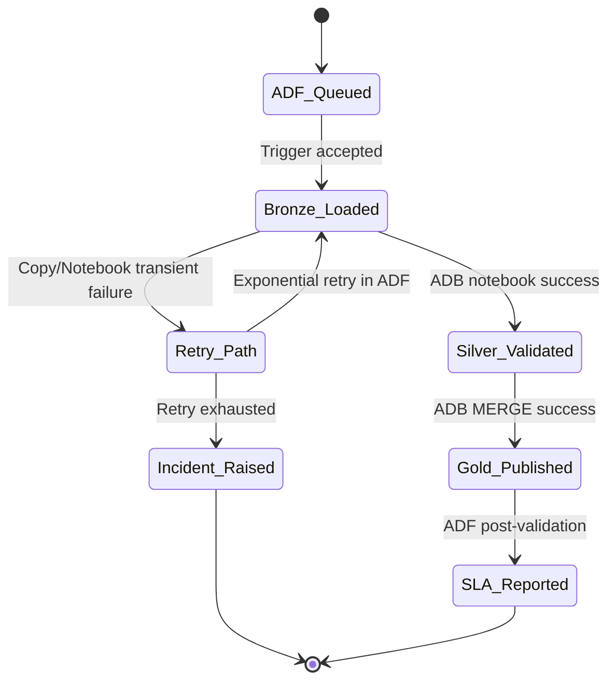
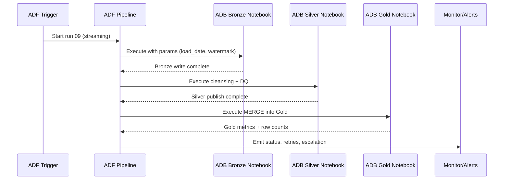
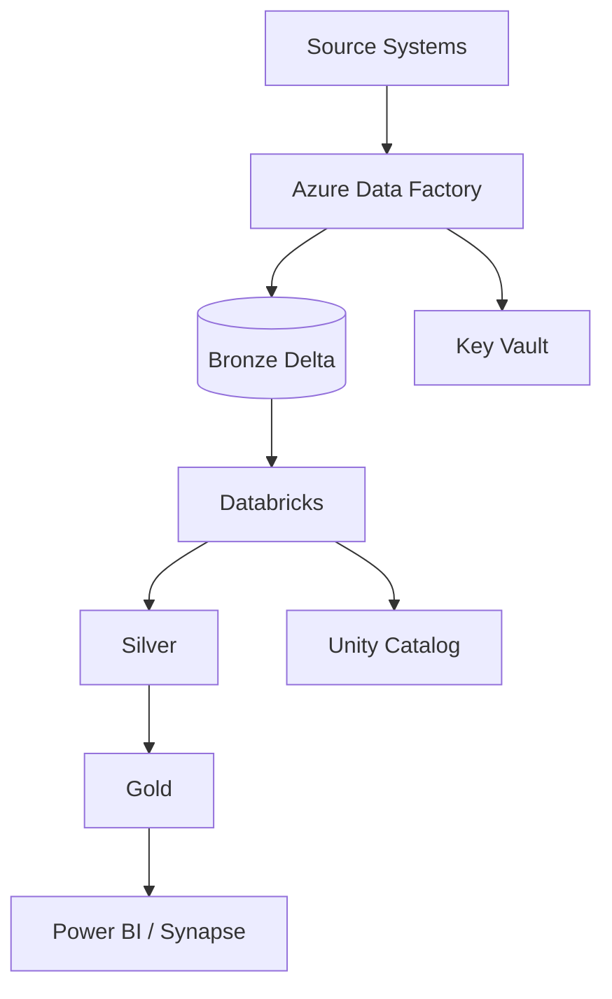

# Real-Time Retail Inventory & Supply Chain Monitoring (Manasa)

### Project Story (Spoken English)

This project is about making `manasa-01-realtime-inventory-supply-chain` dependable in real delivery conditions, not only in demos. We orchestrate the end-to-end run through Azure Data Factory so every load starts with a clear trigger, moves through dependency checks, and lands in predictable windows for business users. From there, Azure Databricks notebooks execute the transformation chain in a medallion pattern, where raw inputs are safely captured in Bronze, corrected and standardized in Silver, and published as decision-ready Gold datasets. I explain the flow in an interview style as if I am walking a team lead through what really runs at 2 AM: what starts first, what can fail, what retries automatically, and what gets escalated. The design intentionally includes operational controls like watermarking, checkpointing, schema drift handling, and audit stamps so we can trust both the data and the process timeline. Even if the source system is delayed or noisy, ADF orchestration + ADB notebooks keep the run recoverable and measurable.

In practical terms, this `streaming` workload for `inventory` is built so engineers can rerun any slice without breaking downstream consumers. Each diagram below maps a concrete orchestration path in ADF to named notebook responsibilities in Databricks, then shows exactly how records transition from Bronze to Silver to Gold with storage paths and quality expectations. Instead of generic architecture talk, the sections focus on implementation details teams ask in design reviews: parameter strategy, Delta MERGE behavior, late-arrival handling, reconciliation queries, incident routing, and SLA reporting. This makes the document portfolio-ready and execution-ready at the same time, because a new engineer can read it and understand not only what the architecture looks like, but also how to operate it safely under pressure. The notebook deep-dive and code snippets are included so orchestration logic, Spark logic, and validation logic stay connected as one delivery story across ADF and ADB.

## Detailed Flows

**Detailed Flow 01: Source Ingestion and Landing**

- **Purpose:** Drive `inventory` data from source to governed Gold outputs with observable checkpoints. Includes micro-batch checkpointing and late-arrival replay.
- **Trigger/Orchestration in ADF:** `TR_INVENTORY_01` starts `PL_INVENTORY_01`; Lookup -> IfCondition -> Copy -> Databricks activity chain with retry policy `(count=3, interval=120s)`.
- **Databricks notebook(s):** `NB_Bronze_inventory_event_01` -> `NB_Silver_inventory_position_01` -> `NB_Gold_stockout_risk_01`.
- **Medallion transitions:** Bronze (`inventory_event` raw + audit columns) -> Silver (`inventory_position` standardized, deduped, DQ-tagged) -> Gold (`stockout_risk` business serving model).
- **Inputs/Outputs and storage:** Input from `abfss://landing@stinventory{env}/inventory_event/`; writes to `abfss://bronze@stinventory{env}/inventory_event/`, `abfss://silver@stinventory{env}/inventory_position/`, `abfss://gold@stinventory{env}/stockout_risk/`.
- **Monitoring/Retry/Error handling:** ADF activity run IDs stamped into Delta audit table; failed notebooks route to `PL_INVENTORY_INCIDENT` with Logic App/Pager alert and rerun token.

```mermaid
flowchart LR
    TRG[ADF Trigger 01] --> PIPE[ADF Pipeline PL_INVENTORY_01]
    PIPE --> COPY[Copy/Landing to Bronze]
    COPY --> BR[(abfss://bronze@stinventory{env}/inventory_event/)]
    BR --> NB1[ADB NB_Bronze_inventory_event_01]
    NB1 --> SV[(abfss://silver@stinventory{env}/inventory_position/)]
    SV --> NB2[ADB NB_Silver_inventory_position_01]
    NB2 --> NB3[ADB NB_Gold_stockout_risk_01]
    NB3 --> GD[(abfss://gold@stinventory{env}/stockout_risk/)]
    GD --> MON[ADF Monitor + Retry + Alert]
```

**Detailed Flow 02: ADF Trigger to Notebook Handshake**

- **Purpose:** Drive `inventory` data from source to governed Gold outputs with observable checkpoints. Includes micro-batch checkpointing and late-arrival replay.
- **Trigger/Orchestration in ADF:** `TR_INVENTORY_02` starts `PL_INVENTORY_02`; Lookup -> IfCondition -> Copy -> Databricks activity chain with retry policy `(count=3, interval=120s)`.
- **Databricks notebook(s):** `NB_Bronze_inventory_event_02` -> `NB_Silver_inventory_position_02` -> `NB_Gold_stockout_risk_02`.
- **Medallion transitions:** Bronze (`inventory_event` raw + audit columns) -> Silver (`inventory_position` standardized, deduped, DQ-tagged) -> Gold (`stockout_risk` business serving model).
- **Inputs/Outputs and storage:** Input from `abfss://landing@stinventory{env}/inventory_event/`; writes to `abfss://bronze@stinventory{env}/inventory_event/`, `abfss://silver@stinventory{env}/inventory_position/`, `abfss://gold@stinventory{env}/stockout_risk/`.
- **Monitoring/Retry/Error handling:** ADF activity run IDs stamped into Delta audit table; failed notebooks route to `PL_INVENTORY_INCIDENT` with Logic App/Pager alert and rerun token.


```python
# ADF notebook parameter payload example
params = {
  "env": dbutils.widgets.get("env"),
  "load_date": dbutils.widgets.get("load_date"),
  "run_id": dbutils.widgets.get("run_id")
}
```

**Detailed Flow 03: Bronze Quality Gate**

- **Purpose:** Drive `inventory` data from source to governed Gold outputs with observable checkpoints. Includes micro-batch checkpointing and late-arrival replay.
- **Trigger/Orchestration in ADF:** `TR_INVENTORY_03` starts `PL_INVENTORY_03`; Lookup -> IfCondition -> Copy -> Databricks activity chain with retry policy `(count=3, interval=120s)`.
- **Databricks notebook(s):** `NB_Bronze_inventory_event_03` -> `NB_Silver_inventory_position_03` -> `NB_Gold_stockout_risk_03`.
- **Medallion transitions:** Bronze (`inventory_event` raw + audit columns) -> Silver (`inventory_position` standardized, deduped, DQ-tagged) -> Gold (`stockout_risk` business serving model).
- **Inputs/Outputs and storage:** Input from `abfss://landing@stinventory{env}/inventory_event/`; writes to `abfss://bronze@stinventory{env}/inventory_event/`, `abfss://silver@stinventory{env}/inventory_position/`, `abfss://gold@stinventory{env}/stockout_risk/`.
- **Monitoring/Retry/Error handling:** ADF activity run IDs stamped into Delta audit table; failed notebooks route to `PL_INVENTORY_INCIDENT` with Logic App/Pager alert and rerun token.



**Detailed Flow 04: Silver Standardization and Dedup**

- **Purpose:** Drive `inventory` data from source to governed Gold outputs with observable checkpoints. Includes micro-batch checkpointing and late-arrival replay.
- **Trigger/Orchestration in ADF:** `TR_INVENTORY_04` starts `PL_INVENTORY_04`; Lookup -> IfCondition -> Copy -> Databricks activity chain with retry policy `(count=3, interval=120s)`.
- **Databricks notebook(s):** `NB_Bronze_inventory_event_04` -> `NB_Silver_inventory_position_04` -> `NB_Gold_stockout_risk_04`.
- **Medallion transitions:** Bronze (`inventory_event` raw + audit columns) -> Silver (`inventory_position` standardized, deduped, DQ-tagged) -> Gold (`stockout_risk` business serving model).
- **Inputs/Outputs and storage:** Input from `abfss://landing@stinventory{env}/inventory_event/`; writes to `abfss://bronze@stinventory{env}/inventory_event/`, `abfss://silver@stinventory{env}/inventory_position/`, `abfss://gold@stinventory{env}/stockout_risk/`.
- **Monitoring/Retry/Error handling:** ADF activity run IDs stamped into Delta audit table; failed notebooks route to `PL_INVENTORY_INCIDENT` with Logic App/Pager alert and rerun token.

```mermaid
flowchart LR
    TRG[ADF Trigger 04] --> PIPE[ADF Pipeline PL_INVENTORY_04]
    PIPE --> COPY[Copy/Landing to Bronze]
    COPY --> BR[(abfss://bronze@stinventory{env}/inventory_event/)]
    BR --> NB1[ADB NB_Bronze_inventory_event_04]
    NB1 --> SV[(abfss://silver@stinventory{env}/inventory_position/)]
    SV --> NB2[ADB NB_Silver_inventory_position_04]
    NB2 --> NB3[ADB NB_Gold_stockout_risk_04]
    NB3 --> GD[(abfss://gold@stinventory{env}/stockout_risk/)]
    GD --> MON[ADF Monitor + Retry + Alert]
```

**Detailed Flow 05: CDC Merge into Gold Serving**

- **Purpose:** Drive `inventory` data from source to governed Gold outputs with observable checkpoints. Includes micro-batch checkpointing and late-arrival replay.
- **Trigger/Orchestration in ADF:** `TR_INVENTORY_05` starts `PL_INVENTORY_05`; Lookup -> IfCondition -> Copy -> Databricks activity chain with retry policy `(count=3, interval=120s)`.
- **Databricks notebook(s):** `NB_Bronze_inventory_event_05` -> `NB_Silver_inventory_position_05` -> `NB_Gold_stockout_risk_05`.
- **Medallion transitions:** Bronze (`inventory_event` raw + audit columns) -> Silver (`inventory_position` standardized, deduped, DQ-tagged) -> Gold (`stockout_risk` business serving model).
- **Inputs/Outputs and storage:** Input from `abfss://landing@stinventory{env}/inventory_event/`; writes to `abfss://bronze@stinventory{env}/inventory_event/`, `abfss://silver@stinventory{env}/inventory_position/`, `abfss://gold@stinventory{env}/stockout_risk/`.
- **Monitoring/Retry/Error handling:** ADF activity run IDs stamped into Delta audit table; failed notebooks route to `PL_INVENTORY_INCIDENT` with Logic App/Pager alert and rerun token.


```python
# ADF notebook parameter payload example
params = {
  "env": dbutils.widgets.get("env"),
  "load_date": dbutils.widgets.get("load_date"),
  "run_id": dbutils.widgets.get("run_id")
}
```

**Detailed Flow 06: Late Arrival and Watermark Reprocess**

- **Purpose:** Drive `inventory` data from source to governed Gold outputs with observable checkpoints. Includes micro-batch checkpointing and late-arrival replay.
- **Trigger/Orchestration in ADF:** `TR_INVENTORY_06` starts `PL_INVENTORY_06`; Lookup -> IfCondition -> Copy -> Databricks activity chain with retry policy `(count=3, interval=120s)`.
- **Databricks notebook(s):** `NB_Bronze_inventory_event_06` -> `NB_Silver_inventory_position_06` -> `NB_Gold_stockout_risk_06`.
- **Medallion transitions:** Bronze (`inventory_event` raw + audit columns) -> Silver (`inventory_position` standardized, deduped, DQ-tagged) -> Gold (`stockout_risk` business serving model).
- **Inputs/Outputs and storage:** Input from `abfss://landing@stinventory{env}/inventory_event/`; writes to `abfss://bronze@stinventory{env}/inventory_event/`, `abfss://silver@stinventory{env}/inventory_position/`, `abfss://gold@stinventory{env}/stockout_risk/`.
- **Monitoring/Retry/Error handling:** ADF activity run IDs stamped into Delta audit table; failed notebooks route to `PL_INVENTORY_INCIDENT` with Logic App/Pager alert and rerun token.

```mermaid
flowchart LR
    TRG[ADF Trigger 06] --> PIPE[ADF Pipeline PL_INVENTORY_06]
    PIPE --> COPY[Copy/Landing to Bronze]
    COPY --> BR[(abfss://bronze@stinventory{env}/inventory_event/)]
    BR --> NB1[ADB NB_Bronze_inventory_event_06]
    NB1 --> SV[(abfss://silver@stinventory{env}/inventory_position/)]
    SV --> NB2[ADB NB_Silver_inventory_position_06]
    NB2 --> NB3[ADB NB_Gold_stockout_risk_06]
    NB3 --> GD[(abfss://gold@stinventory{env}/stockout_risk/)]
    GD --> MON[ADF Monitor + Retry + Alert]
```

**Detailed Flow 07: Checkpoint and Replay Control**

- **Purpose:** Drive `inventory` data from source to governed Gold outputs with observable checkpoints. Includes micro-batch checkpointing and late-arrival replay.
- **Trigger/Orchestration in ADF:** `TR_INVENTORY_07` starts `PL_INVENTORY_07`; Lookup -> IfCondition -> Copy -> Databricks activity chain with retry policy `(count=3, interval=120s)`.
- **Databricks notebook(s):** `NB_Bronze_inventory_event_07` -> `NB_Silver_inventory_position_07` -> `NB_Gold_stockout_risk_07`.
- **Medallion transitions:** Bronze (`inventory_event` raw + audit columns) -> Silver (`inventory_position` standardized, deduped, DQ-tagged) -> Gold (`stockout_risk` business serving model).
- **Inputs/Outputs and storage:** Input from `abfss://landing@stinventory{env}/inventory_event/`; writes to `abfss://bronze@stinventory{env}/inventory_event/`, `abfss://silver@stinventory{env}/inventory_position/`, `abfss://gold@stinventory{env}/stockout_risk/`.
- **Monitoring/Retry/Error handling:** ADF activity run IDs stamped into Delta audit table; failed notebooks route to `PL_INVENTORY_INCIDENT` with Logic App/Pager alert and rerun token.


**Detailed Flow 08: Validation and Reconciliation**

- **Purpose:** Drive `inventory` data from source to governed Gold outputs with observable checkpoints. Includes micro-batch checkpointing and late-arrival replay.
- **Trigger/Orchestration in ADF:** `TR_INVENTORY_08` starts `PL_INVENTORY_08`; Lookup -> IfCondition -> Copy -> Databricks activity chain with retry policy `(count=3, interval=120s)`.
- **Databricks notebook(s):** `NB_Bronze_inventory_event_08` -> `NB_Silver_inventory_position_08` -> `NB_Gold_stockout_risk_08`.
- **Medallion transitions:** Bronze (`inventory_event` raw + audit columns) -> Silver (`inventory_position` standardized, deduped, DQ-tagged) -> Gold (`stockout_risk` business serving model).
- **Inputs/Outputs and storage:** Input from `abfss://landing@stinventory{env}/inventory_event/`; writes to `abfss://bronze@stinventory{env}/inventory_event/`, `abfss://silver@stinventory{env}/inventory_position/`, `abfss://gold@stinventory{env}/stockout_risk/`.
- **Monitoring/Retry/Error handling:** ADF activity run IDs stamped into Delta audit table; failed notebooks route to `PL_INVENTORY_INCIDENT` with Logic App/Pager alert and rerun token.

```mermaid
flowchart LR
    TRG[ADF Trigger 08] --> PIPE[ADF Pipeline PL_INVENTORY_08]
    PIPE --> COPY[Copy/Landing to Bronze]
    COPY --> BR[(abfss://bronze@stinventory{env}/inventory_event/)]
    BR --> NB1[ADB NB_Bronze_inventory_event_08]
    NB1 --> SV[(abfss://silver@stinventory{env}/inventory_position/)]
    SV --> NB2[ADB NB_Silver_inventory_position_08]
    NB2 --> NB3[ADB NB_Gold_stockout_risk_08]
    NB3 --> GD[(abfss://gold@stinventory{env}/stockout_risk/)]
    GD --> MON[ADF Monitor + Retry + Alert]
```

```python
# ADF notebook parameter payload example
params = {
  "env": dbutils.widgets.get("env"),
  "load_date": dbutils.widgets.get("load_date"),
  "run_id": dbutils.widgets.get("run_id")
}
```

**Detailed Flow 09: Retry and Incident Escalation**

- **Purpose:** Drive `inventory` data from source to governed Gold outputs with observable checkpoints. Includes micro-batch checkpointing and late-arrival replay.
- **Trigger/Orchestration in ADF:** `TR_INVENTORY_09` starts `PL_INVENTORY_09`; Lookup -> IfCondition -> Copy -> Databricks activity chain with retry policy `(count=3, interval=120s)`.
- **Databricks notebook(s):** `NB_Bronze_inventory_event_09` -> `NB_Silver_inventory_position_09` -> `NB_Gold_stockout_risk_09`.
- **Medallion transitions:** Bronze (`inventory_event` raw + audit columns) -> Silver (`inventory_position` standardized, deduped, DQ-tagged) -> Gold (`stockout_risk` business serving model).
- **Inputs/Outputs and storage:** Input from `abfss://landing@stinventory{env}/inventory_event/`; writes to `abfss://bronze@stinventory{env}/inventory_event/`, `abfss://silver@stinventory{env}/inventory_position/`, `abfss://gold@stinventory{env}/stockout_risk/`.
- **Monitoring/Retry/Error handling:** ADF activity run IDs stamped into Delta audit table; failed notebooks route to `PL_INVENTORY_INCIDENT` with Logic App/Pager alert and rerun token.



**Detailed Flow 10: Publishing and Consumer SLA**

- **Purpose:** Drive `inventory` data from source to governed Gold outputs with observable checkpoints. Includes micro-batch checkpointing and late-arrival replay.
- **Trigger/Orchestration in ADF:** `TR_INVENTORY_10` starts `PL_INVENTORY_10`; Lookup -> IfCondition -> Copy -> Databricks activity chain with retry policy `(count=3, interval=120s)`.
- **Databricks notebook(s):** `NB_Bronze_inventory_event_10` -> `NB_Silver_inventory_position_10` -> `NB_Gold_stockout_risk_10`.
- **Medallion transitions:** Bronze (`inventory_event` raw + audit columns) -> Silver (`inventory_position` standardized, deduped, DQ-tagged) -> Gold (`stockout_risk` business serving model).
- **Inputs/Outputs and storage:** Input from `abfss://landing@stinventory{env}/inventory_event/`; writes to `abfss://bronze@stinventory{env}/inventory_event/`, `abfss://silver@stinventory{env}/inventory_position/`, `abfss://gold@stinventory{env}/stockout_risk/`.
- **Monitoring/Retry/Error handling:** ADF activity run IDs stamped into Delta audit table; failed notebooks route to `PL_INVENTORY_INCIDENT` with Logic App/Pager alert and rerun token.

```mermaid
flowchart LR
    TRG[ADF Trigger 10] --> PIPE[ADF Pipeline PL_INVENTORY_10]
    PIPE --> COPY[Copy/Landing to Bronze]
    COPY --> BR[(abfss://bronze@stinventory{env}/inventory_event/)]
    BR --> NB1[ADB NB_Bronze_inventory_event_10]
    NB1 --> SV[(abfss://silver@stinventory{env}/inventory_position/)]
    SV --> NB2[ADB NB_Silver_inventory_position_10]
    NB2 --> NB3[ADB NB_Gold_stockout_risk_10]
    NB3 --> GD[(abfss://gold@stinventory{env}/stockout_risk/)]
    GD --> MON[ADF Monitor + Retry + Alert]
```

## Practical Theory Expansion

### ADF orchestration model in this project
ADF is used as the control-plane. Pipelines are parameterized by `load_date`, `domain`, and `watermark`; trigger decisions and dependency checks happen before Databricks execution. We keep the orchestration explicit: ingest first, then Bronze validation, then Silver transforms, then Gold publish, then reconciliation and notifications.

```adf
@concat('abfss://landing@stinventory', pipeline().globalParameters.g_env, '.dfs.core.windows.net/inventory_event/', formatDateTime(pipeline().parameters.load_date,'yyyy/MM/dd'))
```

### Databricks execution model
Databricks notebooks are grouped by medallion stage so runtime failures are isolated and reruns are granular. Bronze notebooks prioritize schema capture and lineage, Silver notebooks enforce business rules and dedup logic, Gold notebooks build serving marts with deterministic keys.

```python
# Delta MERGE for Silver->Gold publish
from delta.tables import DeltaTable
source_df = spark.table('inventory_silver.inventory_position')
target = DeltaTable.forName(spark, 'inventory_gold.stockout_risk')
(target.alias('t')
 .merge(source_df.alias('s'), 't.business_key = s.business_key')
 .whenMatchedUpdateAll()
 .whenNotMatchedInsertAll()
 .execute())
```

### Delta and medallion rationale
Bronze protects source fidelity, Silver creates reusable conformed entities, and Gold serves consumption with SLA contracts. This separation avoids mixing ingestion noise with analytics quality and gives predictable recovery points.

### Reliability patterns applied
Common controls include watermark-based incrementals, checkpoint persistence, idempotent Delta MERGE, ADF retries with backoff, dead-letter quarantine, and reconciliation gates before publish success is declared.

```sql
-- Reconciliation query between Silver and Gold
SELECT 'inventory_position' AS silver_table, 'stockout_risk' AS gold_table,
       (SELECT COUNT(1) FROM inventory_silver.inventory_position) AS silver_count,
       (SELECT COUNT(1) FROM inventory_gold.stockout_risk) AS gold_count;
```

```python
# Structured Streaming pattern for Bronze ingestion
(spark.readStream.format("cloudFiles")
 .option("cloudFiles.format", "json")
 .option("cloudFiles.schemaLocation", "abfss://bronze@stinventory{env}/_schemas/inventory_event")
 .load("abfss://landing@stinventory{env}/inventory_event/")
 .withColumn("_ingest_ts", current_timestamp())
 .writeStream
 .option("checkpointLocation", "abfss://silver@stinventory{env}/_checkpoints/inventory_event")
 .trigger(processingTime="5 minutes")
 .toTable("inventory_bronze.inventory_event"))
```


## Detailed Notebook Playbook

### Notebook `/Projects/inventory/01_Bronze/NB_Bronze_inventory_event`
- **Purpose:** Execute a scoped medallion responsibility in the `inventory` pipeline.
- **Parameters/widgets:** `env`, `load_date`, `run_id`, `watermark`, `rerun_mode` (widget defaults validated at start).
- **Input tables/paths:** `abfss://landing@stinventory{env}/inventory_event/`.
- **Transformation logic:** Enforce schema, derive surrogate keys, deduplicate by business key + event time, and apply business-rule flags.
- **Output tables/paths:** `inventory_bronze.inventory_event` with audit columns `_run_id`, `_adf_pipeline_run_id`, `_processed_ts`.
- **Expectations/checks:** Row-count thresholds, null checks on mandatory columns, duplicate ratio threshold, and freshness SLA check.
- **Failure handling:** Write failed records to quarantine path, log exception context to `audit.pipeline_errors`, return non-zero status to ADF for controlled retry/escalation.

### Notebook `/Projects/inventory/02_Silver/NB_Silver_inventory_position`
- **Purpose:** Execute a scoped medallion responsibility in the `inventory` pipeline.
- **Parameters/widgets:** `env`, `load_date`, `run_id`, `watermark`, `rerun_mode` (widget defaults validated at start).
- **Input tables/paths:** `inventory_bronze.inventory_event`.
- **Transformation logic:** Enforce schema, derive surrogate keys, deduplicate by business key + event time, and apply business-rule flags.
- **Output tables/paths:** `inventory_silver.inventory_position` with audit columns `_run_id`, `_adf_pipeline_run_id`, `_processed_ts`.
- **Expectations/checks:** Row-count thresholds, null checks on mandatory columns, duplicate ratio threshold, and freshness SLA check.
- **Failure handling:** Write failed records to quarantine path, log exception context to `audit.pipeline_errors`, return non-zero status to ADF for controlled retry/escalation.

### Notebook `/Projects/inventory/03_Gold/NB_Gold_stockout_risk`
- **Purpose:** Execute a scoped medallion responsibility in the `inventory` pipeline.
- **Parameters/widgets:** `env`, `load_date`, `run_id`, `watermark`, `rerun_mode` (widget defaults validated at start).
- **Input tables/paths:** `inventory_silver.inventory_position`.
- **Transformation logic:** Enforce schema, derive surrogate keys, deduplicate by business key + event time, and apply business-rule flags.
- **Output tables/paths:** `inventory_gold.stockout_risk` with audit columns `_run_id`, `_adf_pipeline_run_id`, `_processed_ts`.
- **Expectations/checks:** Row-count thresholds, null checks on mandatory columns, duplicate ratio threshold, and freshness SLA check.
- **Failure handling:** Write failed records to quarantine path, log exception context to `audit.pipeline_errors`, return non-zero status to ADF for controlled retry/escalation.

### Notebook `/Projects/inventory/04_Validation/NB_Validate_stockout_risk`
- **Purpose:** Execute a scoped medallion responsibility in the `inventory` pipeline.
- **Parameters/widgets:** `env`, `load_date`, `run_id`, `watermark`, `rerun_mode` (widget defaults validated at start).
- **Input tables/paths:** `inventory_gold.stockout_risk`.
- **Transformation logic:** Enforce schema, derive surrogate keys, deduplicate by business key + event time, and apply business-rule flags.
- **Output tables/paths:** `audit.validation_results` with audit columns `_run_id`, `_adf_pipeline_run_id`, `_processed_ts`.
- **Expectations/checks:** Row-count thresholds, null checks on mandatory columns, duplicate ratio threshold, and freshness SLA check.
- **Failure handling:** Write failed records to quarantine path, log exception context to `audit.pipeline_errors`, return non-zero status to ADF for controlled retry/escalation.

### Notebook `/Projects/inventory/05_Recovery/NB_Backfill_inventory_event`
- **Purpose:** Execute a scoped medallion responsibility in the `inventory` pipeline.
- **Parameters/widgets:** `env`, `load_date`, `run_id`, `watermark`, `rerun_mode` (widget defaults validated at start).
- **Input tables/paths:** `abfss://bronze@stinventory{env}/inventory_event/`.
- **Transformation logic:** Enforce schema, derive surrogate keys, deduplicate by business key + event time, and apply business-rule flags.
- **Output tables/paths:** `inventory_silver.inventory_position` with audit columns `_run_id`, `_adf_pipeline_run_id`, `_processed_ts`.
- **Expectations/checks:** Row-count thresholds, null checks on mandatory columns, duplicate ratio threshold, and freshness SLA check.
- **Failure handling:** Write failed records to quarantine path, log exception context to `audit.pipeline_errors`, return non-zero status to ADF for controlled retry/escalation.


## Preserved Existing Project Notes

> **Reference:** Adapted from [https://github.com/Analytics6/Azure-Data-Engineering-Notes](https://github.com/Analytics6/Azure-Data-Engineering-Notes) — `01-Supply-Chain-Analytics-Platform.md, 13-Retail-Development-Cloud-Data-Platform.md`

## Project Overview and Business Context

Unity Catalog lakehouse-first inventory monitoring with WMS/3PL feeds and GDPR PII model.

**Manasa vs Pavani:** Unity Catalog + Power BI DirectLake (Pavani uses Synapse Serverless + vendor ASN).


## Platform Concepts (Analytics6 Reference)

**Medallion ADLS layout:** Landing by source → Pre-Bronze (schema validation) → Bronze (immutable Delta) → Silver (cleansed, DQ, SCD) → Gold (business models) → Archive.

**ADF:** Metadata-driven ingestion (Lookup + ForEach), watermark incrementals, CDC, exponential backoff, audit logging. Linked services use MSI + Key Vault; SHIR for on-prem.

**Databricks / Delta:** MERGE incrementals, `OPTIMIZE`/`VACUUM`, partition pruning, Unity Catalog governance.

**Monitoring:** Log Analytics diagnostics, pipeline failure action groups, SLA KQL dashboards.


---

## Architecture Diagram



---

## Medallion Architecture

### Bronze
- Source-faithful ingest with `_adf_loaded_at`, `batch_id` metadata
- Paths: `abfss://bronze@st{org}{env}.dfs.core.windows.net/{domain}/`

### Silver
- Cleansing, dedup, SCD where applicable; DQ quarantine tables per reference pre-bronze validation patterns

### Gold
- `gold.inventory_position_uc`
- `gold.stockout_risk`

---

## ADF Orchestration

| Pipeline | Purpose |
|----------|---------|
| `PL_MAN_Inventory_Stream` | See ADF orchestration below |
| `PL_MAN_WMS_Batch` | See ADF orchestration below |
| `PL_MAN_Gold_Refresh` | See ADF orchestration below |

**Linked services:** `LS_ADLS`, `LS_Databricks`, `LS_KeyVault`, `LS_SHIR` (on-prem if needed).

**Triggers:** Schedule + tumbling window for validation; environment global parameters `g_env`, `g_storage_account`.

---

## ADB Notebooks

```
/Manasa/NB_Stream_Inventory
NB_Gold_Stockout
NB_PII_Mask
```

**Cluster:** Job clusters for batch; autoscaling streaming cluster where applicable. **Delta:** `delta.autoOptimize.optimizeWrite` on Silver/Gold.

---

## Security & Monitoring

- MSI + Key Vault; private endpoints in prod
- ADF failure → Action Group; Log Analytics KQL for SLA and row-count drift (per reference monitoring sections)

---

## Implementation Phases

| Phase | Focus |
|-------|-------|
| 1 | Foundation (RG, ADLS, Key Vault, ADF, Databricks) |
| 2 | Bronze ingest |
| 3 | Silver/Gold transforms |
| 4 | Consumption & monitoring |
| 5 | Hardening & runbooks |
