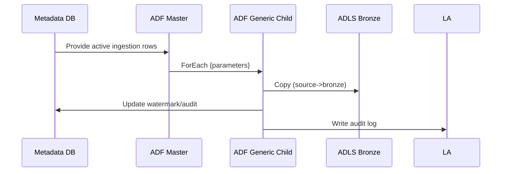

# Multi-Cloud Data Platform with Infrastructure Automation

## 1. Project Overview & Business Problem

The enterprise operates cloud workloads across multiple cloud providers (Azure, AWS, GCP) with inconsistent infrastructure provisioning, manual deployment processes, and inability to efficiently manage costs across cloud providers. Infrastructure inconsistency prevents disaster recovery and workload portability, locking the organization into single cloud providers and limiting negotiating power with vendors.
Manual infrastructure provisioning takes 2-3 weeks per environment, preventing agile deployment of new data platforms and creating operational bottlenecks that slow time-to-market for new analytics initiatives.

- **Business Context & Challenge**: The organization manages data workloads across Azure (primary), AWS (legacy), and GCP (new partnerships), with siloed infrastructure teams managing each cloud independently.
  Infrastructure inconsistency prevents disaster recovery and workload migration, trapping valuable data assets in single cloud environments and preventing optimization of cloud costs.

- **Strategic Objectives**: Build unified multi-cloud data platform with infrastructure-as-code automation enabling consistent deployments across clouds, rapid environment provisioning, and optimized cloud cost management.
  Automation will reduce deployment time from 3 weeks to 3 days, enabling rapid scaling for new initiatives and consistent disaster recovery across cloud providers.

- **Pain Points & Business Drivers**: Current pain points include weeks-long provisioning cycles preventing agile deployment, cloud cost optimization challenges with workloads scattered across providers, disaster recovery gaps preventing reliable data protection.
  Unified platform will enable rapid workload deployment, cloud cost optimization through consolidated billing and reserved capacity, and enterprise-grade disaster recovery with multi-cloud failover.

- **Cloud Solution Value Proposition**: Infrastructure-as-code enables consistent, repeatable deployments across clouds; cloud-agnostic architectures prevent vendor lock-in and enable negotiating power.
  Automated infrastructure provisioning reduces operational overhead while improving deployment consistency and reliability.

- **Expected Business Impact**: Reduced deployment time from 3 weeks to 3 days will accelerate data platform initiatives by 40%; multi-cloud cost optimization will reduce cloud spend by 30% ($5M annually).
  Enhanced disaster recovery across clouds will reduce recovery time objective (RTO) from 8 hours to 2 hours and recovery point objective (RPO) from 24 hours to 1 hour.

## 2. Requirement Gathering & Analysis

Multi-cloud platform requirements span Azure, AWS, and GCP with consistent infrastructure provisioning, cost optimization, and disaster recovery across cloud providers. Integration complexity spans different identity systems, networking configurations, and service models across clouds.

- **Source Infrastructure**: Current workloads include data lakes in Azure, legacy Redshift warehouses in AWS, and new BigQuery initiatives in GCP, requiring unified management and orchestration.
  Infrastructure includes compute (VMs, container orchestration), storage (blobs, S3, Cloud Storage), networking (VNETs, VPCs), and security services across clouds.

- **Deployment Frequencies & SLAs**: New environment provisioning required to support new data initiatives every 2 weeks; production deployments required within service window; DR failover required within 2 hours maximum.
  Configuration changes must rollback automatically if health checks fail; infrastructure updates must maintain 99.9% availability.

- **Infrastructure Scale & Growth**: Platform manages 50+ environments (dev, test, prod across clouds); compute capacity grows 20% annually; storage capacity grows 50% annually.
  Multi-cloud deployment requires managing 100+ resource types across 3 cloud providers with consistent tagging, networking, and security policies.

- **Compliance & Governance Standards**: Infrastructure must meet FedRAMP requirements for government workloads, compliance regulations for data residency (data must remain in specific regions), and cost allocation requirements for multi-cloud chargeback.
  Audit trails required for all infrastructure changes; segregation of duties required for approval workflows.

- **Infrastructure Standards**: Standardized infrastructure patterns for data lakes (with medallion architecture), data warehouses (with optimized indexing), and analytics services (with cost controls and performance optimization).
  CI/CD pipelines must validate infrastructure before deployment; rolling deployments must maintain availability.

- **Disaster Recovery Requirements**: RTO of 2 hours for production systems; RPO of 1 hour for critical data; failover between clouds required for cloud provider outages.
  Backup strategy must enable point-in-time recovery; cross-cloud replication required for critical data.

- **Cost Optimization Goals**: Reduce cloud spend by 30% through reserved capacity, spot instances, and data tiering; implement chargeback model allocating costs to business units.
  Cloud cost forecasting required for budget planning; cost anomaly detection required for optimization.

## 3. Azure Architecture Setup

The multi-cloud platform provisions consistent infrastructure across Azure, AWS, and GCP using infrastructure-as-code tools (Terraform, Bicep) with centralized control plane orchestrating deployments. Cost management, identity, and monitoring unified across clouds.

- **Cloud Foundation Services**: Deploy unified identity through Azure AD federation; centralized monitoring through Azure Monitor collecting logs from all clouds; centralized cost management through Azure Cost Management.
  Implement cloud-agnostic networking with VPN gateways and ExpressRoute connectivity enabling secure inter-cloud communication.

- **Terraform Infrastructure Code**: Define infrastructure patterns for data lakes, warehouses, and analytics services enabling consistent deployment across clouds.
  Implement resource tagging standards for cost allocation and compliance tracking; parameterize for environment-specific configuration.

- **Azure Deployment Automation**: Leverage Azure DevOps for pipeline orchestration triggering Terraform deployments to all clouds through unified control plane.
  Implement approval gates requiring cross-cloud infrastructure review before production deployment.

- **AWS Integration**: Deploy AWS-native services (Redshift, S3) alongside cloud-agnostic architectures; implement AWS Cost Explorer integration with Azure Cost Management.
  Set up cross-account IAM roles enabling centralized identity from Azure AD.

- **GCP Integration**: Deploy GCP-native services (BigQuery, Cloud Storage) alongside cloud-agnostic components; implement GCP IAM integration with Azure AD.
  Set up cross-project service account federation enabling centralized identity.

- **Network Connectivity**: Deploy VPN gateways and ExpressRoute/Interconnect connections enabling secure inter-cloud communication with low latency.
  Implement consistent networking standards (CIDR ranges, DNS, firewall rules) across clouds.

- **Disaster Recovery**: Implement cross-cloud backup replication for critical data; deploy standby infrastructure in secondary cloud with automation enabling rapid failover.
  Test failover procedures monthly to ensure recovery capabilities.

- **Cost Optimization**: Implement reserved capacity across clouds (Azure RIs, AWS Reserved Instances, GCP commitments) reducing compute costs by 40%.
  Deploy cost management policies enforcing resource tagging and preventing resource sprawl.

- **Monitoring & Logging**: Centralize logging from all clouds to Azure Log Analytics enabling unified observability across infrastructure.
  Implement cross-cloud alerting triggering responses automatically when thresholds exceeded.

- **Security & Compliance**: Implement consistent RBAC across clouds preventing unauthorized access; implement compliance monitoring detecting configuration drift.
  Deploy Data Box for secure multi-cloud data transfers; implement encryption-at-rest and in-transit across clouds.

## 4. ADLS Folder Structure (Medallion Architecture)

The multi-cloud platform implements consistent folder structure across Azure ADLS, AWS S3, and GCP Cloud Storage enabling workload portability.

- **Landing Layer**: Raw unvalidated data lands in `/landing/` across all clouds, organized by source system and data type.
  Automated lifecycle policies move data to cold storage after 30 days for cost optimization.

- **Pre-Bronze**: Validated data in `/pre-bronze/` ready for historical archival, with schema checks and data quality validation.

- **Bronze Layer**: Immutable source records in `/bronze/` with complete history for audit and replay capabilities.

- **Silver Layer**: Cleaned, standardized data in `/silver/` with transformations applied, organized by business domain.

- **Gold Layer**: Analytical-ready curated data in `/gold/` optimized for reporting and analytics consumption.

- **Archive Layer**: Historical data >2 years in archive storage tier for compliance retention.

## 5. Source System Connectivity (ADF & Event Hub)

ADF establishes connections across clouds with consistent retry logic, credential management, and monitoring.

- **Azure Connectivity**: Configure Azure Data Factory linked services for ADLS, SQL, Cosmos DB, and other Azure services.
  Implement managed identity authentication eliminating credential management.

- **AWS Connectivity**: Configure AWS linked services for S3, Redshift, RDS with cross-account IAM roles enabling centralized identity.
  Implement VPN connectivity for secure data transfer.

- **GCP Connectivity**: Configure GCP linked services for Cloud Storage, BigQuery, Cloud SQL with service account federation.

- **Event Hub Multi-Cloud**: Deploy Event Hub with Event Grid enabling event-driven architectures across clouds.

- **Network Connectivity**: Implement consistent connectivity patterns across clouds enabling secure data transfer.

- **Credential Management**: Centralize credential storage in Azure Key Vault accessible across clouds.

- **Source Documentation**: Maintain master documentation of all sources across clouds with connectivity requirements.

## 6. Ingestion Framework (ADF – Metadata Driven)

Metadata-driven ingestion enables consistent data onboarding patterns across clouds.

- **Metadata Repository**: Create central metadata tables tracking sources, schemas, and ingestion patterns across clouds.
  Enable dynamic pipeline generation from metadata reducing code duplication.

- **Cloud-Agnostic Patterns**: Design ingestion patterns using cloud-agnostic technologies (Spark, common SQL) enabling workload portability.

- **Copy Activity Optimization**: Tune copy activities for cross-cloud data transfer using cloud-specific accelerated pathways.

- **Watermark Management**: Implement consistent watermark patterns across clouds enabling incremental ingestion.

- **Error Handling**: Implement retry logic and error notifications consistent across cloud deployments.

- **Audit Logging**: Implement consistent audit logging capturing ingestion events across clouds.

- **Cost Optimization**: Implement cost-optimal data transfer patterns minimizing egress charges.

- **Trigger Configuration**: Implement consistent triggering patterns across clouds enabling coordinated execution.

- **Dependency Management**: Ensure proper sequencing of cross-cloud workloads.

## 7. Pre-Bronze Validations

Pre-ingestion validation consistent across clouds ensures only quality data enters analytics pipelines.

- **Schema Validation**: Validate incoming data schema against standards across clouds using cloud-agnostic validation logic.
  Store validation rules in central repository enabling consistent application.

- **Data Quality Rules**: Apply DQ rules consistently across cloud environments detecting anomalies early.

- **Completeness Checks**: Ensure all required fields present and non-null across cloud platforms.

- **Format Validation**: Validate data formats (dates, numbers, strings) consistently across clouds.

- **Duplicate Detection**: Identify duplicate records preventing double-counting across cloud ingestions.

- **Exception Handling**: Route validation failures to centralized exception tracking system.

- **Audit Trail**: Maintain validation audit logs across clouds enabling compliance reporting.

## 8. Bronze Layer Processing

Bronze layer implements consistent data archival across clouds preserving complete history.

- **Cloud-Native Storage**: Use cloud-native formats (Delta on ADLS, Parquet on S3, Avro on Cloud Storage) optimized for each cloud.
  Maintain consistent data lineage tracking across cloud-specific implementations.

- **Immutable Records**: Store immutable source records enabling point-in-time recovery and compliance audit trails.

- **Partitioning Strategy**: Implement consistent partitioning schemes across clouds enabling efficient querying.

- **Metadata Tracking**: Track load metadata consistently across clouds for operational visibility.

- **Complete History**: Maintain complete transaction history across clouds for 7-year compliance retention.

- **Minimal Transformation**: Preserve source data exactly as received without business logic changes.

- **Schema Evolution**: Handle schema changes consistently across clouds enabling unplanned schema additions.

## 9. Silver Layer Transformations (Databricks + PySpark)

Silver layer implements consistent transformations across clouds using cloud-agnostic Spark SQL.

- **Cloud-Agnostic Spark**: Use Databricks unified analytics platform enabling consistent transformation logic across clouds.
  Leverage Spark SQL for transformations portable across cloud Spark implementations.

- **Data Cleansing**: Implement consistent data cleaning logic across clouds removing duplicates and standardizing formats.

- **Business Transformations**: Apply consistent business logic across clouds enabling unified metrics across cloud deployments.

- **Incremental Processing**: Implement consistent MERGE patterns across clouds for efficient updates.

- **Data Quality Rules**: Apply business rules consistently with violations logged centrally.

- **Validation**: Reconcile transformations across clouds ensuring consistency.

- **Performance Optimization**: Optimize Spark jobs consistently across cloud implementations.

- **Cost Control**: Implement cost-aware transformations limiting cluster sizes and durations.

- **Documentation**: Document transformation logic enabling reproducibility across clouds.

- **Version Control**: Maintain transformation notebooks in Git enabling collaboration and version history.

- **Testing**: Implement automated tests validating transformation correctness across clouds.

- **Deployment**: Deploy transformations consistently across cloud environments.

## 10. Gold Layer Aggregations

Gold layer creates consistent analytical models across clouds optimized for consumption.

- **Unified Data Models**: Design dimensional models consistent across cloud deployments enabling unified reporting.
  Implement star schemas optimized for cloud analytics engines (Synapse SQL, Redshift Spectrum, BigQuery).

- **Fact Tables**: Build fact tables containing analytical metrics comparable across cloud deployments.

- **Dimension Tables**: Build dimension tables with consistent hierarchies enabling drill-down analysis across clouds.

- **Aggregated Metrics**: Pre-compute KPIs consistently across clouds enabling instant reporting.

- **Cross-Cloud Consistency**: Reconcile aggregations across clouds detecting discrepancies.

- **Performance Optimization**: Optimize gold tables for each cloud's query engine while maintaining logical consistency.

- **Business Validation**: Validate business metrics across clouds ensuring accuracy.

- **Documentation**: Document data models enabling business user understanding.

## 11. Delta Lake Optimization Techniques

Delta Lake optimizations ensure consistent query performance across cloud deployments.

- **OPTIMIZE Operations**: Run OPTIMIZE with ZORDER by consistently sorting data across clouds for efficient queries.

- **Vacuum Operations**: Regularly VACUUM to remove expired snapshots maintaining consistency.

- **Compaction**: Enable auto-compaction ensuring consistent file organization across deployments.

- **Caching**: Cache frequently accessed tables in memory for performance.

- **Z-Ordering**: Apply consistent Z-ordering strategies across clouds for data skipping efficiency.

- **Partition Pruning**: Leverage consistent partitioning for efficient historical queries.

- **Schema Evolution**: Handle schema changes consistently across clouds.

- **Shuffle Tuning**: Configure shuffle partitions consistently for stable performance.

## 12. Consumption Layer (Synapse + Power BI)

Consumption layer provides consistent analytics access across cloud deployments.

- **Multi-Cloud Analytics**: Enable analytics across data assets in all clouds through Synapse, Redshift Spectrum, and BigQuery federation.
  Implement consistent query patterns enabling analysts to query across clouds seamlessly.

- **External Tables**: Create external tables referencing data in all clouds enabling federation queries.

- **SQL Views**: Build views enabling consistent query patterns across clouds.

- **Query Federation**: Enable cross-cloud queries combining data from Azure, AWS, and GCP.

- **Semantic Models**: Build Power BI models consuming data from all clouds.

- **Performance**: Optimize queries across cloud boundaries minimizing data transfer.

- **Access Control**: Implement consistent RLS across clouds.

- **Monitoring**: Monitor query performance across cloud deployments.

## 13. Monitoring & Alerting

Comprehensive monitoring ensures multi-cloud platform SLA compliance.

- **Centralized Observability**: Centralize logs from all clouds to Azure Log Analytics enabling unified observability.
  Implement consistent alerting across clouds detecting issues in any deployment.

- **Infrastructure Monitoring**: Monitor resource utilization across clouds detecting performance issues.

- **Data Pipeline Monitoring**: Monitor ingestion, transformation, and aggregation pipelines across clouds.

- **Cost Monitoring**: Track cloud costs across providers detecting anomalies.

- **Cross-Cloud Replication**: Monitor data replication between clouds detecting inconsistencies.

- **Health Checks**: Implement automated health checks across clouds detecting failures.

- **SLA Tracking**: Track SLA compliance across clouds.

- **Incident Response**: Centralize incident tracking enabling coordinated responses.

- **Trend Analysis**: Analyze trends across cloud deployments identifying optimization opportunities.

- **Custom Dashboards**: Build unified dashboards visualizing multi-cloud platform health.

## 14. Security & Governance

Multi-cloud security requires consistent policies across cloud providers.

- **Identity Management**: Centralize identity through Azure AD federated across clouds.
  Implement consistent RBAC policies across all cloud deployments.

- **Network Security**: Implement consistent network policies and encryption across clouds.

- **Data Protection**: Encrypt data at-rest and in-transit consistently across clouds.

- **Compliance Monitoring**: Implement automated compliance checking across clouds.

- **Audit Trails**: Maintain consistent audit logging across cloud deployments.

- **Access Control**: Implement consistent access policies across clouds.

- **Secret Management**: Centralize secrets in Azure Key Vault accessed across clouds.

- **Incident Response**: Implement consistent incident response procedures across clouds.

- **Vulnerability Management**: Scan infrastructure across clouds for security vulnerabilities.

- **Data Governance**: Implement consistent data governance policies across clouds.

## 15. CI/CD Pipeline Setup (Azure DevOps or GitHub Actions)

Unified CI/CD enables consistent deployments across all clouds.

- **Infrastructure as Code**: Define infrastructure using Terraform enabling consistent deployments across clouds.

- **Git Integration**: Store all infrastructure and pipeline code in Git enabling version control.

- **Build Automation**: Implement automated builds validating infrastructure syntax before deployment.

- **Test Automation**: Implement automated tests validating infrastructure correctness.

- **Staged Deployment**: Deploy to dev/test/prod across clouds in coordinated stages.

- **Approval Gates**: Require approvals for production deployments across clouds.

- **Rollback Capability**: Maintain rollback capability for failed deployments across clouds.

- **Deployment History**: Track all deployments across clouds enabling audit trails.

- **Documentation**: Maintain up-to-date documentation of CI/CD pipelines.

## 16. Performance Optimization

Multi-cloud performance optimization ensures consistent query and pipeline speed.

- **Cloud-Specific Optimization**: Leverage cloud-specific optimization features while maintaining portability.

- **Query Optimization**: Optimize queries for each cloud's query engine while maintaining logical consistency.

- **Cost-Performance Balance**: Balance performance optimization with cloud cost management.

- **Caching Strategies**: Implement consistent caching across clouds.

- **Connection Pooling**: Use connection pooling across cloud boundaries.

- **Parallel Processing**: Optimize parallel processing across clouds.

- **Data Transfer**: Minimize data transfer between clouds through strategic caching.

## 17. Cost Optimization

Multi-cloud cost management maximizes efficiency across providers.

- **Reserved Capacity**: Purchase reserved capacity across clouds reducing compute costs 40%.

- **Spot Instances**: Use spot instances for non-critical workloads.

- **Storage Tiering**: Move aged data to archive storage reducing costs 90%.

- **Egress Optimization**: Minimize cross-cloud data transfer reducing egress charges.

- **Workload Optimization**: Right-size workloads for each cloud's cost profile.

- **Chargeback Model**: Implement chargeback allocating costs to business units.

- **Cost Forecasting**: Forecast cloud costs enabling budget planning.

## 18. Documentation & Knowledge Transfer

Comprehensive documentation ensures multi-cloud platform sustainability.

- **Architecture Documentation**: Document multi-cloud architecture with connectivity patterns.

- **Operational Runbooks**: Document operational procedures across clouds.

- **Disaster Recovery Runbooks**: Document disaster recovery and failover procedures.

- **Infrastructure Documentation**: Document infrastructure standards and patterns.

- **Cost Allocation**: Document cost allocation methodologies.

- **Compliance Documentation**: Document compliance controls across clouds.

- **Training Materials**: Prepare training for teams managing multi-cloud platform.

- **Knowledge Transfer**: Conduct training sessions ensuring team competency.

- **Lessons Learned**: Document implementation lessons and improvement opportunities.

- **Continuous Improvement**: Establish process for continuous improvement of multi-cloud platform.
## Diagrams & Flow Visualizations

Below are recommended flow diagrams and visual artifacts to include in architecture reviews, runbooks, and onboarding documents. Use the Mermaid syntax where supported (for rendered diagrams), and include PNG/SVG exports in formal documentation.

### 1) High-level Multi-Cloud Architecture (Mermaid)

```mermaid
flowchart LR
  subgraph OnPrem
    OPDB[On-Prem SQL]
    OPFTP[SFTP Files]
  end
  subgraph Azure
    ADF[Azure Data Factory]
    ADLS[ADLS Gen2 (Bronze/Silver/Gold)]
    DBr[Databricks]
    Syn[Synapse]
    KV[Key Vault]
    LA[Log Analytics]
  end
  subgraph AWS
    S3[S3]
    Red[Redshift]
  end
  subgraph GCP
    GCS[Cloud Storage]
    BQ[BigQuery]
  end
  OPDB -->|SH-IR| ADF
  OPFTP -->|SH-IR| ADF
  S3 -->|Cross-account| ADF
  GCS -->|Service Account| ADF
  ADF --> ADLS
  ADLS --> DBr
  DBr --> Syn
  ADF --> DBr
  DBr -->|logs| LA
  ADF -->|diag| LA
  KV -->|secrets| ADF
  KV -->|secrets| DBr
  Red -->|replicate| ADLS
  BQ -->|replicate| ADLS
```

### 2) Ingestion Orchestration (ADF Master→Child pattern)



### 3) CI/CD Flow (Git → Dev → Test → Prod)

```mermaid
flowchart TD
  subgraph Repo
    GIT[Git (ADF/Notebooks/IaC)]
  end
  GIT --> CI[CI Build (lint, tests)]
  CI --> CD_DEV[Deploy to Dev]
  CD_DEV --> QA[Test & Validation]
  QA --> CD_PROD[Approval Gate]
  CD_PROD --> Prod[Deploy to Prod]
```

## Key Tables & Operational Artifacts

Below are compact, copy-ready tables for operational runbooks and handoffs. Edit values to match your naming conventions and environment specifics.

### Source → Target Example Mapping

| Source System | Source Object | Ingestion Pattern | Target Path (ADLS) |
|---|---:|---|---|
| OnPrem SQL | sales.transactions | CDC / Incremental | /landing/sales/transactions/ → /bronze/sales/transactions/ |
| SFTP | product_catalog.csv | Daily full file | /landing/catalogs/ → /pre-bronze/catalogs/ |
| Salesforce | Account API | 15-min incremental | /bronze/crm/accounts/ |

### Metadata Control Table (example schema)

| Column Name | Type | Description |
|---|---|---|
| ingestion_id | UUID | Unique row id for the ingestion task |
| source_type | varchar | e.g., sql, api, sftp, streaming |
| source_conn_ref | varchar | Key Vault secret name or linked service id |
| path_or_query | text | File path or source query |
| frequency_minutes | int | Polling frequency in minutes |
| load_type | varchar | full / incremental / cdc |
| watermark_col | varchar | Column used for incremental loads |

### Bronze/Silver/Gold Retention & Lifecycle Sample

| Zone | Retention Policy | Transition Rule |
|---|---:|---|
| Landing | 24 hours | Move to pre-bronze after validation success |
| Bronze | 1 year (hot) then 3 years (cool) | Move to archive after 1 year |
| Silver | 3 years | Keep hot for 90 days then cool |
| Gold | 7 years (compliance) | Archive compressed parquet after 2 years |

### Example: Audit Log Table Columns

| Column | Type | Notes |
|---|---|---|
| run_id | uuid | Pipeline run identifier |
| pipeline_name | varchar | Name of ADF pipeline or job |
| start_ts | datetime | Start timestamp |
| end_ts | datetime | End timestamp |
| status | varchar | Success / Failed / Cancelled |
| records_in | bigint | Source record count |
| records_out | bigint | Sink record count |
| error_msg | text | Error details (if any) |

## Appendix: Recommended Runbook Snippets

- **Daily Health Check (Ops)**: Query `audit_log` for failures in the last 24 hours; verify no unsent alerts.
  If failures > 0, open ticket with pipeline id and attach error_msg and cluster logs.

- **Failover Drill (DR)**: Switch DNS endpoints to the passive cloud, enable replication replay jobs, and run smoke tests.
  Measure RTO/RPO and document discrepancies for post-mortem.

- **Schema Drift Response**: When schema drift alert triggers, pause downstream jobs, snapshot the bronze data, and open a schema-change PR.
  Data stewards review and approve schema evolution in metadata tables before resuming pipelines.

## Deliverables & Next Steps

- Export the Mermaid diagrams to `docs/diagrams` as SVG/PNG for PowerPoint and Confluence embedding.
- Populate the metadata control table in `Azure SQL` and create initial rows for high-priority sources.
- Create an `audit_log` table and wire ADF and Databricks jobs to emit run-level telemetry to this table.

---

If you want, I can now:
- Export these diagrams as SVG files and add them to `docs/diagrams`.
- Create the SQL DDL files for the `metadata_control` and `audit_log` tables.
- Generate a printable one-page runbook summarizing daily troubleshooting steps.

## Detailed Project Flow & 20-Activity Pipeline

This section provides a canonical, metadata-driven pipeline for multi-cloud ingestion and processing. The pipeline is deliberately cloud-agnostic in orchestration and uses a master/child pattern. It includes 20 activities covering discovery, validation, ingestion, transformations, reconciliation, publishing and telemetry.

Pipeline Activities (ordered):

| Step | Activity Name | Activity Type | Purpose | Input | Output |
|---:|---|---|---|---|---|
| 1 | Read_Metadata | Lookup | Read active ingestion rows for environment & source | `mtd_source_systems` | metadata row |
| 2 | Acquire_Lock | StoredProc | Prevent concurrent runs for same source | metadata.source_id | lock token |
| 3 | Validate_Connectivity | WebActivity | Test API/DB/SFTP connectivity and credentials | metadata | connectivity result |
| 4 | Pre_Scan | Script/Function | List files / sample rows to decide path | source listing | manifest file |
| 5 | Copy_To_Staging | Copy Activity | Copy raw data to cloud staging (`/landing/`) | source object | landing path |
| 6 | Integrity_Check | Databricks Job | Check checksums, header, row counts | landing files | integrity report |
| 7 | PreBronze_Validation | MappingDataFlow | Filename/schema/size/header/sample rules | landing files | pre-bronze / quarantine |
| 8 | Convert_To_Bronze | Databricks Job | Minimal casts, normalize types, write delta | pre-bronze | /bronze/{entity}/ |
| 9 | Bronze_Stats | StoredProc | Write load metrics to `audit_log` | load metrics | audit row |
|10 | Schema_Drift_Detect | AzureFunction | Compare source schema vs expected and flag | bronze schema | drift flag |
|11 | Silver_Transform | Databricks Notebook | Business cleansing, enrichment, joins | bronze | silver staging |
|12 | Data_Quality | DataQuality Job | Run DQ checks and produce `dq_report` | silver staging | dq_report |
|13 | Business_Merge | MERGE | Upsert/merge into dimension & fact tables | silver | dim/fact tables |
|14 | Reconciliation | StoredProc | Reconcile counts/amounts vs source totals | reconciliation inputs | reconciliation report |
|15 | Gold_Aggregation | Databricks Job | Compute curated marts and KPIs | dim/fact | gold tables |
|16 | Optimize_Tables | Databricks Job | OPTIMIZE/ZORDER/VACUUM for gold tables | gold tables | optimized tables |
|17 | Publish_Semantic | Synapse/Scripts | Create/refresh views & semantic models | gold tables | semantic views |
|18 | Notify_Consumers | LogicApp/REST | Notify BI and downstream consumers | publish status | notifications |
|19 | PostRun_Audit | StoredProc | Update `audit_log` end status and metrics | run metrics | audit updated |
|20 | Cleanup_Archive | Function | Archive landing files, archive purging, VACUUM | landing, deltas | archive/cleanup |

Control Tables (example columns)

- `mtd_source_systems` (source_id, system_name, source_type, linked_service, path_or_query, frequency_minutes, watermark_col, owner)
- `metadata_control` (ingestion_id, source_type, source_conn_ref, load_type, frequency_minutes, status, last_run_ts)
- `audit_log` (run_id, pipeline_name, source_id, start_ts, end_ts, status, records_in, records_out, error_msg)
- `dq_report` (run_id, check_name, status, rows_checked, rows_failed, details)

Operational Guidance

- Idempotence: Use `run_id` and deterministic file paths; MERGE for upserts; use locks to avoid overlapping ingest of same source.
- Alerts: Send critical DQ failures and ingestion errors to Ops channel with run_id and error_msg. Keep `dq_report` retention for 2 years.
- Schema Evolution: On `Schema_Drift_Detect` = true, pause downstream `Business_Merge` and create a change ticket with schema diff for steward approval.
- Costs: For cross-cloud transfers, use staged replication to minimize egress and schedule heavy transformations in target cloud where compute is cheapest.

This pipeline skeleton can be translated into ADF master/child pipelines or into orchestration in Azure Data Factory, GitHub Actions invoking Terraform, and Databricks Jobs. Parameterize schedules and resource sizes in `metadata_control`.

