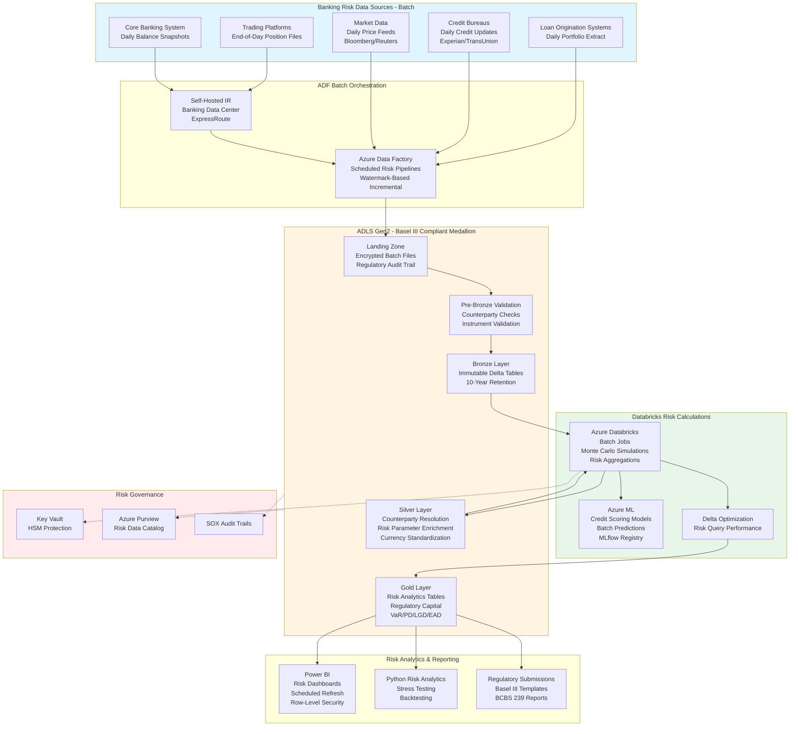

# Banking Risk Management Analytics

## Standardized Azure Data Engineering Workflow

**This project follows the standard Azure Data Engineering architecture pattern:**

**Data Flow:** `Banking Systems → ADF Batch Orchestration → ADLS Medallion (Bronze → Silver → Gold) → Power BI / Python Analytics`

### Workflow Components:

1. **Azure Data Factory (ADF)** - Basel III compliant batch risk data ingestion
   - Scheduled batch pipelines for loans, positions, market data
   - End-of-day batch processing windows
   - Watermark-based incremental extraction
   - ExpressRoute connectivity to banking systems

2. **ADLS Gen2 Medallion Architecture** - Regulatory-compliant data lake
   - **Landing**: Encrypted batch files with audit trail
   - **Pre-Bronze**: Counterparty and instrument validation
   - **Bronze**: Immutable risk data (10-year retention)
   - **Silver**: Counterparty resolution, risk enrichment, currency conversion
   - **Gold**: Risk analytics, regulatory capital, VaR/PD/LGD/EAD calculations

3. **Azure Databricks** - Risk calculation batch jobs
   - Monte Carlo simulations
   - Regulatory capital calculations
   - Stress testing scenarios
   - Credit scoring models (MLflow)

4. **Power BI + Python** - Risk analytics and reporting
   - Risk dashboards with scheduled refresh
   - Regulatory report generation (Basel III/BCBS 239)
   - Python stress testing and backtesting

## Architecture Flow Diagram

## 1. Project Overview & Business Problem

The banking institution faces critical challenges managing risk exposure across credit portfolios, market positions, operational processes, and regulatory compliance obligations. Fragmented risk data across loan origination systems, trading platforms, core banking applications, and third-party credit bureaus prevents comprehensive risk assessment and timely decision-making. Manual risk reporting processes aggregate data weekly from disparate sources delaying identification of emerging risks and regulatory compliance violations. Legacy risk analytics systems cannot scale to process real-time transaction streams and complex risk calculations required by Basel III capital adequacy regulations and stress testing requirements. This project establishes an integrated Azure data platform consolidating all risk-relevant data sources enabling real-time risk monitoring, advanced predictive analytics, regulatory compliance automation, and comprehensive stress testing capabilities supporting sound risk management practices.

The platform transforms risk management operations by creating unified views of credit exposure, market risk positions, operational loss events, and compliance violations. By integrating loan management systems, trading platforms, core banking databases, credit bureau feeds, market data providers, and regulatory reporting systems, risk managers gain comprehensive visibility into enterprise-wide risk exposures. The solution supports both batch processing for historical risk analysis and streaming ingestion for real-time exposure monitoring and limit breach detection. Advanced analytics capabilities enable probability of default modeling, loss given default estimation, market risk value-at-risk calculations, operational risk event prediction, and automated regulatory capital calculations. The centralized architecture reduces capital requirements through better risk quantification, prevents compliance violations through automated monitoring, improves lending decisions through predictive credit models, and enhances board-level risk reporting with comprehensive dashboards and stress testing scenarios.

- **Risk data fragmentation across lending, trading, and operational systems prevents enterprise risk view.**
  Risk managers lack unified visibility into total exposures requiring manual data consolidation from systems.
- **Manual regulatory reporting delays compliance submission and increases error risk.**
  Teams spend weeks compiling Basel III capital adequacy reports from disparate data sources.
- **Legacy risk systems cannot process real-time transactions for exposure monitoring.**
  Limit breaches go undetected until batch processing completes causing potential losses.
- **Azure Data Factory, Databricks, and Synapse provide scalable regulatory-compliant platform.**
  Cloud architecture supports complex risk calculations with required security and audit capabilities.
- **Credit, market, operational risk teams and compliance officers benefit from integrated analytics.**
  Cross-functional collaboration improves through shared risk views and consistent metrics.

## 2. Requirement Gathering & Analysis

The requirements phase engages risk managers, compliance officers, treasury teams, and audit professionals to understand risk data sources, regulatory requirements, and analytical use cases. Data source mapping identifies loan origination systems, core banking platforms, trading and treasury management systems, credit bureau feeds from Experian and TransUnion, market data from Bloomberg and Reuters, and regulatory reporting databases. Each source requires documentation covering data schemas, risk-relevant attributes, refresh frequencies, and data quality requirements supporting accurate risk calculations.

Business requirements emphasize real-time exposure monitoring for trading positions and credit facilities while daily batch processing suffices for capital adequacy calculations and stress testing. The team documents risk calculation methodologies including probability of default models using logistic regression, loss given default calculations incorporating collateral valuations, exposure at default estimates considering commitment drawdowns, value-at-risk calculations using historical simulation and Monte Carlo methods, and operational risk capital using loss distribution approaches. Data quality requirements address counterparty identification across systems, collateral valuation consistency, market price accuracy, and transaction settlement status validation.

Security and compliance requirements encompass SOX financial controls, Basel III regulatory capital requirements, BCBS 239 risk data aggregation principles, data privacy regulations, and comprehensive audit trails for regulatory examinations. Access control matrices define role-based permissions by risk domain, business unit, and data sensitivity with segregation of duties between risk-taking and risk management functions. Integration requirements include real-time APIs for trading limit monitoring, batch feeds for regulatory submissions, and stress testing scenario engines.

- **Map loan systems, trading platforms, core banking, credit bureaus, and market data feeds.**
  Document schemas, risk attributes, calculation methodologies, and data lineage requirements.
- **Identify real-time streaming for trading positions plus daily batch for credit portfolios.**
  Define SLAs requiring trading exposure updates within seconds and credit metrics within 24 hours.
- **Estimate processing 20TB historical risk data with 100 million daily financial transactions.**
  Plan for regulatory retention requirements of 7 years with stress testing across 10+ scenarios.
- **Define quality rules validating counterparty identifiers, collateral values, and transaction completeness.**
  Implement reconciliation checks ensuring risk exposures match source system balances.
- **Gather transformation logic for PD, LGD, EAD models and VaR calculations.**
  Document regulatory capital formulas per Basel III standardized and internal ratings approaches.
- **Enforce SOX controls with segregation of duties and Basel III data governance.**
  Implement comprehensive audit logging for regulatory examinations and model validation.
- **Plan integrations with risk engines, regulatory reporting systems, and trading platforms.**
  Ensure API performance supporting real-time limit monitoring and automated breach alerts.

## 3. Azure Architecture Setup

The architecture establishes Azure Data Lake Storage Gen2 with immutable storage for risk data supporting regulatory retention and audit requirements. Zone-redundant storage ensures high availability for business-critical risk calculations and regulatory submissions. Azure Data Factory serves as orchestration engine with integration runtimes supporting both cloud connectivity for market data feeds and on-premises connectivity for core banking systems through ExpressRoute circuits ensuring low-latency data transfer for time-sensitive risk calculations.

Azure Databricks workspace deployment includes dedicated clusters for risk analytics with optimized configurations supporting complex mathematical computations including Monte Carlo simulations and optimization algorithms. MLflow integration provides model lifecycle management for credit risk scorecards and market risk models with comprehensive model versioning, performance tracking, and regulatory model validation documentation. Azure Synapse Analytics workspace combines serverless SQL pools for ad-hoc risk queries with dedicated pools optimized for large-scale risk aggregations and stress testing calculations.

Event Hubs ingests real-time trading transaction streams and market price updates with partitioning enabling parallel processing. Azure Machine Learning workspace provides enterprise ML capabilities for credit scoring models, fraud detection, and operational risk prediction with comprehensive model governance and explainability features. Azure Key Vault manages credentials with automated rotation and comprehensive access auditing. Networking implements hub-and-spoke topology with Azure Firewall providing outbound filtering for external market data and credit bureau connectivity.

- **Provision ADLS Gen2 with zone-redundant storage and immutable storage for audit compliance.**
  Configure 7-year retention policies meeting Basel III and SOX regulatory requirements.
- **Deploy Azure Data Factory with ExpressRoute connectivity to core banking systems.**
  Integrate with market data feeds and credit bureaus using cloud integration runtime.
- **Set up Azure Databricks with MLflow for risk model lifecycle management.**
  Configure production clusters optimized for Monte Carlo simulations and optimization algorithms.
- **Create Synapse Analytics workspace with dedicated pools for stress testing calculations.**
  Size appropriately supporting concurrent risk aggregations across multiple scenarios.
- **Deploy Event Hubs for real-time ingestion of trading transactions and market prices.**
  Configure partition count supporting required low-latency processing for limit monitoring.
- **Deploy Azure Machine Learning for credit scoring and fraud detection models.**
  Enable model governance with comprehensive documentation supporting regulatory validation.
- **Integrate Azure Key Vault for credential management with HSM protection.**
  Store database passwords, API keys, and model encryption keys with audit logging.
- **Configure Log Analytics workspace with comprehensive audit trail capture.**
  Enable diagnostic settings from all services supporting regulatory examinations.
- **Implement private endpoints for all services with ExpressRoute connectivity.**
  Disable public network access ensuring all risk data flows through secure private networks.
- **Configure hub-and-spoke virtual network with Azure Firewall.**
  Implement network security groups isolating risk calculation workloads by domain.
- **Apply encryption at rest using customer-managed keys in HSM-protected Key Vault.**
  Enable HTTPS-only access and secure transfer required across all services.
- **Register all risk data assets in Azure Purview with risk domain classifications.**
  Document data lineage from source systems through calculations to regulatory reports.

## 4. ADLS Folder Structure (Medallion Architecture)

The medallion architecture organizes banking risk data with strict access controls supporting regulatory requirements and model governance. Landing zone receives loan data, trading transactions, market prices, credit bureau reports, and collateral valuations with immediate encryption and comprehensive access logging. Pre-bronze layer implements banking-specific validation including counterparty identifier verification, currency code validation, transaction status checks, and collateral type validation ensuring data quality for downstream risk calculations.

Bronze layer preserves immutable source data in Delta Lake format maintaining complete audit trail required by Basel III data aggregation principles and SOX compliance. All risk data includes comprehensive metadata supporting regulatory examinations including data source identifiers, extraction timestamps, and data lineage information. Silver layer applies risk data standardization including counterparty resolution across systems, collateral valuation normalization, market price enrichment, and currency conversion creating unified risk exposure views.

Gold layer contains risk data warehouse with exposure fact tables, counterparty dimensions, instrument dimensions, and pre-calculated risk metrics including PD, LGD, EAD, and VaR values. Pre-aggregated tables provide regulatory capital calculations by exposure class, stress testing results by scenario, and portfolio risk summaries. Archive layer maintains historical risk data supporting backtesting, model validation, and regulatory examinations with 10-year retention exceeding minimum requirements.

- **Landing: Encrypted temporary storage for loans, trades, prices, and credit bureau data.**
  Implement immediate encryption and access logging supporting audit trail requirements.
- **Pre-Bronze: Banking-specific validation checking counterparty IDs, currencies, and collateral.**
  Validate instrument identifiers against master security database and check transaction completeness.
- **Bronze: Immutable encrypted risk data with comprehensive audit metadata.**
  Maintain complete transaction and position history supporting model backtesting and validation.
- **Silver: Standardized risk data with counterparty resolution and collateral normalization.**
  Create unified exposure views across lending, trading, and treasury portfolios.
- **Gold: Risk data warehouse with pre-calculated PD, LGD, EAD, and VaR metrics.**
  Enable regulatory capital reporting, stress testing, and enterprise risk aggregation.
- **Archive: Long-term encrypted storage with 10-year retention for regulatory examinations.**
  Support model validation, backtesting, and compliance audits with historical data access.

## 5. Source System Connectivity (ADF)

Source system connectivity integrates diverse banking platforms with appropriate security and error handling. Loan origination system connectivity uses ODBC linked service with SQL authentication extracting loan applications, credit decisions, and disbursements through self-hosted integration runtime in banking data center. Trading platform connectivity leverages FIX protocol adapter for real-time trade capture and position data with message sequence validation ensuring no trade loss.

Core banking system integration implements incremental extraction using change data capture on accounts, transactions, and customer master data minimizing impact on operational systems. Credit bureau connectivity uses REST APIs with certificate-based authentication retrieving credit scores, tradeline data, and public records with comprehensive request logging for Fair Credit Reporting Act compliance. Market data feeds from Bloomberg and Reuters connect through native connectors with subscription validation and entitlement checking.

All connectivity implements comprehensive audit logging capturing data extraction timestamps, record counts, and user identities supporting regulatory examinations. Connection monitoring validates certificate expiration, endpoint availability, and data feed health before processing preventing incomplete risk calculations from missing data.

- **Configure linked services for loan systems, trading platforms, banking databases, and bureaus.**
  Store credentials in Key Vault with managed identity access from Data Factory.
- **Deploy self-hosted integration runtime in banking data center for core system connectivity.**
  Use ExpressRoute for secure low-latency connectivity supporting time-sensitive risk data.
- **Validate connectivity testing FIX protocol, database connections, and API endpoints.**
  Ensure certificate validity, firewall rules, and network routing support data extraction.
- **Configure retry policies with financial-appropriate timeouts for transient failures.**
  Implement dead letter queues for failed extractions requiring investigation.
- **Tune database extraction using account number partitioning for large transaction volumes.**
  Extract position data using business date partitioning maximizing throughput.
- **Encrypt all connections using TLS 1.2 with mutual authentication for external feeds.**
  Implement certificate-based authentication for credit bureau and market data connectivity.
- **Document connectivity matrix with system contacts, SLAs, and escalation procedures.**
  Include market hours and settlement calendar dependencies for operational planning.

## 6. Ingestion Framework (ADF – Metadata Driven)

The metadata-driven ingestion framework incorporates banking-specific processing patterns and regulatory controls. Control tables store source system details, risk data types, extraction logic, calculation dependencies, and data quality thresholds. The framework implements transaction consistency ensuring related records like trades and positions maintain referential integrity preventing risk calculation errors from incomplete data.

Lookup activities query control tables filtered by business date and market hours with high-priority sources like trading positions processing in real-time while batch credit portfolio loads execute during end-of-day processing windows. Copy activities implement banking-specific transformations including currency conversion using official exchange rates, business date adjustments for settlement calendars, and counterparty identifier standardization across trading and lending systems.

Event-driven triggers respond to Event Hub messages for real-time trade processing and market price updates enabling immediate exposure calculations and limit monitoring. The framework implements comprehensive reconciliation activities validating extracted risk exposures match source system totals with discrepancy reporting to operations teams. Error handling distinguishes critical failures impacting regulatory reporting from non-critical issues, with immediate escalation for position breaks or missing required data.

- **Design control tables storing source details, risk types, calculation dependencies, and thresholds.**
  Enable dynamic configuration supporting regulatory formula changes through metadata updates.
- **Use Lookup activities querying control tables filtered by business date and market status.**
  Process real-time trading data immediately while scheduling batch credit loads appropriately.
- **Configure Copy activities with banking-specific transformations and currency conversion.**
  Implement business date logic accounting for settlement calendars and market holidays.
- **Implement real-time trade processing using Event Hubs with message sequencing.**
  Enable immediate position updates supporting trading limit monitoring and exposure alerts.
- **Build comprehensive reconciliation validating risk exposures against source systems.**
  Compare position quantities, notional amounts, and market values with break reporting.
- **Create banking-appropriate error handling distinguishing critical from non-critical failures.**
  Escalate immediately for position breaks or missing data impacting regulatory calculations.
- **Add counterparty resolution logic linking identities across lending and trading systems.**
  Implement master counterparty matching with manual review for uncertain matches.
- **Implement comprehensive audit logging capturing all risk data extractions.**
  Support regulatory examinations with who, what, when, where, and why details.
- **Design flexible triggers supporting intraday position updates and end-of-day batch processing.**
  Balance real-time trading requirements with batch credit portfolio processing.
- **Add calculation dependency management ensuring market prices load before VaR calculations.**
  Implement synchronization ensuring all required inputs available before risk metric computation.

## 7. Pre-Bronze Validations

Pre-bronze validation implements banking-specific quality checks ensuring risk calculation accuracy and regulatory compliance. Counterparty identifier validation checks customer IDs, SWIFT codes, LEI codes, and internal party identifiers cross-referencing against master counterparty database. Instrument validation verifies ISINs, CUSIPs, internal security identifiers, and derivative contract specifications against master security database.

Currency validation ensures ISO currency codes with conversion rate availability for all foreign currency exposures. Collateral validation checks collateral types, valuations, and lien positions ensuring accuracy for loss given default calculations. Transaction completeness validation verifies all required fields for risk calculations including notional amounts, trade dates, settlement dates, maturity dates, and pricing information.

Validation results log with risk calculation impact classifications determining immediate operations notification versus batch error reporting. Failed validations potentially impacting regulatory capital calculations trigger immediate alerts to risk operations teams. Comprehensive validation metrics support risk data governance dashboards tracking data quality by source system and risk domain.

- **Validate counterparty identifiers checking customer IDs, SWIFT codes, and LEI codes.**
  Cross-reference against master counterparty database preventing exposure to unidentified parties.
- **Validate instrument identifiers against master security database with derivative spec checks.**
  Ensure ISINs, CUSIPs, and internal IDs match registered securities preventing calculation errors.
- **Validate currency codes with conversion rate availability for all foreign exposures.**
  Detect missing exchange rates preventing incomplete risk aggregation across currencies.
- **Validate collateral data checking types, valuations, and lien positions.**
  Ensure collateral values support accurate LGD calculations for secured lending exposures.
- **Validate transaction completeness checking all required risk calculation fields.**
  Detect missing notional amounts, dates, or pricing preventing incomplete exposures.
- **Store validation results with risk impact classifications for prioritized review.**
  Enable immediate notification for critical data quality issues impacting regulatory reporting.
- **Move failed data to quarantine with risk operations team alerting.**
  Provide detailed error context facilitating rapid resolution preventing reporting delays.

## 8. Bronze Layer Processing

Bronze layer establishes comprehensive audit trail of risk source data with regulatory-compliant security and retention. Trading transactions, loan positions, market prices, and credit bureau data land in Delta Lake tables encrypted with customer-managed keys meeting banking security standards. Technical metadata includes comprehensive audit information capturing extraction timestamps, source system identifiers, data processor identities, and business dates supporting regulatory examinations.

Streaming ingestion from trading platforms uses Databricks Autoloader with exactly-once processing semantics preventing duplicate transactions impacting position calculations and P&L. Checkpointing ensures processing resumes correctly after failures without data loss critical for accurate risk exposures. Minimal transformations include currency normalization, business date standardization, and JSON parsing for complex derivative structures while preserving complete original records for audit and investigation.

Partition strategy uses business date and risk domain enabling efficient regulatory reporting queries and stress testing scenario executions. Retention policies maintain complete risk data with 10-year retention supporting model backtesting, regulatory examinations, and audit requirements. Schema evolution handles system upgrades introducing new transaction types or risk attributes without processing failures.

- **Store immutable encrypted risk data in Delta format with comprehensive audit metadata.**
  Maintain complete transaction and position history supporting regulatory examinations.
- **Maintain streaming checkpoint state for trade processing ensuring exactly-once semantics.**
  Prevent duplicate transactions impacting position calculations and profit/loss reporting.
- **Track comprehensive audit metadata capturing extraction details and data lineage.**
  Support regulatory examinations with complete data provenance documentation.
- **Apply minimal transformations preserving complete original risk data.**
  Maintain unaltered source records for audit trail and regulatory investigation requirements.
- **Partition bronze tables by business date and risk domain optimizing queries.**
  Enable efficient regulatory reporting and stress testing scenario executions.
- **Enable schema evolution handling system upgrades introducing new transaction types.**
  Accommodate derivative innovations and regulatory reporting changes without failures.

## 9. Silver Layer Transformations (Databricks + PySpark)

Silver layer transformations create standardized risk views enabling enterprise-wide exposure aggregation and regulatory calculations. Counterparty resolution implements deterministic and probabilistic matching linking customer IDs, legal entity identifiers, and SWIFT codes across lending, trading, and treasury systems creating unified counterparty master. Match confidence scoring enables manual review workflows for complex corporate hierarchies and affiliate relationships.

Instrument standardization maps local security identifiers to ISINs and CUSIPs creating universal instrument master enabling position aggregation across platforms. Collateral valuation normalization applies mark-to-market methodologies consistently across asset classes with daily revaluation for trading collateral and periodic appraisals for real estate. Currency conversion applies official exchange rates consistently with multiple rate scenarios supporting stress testing.

Risk parameter enrichment joins exposures with calculated PD, LGD, and EAD values from credit risk models stored in MLflow model registry. Market price enrichment links positions with latest bid/ask quotes, yield curves, and volatility surfaces from Bloomberg and Reuters. Data quality scoring assigns confidence levels to risk calculations based on data completeness, valuation freshness, and model applicability enabling risk-adjusted reporting.

- **Clean risk data standardizing counterparty names, instrument identifiers, and currencies.**
  Apply banking-specific parsing handling corporate legal names and security identifier formats.
- **Remove duplicate positions across systems using business key matching and reconciliation.**
  Link trading positions, loan exposures, and treasury holdings creating unified exposure views.
- **Perform instrument standardization mapping local IDs to ISINs and CUSIPs.**
  Enable position aggregation across platforms and asset classes for enterprise risk reporting.
- **Implement counterparty resolution creating master linking identities across systems.**
  Apply deterministic matching on LEIs and probabilistic on names creating unified counterparty views.
- **Apply risk data quality checks validating exposures, collateral, and market prices.**
  Detect implausible values, stale prices, and missing risk parameters requiring investigation.
- **Implement SCD Type 2 for counterparty and instrument master tracking changes.**
  Maintain effective date ranges supporting point-in-time risk exposures and backtesting.
- **Use MERGE INTO for efficient incremental processing of positions and transactions.**
  Update existing exposures and insert new positions maintaining consistency.
- **Use Autoloader for continuous trading stream processing with exactly-once semantics.**
  Benefit from automatic schema evolution handling new derivative contract types.
- **Apply partition pruning using business date and risk domain optimizing calculations.**
  Enable efficient portfolio aggregation and scenario-based stress testing.
- **Enforce Delta constraints on counterparty IDs, instrument IDs, and business date validity.**
  Reject records violating referential integrity with logging to exception tables.
- **Document transformation logic with risk calculation methodologies annotated.**
  Maintain transparency for model validators and regulatory examiners.
- **Validate output comparing exposure totals and position counts against bronze layer.**
  Implement reconciliation ensuring no risk exposures lost during transformations.

## 10. Gold Layer Aggregations

Gold layer delivers risk data warehouse enabling regulatory reporting, stress testing, and enterprise risk management. Counterparty dimension contains unified counterparty master with credit ratings, industry classifications, geographic locations, and relationship hierarchies. Instrument dimension provides comprehensive security master with asset class, maturity, credit quality, and risk characteristics.

Exposure fact table captures positions across all risk domains with calculated exposure values, risk weights, capital charges, and expected losses. Trading book fact contains marked-to-market positions with Greeks, VaR contributions, and stress losses. Banking book fact records loan exposures with PD, LGD, EAD calculations and provision estimates. Pre-aggregated tables provide regulatory capital by exposure class, VaR by desk, credit risk by rating grade, and stress losses by scenario.

Risk metric tables store calculated values including portfolio VaR at 99% confidence, expected shortfall, credit value adjustments, and operational risk capital. Regulatory reporting tables follow Basel III templates with standardized approaches and internal ratings based calculations. Z-ordering optimizes query performance for common aggregation patterns filtering by counterparty, instrument type, and business date.

- **Build counterparty dimension with unified master and credit risk attributes.**
  Include credit ratings, PD values, industry classifications, and relationship hierarchies.
- **Build instrument dimension with comprehensive security master and risk characteristics.**
  Include asset class, maturity, credit quality, optionality, and derivative specifications.
- **Build exposure fact table with positions, risk weights, capital charges, and expected losses.**
  Enable Basel III regulatory capital reporting and enterprise exposure aggregation.
- **Design risk data warehouse enabling regulatory reporting and stress testing.**
  Follow Basel III reporting templates and BCBS 239 data aggregation principles.
- **Create regulatory capital tables pre-computing capital charges by exposure class.**
  Accelerate Basel III reporting with pre-calculated standardized and IRB approaches.
- **Compute risk KPIs for VaR, expected shortfall, CVA, and operational capital.**
  Apply consistent calculation methodologies ensuring metric standardization.
- **Use window functions for portfolio analytics and exposure evolution tracking.**
  Enable trend analysis, concentration risk monitoring, and limit breach detection.
- **Optimize gold tables using Z-ordering on counterparty_id, instrument_type, and business_date.**
  Cluster risk data improving query performance for regulatory reporting and stress testing.

## 11. Delta Lake Optimization Techniques

Delta Lake optimization ensures risk calculations maintain acceptable performance supporting regulatory deadlines and real-time monitoring. OPTIMIZE commands consolidate small files generated by continuous trading streams into right-sized files reducing metadata overhead. ZORDER BY clauses organize data by counterparty, portfolio, and business date enabling effective data skipping for exposure aggregations and stress testing calculations.

VACUUM operations remove old file versions with extended retention periods supporting model backtesting and regulatory examinations requiring historical data reconstruction. Auto-optimize features enabled on high-velocity trading position tables automatically compact files during writes. Bloom filters on counterparty ID and instrument ID enable fast point lookups supporting credit approval workflows and trading limit checks requiring sub-second response times.

Table caching stores frequently accessed counterparty and instrument dimension tables in cluster memory accelerating risk calculations. Partition strategy balances counterparty-centric exposure queries with portfolio-level aggregations using hash partitions for trading books and date partitions for regulatory reporting.

- **Use OPTIMIZE with ZORDER BY counterparty_id, portfolio_id, business_date for skipping.**
  Cluster risk data enabling effective skipping for exposure aggregations and stress testing.
- **Use VACUUM with 90-day retention supporting model backtesting and audit requirements.**
  Balance storage costs with time-travel needs for regulatory examination support.
- **Enable auto-compaction on high-velocity trading position tables from real-time streams.**
  Automatically consolidate streaming micro-batch files maintaining query performance.
- **Use caching for counterparty and instrument dimension tables supporting calculations.**
  Store frequently accessed master data in cluster memory enabling fast risk computations.
- **Use data skipping via Delta statistics on counterparty, portfolio, and date columns.**
  Avoid scanning irrelevant data improving regulatory reporting and stress testing performance.
- **Partition tables by business date for regulatory reporting and by portfolio for trading risk.**
  Balance regulatory query patterns with real-time trading risk monitoring requirements.
- **Use schema evolution managing system upgrades adding new derivative types.**
  Handle new transaction structures and regulatory reporting requirements without failures.
- **Tune shuffle partitions based on cluster size and risk data volumes.**
  Optimize shuffle operations during exposure aggregations and Monte Carlo simulations.

## 12. Consumption Layer (Synapse + Power BI)

The consumption layer provides risk managers and regulators secure, performant access to risk analytics. Synapse serverless SQL pools expose external tables referencing risk gold Delta tables enabling SQL-based regulatory reporting template generation. Views implement pre-computed risk logic including exposure aggregation, limit utilization, and capital adequacy ratios simplifying risk application development.

Power BI risk dashboards leverage role-based security filtering data by portfolio assignment, risk domain responsibility, and counterparty authorization. Real-time trading risk dashboards use DirectQuery providing current VaR, stress losses, and limit utilization supporting intraday risk monitoring. Historical risk performance reports use imported data models with incremental refresh optimizing performance for trend analysis and backtesting.

Risk API endpoints built on Synapse SQL provide programmatic access for trading platforms, credit approval workflows, and regulatory submission systems. Row-level security implements least-privilege access restricting risk data visibility to authorized personnel by portfolio, desk, and counterparty relationship supporting information security controls.

- **Create external tables in Synapse serverless SQL referencing risk gold Delta tables.**
  Enable SQL-based regulatory reporting template generation and ad-hoc risk analysis.
- **Use views pre-computing exposure aggregations, capital ratios, and limit utilization.**
  Simplify risk application development encapsulating complex calculation logic.
- **Enable DirectQuery for real-time trading risk dashboards reflecting current exposures.**
  Provide intraday visibility supporting trading limit monitoring and risk management.
- **Build Power BI risk dashboards with measures calculating VaR, capital, and stress losses.**
  Apply DAX formulas for regulatory capital ratios and concentration risk metrics.
- **Implement row-level security filtering by portfolio, desk, and counterparty authorization.**
  Enforce least-privilege access restricting visibility to authorized risk personnel.
- **Publish dashboards with scheduled refresh during end-of-day processing windows.**
  Configure incremental refresh for large exposure fact tables reducing refresh times.
- **Optimize Power BI using aggregations for portfolio summaries and stress testing results.**
  Use composite models balancing real-time trading needs with historical trend analysis.

## 13. Monitoring & Alerting

Comprehensive monitoring ensures risk data pipeline reliability supporting regulatory deadlines and real-time trading. Azure Monitor collects metrics from risk pipelines tracking trade processing rates, market data feed latency, and risk calculation execution times. Log Analytics aggregates diagnostic logs enabling correlation analysis of data feed failures and calculation errors.

Event Hub monitoring tracks trading message throughput and consumer lag alerting when real-time position processing falls behind. Databricks monitoring captures risk calculation job performance with alerts for failures in VaR calculations, stress testing, or regulatory capital computations. Risk data quality monitoring tracks validation failure rates, missing required data, and stale market prices.

Business continuity monitoring validates disaster recovery configurations and backup completion. Risk SLA tracking measures trade processing latency, market price staleness, and regulatory report generation against business requirements. Compliance monitoring tracks unauthorized data access, audit log completeness, and encryption status.

- **Monitor ADF risk pipelines tracking trade processing rates and market data latency.**
  Create alerts for data feed failures impacting risk calculations and regulatory reporting.
- **Enable Event Hub monitoring tracking trading message throughput and processing lag.**
  Alert when real-time position processing falls behind potentially missing limit breaches.
- **Enable Databricks monitoring capturing risk calculation job performance and failures.**
  Track VaR calculation times, stress testing completion, and regulatory capital computation.
- **Use Log Analytics for risk system integration failure correlation and analysis.**
  Build dashboards visualizing risk data pipeline health with system-specific drill-down.
- **Configure alerts for critical risk pipeline failures with immediate team notification.**
  Implement escalation for repeated failures impacting regulatory reporting deadlines.
- **Implement SLA tracking measuring risk data freshness against calculation requirements.**
  Monitor trading position latency, market price age, and credit exposure update frequency.
- **Capture risk data quality metrics tracking validation failures and data completeness.**
  Monitor counterparty matching rates, collateral valuation coverage, and price availability.
- **Integrate security monitoring detecting unauthorized risk data access and anomalies.**
  Alert security teams for potential data breaches or inappropriate access attempts.
- **Monitor regulatory compliance tracking audit log completeness and control effectiveness.**
  Ensure continuous compliance with Basel III and SOX requirements.
- **Build risk operations dashboards visualizing end-to-end data flow and quality metrics.**
  Provide unified monitoring supporting risk operations and technology teams.

## 14. Security & Governance

Comprehensive security controls ensure regulatory compliance protecting sensitive financial data. Azure Key Vault stores encryption keys, database credentials, and API secrets with HSM protection meeting banking security standards. Customer-managed encryption keys encrypt all risk data at rest meeting Basel III data protection requirements with cryptographic key management and access auditing.

Private endpoints ensure all risk data transmission occurs through private networks with ExpressRoute connectivity eliminating public internet exposure. Network security groups implement least-privilege network access with comprehensive network flow logging. Azure Purview provides comprehensive data catalog with automated sensitive data discovery, data lineage tracking, and policy-based access governance.

Segregation of duties controls separate risk-taking from risk management functions with technical enforcement through role-based access controls. Comprehensive audit logging captures all risk data access supporting regulatory examinations and SOX compliance. Data retention policies maintain 10-year historical data supporting model validation and regulatory requirements.

- **Store encryption keys in Key Vault with HSM protection and automated rotation.**
  Implement comprehensive key access auditing supporting banking security requirements.
- **Use managed identities for all service-to-service authentication eliminating credentials.**
  Avoid password management overhead and security risks from credential exposure.
- **Enable private endpoints for all services with ExpressRoute connectivity.**
  Eliminate public internet exposure for risk data transmission meeting security standards.
- **Implement virtual networks with network security groups enforcing least-privilege access.**
  Permit only required risk calculation workflows with comprehensive flow logging.
- **Apply segregation of duties separating risk-taking from risk management access.**
  Implement technical controls enforcing organizational separation through RBAC.
- **Encrypt all data in transit using TLS 1.2 with mutual authentication.**
  Implement certificate-based authentication for external market data and credit bureau connectivity.
- **Encrypt all data at rest using customer-managed keys meeting Basel III requirements.**
  Apply field-level encryption for highly sensitive counterparty and transaction data.
- **Implement Azure Purview for data cataloging, lineage, and access governance.**
  Enable automated data protection policies based on sensitivity classifications.
- **Enable comprehensive audit logging capturing all risk data access and calculations.**
  Support regulatory examinations and SOX compliance with detailed audit trails.
- **Maintain Basel III, SOX, and BCBS 239 compliance with documented controls.**
  Implement technical and administrative safeguards satisfying regulatory requirements.

## 15. CI/CD Pipeline Setup (Azure DevOps or GitHub Actions)

CI/CD pipelines automate risk platform deployments with appropriate validation and regulatory controls. Azure DevOps repositories store Data Factory risk pipeline definitions, Databricks risk calculation notebooks, risk model artifacts, and infrastructure templates with branch protection requiring risk model validation before production deployment.

ARM templates define compliant infrastructure including encryption settings, network isolation, and audit logging with parameters supporting environment-specific configurations. Release pipelines deploy to development first with automated testing including risk calculation validation, model backtesting, and reconciliation checks comparing outputs against expected values.

Approval gates require risk management and compliance validation before production deployment ensuring calculation accuracy and regulatory compliance. MLflow integration tracks model versions with comprehensive documentation supporting model risk management and regulatory approval workflows. Database deployment scripts implement idempotent risk data warehouse DDL with schema validation.

- **Use Git integration for ADF storing risk pipeline definitions with version control.**
  Enable risk model validation workflows and change tracking for compliance.
- **Use Databricks Repos syncing risk calculation notebooks across environments.**
  Support collaborative development with automated deployment and version management.
- **Use ARM templates deploying compliant infrastructure consistently.**
  Parameterize security configurations ensuring compliance across environments.
- **Use YAML pipelines automating build, validation testing, and deployment workflows.**
  Standardize CI/CD with risk calculation validation and model backtesting gates.
- **Parameterize deployments with environment-specific risk calculation configurations.**
  Externalize model parameters and risk thresholds avoiding hardcoded values.
- **Use approval gates requiring risk management and compliance validation.**
  Implement manual checkpoints ensuring calculation accuracy and regulatory compliance.
- **Implement automated testing validating risk calculations and model performance.**
  Test VaR calculations, stress testing, and regulatory capital against benchmarks.
- **Deploy Synapse risk warehouse scripts with idempotent DDL and validation.**
  Apply versioning supporting repeated deployments without data disruption.
- **Implement incremental deployment updating only changed risk pipelines and models.**
  Minimize disruption to operational risk calculations during deployments.
- **Document CI/CD workflows with model validation procedures and compliance requirements.**
  Provide operational guidance ensuring regulatory compliance during deployments.

## 16. Performance Optimization

Performance optimization ensures risk calculations complete within regulatory deadlines and trading requirements. Data Factory DIU tuning allocates appropriate resources for high-volume trade processing and market data ingestion. Parallel processing configurations enable concurrent credit portfolio, trading book, and treasury exposure calculations maximizing throughput.

Databricks cluster sizing uses memory-optimized VMs for Monte Carlo simulations and compute-optimized for exposure aggregations. Broadcast join optimization caches counterparty and instrument dimensions in executor memory eliminating shuffle operations. Delta Lake OPTIMIZE and ZORDER operations maintain query performance for regulatory reporting and stress testing.

Synapse dedicated SQL pools use appropriate distribution strategies with hash distribution on counterparty ID for exposure aggregations. Risk calculation optimization implements appropriate algorithm selection, caching strategies, and parallel execution patterns ensuring timely completion.

- **Tune ADF DIUs allocating sufficient resources for high-volume trade processing.**
  Optimize real-time trade capture performance ensuring sub-second position updates.
- **Use broadcast joins caching counterparty and instrument dimensions.**
  Eliminate shuffle operations improving risk calculation performance.
- **Tune Databricks clusters with memory-optimized VMs for Monte Carlo simulations.**
  Enable autoscaling handling variable calculation loads across trading day.
- **Use Delta Lake OPTIMIZE with ZORDER BY counterparty_id, portfolio_id, business_date.**
  Cluster risk data enabling effective data skipping for aggregations.
- **Use caching for frequently accessed dimension tables and market data.**
  Support sub-second trading limit checks and credit approval queries.
- **Tune Synapse queries with hash distribution and appropriate indexing.**
  Optimize regulatory reporting query performance for Basel III templates.
- **Optimize risk dashboards using Power BI aggregations and composite models.**
  Balance real-time trading needs with historical trend analysis requirements.

## 17. Cost Optimization

Cost optimization balances risk analytics requirements with budget constraints. Databricks autoscaling policies dynamically adjust cluster sizes based on calculation workload patterns with higher capacity during market hours and lower overnight. Job clusters right-size resources based on actual risk calculation requirements rather than over-provisioning.

ADLS lifecycle management automatically transitions aged risk data to cool tier after 2 years and archive tier after 7 years reducing costs while maintaining retention. Pipeline scheduling executes non-critical risk analytics during off-peak hours when compute costs are lower.

Synapse serverless SQL provides cost-effective querying for ad-hoc risk analysis and model validation avoiding dedicated pool costs for intermittent workloads. Cost allocation tags enable chargeback models attributing platform costs to business units and risk domains.

- **Enable autoscaling with trading hour-appropriate capacity during market hours.**
  Scale clusters based on calculation demand avoiding over-provisioning overnight.
- **Use cool and archive storage tiers for aged risk data meeting retention requirements.**
  Reduce storage costs while maintaining 10-year regulatory accessibility.
- **Optimize runtimes through performance improvements reducing compute costs.**
  Efficient risk calculations complete using fewer resources lowering expenses.
- **Schedule non-critical risk analytics during off-peak hours when costs lower.**
  Execute model backtesting and historical analysis overnight.
- **Use Synapse serverless SQL for ad-hoc queries avoiding dedicated pool costs.**
  Reserve dedicated pools for scheduled regulatory reporting requiring high performance.
- **Use appropriate cluster sizing based on risk calculation characteristics.**
  Right-size stress testing and regulatory capital jobs avoiding resource waste.
- **Implement cost allocation tags enabling business unit chargeback models.**
  Attribute platform costs to trading desks and credit portfolios.

## 18. Documentation & KT

Comprehensive documentation ensures successful risk operations and regulatory compliance. Architecture diagrams illustrate risk data flows from banking systems through calculations to regulatory reports using industry-standard notation. Risk calculation specifications document methodologies for PD, LGD, EAD, VaR, and regulatory capital with formula references.

Runbooks provide step-by-step procedures for risk operations including trade breaks investigation, market data feed troubleshooting, model execution monitoring, and regulatory report generation. Model documentation captures development methodology, validation results, performance metrics, and limitations supporting model risk management. Compliance documentation demonstrates Basel III and SOX control implementation with evidence for regulatory examinations.

Knowledge transfer sessions cover risk data platform architecture, calculation methodologies, operational procedures, and regulatory compliance with recorded presentations. Executive summary presents platform capabilities, risk management improvements including better capital efficiency and enhanced monitoring, and regulatory compliance achievements.

- **Prepare risk architecture diagrams showing banking system integrations and calculations.**
  Include trade flows, market data feeds, and risk calculation dependencies.
- **Create risk calculation specifications documenting PD, LGD, EAD, and VaR methodologies.**
  Provide detailed formulas, assumptions, and limitations for model validation.
- **Create operational runbooks for trade breaks, market data issues, and report generation.**
  Define procedures for common risk operations issues and escalation paths.
- **Maintain model documentation with validation results and performance metrics.**
  Support model risk management with comprehensive development and testing evidence.
- **Document Basel III and SOX compliance controls for regulatory examinations.**
  Provide evidence demonstrating technical safeguards and data governance implementation.
- **Conduct knowledge transfer covering risk methodologies and regulatory requirements.**
  Provide risk context enabling technical teams to support banking workflows.
- **Provide executive summary documenting capital efficiency and compliance achievements.**
  Include regulatory capital optimization results and risk monitoring enhancements.

