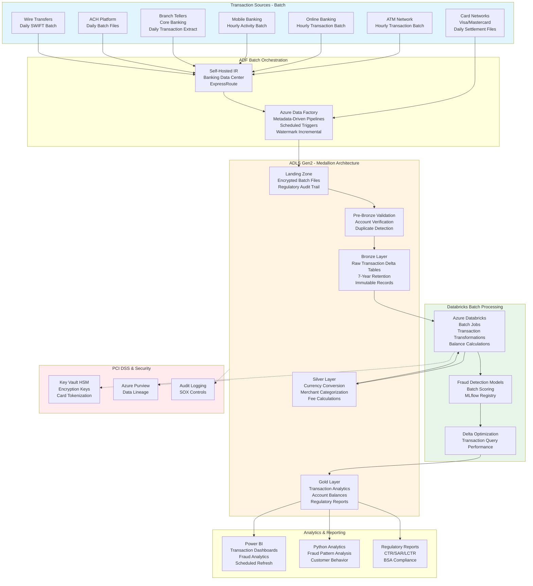

# Banking Transaction Processing Pipeline

## Standardized Azure Data Engineering Workflow

**This project follows the standard Azure Data Engineering architecture pattern:**

**Data Flow:** `Banking Channels → ADF Batch Orchestration → ADLS Medallion (Bronze → Silver → Gold) → Power BI / Python Analytics`

### Workflow Components:

1. **Azure Data Factory (ADF)** - Banking transaction batch ingestion
   - Scheduled hourly/daily batch pipelines for all channels
   - ATM hourly batches, card daily settlements, ACH daily files
   - Watermark-based incremental extraction
   - ExpressRoute connectivity to core banking

2. **ADLS Gen2 Medallion Architecture** - PCI-compliant transaction data lake
   - **Landing**: Encrypted batch files with regulatory audit trail
   - **Pre-Bronze**: Account validation, duplicate detection, sufficient funds checks
   - **Bronze**: Immutable transaction Delta tables (7-year retention)
   - **Silver**: Currency conversion, merchant categorization, fee calculations
   - **Gold**: Transaction analytics, account balances, fraud scores, regulatory reports

3. **Azure Databricks** - Transaction processing batch jobs
   - Balance calculations and posting logic
   - Fraud detection model batch scoring (MLflow)
   - Merchant analytics and categorization
   - Daily reconciliation processing

4. **Power BI + Python** - Banking analytics and compliance
   - Transaction dashboards and fraud analytics
   - Regulatory report generation (CTR/SAR/LCTR)
   - Python fraud pattern analysis and customer behavior modeling

## Architecture Flow Diagram

## 1. Project Overview & Business Problem

The banking institution faces critical challenges processing high volumes of financial transactions across channels including ATMs, online banking, mobile applications, branch tellers, and payment networks. Legacy transaction processing systems struggle with peak loads during month-end, payroll periods, and holiday shopping seasons causing delays in transaction posting, account balance updates, and customer notifications. Fragmented transaction data across core banking systems, payment processors, card networks, and merchant acquirers prevents comprehensive fraud detection, regulatory reporting, and customer analytics. Manual reconciliation processes consume significant operations team effort comparing transactions across systems, investigating discrepancies, and resolving posting errors. This project establishes a modern Azure transaction processing pipeline handling real-time transaction streams, enabling immediate fraud detection, supporting regulatory compliance, and providing comprehensive transaction analytics across all banking channels and products.

The platform transforms banking operations by creating unified transaction processing with real-time fraud scoring, immediate balance updates, and comprehensive audit trails. By integrating core banking systems, ATM networks, card payment processors, ACH platforms, wire transfer systems, and merchant acquirers, the bank gains complete visibility into all financial transactions flowing through the institution. The solution supports ultra-low-latency streaming for real-time fraud detection and balance inquiries while maintaining complete transaction history for regulatory compliance and analytics. Advanced capabilities enable real-time fraud detection using machine learning models, transaction categorization for personal financial management, merchant analytics for business customers, and automated regulatory reporting including suspicious activity reports. The centralized architecture reduces fraud losses through immediate detection, improves customer experience through instant transaction visibility, ensures regulatory compliance through comprehensive monitoring, and enables data-driven product development through transaction analytics.

- **Legacy transaction systems cannot handle peak loads causing delays and poor customer experience.**
  Transaction posting delays during peak periods frustrate customers expecting instant banking services.
- **Fragmented transaction data across systems prevents comprehensive fraud detection and analytics.**
  Fraud patterns spanning channels go undetected when transaction data remains siloed.
- **Manual reconciliation processes consume operations resources and delay error resolution.**
  Multi-system transaction discrepancies require time-consuming manual investigation and correction.
- **Azure Event Hubs, Databricks, and Cosmos DB enable scalable real-time transaction processing.**
  Cloud architecture supports millions of daily transactions with sub-second latency requirements.
- **Operations, fraud, compliance, and product teams benefit from unified transaction insights.**
  Cross-functional collaboration improves through shared transaction visibility and consistent metrics.

## 2. Requirement Gathering & Analysis

The requirements phase engages operations, fraud prevention, compliance, product management, and technology teams to understand transaction sources, processing requirements, and regulatory obligations. Data source mapping identifies core banking system, ATM switch, card processor networks (Visa, Mastercard), ACH platform, wire transfer system, mobile banking backend, and merchant acquiring platforms. Each source requires documentation covering transaction message formats, settlement timing, reconciliation requirements, and regulatory reporting needs. Stakeholder workshops identify critical capabilities including real-time fraud scoring, immediate balance posting, duplicate detection, transaction categorization, and regulatory suspicious activity reporting.

Business requirements emphasize ultra-low-latency processing for card authorizations and ATM withdrawals requiring responses within 100-200 milliseconds while batch settlement processing executes during designated windows. The team documents transaction processing logic including balance calculations, overdraft fee assessments, rewards point accrual, and interest calculations. Fraud detection requirements specify real-time scoring using machine learning models evaluating transaction amount, merchant category, location, time, and customer behavior patterns with configurable risk thresholds triggering alerts or blocks.

Security and compliance requirements encompass PCI DSS for payment card data, Bank Secrecy Act for suspicious activity monitoring, Regulation E for electronic fund transfer disclosures, SOX financial controls, and comprehensive audit trails for regulatory examinations. Access control matrices define role-based permissions with segregation of duties between transaction processing and fraud investigation functions. Integration requirements include real-time APIs for mobile banking balance inquiries, event streams for fraud alert generation, and batch feeds for general ledger posting.

- **Map core banking, ATM, card networks, ACH, wire, mobile, and merchant systems.**
  Document transaction message formats, settlement timing, and reconciliation specifications.
- **Identify real-time streaming for card/ATM transactions plus batch for ACH settlement.**
  Define SLAs requiring authorization responses within 200ms and fraud scoring within seconds.
- **Estimate processing 50 million daily transactions across all channels and products.**
  Plan for 30% peak capacity during month-end and holiday periods with 99.99% availability.
- **Define quality rules for duplicate detection, balance validation, and transaction matching.**
  Implement reconciliation checks ensuring all transactions post correctly with audit trails.
- **Gather transformation logic for balance calculations, fees, rewards, and interest accrual.**
  Document regulatory compliance rules for overdraft, fraud reporting, and audit requirements.
- **Enforce PCI DSS with card number tokenization and BSA with suspicious activity monitoring.**
  Implement comprehensive audit logging supporting regulatory examinations and fraud investigations.
- **Plan integrations with mobile apps, fraud systems, general ledger, and regulatory platforms.**
  Ensure API performance supporting real-time balance inquiries and fraud alert delivery.

## 3. Azure Architecture Setup

The architecture establishes Azure Event Hubs as the high-throughput transaction ingestion layer with partitioning supporting millions of events per second and configurable retention enabling replay for reconciliation. Premium tier provides dedicated capacity ensuring consistent low latency during peak transaction periods. Azure Cosmos DB serves as the operational transaction database providing global distribution, single-digit millisecond read/write latency, and multi-region writes supporting worldwide banking operations with automatic failover.

Azure Databricks workspace deployment includes dedicated streaming clusters processing real-time transaction streams with structured streaming and Delta Lake for exactly-once processing semantics. Batch clusters handle settlement processing, reconciliation, and analytical workloads. Azure Synapse Analytics workspace combines serverless SQL pools for ad-hoc transaction queries with dedicated pools for regulatory reporting and fraud analysis supporting compliance and operations teams.

Azure Machine Learning workspace hosts fraud detection models with online endpoints providing real-time scoring APIs integrated into transaction processing flows. Model monitoring tracks prediction accuracy and data drift triggering retraining workflows. Azure Functions provide serverless compute for transaction validation, enrichment, and routing logic with event-driven triggers from Event Hubs. Azure Key Vault manages encryption keys, database credentials, and API secrets with HSM protection. Networking implements ExpressRoute for low-latency connectivity to core banking systems with private endpoints for all Azure services ensuring security and performance.

- **Deploy Event Hubs Premium for high-throughput transaction ingestion with dedicated capacity.**
  Configure 32 partitions supporting millions of transactions with configurable retention for replay.
- **Deploy Cosmos DB with multi-region writes for global transaction database.**
  Enable automatic failover and single-digit millisecond latency for balance inquiries.
- **Set up Azure Databricks with dedicated streaming clusters for real-time processing.**
  Configure structured streaming with checkpointing ensuring exactly-once transaction processing.
- **Create Synapse Analytics workspace with dedicated pools for fraud analysis.**
  Size appropriately supporting concurrent regulatory reporting and fraud investigation queries.
- **Deploy Azure Machine Learning for fraud detection model hosting with online endpoints.**
  Enable real-time scoring APIs integrated into transaction authorization flows.
- **Deploy Azure Functions for transaction validation and enrichment logic.**
  Implement event-driven processing with Event Hubs triggers and Cosmos DB bindings.
- **Integrate Azure Key Vault with HSM protection for encryption keys.**
  Store card tokenization keys, database credentials, and model secrets with audit logging.
- **Configure Log Analytics workspace with comprehensive transaction audit capture.**
  Enable diagnostic settings from all services supporting regulatory compliance.
- **Implement ExpressRoute for low-latency connectivity to core banking systems.**
  Ensure consistent sub-100ms round-trip times for authorization requests.
- **Implement private endpoints for Event Hubs, Cosmos DB, and Synapse.**
  Disable public network access routing all transaction data through secure networks.
- **Configure hub-and-spoke virtual network with Azure Firewall.**
  Implement network security groups isolating transaction processing workloads.
- **Apply customer-managed encryption keys with automated rotation.**
  Enable HTTPS-only access and secure transfer required across all services.
- **Register transaction data assets in Azure Purview with financial data classifications.**
  Document lineage from source systems through processing to general ledger posting.

## 4. ADLS Folder Structure (Medallion Architecture)

The medallion architecture organizes banking transaction data with strict financial controls and comprehensive audit trails supporting regulatory requirements. Landing zone receives transaction messages from all channels with immediate encryption and sequence number validation. Pre-bronze layer implements banking-specific validation including account number verification, sufficient funds checking, duplicate transaction detection, and message format compliance.

Bronze layer preserves immutable transaction records in Delta Lake format maintaining complete audit trail required by regulatory examinations and dispute resolution. All transactions include comprehensive metadata supporting reconciliation including channel identifier, posting date, value date, settlement date, authorization codes, and merchant details. Silver layer applies transaction standardization including currency conversion, merchant categorization, fee calculations, and balance impacts creating consistent transaction records across channels.

Gold layer contains transaction data warehouse with transaction fact tables, account dimensions, merchant dimensions, and pre-calculated analytics including spending patterns, category summaries, and fraud scores. Pre-aggregated tables provide daily account balances, monthly statements, and regulatory reports. Archive layer maintains historical transactions meeting 7-year regulatory retention with immutable storage preventing tampering and supporting legal discovery.

- **Landing: High-throughput ingestion from Event Hubs with immediate encryption.**
  Implement sequence validation and duplication detection supporting exactly-once processing.
- **Pre-Bronze: Banking-specific validation checking account validity and sufficient funds.**
  Validate transaction formats, detect duplicates, and verify authorization codes.
- **Bronze: Immutable encrypted transaction records with comprehensive financial metadata.**
  Maintain complete audit trail supporting dispute resolution and regulatory examinations.
- **Silver: Standardized transactions with currency conversion and fee calculations.**
  Create consistent transaction records enabling cross-channel analytics and reporting.
- **Gold: Transaction data warehouse with balances, spending patterns, and fraud scores.**
  Enable customer analytics, fraud investigation, and regulatory compliance reporting.
- **Archive: Immutable 7-year transaction history meeting regulatory retention.**
  Support legal discovery and regulatory examinations with tamper-evident storage.

## 5. Source System Connectivity (ADF)

Source system connectivity integrates diverse banking channels with appropriate reliability and security. Core banking system connectivity uses database replication or change data capture extracting account master data, posted transactions, and balance snapshots through ExpressRoute ensuring low-latency secure connectivity. ATM switch connectivity leverages ISO 8583 message adapter ingesting real-time authorization requests and settlement files.

Card network connectivity integrates Visa and Mastercard processors using industry-standard formats extracting authorizations, settlements, and chargeback data. ACH platform connectivity retrieves batch files containing direct deposits, bill payments, and transfer instructions with cryptographic signature verification. Wire transfer system connectivity extracts SWIFT messages and domestic wires with sanction screening integration.

Event Hubs connectivity provides universal transaction ingestion endpoint accepting messages from all channels with protocol adapters normalizing formats. All connectivity implements comprehensive audit logging capturing transaction receipt timestamps, source identifiers, and message sequence numbers supporting reconciliation and dispute resolution.

- **Configure ExpressRoute connectivity to core banking system for low-latency access.**
  Ensure sub-100ms round-trip times supporting real-time balance inquiries.
- **Deploy ISO 8583 adapter for ATM switch integration with message parsing.**
  Handle authorization requests and settlement messages with appropriate timeouts.
- **Integrate card network processors using standard formats with encryption.**
  Extract authorizations, settlements, and chargebacks with reconciliation support.
- **Connect ACH platform for batch file ingestion with signature verification.**
  Validate file integrity and authenticate source before transaction processing.
- **Integrate wire systems with SWIFT message parsing and sanction screening.**
  Implement required compliance checks before wire transfer execution.
- **Deploy Event Hubs protocol adapters normalizing diverse message formats.**
  Provide universal ingestion endpoint accepting transactions from all channels.
- **Implement comprehensive audit logging capturing receipt timestamps and sequences.**
  Support transaction reconciliation and regulatory audit requirements.

## 6. Ingestion Framework (Event-Driven Architecture)

The event-driven ingestion framework processes transaction streams with ultra-low latency supporting real-time banking operations. Event Hubs consumer groups enable parallel processing by transaction type with authorization consumers prioritizing low-latency responses and settlement consumers handling batch processing. Azure Functions implement transaction validation logic including account existence checks, format validation, and duplicate detection with immediate rejection responses for invalid transactions.

Streaming pipelines in Databricks consume Event Hubs partitions using structured streaming with exactly-once processing semantics ensured through Delta Lake checkpointing. Transaction enrichment joins incoming messages with account master data, merchant information, and customer profiles from Cosmos DB. Fraud scoring invokes Azure ML endpoints with transaction features calculating real-time risk scores with configurable thresholds triggering alerts or automatic blocks.

Balance posting updates Cosmos DB account records with optimistic concurrency control preventing race conditions during concurrent transactions. The framework implements comprehensive error handling with dead letter queues for failed transactions requiring manual investigation. Transaction lifecycle tracking maintains status throughout authorization, posting, settlement, and reconciliation stages with event sourcing patterns enabling complete audit trails.

- **Design Event Hubs consumer groups by transaction type enabling parallel processing.**
  Prioritize authorization consumers for low-latency and settlement for throughput.
- **Implement Azure Functions for transaction validation with sub-second execution.**
  Validate account existence, format compliance, and duplicate detection immediately.
- **Configure Databricks structured streaming with Delta Lake checkpointing.**
  Ensure exactly-once transaction processing preventing duplicates or loss.
- **Implement transaction enrichment joining with account, merchant, and customer data.**
  Retrieve reference data from Cosmos DB with caching for performance.
- **Integrate fraud scoring invoking ML endpoints with configurable risk thresholds.**
  Calculate real-time fraud scores triggering alerts or blocks for high-risk transactions.
- **Implement balance posting with optimistic concurrency in Cosmos DB.**
  Prevent race conditions during concurrent transactions with retry logic.
- **Create comprehensive error handling with dead letter queues for investigations.**
  Route failed transactions for manual review with detailed error context.
- **Implement transaction lifecycle tracking with event sourcing patterns.**
  Maintain complete status history throughout authorization, posting, and settlement.
- **Design event-driven triggers for authorization, settlement, and batch processing.**
  Balance real-time requirements with batch settlement window constraints.
- **Add transaction reconciliation validating posting completion across systems.**
  Compare Event Hubs ingestion counts with Cosmos DB posted transactions.

## 7. Pre-Bronze Validations

Pre-bronze validation implements banking-specific quality checks ensuring transaction integrity and regulatory compliance. Account validation verifies account numbers exist in core banking system, accounts are active, and account types support requested transaction types. Authorization validation checks authorization codes match expected formats, amounts fall within configured limits, and merchant IDs are valid.

Duplicate detection compares incoming transactions against recent history using transaction IDs, amounts, timestamps, and merchant identifiers preventing duplicate posting. Sufficient funds checking verifies available balances cover transaction amounts plus applicable fees with overdraft limit consideration. Currency validation ensures currency codes are valid with exchange rate availability for foreign transactions.

Validation results log with transaction impact severity determining immediate rejection versus flagging for review. Failed validations impacting customer accounts trigger immediate notifications to operations teams. Comprehensive validation metrics support operations dashboards tracking rejection rates by validation rule and channel.

- **Validate account numbers checking existence, active status, and transaction eligibility.**
  Reject transactions to closed accounts or invalid account numbers immediately.
- **Validate authorization codes checking format compliance and merchant ID validity.**
  Detect fraudulent authorizations with invalid or suspicious merchant identifiers.
- **Validate duplicate transactions comparing against recent history with fuzzy matching.**
  Prevent double posting from retry attempts or system errors.
- **Validate sufficient funds checking available balance covers amounts plus fees.**
  Consider overdraft limits and pending authorization holds in availability calculations.
- **Validate currency codes with exchange rate availability for foreign transactions.**
  Detect invalid currencies preventing incomplete international transaction processing.
- **Store validation results with transaction impact severity for prioritized handling.**
  Enable immediate rejection for critical failures and flagging for review of warnings.
- **Alert operations teams for validation failures impacting customer accounts.**
  Provide detailed error context facilitating rapid investigation and resolution.

## 8. Bronze Layer Processing

Bronze layer establishes immutable audit trail of all banking transactions with regulatory-compliant retention and security. Authorization requests, settlement files, ACH batches, and wire transfers land in Delta Lake tables encrypted with customer-managed keys meeting banking security standards. Technical metadata includes comprehensive transaction details capturing authorization codes, merchant information, settlement dates, and fee calculations supporting reconciliation and dispute resolution.

Streaming ingestion from Event Hubs uses Databricks Autoloader with exactly-once processing semantics preventing duplicate transaction recording impacting customer balances. Checkpoint management ensures processing resumes correctly after failures without transaction loss critical for financial accuracy. Minimal transformations include message parsing, timestamp normalization, and currency conversion while preserving complete original transaction messages for compliance and investigations.

Partition strategy uses transaction date and channel enabling efficient regulatory reporting queries and reconciliation workloads. Immutable storage prevents transaction record tampering meeting regulatory audit requirements. Schema evolution handles payment network upgrades introducing new message fields without processing disruptions.

- **Store immutable encrypted transactions in Delta format with comprehensive metadata.**
  Maintain complete audit trail supporting dispute resolution and regulatory compliance.
- **Maintain streaming checkpoint state ensuring exactly-once transaction processing.**
  Prevent duplicate posting or transaction loss impacting customer account accuracy.
- **Track comprehensive metadata capturing authorization codes and merchant details.**
  Support fraud investigations, dispute resolution, and customer service inquiries.
- **Apply minimal transformations preserving complete original transaction messages.**
  Maintain unaltered source records for compliance audits and legal discovery.
- **Partition bronze tables by transaction date and channel optimizing queries.**
  Enable efficient regulatory reporting and channel-specific reconciliation.
- **Enable immutable storage preventing transaction record tampering.**
  Meet regulatory audit requirements with tamper-evident transaction history.

## 9. Silver Layer Transformations (Databricks + PySpark)

Silver layer transformations create standardized transaction records enabling comprehensive analytics and regulatory reporting. Transaction normalization standardizes formats across channels mapping ATM, card, ACH, and wire transactions to consistent schemas. Merchant categorization applies MCC codes and proprietary taxonomy enabling spending analysis and rewards calculations.

Currency conversion applies official exchange rates consistently with multiple rate scenarios supporting accounting and customer reporting requirements. Fee calculations apply configurable rules based on account type, transaction type, and customer relationship with automatic fee reversals for qualifying customers. Balance impact calculations determine debit/credit posting with overdraft fee assessments and interest accrual.

Transaction categorization applies rule-based and machine learning approaches classifying transactions for personal financial management features. Fraud enrichment appends fraud scores, risk factors, and historical patterns supporting investigation workflows. Data quality scoring assigns confidence levels based on data completeness, merchant information quality, and reconciliation status.

- **Normalize transactions standardizing formats across ATM, card, ACH, and wire channels.**
  Apply consistent schemas enabling cross-channel analytics and reporting.
- **Categorize merchants applying MCC codes and proprietary taxonomy for analytics.**
  Enable spending pattern analysis and rewards program eligibility calculations.
- **Convert currencies applying official exchange rates with multiple rate scenarios.**
  Support accounting requirements and customer statement generation.
- **Calculate fees applying configurable rules based on account and transaction types.**
  Implement fee waivers for qualifying customers with automatic reversal processing.
- **Calculate balance impacts determining posting amounts with overdraft assessments.**
  Apply interest accrual rules and fee calculations for complete balance management.
- **Categorize transactions for personal financial management using ML models.**
  Classify spending into categories supporting customer budgeting and insights.
- **Enrich with fraud scores and risk factors supporting investigation workflows.**
  Append historical fraud patterns and behavioral anomalies for analyst review.
- **Assign data quality scores based on completeness and reconciliation status.**
  Flag incomplete transactions requiring additional investigation or correction.
- **Use MERGE INTO for efficient incremental processing of settlement and adjustment.**
  Update authorization records with settlement details maintaining transaction lifecycle.
- **Use structured streaming for continuous real-time transaction processing.**
  Benefit from exactly-once semantics and automatic checkpoint management.
- **Apply partition pruning using date-based partitions optimizing queries.**
  Enable efficient regulatory reporting and customer statement generation.
- **Enforce Delta constraints on transaction ID uniqueness and temporal validity.**
  Reject duplicate transactions with violations logged to exception tables.
- **Document transformation logic with fee rules and categorization algorithms.**
  Maintain transparency for auditors and compliance teams understanding calculations.
- **Validate output comparing transaction counts and amount totals against bronze.**
  Implement reconciliation ensuring no transaction loss or amount discrepancies.

## 10. Gold Layer Aggregations

Gold layer delivers transaction analytics optimized for customer insights, fraud detection, and regulatory reporting. Transaction fact table captures all financial transactions with account, merchant, channel, and date foreign keys enabling flexible analysis. Daily balance snapshot fact provides point-in-time account balances supporting statement generation and regulatory reporting.

Account dimension contains customer account master with account type, opening date, status, and product attributes. Merchant dimension provides merchant master with category, location, fraud risk scores, and transaction statistics. Channel dimension captures transaction source with processing rules and fee schedules.

Pre-aggregated tables compute daily transaction summaries, monthly spending by category, and account balance history accelerating customer statements and regulatory reports. Fraud analytics tables store transaction risk scores, investigation status, and fraud loss amounts. Regulatory reporting tables follow required formats for currency transaction reports, suspicious activity reports, and large cash transaction reports.

- **Build transaction fact table with account, merchant, channel, and date keys.**
  Include amounts, fees, authorization codes, and fraud scores for comprehensive analysis.
- **Build daily balance snapshot fact capturing point-in-time account balances.**
  Support statement generation and regulatory balance reporting requirements.
- **Build account dimension with product attributes and customer relationships.**
  Include account opening dates, status, and fee schedule assignments.
- **Design star schema optimized for customer analytics and regulatory reporting.**
  Ensure referential integrity between facts and dimensions with surrogate keys.
- **Create pre-aggregated daily transaction summaries and monthly spending tables.**
  Accelerate statement generation and customer spending insight delivery.
- **Compute transaction KPIs for average amounts, frequency, and category distributions.**
  Apply consistent calculation methodologies ensuring metric standardization.
- **Build fraud analytics tables storing risk scores and investigation outcomes.**
  Enable fraud loss tracking, model performance monitoring, and trend analysis.
- **Create regulatory reporting tables following CTR, SAR, and LCTR formats.**
  Pre-structure data matching regulatory submission requirements.

## 11. Delta Lake Optimization Techniques

Delta Lake optimization ensures transaction queries maintain high performance supporting real-time operations and analytics. OPTIMIZE commands consolidate small files from streaming ingestion into right-sized files reducing metadata overhead. ZORDER BY clauses organize data by account, date, and merchant enabling effective data skipping for customer queries and fraud investigations.

VACUUM operations remove old file versions with retention periods supporting transaction investigations and regulatory examinations. Auto-optimize features enabled on high-velocity transaction tables automatically compact files during writes. Bloom filters on account ID and transaction ID enable fast point lookups supporting customer service inquiries and fraud alert investigations.

Table caching stores frequently accessed account and merchant dimensions in cluster memory accelerating transaction processing. Partition strategy balances account-centric queries with regulatory reporting using date partitions for facts and no partitions for slowly changing dimensions.

- **Use OPTIMIZE with ZORDER BY account_id, transaction_date, merchant_id for skipping.**
  Cluster transaction data enabling effective skipping for customer and fraud queries.
- **Use VACUUM with 90-day retention supporting investigations and audit requirements.**
  Balance storage costs with time-travel needs for regulatory examination support.
- **Enable auto-compaction on high-velocity transaction tables from streaming ingestion.**
  Automatically consolidate streaming micro-batch files maintaining query performance.
- **Use caching for account and merchant dimension tables supporting processing.**
  Store frequently accessed master data in cluster memory enabling fast lookups.
- **Use data skipping via Delta statistics on account, date, and channel columns.**
  Avoid scanning irrelevant transactions improving statement generation performance.
- **Partition fact tables by transaction date enabling efficient regulatory reporting.**
  Align partitioning with regulatory submission periods and statement generation.
- **Use schema evolution managing payment network upgrades adding fields.**
  Handle new transaction types and enrichment attributes without failures.
- **Tune shuffle partitions based on cluster size and transaction volumes.**
  Optimize shuffle operations during aggregations and fraud scoring.

## 12. Consumption Layer (Synapse + Cosmos DB APIs)

The consumption layer provides customers, analysts, and regulators secure, performant access to transaction data. Cosmos DB APIs serve real-time transaction queries from mobile banking apps with single-digit millisecond latency supporting balance inquiries and recent transaction retrieval. Change feed enables reactive applications with immediate notifications for posted transactions supporting push notifications and fraud alerts.

Synapse serverless SQL pools provide external tables referencing transaction gold Delta tables enabling SQL-based regulatory reporting. Views implement pre-computed customer analytics including spending patterns, category summaries, and year-over-year comparisons. Dedicated SQL pools serve fraud analysts with high-performance queries across large transaction datasets.

Power BI dashboards deliver transaction analytics to operations, product, and executive teams with role-based access controls. Real-time fraud dashboards monitor current fraud scores and alert queues using DirectQuery. Historical transaction trend reports use imported models with incremental refresh optimizing performance.

- **Deploy Cosmos DB APIs providing real-time transaction queries for mobile apps.**
  Enable sub-10ms latency balance inquiries and transaction history retrieval.
- **Use Cosmos DB change feed for reactive applications and push notifications.**
  Implement immediate customer notifications for posted transactions and fraud alerts.
- **Create external tables in Synapse serverless SQL for regulatory reporting.**
  Enable SQL-based CTR, SAR, and audit report generation.
- **Use views pre-computing customer spending patterns and category summaries.**
  Simplify application development encapsulating complex aggregation logic.
- **Deploy Synapse dedicated pools for fraud analyst queries across large datasets.**
  Support investigation workflows requiring complex joins and pattern analysis.
- **Build Power BI dashboards with transaction analytics and fraud monitoring.**
  Apply DAX formulas for fraud loss calculations and operational metrics.
- **Implement row-level security filtering by account relationship and authorization.**
  Enforce least-privilege access restricting transaction visibility to authorized personnel.

## 13. Monitoring & Alerting

Comprehensive monitoring ensures transaction pipeline reliability supporting banking operations. Azure Monitor collects metrics from Event Hubs tracking ingestion rates, consumer lag, and throughput ensuring real-time processing keeps pace with transaction volumes. Cosmos DB monitoring tracks request units, latency percentiles, and throttling events ensuring consistent performance during peak loads.

Databricks monitoring captures streaming job performance with alerts for checkpoint failures or processing delays. Transaction reconciliation monitoring compares ingested, processed, and posted transaction counts detecting discrepancies requiring investigation. Fraud detection monitoring tracks fraud score distributions, alert volumes, and investigation outcomes.

Business continuity monitoring validates disaster recovery configurations, backup completion, and multi-region replication status. SLA tracking measures authorization response times, fraud scoring latency, and balance update delays against business requirements. Compliance monitoring tracks regulatory report generation, suspicious activity flagging, and audit log completeness.

- **Monitor Event Hubs tracking ingestion rates and consumer lag by partition.**
  Alert when real-time processing falls behind potentially delaying transactions.
- **Monitor Cosmos DB tracking latency, throttling, and regional replication status.**
  Ensure consistent performance during peak loads and verify disaster recovery readiness.
- **Enable Databricks monitoring capturing streaming checkpoint health and delays.**
  Track processing latency ensuring sub-second fraud scoring and posting.
- **Implement transaction reconciliation monitoring comparing counts across systems.**
  Detect missing or duplicate transactions requiring investigation.
- **Monitor fraud detection tracking alert volumes and investigation completion.**
  Ensure fraud analysts review flagged transactions within SLA timeframes.
- **Validate business continuity with backup completion and failover testing.**
  Ensure disaster recovery capabilities meet banking availability requirements.
- **Implement SLA tracking measuring authorization response and posting latency.**
  Monitor against 200ms authorization and 5-second posting requirements.
- **Monitor compliance tracking regulatory report generation and SAR filings.**
  Ensure timely suspicious activity reporting meeting legal obligations.
- **Build operations dashboards visualizing transaction flow health and performance.**
  Provide unified monitoring supporting banking operations and technology teams.

## 14. Security & Governance

Comprehensive security controls ensure PCI DSS and banking regulatory compliance protecting financial data. Azure Key Vault stores encryption keys with HSM protection meeting PCI DSS cryptographic key management requirements. Card tokenization replaces primary account numbers with tokens throughout processing preventing card data exposure.

Private endpoints ensure all transaction data flows through private networks with ExpressRoute connectivity to core banking systems. Network security groups implement least-privilege access with comprehensive flow logging. Azure Purview catalogs transaction data assets with automated sensitive data discovery and lineage tracking supporting governance.

Segregation of duties controls separate transaction processing from fraud investigation with technical enforcement through role-based access controls. Comprehensive audit logging captures all transaction access and modifications supporting regulatory examinations and SOX compliance. Immutable storage prevents transaction record tampering meeting audit requirements.

- **Store encryption keys in Key Vault with HSM protection meeting PCI DSS.**
  Implement comprehensive key access auditing supporting compliance requirements.
- **Tokenize card numbers throughout processing preventing PAN exposure.**
  Replace primary account numbers with tokens in all non-payment systems.
- **Use managed identities for service-to-service authentication eliminating credentials.**
  Avoid password management overhead and security risks from exposure.
- **Enable private endpoints with ExpressRoute connectivity to banking systems.**
  Ensure sub-100ms latency while maintaining secure private connectivity.
- **Implement network security groups enforcing least-privilege access.**
  Segment transaction processing into security zones with minimal connectivity.
- **Apply segregation of duties separating processing from investigation access.**
  Implement technical controls enforcing organizational separation through RBAC.
- **Encrypt all data in transit using TLS 1.2 with mutual authentication.**
  Implement certificate-based authentication for external payment network connectivity.
- **Encrypt all data at rest using customer-managed keys meeting banking standards.**
  Apply field-level encryption for card data meeting PCI DSS requirements.
- **Implement Azure Purview for data cataloging and lineage tracking.**
  Enable automated governance policies based on financial data classifications.
- **Enable comprehensive audit logging capturing all transaction modifications.**
  Support regulatory examinations and SOX compliance with detailed trails.

## 15. CI/CD Pipeline Setup (Azure DevOps or GitHub Actions)

CI/CD pipelines automate transaction platform deployments with appropriate validation and controls. Azure DevOps repositories store Event Hubs configurations, Databricks streaming jobs, fraud models, and infrastructure templates with branch protection requiring compliance review before production deployment.

ARM templates define compliant infrastructure including encryption, network isolation, and audit logging with environment-specific parameters. Release pipelines deploy to development first with automated testing including transaction simulation, fraud model validation, and reconciliation checks.

Approval gates require operations and compliance validation before production deployment ensuring business readiness. MLflow integration tracks fraud model versions with comprehensive performance metrics. Automated rollback procedures enable rapid reversion if production issues detected.

- **Use Git integration storing Event Hubs and Databricks configurations.**
  Enable version control and compliance review workflows.
- **Use Databricks Repos syncing streaming jobs across environments.**
  Support collaborative development with automated deployment.
- **Use ARM templates deploying compliant infrastructure consistently.**
  Parameterize security configurations ensuring compliance.
- **Use YAML pipelines automating build, test, and deployment.**
  Standardize CI/CD with transaction simulation and validation gates.
- **Parameterize deployments with environment-specific configurations.**
  Externalize fraud thresholds and processing rules avoiding hardcoded values.
- **Use approval gates requiring operations and compliance validation.**
  Implement manual checkpoints ensuring business readiness.
- **Implement automated testing with transaction simulation and validation.**
  Test authorization flows, fraud scoring, and reconciliation before production.
- **Deploy infrastructure with automated rollback capabilities.**
  Enable rapid reversion if production issues detected post-deployment.
- **Implement incremental deployment updating only changed components.**
  Minimize disruption to operational transaction processing.
- **Document CI/CD workflows with validation procedures.**
  Provide operational guidance ensuring compliance during deployments.

## 16. Performance Optimization

Performance optimization ensures transaction processing meets ultra-low-latency requirements supporting real-time banking. Event Hubs throughput unit scaling accommodates peak transaction volumes with auto-inflate enabled during month-end periods. Cosmos DB request unit provisioning supports required throughput with autoscaling during peaks.

Databricks cluster sizing uses appropriate VM types for streaming workloads with optimized Spark configurations. Fraud scoring API optimization implements caching, connection pooling, and batch prediction where acceptable. Delta Lake optimizations maintain query performance for customer statements and regulatory reporting.

- **Scale Event Hubs throughput units supporting peak transaction volumes.**
  Enable auto-inflate handling month-end and holiday shopping surges.
- **Provision Cosmos DB request units with autoscaling for peak loads.**
  Ensure consistent sub-10ms latency during high-volume periods.
- **Tune Databricks clusters with appropriate VM types for streaming.**
  Optimize Spark configurations for ultra-low-latency processing.
- **Optimize fraud scoring APIs with caching and connection pooling.**
  Balance fraud detection accuracy with latency requirements.
- **Use Delta Lake OPTIMIZE with ZORDER BY account, date, merchant.**
  Maintain query performance for customer statements and analytics.
- **Implement result caching for frequently accessed customer balances.**
  Reduce Cosmos DB load for repeated balance inquiries.

## 17. Cost Optimization

Cost optimization balances transaction processing requirements with budgets. Event Hubs capacity planning avoids over-provisioning with auto-inflate during peaks. Cosmos DB autoscaling matches actual throughput requirements. Databricks autoscaling adjusts cluster sizes based on transaction volumes.

ADLS lifecycle management transitions aged transactions to cool tier reducing costs. Query optimization minimizes Cosmos DB request unit consumption. Cost allocation enables chargeback models.

- **Right-size Event Hubs capacity with auto-inflate for peaks.**
  Avoid over-provisioning while handling volume surges.
- **Use Cosmos DB autoscaling matching actual throughput.**
  Pay only for required request units during normal operations.
- **Enable Databricks autoscaling based on transaction volumes.**
  Scale down during off-peak periods reducing costs.
- **Use cool storage for aged transactions meeting retention.**
  Reduce storage costs while maintaining accessibility.
- **Optimize queries minimizing Cosmos DB request consumption.**
  Implement efficient query patterns and appropriate indexing.
- **Implement cost allocation tags enabling chargeback.**
  Attribute costs to business units and product lines.

## 18. Documentation & KT

Comprehensive documentation ensures successful transaction operations and regulatory compliance. Architecture diagrams illustrate transaction flows from channels through processing to posting using industry-standard notation. Transaction processing specifications document message formats, validation rules, and posting logic.

Runbooks provide operational procedures for transaction investigations, reconciliation, fraud alert handling, and disaster recovery. Compliance documentation demonstrates PCI DSS and BSA controls implementation. Knowledge transfer covers architecture, operations, fraud detection, and compliance.

- **Prepare architecture diagrams showing transaction flows from channels.**
  Include processing stages, fraud scoring, and posting sequences.
- **Create transaction specifications documenting formats and validation.**
  Provide detailed message structures and processing rules.
- **Create operational runbooks for investigations and reconciliation.**
  Define procedures for common issues and escalation paths.
- **Document PCI DSS and BSA compliance controls for examinations.**
  Provide evidence demonstrating regulatory compliance.
- **Conduct knowledge transfer covering operations and fraud detection.**
  Record training sessions for operational teams.
- **Provide executive summary documenting fraud reduction and improvements.**
  Include performance metrics and business value delivered.

