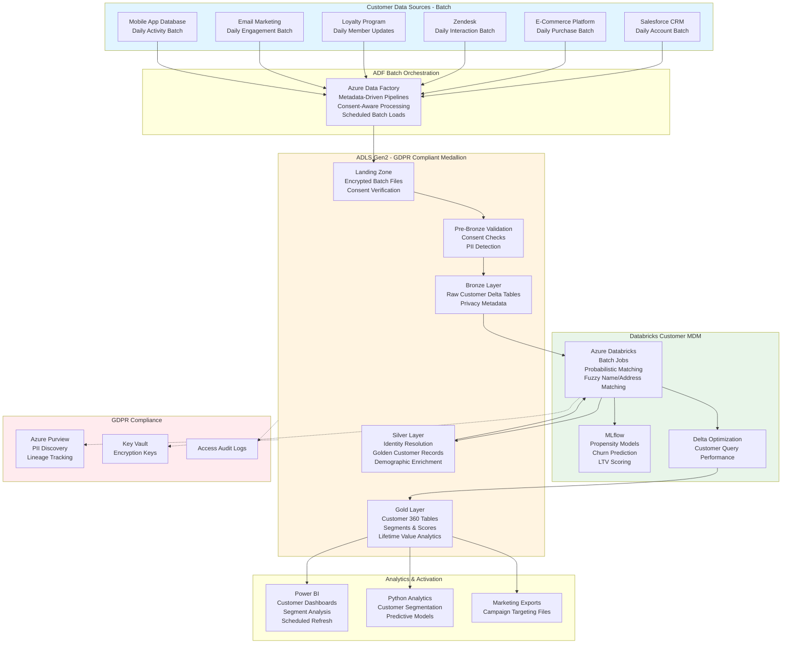

# Customer Data Management System

## Standardized Azure Data Engineering Workflow

**This project follows the standard Azure Data Engineering architecture pattern:**

**Data Flow:** `CRM/Marketing Systems → ADF Batch Orchestration → ADLS Medallion (Bronze → Silver → Gold) → Power BI / Python Analytics`

### Workflow Components:

1. **Azure Data Factory (ADF)** - Customer data batch ingestion with consent management
   - Metadata-driven pipelines for CRM, e-commerce, service systems
   - Daily batch profile loads with consent-aware processing
   - Watermark-based incremental extraction
   - GDPR-compliant batch workflows

2. **ADLS Gen2 Medallion Architecture** - Privacy-compliant customer data lake
   - **Landing**: Encrypted customer batch files with consent verification
   - **Pre-Bronze**: Consent validation, data minimization, PII detection
   - **Bronze**: Raw customer Delta tables with privacy metadata
   - **Silver**: Identity resolution, golden customer records, demographic enrichment
   - **Gold**: Customer 360 tables, segments, lifetime value, propensity scores

3. **Azure Databricks** - Customer MDM batch processing
   - Probabilistic customer matching (email/phone/address/fuzzy name)
   - Golden record creation with survivorship rules
   - Customer segmentation and scoring
   - MLflow propensity models

4. **Power BI + Python** - Customer analytics and activation
   - Customer dashboards with segment analysis
   - Python customer segmentation and churn prediction
   - Marketing campaign targeting file exports

## Architecture Flow Diagram

## 1. Project Overview & Business Problem

The organization faces critical challenges managing customer data across sales, marketing, service, and operations systems creating fragmented customer views and inconsistent experiences. Customer information resides in disparate CRM platforms, e-commerce databases, call center applications, loyalty programs, and transactional systems preventing unified understanding of customer relationships and preferences. Marketing teams execute campaigns without complete customer profiles missing personalization opportunities and risking customer fatigue from duplicate communications. Customer service representatives lack consolidated interaction histories requiring customers to repeat information across channels damaging satisfaction and loyalty. Manual customer data consolidation processes consume significant effort producing outdated snapshots that quickly become stale as customers interact across multiple touchpoints. This project establishes a modern Azure customer data platform creating unified customer profiles, enabling real-time personalization, supporting omnichannel experiences, and ensuring data quality and compliance across the customer data lifecycle.

The platform transforms customer engagement by creating 360-degree customer views combining demographic information, transaction history, interaction records, behavioral data, preference signals, and predictive insights. By integrating CRM systems, e-commerce platforms, customer service applications, loyalty programs, marketing automation tools, and transactional databases, organizations gain comprehensive customer understanding enabling personalized experiences and data-driven decisions. The solution supports both batch processing for historical profile building and real-time streaming for immediate personalization and next-best-action recommendations. Advanced analytics capabilities enable customer segmentation, lifetime value prediction, churn risk modeling, propensity scoring, and automated decisioning. The centralized architecture increases revenue through better targeting and personalization, reduces churn through proactive retention programs, improves customer satisfaction through consistent experiences, and ensures regulatory compliance through comprehensive data governance and consent management.

- **Customer data fragmentation across CRM, e-commerce, and service systems prevents unified views.**
  Marketing and service teams lack complete customer understanding hindering personalization and support.
- **Manual customer data consolidation delivers outdated profiles missing real-time interactions.**
  Stale customer insights prevent timely personalization and responsive customer service.
- **Duplicate customer records across systems waste marketing spend and confuse analytics.**
  Overlapping identities prevent accurate measurement of customer value and behavior.
- **Azure Data Factory, Databricks, and Synapse enable scalable customer data platform.**
  Cloud architecture supports real-time profile updates with required privacy and governance controls.
- **Marketing, sales, service, and analytics teams benefit from unified customer insights.**
  Cross-functional collaboration improves through shared customer views and consistent metrics.

## 2. Requirement Gathering & Analysis

The requirements phase engages marketing, sales, customer service, analytics, and privacy teams to understand data sources, use cases, and compliance requirements. Data source mapping identifies Salesforce CRM, e-commerce platform databases, Zendesk customer service system, loyalty program database, email marketing platform, mobile app backends, and transactional systems. Each source requires documentation covering customer identifiers, profile attributes, interaction types, and data refresh frequencies. Stakeholder workshops identify critical capabilities including golden customer record creation, identity resolution across channels, real-time profile enrichment, consent management, and data quality monitoring.

Business requirements emphasize real-time profile availability for personalization engines and customer service while batch processing suffices for analytical segmentation and modeling. The team documents data governance requirements including master data management policies, data quality rules, privacy regulations compliance, and access controls. Customer matching requirements specify deterministic rules using email and phone plus probabilistic algorithms for fuzzy name and address matching with confidence scoring.

Security and compliance requirements encompass GDPR right to access, right to erasure, consent tracking, data minimization, cross-border transfer restrictions, and comprehensive audit trails. Access control matrices define role-based permissions by function with field-level security for sensitive attributes. Integration requirements include real-time APIs for personalization engines, batch feeds for campaign segmentation, and event streams for trigger-based marketing automation.

- **Map CRM, e-commerce, service, loyalty, marketing, and transaction system sources.**
  Document customer identifiers, profile attributes, interaction types, and connectivity requirements.
- **Identify real-time streaming for web/mobile interactions plus daily batch for transactions.**
  Define SLAs requiring profile updates within seconds and complete refresh within 24 hours.
- **Estimate processing 500 million customer profiles with 1 billion daily interactions.**
  Plan for 25% annual growth from customer acquisition and increased digital engagement.
- **Define quality rules for identity resolution, address standardization, and data completeness.**
  Implement matching algorithms and validation checks ensuring profile accuracy.
- **Gather transformation logic for customer segments, lifetime value, and propensity scores.**
  Document calculation methodologies for segmentation models and predictive analytics.
- **Enforce GDPR compliance with consent management, data minimization, and erasure workflows.**
  Implement field-level encryption and access logging supporting privacy requirements.
- **Plan integrations with personalization engines, marketing automation, and service portals.**
  Ensure API performance supporting real-time profile access and event-driven automation.

## 3. Azure Architecture Setup

The architecture establishes Azure Data Lake Storage Gen2 as the centralized customer data repository with geo-redundant storage ensuring high availability for business-critical customer operations. GDPR compliance requires customer-managed encryption keys with automated rotation policies and comprehensive access auditing. Azure Data Factory serves as orchestration engine with integration runtimes supporting cloud and on-premises source connectivity through ExpressRoute ensuring low-latency data transfer.

Azure Databricks workspace deployment includes dedicated clusters for customer matching and profile processing with Unity Catalog providing centralized governance. MLflow integration supports customer propensity models with comprehensive model versioning and performance tracking. Azure Synapse Analytics workspace combines serverless SQL pools for ad-hoc customer queries with dedicated pools for segmentation and analytics supporting marketing and analytics users.

Event Hubs ingests real-time customer interaction streams from web, mobile, and IoT touchpoints with partitioning enabling parallel processing. Cosmos DB provides low-latency customer profile storage supporting personalization API requirements with global distribution for worldwide access. Azure Cognitive Services enables customer sentiment analysis from service interactions and content recommendations. Azure Purview provides comprehensive data cataloging with automated PII discovery and lineage tracking supporting governance and compliance.

- **Provision ADLS Gen2 with geo-redundant storage for customer profile data.**
  Configure lifecycle policies transitioning aged interaction data to cool tier after 90 days.
- **Deploy Azure Data Factory with cloud and self-hosted integration runtimes.**
  Integrate with CRM APIs, e-commerce databases, and on-premises service systems.
- **Set up Azure Databricks with MLflow for customer propensity model management.**
  Configure production clusters optimized for identity resolution and segmentation algorithms.
- **Create Synapse Analytics workspace with dedicated pools for customer segmentation.**
  Size appropriately supporting concurrent access from marketing and analytics teams.
- **Deploy Event Hubs for real-time ingestion of web, mobile, and IoT interactions.**
  Configure partition count supporting required throughput during peak engagement periods.
- **Deploy Cosmos DB for low-latency customer profile storage supporting APIs.**
  Enable global distribution with appropriate consistency levels for worldwide access.
- **Deploy Azure Cognitive Services for sentiment analysis and recommendations.**
  Integrate text analytics for customer feedback analysis and personalization.
- **Integrate Azure Key Vault for credential management with automated rotation.**
  Store API keys, database passwords, and encryption keys with RBAC access controls.
- **Configure Log Analytics workspace with comprehensive audit trail capture.**
  Enable diagnostic settings from all services supporting compliance auditing.
- **Implement private endpoints for ADLS, Synapse, Cosmos DB, and Event Hubs.**
  Disable public network access ensuring all customer data flows through secure networks.
- **Configure hub-and-spoke virtual network with centralized security controls.**
  Implement network security groups isolating customer data processing workloads.
- **Apply customer-managed encryption keys with automated rotation policies.**
  Enable HTTPS-only access and secure transfer required across all services.
- **Register customer data assets in Azure Purview with PII classifications.**
  Document lineage from source systems through transformations to applications.

## 4. ADLS Folder Structure (Medallion Architecture)

The medallion architecture organizes customer data with strict privacy controls and comprehensive audit trails supporting GDPR compliance. Landing zone receives customer profiles, interaction data, transaction records, and behavioral signals with immediate encryption and access logging. Pre-bronze layer implements privacy-specific validation including consent verification, data minimization checks, and PII detection ensuring compliant processing.

Bronze layer preserves immutable source customer data in Delta Lake format maintaining complete audit trail required by privacy regulations. All customer data includes encryption metadata, consent status, access timestamps, and data lineage information supporting right to access requests and breach notification. Silver layer applies customer data standardization including identity resolution, address normalization, demographic enrichment, and interaction attribution creating unified customer profiles.

Gold layer contains customer data warehouse with golden customer records, interaction history, transaction summaries, and calculated attributes including segments, lifetime value, propensity scores, and next-best-actions. Pre-aggregated tables provide customer cohort metrics, segment performance, and campaign response analysis. Archive layer maintains historical customer data supporting long-term analysis with automated erasure workflows for GDPR right to be forgotten requests.

- **Landing: Encrypted temporary storage for customer profiles, interactions, and transactions.**
  Implement immediate encryption and consent verification supporting privacy compliance.
- **Pre-Bronze: Privacy-specific validation checking consent status and data minimization compliance.**
  Validate PII handling appropriateness and detect unauthorized data collection attempts.
- **Bronze: Immutable encrypted customer data with comprehensive privacy metadata.**
  Maintain complete audit trail supporting GDPR right to access and breach notification.
- **Silver: Standardized customer data with identity resolution and demographic enrichment.**
  Create unified customer profiles resolving identities across touchpoints and channels.
- **Gold: Customer data warehouse with golden records, segments, and predictive scores.**
  Enable personalization, targeting, and analytics with privacy-compliant data access.
- **Archive: Historical customer data with automated erasure for right to be forgotten.**
  Support long-term analysis while enabling compliant customer data deletion.

## 5. Source System Connectivity (ADF)

Source system connectivity integrates diverse customer touchpoints with appropriate security and privacy controls. Salesforce CRM connectivity uses REST API with OAuth authentication extracting customer accounts, contacts, opportunities, and activities implementing field-level access controls respecting CRM permissions. E-commerce platform connectivity leverages database replication or API extraction for customer accounts, orders, and browsing behavior with PII encryption during transfer.

Customer service system connectivity extracts support tickets, interaction transcripts, and satisfaction surveys with sentiment analysis performed during ingestion. Loyalty program database connectivity retrieves member profiles, points balances, and redemption history. Marketing automation platform connectivity extracts email engagement metrics, campaign responses, and preference updates with consent status synchronization.

All connectivity implements comprehensive privacy logging capturing data extraction purposes, accessing user identities, and data elements accessed supporting GDPR accountability requirements. Connection monitoring validates consent records availability before customer data extraction preventing non-compliant processing.

- **Configure linked services for CRM API, e-commerce database, service system, and loyalty.**
  Store credentials in Key Vault with managed identity access from Data Factory.
- **Deploy self-hosted integration runtime for on-premises CRM and service systems.**
  Use ExpressRoute for secure low-latency connectivity supporting real-time requirements.
- **Validate connectivity testing API endpoints and database connections during setup.**
  Ensure firewall rules permit required protocols with encryption validation.
- **Configure retry policies with privacy-appropriate timeouts for transient failures.**
  Implement dead letter queues for failed extractions requiring investigation.
- **Tune database extraction using customer ID partitioning for large customer tables.**
  Extract interaction data using date-based partitioning maximizing throughput.
- **Encrypt all connections using TLS 1.2 with certificate validation.**
  Implement certificate-based authentication for external service connectivity.
- **Document connectivity matrix with privacy controls and data handling requirements.**
  Include consent validation checkpoints and PII encryption specifications.

## 6. Ingestion Framework (ADF – Metadata Driven)

The metadata-driven ingestion framework incorporates privacy-specific processing patterns and consent controls. Control tables store source system details, customer data types, consent requirements, PII handling flags, and erasure policies. The framework implements consent-aware processing respecting customer opt-outs for marketing while maintaining necessary processing for service delivery and legal obligations.

Lookup activities query control tables filtered by consent status and data sensitivity with high-priority sources like real-time interactions processing immediately while batch profile loads execute during maintenance windows. Copy activities implement privacy-specific transformations including PII pseudonymization for analytics, data minimization removing unnecessary fields, and consent status propagation ensuring consistent enforcement.

Event-driven triggers respond to Event Hub messages for real-time interaction processing and consent updates. The framework implements comprehensive privacy logging capturing all customer data access details supporting GDPR accountability and demonstrable compliance. Error handling distinguishes privacy violations requiring immediate investigation from technical failures warranting retry.

- **Design control tables storing source details, consent requirements, and PII handling flags.**
  Enable consent-aware processing respecting customer preferences and regulatory requirements.
- **Use Lookup activities querying control tables filtered by consent status and sensitivity.**
  Process only consented data preventing non-compliant marketing data usage.
- **Configure Copy activities with privacy-specific transformations and pseudonymization.**
  Implement PII removal for analytics and data minimization principles.
- **Implement real-time interaction processing using Event Hubs with consent filtering.**
  Enable immediate profile updates while respecting opt-out preferences.
- **Build comprehensive privacy logging capturing all customer data access purposes.**
  Support GDPR accountability demonstrating lawful basis for processing.
- **Create privacy-appropriate error handling distinguishing compliance from technical failures.**
  Alert privacy teams immediately for potential consent violations or unauthorized access.
- **Add identity resolution logic linking customer identities across systems and channels.**
  Implement deterministic and probabilistic matching with confidence scoring.
- **Implement comprehensive access logging supporting GDPR right to access requests.**
  Capture detailed trails of customer data processing for transparency reports.
- **Design real-time triggers for interaction streams and scheduled for profile batch loads.**
  Balance personalization timeliness requirements with system load management.
- **Add consent dependency ensuring consent records load before customer data processing.**
  Implement synchronization preventing processing without consent validation.

## 7. Pre-Bronze Validations

Pre-bronze validation implements privacy-specific quality checks ensuring compliant customer data processing. Consent validation verifies active consent exists for each processing purpose checking against consent management platform. PII detection identifies personal data elements ensuring appropriate handling and encryption are applied.

Customer identifier validation checks email format, phone number validity, and customer ID consistency across sources. Address validation standardizes formats, validates postal codes, and geocodes locations enabling consistent segmentation. Data minimization validation ensures only necessary customer data fields are collected for stated purposes.

Validation results log with privacy severity classifications determining immediate privacy team notification versus batch error reporting. Failed validations potentially violating consent or data minimization requirements trigger immediate alerts to privacy and compliance teams. Comprehensive validation metrics support privacy dashboards tracking compliance by source system and data type.

- **Validate consent status checking active permissions for each processing purpose.**
  Prevent processing customer data without appropriate lawful basis and consent.
- **Validate customer identifiers checking email format and phone number validity.**
  Detect invalid identifiers preventing orphaned customer records in analytics.
- **Validate addresses with standardization and geocoding for consistent segmentation.**
  Apply address parsing and postal code validation improving data quality.
- **Validate data minimization ensuring only necessary fields collected for purposes.**
  Detect unauthorized PII collection violating data minimization principles.
- **Detect PII in unexpected fields applying appropriate encryption and access controls.**
  Identify sensitive data requiring special handling and restricted access.
- **Store validation results with privacy severity classifications for prioritized review.**
  Enable immediate notification for consent violations or unauthorized data collection.
- **Move failed data to quarantine with privacy team alerting for compliance issues.**
  Provide detailed error context facilitating rapid privacy and technical resolution.

## 8. Bronze Layer Processing

Bronze layer establishes comprehensive audit trail of customer source data with privacy-compliant security and access controls. Customer profiles, interaction data, transaction records, and behavioral signals land in Delta Lake tables encrypted with customer-managed keys. Technical metadata includes comprehensive privacy logging capturing accessing user, timestamp, access purpose, consent status, and PII elements accessed supporting GDPR accountability.

Streaming ingestion from interaction sources uses Databricks Autoloader with exactly-once processing semantics preventing duplicate event recording. Checkpointing ensures processing resumes correctly after failures without data loss. Minimal transformations include timestamp normalization, JSON parsing for nested structures, and consent status tagging while preserving complete original customer data for compliance and audit.

Partition strategy uses customer ID hashing distributing data evenly while enabling efficient customer-centric queries. Retention policies maintain customer data with automated erasure workflows executing right to be forgotten requests. Schema evolution handles source system upgrades introducing new customer attributes without processing failures.

- **Store immutable encrypted customer data in Delta format with comprehensive privacy metadata.**
  Maintain complete audit trail supporting GDPR right to access and breach notification requirements.
- **Maintain streaming checkpoint state for interaction processing ensuring exactly-once semantics.**
  Prevent duplicate events impacting customer analytics and personalization decisions.
- **Track comprehensive privacy metadata capturing access details, consent status, and purposes.**
  Support GDPR accountability and demonstrable compliance with processing records.
- **Apply minimal transformations preserving complete original customer data for compliance.**
  Maintain unaltered source records for audit trail and privacy investigations.
- **Partition bronze tables using customer ID hash distributing data evenly.**
  Enable efficient customer-centric queries and privacy request processing.
- **Enable schema evolution handling source upgrades introducing new customer attributes.**
  Accommodate new PII fields and consent types without ingestion failures.

## 9. Silver Layer Transformations (Databricks + PySpark)

Silver layer transformations create unified customer profiles through comprehensive identity resolution and data enrichment. Customer matching implements deterministic and probabilistic algorithms combining email exact matches, phone number matching, fuzzy name and address similarity, and behavioral pattern correlation creating golden customer records spanning all touchpoints. Match confidence scoring enables manual review workflows for uncertain matches preventing incorrect profile merges impacting personalization and analytics.

Demographic enrichment appends third-party data for income estimates, life stage, interests, and behavioral attributes where consent permits. Address standardization applies USPS formatting, validates postal codes, and geocodes coordinates enabling location-based segmentation. Interaction attribution links touchpoints to customer journeys tracking conversion paths and channel effectiveness.

Customer lifetime value calculation aggregates historical transactions with predictive models estimating future value. Segment assignment applies rule-based and model-based logic classifying customers into actionable groups. Data quality scoring assigns confidence levels to profile attributes based on completeness, freshness, and source reliability enabling data-driven decisioning.

- **Clean customer data standardizing names, addresses, emails, and phone numbers.**
  Apply privacy-compliant parsing respecting consent for data enrichment and standardization.
- **Remove duplicate customers across systems using probabilistic matching with confidence scoring.**
  Link customer records across channels creating comprehensive unified profiles.
- **Perform address standardization with USPS validation and geocoding for segmentation.**
  Enable location-based targeting and consistent address representation.
- **Implement customer identity resolution creating golden records linking identities.**
  Apply deterministic email/phone matching and probabilistic name/address fuzzy matching.
- **Apply data quality checks validating profile completeness and attribute accuracy.**
  Detect implausible demographic values and stale interaction data requiring refresh.
- **Implement SCD Type 2 for customer master tracking attribute changes over time.**
  Maintain effective date ranges supporting point-in-time segmentation and analysis.
- **Use MERGE INTO for efficient incremental processing of profile updates and interactions.**
  Update existing records and insert new customers maintaining referential integrity.
- **Use Autoloader for continuous interaction stream processing with exactly-once semantics.**
  Benefit from automatic schema evolution handling new interaction types and attributes.
- **Apply partition pruning using customer ID-based partitions optimizing queries.**
  Enable efficient profile retrieval and customer-centric analytics.
- **Enforce Delta constraints on customer ID uniqueness and temporal validity.**
  Reject duplicate profiles with constraint violations logged to exception tables.
- **Document transformation logic with matching algorithms and enrichment rules annotated.**
  Maintain transparency for privacy stakeholders understanding data derivations.
- **Validate output comparing customer counts and profile completeness against bronze layer.**
  Implement reconciliation ensuring no customer data loss during transformations.

## 10. Gold Layer Aggregations

Gold layer delivers customer data warehouse optimized for analytics, segmentation, and activation. Customer dimension contains golden customer records with unified identifiers, demographic attributes, contact information, consent statuses, segment assignments, lifetime value estimates, and propensity scores. Interaction fact table captures all customer touchpoints with channel, type, timestamp, and outcome enabling journey analysis.

Transaction fact table records all customer purchases with product, amount, channel, and promotion attribution. Customer journey fact table sequences interactions tracking paths from awareness through consideration to conversion. Pre-aggregated tables provide customer cohort metrics, segment performance summaries, and channel effectiveness analysis eliminating expensive on-demand calculations.

Propensity score tables store model predictions including churn risk, purchase likelihood, product affinity, and next-best-action recommendations. Customer health scores combine engagement, satisfaction, and value metrics into composite indicators. Z-ordering optimizes query performance for common analytical patterns filtering by segment, lifetime value, and customer attributes.

- **Build customer dimension with golden records, demographics, and predictive scores.**
  Include unified identifiers, segment assignments, lifetime value, and propensity predictions.
- **Build interaction fact capturing all touchpoints with channel, type, and outcome.**
  Enable customer journey analysis, attribution modeling, and channel effectiveness measurement.
- **Build transaction fact recording purchases with product, amount, and promotion attribution.**
  Support customer value analysis, product affinity, and promotional effectiveness reporting.
- **Design star schema optimized for customer analytics with clean relationships.**
  Ensure referential integrity between facts and dimensions with surrogate keys.
- **Create pre-aggregated customer cohort tables computing retention and value metrics.**
  Accelerate dashboard queries with pre-calculated cohort analysis and trends.
- **Compute customer KPIs for lifetime value, retention rates, and engagement scores.**
  Apply consistent calculation methodologies ensuring metric standardization.
- **Use window functions for customer journey sequencing and progression tracking.**
  Enable path analysis, funnel optimization, and conversion attribution.
- **Optimize gold tables using Z-ordering on segment, lifetime_value, and acquisition_date.**
  Cluster customer data improving query performance for common segmentation patterns.

## 11. Delta Lake Optimization Techniques

Delta Lake optimization ensures customer analytics maintain high performance supporting real-time personalization. OPTIMIZE commands consolidate small files from streaming interaction ingestion into right-sized files. ZORDER BY clauses organize data by customer segment, lifetime value, and engagement level enabling effective data skipping for analytical queries.

VACUUM operations remove old file versions recovering storage space while maintaining retention periods supporting privacy investigations. Auto-optimize features enabled on high-velocity interaction tables automatically compact files during writes. Bloom filters on customer ID enable fast point lookups supporting personalization API requirements for sub-second profile retrieval.

Table caching stores frequently accessed customer segments and propensity scores in cluster memory accelerating real-time decisioning. Partition strategy balances customer-centric profile access with segment-level analytics using customer ID hash partitions.

- **Use OPTIMIZE with ZORDER BY segment, lifetime_value, engagement_score for data skipping.**
  Cluster customer data enabling effective skipping for segmentation and analytics queries.
- **Use VACUUM with 90-day retention supporting privacy investigations and audit requirements.**
  Balance storage costs with time-travel needs for compliance verification.
- **Enable auto-compaction on interaction tables from real-time streaming sources.**
  Automatically consolidate streaming micro-batch files maintaining query performance.
- **Use caching for frequently accessed customer segments and propensity score tables.**
  Store hot data in cluster memory enabling sub-second personalization API response.
- **Use data skipping via Delta statistics on segment, lifetime value, and date columns.**
  Avoid scanning irrelevant customers improving segmentation and campaign targeting performance.
- **Partition tables by customer ID hash enabling efficient profile retrieval.**
  Balance customer-centric access patterns with segment-level analytics requirements.
- **Use schema evolution managing source upgrades introducing new customer attributes.**
  Handle new interaction types and consent categories without pipeline failures.
- **Tune shuffle partitions based on cluster size and customer data volumes.**
  Optimize shuffle operations during identity resolution and segmentation processing.

## 12. Consumption Layer (Synapse + Power BI)

The consumption layer provides marketers and analysts secure, performant access to customer insights. Synapse serverless SQL pools provide external tables referencing customer gold Delta tables enabling privacy-compliant T-SQL queries with audit logging. Views implement pre-computed customer logic including segment definitions, lifetime value tiers, and engagement scores simplifying application development.

Power BI customer dashboards leverage row-level security filtering data by customer segment authorization and privacy clearance levels. Real-time customer dashboards use DirectQuery providing current interaction metrics and profile updates. Historical customer analysis leverages imported data models with incremental refresh optimizing performance.

Customer profile APIs built on Synapse SQL endpoints provide GDPR-compliant programmatic access for personalization engines, marketing automation, and customer service portals. Consent-aware queries automatically filter customers respecting opt-out preferences preventing non-compliant communications. Row-level security implements least-privilege access restricting customer data visibility by marketing campaign authorization and service case assignment.

- **Create external tables in Synapse serverless SQL referencing customer gold Delta tables.**
  Enable privacy-compliant T-SQL querying with comprehensive access audit logging.
- **Use views pre-computing customer segments, lifetime value tiers, and propensity scores.**
  Simplify application development encapsulating complex segmentation and scoring logic.
- **Enable DirectQuery for real-time customer dashboards reflecting current interactions.**
  Provide live visibility into customer engagement and campaign performance.
- **Build Power BI customer dashboards with measures calculating retention and value metrics.**
  Apply DAX formulas for lifetime value, churn risk, and engagement calculations.
- **Implement row-level security filtering by campaign authorization and privacy clearance.**
  Enforce least-privilege access restricting customer data visibility to authorized users.
- **Publish dashboards with scheduled refresh during off-peak hours minimizing impact.**
  Configure incremental refresh for large interaction facts reducing refresh times.
- **Optimize Power BI using aggregations for segment summaries and cohort analytics.**
  Use composite models balancing real-time needs with historical trend analysis.

## 13. Monitoring & Alerting

Comprehensive monitoring ensures customer data pipeline reliability supporting personalization and compliance. Azure Monitor collects metrics from customer pipelines tracking profile processing rates, interaction ingestion volumes, and identity resolution performance. Log Analytics aggregates diagnostic logs enabling correlation analysis of source-specific failures and data quality issues.

Event Hub monitoring tracks interaction stream throughput and consumer lag alerting when real-time processing falls behind. Databricks monitoring captures identity resolution job performance with alerts for matching algorithm failures or execution time anomalies. Customer data quality monitoring tracks profile completeness, match confidence distributions, and consent status coverage.

Privacy compliance monitoring validates consent records availability, erasure request completion, and access logging comprehensiveness. SLA tracking measures profile update latency ensuring personalization engines receive timely data. Cost monitoring attributes spending to specific workloads supporting optimization prioritization.

- **Monitor ADF pipelines tracking profile processing rates and interaction volumes.**
  Create alerts for source-specific pipeline failures impacting customer analytics.
- **Enable Event Hub monitoring tracking interaction throughput and consumer lag.**
  Alert when real-time processing falls behind potentially delaying personalization.
- **Enable Databricks monitoring capturing identity resolution and segmentation performance.**
  Track matching algorithm execution times and data quality metric calculations.
- **Use Log Analytics for correlation analysis of customer data quality issues.**
  Build dashboards visualizing pipeline health with source system drill-down capabilities.
- **Configure alerts for critical pipeline failures with immediate team notification.**
  Implement escalation for repeated failures impacting customer experience.
- **Implement SLA tracking measuring profile update latency against personalization requirements.**
  Monitor interaction processing time ensuring real-time decisioning capabilities.
- **Capture data quality metrics tracking profile completeness and match confidence.**
  Monitor identity resolution accuracy and demographic enrichment coverage.
- **Integrate privacy monitoring validating consent records and erasure completion.**
  Alert privacy teams for missing consent records or delayed erasure requests.
- **Monitor costs with attribution to customer workloads and processing types.**
  Track spending trends by pipeline identifying optimization opportunities.
- **Build operational dashboards visualizing end-to-end customer data flow health.**
  Provide unified monitoring supporting customer analytics and privacy teams.

## 14. Security & Governance

Comprehensive security controls ensure GDPR compliance protecting customer privacy and personal data. Azure Key Vault stores encryption keys, database credentials, and API secrets with customer-managed keys meeting privacy requirements. Customer-managed encryption keys encrypt all customer data at rest with cryptographic key management and comprehensive access auditing.

Private endpoints ensure all customer data transmission occurs through private networks eliminating public internet exposure. Network security groups implement least-privilege network access with comprehensive flow logging. Azure Purview provides comprehensive data catalog with automated PII discovery, data lineage tracking from sources through golden records to applications, and policy-based access governance.

GDPR compliance features include automated consent tracking, data minimization validation, right to access request fulfillment, right to erasure workflows with automated deletion across bronze, silver, and gold layers, and cross-border transfer logging. Comprehensive audit logging captures all customer data access with purpose, user, timestamp, and accessed attributes supporting GDPR accountability and demonstrable compliance.

- **Store encryption keys in Key Vault with customer-managed keys and automated rotation.**
  Implement comprehensive key access auditing supporting GDPR cryptographic requirements.
- **Use managed identities for all service-to-service authentication eliminating credentials.**
  Avoid password management overhead and security risks from credential exposure.
- **Enable private endpoints for all services eliminating public internet exposure.**
  Disable public network access routing all customer data through secure private networks.
- **Implement virtual networks with network security groups enforcing least-privilege access.**
  Segment customer data processing into security zones with minimal connectivity.
- **Apply network security groups permitting only required workflows with comprehensive logging.**
  Block unauthorized access paths and log connection attempts for security monitoring.
- **Encrypt all data in transit using TLS 1.2 with HTTPS-only enforcement.**
  Implement secure transfer required on storage preventing unencrypted connections.
- **Encrypt all data at rest using customer-managed keys meeting GDPR requirements.**
  Apply field-level encryption for highly sensitive PII elements.
- **Implement Azure Purview for automated PII discovery and data lineage tracking.**
  Enable policy-based access controls and sensitivity-based data protection.
- **Enable comprehensive audit logging capturing all customer data access purposes.**
  Support GDPR right to access transparency reports and breach notification requirements.
- **Maintain GDPR compliance with automated consent tracking and erasure workflows.**
  Implement technical controls satisfying privacy regulations and demonstrable compliance.

## 15. CI/CD Pipeline Setup (Azure DevOps or GitHub Actions)

CI/CD pipelines automate customer data platform deployments with privacy and quality validations. Azure DevOps repositories store Data Factory customer pipeline definitions, Databricks identity resolution notebooks, customer propensity models, and infrastructure templates with branch protection requiring privacy review before production deployment.

ARM templates define privacy-compliant infrastructure including encryption settings, network isolation, audit logging, and consent management integrations with parameters supporting environment-specific configurations. Release pipelines deploy to development first with automated testing including identity resolution accuracy validation, data quality checks, and consent verification.

Approval gates require privacy and marketing team validation before production deployment ensuring compliance and business alignment. MLflow integration tracks customer propensity model versions with comprehensive documentation supporting model governance. Database deployment scripts implement idempotent customer data warehouse DDL with schema comparison validation.

- **Use Git integration for ADF storing customer pipeline definitions with version control.**
  Enable privacy review workflows and change tracking for compliance.
- **Use Databricks Repos syncing identity resolution notebooks across environments.**
  Support collaborative development with automated deployment and version management.
- **Use ARM templates deploying privacy-compliant infrastructure consistently.**
  Parameterize consent management integrations and encryption configurations.
- **Use YAML pipelines automating build, validation testing, and deployment workflows.**
  Standardize CI/CD with data quality validation and consent verification gates.
- **Parameterize deployments with environment-specific privacy configurations.**
  Externalize consent rules and data handling policies avoiding hardcoded values.
- **Use approval gates requiring privacy and marketing team validation.**
  Implement manual checkpoints ensuring compliance and business alignment.
- **Implement automated testing validating identity resolution accuracy and data quality.**
  Test matching algorithms and profile completeness before production deployment.
- **Deploy Synapse customer warehouse scripts with idempotent DDL and validation.**
  Apply versioning supporting repeated deployments without data disruption.
- **Implement incremental deployment updating only changed pipelines and models.**
  Minimize disruption to operational customer data processing.
- **Document CI/CD workflows with privacy validation procedures and compliance requirements.**
  Provide operational guidance ensuring regulatory compliance during deployments.

## 16. Performance Optimization

Performance optimization ensures customer platforms deliver responsive personalization and analytics. Data Factory DIU tuning allocates appropriate resources for customer profile processing and interaction ingestion. Parallel processing configurations enable concurrent source extractions maximizing throughput.

Databricks cluster sizing uses memory-optimized VMs for identity resolution and compute-optimized for interaction processing. Broadcast join optimization caches dimension tables in executor memory eliminating shuffle operations. Delta Lake OPTIMIZE and ZORDER operations maintain query performance for profile retrieval and segmentation.

Synapse dedicated SQL pools use appropriate distribution strategies with hash distribution on customer ID. Customer API optimization implements caching, connection pooling, and query optimization ensuring sub-second profile access.

- **Tune ADF DIUs allocating sufficient resources for high-volume interaction processing.**
  Optimize real-time ingestion performance ensuring low-latency profile updates.
- **Use broadcast joins caching dimension tables in executor memory.**
  Eliminate shuffle operations improving identity resolution performance.
- **Tune Databricks clusters with memory-optimized VMs for matching workloads.**
  Enable autoscaling handling variable interaction volumes across day and night.
- **Use Delta Lake OPTIMIZE with ZORDER BY segment, lifetime_value, customer_id.**
  Cluster customer data enabling effective data skipping for analytical queries.
- **Use caching for frequently accessed customer segment and propensity score tables.**
  Support sub-second personalization API response times.
- **Tune Synapse queries with hash distribution on customer ID and appropriate indexing.**
  Optimize profile retrieval and segmentation query performance.
- **Optimize customer APIs using result caching and connection pooling.**
  Balance data freshness requirements with performance optimization.

## 17. Cost Optimization

Cost optimization balances customer analytics requirements with budget constraints. Databricks autoscaling policies dynamically adjust cluster sizes based on processing workload patterns with higher capacity during business hours. Job clusters right-size resources based on actual customer data volumes.

ADLS lifecycle management automatically transitions aged interaction data to cool tier after 90 days reducing costs while maintaining retention. Pipeline scheduling executes non-critical customer analytics during off-peak hours when compute costs are lower. Cost allocation tags enable chargeback models attributing platform costs to business units.

- **Enable autoscaling with workload-appropriate capacity during business hours.**
  Scale clusters based on actual demand avoiding over-provisioning overnight.
- **Use cool storage tiers for aged interaction data meeting retention requirements.**
  Reduce storage costs while maintaining historical customer analytics capability.
- **Optimize runtimes through performance improvements reducing compute costs.**
  Efficient processing completes using fewer resources lowering overall expenses.
- **Schedule non-critical analytics during off-peak hours when costs lower.**
  Execute customer segmentation and modeling overnight.
- **Use Synapse serverless for ad-hoc queries avoiding dedicated pool costs.**
  Reserve dedicated pools for scheduled high-performance workloads.
- **Use appropriate cluster sizing based on workload characteristics.**
  Right-size identity resolution and segmentation jobs avoiding resource waste.
- **Implement cost allocation tags enabling business unit chargeback models.**
  Attribute platform costs to marketing, sales, and service organizations.

## 18. Documentation & KT

Comprehensive documentation ensures successful customer data operations and privacy compliance. Architecture diagrams illustrate customer data flows from sources through golden record creation to applications using standard notation. Identity resolution specifications document matching algorithms, confidence scoring, and merge rules with validation methodology.

Runbooks provide step-by-step procedures for customer data operations including match investigations, consent management, erasure request processing, and access request fulfillment. Data dictionaries document customer data warehouse tables with attribute definitions, privacy classifications, and consent requirements. Privacy documentation demonstrates GDPR compliance with technical safeguards, consent management workflows, and erasure procedures.

Knowledge transfer sessions cover customer data platform architecture, identity resolution methodologies, privacy requirements, and operational procedures with recorded presentations. Executive summary presents platform capabilities, business benefits including personalization improvements and customer insights, and privacy compliance achievements.

- **Prepare customer architecture diagrams showing source integrations and identity resolution.**
  Include data flows, matching algorithms, and privacy control implementations.
- **Create identity resolution specifications documenting matching algorithms and rules.**
  Provide detailed methodologies, confidence scoring, and validation approaches.
- **Create operational runbooks for match investigations and privacy request processing.**
  Define procedures for consent management, erasure workflows, and access fulfillment.
- **Maintain customer data dictionaries with attribute definitions and privacy classifications.**
  Include PII categorizations, consent requirements, and retention policies.
- **Document GDPR compliance controls demonstrating privacy safeguards implementation.**
  Provide evidence for privacy audits and regulatory compliance certifications.
- **Conduct knowledge transfer covering identity resolution and privacy requirements.**
  Provide customer data context enabling teams to support compliant operations.
- **Provide executive summary documenting personalization improvements and privacy compliance.**
  Include customer insight enhancements, segmentation effectiveness, and compliance achievements.

