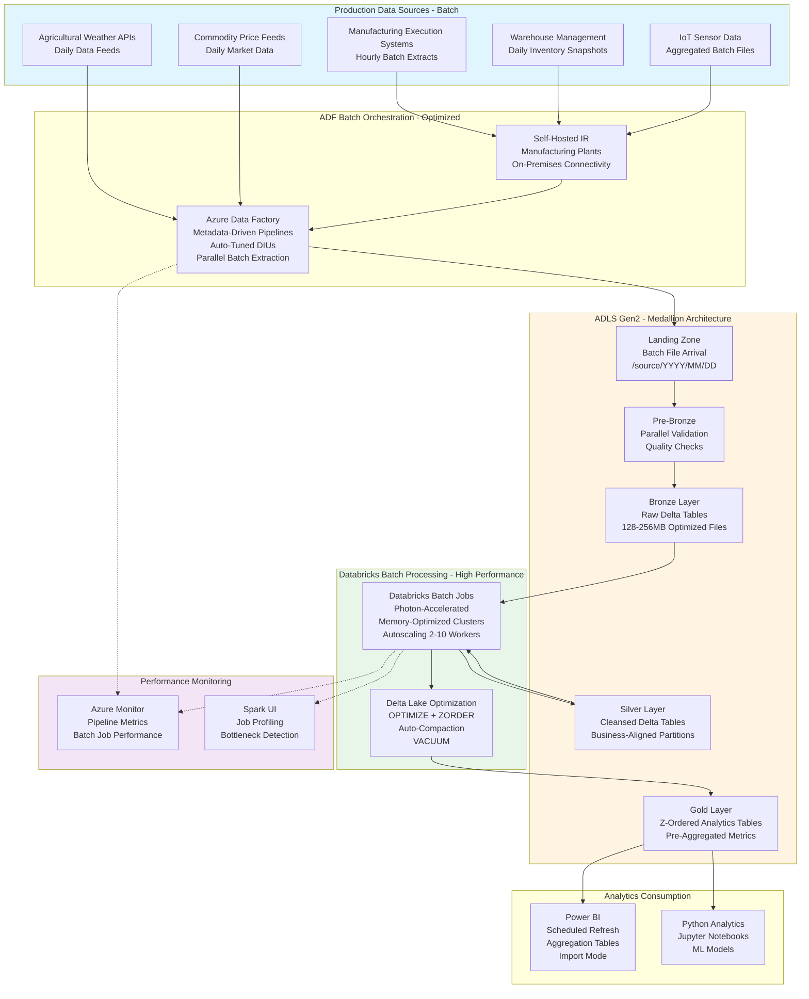

# Data Pipeline Optimization for a Global Fertilizer Company

## Standardized Azure Data Engineering Workflow

**This project follows the standard Azure Data Engineering architecture pattern:**

**Data Flow:** `Manufacturing Systems → ADF Batch Orchestration → ADLS Medallion (Bronze → Silver → Gold) → Power BI / Python Analytics`

### Workflow Components:

1. **Azure Data Factory (ADF)** - Orchestrates batch data ingestion from production systems
   - Optimized metadata-driven pipelines
   - Scheduled triggers with performance tuning
   - Parallel extraction with auto-tuned DIUs
   - Watermark-based incremental loading

2. **ADLS Gen2 Medallion Architecture** - Performance-optimized data lake
   - **Landing**: Batch file arrival with time-based partitions
   - **Pre-Bronze**: Parallel validation for throughput
   - **Bronze**: Raw Delta tables (128-256MB optimized files)
   - **Silver**: Business-aligned partitions for query performance
   - **Gold**: Z-ordered analytics tables with pre-aggregations

3. **Azure Databricks** - High-performance batch processing
   - Photon-accelerated batch jobs
   - Memory-optimized clusters with autoscaling
   - Aggressive Delta Lake optimizations
   - Scheduled job execution

4. **Power BI + Python** - Fast analytics consumption
   - Power BI with aggregation tables
   - Python notebooks for ML models
   - Direct Delta Lake connectivity

## Architecture Flow Diagram

## 1. Project Overview & Business Problem

The global fertilizer company faces critical performance challenges with existing data pipelines processing agricultural production data, supply chain logistics, and market analytics. Current pipelines exhibit extended execution times exceeding business SLAs during peak agricultural seasons when production facilities generate maximum data volumes. Legacy ETL processes built on aging infrastructure cannot scale to handle increasing IoT sensor deployments across manufacturing plants and distribution centers. Pipeline failures during critical planting and harvesting seasons disrupt inventory planning, demand forecasting, and customer order fulfillment operations. This optimization project transforms the data platform using modern Azure services, distributed processing frameworks, and performance best practices to deliver reliable, scalable analytics supporting agricultural operations.

The optimization initiative addresses fundamental architectural limitations including monolithic pipeline designs processing data sequentially, lack of parallelism in extraction and transformation operations, and inefficient data storage formats causing excessive I/O overhead. The modernized platform implements metadata-driven orchestration enabling dynamic parallelism, Delta Lake storage with optimization techniques reducing query times by orders of magnitude, and auto-scaling compute resources matching workload demands. Advanced monitoring capabilities provide visibility into pipeline performance bottlenecks enabling proactive optimization and capacity planning. The solution reduces pipeline execution times from hours to minutes, improves data freshness supporting real-time inventory decisions, and eliminates failures during peak seasons ensuring business continuity.

- **Legacy pipelines cannot scale to handle peak season data volumes from production facilities.**
  Current ETL processes fail or extend beyond SLAs during critical agricultural planting periods.
- **Sequential processing architecture lacks parallelism creating performance bottlenecks.**
  Single-threaded extraction and transformation operations underutilize available compute resources.
- **Inefficient storage formats and lack of indexing cause excessive query execution times.**
  Analysts experience multi-hour wait times for production reports during critical business periods.
- **Azure Data Factory, Databricks, and Delta Lake provide scalable optimization foundation.**
  Modern architecture supports parallel processing, auto-scaling, and advanced optimization techniques.
- **Production, supply chain, sales, and analytics teams benefit from faster data availability.**
  Improved pipeline performance enables timely decisions during critical agricultural windows.

## 2. Requirement Gathering & Analysis

The requirements phase begins with comprehensive performance baselining of existing pipelines measuring execution times, resource utilization, failure rates, and data volumes across all data sources. Stakeholder interviews with production managers, supply chain coordinators, data analysts, and business intelligence developers identify critical SLA requirements including hourly production data refresh, 15-minute inventory updates, and daily market intelligence feeds. The team catalogs all data sources including manufacturing execution systems, warehouse management platforms, IoT sensor networks, agricultural weather APIs, and commodity price feeds.

Performance bottleneck analysis examines execution logs identifying sequential processing patterns, large data transfers, insufficient parallelism, and transformation inefficiencies as primary optimization opportunities. Capacity planning assessments project data volume growth based on planned facility expansions, increased sensor deployments, and geographic market expansion supporting architecture sizing. Data quality requirements specify validation rules for production metrics, inventory accuracy, and sensor data anomaly detection ensuring optimizations maintain data integrity.

Business transformation requirements include calculations for production efficiency metrics, inventory turnover rates, demand forecast accuracy, and supply chain performance indicators. Security requirements encompass access controls for production data, encryption for supply chain information, and audit trails for compliance reporting. Integration requirements span connections to existing reporting systems, operational applications consuming real-time data feeds, and alerting platforms for critical event notifications.

- **Baseline existing pipeline performance measuring execution times and resource utilization.**
  Document current SLA misses, failure rates, and peak season performance degradation patterns.
- **Identify hourly batch production data loads and daily inventory snapshot requirements.**
  Define SLAs requiring batch completion within processing windows for morning business reviews.
- **Estimate processing 2TB daily data with 500 million IoT sensor readings and transactions.**
  Plan for 50% annual growth from facility expansion and increased sensor granularity.
- **Define data quality rules validating production metrics, inventory counts, and sensor readings.**
  Implement anomaly detection for sensor data and reconciliation checks for inventory transactions.
- **Gather transformation logic for production efficiency, inventory turnover, and forecast accuracy.**
  Document calculation formulas and aggregation requirements supporting operational dashboards.
- **Enforce access controls for production data by facility and role-based permissions.**
  Implement encryption for supply chain information and audit logging for all data access.
- **Plan integrations with existing BI tools, operational apps, and alerting platforms.**
  Ensure API availability for real-time data feeds and event-driven notification systems.

## 3. Azure Architecture Setup

The optimized architecture leverages Azure Data Lake Storage Gen2 with hierarchical namespace and performance tier selection optimizing I/O for large-scale data operations. Storage account configuration includes increased request rate limits, larger block sizes for bulk transfers, and read-access geo-redundant replication ensuring high availability. Azure Data Factory deployment emphasizes scalable integration runtime configuration with sufficient DIUs allocated based on measured data volumes and parallelism requirements.

Azure Databricks workspace deployment focuses on performance-optimized cluster configurations including photon acceleration for SQL workloads, Delta Lake optimizations enabled by default, and appropriate VM SKU selection balancing memory and compute requirements. Production cluster policies enforce autoscaling, spot instance utilization for non-critical workloads, and auto-termination preventing resource waste. Synapse Analytics provides serverless SQL pools for ad-hoc queries and dedicated SQL pools sized appropriately for high-performance aggregation workloads.

Networking configuration implements Azure ExpressRoute for high-bandwidth, low-latency connectivity to on-premises manufacturing systems ensuring consistent data transfer performance. Private endpoints with accelerated networking enabled reduce latency for inter-service communication. Monitoring infrastructure includes Log Analytics workspace with optimized retention policies and Azure Monitor configured for detailed pipeline and cluster performance metrics collection.

- **Provision ADLS Gen2 with premium performance tier for high-throughput workloads.**
  Configure lifecycle management transitioning aged data to standard tier after 60 days.
- **Deploy Azure Data Factory with Azure integration runtime scaled to maximum parallelism.**
  Allocate sufficient DIUs supporting concurrent source extractions and pipeline executions.
- **Set up Azure Databricks with photon-accelerated clusters for SQL-heavy transformations.**
  Configure production clusters with Delta Lake optimizations and autoscaling policies.
- **Create Synapse Analytics workspace with dedicated SQL pools sized for aggregation workloads.**
  Enable result set caching and materialized views for frequently accessed queries.
- **Integrate Azure Key Vault for credential management with fast secret retrieval.**
  Implement caching policies reducing Key Vault call latency during pipeline execution.
- **Configure Log Analytics workspace with optimized log ingestion and query performance.**
  Set retention policies balancing observability needs with storage costs.
- **Implement ExpressRoute for high-bandwidth connectivity to manufacturing systems.**
  Ensure consistent network performance during peak data transfer periods.
- **Configure virtual network with accelerated networking enabled on all compute resources.**
  Reduce inter-service latency improving overall pipeline performance.
- **Apply encryption at rest using Microsoft-managed keys with fast key retrieval.**
  Ensure security controls do not introduce unnecessary performance overhead.
- **Register data assets in Azure Purview with performance-optimized metadata scanning.**
  Schedule scans during off-peak hours minimizing impact on production workloads.

## 4. ADLS Folder Structure (Medallion Architecture)

The optimized medallion architecture implements partition strategies and file organization patterns maximizing query performance and parallelism. Landing zone uses date and source partitioning /landing/{source}/{YYYY}/{MM}/{DD}/{HH} enabling efficient parallel processing of hourly data arrivals. Pre-bronze layer implements similar partitioning with validation checkpoints preventing processing bottlenecks from sequential file validation.

Bronze layer uses Delta Lake format exclusively with partitioning strategy /bronze/{source}/{YYYY}/{MM} balancing file count with partition granularity. File sizes target 128-256MB range optimizing Spark parallelism and reducing small file overhead. Silver layer implements business-aligned partitioning like /silver/production_metrics/{facility_id}/{YYYY}/{MM} matching common query patterns and enabling effective partition pruning.

Gold layer features highly optimized table structures with Z-ordering on frequently filtered columns, appropriate partitioning for time-series and dimensional queries, and pre-aggregated tables eliminating expensive on-demand calculations. Archive layer uses Parquet format with aggressive compression optimizing storage costs while maintaining query capability.

- **Landing: Time-based partitioning /landing/{source}/{YYYY}/{MM}/{DD}/{HH} enabling parallel processing.**
  Structure supports concurrent ingestion from multiple sources without coordination overhead.
- **Pre-Bronze: Similar partitioning with validation checkpoints avoiding sequential bottlenecks.**
  Enable parallel validation of multiple files simultaneously improving validation throughput.
- **Bronze: Delta format with monthly partitions targeting 128-256MB file sizes.**
  Optimize Spark parallelism and reduce metadata overhead from excessive small files.
- **Silver: Business-aligned partitioning /silver/{entity}/{facility_id}/{YYYY}/{MM} matching queries.**
  Enable partition pruning for common analytical patterns reducing data scanned.
- **Gold: Z-ordered tables with pre-aggregated marts eliminating expensive calculations.**
  Structure tables for maximum query performance supporting sub-second dashboard response.
- **Archive: Compressed Parquet format with aggressive codec settings optimizing storage.**
  Maintain query capability while minimizing costs for historical data retention.

## 5. Source System Connectivity (ADF)

Source system connectivity optimization focuses on maximizing extraction throughput and minimizing impact on operational systems. Manufacturing execution system connections implement partitioned extraction using facility ID and timestamp columns enabling parallel reads across multiple connections. Linked service connection pooling configurations optimize connection reuse reducing overhead from repeated authentication and connection establishment.

Warehouse management system API connectivity implements concurrent request batching with optimal page sizes balancing request counts against payload sizes. Custom retry logic with circuit breaker patterns prevents cascading failures when upstream systems experience temporary degradation. IoT Hub connectivity leverages consumer groups enabling parallel processing of sensor telemetry streams across multiple pipeline activities.

Network optimization includes implementing compression for data transfers reducing bandwidth consumption and transfer times. Source query optimization works with database administrators to add appropriate indexes, create materialized views for complex extractions, and implement database-side filtering reducing data transferred over network.

- **Configure linked services with connection pooling and keep-alive settings.**
  Optimize connection reuse reducing overhead from repeated authentication.
- **Deploy multiple integration runtime nodes enabling parallel source extraction.**
  Scale horizontally across integration runtime nodes maximizing throughput.
- **Validate connectivity with network performance testing measuring bandwidth and latency.**
  Ensure network infrastructure supports required data transfer rates during peak periods.
- **Configure API retry policies with circuit breakers preventing cascading failures.**
  Implement exponential backoff with maximum retry limits protecting source systems.
- **Tune database extraction using partitioned reads across multiple parallel connections.**
  Extract large tables using facility ID and date partitioning maximizing parallelism.
- **Encrypt connections using TLS 1.2 with session caching reducing handshake overhead.**
  Balance security requirements with performance considerations.
- **Document connectivity patterns including parallelism settings and throughput metrics.**
  Capture baseline performance supporting future optimization efforts.

## 6. Ingestion Framework (ADF – Metadata Driven)

The optimized ingestion framework implements advanced parallelism patterns maximizing throughput while respecting source system capacity limits. Control table design includes parallelism hints specifying maximum concurrent connections per source, optimal partition columns, and dependency relationships enabling intelligent scheduling. The framework implements dynamic degree of parallelism adjusting concurrent executions based on current system load and historical performance patterns.

Copy activity configuration leverages data integration unit auto-tuning with manual overrides for known bottleneck sources. Parallel copy settings use optimal partition strategies including physical partitions for database sources and file-level parallelism for blob storage. Data flow activities implement optimized Spark configurations with appropriate cluster sizing, partition counts, and memory allocation based on workload characteristics.

Watermark management implements high-precision timestamp tracking with microsecond resolution preventing data loss in high-velocity scenarios. The framework includes intelligent retry logic distinguishing transient failures warranting retry from persistent errors requiring manual intervention. Performance monitoring captures detailed execution metrics including rows per second, data transfer rates, and resource utilization supporting continuous optimization.

- **Design control tables with parallelism hints and partition column specifications.**
  Enable framework to dynamically optimize execution based on source characteristics.
- **Use dynamic parallelism adjusting concurrent pipeline executions based on system load.**
  Implement intelligent throttling preventing resource saturation during peak periods.
- **Configure Copy activities with auto-tuning DIUs and optimized partition strategies.**
  Leverage physical partitions for databases and file-level parallelism for storage.
- **Implement high-precision watermark tracking with microsecond timestamp resolution.**
  Prevent data loss in high-velocity IoT sensor scenarios with frequent updates.
- **Build intelligent retry logic distinguishing transient from persistent failures.**
  Retry transient network issues while alerting for persistent errors requiring intervention.
- **Create optimized error handling minimizing overhead from exception processing.**
  Use lightweight logging for normal operations with detailed capture only for failures.
- **Add parallel validation activities executing quality checks concurrently.**
  Validate multiple files simultaneously reducing overall validation time.
- **Implement performance monitoring capturing throughput and resource utilization metrics.**
  Track rows per second, data transfer rates, and DIU consumption for optimization.
- **Design parallel trigger execution supporting multiple concurrent pipeline runs.**
  Enable hourly sensor data ingestion executing independently from daily batch processes.
- **Add intelligent dependency management with parallel execution where possible.**
  Identify truly dependent workflows requiring sequential execution versus parallelizable activities.

## 7. Pre-Bronze Validations

Optimized validation processes implement parallel execution patterns maximizing throughput while maintaining data quality standards. File validation activities execute concurrently across multiple files using ForEach parallelism settings tuned for optimal resource utilization. Schema validation leverages cached schema definitions reducing lookup overhead during high-volume ingestion periods.

Sampling-based validation approaches validate representative subsets of large files rather than complete scans reducing validation time while maintaining statistical confidence in data quality. Validation rules implement early failure detection terminating processing for obviously corrupt files avoiding wasted computation. Results caching eliminates redundant validation when files are reprocessed due to downstream errors.

Validation logging uses optimized batch writes to audit tables reducing transaction overhead compared to row-by-row insertion. Failed file handling implements parallel quarantine operations with asynchronous alerting preventing validation operations from blocking on notification delivery.

- **Validate files concurrently using ForEach parallelism settings maximizing throughput.**
  Process multiple files simultaneously rather than sequential validation reducing total time.
- **Validate schemas using cached definitions reducing control table lookup overhead.**
  Load validation rules once per pipeline run rather than per file.
- **Validate using sampling approaches for large files maintaining statistical confidence.**
  Scan representative subsets rather than complete files reducing validation time.
- **Perform early failure detection terminating obviously corrupt file processing.**
  Detect header issues or severe format problems immediately avoiding wasted computation.
- **Store validation results using batch writes reducing transaction overhead.**
  Buffer validation results writing in batches rather than individual row inserts.
- **Move failed files asynchronously with non-blocking notification delivery.**
  Prevent validation operations from waiting on email or message delivery.
- **Cache validation results avoiding redundant processing during retry scenarios.**
  Reuse validation outcomes when downstream errors require file reprocessing.

## 8. Bronze Layer Processing

Bronze layer processing optimizations focus on efficient data ingestion using Delta Lake capabilities and optimal Spark configurations. Autoloader provides performant, scalable ingestion from cloud storage with schema inference caching eliminating repeated inference overhead. Partition column optimization aligns physical data organization with query patterns enabling effective partition pruning.

File size optimization targets 128-256MB range through merge operations during ingestion preventing small file proliferation degrading query performance. Delta Lake optimized writes feature automatically right-sizes files during ingestion reducing need for post-ingestion compaction. Schema evolution handling implements efficient merge logic avoiding full table scans when new columns are added.

Cluster configuration for bronze ingestion emphasizes high-throughput I/O with appropriate VM SKU selection and optimized Spark settings including increased shuffle partitions for high-volume sources. Checkpoint management implements frequent commits ensuring progress is saved during long-running streaming ingestion operations.

- **Store data using Delta with optimized write enabling automatic file sizing.**
  Target 128-256MB files during ingestion avoiding small file problems.
- **Maintain audit trail using efficient metadata columns avoiding excessive overhead.**
  Include only essential lineage information reducing storage and query costs.
- **Track metadata using batch inserts to audit tables reducing transaction counts.**
  Buffer metadata writes rather than committing after each file ingestion.
- **Apply minimal transformations using optimized Spark operations and pruned schemas.**
  Select only required columns reducing memory footprint and I/O.
- **Partition bronze tables using appropriate granularity balancing pruning and file count.**
  Use monthly partitions for high-volume sources avoiding excessive partition overhead.
- **Enable schema evolution with merge schema option and cached schema tracking.**
  Handle new columns efficiently without triggering full table scans.

## 9. Silver Layer Transformations (Databricks + PySpark)

Silver layer transformation optimizations implement advanced Spark performance techniques maximizing throughput and minimizing execution time. Cluster configuration uses appropriate VM SKUs with memory-optimized instances for aggregation-heavy workloads and compute-optimized for CPU-intensive operations. Photon acceleration enables vectorized execution for SQL operations providing order-of-magnitude speedups for common transformations.

Data cleansing operations leverage optimized PySpark functions avoiding user-defined functions (UDFs) where possible as native operations benefit from Catalyst optimizer. Deduplication logic implements window functions with optimal partition key selection minimizing shuffle operations. Join optimizations include broadcast joins for small dimensions, bucketed joins for regularly joined tables, and skew join handling for unbalanced data distributions.

Incremental processing using Delta Lake MERGE operations configures optimal shuffle partitions and appropriate broadcast thresholds. Autoloader provides efficient streaming ingestion with exactly-once semantics and automatic schema evolution. Advanced optimization techniques include Z-ordering on frequently filtered columns, data skipping leveraging Delta statistics, and appropriate partition pruning strategies.

- **Clean data using native PySpark functions avoiding UDF performance overhead.**
  Leverage built-in functions benefiting from Catalyst optimizer and code generation.
- **Remove duplicates using optimized window functions with appropriate partition keys.**
  Minimize shuffle operations through intelligent partition column selection.
- **Perform type casting using optimized cast operations with schema pruning.**
  Convert only required columns reducing memory consumption and processing time.
- **Implement transformations using broadcast joins for small dimension tables.**
  Cache dimensions in executor memory eliminating shuffle operations.
- **Apply data quality checks using optimized filtering and validation logic.**
  Leverage partition pruning and data skipping for efficient quality checking.
- **Implement SCD logic using optimized MERGE operations with appropriate hints.**
  Configure shuffle partitions and broadcast thresholds for efficient SCD processing.
- **Use MERGE INTO with optimized shuffle partitions and parallelism settings.**
  Tune spark.sql.shuffle.partitions based on cluster size and data volume.
- **Use Autoloader with optimized checkpoint location and schema inference caching.**
  Benefit from exactly-once processing and efficient schema evolution.
- **Apply partition pruning through intelligent partition key selection.**
  Design partitions matching common query filters enabling effective data skipping.
- **Enforce Delta constraints efficiently using statistics-based validation.**
  Leverage Delta metadata avoiding full scans for constraint checking.
- **Document transformation logic with performance annotations noting optimization techniques.**
  Maintain knowledge base of optimization patterns for future enhancements.
- **Validate output using optimized aggregation queries with appropriate caching.**
  Cache intermediate results when performing multiple validation checks.

## 10. Gold Layer Aggregations

Gold layer optimization focuses on pre-computation strategies and advanced indexing techniques delivering sub-second query response times. Fact table design implements optimal partitioning strategies balancing partition count with pruning effectiveness. Pre-aggregated mart tables compute common aggregations during batch windows eliminating expensive on-demand calculations during dashboard access.

Materialized views in Synapse SQL automatically maintain frequently accessed aggregations with incremental refresh logic. Z-ordering organizes data layout clustering frequently co-filtered columns improving data locality and cache effectiveness. Appropriate index selection including clustered columnstore indexes for analytical workloads provides order-of-magnitude query performance improvements.

Table statistics maintenance ensures query optimizer generates optimal execution plans with accurate cardinality estimates. Caching strategies implement intelligent cache warming during off-peak hours ensuring frequently accessed data resides in memory during business hours. Partition elimination strategies design partition keys matching common query filters enabling entire partition skipping.

- **Build fact tables with optimal partitioning and Z-ordering on query columns.**
  Structure data layout matching dashboard query patterns for effective data skipping.
- **Build pre-aggregated tables computing expensive calculations during batch windows.**
  Eliminate on-demand aggregation costs improving dashboard response times dramatically.
- **Design dimensions with appropriate grain and optimized for fast lookup.**
  Implement cached dimension broadcasts for frequent fact-dimension joins.
- **Design star schema with optimal join strategies and broadcast hints.**
  Structure model enabling broadcast joins for dimensions and hash distribution for facts.
- **Create materialized views with incremental refresh for frequently accessed queries.**
  Automatically maintain aggregated results reducing query compilation and execution time.
- **Compute KPIs using optimized aggregation queries with intelligent caching.**
  Cache intermediate results when multiple KPIs share common base calculations.
- **Use window functions with optimized partition clauses minimizing shuffle.**
  Design window specifications matching data partitioning reducing shuffle operations.
- **Optimize gold tables using aggressive OPTIMIZE and ZORDER schedules.**
  Run optimization during maintenance windows ensuring query-time performance.

## 11. Delta Lake Optimization Techniques

Comprehensive Delta Lake optimization implements all available performance features maximizing query speed and operational efficiency. OPTIMIZE commands schedule during maintenance windows consolidating small files into optimal sizes with automatic bin-packing. ZORDER BY configurations order data by multiple correlated columns commonly filtered together enabling aggressive data skipping.

VACUUM operations balance storage costs with time-travel requirements using appropriate retention periods. Auto-compaction features enable continuous optimization during write operations maintaining performance without manual intervention. Bloom filters on high-cardinality columns provide fast point lookup capabilities for operational queries.

Data skipping configuration ensures statistics collection covers all relevant filter columns. Cache management implements intelligent warming strategies pre-loading frequently accessed tables before business hours. Adaptive query execution enables runtime query optimization adjusting strategies based on actual data statistics rather than estimates.

- **Use OPTIMIZE with ZORDER BY multiple correlated columns for maximum skipping.**
  Cluster data by facility, date, and product enabling aggressive multi-column data skipping.
- **Use VACUUM with optimized retention balancing time-travel and storage costs.**
  Configure 7-day retention supporting operational recovery without excessive storage overhead.
- **Enable auto-compaction and optimized writes for high-velocity tables.**
  Automatically maintain file sizes during writes eliminating post-ingestion compaction.
- **Use caching with intelligent warming strategies during off-peak hours.**
  Pre-load hot tables into cluster memory before business hours.
- **Use data skipping with comprehensive statistics collection on filter columns.**
  Ensure Delta statistics cover all columns used in dashboard query predicates.
- **Partition tables optimally balancing partition count with pruning effectiveness.**
  Use monthly partitions for high-volume facts and facility partitions for operational queries.
- **Use schema evolution with optimized merge schema operations.**
  Handle structural changes efficiently without triggering full table rewrites.
- **Tune shuffle partitions dynamically based on workload characteristics.**
  Configure spark.sql.adaptive.shuffle.targetPostShuffleInputSize for auto-tuning.

## 12. Consumption Layer (Synapse + Power BI)

Consumption layer optimization ensures dashboard queries execute with minimal latency through appropriate caching, indexing, and query tuning. Synapse serverless SQL pools leverage external table optimization with appropriate file statistics and partition elimination. Dedicated SQL pools implement result set caching, materialized views, and clustered columnstore indexes for analytical workloads.

Power BI optimization employs import mode with incremental refresh for large fact tables reducing refresh time and memory consumption. Aggregations feature pre-computes summary calculations enabling DirectQuery for detail with import for aggregates. Composite models balance freshness requirements with performance through appropriate mode selection per table.

Query optimization implements appropriate DAX patterns avoiding expensive calculated columns in favor of measures. Relationship optimization ensures bidirectional filters are used judiciously and cross-filtering leverages optimal cardinality directions. Report optimization implements appropriate visual-level filters and caching strategies.

- **Create external tables with optimized file statistics enabling partition elimination.**
  Ensure Synapse optimizer understands data layout for effective query planning.
- **Use materialized views for frequently accessed joins and aggregations.**
  Automatically maintain complex query results reducing compilation and execution time.
- **Enable DirectQuery for real-time requirements with optimized query folding.**
  Design semantic model ensuring queries fold to efficient SQL operations.
- **Build Power BI semantic models using import mode with incremental refresh.**
  Refresh only changed data partitions reducing refresh time and resource consumption.
- **Implement row-level security using optimized DAX expressions and static roles.**
  Avoid complex RLS logic degrading query performance.
- **Publish dashboards with optimized refresh scheduling and parallel execution.**
  Configure incremental refresh windows matching data update patterns.
- **Optimize Power BI using aggregations for common summary calculations.**
  Use composite models with DirectQuery detail and imported aggregations.

## 13. Monitoring & Alerting

Performance monitoring implements comprehensive metric collection and alerting enabling proactive optimization. Azure Monitor collects detailed pipeline execution metrics including activity-level duration, DIU utilization, throughput measurements, and failure rates. Custom Kusto queries identify performance degradation patterns comparing current execution times against historical baselines with anomaly detection.

Databricks monitoring captures cluster performance metrics including CPU utilization, memory pressure, shuffle read/write volumes, and task execution time distributions. Spark UI integration enables detailed job analysis identifying bottleneck stages, data skew issues, and optimization opportunities. Query execution profiling identifies expensive operations supporting targeted optimization efforts.

Cost monitoring tracks resource consumption with detailed attribution to specific pipelines and workloads. Alerts trigger when performance degrades beyond acceptable thresholds or costs exceed budget projections. Historical trend analysis identifies seasonal patterns supporting capacity planning and resource allocation decisions.

- **Monitor ADF pipelines capturing activity-level duration and throughput metrics.**
  Track DIU utilization and identify underutilized resources supporting rightsizing decisions.
- **Enable Databricks monitoring with detailed cluster metrics and job profiling.**
  Analyze Spark job execution identifying bottleneck stages and skew issues.
- **Use Log Analytics with optimized queries identifying performance anomalies.**
  Compare execution times against historical baselines detecting degradation patterns.
- **Configure alerts for performance degradation and SLA violations.**
  Notify engineering teams when pipeline duration exceeds 1.5x historical average.
- **Implement SLA tracking measuring data freshness against business requirements.**
  Monitor hourly refresh completion ensuring operational dashboards receive timely updates.
- **Capture detailed performance metrics supporting optimization efforts.**
  Record throughput measurements, resource utilization, and execution plans.
- **Integrate Spark UI for job analysis and optimization opportunity identification.**
  Enable detailed stage-level profiling identifying shuffle and spill bottlenecks.
- **Monitor cost with detailed attribution to pipelines and workloads.**
  Track spending trends enabling informed optimization prioritization decisions.
- **Track query performance measuring dashboard response times.**
  Identify slow queries requiring optimization or aggregation strategies.
- **Build performance dashboards visualizing trends and identifying degradation.**
  Provide operations teams visibility into platform performance and health.

## 14. Security & Governance

Security implementation ensures optimizations do not compromise data protection or compliance requirements. Azure Key Vault integration leverages secret caching reducing latency from credential retrieval during high-frequency pipeline operations. Managed identity authentication eliminates password management overhead while providing secure service-to-service authentication.

Network security implements private endpoints with accelerated networking reducing latency while maintaining isolation from public internet. Network security groups use stateful inspection with optimized rule evaluation order minimizing packet processing overhead. Encryption implementation uses hardware-accelerated algorithms minimizing CPU impact on data processing performance.

Azure Purview integration leverages optimized metadata scanning scheduled during off-peak hours avoiding impact on production workloads. Data classification and lineage tracking provide governance visibility without introducing runtime overhead. Audit logging implements efficient buffered writes reducing impact on operational performance.

- **Store credentials in Key Vault with caching reducing retrieval latency.**
  Implement credential caching in pipeline activities avoiding repeated Key Vault calls.
- **Use managed identities avoiding authentication overhead from token management.**
  Leverage Azure AD authentication eliminating service principal secret rotation.
- **Enable private endpoints with accelerated networking reducing inter-service latency.**
  Configure SR-IOV support on VMs for maximum network performance.
- **Implement virtual networks with optimized NSG rule evaluation.**
  Order rules by frequency ensuring common traffic matches early rules.
- **Apply NSGs with minimal required rules reducing evaluation overhead.**
  Consolidate rules using service tags and application security groups.
- **Encrypt data using hardware-accelerated algorithms minimizing CPU impact.**
  Leverage AES-NI CPU instructions for efficient encryption operations.
- **Encrypt data at rest using Microsoft-managed keys with fast retrieval.**
  Avoid customer-managed key overhead unless required by compliance mandates.
- **Implement Purview with optimized scanning schedules during off-peak hours.**
  Throttle metadata collection avoiding impact on production data processing.
- **Enable access auditing with buffered writes reducing logging overhead.**
  Batch audit log entries minimizing transaction counts.
- **Maintain compliance with efficient governance processes.**
  Document security controls with automated compliance reporting.

## 15. CI/CD Pipeline Setup (Azure DevOps or GitHub Actions)

CI/CD pipeline optimization ensures deployment automation introduces minimal overhead while maintaining quality standards. Build pipelines implement parallel job execution with appropriate agent pool sizing. Artifact packaging uses incremental approaches publishing only changed components reducing storage and deployment time.

Release pipeline optimization implements fast-fail validation with parallel environment deployments where appropriate. Testing automation includes performance regression tests comparing execution times against baselines preventing performance degradation from code changes. Infrastructure-as-code templates use parallelized resource creation reducing provisioning time.

Deployment strategies implement blue-green or canary patterns enabling rapid rollback if performance issues are detected. Automated performance testing validates optimization configurations before production promotion. Documentation automation maintains current performance tuning documentation from code annotations.

- **Use Git integration with efficient branching strategies minimizing merge overhead.**
  Implement trunk-based development reducing merge conflict resolution time.
- **Use Databricks Repos with optimized sync minimizing workspace disruption.**
  Synchronize notebooks during maintenance windows avoiding impact on running jobs.
- **Use ARM templates with parallel resource provisioning reducing deployment time.**
  Leverage template dependencies enabling maximum parallelization.
- **Use YAML pipelines with parallel job execution across agent pool.**
  Execute independent build and test activities concurrently.
- **Parameterize deployments with template specialization avoiding conditional logic overhead.**
  Use separate templates per environment avoiding runtime condition evaluation.
- **Use approval gates with timeout policies preventing deployment queue buildup.**
  Configure appropriate approval windows with automatic rejection after deadline.
- **Implement performance regression tests validating execution time benchmarks.**
  Compare pipeline duration against historical baselines detecting performance degradation.
- **Deploy Synapse scripts with parallel execution where dependencies permit.**
  Create independent database objects concurrently reducing deployment time.
- **Implement fast-fail deployment with incremental artifact publishing.**
  Deploy only changed components reducing deployment time and rollback complexity.
- **Document CI/CD workflows with performance considerations and optimization notes.**
  Maintain knowledge base of deployment best practices.

## 16. Performance Optimization

Comprehensive performance optimization implements systematic tuning across all platform components. Data Factory optimization allocates appropriate DIUs with auto-tuning enabled and parallel copy configurations. Source system optimization works with database teams implementing appropriate indexes, query hints, and materialized source views.

Databricks optimization includes cluster right-sizing with appropriate VM SKU selection, autoscaling configuration, and Photon acceleration enablement. Spark configuration tuning adjusts shuffle partitions, memory allocation, broadcast thresholds, and parallelism settings based on workload characteristics. Delta Lake optimization implements comprehensive OPTIMIZE and ZORDER schedules with auto-compaction enabled.

Network optimization ensures sufficient bandwidth with ExpressRoute implementation, accelerated networking enabled on all VMs, and appropriate TCP tuning parameters. Storage optimization leverages premium performance tiers for hot data with appropriate caching strategies. Query optimization implements appropriate indexing, statistics maintenance, and execution plan analysis.

- **Tune ADF DIUs with auto-tuning and manual overrides for known patterns.**
  Allocate higher resources for bottleneck extractions supporting SLA requirements.
- **Use broadcast joins with optimized broadcast threshold configuration.**
  Cache dimensions under 100MB in executor memory eliminating shuffle.
- **Tune Databricks clusters with appropriate VM SKU and Photon acceleration.**
  Enable memory-optimized instances for aggregations and photon for SQL workloads.
- **Use Delta OPTIMIZE on aggressive schedule with multi-column ZORDER.**
  Run optimization every 4 hours for high-velocity tables maintaining query performance.
- **Use caching with intelligent warming and appropriate eviction policies.**
  Pre-load tables before business hours with LRU eviction for memory management.
- **Tune Synapse queries with appropriate indexes and statistics maintenance.**
  Implement clustered columnstore indexes and update statistics after major data loads.
- **Optimize Power BI using aggregations and optimized DAX patterns.**
  Avoid expensive calculated columns using measures with appropriate caching.

## 17. Cost Optimization

Cost optimization balances performance requirements with budget constraints through intelligent resource management. Databricks autoscaling policies dynamically adjust cluster size matching workload demands with spot instance utilization for non-critical workloads achieving 60-80% cost reduction. Cluster pooling enables rapid startup for interactive workloads without maintaining idle resources.

Storage optimization implements appropriate tier selection with lifecycle management automatically transitioning aged data. Compression tuning selects appropriate codecs balancing CPU overhead against storage savings. Deduplication eliminates redundant data storage without impacting query performance.

Compute optimization schedules intensive workloads during off-peak hours when resource costs are lower. Query optimization eliminates unnecessary processing through appropriate filtering, projection pushdown, and partition pruning. Resource tagging enables detailed cost attribution supporting chargeback models and optimization prioritization.

- **Enable autoscaling with appropriate minimum cluster sizes preventing over-provisioning.**
  Scale from 2 to 10 workers based on actual workload avoiding idle capacity.
- **Use spot instances for non-critical development workloads.**
  Achieve 60-80% cost savings where interruptions are tolerable.
- **Use appropriate storage tiers with lifecycle management automation.**
  Transition aged data to cool tier after 60 days reducing storage costs.
- **Optimize runtimes through performance improvements reducing execution costs.**
  Faster pipeline completion reduces compute costs and resource consumption.
- **Reduce DIUs through efficiency improvements supporting lower resource allocation.**
  Optimize extraction logic enabling lower DIU configurations meeting SLAs.
- **Use serverless SQL judiciously with query optimization reducing data scanned.**
  Implement partition pruning and projection pushdown minimizing costs.
- **Use cluster pooling for interactive workloads enabling fast startup without idle costs.**
  Maintain warm pools during business hours terminating during off-peak periods.
- **Avoid excessive refresh frequency through change detection and incremental loading.**
  Refresh only changed data partitions reducing computation and resource consumption.

## 18. Documentation & KT

Comprehensive documentation captures optimization techniques and performance tuning knowledge. Architecture diagrams illustrate optimized data flows with performance annotations highlighting parallel processing, caching strategies, and optimization techniques. Performance tuning guide documents all optimization configurations with rationale and expected impact.

Runbooks provide step-by-step performance troubleshooting procedures including bottleneck identification, optimization implementation, and validation testing. Optimization playbook catalogs proven techniques with specific examples and performance measurements. Knowledge transfer sessions include hands-on optimization workshops with before/after performance comparisons.

Benchmark documentation captures baseline and optimized performance metrics demonstrating improvement achieved. Operational playbooks document ongoing maintenance requirements including optimization schedules, monitoring procedures, and performance regression detection. Lessons learned document captures insights from optimization project informing future initiatives.

- **Prepare architecture diagrams with performance annotations showing optimization techniques.**
  Highlight parallel processing patterns, caching strategies, and bottleneck resolutions.
- **Create performance tuning guide documenting all optimization configurations.**
  Include specific settings, rationale, and expected performance impact for each optimization.
- **Create optimization playbook cataloging proven techniques with examples.**
  Provide reusable patterns for common performance scenarios with measurement data.
- **Maintain performance benchmarks documenting baseline and optimized metrics.**
  Demonstrate quantifiable improvement from optimization efforts.
- **Conduct knowledge transfer with hands-on optimization workshops.**
  Provide practical training enabling team to identify and resolve future bottlenecks.
- **Provide executive summary with performance improvement metrics and ROI analysis.**
  Document business value delivered through reduced execution times and improved reliability.

