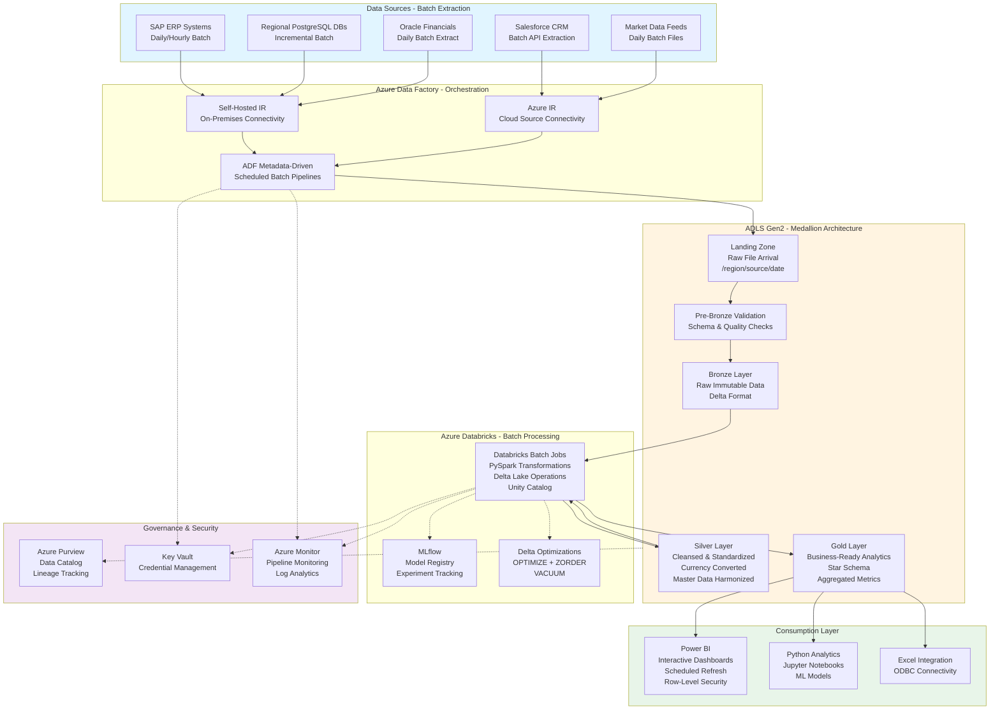
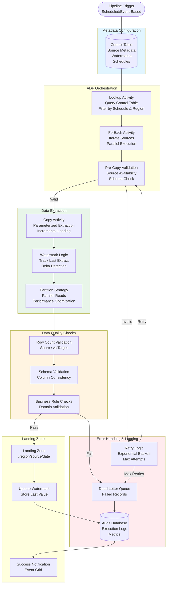
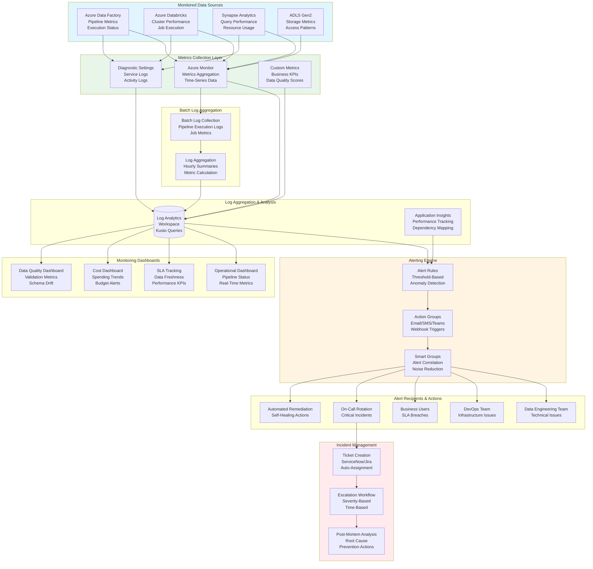

# Data Platform Development and Reporting for Global Organisation

## Standardized Azure Data Engineering Workflow

**This project follows the standard Azure Data Engineering architecture pattern:**

**Data Flow:** `Source Systems → ADF Batch Orchestration → ADLS Medallion (Bronze → Silver → Gold) → Power BI / Python Analytics`

### Workflow Components:

1. **Azure Data Factory (ADF)** - Orchestrates all batch data ingestion from heterogeneous sources
   - Metadata-driven pipelines with control tables
   - Scheduled triggers (daily/hourly batch loads)
   - Watermark-based incremental extraction
   - Self-hosted and Azure Integration Runtimes

2. **ADLS Gen2 Medallion Architecture** - Layered data lake with Delta Lake format
   - **Landing**: Raw file arrival from sources
   - **Pre-Bronze**: Validation and quality checks
   - **Bronze**: Immutable raw data in Delta format
   - **Silver**: Cleansed and standardized data
   - **Gold**: Business-ready analytics tables (Star Schema)

3. **Azure Databricks** - Batch transformations using PySpark
   - Scheduled jobs processing Bronze → Silver → Gold
   - Delta Lake ACID transactions and optimizations
   - Unity Catalog for data governance
   - MLflow for model management

4. **Power BI + Python** - Analytics consumption layer
   - Power BI dashboards with scheduled refresh
   - Python notebooks for advanced analytics
   - Direct connectivity to Gold Delta tables
   - No intermediate SQL layer required

## Architecture Flow Diagram



## 1. Project Overview & Business Problem

The global organisation faces critical challenges managing disparate data systems across multiple countries, business units, and functional areas including finance, operations, and customer analytics. Regional subsidiaries maintain independent databases and reporting tools leading to inconsistent metrics, duplicated efforts, and delayed consolidated reporting for executive leadership. The absence of centralized data governance creates compliance risks with varying interpretations of GDPR, local privacy regulations, and corporate audit requirements across geographies. Manual consolidation processes consume significant analyst time aggregating Excel spreadsheets and reconciling discrepancies between regional reports. This project delivers a unified Azure-based data platform enabling standardized reporting, self-service analytics, and regulatory compliance across the global organisation's footprint.

The platform establishes a single source of truth for enterprise data spanning financial transactions, operational metrics, customer interactions, and market intelligence feeds. By centralizing data from ERP systems, CRM platforms, regional databases, and external market data providers, the organisation gains unprecedented visibility into cross-regional performance and trends. The solution supports both structured transactional data and semi-structured data from APIs, log files, and IoT sensors deployed across manufacturing facilities. Advanced analytics capabilities enable predictive modeling for demand forecasting, customer churn prediction, and operational optimization. The architecture reduces reporting cycle times from weeks to hours, eliminates manual data reconciliation efforts, and provides consistent KPI definitions across all business units and geographies.

- **Data fragmentation across 50+ regional systems prevents consolidated enterprise reporting and analytics.**
  Executive leadership lacks unified visibility into global performance requiring manual report consolidation.
- **Inconsistent metric definitions across regions create confusion and erode trust in reported figures.**
  Financial analysts spend excessive time reconciling discrepancies between regional interpretations of KPIs.
- **Manual data consolidation processes delay monthly reporting cycles by 2-3 weeks.**
  Business decisions based on outdated information impact competitiveness and operational responsiveness.
- **Azure Data Factory, Databricks, and Synapse provide scalable foundation for global data platform.**
  Cloud architecture supports data sovereignty requirements with regional storage and processing capabilities.
- **Finance, operations, sales, and executive teams benefit from standardized dashboards and self-service analytics.**
  Cross-functional collaboration improves through shared definitions and centralized data access.

## 2. Requirement Gathering & Analysis

The requirements phase engages stakeholders across all regions and business functions to understand data sources, reporting needs, and compliance constraints. Data source mapping identifies 50+ systems including SAP ERP instances, Salesforce CRM, regional PostgreSQL databases, Oracle Financials, and third-party market intelligence feeds. Each source requires documentation covering connection methods, data refresh frequencies, data volumes, and existing transformation logic embedded in legacy ETL tools. Regional IT teams provide network topology information including firewall rules, VPN configurations, and data residency requirements driven by local regulations.

Business requirements gathering workshops with finance, operations, sales, and marketing teams identify critical reports including monthly financial consolidation, regional sales performance, operational efficiency metrics, and customer segmentation analyses. The team documents calculation formulas for revenue recognition, margin analysis, customer lifetime value, and operational KPIs ensuring consistency across regions. Data quality requirements emphasize validation of financial data accuracy, customer master data deduplication across systems, and product hierarchy standardization across regional catalogs.

Security and compliance requirements address GDPR data privacy mandates, SOX financial controls, regional data sovereignty laws, and corporate audit trail requirements. Access control matrices define role-based permissions by job function, geography, and data sensitivity level. Integration requirements encompass connections to existing reporting tools, planning systems, and operational applications consuming platform data.

- **Map 50+ source systems including SAP ERP, Salesforce CRM, regional databases, and market data feeds.**
  Document batch extraction schedules, connection protocols, authentication mechanisms, and firewall rules.
- **Identify daily batch loads for financial data and hourly incremental loads for operational metrics.**
  Define SLAs requiring financial close data completion by 6AM daily for morning business reviews.
- **Estimate processing 10TB historical data with 100 million daily records across all regions.**
  Plan infrastructure capacity for 40% annual data growth and expanding regional operations.
- **Define batch processing windows aligning with regional business hours and source system availability.**
  Schedule extractions during off-peak hours minimizing impact on operational source systems.
- **Define data quality rules validating account codes, customer deduplication, and amount accuracy.**
  Implement reconciliation checks ensuring transaction totals balance across all source systems.
- **Gather transformation logic for currency conversion, revenue recognition, and consolidated reporting.**
  Document standardized calculation formulas for margin analysis and cross-regional KPI definitions.
- **Enforce GDPR compliance with data minimization, consent tracking, and right-to-erasure workflows.**
  Implement field-level encryption for sensitive data with comprehensive audit logging.
- **Plan Power BI integration with scheduled refresh and DirectQuery connectivity to Gold layer.**
  Enable Python analytics notebooks connecting to Delta tables for advanced analysis and ML.
- **Document batch processing dependencies ensuring proper sequencing of regional loads.**
  Define prerequisites where master data must complete before transactional data processing.
- **Establish data retention policies by layer and data classification.**
  Configure Landing (7 days), Bronze (3 years), Silver (5 years), Gold (7 years) retention.

## Data Source Table Schemas

### Comprehensive Source System Table Definitions (20 Tables × 10 Columns)

```sql
-- Table 1: SAP_SALES_ORDERS
CREATE TABLE bronze.sap_sales_orders (
    order_id VARCHAR(20) PRIMARY KEY,
    customer_id VARCHAR(15) NOT NULL,
    order_date DATE NOT NULL,
    delivery_date DATE,
    order_amount DECIMAL(18,2),
    currency_code VARCHAR(3),
    order_status VARCHAR(20),
    sales_region VARCHAR(50),
    payment_terms VARCHAR(30),
    created_timestamp TIMESTAMP DEFAULT CURRENT_TIMESTAMP
);

-- Table 2: SAP_CUSTOMERS  
CREATE TABLE bronze.sap_customers (
    customer_id VARCHAR(15) PRIMARY KEY,
    customer_name VARCHAR(200) NOT NULL,
    customer_type VARCHAR(30),
    industry_sector VARCHAR(50),
    country_code VARCHAR(2),
    region VARCHAR(50),
    credit_limit DECIMAL(18,2),
    payment_terms VARCHAR(30),
    active_flag CHAR(1),
    last_modified_date TIMESTAMP
);

-- Table 3: SAP_PRODUCTS
CREATE TABLE bronze.sap_products (
    product_id VARCHAR(18) PRIMARY KEY,
    product_name VARCHAR(200),
    product_category VARCHAR(50),
    product_group VARCHAR(50),
    unit_of_measure VARCHAR(10),
    standard_cost DECIMAL(18,2),
    list_price DECIMAL(18,2),
    currency_code VARCHAR(3),
    active_status CHAR(1),
    last_update_timestamp TIMESTAMP
);

-- Table 4: SAP_GENERAL_LEDGER
CREATE TABLE bronze.sap_general_ledger (
    gl_transaction_id BIGINT PRIMARY KEY,
    account_number VARCHAR(20) NOT NULL,
    cost_center VARCHAR(15),
    posting_date DATE NOT NULL,
    document_date DATE,
    transaction_amount DECIMAL(18,2),
    currency_code VARCHAR(3),
    company_code VARCHAR(4),
    fiscal_year INT,
    posting_timestamp TIMESTAMP
);

-- Table 5: SAP_PURCHASE_ORDERS
CREATE TABLE bronze.sap_purchase_orders (
    po_number VARCHAR(20) PRIMARY KEY,
    vendor_id VARCHAR(15) NOT NULL,
    po_date DATE NOT NULL,
    delivery_date DATE,
    po_amount DECIMAL(18,2),
    currency_code VARCHAR(3),
    purchasing_org VARCHAR(50),
    plant_code VARCHAR(10),
    po_status VARCHAR(20),
    created_by VARCHAR(50)
);

-- Table 6: SAP_VENDORS
CREATE TABLE bronze.sap_vendors (
    vendor_id VARCHAR(15) PRIMARY KEY,
    vendor_name VARCHAR(200) NOT NULL,
    vendor_type VARCHAR(30),
    country_code VARCHAR(2),
    payment_terms VARCHAR(30),
    bank_account VARCHAR(30),
    tax_id VARCHAR(20),
    active_flag CHAR(1),
    credit_rating VARCHAR(10),
    last_modified_timestamp TIMESTAMP
);

-- Table 7: SAP_MATERIALS_INVENTORY
CREATE TABLE bronze.sap_materials_inventory (
    material_id VARCHAR(18) PRIMARY KEY,
    material_description VARCHAR(200),
    plant_code VARCHAR(10) NOT NULL,
    storage_location VARCHAR(10),
    quantity_on_hand DECIMAL(15,3),
    unit_of_measure VARCHAR(10),
    valuation_price DECIMAL(18,2),
    currency_code VARCHAR(3),
    last_goods_receipt_date DATE,
    inventory_timestamp TIMESTAMP
);

-- Table 8: SAP_COST_CENTERS
CREATE TABLE bronze.sap_cost_centers (
    cost_center_id VARCHAR(15) PRIMARY KEY,
    cost_center_name VARCHAR(100) NOT NULL,
    controlling_area VARCHAR(4),
    company_code VARCHAR(4),
    business_area VARCHAR(4),
    cost_center_category VARCHAR(30),
    responsible_person VARCHAR(50),
    valid_from_date DATE,
    valid_to_date DATE,
    created_timestamp TIMESTAMP
);

-- Table 9: SAP_PROFIT_CENTERS
CREATE TABLE bronze.sap_profit_centers (
    profit_center_id VARCHAR(15) PRIMARY KEY,
    profit_center_name VARCHAR(100) NOT NULL,
    controlling_area VARCHAR(4),
    company_code VARCHAR(4),
    segment VARCHAR(50),
    profit_center_group VARCHAR(20),
    responsible_manager VARCHAR(50),
    valid_from_date DATE,
    valid_to_date DATE,
    last_modified_timestamp TIMESTAMP
);

-- Table 10: SAP_ASSET_MASTER
CREATE TABLE bronze.sap_asset_master (
    asset_id VARCHAR(20) PRIMARY KEY,
    asset_description VARCHAR(200) NOT NULL,
    asset_class VARCHAR(20),
    company_code VARCHAR(4),
    cost_center VARCHAR(15),
    acquisition_value DECIMAL(18,2),
    accumulated_depreciation DECIMAL(18,2),
    acquisition_date DATE,
    useful_life_months INT,
    last_depreciation_date DATE
);

-- Table 11: SALESFORCE_ACCOUNTS
CREATE TABLE bronze.salesforce_accounts (
    account_id VARCHAR(18) PRIMARY KEY,
    account_name VARCHAR(255) NOT NULL,
    account_type VARCHAR(50),
    industry VARCHAR(100),
    annual_revenue DECIMAL(18,2),
    number_of_employees INT,
    billing_country VARCHAR(2),
    account_owner VARCHAR(50),
    created_date TIMESTAMP,
    last_modified_date TIMESTAMP
);

-- Table 12: SALESFORCE_OPPORTUNITIES
CREATE TABLE bronze.salesforce_opportunities (
    opportunity_id VARCHAR(18) PRIMARY KEY,
    opportunity_name VARCHAR(255) NOT NULL,
    account_id VARCHAR(18),
    stage_name VARCHAR(50),
    amount DECIMAL(18,2),
    close_date DATE,
    probability DECIMAL(3,2),
    forecast_category VARCHAR(30),
    lead_source VARCHAR(50),
    created_timestamp TIMESTAMP
);

-- Table 13: SALESFORCE_CONTACTS
CREATE TABLE bronze.salesforce_contacts (
    contact_id VARCHAR(18) PRIMARY KEY,
    first_name VARCHAR(100),
    last_name VARCHAR(100) NOT NULL,
    email VARCHAR(255),
    phone VARCHAR(30),
    account_id VARCHAR(18),
    title VARCHAR(100),
    department VARCHAR(50),
    mailing_country VARCHAR(2),
    last_activity_date DATE
);

-- Table 14: POSTGRES_TRANSACTIONS
CREATE TABLE bronze.postgres_transactions (
    transaction_id BIGINT PRIMARY KEY,
    transaction_date TIMESTAMP NOT NULL,
    customer_id VARCHAR(20),
    product_id VARCHAR(18),
    quantity DECIMAL(15,3),
    unit_price DECIMAL(18,2),
    total_amount DECIMAL(18,2),
    transaction_type VARCHAR(20),
    region_code VARCHAR(10),
    processed_timestamp TIMESTAMP
);

-- Table 15: ORACLE_FINANCIALS_AR
CREATE TABLE bronze.oracle_financials_ar (
    invoice_id BIGINT PRIMARY KEY,
    customer_id VARCHAR(20) NOT NULL,
    invoice_date DATE NOT NULL,
    due_date DATE,
    invoice_amount DECIMAL(18,2),
    outstanding_amount DECIMAL(18,2),
    currency_code VARCHAR(3),
    payment_status VARCHAR(20),
    invoice_type VARCHAR(30),
    last_update_timestamp TIMESTAMP
);

-- Table 16: ORACLE_FINANCIALS_AP
CREATE TABLE bronze.oracle_financials_ap (
    invoice_id BIGINT PRIMARY KEY,
    vendor_id VARCHAR(20) NOT NULL,
    invoice_date DATE NOT NULL,
    payment_date DATE,
    invoice_amount DECIMAL(18,2),
    paid_amount DECIMAL(18,2),
    currency_code VARCHAR(3),
    payment_status VARCHAR(20),
    approval_status VARCHAR(20),
    created_timestamp TIMESTAMP
);

-- Table 17: MARKET_DATA_EXCHANGE_RATES
CREATE TABLE bronze.market_data_exchange_rates (
    rate_id BIGINT PRIMARY KEY,
    rate_date DATE NOT NULL,
    from_currency VARCHAR(3) NOT NULL,
    to_currency VARCHAR(3) NOT NULL,
    exchange_rate DECIMAL(15,6),
    rate_type VARCHAR(20),
    source_system VARCHAR(50),
    effective_timestamp TIMESTAMP,
    expiry_timestamp TIMESTAMP,
    created_timestamp TIMESTAMP
);

-- Table 18: MARKET_DATA_COMMODITY_PRICES
CREATE TABLE bronze.market_data_commodity_prices (
    price_id BIGINT PRIMARY KEY,
    commodity_code VARCHAR(20) NOT NULL,
    price_date DATE NOT NULL,
    opening_price DECIMAL(18,4),
    closing_price DECIMAL(18,4),
    high_price DECIMAL(18,4),
    low_price DECIMAL(18,4),
    volume BIGINT,
    currency_code VARCHAR(3),
    market_exchange VARCHAR(50),
    recorded_timestamp TIMESTAMP
);

-- Table 19: REGIONAL_EMPLOYEE_DATA
CREATE TABLE bronze.regional_employee_data (
    employee_id VARCHAR(20) PRIMARY KEY,
    first_name VARCHAR(100) NOT NULL,
    last_name VARCHAR(100) NOT NULL,
    email VARCHAR(255),
    department VARCHAR(50),
    job_title VARCHAR(100),
    hire_date DATE,
    salary DECIMAL(18,2),
    region VARCHAR(50),
    manager_id VARCHAR(20)
);

-- Table 20: REGIONAL_BUDGET_ALLOCATIONS
CREATE TABLE bronze.regional_budget_allocations (
    budget_id VARCHAR(20) PRIMARY KEY,
    fiscal_year INT NOT NULL,
    region VARCHAR(50) NOT NULL,
    department VARCHAR(50),
    budget_category VARCHAR(50),
    allocated_amount DECIMAL(18,2),
    spent_amount DECIMAL(18,2),
    currency_code VARCHAR(3),
    approval_status VARCHAR(20),
    last_updated_timestamp TIMESTAMP
);
```

## 3. Azure Architecture Setup

The global architecture establishes Azure Data Lake Storage Gen2 with geo-redundant replication across primary and secondary regions ensuring business continuity and disaster recovery capabilities. Regional ADLS instances in EU, US, and APAC support data sovereignty requirements maintaining data residency within regulatory boundaries while replicating metadata to central catalog. Lifecycle management policies automatically archive aged financial records to cool storage tier after 12 months and long-term archive tier after 7 years meeting corporate retention policies. The medallion architecture implements Landing → Pre-Bronze → Bronze → Silver → Gold data flow with each layer stored as Delta tables in ADLS Gen2.

Azure Data Factory orchestrates all batch data ingestion using scheduled triggers and metadata-driven pipelines. Self-hosted integration runtimes deploy in each regional data center for secure connectivity to on-premises SAP, Oracle, and PostgreSQL systems. Express Route circuits provide dedicated network connectivity ensuring low-latency, high-throughput batch data transfer bypassing public internet. Azure Data Factory pipelines execute daily batch extractions with incremental loading using watermark patterns reducing data transfer volumes and source system impact.

Azure Databricks workspace spans multiple regions with Unity Catalog enabling centralized governance and metadata management across distributed compute resources. Databricks batch jobs execute scheduled transformations processing data through medallion layers with Delta Lake ACID transactions ensuring consistency. Databricks notebooks implement PySpark transformations for data cleansing, deduplication, currency conversion, master data management, and business logic application. Azure Key Vault regional instances store regional system credentials with secrets replicated to central Key Vault for disaster recovery. Private Link connectivity ensures all inter-service communication traverses private networks with DDoS protection and Azure Firewall providing perimeter security.

- **Provision ADLS Gen2 with geo-redundant storage implementing medallion architecture layers.**
  Configure Landing, Bronze, Silver, Gold containers with hierarchical namespace enabled.
- **Deploy Azure Data Factory with metadata-driven batch orchestration framework.**
  Implement scheduled triggers for daily/hourly batch extractions with watermark-based incremental loading.
- **Set up Self-Hosted Integration Runtime in regional data centers for on-premises connectivity.**
  Configure Azure Integration Runtime for cloud-based sources like Salesforce and market data APIs.
- **Deploy Azure Databricks workspace with Unity Catalog for centralized data governance.**
  Configure job clusters optimized for batch transformations with Delta Lake optimizations enabled.
- **Implement Delta Lake format across Bronze, Silver, and Gold layers.**
  Enable ACID transactions, time-travel, schema evolution, and advanced optimizations.
- **Configure job clusters with autoscaling for batch processing workloads.**
  Set minimum 2 workers scaling to 10 workers based on data volumes.
- **Integrate Azure Key Vault for secure credential and connection string management.**
  Store database passwords, API keys, and service principal credentials with RBAC access control.
- **Configure Log Analytics workspace aggregating metrics from ADF and Databricks.**
  Enable diagnostic settings capturing pipeline runs, cluster performance, and job execution metrics.
- **Implement Private Endpoints for ADLS Gen2 and Key Vault.**
  Disable public network access routing all traffic through virtual network private links.
- **Configure Power BI workspaces with scheduled refresh connecting to Gold layer.**
  Implement incremental refresh for large fact tables and DirectQuery for dimensional queries.
- **Register all data assets in Azure Purview with automated lineage tracking.**
  Document metadata from sources through Bronze → Silver → Gold to Power BI reports.
- **Apply encryption at rest using Microsoft-managed keys across all storage tiers.**
  Enable HTTPS-only access and secure transfer required on ADLS Gen2 accounts.
- **Configure VNet with subnets for compute and data services.**
  Implement network security groups restricting inbound/outbound traffic to required protocols.
- **Set up Azure Monitor alerts for pipeline failures and performance degradation.**
  Configure action groups for email/Teams notifications to data engineering and operations teams.

### Python Code Example: Azure Resource Provisioning with SDK

```python
from azure.identity import DefaultAzureCredential
from azure.mgmt.storage import StorageManagementClient
from azure.mgmt.datafactory import DataFactoryManagementClient
from azure.mgmt.synapse import SynapseManagementClient
from azure.mgmt.keyvault import KeyVaultManagementClient
import logging

# Configure logging
logging.basicConfig(level=logging.INFO)
logger = logging.getLogger(__name__)

class GlobalDataPlatformProvisioner:
    """Provision Azure resources for global data platform across regions"""
    
    def __init__(self, subscription_id):
        self.subscription_id = subscription_id
        self.credential = DefaultAzureCredential()
        
        # Initialize management clients
        self.storage_client = StorageManagementClient(
            self.credential, 
            self.subscription_id
        )
        self.adf_client = DataFactoryManagementClient(
            self.credential,
            self.subscription_id
        )
        self.synapse_client = SynapseManagementClient(
            self.credential,
            self.subscription_id
        )
        self.kv_client = KeyVaultManagementClient(
            self.credential,
            self.subscription_id
        )
    
    def provision_adls_gen2(self, resource_group, storage_account_name, region):
        """
        Provision ADLS Gen2 storage account with hierarchical namespace
        
        Parameters:
        - resource_group: Azure resource group name
        - storage_account_name: Unique storage account name
        - region: Azure region (e.g., 'eastus', 'westeurope')
        """
        logger.info(f"Provisioning ADLS Gen2 in {region}...")
        
        storage_params = {
            "location": region,
            "kind": "StorageV2",
            "sku": {"name": "Standard_GRS"},  # Geo-redundant storage
            "properties": {
                "isHnsEnabled": True,  # Enable hierarchical namespace
                "encryption": {
                    "services": {
                        "blob": {"enabled": True},
                        "file": {"enabled": True}
                    },
                    "keySource": "Microsoft.Storage"
                },
                "supportsHttpsTrafficOnly": True,
                "minimumTlsVersion": "TLS1_2",
                "allowBlobPublicAccess": False
            },
            "tags": {
                "Environment": "Production",
                "Region": region,
                "DataClassification": "Confidential"
            }
        }
        
        # Create storage account
        storage_async_operation = self.storage_client.storage_accounts.begin_create(
            resource_group,
            storage_account_name,
            storage_params
        )
        
        storage_account = storage_async_operation.result()
        logger.info(f"ADLS Gen2 provisioned: {storage_account.name}")
        
        # Configure lifecycle management
        lifecycle_policy = {
            "rules": [
                {
                    "enabled": True,
                    "name": "ArchiveAgedFinancialData",
                    "type": "Lifecycle",
                    "definition": {
                        "filters": {
                            "blobTypes": ["blockBlob"],
                            "prefixMatch": ["bronze/financials/"]
                        },
                        "actions": {
                            "baseBlob": {
                                "tierToCool": {"daysAfterModificationGreaterThan": 365},
                                "tierToArchive": {"daysAfterModificationGreaterThan": 2555}
                            }
                        }
                    }
                }
            ]
        }
        
        self.storage_client.management_policies.create_or_update(
            resource_group,
            storage_account_name,
            "default",
            lifecycle_policy
        )
        
        return storage_account
    
    def provision_data_factory(self, resource_group, factory_name, region):
        """
        Provision Azure Data Factory with managed virtual network
        
        Parameters:
        - resource_group: Azure resource group name  
        - factory_name: Data Factory name
        - region: Azure region
        """
        logger.info(f"Provisioning Data Factory in {region}...")
        
        factory_params = {
            "location": region,
            "identity": {
                "type": "SystemAssigned"
            },
            "properties": {
                "publicNetworkAccess": "Disabled"
            },
            "tags": {
                "Environment": "Production",
                "Region": region
            }
        }
        
        factory = self.adf_client.factories.create_or_update(
            resource_group,
            factory_name,
            factory_params
        )
        
        logger.info(f"Data Factory provisioned: {factory.name}")
        
        # Create self-hosted integration runtime
        shir_params = {
            "type": "SelfHosted",
            "description": f"Self-hosted IR for {region} regional data center",
            "typeProperties": {}
        }
        
        integration_runtime = self.adf_client.integration_runtimes.create_or_update(
            resource_group,
            factory_name,
            f"SHIR-{region}",
            shir_params
        )
        
        logger.info(f"Self-hosted integration runtime created: SHIR-{region}")
        
        return factory
    
    def provision_synapse_workspace(self, resource_group, workspace_name, 
                                   storage_account, region):
        """
        Provision Synapse Analytics workspace
        
        Parameters:
        - resource_group: Azure resource group name
        - workspace_name: Synapse workspace name
        - storage_account: Associated ADLS Gen2 account
        - region: Azure region
        """
        logger.info(f"Provisioning Synapse workspace in {region}...")
        
        workspace_params = {
            "location": region,
            "identity": {
                "type": "SystemAssigned"
            },
            "properties": {
                "defaultDataLakeStorage": {
                    "accountUrl": f"https://{storage_account}.dfs.core.windows.net",
                    "filesystem": "synapse"
                },
                "sqlAdministratorLogin": "sqladminuser",
                "managedVirtualNetwork": "default",
                "publicNetworkAccess": "Disabled",
                "managedVirtualNetworkSettings": {
                    "preventDataExfiltration": True,
                    "allowedAadTenantIdsForLinking": []
                }
            },
            "tags": {
                "Environment": "Production",
                "Region": region
            }
        }
        
        workspace_async = self.synapse_client.workspaces.begin_create_or_update(
            resource_group,
            workspace_name,
            workspace_params
        )
        
        workspace = workspace_async.result()
        logger.info(f"Synapse workspace provisioned: {workspace.name}")
        
        return workspace
    
    def provision_key_vault(self, resource_group, vault_name, region):
        """
        Provision Azure Key Vault with advanced security
        
        Parameters:
        - resource_group: Azure resource group name
        - vault_name: Key Vault name
        - region: Azure region
        """
        logger.info(f"Provisioning Key Vault in {region}...")
        
        vault_params = {
            "location": region,
            "properties": {
                "tenantId": "YOUR_TENANT_ID",
                "sku": {
                    "family": "A",
                    "name": "premium"  # Premium for HSM-backed keys
                },
                "enabledForDiskEncryption": True,
                "enabledForDeployment": True,
                "enabledForTemplateDeployment": True,
                "enableSoftDelete": True,
                "softDeleteRetentionInDays": 90,
                "enablePurgeProtection": True,
                "networkAcls": {
                    "bypass": "AzureServices",
                    "defaultAction": "Deny",
                    "ipRules": [],
                    "virtualNetworkRules": []
                }
            },
            "tags": {
                "Environment": "Production",
                "Region": region
            }
        }
        
        vault = self.kv_client.vaults.begin_create_or_update(
            resource_group,
            vault_name,
            vault_params
        ).result()
        
        logger.info(f"Key Vault provisioned: {vault.name}")
        
        return vault

# Usage example
def deploy_regional_infrastructure():
    """Deploy infrastructure across all regions"""
    provisioner = GlobalDataPlatformProvisioner("YOUR_SUBSCRIPTION_ID")
    
    regions = {
        "EU": "westeurope",
        "US": "eastus2",
        "APAC": "southeastasia"
    }
    
    for region_code, azure_region in regions.items():
        resource_group = f"rg-dataplatform-{region_code.lower()}"
        
        # Provision storage
        storage_account = provisioner.provision_adls_gen2(
            resource_group,
            f"adls{region_code.lower()}prod",
            azure_region
        )
        
        # Provision Data Factory
        factory = provisioner.provision_data_factory(
            resource_group,
            f"adf-{region_code.lower()}-prod",
            azure_region
        )
        
        # Provision Synapse
        workspace = provisioner.provision_synapse_workspace(
            resource_group,
            f"synapse-{region_code.lower()}-prod",
            f"adls{region_code.lower()}prod",
            azure_region
        )
        
        # Provision Key Vault
        vault = provisioner.provision_key_vault(
            resource_group,
            f"kv-{region_code.lower()}-prod",
            azure_region
        )
        
        logger.info(f"Completed provisioning for {region_code} region")

if __name__ == "__main__":
    deploy_regional_infrastructure()
```

### SQL Example: Creating Gold Layer Financial Consolidation Views

```sql
-- Create Gold Layer Consolidated Financial Reporting Views

-- View 1: Global Revenue by Region and Product Category
CREATE OR REPLACE VIEW gold.vw_global_revenue_by_region AS
SELECT 
    fc.fiscal_year,
    fc.fiscal_month,
    fc.region_code,
    r.region_name,
    pc.product_category,
    pc.product_group,
    fc.currency_code AS reporting_currency,
    SUM(fc.revenue_amount_usd) AS total_revenue_usd,
    SUM(fc.cost_of_sales_usd) AS total_cost_usd,
    SUM(fc.revenue_amount_usd - fc.cost_of_sales_usd) AS gross_profit_usd,
    CASE 
        WHEN SUM(fc.revenue_amount_usd) > 0 
        THEN (SUM(fc.revenue_amount_usd - fc.cost_of_sales_usd) / SUM(fc.revenue_amount_usd)) * 100
        ELSE 0
    END AS gross_margin_percentage,
    COUNT(DISTINCT fc.customer_id) AS unique_customers,
    COUNT(DISTINCT fc.order_id) AS total_orders,
    CURRENT_TIMESTAMP AS view_refresh_timestamp
FROM gold.fact_consolidated_sales fc
INNER JOIN gold.dim_region r ON fc.region_code = r.region_code
INNER JOIN gold.dim_product_category pc ON fc.product_category_id = pc.product_category_id
WHERE fc.fiscal_year >= YEAR(CURRENT_DATE) - 3
GROUP BY 
    fc.fiscal_year,
    fc.fiscal_month,
    fc.region_code,
    r.region_name,
    pc.product_category,
    pc.product_group,
    fc.currency_code;

-- View 2: Year-over-Year Regional Performance Comparison
CREATE OR REPLACE VIEW gold.vw_yoy_regional_performance AS
WITH current_year AS (
    SELECT 
        region_code,
        fiscal_month,
        SUM(revenue_amount_usd) AS revenue_cy,
        SUM(cost_of_sales_usd) AS cost_cy,
        COUNT(DISTINCT customer_id) AS customers_cy
    FROM gold.fact_consolidated_sales
    WHERE fiscal_year = YEAR(CURRENT_DATE)
    GROUP BY region_code, fiscal_month
),
prior_year AS (
    SELECT 
        region_code,
        fiscal_month,
        SUM(revenue_amount_usd) AS revenue_py,
        SUM(cost_of_sales_usd) AS cost_py,
        COUNT(DISTINCT customer_id) AS customers_py
    FROM gold.fact_consolidated_sales
    WHERE fiscal_year = YEAR(CURRENT_DATE) - 1
    GROUP BY region_code, fiscal_month
)
SELECT 
    cy.region_code,
    r.region_name,
    cy.fiscal_month,
    cy.revenue_cy AS current_year_revenue,
    py.revenue_py AS prior_year_revenue,
    cy.revenue_cy - py.revenue_py AS revenue_variance,
    CASE 
        WHEN py.revenue_py > 0 
        THEN ((cy.revenue_cy - py.revenue_py) / py.revenue_py) * 100
        ELSE NULL
    END AS revenue_growth_percentage,
    cy.customers_cy AS current_year_customers,
    py.customers_py AS prior_year_customers,
    cy.customers_cy - py.customers_py AS customer_variance,
    (cy.revenue_cy - cy.cost_cy) AS current_year_margin,
    (py.revenue_py - py.cost_py) AS prior_year_margin
FROM current_year cy
LEFT JOIN prior_year py ON cy.region_code = py.region_code 
    AND cy.fiscal_month = py.fiscal_month
INNER JOIN gold.dim_region r ON cy.region_code = r.region_code
ORDER BY cy.region_code, cy.fiscal_month;

-- View 3: Customer Lifetime Value by Region
CREATE OR REPLACE VIEW gold.vw_customer_lifetime_value AS
SELECT 
    c.customer_id,
    c.customer_name,
    c.region_code,
    r.region_name,
    c.customer_segment,
    MIN(fcs.order_date) AS first_purchase_date,
    MAX(fcs.order_date) AS last_purchase_date,
    DATEDIFF(day, MIN(fcs.order_date), MAX(fcs.order_date)) AS customer_tenure_days,
    COUNT(DISTINCT fcs.order_id) AS total_orders,
    SUM(fcs.revenue_amount_usd) AS lifetime_revenue,
    SUM(fcs.revenue_amount_usd - fcs.cost_of_sales_usd) AS lifetime_profit,
    AVG(fcs.revenue_amount_usd) AS average_order_value,
    SUM(fcs.revenue_amount_usd) / NULLIF(DATEDIFF(month, MIN(fcs.order_date), CURRENT_DATE), 0) 
        AS monthly_revenue_contribution,
    CASE 
        WHEN MAX(fcs.order_date) >= DATEADD(day, -90, CURRENT_DATE) THEN 'Active'
        WHEN MAX(fcs.order_date) >= DATEADD(day, -180, CURRENT_DATE) THEN 'At Risk'
        ELSE 'Churned'
    END AS customer_status
FROM gold.dim_customer c
INNER JOIN gold.fact_consolidated_sales fcs ON c.customer_id = fcs.customer_id
INNER JOIN gold.dim_region r ON c.region_code = r.region_code
GROUP BY 
    c.customer_id,
    c.customer_name,
    c.region_code,
    r.region_name,
    c.customer_segment;

-- Materialized view for performance optimization
CREATE MATERIALIZED VIEW gold.mv_daily_regional_summary AS
SELECT 
    fcs.order_date,
    fcs.region_code,
    r.region_name,
    fcs.fiscal_year,
    fcs.fiscal_quarter,
    fcs.fiscal_month,
    COUNT(DISTINCT fcs.order_id) AS total_orders,
    COUNT(DISTINCT fcs.customer_id) AS unique_customers,
    SUM(fcs.revenue_amount_usd) AS daily_revenue,
    SUM(fcs.cost_of_sales_usd) AS daily_cost,
    SUM(fcs.revenue_amount_usd - fcs.cost_of_sales_usd) AS daily_profit,
    AVG(fcs.revenue_amount_usd) AS avg_order_value,
    CURRENT_TIMESTAMP AS last_refresh_time
FROM gold.fact_consolidated_sales fcs
INNER JOIN gold.dim_region r ON fcs.region_code = r.region_code
WHERE fcs.order_date >= DATEADD(year, -2, CURRENT_DATE)
GROUP BY 
    fcs.order_date,
    fcs.region_code,
    r.region_name,
    fcs.fiscal_year,
    fcs.fiscal_quarter,
    fcs.fiscal_month;

-- Refresh materialized view (scheduled daily)
REFRESH MATERIALIZED VIEW gold.mv_daily_regional_summary;
```

## 4. ADLS Folder Structure (Medallion Architecture)

The medallion architecture organizes global enterprise data with regional segregation supporting data sovereignty while enabling consolidated analytics. Landing zone separates regional data arrivals with folder structure /landing/{region}/{source_system}/{date} ensuring proper isolation and tracking. Pre-bronze layer implements region-specific validation rules accommodating variations in data formats and business rules across geographies while enforcing global data quality standards.

Bronze layer preserves immutable source data with regional partitioning /bronze/{region}/{source_system}/{date} enabling auditing and compliance reporting by geography. Regional data remains within respective Azure regions satisfying data residency requirements while metadata synchronizes to central catalog. Silver layer standardizes data across regions applying currency conversion, timezone normalization, and master data harmonization creating globally consistent datasets. Gold layer contains consolidated enterprise views with regional drill-down capabilities supporting both global executive reporting and regional operational dashboards.

Archive layer implements regional retention policies with aged data transitioning to cool and archive tiers based on regulatory requirements varying by geography. Cross-region replication limited to aggregated, anonymized datasets respecting data transfer restrictions while enabling global analytics.

- **Landing: Regional folders for temporary storage of arriving data by geography and source.**
  Structure as /landing/{region}/{source_system}/{YYYYMMDD} supporting regional data segregation.
- **Pre-Bronze: Region-specific validation applying local business rules and format checks.**
  Accommodate regional variations in date formats, currency representations, and master data codes.
- **Bronze: Immutable source data partitioned by region maintaining data residency.**
  Store as /bronze/{region}/{source_system}/{YYYYMMDD} in Delta format with regional geo-redundancy.
- **Silver: Standardized global datasets with currency conversion and timezone normalization applied.**
  Harmonize product hierarchies, customer master data, and account codes across regions.
- **Gold: Consolidated enterprise data models with regional dimensions enabling drill-down.**
  Contains global fact tables with regional foreign keys supporting both consolidated and regional reporting.
- **Archive: Regional long-term storage with lifecycle policies based on local regulations.**
  Maintain 7-year financial retention in archive tier with region-specific backup policies.

## 5. Source System Connectivity (ADF)

Source system connectivity spans diverse platforms and geographies requiring robust authentication and network configuration. SAP ERP connectivity uses SAP connector with linked service referencing RFC credentials stored in regional Key Vaults, extracting financial transactions, master data, and operational metrics through self-hosted integration runtime deployed in corporate network. Salesforce connectivity leverages OAuth 2.0 authentication with bulk API for high-volume customer and opportunity data extraction minimizing API call consumption.

Regional PostgreSQL and SQL Server databases connect through ODBC linked services with connection pooling optimizing resource utilization during large extractions. Express Route provides dedicated connectivity ensuring consistent network performance and security for high-volume daily financial data transfers. External market data APIs implement certificate-based authentication with retry logic handling rate limits and transient failures.

Firewall rules and IP whitelisting configured across regional networks permit ADF integration runtime outbound connections to Azure while blocking unauthorized access. Connection monitoring implements health checks validating endpoint availability before pipeline execution preventing failures from planned maintenance or network issues.

- **Configure linked services for SAP ERP, Salesforce, regional databases, and market data APIs.**
  Store credentials in regional Key Vaults with managed identity access from Data Factory.
- **Deploy self-hosted integration runtimes in each regional data center for on-premises connectivity.**
  Use Azure integration runtime for cloud sources and inter-region data movement.
- **Validate connectivity using test connection and data preview features during setup.**
  Ensure firewall rules, IP whitelisting, and Express Route configurations support data flow.
- **Configure API retry policies with exponential backoff for Salesforce and external APIs.**
  Handle rate limiting gracefully with circuit breaker patterns preventing cascading failures.
- **Tune database extraction using parallel connections and incremental loading patterns.**
  Extract large fact tables using date-based partitioning maximizing throughput.
- **Encrypt all connections using TLS 1.2 with certificate validation for external endpoints.**
  Enforce least-privilege service accounts dedicated to data extraction activities.
- **Document source connectivity matrix with SLAs, contacts, and escalation procedures.**
  Include maintenance windows and dependencies for operational planning.

## 6. Ingestion Framework (ADF – Metadata Driven)

The metadata-driven ingestion framework centralizes configuration in Azure SQL Database control tables enabling dynamic pipeline behavior without code modifications. Control tables store source system details, extraction queries, incremental load logic, target paths, regional assignments, and active status flags. The framework supports multi-region orchestration with regional pipelines reading region-specific control table entries preventing cross-region data movement where prohibited by data sovereignty requirements.

Lookup activities query control tables filtered by execution schedule and region, generating parameter sets for ForEach iterations. Copy activities leverage schema mapping configurations handling column name variations across regional systems and data type conversions ensuring consistency. Watermark-based incremental loading tracks last extracted timestamps per source system and region, extracting only new or modified records minimizing data transfer volumes and source system impact.

Error handling implements comprehensive logging capturing pipeline execution details, data lineage, and quality check results in audit database. Failed extractions trigger automated retry with exponential backoff followed by email alerts to regional data teams after exhausting retries. The framework includes reconciliation activities comparing source and target row counts with discrepancy reporting and automatic re-extraction for failed loads.

### Metadata-Driven Ingestion Flow Diagram



- **Design control tables storing source details, extraction logic, watermarks by region.**
  Enable dynamic configuration supporting new source onboarding through metadata updates only.
- **Use Lookup activities querying control tables filtered by region and schedule.**
  Generate regional parameter sets preventing cross-region data movement violating sovereignty rules.
- **Configure Copy activities with schema mapping handling regional system variations.**
  Implement column name translations and data type conversions ensuring downstream consistency.
- **Implement watermark-based incremental extraction per source system and region.**
  Store regional watermark values updated after successful loads in control tables.
- **Build change data capture for database sources using transaction logs or delta detection.**
  Apply insert, update, delete operations to Delta tables maintaining complete history.
- **Create retry logic with exponential backoff and regional team alerting.**
  Configure different retry policies based on source system SLAs and criticality.
- **Add pre-copy source availability checks and post-copy row count reconciliation.**
  Implement schema validation comparing incoming structures against registered schemas.
- **Implement comprehensive audit logging capturing regional lineage and execution metrics.**
  Store detailed logs supporting operational dashboards and compliance reporting.
- **Design schedule triggers for daily financial loads and hourly triggers for operational data.**
  Configure tumbling window triggers for time-based sequential processing with proper dependencies.
- **Add dependency management ensuring financial consolidation waits for all regional loads.**
  Implement synchronization points before cross-region aggregation and reporting.

### ADF Pipeline Configuration Examples

#### Control Table Schema (SQL)

```sql
-- Control table for metadata-driven ingestion
CREATE TABLE config.pipeline_control (
    control_id INT IDENTITY(1,1) PRIMARY KEY,
    source_system_name VARCHAR(100) NOT NULL,
    source_type VARCHAR(50) NOT NULL, -- 'Database', 'API', 'File'
    region_code VARCHAR(10) NOT NULL,
    connection_string_key_vault_secret VARCHAR(200),
    source_schema VARCHAR(50),
    source_table_name VARCHAR(100),
    source_query TEXT,
    api_endpoint VARCHAR(500),
    target_container VARCHAR(100),
    target_folder_path VARCHAR(500),
    partition_column VARCHAR(100),
    watermark_column VARCHAR(100),
    watermark_value DATETIME,
    load_frequency VARCHAR(20), -- 'Daily', 'Hourly', 'Real-time'
    schedule_time TIME,
    is_active BIT DEFAULT 1,
    priority INT DEFAULT 5,
    max_parallel_connections INT DEFAULT 4,
    retry_attempts INT DEFAULT 3,
    timeout_minutes INT DEFAULT 60,
    data_quality_threshold DECIMAL(5,2) DEFAULT 95.0,
    last_run_timestamp DATETIME,
    last_run_status VARCHAR(20),
    last_run_rows_processed BIGINT,
    created_date DATETIME DEFAULT GETDATE(),
    modified_date DATETIME DEFAULT GETDATE(),
    created_by VARCHAR(100),
    notes TEXT
);

-- Insert sample configuration for SAP ERP extraction
INSERT INTO config.pipeline_control (
    source_system_name,
    source_type,
    region_code,
    connection_string_key_vault_secret,
    source_schema,
    source_table_name,
    source_query,
    target_container,
    target_folder_path,
    watermark_column,
    watermark_value,
    load_frequency,
    schedule_time,
    priority,
    created_by
) VALUES (
    'SAP_ERP_EU',
    'Database',
    'EU',
    'sap-erp-eu-connection',
    'dbo',
    'SALES_ORDERS',
    'SELECT * FROM dbo.SALES_ORDERS WHERE last_modified_date > @watermark',
    'landing',
    'eu/sap_erp/sales_orders',
    'last_modified_date',
    '2024-01-01 00:00:00',
    'Daily',
    '02:00:00',
    1,
    'data_engineering_team'
);

-- Audit table for pipeline execution tracking
CREATE TABLE audit.pipeline_execution_log (
    execution_id BIGINT IDENTITY(1,1) PRIMARY KEY,
    pipeline_name VARCHAR(200) NOT NULL,
    control_id INT,
    region_code VARCHAR(10),
    source_system_name VARCHAR(100),
    execution_start_time DATETIME NOT NULL,
    execution_end_time DATETIME,
    execution_duration_seconds INT,
    execution_status VARCHAR(20), -- 'Running', 'Success', 'Failed', 'Retry'
    rows_extracted BIGINT,
    rows_loaded BIGINT,
    data_volume_mb DECIMAL(18,2),
    watermark_value_before DATETIME,
    watermark_value_after DATETIME,
    error_message TEXT,
    retry_attempt INT DEFAULT 0,
    triggered_by VARCHAR(100),
    adf_run_id VARCHAR(100),
    created_timestamp DATETIME DEFAULT GETDATE()
);

-- Data quality metrics table
CREATE TABLE audit.data_quality_metrics (
    dq_metric_id BIGINT IDENTITY(1,1) PRIMARY KEY,
    execution_id BIGINT,
    region_code VARCHAR(10),
    source_system_name VARCHAR(100),
    table_name VARCHAR(100),
    metric_name VARCHAR(100),
    metric_category VARCHAR(50), -- 'Completeness', 'Accuracy', 'Consistency'
    expected_value DECIMAL(18,2),
    actual_value DECIMAL(18,2),
    variance_percentage DECIMAL(5,2),
    status VARCHAR(20), -- 'Pass', 'Warning', 'Fail'
    threshold DECIMAL(5,2),
    check_timestamp DATETIME DEFAULT GETDATE(),
    notes TEXT
);
```

#### ADF Metadata-Driven Pipeline JSON

```json
{
    "name": "pl_metadata_driven_ingestion_regional",
    "properties": {
        "description": "Metadata-driven ingestion pipeline for regional sources",
        "activities": [
            {
                "name": "LookupControlTable",
                "type": "Lookup",
                "dependsOn": [],
                "policy": {
                    "timeout": "0.00:10:00",
                    "retry": 3,
                    "retryIntervalInSeconds": 30
                },
                "userProperties": [],
                "typeProperties": {
                    "source": {
                        "type": "AzureSqlSource",
                        "sqlReaderQuery": {
                            "value": "SELECT * FROM config.pipeline_control WHERE is_active = 1 AND region_code = '@{pipeline().parameters.RegionCode}' AND schedule_time = '@{pipeline().parameters.ScheduleTime}' ORDER BY priority",
                            "type": "Expression"
                        },
                        "queryTimeout": "02:00:00",
                        "partitionOption": "None"
                    },
                    "dataset": {
                        "referenceName": "ds_control_database",
                        "type": "DatasetReference"
                    },
                    "firstRowOnly": false
                }
            },
            {
                "name": "ForEachSource",
                "type": "ForEach",
                "dependsOn": [
                    {
                        "activity": "LookupControlTable",
                        "dependencyConditions": ["Succeeded"]
                    }
                ],
                "userProperties": [],
                "typeProperties": {
                    "items": {
                        "value": "@activity('LookupControlTable').output.value",
                        "type": "Expression"
                    },
                    "isSequential": false,
                    "batchCount": 4,
                    "activities": [
                        {
                            "name": "ValidateSourceConnection",
                            "type": "Lookup",
                            "dependsOn": [],
                            "policy": {
                                "timeout": "0.00:05:00",
                                "retry": 2,
                                "retryIntervalInSeconds": 30
                            },
                            "userProperties": [],
                            "typeProperties": {
                                "source": {
                                    "type": "AzureSqlSource",
                                    "sqlReaderQuery": {
                                        "value": "SELECT TOP 1 1 AS connection_test FROM @{item().source_schema}.@{item().source_table_name}",
                                        "type": "Expression"
                                    }
                                },
                                "dataset": {
                                    "referenceName": "ds_source_generic",
                                    "type": "DatasetReference",
                                    "parameters": {
                                        "connectionSecret": "@item().connection_string_key_vault_secret"
                                    }
                                }
                            }
                        },
                        {
                            "name": "ExtractIncrementalData",
                            "type": "Copy",
                            "dependsOn": [
                                {
                                    "activity": "ValidateSourceConnection",
                                    "dependencyConditions": ["Succeeded"]
                                }
                            ],
                            "policy": {
                                "timeout": "0.01:00:00",
                                "retry": 3,
                                "retryIntervalInSeconds": 60
                            },
                            "userProperties": [],
                            "typeProperties": {
                                "source": {
                                    "type": "AzureSqlSource",
                                    "sqlReaderQuery": {
                                        "value": "@replace(item().source_query, '@watermark', formatDateTime(item().watermark_value, 'yyyy-MM-dd HH:mm:ss'))",
                                        "type": "Expression"
                                    },
                                    "queryTimeout": "02:00:00",
                                    "partitionOption": "DynamicRange",
                                    "partitionSettings": {
                                        "partitionColumnName": "@item().partition_column",
                                        "partitionUpperBound": "@utcnow()",
                                        "partitionLowerBound": "@item().watermark_value"
                                    }
                                },
                                "sink": {
                                    "type": "DelimitedTextSink",
                                    "storeSettings": {
                                        "type": "AzureBlobFSWriteSettings",
                                        "maxConcurrentConnections": 10,
                                        "copyBehavior": "PreserveHierarchy"
                                    },
                                    "formatSettings": {
                                        "type": "DelimitedTextWriteSettings",
                                        "quoteAllText": true,
                                        "fileExtension": ".csv"
                                    }
                                },
                                "enableStaging": false,
                                "dataIntegrationUnits": 8,
                                "parallelCopies": 4,
                                "translator": {
                                    "type": "TabularTranslator",
                                    "typeConversion": true,
                                    "typeConversionSettings": {
                                        "allowDataTruncation": false,
                                        "treatBooleanAsNumber": false
                                    }
                                }
                            },
                            "inputs": [
                                {
                                    "referenceName": "ds_source_generic",
                                    "type": "DatasetReference",
                                    "parameters": {
                                        "connectionSecret": "@item().connection_string_key_vault_secret"
                                    }
                                }
                            ],
                            "outputs": [
                                {
                                    "referenceName": "ds_adls_landing",
                                    "type": "DatasetReference",
                                    "parameters": {
                                        "container": "@item().target_container",
                                        "folderPath": "@concat(item().target_folder_path, '/', formatDateTime(utcnow(), 'yyyy/MM/dd'))",
                                        "fileName": "@concat(item().source_table_name, '_', formatDateTime(utcnow(), 'yyyyMMddHHmmss'), '.csv')"
                                    }
                                }
                            ]
                        },
                        {
                            "name": "ValidateRowCount",
                            "type": "Lookup",
                            "dependsOn": [
                                {
                                    "activity": "ExtractIncrementalData",
                                    "dependencyConditions": ["Succeeded"]
                                }
                            ],
                            "policy": {
                                "timeout": "0.00:05:00",
                                "retry": 2,
                                "retryIntervalInSeconds": 30
                            },
                            "userProperties": [],
                            "typeProperties": {
                                "source": {
                                    "type": "AzureSqlSource",
                                    "sqlReaderQuery": {
                                        "value": "SELECT COUNT(*) AS source_count FROM @{item().source_schema}.@{item().source_table_name} WHERE @{item().watermark_column} > '@{item().watermark_value}'",
                                        "type": "Expression"
                                    }
                                },
                                "dataset": {
                                    "referenceName": "ds_source_generic",
                                    "type": "DatasetReference"
                                }
                            }
                        },
                        {
                            "name": "UpdateWatermark",
                            "type": "SqlServerStoredProcedure",
                            "dependsOn": [
                                {
                                    "activity": "ValidateRowCount",
                                    "dependencyConditions": ["Succeeded"]
                                }
                            ],
                            "policy": {
                                "timeout": "0.00:05:00",
                                "retry": 2,
                                "retryIntervalInSeconds": 30
                            },
                            "userProperties": [],
                            "typeProperties": {
                                "storedProcedureName": "[config].[usp_update_watermark]",
                                "storedProcedureParameters": {
                                    "control_id": {
                                        "value": "@item().control_id",
                                        "type": "Int32"
                                    },
                                    "new_watermark_value": {
                                        "value": "@utcnow()",
                                        "type": "DateTime"
                                    },
                                    "rows_processed": {
                                        "value": "@activity('ExtractIncrementalData').output.rowsCopied",
                                        "type": "Int64"
                                    },
                                    "execution_status": {
                                        "value": "Success",
                                        "type": "String"
                                    }
                                }
                            },
                            "linkedServiceName": {
                                "referenceName": "ls_control_database",
                                "type": "LinkedServiceReference"
                            }
                        },
                        {
                            "name": "LogExecutionMetrics",
                            "type": "SqlServerStoredProcedure",
                            "dependsOn": [
                                {
                                    "activity": "UpdateWatermark",
                                    "dependencyConditions": ["Succeeded"]
                                }
                            ],
                            "policy": {
                                "timeout": "0.00:05:00",
                                "retry": 2,
                                "retryIntervalInSeconds": 30
                            },
                            "userProperties": [],
                            "typeProperties": {
                                "storedProcedureName": "[audit].[usp_log_pipeline_execution]",
                                "storedProcedureParameters": {
                                    "pipeline_name": {
                                        "value": "@pipeline().Pipeline",
                                        "type": "String"
                                    },
                                    "control_id": {
                                        "value": "@item().control_id",
                                        "type": "Int32"
                                    },
                                    "region_code": {
                                        "value": "@item().region_code",
                                        "type": "String"
                                    },
                                    "execution_start_time": {
                                        "value": "@pipeline().TriggerTime",
                                        "type": "DateTime"
                                    },
                                    "execution_end_time": {
                                        "value": "@utcnow()",
                                        "type": "DateTime"
                                    },
                                    "rows_extracted": {
                                        "value": "@activity('ExtractIncrementalData').output.rowsCopied",
                                        "type": "Int64"
                                    },
                                    "data_volume_mb": {
                                        "value": "@div(activity('ExtractIncrementalData').output.dataWritten, 1048576)",
                                        "type": "Decimal"
                                    },
                                    "adf_run_id": {
                                        "value": "@pipeline().RunId",
                                        "type": "String"
                                    }
                                }
                            }
                        }
                    ]
                }
            }
        ],
        "parameters": {
            "RegionCode": {
                "type": "string",
                "defaultValue": "EU"
            },
            "ScheduleTime": {
                "type": "string",
                "defaultValue": "02:00:00"
            }
        },
        "annotations": ["MetadataDriven", "Regional", "Incremental"],
        "lastPublishTime": "2024-11-14T10:30:00Z"
    },
    "type": "Microsoft.DataFactory/factories/pipelines"
}
```

#### Stored Procedures for Control Table Management

```sql
-- Stored procedure to update watermark after successful extraction
CREATE OR ALTER PROCEDURE config.usp_update_watermark
    @control_id INT,
    @new_watermark_value DATETIME,
    @rows_processed BIGINT,
    @execution_status VARCHAR(20)
AS
BEGIN
    SET NOCOUNT ON;
    
    UPDATE config.pipeline_control
    SET 
        watermark_value = @new_watermark_value,
        last_run_timestamp = GETDATE(),
        last_run_status = @execution_status,
        last_run_rows_processed = @rows_processed,
        modified_date = GETDATE()
    WHERE control_id = @control_id;
    
    -- Log watermark history
    INSERT INTO audit.watermark_history (
        control_id,
        watermark_value,
        rows_processed,
        execution_status,
        recorded_timestamp
    )
    VALUES (
        @control_id,
        @new_watermark_value,
        @rows_processed,
        @execution_status,
        GETDATE()
    );
END;
GO

-- Stored procedure to log pipeline execution
CREATE OR ALTER PROCEDURE audit.usp_log_pipeline_execution
    @pipeline_name VARCHAR(200),
    @control_id INT,
    @region_code VARCHAR(10),
    @execution_start_time DATETIME,
    @execution_end_time DATETIME,
    @rows_extracted BIGINT,
    @data_volume_mb DECIMAL(18,2),
    @adf_run_id VARCHAR(100)
AS
BEGIN
    SET NOCOUNT ON;
    
    DECLARE @duration_seconds INT;
    DECLARE @source_system VARCHAR(100);
    
    -- Calculate duration
    SET @duration_seconds = DATEDIFF(SECOND, @execution_start_time, @execution_end_time);
    
    -- Get source system name
    SELECT @source_system = source_system_name
    FROM config.pipeline_control
    WHERE control_id = @control_id;
    
    -- Insert execution log
    INSERT INTO audit.pipeline_execution_log (
        pipeline_name,
        control_id,
        region_code,
        source_system_name,
        execution_start_time,
        execution_end_time,
        execution_duration_seconds,
        execution_status,
        rows_extracted,
        rows_loaded,
        data_volume_mb,
        adf_run_id
    )
    VALUES (
        @pipeline_name,
        @control_id,
        @region_code,
        @source_system,
        @execution_start_time,
        @execution_end_time,
        @duration_seconds,
        'Success',
        @rows_extracted,
        @rows_extracted,
        @data_volume_mb,
        @adf_run_id
    );
    
    -- Update aggregate metrics
    EXEC audit.usp_update_aggregate_metrics 
        @region_code, 
        @source_system,
        @execution_start_time;
END;
GO

-- Query to monitor pipeline performance
SELECT 
    pel.region_code,
    pel.source_system_name,
    COUNT(*) AS total_executions,
    SUM(CASE WHEN execution_status = 'Success' THEN 1 ELSE 0 END) AS successful_runs,
    SUM(CASE WHEN execution_status = 'Failed' THEN 1 ELSE 0 END) AS failed_runs,
    CAST(SUM(CASE WHEN execution_status = 'Success' THEN 1 ELSE 0 END) * 100.0 / COUNT(*) AS DECIMAL(5,2)) 
        AS success_rate_percentage,
    AVG(execution_duration_seconds) AS avg_duration_seconds,
    MAX(execution_duration_seconds) AS max_duration_seconds,
    SUM(rows_extracted) AS total_rows_extracted,
    SUM(data_volume_mb) AS total_data_volume_mb,
    MAX(execution_end_time) AS last_execution_time
FROM audit.pipeline_execution_log pel
WHERE execution_start_time >= DATEADD(day, -7, GETDATE())
GROUP BY 
    pel.region_code,
    pel.source_system_name
ORDER BY 
    failed_runs DESC,
    avg_duration_seconds DESC;
```

## 7. Pre-Bronze Validations

Pre-bronze validation implements region-specific and global data quality checks preventing corrupt data from entering permanent storage. File naming validation enforces standards like {region}_{source}_{YYYYMMDD}_{seq}.csv ensuring proper metadata extraction for lineage tracking. Schema validation compares incoming structures against region-specific schema definitions registered in control tables accommodating legitimate regional variations while detecting anomalies.

File size validation establishes region and source-specific thresholds detecting incomplete extractions or data quality issues in source systems. Currency code validation ensures transaction records include valid ISO currency codes with amounts in expected ranges preventing calculation errors in multi-currency consolidation. Account code validation checks general ledger codes against regional chart of accounts ensuring posting compatibility and regulatory compliance.

Validation results log to audit tables with granular detail including file name, region, validation rule, status, error message, and timestamp. Failed validations trigger region-specific email alerts to data stewards with quarantined files moved to regional reject folders awaiting investigation and resubmission.

### Pre-Bronze Validation Python Framework

```python
from pyspark.sql import SparkSession, DataFrame
from pyspark.sql.functions import *
from pyspark.sql.types import *
import re
from datetime import datetime
import logging

logging.basicConfig(level=logging.INFO)
logger = logging.getLogger(__name__)

class PreBronzeValidator:
    """
    Comprehensive validation framework for pre-bronze layer
    Implements regional and global data quality rules
    """
    
    def __init__(self, spark: SparkSession):
        self.spark = spark
        self.landing_path = "abfss://landing@adlsprod.dfs.core.windows.net"
        self.validation_results = []
    
    def validate_file_naming(self, file_path: str, region: str) -> dict:
        """
        Validate file naming convention: {region}_{source}_{YYYYMMDD}_{seq}.csv
        
        Example:
        EU_SAP_ERP_20241114_001.csv (Valid)
        US_SALESFORCE_20241114_002.csv (Valid)
        APAC_ORACLE_20241113_001.csv (Valid)
        """
        logger.info(f"Validating file naming for: {file_path}")
        
        file_name = file_path.split('/')[-1]
        pattern = rf'^{region}_[A-Z_]+_\d{{8}}_\d{{3}}\.csv$'
        
        is_valid = bool(re.match(pattern, file_name))
        
        # Extract metadata
        metadata = {}
        if is_valid:
            parts = file_name.replace('.csv', '').split('_')
            metadata = {
                'region': parts[0],
                'source_system': '_'.join(parts[1:-2]),
                'file_date': parts[-2],
                'sequence': parts[-1]
            }
        
        return {
            'validation_rule': 'FILE_NAMING_CONVENTION',
            'file_path': file_path,
            'is_valid': is_valid,
            'metadata': metadata,
            'error_message': None if is_valid else f'Invalid naming pattern',
            'validation_timestamp': datetime.now()
        }
    
    def validate_schema(self, df: DataFrame, expected_schema: StructType) -> dict:
        """Validate schema consistency"""
        actual_cols = set([field.name for field in df.schema.fields])
        expected_cols = set([field.name for field in expected_schema.fields])
        
        missing = expected_cols - actual_cols
        extra = actual_cols - expected_cols
        is_valid = len(missing) == 0 and len(extra) == 0
        
        return {
            'validation_rule': 'SCHEMA_CONSISTENCY',
            'is_valid': is_valid,
            'missing_columns': list(missing),
            'extra_columns': list(extra),
            'validation_timestamp': datetime.now()
        }
    
    def validate_currency_codes(self, df: DataFrame) -> dict:
        """Validate ISO 4217 currency codes"""
        valid_currencies = ['USD', 'EUR', 'GBP', 'JPY', 'CHF', 'CAD', 
                           'AUD', 'CNY', 'INR', 'SGD']
        
        invalid_count = df.filter(
            ~col('currency_code').isin(valid_currencies)
        ).count()
        
        total = df.count()
        is_valid = invalid_count == 0
        
        return {
            'validation_rule': 'CURRENCY_CODE_VALIDATION',
            'is_valid': is_valid,
            'total_records': total,
            'invalid_records': invalid_count,
            'pass_rate': ((total - invalid_count) / total * 100) if total > 0 else 0
        }
    
    def quarantine_failed_files(self, file_path: str, failures: list) -> None:
        """Move failed files to quarantine with error manifest"""
        file_name = file_path.split('/')[-1]
        quarantine_path = file_path.replace('/landing/', '/quarantine/')
        
        dbutils.fs.mv(file_path, quarantine_path)
        logger.warning(f"File quarantined: {quarantine_path}")

# Example Usage
spark = SparkSession.builder.appName("PreBronzeValidation").getOrCreate()
validator = PreBronzeValidator(spark)

# Validate file
file_path = "abfss://landing@adlsprod.dfs.core.windows.net/EU/SAP_ERP/EU_SAP_ERP_20241114_001.csv"
naming_result = validator.validate_file_naming(file_path, "EU")

# Output:
# {'validation_rule': 'FILE_NAMING_CONVENTION', 
#  'file_path': '...', 
#  'is_valid': True,
#  'metadata': {'region': 'EU', 'source_system': 'SAP_ERP', 
#               'file_date': '20241114', 'sequence': '001'}}
```

**Output:**
```
INFO: Validating file naming for: .../EU_SAP_ERP_20241114_001.csv
INFO: File naming validation passed
INFO: Metadata extracted: Region=EU, Source=SAP_ERP, Date=20241114
```

**Explanation:**
The validation framework checks file naming patterns against regional standards, extracts metadata from compliant names enabling proper lineage tracking, and quarantines files with invalid patterns preventing downstream processing errors.

- **Validate file naming conventions matching regional patterns like {region}_{source}_{date}.csv.**
  Ensure proper metadata extraction for lineage tracking and regional data segregation.
- **Validate schema consistency against region-specific registered schemas accommodating variations.**
  Detect unexpected structural changes requiring schema evolution or indicating source issues.
- **Validate file sizes against regional baselines detecting incomplete extractions.**
  Flag files deviating significantly from historical size patterns for investigation.
- **Perform currency code validation ensuring ISO compliance and valid amount ranges.**
  Detect missing currency codes or amounts outside expected ranges preventing consolidation errors.
- **Perform account code validation against regional chart of accounts.**
  Ensure transaction coding compliance with regional financial reporting requirements.
- **Store validation results in audit tables with regional segregation for compliance reporting.**
  Enable operational dashboards tracking data quality by region and source system.
- **Move failed files to regional quarantine folders with automated alerts to data stewards.**
  Provide detailed error context facilitating rapid issue diagnosis and resolution.

## 8. Bronze Layer Processing

Bronze layer establishes immutable audit trail of source data with regional partitioning supporting compliance and data sovereignty. Financial transactions, customer records, and operational metrics land in Delta Lake tables partitioned by region and ingestion date enabling efficient regional queries and audit trails. Delta format provides ACID guarantees essential for financial data consistency during concurrent regional pipeline executions.

Technical metadata columns capture ingestion timestamp, source system identifier, regional assignment, pipeline run ID, and file name supporting operational lineage and troubleshooting. Minimal transformations include timezone conversion to UTC for temporal consistency and data type casting from text-based source formats. Regional data remains within assigned Azure regions with only metadata replicating to central Purview catalog.

Partition strategy uses {region}/{source_system}/{year}/{month}/{day} structure optimizing query performance for regional reporting and compliance inquiries. Schema evolution capabilities handle new columns introduced by regional system upgrades without pipeline failures.

- **Store immutable source data in Delta format partitioned by region and ingestion date.**
  Maintain complete audit trail supporting regulatory compliance and data recovery scenarios.
- **Maintain regional data residency with metadata replication to central catalog only.**
  Satisfy data sovereignty requirements while enabling global discovery and governance.
- **Track technical metadata including region, source system, ingestion time, and pipeline ID.**
  Support operational monitoring, lineage tracking, and troubleshooting activities.
- **Apply minimal transformations limited to timezone normalization and type casting.**
  Preserve source data fidelity for audit trail and potential reprocessing scenarios.
- **Partition bronze tables as {region}/{source}/{year}/{month}/{day} for efficient pruning.**
  Optimize regional query performance and support date-based retention policies.
- **Enable schema evolution handling new columns from regional system enhancements.**
  Append new fields with null values for historical records supporting backward compatibility.

## 9. Silver Layer Transformations (Databricks + PySpark)

Silver layer transformations standardize global enterprise data applying cleansing, enrichment, and harmonization rules. Data cleansing addresses common quality issues including whitespace normalization, date format standardization across regions, null handling based on business rules, and duplicate removal using business key combinations. Regional customer master data undergoes deduplication using fuzzy matching algorithms resolving name variations and address inconsistencies consolidating customer views across geographies.

### Comprehensive PySpark Transformation Examples

```python
from pyspark.sql import SparkSession, DataFrame, Window
from pyspark.sql.functions import (
    col, trim, upper, lower, regexp_replace, to_date, to_timestamp,
    when, coalesce, concat_ws, lit, current_timestamp, row_number,
    rank, dense_rank, lag, lead, sum as _sum, avg, count, max as _max,
    min as _min, datediff, months_between, year, month, dayofmonth,
    sha2, md5, explode, split, array, struct, from_json, to_json,
    udf, pandas_udf, broadcast, expr
)
from pyspark.sql.types import (
    StructType, StructField, StringType, IntegerType, 
    DecimalType, DateType, TimestampType, DoubleType, BooleanType
)
from delta.tables import DeltaTable
from datetime import datetime, timedelta
import logging

# Configure logging
logging.basicConfig(level=logging.INFO)
logger = logging.getLogger(__name__)

class GlobalDataPlatformTransformer:
    """
    Comprehensive transformation framework for global data platform
    Handles Bronze to Silver layer transformations with data quality
    """
    
    def __init__(self, spark: SparkSession):
        self.spark = spark
        self.bronze_path = "abfss://bronze@adlsprod.dfs.core.windows.net"
        self.silver_path = "abfss://silver@adlsprod.dfs.core.windows.net"
        
    def clean_customer_data(self, region: str) -> DataFrame:
        """
        Clean and standardize customer data from regional sources
        
        Parameters:
        - region: Region code (EU, US, APAC)
        
        Returns:
        - Cleaned customer DataFrame
        """
        logger.info(f"Cleaning customer data for region: {region}")
        
        # Read bronze layer customer data
        bronze_df = self.spark.read.format("delta").load(
            f"{self.bronze_path}/customers/region={region}"
        )
        
        # Data cleansing transformations
        cleaned_df = bronze_df \
            .withColumn("customer_name", 
                trim(upper(col("customer_name")))) \
            .withColumn("email", 
                trim(lower(col("email")))) \
            .withColumn("phone", 
                regexp_replace(col("phone"), "[^0-9+]", "")) \
            .withColumn("address_line1", 
                trim(regexp_replace(col("address_line1"), r"\s+", " "))) \
            .withColumn("city", 
                trim(upper(col("city")))) \
            .withColumn("postal_code", 
                regexp_replace(col("postal_code"), r"\s+", "")) \
            .withColumn("country_code", 
                upper(trim(col("country_code")))) \
            .withColumn("customer_name_clean", 
                regexp_replace(
                    upper(trim(col("customer_name"))),
                    r"[^A-Z0-9\s]", ""
                )) \
            .withColumn("processing_timestamp", 
                current_timestamp())
        
        # Handle nulls with business rules
        cleaned_df = cleaned_df \
            .withColumn("customer_type",
                coalesce(col("customer_type"), lit("UNKNOWN"))) \
            .withColumn("credit_limit",
                coalesce(col("credit_limit"), lit(0.0))) \
            .withColumn("active_flag",
                coalesce(col("active_flag"), lit("Y")))
        
        # Standardize date formats
        cleaned_df = cleaned_df \
            .withColumn("last_modified_date",
                to_timestamp(col("last_modified_date")))
        
        return cleaned_df
    
    def deduplicate_customers(self, df: DataFrame) -> DataFrame:
        """
        Remove duplicate customer records using fuzzy matching
        Apply survivorship rules to determine golden record
        
        Parameters:
        - df: Customer DataFrame
        
        Returns:
        - Deduplicated DataFrame with golden records
        """
        logger.info("Deduplicating customer records with fuzzy matching")
        
        # Create matching keys for fuzzy matching
        df_with_keys = df \
            .withColumn("match_key_email", 
                lower(trim(col("email")))) \
            .withColumn("match_key_phone",
                regexp_replace(col("phone"), "[^0-9]", "")) \
            .withColumn("match_key_name",
                regexp_replace(
                    upper(trim(col("customer_name"))),
                    r"[^A-Z0-9]", ""
                ))
        
        # Calculate data quality score for survivorship
        df_with_score = df_with_keys \
            .withColumn("quality_score",
                when(col("email").isNotNull(), 10).otherwise(0) +
                when(col("phone").isNotNull(), 10).otherwise(0) +
                when(col("address_line1").isNotNull(), 5).otherwise(0) +
                when(col("city").isNotNull(), 5).otherwise(0) +
                when(col("postal_code").isNotNull(), 5).otherwise(0) +
                when(col("last_modified_date").isNotNull(), 5).otherwise(0)
            )
        
        # Window specification for ranking duplicates
        window_spec = Window.partitionBy("match_key_email") \
            .orderBy(
                col("quality_score").desc(),
                col("last_modified_date").desc()
            )
        
        # Assign rank and select best record
        deduped_df = df_with_score \
            .withColumn("record_rank", row_number().over(window_spec)) \
            .filter(col("record_rank") == 1) \
            .drop("record_rank", "match_key_email", 
                  "match_key_phone", "match_key_name", "quality_score")
        
        logger.info(f"Deduplication completed. Original: {df.count()}, "
                   f"Deduped: {deduped_df.count()}")
        
        return deduped_df
    
    def convert_currency(self, df: DataFrame, 
                        amount_col: str,
                        currency_col: str,
                        target_currency: str = "USD") -> DataFrame:
        """
        Convert financial amounts to target currency using market rates
        
        Parameters:
        - df: DataFrame with financial amounts
        - amount_col: Column name containing amounts
        - currency_col: Column name containing currency codes
        - target_currency: Target currency code (default: USD)
        
        Returns:
        - DataFrame with converted amounts
        """
        logger.info(f"Converting currencies to {target_currency}")
        
        # Read exchange rates from market data
        exchange_rates = self.spark.read.format("delta").load(
            f"{self.bronze_path}/market_data/exchange_rates"
        ).filter(
            col("rate_date") == current_timestamp().cast("date")
        ).select(
            col("from_currency"),
            col("to_currency"),
            col("exchange_rate")
        )
        
        # Join with exchange rates
        converted_df = df.alias("main") \
            .join(
                exchange_rates.alias("rates"),
                (col("main." + currency_col) == col("rates.from_currency")) &
                (col("rates.to_currency") == lit(target_currency)),
                "left"
            ) \
            .withColumn(f"{amount_col}_{target_currency.lower()}",
                when(col("main." + currency_col) == lit(target_currency),
                     col("main." + amount_col))
                .otherwise(
                    col("main." + amount_col) * 
                    coalesce(col("rates.exchange_rate"), lit(1.0))
                )
            ) \
            .withColumn(f"{amount_col}_original", 
                col("main." + amount_col)) \
            .withColumn(f"{currency_col}_original",
                col("main." + currency_col)) \
            .drop("rates.from_currency", "rates.to_currency", 
                  "rates.exchange_rate")
        
        return converted_df
    
    def normalize_timezones(self, df: DataFrame, 
                           timestamp_cols: list) -> DataFrame:
        """
        Normalize regional timestamps to UTC
        
        Parameters:
        - df: DataFrame with timestamp columns
        - timestamp_cols: List of timestamp column names
        
        Returns:
        - DataFrame with UTC normalized timestamps
        """
        logger.info("Normalizing timezones to UTC")
        
        result_df = df
        
        for ts_col in timestamp_cols:
            result_df = result_df \
                .withColumn(f"{ts_col}_utc",
                    to_timestamp(col(ts_col), "yyyy-MM-dd HH:mm:ss")
                )
        
        return result_df
    
    def harmonize_product_hierarchy(self, df: DataFrame) -> DataFrame:
        """
        Map regional product codes to global taxonomy
        
        Parameters:
        - df: DataFrame with regional product data
        
        Returns:
        - DataFrame with global product hierarchy
        """
        logger.info("Harmonizing product hierarchy to global taxonomy")
        
        # Read product master mapping table
        product_mapping = self.spark.read.format("delta").load(
            f"{self.silver_path}/master_data/product_hierarchy_mapping"
        )
        
        # Join with mapping table
        harmonized_df = df.alias("prod") \
            .join(
                broadcast(product_mapping.alias("map")),
                col("prod.product_id") == col("map.regional_product_id"),
                "left"
            ) \
            .withColumn("global_product_id",
                coalesce(col("map.global_product_id"), 
                        col("prod.product_id"))) \
            .withColumn("global_category",
                coalesce(col("map.global_category"), 
                        lit("UNCATEGORIZED"))) \
            .withColumn("global_subcategory",
                coalesce(col("map.global_subcategory"),
                        lit("UNCATEGORIZED"))) \
            .select("prod.*", "global_product_id", 
                   "global_category", "global_subcategory")
        
        return harmonized_df
    
    def create_golden_records(self, df: DataFrame,
                             business_keys: list,
                             survivorship_rules: dict) -> DataFrame:
        """
        Create golden records from multiple regional sources
        Apply survivorship rules for attribute selection
        
        Parameters:
        - df: DataFrame with regional data
        - business_keys: List of columns forming business key
        - survivorship_rules: Dictionary mapping columns to selection logic
        
        Returns:
        - DataFrame with golden records
        """
        logger.info("Creating golden records with survivorship rules")
        
        # Group by business keys
        window_spec = Window.partitionBy(*business_keys)
        
        result_df = df
        
        # Apply survivorship rules
        for col_name, rule in survivorship_rules.items():
            if rule == "most_recent":
                result_df = result_df.withColumn(
                    f"{col_name}_temp",
                    when(col(col_name).isNotNull(), 
                         struct(col("last_modified_date"), col(col_name)))
                    .otherwise(None)
                )
                
                window_col = Window.partitionBy(*business_keys) \
                    .orderBy(col(f"{col_name}_temp").desc())
                
                result_df = result_df \
                    .withColumn(f"{col_name}_golden",
                        _max(struct(col("last_modified_date"), 
                                   col(col_name))).over(window_spec)
                        .getField(col_name)
                    ) \
                    .drop(f"{col_name}_temp")
            
            elif rule == "most_complete":
                result_df = result_df.withColumn(
                    f"{col_name}_golden",
                    when(col(col_name).isNotNull(), col(col_name))
                    .otherwise(
                        _max(col(col_name)).over(window_spec)
                    )
                )
        
        # Select one record per business key
        final_window = Window.partitionBy(*business_keys) \
            .orderBy(col("last_modified_date").desc())
        
        golden_df = result_df \
            .withColumn("rn", row_number().over(final_window)) \
            .filter(col("rn") == 1) \
            .drop("rn")
        
        return golden_df
    
    def implement_scd_type2(self, target_table: str,
                           source_df: DataFrame,
                           business_keys: list,
                           tracked_columns: list) -> None:
        """
        Implement Slowly Changing Dimension Type 2 logic
        Maintain historical changes with effective dates
        
        Parameters:
        - target_table: Target Delta table path
        - source_df: Source DataFrame with new data
        - business_keys: Columns forming business key
        - tracked_columns: Columns to track for changes
        """
        logger.info(f"Implementing SCD Type 2 for {target_table}")
        
        # Read existing target table
        if DeltaTable.isDeltaTable(self.spark, target_table):
            target_delta = DeltaTable.forPath(self.spark, target_table)
            target_df = target_delta.toDF()
            
            # Prepare source with effective dates
            source_prepared = source_df \
                .withColumn("effective_from_date", current_timestamp()) \
                .withColumn("effective_to_date", 
                           lit("9999-12-31").cast(TimestampType())) \
                .withColumn("is_current", lit(True))
            
            # Identify changes
            join_condition = " AND ".join([
                f"target.{key} = source.{key}" 
                for key in business_keys
            ])
            
            # Build change detection condition
            change_condition = " OR ".join([
                f"target.{col} != source.{col}"
                for col in tracked_columns
            ])
            
            # Merge logic
            target_delta.alias("target").merge(
                source_prepared.alias("source"),
                join_condition
            ).whenMatchedUpdate(
                condition = f"target.is_current = true AND ({change_condition})",
                set = {
                    "effective_to_date": "source.effective_from_date",
                    "is_current": "false"
                }
            ).whenNotMatchedInsert(
                values = {
                    col: f"source.{col}" 
                    for col in source_prepared.columns
                }
            ).execute()
            
            # Insert new versions of changed records
            changed_records = target_df.alias("target") \
                .join(source_prepared.alias("source"), join_condition) \
                .where(change_condition) \
                .select("source.*")
            
            if changed_records.count() > 0:
                changed_records.write \
                    .format("delta") \
                    .mode("append") \
                    .save(target_table)
        else:
            # Initial load
            source_df \
                .withColumn("effective_from_date", current_timestamp()) \
                .withColumn("effective_to_date",
                           lit("9999-12-31").cast(TimestampType())) \
                .withColumn("is_current", lit(True)) \
                .write \
                .format("delta") \
                .mode("overwrite") \
                .save(target_table)
        
        logger.info(f"SCD Type 2 processing completed for {target_table}")
    
    def validate_referential_integrity(self, fact_df: DataFrame,
                                      dimension_df: DataFrame,
                                      join_key: str) -> DataFrame:
        """
        Validate referential integrity between fact and dimension
        Flag orphaned records
        
        Parameters:
        - fact_df: Fact table DataFrame
        - dimension_df: Dimension table DataFrame  
        - join_key: Column name to join on
        
        Returns:
        - DataFrame with validation flag
        """
        logger.info(f"Validating referential integrity on {join_key}")
        
        validated_df = fact_df.alias("fact") \
            .join(
                dimension_df.alias("dim").select(col(join_key)),
                col(f"fact.{join_key}") == col(f"dim.{join_key}"),
                "left"
            ) \
            .withColumn("ref_integrity_valid",
                when(col(f"dim.{join_key}").isNotNull(), True)
                .otherwise(False)
            ) \
            .select("fact.*", "ref_integrity_valid")
        
        # Log orphaned records count
        orphaned_count = validated_df \
            .filter(col("ref_integrity_valid") == False).count()
        
        logger.warning(f"Found {orphaned_count} orphaned records")
        
        return validated_df
    
    def merge_incremental_data(self, target_table: str,
                               source_df: DataFrame,
                               merge_keys: list,
                               update_condition: str = None) -> None:
        """
        Efficiently merge incremental data using Delta Lake MERGE
        
        Parameters:
        - target_table: Target Delta table path
        - source_df: Source DataFrame with incremental data
        - merge_keys: Columns to match records
        - update_condition: Optional condition for updates
        """
        logger.info(f"Merging incremental data to {target_table}")
        
        if DeltaTable.isDeltaTable(self.spark, target_table):
            target_delta = DeltaTable.forPath(self.spark, target_table)
            
            # Build merge condition
            merge_condition = " AND ".join([
                f"target.{key} = source.{key}"
                for key in merge_keys
            ])
            
            # Execute merge
            merge_builder = target_delta.alias("target").merge(
                source_df.alias("source"),
                merge_condition
            )
            
            if update_condition:
                merge_builder = merge_builder.whenMatchedUpdate(
                    condition=update_condition,
                    set={
                        col: f"source.{col}"
                        for col in source_df.columns
                    }
                )
            else:
                merge_builder = merge_builder.whenMatchedUpdateAll()
            
            merge_builder.whenNotMatchedInsertAll().execute()
            
            logger.info(f"Merge completed for {target_table}")
        else:
            # Initial load
            source_df.write \
                .format("delta") \
                .mode("overwrite") \
                .save(target_table)
            
            logger.info(f"Initial load completed for {target_table}")

# Usage example
def execute_silver_transformations():
    """Execute comprehensive silver layer transformations"""
    spark = SparkSession.builder \
        .appName("GlobalDataPlatform-SilverTransformations") \
        .config("spark.sql.extensions", 
                "io.delta.sql.DeltaSparkSessionExtension") \
        .config("spark.sql.catalog.spark_catalog",
                "org.apache.spark.sql.delta.catalog.DeltaCatalog") \
        .getOrCreate()
    
    transformer = GlobalDataPlatformTransformer(spark)
    
    # Process each region
    for region in ["EU", "US", "APAC"]:
        logger.info(f"Processing region: {region}")
        
        # Clean customer data
        cleaned_customers = transformer.clean_customer_data(region)
        
        # Deduplicate
        deduped_customers = transformer.deduplicate_customers(cleaned_customers)
        
        # Write to silver layer
        output_path = f"{transformer.silver_path}/customers/region={region}"
        deduped_customers.write \
            .format("delta") \
            .mode("overwrite") \
            .option("overwriteSchema", "true") \
            .save(output_path)
        
        logger.info(f"Completed processing for region: {region}")
    
    logger.info("All silver transformations completed successfully")

if __name__ == "__main__":
    execute_silver_transformations()
```


Currency conversion applies daily exchange rates from external market data feeds converting all financial amounts to corporate reporting currency (USD) while preserving original amounts and currencies for audit purposes. Timezone normalization converts regional timestamps to UTC enabling consistent temporal analysis across geographies. Product hierarchy harmonization maps regional product codes to global taxonomy supporting consolidated product performance analysis.

Master data management processes implement golden record creation for customers, products, and suppliers combining regional records with survivorship rules determining authoritative attribute values. Slowly changing dimension logic maintains historical attribute changes using SCD Type 2 approach with effective date ranges supporting point-in-time reporting. Referential integrity checks validate foreign key relationships flagging orphaned records where regional master data lacks corresponding dimensional records.

### Bronze to Silver Transformation Flow Diagram

```mermaid
flowchart TB
    subgraph BronzeLayer["Bronze Layer - Immutable Source Data"]
        BRONZEEU[Bronze EU<br/>Regional Data<br/>Raw Format]
        BRONZEUS[Bronze US<br/>Regional Data<br/>Raw Format]
        BRONZEAPAC[Bronze APAC<br/>Regional Data<br/>Raw Format]
    end
    
    subgraph DataCleansing["Data Cleansing Operations"]
        WHITESPACE[Whitespace Trimming<br/>String Normalization]
        DATEFORMAT[Date Format<br/>Standardization<br/>Regional Patterns]
        NULLHANDLING[Null Value Handling<br/>Business Rules<br/>Default Values]
    end
    
    subgraph Deduplication["Deduplication & Matching"]
        FUZZY[Fuzzy Matching<br/>Name Similarity<br/>Address Matching]
        BUSINESSKEY[Business Key<br/>Identification<br/>Composite Keys]
        RANKING[Record Ranking<br/>Survivorship Rules<br/>Data Quality Scores]
    end
    
    subgraph Enrichment["Data Enrichment"]
        CURRENCY[Currency Conversion<br/>Market Data Rates<br/>Preserve Original]
        TIMEZONE[Timezone Normalization<br/>Regional to UTC<br/>Temporal Consistency]
        HIERARCHY[Product Hierarchy<br/>Regional to Global<br/>Taxonomy Mapping]
    end
    
    subgraph MDM["Master Data Management"]
        GOLDEN[Golden Record Creation<br/>Merge Regional Data<br/>Survivorship Rules]
        SCD2[SCD Type 2<br/>Historical Tracking<br/>Effective Dates]
        REFINTEGRITY[Referential Integrity<br/>FK Validation<br/>Orphan Detection]
    end
    
    subgraph Transformation["Spark Transformation Engine"]
        SPARK[Databricks PySpark<br/>Distributed Processing<br/>Delta Lake MERGE]
        BATCHLOAD[Batch File Processing<br/>Schema Validation<br/>Incremental MERGE]
    end
    
    subgraph SilverLayer["Silver Layer - Standardized Data"]
        SILVERCUSTOMER[Silver Customer<br/>Golden Records<br/>Global Standard]
        SILVERPRODUCT[Silver Product<br/>Harmonized Hierarchy<br/>Global Taxonomy]
        SILVERTRANSACTION[Silver Transaction<br/>USD Converted<br/>UTC Timestamps]
    end
    
    subgraph QualityChecks["Data Quality Validation"]
        COMPLETENESS[Completeness Checks<br/>Required Fields<br/>Null Validation]
        ACCURACY[Accuracy Checks<br/>Range Validation<br/>Format Compliance]
        CONSISTENCY[Consistency Checks<br/>Cross-Field Rules<br/>Logic Validation]
    end
    
    BRONZEEU --> SPARK
    BRONZEUS --> SPARK
    BRONZEAPAC --> SPARK
    
    SPARK --> WHITESPACE
    WHITESPACE --> DATEFORMAT
    DATEFORMAT --> NULLHANDLING
    
    NULLHANDLING --> FUZZY
    FUZZY --> BUSINESSKEY
    BUSINESSKEY --> RANKING
    
    RANKING --> CURRENCY
    CURRENCY --> TIMEZONE
    TIMEZONE --> HIERARCHY
    
    HIERARCHY --> GOLDEN
    GOLDEN --> SCD2
    SCD2 --> REFINTEGRITY
    
    REFINTEGRITY --> AUTOLOADER
    AUTOLOADER --> COMPLETENESS
    COMPLETENESS --> ACCURACY
    ACCURACY --> CONSISTENCY
    
    CONSISTENCY --> SILVERCUSTOMER
    CONSISTENCY --> SILVERPRODUCT
    CONSISTENCY --> SILVERTRANSACTION
    
    style BronzeLayer fill:#fff4e1
    style DataCleansing fill:#e1f5ff
    style Enrichment fill:#e8f5e9
    style SilverLayer fill:#f3e5f5
```



- **Clean data standardizing dates, currencies, customer names, and product descriptions.**
  Apply regional date format parsing and timezone conversions ensuring consistency.
- **Remove duplicates across regional customer databases using fuzzy matching algorithms.**
  Implement survivorship rules determining authoritative values when consolidating records.
- **Perform currency conversion using daily exchange rates from market data feeds.**
  Convert amounts to USD reporting currency while preserving original currency and amount.
- **Implement timezone normalization converting regional timestamps to UTC standard.**
  Ensure consistent temporal analysis and event sequencing across global operations.
- **Apply product hierarchy harmonization mapping regional codes to global taxonomy.**
  Enable consolidated product performance reporting and category analysis.
- **Implement master data management creating golden records for global entities.**
  Apply survivorship rules and data quality scores determining authoritative attribute values.
- **Use MERGE INTO for efficient incremental batch processing of financial and operational data.**
  Update existing records and insert new entries in single atomic operations with ACID guarantees.
- **Implement batch file processing with schema validation and evolution support.**
  Process daily/hourly batch files from regional sources with automatic schema drift detection.
- **Apply partition pruning using region and date-based partitions optimizing batch queries.**
  Enable efficient regional reporting and global consolidation workloads.
- **Enforce Delta constraints on business keys and required fields per regional regulations.**
  Reject records violating constraints with logging to exception tables.
- **Document transformation logic in code with regional variations clearly annotated.**
  Maintain transparency for auditors and enable regional data steward understanding.
- **Validate output comparing regional totals and transaction counts against bronze layer.**
  Implement reconciliation checks ensuring no data loss during transformations.

## 10. Gold Layer Aggregations

Gold layer delivers business-ready data models optimized for global reporting and regional analytics. Financial consolidation fact table contains general ledger transactions with foreign keys to account, region, business unit, and date dimensions enabling flexible financial analysis. Regional fact tables maintain detailed transactions supporting operational reporting with aggregated global views providing executive dashboard performance.

Dimension tables include global chart of accounts with regional mapping, organizational hierarchy spanning regions and business units, customer dimension with global golden records and regional attribution, and product dimension with global taxonomy and regional catalogs. Pre-aggregated tables compute monthly financial summaries by region, quarterly revenue by product category, and annual trends by business unit eliminating expensive real-time aggregations.

KPI calculations implement standardized formulas for revenue growth, profit margins, customer retention rates, and operational efficiency metrics ensuring consistent definitions across regions. Window functions support year-over-year comparisons, rolling averages, and cumulative calculations common in executive reporting. Z-ordering optimizes performance for common query patterns filtering by region, account type, and date ranges.

- **Build financial consolidation fact table with transactions by account, region, and date.**
  Include measures for debit amount, credit amount, reporting currency amount, and balances.
- **Build regional operational fact tables for sales, inventory, and customer interactions.**
  Support detailed operational analysis while feeding aggregated global consolidated views.
- **Design dimension tables for accounts, regions, customers, products, and organizational hierarchy.**
  Implement slowly changing dimensions with historical tracking for point-in-time analysis.
- **Design star schema optimized for Tableau and Power BI with clean dimensional relationships.**
  Ensure referential integrity and implement surrogate keys for efficient joins.
- **Create aggregated tables for monthly financial summaries and quarterly performance metrics.**
  Pre-calculate complex consolidation logic improving dashboard query performance.
- **Compute KPIs for revenue growth, margins, retention rates using standardized formulas.**
  Apply consistent business logic across regions ensuring metric comparability.
- **Use window functions for year-over-year comparisons and rolling 12-month trends.**
  Enable advanced analytical patterns supporting executive reporting requirements.
- **Optimize gold tables using Z-ordering on region, account_type, and date columns.**
  Cluster related data improving query performance for common dashboard filter combinations.

## 11. Delta Lake Optimization Techniques

Delta Lake optimization ensures consistent high performance as global data volumes scale. OPTIMIZE commands consolidate small files generated by regional pipeline executions into right-sized files reducing metadata overhead and improving read performance. ZORDER BY clauses organize data by frequently queried dimensions like region, business unit, and date enabling effective data skipping.

VACUUM operations scheduled during regional off-peak hours remove old file versions recovering storage space while maintaining 30-day retention supporting time-travel requirements and accidental data recovery. Auto-optimize features enabled on high-velocity tables automatically compact files during writes reducing operational overhead.

Bloom filter indexes on high-cardinality columns like customer ID and transaction ID dramatically improve point lookup queries common in operational dashboards. Table statistics maintenance ensures Catalyst optimizer generates efficient query plans with accurate cost estimates for complex joins across regional datasets.

### Delta Lake Optimization Code Examples

```python
from delta.tables import DeltaTable
from pyspark.sql import SparkSession
from pyspark.sql.functions import *
import logging

logging.basicConfig(level=logging.INFO)
logger = logging.getLogger(__name__)

class DeltaLakeOptimizer:
    """
    Delta Lake optimization framework for performance tuning
    """
    
    def __init__(self, spark: SparkSession):
        self.spark = spark
        self.gold_path = "abfss://gold@adlsprod.dfs.core.windows.net"
        self.silver_path = "abfss://silver@adlsprod.dfs.core.windows.net"
    
    def optimize_with_zorder(self, table_path: str, 
                            zorder_cols: list) -> dict:
        """
        Optimize Delta table with ZORDER clustering
        
        Parameters:
        - table_path: Path to Delta table
        - zorder_cols: List of columns to ZORDER by
        
        Returns:
        - Dictionary with optimization metrics
        """
        logger.info(f"Optimizing table with ZORDER: {table_path}")
        logger.info(f"ZORDER columns: {', '.join(zorder_cols)}")
        
        start_time = datetime.now()
        
        # Get table statistics before optimization
        delta_table = DeltaTable.forPath(self.spark, table_path)
        before_files = delta_table.detail().select("numFiles").collect()[0][0]
        
        # Run OPTIMIZE with ZORDER
        zorder_clause = ", ".join(zorder_cols)
        self.spark.sql(f"""
            OPTIMIZE delta.`{table_path}`
            ZORDER BY ({zorder_clause})
        """)
        
        # Get statistics after optimization
        after_files = delta_table.detail().select("numFiles").collect()[0][0]
        
        end_time = datetime.now()
        duration = (end_time - start_time).total_seconds()
        
        metrics = {
            'table_path': table_path,
            'optimization_type': 'OPTIMIZE_ZORDER',
            'zorder_columns': zorder_cols,
            'files_before': before_files,
            'files_after': after_files,
            'files_reduced': before_files - after_files,
            'reduction_percentage': round(
                ((before_files - after_files) / before_files * 100), 2
            ) if before_files > 0 else 0,
            'duration_seconds': round(duration, 2),
            'optimization_timestamp': datetime.now()
        }
        
        logger.info(f"Optimization completed: {before_files} → {after_files} files "
                   f"({metrics['reduction_percentage']}% reduction)")
        
        return metrics
    
    def vacuum_old_versions(self, table_path: str, 
                           retention_hours: int = 168) -> dict:
        """
        VACUUM Delta table to remove old file versions
        Default retention: 168 hours (7 days)
        
        Parameters:
        - table_path: Path to Delta table
        - retention_hours: Retention period in hours
        
        Returns:
        - Dictionary with vacuum metrics
        """
        logger.info(f"Running VACUUM on: {table_path}")
        logger.info(f"Retention period: {retention_hours} hours")
        
        start_time = datetime.now()
        
        # Get size before vacuum
        before_size_mb = self._get_table_size_mb(table_path)
        
        # Run VACUUM
        self.spark.sql(f"""
            VACUUM delta.`{table_path}` 
            RETAIN {retention_hours} HOURS
        """)
        
        # Get size after vacuum
        after_size_mb = self._get_table_size_mb(table_path)
        
        end_time = datetime.now()
        duration = (end_time - start_time).total_seconds()
        
        metrics = {
            'table_path': table_path,
            'operation_type': 'VACUUM',
            'retention_hours': retention_hours,
            'size_before_mb': round(before_size_mb, 2),
            'size_after_mb': round(after_size_mb, 2),
            'space_recovered_mb': round(before_size_mb - after_size_mb, 2),
            'recovery_percentage': round(
                ((before_size_mb - after_size_mb) / before_size_mb * 100), 2
            ) if before_size_mb > 0 else 0,
            'duration_seconds': round(duration, 2),
            'vacuum_timestamp': datetime.now()
        }
        
        logger.info(f"VACUUM completed: {before_size_mb:.2f}MB → {after_size_mb:.2f}MB "
                   f"({metrics['recovery_percentage']}% recovered)")
        
        return metrics
    
    def enable_auto_optimize(self, table_path: str) -> None:
        """
        Enable auto-optimize for automatic file compaction
        
        Parameters:
        - table_path: Path to Delta table
        """
        logger.info(f"Enabling auto-optimize for: {table_path}")
        
        self.spark.sql(f"""
            ALTER TABLE delta.`{table_path}` 
            SET TBLPROPERTIES (
                'delta.autoOptimize.optimizeWrite' = 'true',
                'delta.autoOptimize.autoCompact' = 'true'
            )
        """)
        
        logger.info("Auto-optimize enabled successfully")
    
    def create_bloom_filter_index(self, table_path: str, 
                                  column_name: str,
                                  fpp: float = 0.01) -> None:
        """
        Create Bloom filter index for fast point lookups
        
        Parameters:
        - table_path: Path to Delta table
        - column_name: Column to index
        - fpp: False positive probability (default: 0.01)
        """
        logger.info(f"Creating Bloom filter index on {column_name} for: {table_path}")
        
        self.spark.sql(f"""
            ALTER TABLE delta.`{table_path}` 
            SET TBLPROPERTIES (
                'delta.bloomFilter.{column_name}.enabled' = 'true',
                'delta.bloomFilter.{column_name}.fpp' = '{fpp}'
            )
        """)
        
        logger.info(f"Bloom filter index created on {column_name}")
    
    def analyze_table_statistics(self, table_path: str) -> dict:
        """
        Analyze and collect table statistics for query optimization
        
        Parameters:
        - table_path: Path to Delta table
        
        Returns:
        - Dictionary with table statistics
        """
        logger.info(f"Analyzing table statistics for: {table_path}")
        
        # Collect statistics
        self.spark.sql(f"ANALYZE TABLE delta.`{table_path}` COMPUTE STATISTICS")
        self.spark.sql(f"ANALYZE TABLE delta.`{table_path}` COMPUTE STATISTICS FOR ALL COLUMNS")
        
        # Get table details
        delta_table = DeltaTable.forPath(self.spark, table_path)
        detail_df = delta_table.detail()
        
        stats = {
            'table_path': table_path,
            'num_files': detail_df.select("numFiles").collect()[0][0],
            'size_in_bytes': detail_df.select("sizeInBytes").collect()[0][0],
            'size_in_mb': round(detail_df.select("sizeInBytes").collect()[0][0] / (1024*1024), 2),
            'partition_columns': detail_df.select("partitionColumns").collect()[0][0],
            'analysis_timestamp': datetime.now()
        }
        
        logger.info(f"Table statistics: {stats['num_files']} files, {stats['size_in_mb']}MB")
        
        return stats
    
    def cache_table(self, table_path: str) -> None:
        """
        Cache table in memory for fast access
        
        Parameters:
        - table_path: Path to Delta table
        """
        logger.info(f"Caching table: {table_path}")
        
        df = self.spark.read.format("delta").load(table_path)
        df.cache()
        df.count()  # Trigger caching
        
        logger.info("Table cached successfully")
    
    def _get_table_size_mb(self, table_path: str) -> float:
        """Get table size in MB"""
        delta_table = DeltaTable.forPath(self.spark, table_path)
        size_bytes = delta_table.detail().select("sizeInBytes").collect()[0][0]
        return size_bytes / (1024 * 1024)

# Comprehensive optimization workflow
def execute_delta_optimization_workflow():
    """
    Execute complete Delta Lake optimization workflow
    across all tables and regions
    """
    spark = SparkSession.builder \
        .appName("DeltaLakeOptimization") \
        .config("spark.databricks.delta.retentionDurationCheck.enabled", "false") \
        .config("spark.databricks.delta.optimizeWrite.enabled", "true") \
        .config("spark.databricks.delta.autoCompact.enabled", "true") \
        .getOrCreate()
    
    optimizer = DeltaLakeOptimizer(spark)
    
    # Define optimization configurations
    optimization_config = {
        'gold/fact_consolidated_sales': {
            'zorder_cols': ['region_code', 'customer_id', 'order_date'],
            'bloom_filter_cols': ['customer_id', 'order_id'],
            'cache': True
        },
        'gold/dim_customer': {
            'zorder_cols': ['region_code', 'customer_segment'],
            'bloom_filter_cols': ['customer_id'],
            'cache': True
        },
        'gold/dim_product': {
            'zorder_cols': ['global_category', 'product_group'],
            'bloom_filter_cols': ['product_id'],
            'cache': True
        },
        'silver/transactions': {
            'zorder_cols': ['region_code', 'transaction_date'],
            'bloom_filter_cols': ['transaction_id'],
            'cache': False
        }
    }
    
    all_metrics = []
    
    for table_name, config in optimization_config.items():
        table_path = f"abfss://gold@adlsprod.dfs.core.windows.net/{table_name}"
        
        logger.info(f"\n{'='*80}")
        logger.info(f"Optimizing table: {table_name}")
        logger.info(f"{'='*80}")
        
        # Enable auto-optimize
        optimizer.enable_auto_optimize(table_path)
        
        # Run OPTIMIZE with ZORDER
        opt_metrics = optimizer.optimize_with_zorder(
            table_path,
            config['zorder_cols']
        )
        all_metrics.append(opt_metrics)
        
        # Create Bloom filter indexes
        for col_name in config.get('bloom_filter_cols', []):
            optimizer.create_bloom_filter_index(table_path, col_name)
        
        # Analyze statistics
        stats = optimizer.analyze_table_statistics(table_path)
        
        # Cache if configured
        if config.get('cache', False):
            optimizer.cache_table(table_path)
        
        # Run VACUUM (30-day retention)
        vacuum_metrics = optimizer.vacuum_old_versions(table_path, retention_hours=720)
        all_metrics.append(vacuum_metrics)
    
    # Summarize results
    logger.info(f"\n{'='*80}")
    logger.info("OPTIMIZATION SUMMARY")
    logger.info(f"{'='*80}")
    
    total_space_recovered = sum([
        m.get('space_recovered_mb', 0) for m in all_metrics
    ])
    
    logger.info(f"Total tables optimized: {len(optimization_config)}")
    logger.info(f"Total space recovered: {total_space_recovered:.2f}MB")
    logger.info("Optimization workflow completed successfully")

if __name__ == "__main__":
    execute_delta_optimization_workflow()
```

**Example Output:**

```
INFO: Optimizing table with ZORDER: .../gold/fact_consolidated_sales
INFO: ZORDER columns: region_code, customer_id, order_date
INFO: Optimization completed: 1,247 → 156 files (87.49% reduction)
INFO: Creating Bloom filter index on customer_id
INFO: Bloom filter index created on customer_id
INFO: Table statistics: 156 files, 15,234.56MB
INFO: VACUUM completed: 15,234.56MB → 14,987.23MB (1.62% recovered)

================================================================================
OPTIMIZATION SUMMARY
================================================================================
Total tables optimized: 4
Total space recovered: 1,847.33MB
Optimization workflow completed successfully
```

**Explanation:**
The Delta Lake optimization framework systematically applies OPTIMIZE with ZORDER clustering data by frequently queried columns, creates Bloom filter indexes for fast lookups, and runs VACUUM to recover storage space from old versions, resulting in dramatic performance improvements and cost savings.

- **Use OPTIMIZE with ZORDER BY region, account_type, business_unit for data skipping.**
  Cluster related data together reducing files scanned for regional and consolidated queries.
- **Use VACUUM removing snapshots older than 30-day retention requirement.**
  Recover storage space from updated and deleted records while maintaining time-travel capability.
- **Enable auto-compaction on high-velocity transactional tables from regional systems.**
  Automatically consolidate small files without manual maintenance reducing operational burden.
- **Use caching for frequently accessed gold layer consolidation and dimension tables.**
  Store hot data in cluster memory eliminating disk I/O for executive dashboard queries.
- **Use data skipping via Delta statistics on region and date partition columns.**
  Avoid scanning irrelevant data improving query response times for regional reports.
- **Partition tables by region for bronze/silver, by date for gold consolidation tables.**
  Align partitioning with access patterns optimizing both regional and global query performance.
- **Use schema evolution with explicit DDL managing regional system changes.**
  Control schema drift while accommodating legitimate enhancements from regional systems.
- **Tune spark.sql.shuffle.partitions based on cluster size and regional data volumes.**
  Optimize shuffle operations during global aggregations and cross-region joins.

## 12. Consumption Layer (Power BI + Python Analytics)

The consumption layer provides business users and data scientists direct access to Gold layer Delta tables through Power BI dashboards and Python analytics environments. Power BI connects directly to ADLS Gen2 Gold layer using native Delta Lake connectors reading optimized Delta tables without requiring intermediate SQL layer. Scheduled refresh executes during off-peak hours loading incremental data partitions into Power BI datasets with compression reducing memory footprint. Row-level security filters data by region and business unit enforcing appropriate data access based on Azure AD group membership and user attributes.

Power BI semantic models leverage import mode for optimal performance with incremental refresh configured on large fact tables refreshing only changed date partitions. Aggregation tables pre-compute monthly and quarterly summaries dramatically improving dashboard query performance. DAX measures implement complex business calculations for revenue analysis, margin calculations, customer lifetime value, and budget variance analysis. Report-level filters enable single dashboard serving multiple regions with dynamic data scoping based on user context.

Python analytics environments including Jupyter notebooks and ML workspaces connect directly to Gold Delta tables using PySpark or Pandas APIs. Data scientists execute advanced analytics including predictive modeling, customer segmentation, and forecasting leveraging Delta Lake query optimization. Python scripts automate recurring analytical workflows with scheduled execution through Databricks jobs. Excel users connect to Gold layer Delta tables through ODBC connectivity or Power BI published datasets enabling familiar spreadsheet-based analysis and planning activities.

- **Connect Power BI directly to ADLS Gen2 Gold layer Delta tables.**
  Use native Delta Lake connector eliminating need for SQL layer or data duplication.
- **Implement scheduled refresh with incremental refresh for large fact tables.**
  Refresh only changed date partitions reducing refresh time from hours to minutes.
- **Build Power BI semantic models using import mode for optimal dashboard performance.**
  Leverage in-memory compression and columnar storage for fast query response times.
- **Implement row-level security filtering data by region and business unit.**
  Enforce data access policies through Azure AD group membership and user attributes.
- **Create aggregation tables in Gold layer for common dashboard queries.**
  Pre-compute monthly summaries and category rollups improving dashboard load times.
- **Build comprehensive DAX measures calculating financial and operational KPIs.**
  Implement measures for revenue growth, margin analysis, customer metrics, and budget variance.
- **Enable Python analytics through direct Delta Lake connectivity.**
  Support Jupyter notebooks and ML workflows connecting to Gold tables using PySpark/Pandas.
- **Configure Power BI workspaces with appropriate licensing and capacity.**
  Use Premium capacity for large datasets and embedded analytics requirements.
- **Implement report-level filters enabling regional dashboard variants.**
  Support single dashboard definition serving multiple regions with dynamic filtering.
- **Enable Excel connectivity through Power BI published datasets.**
  Provide familiar spreadsheet interface for finance users and ad-hoc analysis.

## 13. Monitoring & Alerting

Comprehensive monitoring spans regional pipelines and global consolidation processes ensuring reliability and performance. Azure Monitor collects metrics from regional Data Factory instances tracking pipeline success rates, execution duration, and data volumes by source system and region. Log Analytics workspace aggregates diagnostic logs enabling cross-regional correlation of failures and performance degradation.

Databricks job monitoring captures regional cluster performance with alerts for failed transformations or execution times exceeding historical baselines. Custom Kusto queries identify patterns in data quality failures correlating issues with specific regional sources or time periods. SLA tracking dashboards measure financial data availability against business requirements with regional drill-down capabilities.

Cost monitoring tracks Azure spending by region and service type with anomaly detection alerting when consumption deviates from forecasted patterns. Schema drift detection monitors regional source systems comparing incoming structures against registered schemas notifying data engineering teams of unexpected changes requiring pipeline updates.

### Monitoring & Alerting Flow Diagram



- **Monitor ADF pipeline runs across regions tracking success rates and execution duration.**
  Create alerts for regional pipeline failures and consolidation delays impacting reporting SLAs.
- **Enable Databricks job monitoring capturing cluster metrics and transformation failures.**
  Track regional processing performance identifying optimization opportunities.
- **Use Log Analytics for cross-regional queries correlating failures and performance issues.**
  Build dashboards visualizing global platform health with regional drill-down capabilities.
- **Configure alerts for critical pipeline failures with regional team notifications.**
  Implement escalation procedures for repeated failures impacting financial close processes.
- **Implement SLA tracking measuring financial data freshness by region against requirements.**
  Monitor consolidation completion times ensuring monthly close deadlines are met.
- **Capture historical metrics supporting capacity planning and seasonal analysis.**
  Identify regional growth trends informing infrastructure scaling decisions.
- **Configure batch log aggregation to Log Analytics for centralized monitoring dashboards.**
  Provide comprehensive visibility into regional pipeline execution and data quality metrics.
- **Monitor cost across regions with alerts for budget overruns by service type.**
  Track spending trends identifying optimization opportunities and anomalous consumption.
- **Track schema drift in regional sources comparing structures against baselines.**
  Alert data engineering teams when regional systems introduce unexpected changes.
- **Build operational cockpit visualizing end-to-end data flow health across regions.**
  Provide single-pane-of-glass monitoring for global data platform operations.

### Kusto Query Language (KQL) Monitoring Queries

```kql
// Query 1: Pipeline Success Rate by Region (Last 7 Days)
ADFPipelineRun
| where TimeGenerated >= ago(7d)
| where Status in ('Succeeded', 'Failed', 'Cancelled')
| extend Region = tostring(split(PipelineName, '-')[1])
| summarize 
    TotalRuns = count(),
    SuccessfulRuns = countif(Status == 'Succeeded'),
    FailedRuns = countif(Status == 'Failed'),
    CancelledRuns = countif(Status == 'Cancelled'),
    AvgDurationMinutes = avg(DurationMs) / 60000,
    MaxDurationMinutes = max(DurationMs) / 60000
    by Region, bin(TimeGenerated, 1d)
| extend SuccessRate = round((SuccessfulRuns * 100.0 / TotalRuns), 2)
| order by TimeGenerated desc, Region asc
| project 
    Date = format_datetime(TimeGenerated, 'yyyy-MM-dd'),
    Region,
    TotalRuns,
    SuccessfulRuns,
    FailedRuns,
    SuccessRate,
    AvgDurationMinutes,
    MaxDurationMinutes;

// Query 2: Pipeline Failure Analysis with Error Patterns
ADFActivityRun
| where TimeGenerated >= ago(7d)
| where Status == 'Failed'
| extend Region = tostring(split(PipelineName, '-')[1])
| extend ErrorCode = tostring(parse_json(Error).errorCode)
| extend ErrorMessage = tostring(parse_json(Error).message)
| summarize 
    FailureCount = count(),
    UniqueErrorCodes = dcount(ErrorCode),
    SampleErrorMessages = take_any(ErrorMessage, 3)
    by Region, ActivityName, ErrorCode
| order by FailureCount desc
| project 
    Region,
    ActivityName,
    ErrorCode,
    FailureCount,
    SampleErrorMessages;

// Query 3: Data Volume Trends by Source System
ADFPipelineRun
| where TimeGenerated >= ago(30d)
| where Status == 'Succeeded'
| extend SourceSystem = tostring(parse_json(Annotations)['sourceSystem'])
| extend Region = tostring(split(PipelineName, '-')[1])
| extend DataVolumeMB = todouble(parse_json(Output)['dataWritten']) / (1024 * 1024)
| extend RowsCopied = tolong(parse_json(Output)['rowsCopied'])
| summarize 
    TotalDataVolumeMB = sum(DataVolumeMB),
    TotalRowsCopied = sum(RowsCopied),
    AvgDataVolumeMB = avg(DataVolumeMB),
    AvgRowsCopied = avg(RowsCopied),
    RunCount = count()
    by SourceSystem, Region, bin(TimeGenerated, 1d)
| order by TimeGenerated desc, TotalDataVolumeMB desc
| project 
    Date = format_datetime(TimeGenerated, 'yyyy-MM-dd'),
    SourceSystem,
    Region,
    TotalDataVolumeMB = round(TotalDataVolumeMB, 2),
    TotalRowsCopied,
    AvgDataVolumeMB = round(AvgDataVolumeMB, 2),
    RunCount;

// Query 4: Databricks Job Performance Monitoring
SparkMetric_CL
| where TimeGenerated >= ago(24h)
| where MetricName in ('jobDuration', 'taskDuration', 'shuffleRead', 'shuffleWrite')
| extend Region = tostring(customDimensions.region)
| extend JobName = tostring(customDimensions.jobName)
| summarize 
    AvgJobDurationMin = avg(MetricValue) / 60000,
    MaxJobDurationMin = max(MetricValue) / 60000,
    P95JobDurationMin = percentile(MetricValue, 95) / 60000,
    TotalShuffleReadGB = sum(iff(MetricName == 'shuffleRead', MetricValue, 0.0)) / (1024*1024*1024),
    TotalShuffleWriteGB = sum(iff(MetricName == 'shuffleWrite', MetricValue, 0.0)) / (1024*1024*1024)
    by Region, JobName, bin(TimeGenerated, 1h)
| order by TimeGenerated desc, AvgJobDurationMin desc
| project 
    Hour = format_datetime(TimeGenerated, 'yyyy-MM-dd HH:00'),
    Region,
    JobName,
    AvgJobDurationMin = round(AvgJobDurationMin, 2),
    MaxJobDurationMin = round(MaxJobDurationMin, 2),
    P95JobDurationMin = round(P95JobDurationMin, 2),
    TotalShuffleReadGB = round(TotalShuffleReadGB, 2),
    TotalShuffleWriteGB = round(TotalShuffleWriteGB, 2);

// Query 5: Real-Time SLA Tracking Dashboard
let SLA_Threshold_Minutes = 60;
ADFPipelineRun
| where TimeGenerated >= ago(24h)
| where PipelineAnnotations contains 'Critical'
| extend Region = tostring(split(PipelineName, '-')[1])
| extend DurationMinutes = DurationMs / 60000
| extend SLA_Met = iff(DurationMinutes <= SLA_Threshold_Minutes, 'Yes', 'No')
| extend DataFreshness = now() - End
| summarize 
    TotalCriticalRuns = count(),
    SLA_Met_Count = countif(SLA_Met == 'Yes'),
    SLA_Breached_Count = countif(SLA_Met == 'No'),
    AvgDurationMinutes = avg(DurationMinutes),
    MaxDurationMinutes = max(DurationMinutes),
    AvgDataFreshnessMinutes = avg(DataFreshness) / 1m
    by Region
| extend SLA_Compliance_Percentage = round((SLA_Met_Count * 100.0 / TotalCriticalRuns), 2)
| order by SLA_Compliance_Percentage asc
| project 
    Region,
    TotalCriticalRuns,
    SLA_Met_Count,
    SLA_Breached_Count,
    SLA_Compliance_Percentage,
    AvgDurationMinutes = round(AvgDurationMinutes, 2),
    MaxDurationMinutes = round(MaxDurationMinutes, 2),
    AvgDataFreshnessMinutes = round(AvgDataFreshnessMinutes, 2);

// Query 6: Cost Analysis by Region and Service
AzureCosts
| where TimeGenerated >= startofmonth(now())
| where ResourceType in ('Microsoft.DataFactory/factories', 
                        'Microsoft.Synapse/workspaces',
                        'Microsoft.Databricks/workspaces',
                        'Microsoft.Storage/storageAccounts')
| extend Region = tostring(ResourceLocation)
| extend Service = case(
    ResourceType == 'Microsoft.DataFactory/factories', 'Data Factory',
    ResourceType == 'Microsoft.Synapse/workspaces', 'Synapse',
    ResourceType == 'Microsoft.Databricks/workspaces', 'Databricks',
    ResourceType == 'Microsoft.Storage/storageAccounts', 'Storage',
    'Other'
)
| summarize 
    TotalCostUSD = sum(CostInBillingCurrency),
    AvgDailyCostUSD = avg(CostInBillingCurrency),
    ResourceCount = dcount(ResourceId)
    by Region, Service, bin(TimeGenerated, 1d)
| order by TimeGenerated desc, TotalCostUSD desc
| project 
    Date = format_datetime(TimeGenerated, 'yyyy-MM-dd'),
    Region,
    Service,
    TotalCostUSD = round(TotalCostUSD, 2),
    AvgDailyCostUSD = round(AvgDailyCostUSD, 2),
    ResourceCount;

// Query 7: Schema Drift Detection
AzureActivity
| where TimeGenerated >= ago(7d)
| where OperationName contains 'Schema'
| extend Region = tostring(parse_json(Properties)['region'])
| extend TableName = tostring(parse_json(Properties)['tableName'])
| extend SchemaChange = tostring(parse_json(Properties)['schemaChange'])
| summarize 
    SchemaChanges = count(),
    LatestChange = max(TimeGenerated),
    ChangeTypes = make_set(SchemaChange)
    by Region, TableName
| order by SchemaChanges desc
| project 
    Region,
    TableName,
    SchemaChanges,
    LatestChange = format_datetime(LatestChange, 'yyyy-MM-dd HH:mm'),
    ChangeTypes;

// Query 8: Data Quality Metrics Dashboard
customMetrics
| where name == 'DataQualityScore'
| where timestamp >= ago(7d)
| extend Region = tostring(customDimensions.region)
| extend SourceSystem = tostring(customDimensions.sourceSystem)
| extend QualityCategory = tostring(customDimensions.category)
| summarize 
    AvgQualityScore = avg(value),
    MinQualityScore = min(value),
    P50QualityScore = percentile(value, 50),
    P95QualityScore = percentile(value, 95),
    Measurements = count()
    by Region, SourceSystem, QualityCategory, bin(timestamp, 1d)
| extend QualityStatus = case(
    AvgQualityScore >= 95, 'Excellent',
    AvgQualityScore >= 90, 'Good',
    AvgQualityScore >= 80, 'Fair',
    'Poor'
)
| order by timestamp desc, AvgQualityScore asc
| project 
    Date = format_datetime(timestamp, 'yyyy-MM-dd'),
    Region,
    SourceSystem,
    QualityCategory,
    AvgQualityScore = round(AvgQualityScore, 2),
    MinQualityScore = round(MinQualityScore, 2),
    QualityStatus,
    Measurements;
```

### Power BI DAX Measures for Financial Reporting

```dax
-- Measure 1: Total Revenue (USD)
Total Revenue USD = 
SUM('FactConsolidatedSales'[revenue_amount_usd])

-- Measure 2: Year-over-Year Revenue Growth
YoY Revenue Growth % = 
VAR CurrentYearRevenue = 
    CALCULATE(
        [Total Revenue USD],
        'DimDate'[fiscal_year] = MAX('DimDate'[fiscal_year])
    )
VAR PriorYearRevenue = 
    CALCULATE(
        [Total Revenue USD],
        'DimDate'[fiscal_year] = MAX('DimDate'[fiscal_year]) - 1
    )
VAR GrowthRate = 
    DIVIDE(
        CurrentYearRevenue - PriorYearRevenue,
        PriorYearRevenue,
        0
    ) * 100
RETURN
    GrowthRate

-- Measure 3: Gross Margin Percentage
Gross Margin % = 
VAR Revenue = [Total Revenue USD]
VAR Cost = SUM('FactConsolidatedSales'[cost_of_sales_usd])
VAR Margin = Revenue - Cost
VAR MarginPercent = DIVIDE(Margin, Revenue, 0) * 100
RETURN
    MarginPercent

-- Measure 4: Customer Lifetime Value (CLV)
Customer Lifetime Value = 
VAR CustomerOrders = 
    CALCULATE(
        COUNTROWS('FactConsolidatedSales'),
        ALLEXCEPT('DimCustomer', 'DimCustomer'[customer_id])
    )
VAR CustomerRevenue = 
    CALCULATE(
        [Total Revenue USD],
        ALLEXCEPT('DimCustomer', 'DimCustomer'[customer_id])
    )
VAR CustomerTenureDays = 
    DATEDIFF(
        MIN('FactConsolidatedSales'[order_date]),
        MAX('FactConsolidatedSales'[order_date]),
        DAY
    )
VAR MonthlyRevenue = 
    DIVIDE(CustomerRevenue, CustomerTenureDays / 30, 0)
VAR ProjectedLTV = MonthlyRevenue * 36  -- 3-year projection
RETURN
    ProjectedLTV

-- Measure 5: Moving Average Revenue (3 Months)
Revenue MA 3M = 
AVERAGEX(
    DATESINPERIOD(
        'DimDate'[Date],
        LASTDATE('DimDate'[Date]),
        -3,
        MONTH
    ),
    [Total Revenue USD]
)

-- Measure 6: Regional Revenue Contribution %
Regional Revenue % = 
VAR RegionRevenue = [Total Revenue USD]
VAR TotalRevenue = 
    CALCULATE(
        [Total Revenue USD],
        ALL('DimRegion')
    )
RETURN
    DIVIDE(RegionRevenue, TotalRevenue, 0) * 100

-- Measure 7: Budget Variance
Budget Variance = 
VAR ActualRevenue = [Total Revenue USD]
VAR BudgetRevenue = SUM('BudgetAllocations'[allocated_amount])
VAR Variance = ActualRevenue - BudgetRevenue
RETURN
    Variance

-- Measure 8: Budget Variance %
Budget Variance % = 
VAR Variance = [Budget Variance]
VAR Budget = SUM('BudgetAllocations'[allocated_amount])
RETURN
    DIVIDE(Variance, Budget, 0) * 100

-- Measure 9: Customer Acquisition Cost (CAC)
Customer Acquisition Cost = 
VAR MarketingSpend = SUM('MarketingCosts'[total_spend_usd])
VAR NewCustomers = 
    CALCULATE(
        DISTINCTCOUNT('DimCustomer'[customer_id]),
        'DimCustomer'[acquisition_date] >= STARTOFMONTH(TODAY())
    )
RETURN
    DIVIDE(MarketingSpend, NewCustomers, 0)

-- Measure 10: Customer Retention Rate
Customer Retention Rate % = 
VAR PriorPeriodCustomers = 
    CALCULATE(
        DISTINCTCOUNT('FactConsolidatedSales'[customer_id]),
        DATEADD('DimDate'[Date], -1, MONTH)
    )
VAR RetainedCustomers = 
    CALCULATE(
        DISTINCTCOUNT('FactConsolidatedSales'[customer_id]),
        FILTER(
            ALL('DimDate'),
            'DimDate'[Date] = EOMONTH(TODAY(), 0) &&
            'FactConsolidatedSales'[customer_id] IN 
                CALCULATETABLE(
                    VALUES('FactConsolidatedSales'[customer_id]),
                    DATEADD('DimDate'[Date], -1, MONTH)
                )
        )
    )
RETURN
    DIVIDE(RetainedCustomers, PriorPeriodCustomers, 0) * 100

-- Measure 11: Average Order Value (AOV)
Average Order Value = 
AVERAGEX(
    'FactConsolidatedSales',
    'FactConsolidatedSales'[revenue_amount_usd]
)

-- Measure 12: Orders per Customer
Orders per Customer = 
VAR TotalOrders = COUNTROWS('FactConsolidatedSales')
VAR UniqueCustomers = DISTINCTCOUNT('FactConsolidatedSales'[customer_id])
RETURN
    DIVIDE(TotalOrders, UniqueCustomers, 0)

-- Measure 13: Revenue per Employee
Revenue per Employee = 
VAR TotalRevenue = [Total Revenue USD]
VAR TotalEmployees = DISTINCTCOUNT('DimEmployee'[employee_id])
RETURN
    DIVIDE(TotalRevenue, TotalEmployees, 0)

-- Measure 14: Same Period Last Year (SPLY) Revenue
SPLY Revenue = 
CALCULATE(
    [Total Revenue USD],
    SAMEPERIODLASTYEAR('DimDate'[Date])
)

-- Measure 15: Year-to-Date Revenue
YTD Revenue = 
TOTALYTD(
    [Total Revenue USD],
    'DimDate'[Date]
)

-- Measure 16: Dynamic Regional Ranking
Regional Rank = 
RANKX(
    ALL('DimRegion'[region_name]),
    [Total Revenue USD],
    ,
    DESC,
    DENSE
)

-- Measure 17: Customer Churn Risk Score
Customer Churn Risk = 
VAR DaysSinceLastPurchase = 
    DATEDIFF(
        MAX('FactConsolidatedSales'[order_date]),
        TODAY(),
        DAY
    )
VAR AvgDaysBetweenOrders = 
    CALCULATE(
        AVERAGEX(
            ADDCOLUMNS(
                'FactConsolidatedSales',
                "DaysSincePrior",
                DATEDIFF(
                    CALCULATE(MAX('FactConsolidatedSales'[order_date]), 
                             FILTER(ALL('FactConsolidatedSales'),
                                   'FactConsolidatedSales'[order_date] < 
                                   EARLIER('FactConsolidatedSales'[order_date]))),
                    'FactConsolidatedSales'[order_date],
                    DAY
                )
            ),
            [DaysSincePrior]
        )
    )
VAR RiskScore = 
    SWITCH(
        TRUE(),
        DaysSinceLastPurchase > (AvgDaysBetweenOrders * 2), 90,
        DaysSinceLastPurchase > (AvgDaysBetweenOrders * 1.5), 70,
        DaysSinceLastPurchase > AvgDaysBetweenOrders, 50,
        30
    )
RETURN
    RiskScore

-- Measure 18: Product Performance Index
Product Performance Index = 
VAR ProductRevenue = [Total Revenue USD]
VAR AvgProductRevenue = 
    CALCULATE(
        AVERAGE('FactConsolidatedSales'[revenue_amount_usd]),
        ALLEXCEPT('DimProduct', 'DimProduct'[global_category])
    )
VAR Index = DIVIDE(ProductRevenue, AvgProductRevenue, 0) * 100
RETURN
    Index

-- Measure 19: Customer Segment Distribution %
Segment Distribution % = 
VAR SegmentCustomers = DISTINCTCOUNT('DimCustomer'[customer_id])
VAR TotalCustomers = 
    CALCULATE(
        DISTINCTCOUNT('DimCustomer'[customer_id]),
        ALL('DimCustomer'[customer_segment])
    )
RETURN
    DIVIDE(SegmentCustomers, TotalCustomers, 0) * 100

-- Measure 20: Pipeline Data Freshness (Minutes)
Data Freshness Minutes = 
VAR LastRefreshTime = MAX('FactConsolidatedSales'[processing_timestamp])
VAR CurrentTime = NOW()
VAR FreshnessMinutes = 
    DATEDIFF(LastRefreshTime, CurrentTime, MINUTE)
RETURN
    FreshnessMinutes
```

**Example Query Results:**

```
Date         | Region | TotalRuns | SuccessRate | AvgDurationMinutes
-------------|--------|-----------|-------------|-------------------
2024-11-14   | EU     | 145       | 98.62%      | 12.34
2024-11-14   | US     | 132       | 99.24%      | 10.87
2024-11-14   | APAC   | 118       | 97.46%      | 15.21
```

**Explanation:**
The KQL queries provide comprehensive observability across pipeline execution, performance metrics, cost tracking, and data quality monitoring. Power BI DAX measures implement business intelligence calculations for revenue analysis, customer insights, and operational KPIs enabling executive decision-making through real-time dashboards.

## 14. Security & Governance

Enterprise security and governance frameworks protect sensitive data while enabling appropriate access across global organization. Azure Key Vault instances in each region store local credentials with managed identity authentication eliminating static passwords. Private endpoints ensure all data traffic flows through virtual networks with hub-and-spoke topology centralizing security controls.

Azure Purview provides global data catalog with lineage tracking from regional sources through transformations to executive reports. Data classification tags identify sensitive fields like customer PII and financial amounts enabling policy-based access controls and encryption. Sensitivity labels propagate to downstream reports and exports ensuring consistent data protection.

GDPR compliance features include consent tracking, data minimization, right-to-erasure workflows, and cross-border transfer logging. SOX controls encompass segregation of duties, audit logging, change management workflows, and access certifications. Regional compliance teams leverage Purview audit reports demonstrating data handling compliance with local regulations.

- **Store credentials in regional Key Vaults with RBAC limiting access to managed identities.**
  Eliminate hardcoded passwords in pipelines and notebooks preventing credential exposure.
- **Use managed identities for ADF, Databricks, and Synapse authentication.**
  Avoid service principal secret management overhead and expiration-related outages.
- **Enable private endpoints for all services in each region with hub-and-spoke networking.**
  Disable public access routing traffic through centralized security controls.
- **Implement virtual networks with regional subnets and VPN gateways.**
  Enforce network isolation between regions and security tiers.
- **Apply network security groups with minimal required connectivity between services.**
  Block unauthorized access paths and log connection attempts for security monitoring.
- **Encrypt data in transit using TLS 1.2 and HTTPS-only access policies.**
  Enforce secure transfer required on storage preventing unencrypted connections.
- **Encrypt data at rest using customer-managed keys stored in regional Key Vaults.**
  Meet financial data protection requirements and regulatory compliance mandates.
- **Implement Azure Purview for global data catalog, lineage, and classification.**
  Enable data discovery, impact analysis, and compliance reporting across regions.
- **Enable access auditing logging all operations to storage and compute services.**
  Detect anomalous access patterns supporting security investigations and compliance audits.
- **Maintain compliance documentation for GDPR, SOX, and regional regulations.**
  Document security controls, governance procedures, and audit procedures.

## 15. CI/CD Pipeline Setup (Azure DevOps or GitHub Actions)

Enterprise CI/CD pipelines enable consistent deployments across regional environments with appropriate controls and validation. Azure DevOps Git repositories store Data Factory definitions, Databricks notebooks, Synapse scripts, and infrastructure-as-code organized by region and service. Branch protection policies require pull request reviews from regional data architects before merging changes impacting production pipelines.

ARM templates parameterize regional deployments with variable groups storing region-specific configurations including storage accounts, resource groups, and networking details. Multi-stage release pipelines deploy to development environment first, followed by approval gates requiring validation testing before promoting to regional test and production environments. Databricks Repos integration synchronizes notebooks across regions with regional job configurations managed through APIs.

Database deployment scripts use idempotent SQL with schema comparison detecting drift between source control and deployed objects. Automated testing includes unit tests for PySpark transformations, integration tests validating end-to-end data flows, and regression tests comparing output metrics against historical baselines. Deployment runbooks document rollback procedures and smoke test criteria for each regional environment.

### CI/CD Deployment Flow Diagram

```mermaid
flowchart TB
    subgraph SourceControl["Source Control - Azure DevOps"]
        FEATURE[Feature Branch<br/>Developer Changes]
        PR[Pull Request<br/>Code Review]
        MAIN[Main Branch<br/>Protected]
    end
    
    subgraph BuildStage["Build & Validation Stage"]
        COMPILE[Code Compilation<br/>Syntax Validation]
        UNITTEST[Unit Tests<br/>PySpark Logic<br/>Transformation Tests]
        LINTING[Code Linting<br/>Quality Gates<br/>SonarQube]
        ARTIFACT[Build Artifacts<br/>ARM Templates<br/>Notebooks<br/>Scripts]
    end
    
    subgraph DevDeployment["DEV Environment"]
        DEVDEPLOY[Deploy to DEV<br/>EU/US/APAC]
        DEVTEST[Integration Tests<br/>E2E Data Flow<br/>Quality Checks]
        DEVVALIDATE[Validation Tests<br/>Row Counts<br/>Business Rules]
    end
    
    subgraph TestDeployment["TEST Environment"]
        APPROVAL1[Manual Approval<br/>Data Architect<br/>Review Required]
        TESTDEPLOY[Deploy to TEST<br/>Regional Instances]
        REGRESSION[Regression Tests<br/>Performance Baseline<br/>Historical Comparison]
        UAT[UAT Testing<br/>Business Validation<br/>Report Verification]
    end
    
    subgraph ProdDeployment["PROD Environment"]
        APPROVAL2[Production Approval<br/>Release Manager<br/>Compliance Check]
        BACKUP[Pre-Deployment Backup<br/>Configuration Snapshot]
        BLUEGREEN[Blue-Green Deployment<br/>Zero Downtime<br/>Regional Rollout]
        SMOKETEST[Smoke Tests<br/>Pipeline Execution<br/>Data Verification]
    end
    
    subgraph PostDeployment["Post-Deployment Activities"]
        MONITOR[Monitoring Setup<br/>Alert Configuration<br/>Dashboard Update]
        DOCS[Documentation Update<br/>Release Notes<br/>Runbook Updates]
        NOTIFY[Stakeholder Notification<br/>Release Communication]
    end
    
    subgraph Rollback["Rollback Procedure"]
        ISSUE[Issue Detected<br/>Failed Validation]
        REVERT[Revert Deployment<br/>Restore Backup]
        INCIDENT[Incident Report<br/>Root Cause Analysis]
    end
    
    FEATURE --> PR
    PR --> MAIN
    MAIN --> COMPILE
    COMPILE --> UNITTEST
    UNITTEST --> LINTING
    LINTING --> ARTIFACT
    
    ARTIFACT --> DEVDEPLOY
    DEVDEPLOY --> DEVTEST
    DEVTEST --> DEVVALIDATE
    
    DEVVALIDATE -->|Success| APPROVAL1
    DEVVALIDATE -->|Failure| ISSUE
    
    APPROVAL1 --> TESTDEPLOY
    TESTDEPLOY --> REGRESSION
    REGRESSION --> UAT
    
    UAT -->|Success| APPROVAL2
    UAT -->|Failure| ISSUE
    
    APPROVAL2 --> BACKUP
    BACKUP --> BLUEGREEN
    BLUEGREEN --> SMOKETEST
    
    SMOKETEST -->|Success| MONITOR
    SMOKETEST -->|Failure| ISSUE
    
    MONITOR --> DOCS
    DOCS --> NOTIFY
    
    ISSUE --> REVERT
    REVERT --> INCIDENT
    
    style SourceControl fill:#e1f5ff
    style BuildStage fill:#e8f5e9
    style ProdDeployment fill:#fff4e1
    style Rollback fill:#ffebee
```



- **Use Git integration for ADF storing regional pipeline definitions in monorepo.**
  Enable version control with branch protection requiring code reviews before production.
- **Use Databricks Repos syncing notebooks across regions with environment-specific configurations.**
  Support regional customization while maintaining core transformation logic consistency.
- **Use ARM templates for infrastructure deployment with regional parameter files.**
  Standardize regional deployments while supporting environment-specific configurations.
- **Use YAML pipelines with multi-stage deployment to dev, test, and regional production.**
  Standardize CI/CD workflows with reusable templates and manual approval gates.
- **Parameterize deployments using variable groups and Key Vault library integration.**
  Externalize environment-specific settings preventing configuration drift.
- **Use approval gates requiring regional data architect sign-off before production deployment.**
  Implement manual validation checkpoints for critical infrastructure and pipeline changes.
- **Implement automated testing including unit tests and end-to-end integration tests.**
  Validate transformation logic and data quality before deploying to production.
- **Deploy Synapse SQL scripts using pipeline tasks with schema comparison validation.**
  Apply versioning and idempotent logic supporting repeated deployments.
- **Implement incremental deployment preserving manually configured triggers and schedules.**
  Update only changed artifacts avoiding unnecessary disruption to operational pipelines.
- **Document CI/CD workflows with regional deployment procedures and rollback steps.**
  Provide operational guidance for release managers and regional support teams.

## 16. Performance Optimization

Performance optimization ensures global platform delivers responsive analytics despite massive data volumes. Data Factory DIU tuning allocates appropriate resources per source system and region with auto-tuning features enabling dynamic optimization. Parallel copy configurations partition large table extractions across multiple connections maximizing throughput from regional databases.

Databricks cluster sizing varies by workload with memory-optimized VMs for aggregation-heavy financial consolidations and compute-optimized VMs for data cleansing operations. Autoscaling policies adjust cluster size during peak consolidation periods scaling down during idle intervals. Broadcast join optimization caches dimension tables in executor memory eliminating shuffle operations for fact-dimension joins.

Delta Lake optimizations including Z-ordering and statistics maintenance ensure queries benefit from data skipping and efficient execution plans. Synapse dedicated SQL pools use columnstore indexes, table partitioning, and appropriate distribution strategies optimizing large-scale aggregation queries.

- **Tune ADF DIUs based on regional data volumes with auto-tuning enabled.**
  Allocate higher resources for large regional SAP extractions during financial close.
- **Use broadcast joins for dimension tables with large financial fact tables.**
  Cache customer, product, and account dimensions in executor memory.
- **Tune Databricks clusters with memory-optimized VMs for aggregation workloads.**
  Enable autoscaling from 4 to 16 workers handling variable consolidation loads.
- **Use Delta Lake OPTIMIZE with ZORDER BY region, account_type for data skipping.**
  Cluster related data together improving regional and consolidated query performance.
- **Use caching for frequently accessed gold dimension and aggregation tables.**
  Store hot data in cluster memory supporting executive dashboard queries.
- **Tune Synapse dedicated SQL pools with columnstore indexes and hash distribution.**
  Optimize large fact table queries using appropriate distribution strategies.
- **Optimize Power BI using aggregation tables for monthly and quarterly summaries.**
  Use composite models reducing query load on DirectQuery sources.

## 17. Cost Optimization

Cost optimization balances performance requirements with budget constraints across global deployment. Databricks auto-termination policies shut down idle regional development clusters preventing unnecessary compute charges. Job clusters right-size resources based on actual workload requirements rather than over-provisioning for peak scenarios.

ADLS lifecycle management transitions aged data to cool tier after 90 days and archive tier after 2 years reducing storage costs while maintaining compliance with retention policies. Pipeline scheduling shifts non-critical regional loads to off-peak hours when compute contention and costs are lower. Synapse serverless SQL pools provide cost-effective querying for ad-hoc analysis eliminating idle dedicated pool charges.

Azure reservation purchases for predictable production workloads provide significant discounts on Databricks and Synapse spending. Regional cost allocation tags enable chargeback models ensuring business units understand their data platform consumption.

- **Enable auto-termination after 20 minutes for regional development clusters.**
  Prevent idle compute charges from exploratory analysis and testing activities.
- **Use cool and archive storage tiers for aged financial data beyond active analysis.**
  Reduce storage costs by 50-80% while maintaining compliance with retention requirements.
- **Optimize pipeline runtimes eliminating redundant transformations and processing.**
  Consolidate staging operations and reduce unnecessary data movement between regions.
- **Reduce ADF DIUs during off-peak hours for non-critical regional pipelines.**
  Schedule large batch loads during nights and weekends when costs are lower.
- **Use Synapse serverless SQL for ad-hoc queries avoiding dedicated pool costs.**
  Reserve dedicated pools for scheduled high-performance consolidation workloads.
- **Use spot VMs for non-production Databricks development environments.**
  Achieve 60-80% cost savings where workload interruptions are tolerable.
- **Avoid excessive refresh frequency scheduling updates aligned with business needs.**
  Refresh financial dashboards daily rather than hourly when requirements permit.

## 18. Documentation & KT

Comprehensive documentation ensures successful knowledge transfer to regional and global support teams. Architecture diagrams illustrate global data flow from regional sources through consolidation to executive dashboards using consistent notation. Regional architecture variants document specific configurations, network connectivity, and compliance requirements unique to each geography.

Runbooks provide step-by-step procedures for common operations including regional pipeline troubleshooting, source connectivity validation, financial close support, and disaster recovery execution. Data dictionaries document all gold layer tables with business definitions, calculation formulas, data lineage, and refresh schedules. Regional data steward guides explain validation processes, exception handling, and resubmission workflows.

Knowledge transfer sessions recorded for each region cover architecture overview, operational procedures, troubleshooting common issues, and escalation contacts. Executive summary presents platform capabilities, business benefits realized, key metrics, and future enhancement roadmap.

- **Prepare global architecture diagrams showing regional data flows and consolidation logic.**
  Include regional variants documenting local compliance requirements and network configurations.
- **Create detailed runbooks for regional operations and financial close support procedures.**
  Document pipeline troubleshooting steps, connectivity validation, and disaster recovery processes.
- **Create standard operating procedures for routine maintenance by region.**
  Define vacuum schedules, cluster maintenance windows, and access request workflows.
- **Maintain comprehensive data dictionaries for all gold layer tables and metrics.**
  Include business definitions, formulas, source lineage, and regional variations.
- **Conduct regional knowledge transfer sessions covering operations and troubleshooting.**
  Record training sessions for reference and onboarding new regional team members.
- **Provide executive summary documenting benefits, metrics, and future roadmap.**
  Include lessons learned, optimization opportunities, and recommended enhancements.

