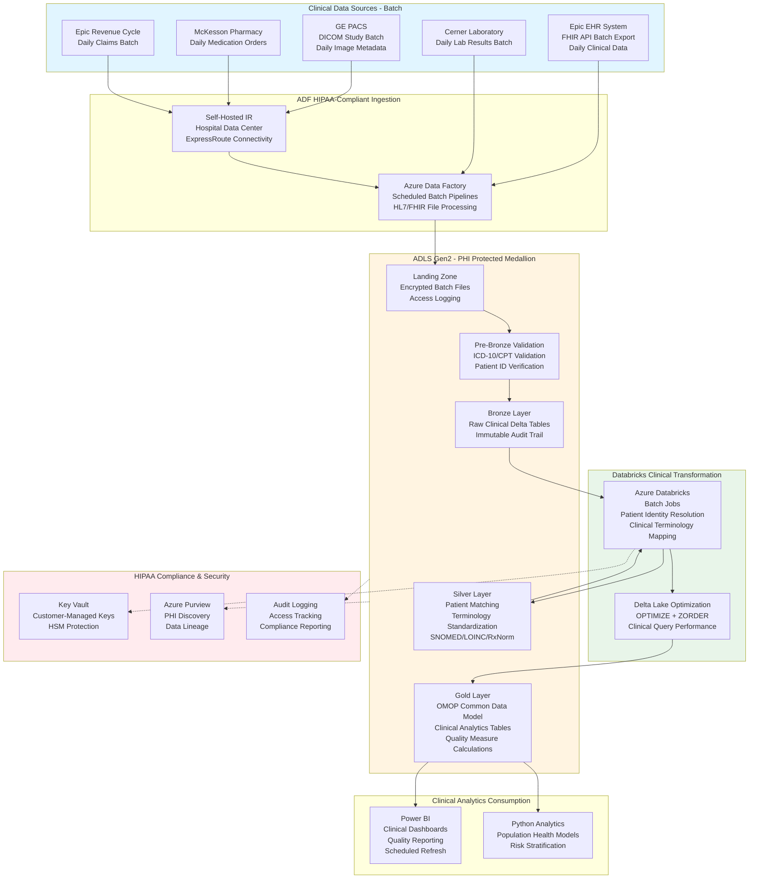

# Healthcare Data Lake Implementation

## Standardized Azure Data Engineering Workflow

**This project follows the standard Azure Data Engineering architecture pattern:**

**Data Flow:** `Clinical Systems → ADF Batch Orchestration → ADLS Medallion (Bronze → Silver → Gold) → Power BI / Python Analytics`

### Workflow Components:

1. **Azure Data Factory (ADF)** - HIPAA-compliant batch clinical data ingestion
   - Scheduled batch pipelines for EHR, Lab, PACS, Pharmacy, Billing
   - HL7/FHIR file processing with encryption
   - Daily clinical data batch extractions
   - Self-hosted IR for hospital data center connectivity

2. **ADLS Gen2 Medallion Architecture** - PHI-protected data lake
   - **Landing**: Encrypted clinical batch files with access logging
   - **Pre-Bronze**: ICD-10/CPT code validation, patient ID verification
   - **Bronze**: Immutable clinical records (50-year retention)
   - **Silver**: Patient matching, terminology standardization (SNOMED/LOINC/RxNorm)
   - **Gold**: OMOP common data model, quality measures, population health

3. **Azure Databricks** - Clinical data transformation batch jobs
   - Patient identity resolution across systems
   - Clinical terminology mapping
   - Quality measure calculations
   - HIPAA-compliant processing

4. **Power BI + Python** - Clinical analytics
   - Quality reporting dashboards (HEDIS/MIPS)
   - Population health analytics
   - Python risk stratification models

## Architecture Flow Diagram

## 1. Project Overview & Business Problem

The healthcare organization faces critical challenges managing patient data across electronic health records, laboratory systems, imaging platforms, pharmacy systems, and billing applications. Fragmented data silos prevent comprehensive patient views hindering clinical decision-making, care coordination, and population health management. Physicians lack integrated access to complete patient histories requiring manual chart review across multiple disconnected systems consuming valuable clinical time. Regulatory compliance requirements including HIPAA privacy rules and meaningful use criteria demand robust security controls, audit trails, and data governance capabilities that legacy systems cannot provide. This project implements a comprehensive Azure data lake consolidating all healthcare data sources enabling integrated analytics, clinical intelligence, operational efficiency, and regulatory compliance across the healthcare enterprise.

The platform transforms healthcare delivery by creating longitudinal patient records combining clinical encounters, lab results, radiology images, medication histories, and claims data. By integrating EHR systems, laboratory information systems, radiology PACS, pharmacy management systems, and revenue cycle platforms, clinicians gain comprehensive patient views supporting evidence-based care decisions. The solution supports both structured data from transactional systems and unstructured data including clinical notes, radiology reports, and pathology findings. Advanced analytics capabilities enable population health management, predictive risk stratification, care gap identification, and operational optimization. The centralized architecture improves clinical outcomes through better-informed care decisions, reduces costs through operational efficiencies, enhances patient safety through medication reconciliation and allergy checking, and ensures regulatory compliance through comprehensive audit trails and access controls.

- **Healthcare data fragmentation across EHR, lab, imaging, and pharmacy systems prevents integrated care.**
  Clinicians lack complete patient views requiring time-consuming manual chart review across systems.
- **Manual data aggregation for quality reporting delays submission and increases compliance risk.**
  Clinical quality teams spend weeks compiling data for HEDIS, MIPS, and meaningful use reporting.
- **Population health management impossible without integrated view of patient populations.**
  Care management teams cannot identify high-risk patients or track outcomes across care continuum.
- **Azure Data Factory, Databricks, and Synapse provide HIPAA-compliant scalable platform.**
  Cloud architecture supports healthcare data volumes with required security, privacy, and compliance controls.
- **Clinicians, care managers, quality teams, and operational leaders benefit from integrated insights.**
  Cross-functional collaboration improves through shared patient views and consistent quality metrics.

## 2. Requirement Gathering & Analysis

The requirements phase engages clinical stakeholders, IT teams, compliance officers, and operational leaders to understand data sources, use cases, and regulatory requirements. Data source mapping identifies Epic EHR, Cerner laboratory system, GE PACS radiology platform, McKesson pharmacy system, and Epic revenue cycle applications. Each source requires documentation covering HL7 interfaces, FHIR APIs, DICOM protocols, database connections, and data exchange frequencies. Clinical stakeholder workshops with physicians, nurses, pharmacists, and care managers identify critical use cases including longitudinal patient records, clinical decision support, population health risk stratification, and quality measure reporting.

Business requirements emphasize real-time clinical data availability for patient care while batch processing suffices for quality reporting and population analytics. The team documents clinical data models including patient demographics, encounters, diagnoses, procedures, medications, lab results, vital signs, and imaging studies following FHIR and OMOP common data model standards. Data quality requirements address patient matching across systems, diagnosis code validation, medication reconciliation, and lab result accuracy ensuring clinical safety and decision integrity.

Security and compliance requirements encompass HIPAA Security Rule technical safeguards, Privacy Rule minimum necessary standard, HITECH breach notification requirements, and meaningful use certification criteria. Access control matrices define role-based permissions by clinical role, department, and patient attribution with break-the-glass emergency access procedures. Integration requirements include HL7 interfaces for real-time ADT feeds, FHIR APIs for patient data access, DICOM storage for imaging studies, and CDA document exchange for care coordination.

- **Map EHR, lab, radiology PACS, pharmacy, and billing system data sources.**
  Document HL7 message specifications, FHIR resources, DICOM transfer protocols, and database schemas.
- **Identify real-time streaming for ADT messages plus daily batch for clinical and financial data.**
  Define SLAs requiring patient demographic updates within minutes and lab results within 15 minutes.
- **Estimate processing 100TB historical clinical data with 50 million daily HL7 messages.**
  Plan for 25% annual growth driven by patient volume increase and enhanced documentation.
- **Define quality rules validating patient matching, diagnosis codes, and medication accuracy.**
  Implement clinical validation checks ensuring data integrity for care decisions.
- **Gather transformation logic for quality measures, risk scores, and clinical analytics.**
  Document calculation formulas for HCC risk adjustment, HEDIS measures, and readmission predictions.
- **Enforce HIPAA Security Rule with encryption, access controls, audit logging, and breach prevention.**
  Implement minimum necessary principle restricting data access to authorized clinical purposes only.
- **Plan integrations with clinical applications, quality reporting systems, and analytics platforms.**
  Ensure HL7 feed reliability and FHIR API performance supporting clinical care workflows.

## 3. Azure Architecture Setup

The healthcare-compliant architecture establishes Azure Data Lake Storage Gen2 with zone-redundant storage ensuring high availability for critical clinical data. HIPAA compliance requires encryption at rest using customer-managed keys stored in Azure Key Vault with key rotation policies and access auditing. Azure Data Factory serves as integration engine with self-hosted integration runtime deployed in hospital data center for secure HL7 and database connectivity. ExpressRoute circuit provides dedicated network connectivity ensuring consistent low-latency data transfer and HIPAA-compliant encryption in transit.

Azure Databricks workspace deployment includes dedicated clusters for clinical data processing with Unity Catalog providing centralized governance and data lineage tracking. Cluster configurations enforce encryption of shuffle data and restrict public IP addresses maintaining HIPAA security requirements. Azure Synapse Analytics workspace combines serverless SQL pools for ad-hoc clinical queries with dedicated pools for population health analytics supporting hundreds of concurrent clinical users.

API Management provides secure FHIR API gateway with OAuth 2.0 authentication, rate limiting, and API request logging. Azure Healthcare APIs enable native FHIR resource storage with built-in HIPAA compliance and clinical data format support. Cosmos DB stores patient profiles supporting low-latency clinical application access with geo-replication for disaster recovery. Virtual network design implements hub-and-spoke topology with Azure Firewall, DDoS protection, and private endpoints for all services ensuring comprehensive network security and HIPAA compliance.

- **Provision ADLS Gen2 with zone-redundant storage and customer-managed encryption keys.**
  Configure immutable storage for audit logs satisfying HIPAA retention requirements.
- **Deploy Azure Data Factory with self-hosted runtime in hospital data center.**
  Integrate with HL7 interface engines and clinical databases using secure ExpressRoute connectivity.
- **Set up Azure Databricks with Unity Catalog and HIPAA-compliant cluster configurations.**
  Enable encryption at rest and in transit with private compute plane and no public IPs.
- **Create Synapse Analytics workspace with dedicated pools for population health queries.**
  Size appropriately supporting concurrent access from hundreds of clinical and operational users.
- **Deploy Azure Healthcare APIs providing HIPAA-compliant FHIR resource storage.**
  Enable native clinical data format support with built-in consent management and audit logging.
- **Deploy API Management gateway for secure FHIR API access with OAuth 2.0.**
  Implement rate limiting, request logging, and policy-based access controls.
- **Deploy Cosmos DB for patient profile storage with geo-replication for disaster recovery.**
  Configure appropriate consistency levels balancing performance with data accuracy requirements.
- **Configure Log Analytics workspace with HIPAA-compliant retention and access controls.**
  Enable diagnostic settings from all services capturing comprehensive audit trails.
- **Implement private endpoints for all services with ExpressRoute connectivity.**
  Disable public network access ensuring all clinical data flows through secure private networks.
- **Configure hub-and-spoke virtual network with Azure Firewall and DDoS protection.**
  Implement network security groups isolating clinical data processing workloads.
- **Apply customer-managed encryption keys with automated rotation policies.**
  Store keys in Key Vault with HSM protection meeting HIPAA encryption requirements.
- **Register all clinical data assets in Azure Purview with PHI classifications.**
  Document data lineage from source systems through transformations to clinical applications.

## 4. ADLS Folder Structure (Medallion Architecture)

The medallion architecture organizes healthcare data with strict access controls and comprehensive audit trails supporting HIPAA compliance. Landing zone receives HL7 messages, FHIR resources, DICOM images, and database extracts with immediate encryption and access logging. Pre-bronze layer implements healthcare-specific validation including patient identifier verification, diagnosis code validation against ICD-10-CM, procedure code validation against CPT/HCPCS, and medication code validation against RxNorm.

Bronze layer preserves immutable clinical source data in Delta Lake format maintaining complete audit trail required by HIPAA. All patient data includes encryption metadata, access timestamps, and data lineage information supporting breach notification and compliance auditing. Silver layer applies clinical data standardization mapping local codes to standard terminologies including SNOMED CT for diagnoses, LOINC for lab results, RxNorm for medications, and CPT for procedures.

Gold layer contains clinical data warehouse following OMOP common data model with person, visit, condition, procedure, drug, and measurement tables enabling standardized clinical analytics. Pre-aggregated tables provide quality measure numerators and denominators, population health cohorts, and clinical performance metrics. Archive layer maintains complete patient records exceeding active analysis periods with 50-year retention supporting long-term clinical research and legal requirements.

- **Landing: Encrypted temporary storage for HL7 messages, FHIR resources, and DICOM images.**
  Implement immediate encryption and comprehensive access logging supporting HIPAA audit requirements.
- **Pre-Bronze: Healthcare-specific validation checking patient IDs, diagnosis codes, and medication accuracy.**
  Validate against ICD-10-CM, CPT, HCPCS, RxNorm, and LOINC terminologies preventing invalid clinical data.
- **Bronze: Immutable encrypted clinical data with comprehensive audit metadata.**
  Maintain complete history supporting HIPAA breach notification and compliance investigations.
- **Silver: Standardized clinical data mapped to SNOMED CT, LOINC, RxNorm, and CPT.**
  Create consistent terminology enabling cross-system clinical analytics and quality reporting.
- **Gold: Clinical data warehouse following OMOP common data model standards.**
  Enable standardized population health analytics, quality reporting, and clinical research.
- **Archive: Long-term encrypted storage with 50-year retention for clinical records.**
  Support legal requirements, clinical research, and patient access to historical records.

## 5. Source System Connectivity (ADF)

Source system connectivity implements healthcare-specific integration patterns with HIPAA-compliant security. HL7 interface engine connectivity leverages MLLP adapter for real-time ADT, ORU, and ORM message ingestion with acknowledgment handling. Epic EHR connectivity uses FHIR API with OAuth 2.0 authentication extracting patient demographics, encounters, diagnoses, procedures, and medications through self-hosted integration runtime.

Laboratory system connectivity implements HL7 ORU message processing for real-time lab result ingestion with critical value flagging and delta check validation. PACS connectivity uses DICOM C-MOVE for imaging study retrieval with de-identification processing for research datasets. Pharmacy system database connectivity extracts medication dispense data, drug interactions, and formulary information through secure ODBC connections.

All connectivity implements comprehensive audit logging capturing data access timestamps, user identities, access purposes, and data elements accessed supporting HIPAA minimum necessary auditing. Connection monitoring validates endpoint availability and certificate validity before processing preventing failed transactions from impacting clinical workflows.

- **Configure HL7 MLLP adapters for real-time ADT, ORU, and ORM message ingestion.**
  Implement acknowledgment handling and message sequencing ensuring reliable clinical data flow.
- **Deploy self-hosted integration runtime in hospital data center for EHR FHIR connectivity.**
  Use ExpressRoute for secure low-latency connectivity meeting clinical application requirements.
- **Validate connectivity testing HL7 interfaces, FHIR endpoints, and DICOM transfer.**
  Ensure firewall rules permit required protocols with certificate validation for encryption.
- **Configure retry policies with clinical-appropriate timeouts for transient failures.**
  Implement dead letter queues for failed messages requiring manual review and reprocessing.
- **Tune database extraction using patient ID partitioning for large clinical tables.**
  Extract encounter and order data using date-based partitioning maximizing throughput.
- **Encrypt all connections using TLS 1.2 with mutual authentication for HIPAA compliance.**
  Implement certificate-based authentication for healthcare system connectivity.
- **Document connectivity matrix with clinical system contacts and escalation procedures.**
  Include maintenance windows and dependencies for clinical operations planning.

## 6. Ingestion Framework (ADF – Metadata Driven)

The metadata-driven ingestion framework incorporates healthcare-specific processing patterns and compliance controls. Control tables store source system details, HL7 message types, FHIR resources, extraction logic, and PHI handling flags. The framework implements consent-aware processing respecting patient opt-outs for research and marketing uses while maintaining treatment, payment, and operations access.

Lookup activities query control tables filtered by clinical priority with high-priority sources like ADT messages processing immediately while batch clinical loads execute during maintenance windows. Copy activities implement healthcare-specific transformations including patient identifier standardization across systems, date shifting for de-identification, and safe harbor PHI removal for research datasets.

Real-time HL7 message processing uses Event Hubs with consumer groups enabling parallel processing by message type. The framework implements comprehensive audit logging capturing who accessed what patient data, when, for what purpose supporting HIPAA accounting of disclosures. Error handling distinguishes clinical errors requiring immediate investigation from technical failures warranting retry, with critical clinical data failures triggering immediate clinical operations alerts.

- **Design control tables storing source details, message types, FHIR resources, and PHI flags.**
  Enable consent-aware processing respecting patient preferences for data usage.
- **Use Lookup activities querying control tables filtered by clinical priority.**
  Process high-priority ADT messages immediately while scheduling batch clinical loads appropriately.
- **Configure Copy activities with healthcare-specific transformations and de-identification logic.**
  Implement patient identifier standardization and safe harbor PHI removal for research datasets.
- **Implement real-time HL7 processing using Event Hubs with message type routing.**
  Enable parallel consumption by clinical message type with appropriate ordering guarantees.
- **Build comprehensive audit logging capturing all patient data access details.**
  Support HIPAA accounting of disclosures with who, what, when, why, and where tracking.
- **Create clinical-appropriate error handling distinguishing clinical from technical failures.**
  Alert clinical operations immediately for critical data failures impacting patient care.
- **Add patient matching logic resolving identities across clinical systems.**
  Implement probabilistic matching with manual review workflows for uncertain matches.
- **Implement comprehensive PHI access logging supporting HIPAA compliance auditing.**
  Capture detailed access trails for breach investigations and compliance reporting.
- **Design real-time triggers for ADT messages and scheduled triggers for batch clinical loads.**
  Balance clinical timeliness requirements with system load and maintenance windows.
- **Add clinical dependency management ensuring master patient index loads before encounters.**
  Implement synchronization ensuring referential integrity for clinical data relationships.

## 7. Pre-Bronze Validations

Pre-bronze validation implements healthcare-specific quality checks ensuring clinical data integrity and patient safety. Patient identifier validation checks MRN format, cross-references against master patient index, and validates identifier type codes. Diagnosis code validation ensures ICD-10-CM code validity, appropriate specificity, and valid coding combinations preventing billing denials and quality reporting errors.

Procedure code validation checks CPT and HCPCS code validity, validates against patient age and gender, and checks for mutually exclusive code combinations. Medication validation verifies RxNorm codes, checks against known drug interactions, validates dosing against patient weight and renal function, and flags high-risk medications. Lab result validation checks LOINC codes, validates results against reference ranges, flags critical values, and detects implausible results suggesting data errors.

Validation results log with clinical severity classifications determining immediate clinical notification versus batch error reporting. Failed validations potentially impacting patient safety trigger immediate alerts to clinical informatics teams. Comprehensive validation metrics support quality dashboards tracking data quality by source system and clinical domain.

- **Validate patient identifiers checking MRN format and master patient index consistency.**
  Detect missing or invalid patient IDs preventing orphaned clinical data.
- **Validate diagnosis codes against ICD-10-CM terminology with specificity checking.**
  Ensure valid coding combinations and appropriate clinical specificity for quality reporting.
- **Validate procedure codes against CPT/HCPCS with age, gender, and combination checking.**
  Detect invalid procedure codes preventing billing denials and compliance issues.
- **Validate medications against RxNorm with interaction checking and dosing validation.**
  Flag high-risk medications and detect implausible dosing requiring clinical review.
- **Validate lab results against LOINC with reference range and critical value checking.**
  Detect implausible results suggesting data errors or critical clinical conditions.
- **Store validation results with clinical severity classifications for prioritized review.**
  Enable immediate clinical notification for patient safety issues versus batch error reporting.
- **Move failed clinical data to quarantine with clinical informatics team alerting.**
  Provide detailed error context facilitating rapid clinical and technical resolution.

## 8. Bronze Layer Processing

Bronze layer establishes comprehensive audit trail of clinical source data with HIPAA-compliant security and access controls. HL7 messages, FHIR resources, laboratory results, and imaging metadata land in Delta Lake tables encrypted with customer-managed keys. Technical metadata includes comprehensive access logging capturing accessing user, timestamp, access purpose, and PHI elements accessed supporting HIPAA accounting of disclosures.

Streaming ingestion from HL7 interface engines uses Databricks Autoloader with exactly-once processing semantics preventing duplicate clinical messages impacting care decisions. Checkpointing ensures processing resumes correctly after failures without clinical data loss. Minimal transformations include HL7 segment parsing, FHIR resource flattening, and timestamp normalization while preserving complete original messages for clinical and legal reference.

Partition strategy uses patient ID hashing distributing clinical data evenly while enabling efficient patient-centric queries. Retention policies maintain complete clinical records with 50-year retention supporting long-term care continuity and legal requirements. Schema evolution handles healthcare platform upgrades introducing new HL7 segments or FHIR extensions without processing failures.

- **Store immutable encrypted clinical data in Delta format with comprehensive audit metadata.**
  Maintain complete message and transaction history supporting HIPAA compliance and breach notification.
- **Maintain streaming checkpoint state for HL7 message processing ensuring exactly-once semantics.**
  Prevent duplicate clinical messages impacting care decisions and quality reporting.
- **Track comprehensive access metadata capturing who, what, when, why, and where details.**
  Support HIPAA accounting of disclosures and breach investigation requirements.
- **Apply minimal transformations preserving complete original clinical messages.**
  Maintain unaltered source data for clinical reference and legal discovery requirements.
- **Partition bronze tables using patient ID hash distributing data evenly.**
  Enable efficient patient-centric queries while maintaining balanced data distribution.
- **Enable schema evolution handling healthcare platform upgrades gracefully.**
  Accommodate new HL7 segments and FHIR extensions without ingestion failures.

## 9. Silver Layer Transformations (Databricks + PySpark)

Silver layer transformations create standardized clinical data models enabling cross-system analytics and quality reporting. Patient matching implements probabilistic algorithms combining name, date of birth, SSN, and address creating golden patient records linking identities across clinical systems. Match confidence scoring enables manual review workflows for uncertain matches preventing incorrect patient record merges impacting clinical safety.

Clinical terminology mapping standardizes local codes to universal terminologies including ICD-10-CM to SNOMED CT for diagnoses, local lab codes to LOINC for results, proprietary drug codes to RxNorm for medications, and local procedure codes to CPT for interventions. Data cleansing addresses common clinical data quality issues including diagnosis code specificity improvement, medication sig standardization, lab result unit normalization, and vital sign outlier detection.

Clinical data enrichment joins encounters with diagnoses, procedures, lab results, medications, and vital signs creating comprehensive visit summaries. Longitudinal patient timelines sequence all clinical events enabling care pathway analysis and outcome tracking. Slowly changing dimension logic maintains historical patient demographic and provider attribute changes supporting point-in-time clinical analytics.

- **Clean clinical data standardizing names, addresses, diagnoses, and medication descriptions.**
  Apply healthcare-specific parsing handling name prefixes, suffixes, and title variations.
- **Remove duplicate patients across systems using probabilistic matching with confidence scoring.**
  Link patient records across EHR, lab, pharmacy, and billing systems creating golden patient records.
- **Perform clinical terminology mapping to SNOMED CT, LOINC, RxNorm, and CPT standards.**
  Enable standardized clinical analytics and quality reporting across disparate systems.
- **Implement patient matching creating master patient index linking identities across systems.**
  Apply probabilistic algorithms with manual review workflows for uncertain matches preventing errors.
- **Apply clinical data quality checks validating diagnoses, procedures, medications, and results.**
  Detect implausible clinical values, code combinations, and temporal inconsistencies.
- **Implement SCD Type 2 for patient and provider master data tracking changes over time.**
  Maintain effective date ranges supporting point-in-time clinical analytics and attribution.
- **Use MERGE INTO for efficient incremental processing of clinical encounters and results.**
  Update existing records and insert new entries maintaining referential integrity.
- **Use Autoloader for continuous HL7 message stream processing with exactly-once semantics.**
  Benefit from automatic schema evolution handling healthcare platform upgrades.
- **Apply partition pruning using patient ID and date-based partitions optimizing queries.**
  Enable efficient patient-centric queries and population-level analytics.
- **Enforce Delta constraints on patient ID, encounter ID, and temporal validity.**
  Reject records violating clinical data integrity rules with logging to exception tables.
- **Document clinical transformation logic with terminology mapping decisions annotated.**
  Maintain transparency for clinical stakeholders understanding data derivations.
- **Validate output comparing patient counts, encounter volumes, and diagnostic totals against bronze.**
  Implement reconciliation ensuring no clinical data loss during transformations.

## 10. Gold Layer Aggregations

Gold layer delivers clinical data warehouse following industry-standard models enabling advanced analytics and quality reporting. The person table contains unified patient demographics with linkages across clinical systems. Visit occurrence table captures all clinical encounters with encounter type, admit/discharge timestamps, and attending providers. Condition occurrence table records all diagnoses with onset dates, ICD-10-CM codes, SNOMED CT mappings, and diagnosis types.

Procedure occurrence table documents all clinical interventions with procedure dates, CPT codes, performing providers, and procedure contexts. Drug exposure table captures all medication orders and dispenses with RxNorm codes, dosing instructions, dispense quantities, and administration routes. Measurement table contains all lab results, vital signs, and clinical observations with LOINC codes, values, units, and reference ranges.

Pre-aggregated tables compute quality measure numerators and denominators for HEDIS, MIPS, and meaningful use reporting. Population health cohorts identify high-risk patients, care gaps, and intervention opportunities. Clinical performance metrics track provider productivity, documentation quality, and order appropriateness. Z-ordering optimizes query performance for common clinical query patterns filtering by patient, provider, diagnosis, and date ranges.

- **Build person dimension with unified patient demographics and system linkages.**
  Include patient demographics, contact information, and identifiers across all clinical systems.
- **Build visit occurrence fact capturing all encounters with types, dates, and providers.**
  Enable encounter-based analytics, utilization reporting, and care pathway analysis.
- **Build condition occurrence fact recording diagnoses with ICD-10-CM and SNOMED CT codes.**
  Support disease prevalence analysis, comorbidity assessment, and quality gap identification.
- **Design OMOP common data model enabling standardized clinical analytics.**
  Ensure compatibility with clinical research tools and population health applications.
- **Create quality measure tables pre-computing numerators and denominators for reporting.**
  Accelerate HEDIS, MIPS, and meaningful use reporting with pre-calculated measures.
- **Compute clinical KPIs for utilization rates, quality performance, and population health metrics.**
  Apply consistent clinical formulas ensuring metric standardization across analytics.
- **Use window functions for longitudinal patient analysis and care progression tracking.**
  Enable patient timeline analysis, care pathway identification, and outcome assessment.
- **Optimize gold tables using Z-ordering on patient_id, provider_id, and diagnosis columns.**
  Cluster related clinical data improving query performance for common analytical patterns.

## 11. Delta Lake Optimization Techniques

Delta Lake optimization ensures clinical queries maintain acceptable performance supporting care delivery and operational workflows. OPTIMIZE commands consolidate small files generated by continuous HL7 message streaming into right-sized files reducing metadata overhead. ZORDER BY clauses organize data by patient ID, provider ID, and encounter date enabling effective data skipping for patient-centric and provider-focused queries.

VACUUM operations remove old file versions with extended retention periods supporting clinical investigations requiring time-travel to historical data states. Auto-optimize features enabled on high-velocity clinical event tables automatically compact files during writes. Bloom filters on patient ID and encounter ID enable fast point lookups supporting clinical application queries requiring sub-second response times.

Table caching stores frequently accessed patient demographic and provider dimension tables in cluster memory. Partition strategy balances patient-centric access patterns with population-level analytics using patient ID hash partitions for encounter data and date partitions for population queries.

- **Use OPTIMIZE with ZORDER BY patient_id, provider_id, encounter_date for data skipping.**
  Cluster clinical data enabling effective skipping for patient and provider queries.
- **Use VACUUM with 90-day retention supporting clinical investigations and audit requirements.**
  Balance storage costs with time-travel needs for historical clinical data analysis.
- **Enable auto-compaction on high-velocity clinical message tables from HL7 streams.**
  Automatically consolidate streaming micro-batch files maintaining query performance.
- **Use caching for patient and provider dimension tables supporting clinical applications.**
  Store frequently accessed master data in cluster memory enabling sub-second lookups.
- **Use data skipping via Delta statistics on patient, provider, and date columns.**
  Avoid scanning irrelevant clinical data improving query response times.
- **Partition tables by patient ID hash for encounters and by date for population analytics.**
  Balance patient-centric query patterns with population-level reporting requirements.
- **Use schema evolution managing healthcare platform upgrades adding new clinical elements.**
  Handle new HL7 segments and FHIR resources gracefully without pipeline failures.
- **Tune shuffle partitions based on cluster size and clinical data volumes.**
  Optimize shuffle operations during patient matching and clinical aggregations.

## 12. Consumption Layer (Synapse + Power BI)

The consumption layer provides clinicians and analysts secure, performant access to integrated clinical data. Synapse serverless SQL pools expose external tables referencing clinical gold Delta tables enabling HIPAA-compliant T-SQL queries. Views implement pre-computed clinical logic including HCC risk scores, quality gap identification, and care team attribution simplifying clinical application development.

Power BI clinical dashboards leverage role-based security filtering data by provider attribution, department assignment, and patient panel membership. Real-time patient census dashboards use DirectQuery providing current bed occupancy, admission/discharge/transfer activities, and emergency department flow. Historical quality performance reports use imported data models with incremental refresh optimizing performance.

Clinical application APIs built on Synapse SQL endpoints provide FHIR resource access, patient summary retrieval, and care gap identification supporting electronic health record integrations and clinical decision support tools. Row-level security implements HIPAA minimum necessary principle restricting clinical data access to authorized purposes and appropriate patient populations.

- **Create external tables in Synapse serverless SQL referencing clinical gold Delta tables.**
  Enable HIPAA-compliant T-SQL querying for clinical analytics and reporting applications.
- **Use views pre-computing HCC risk scores, quality gaps, and care team attribution.**
  Simplify clinical application development encapsulating complex clinical logic.
- **Enable DirectQuery for real-time patient census and emergency department dashboards.**
  Provide current operational visibility supporting clinical and capacity management decisions.
- **Build Power BI clinical dashboards with measures calculating quality metrics and utilization rates.**
  Apply DAX formulas for HEDIS measures, readmission rates, and length of stay calculations.
- **Implement row-level security filtering by provider attribution and department assignment.**
  Enforce HIPAA minimum necessary principle restricting data access to appropriate patient populations.
- **Publish dashboards with scheduled refresh during off-peak hours minimizing system impact.**
  Configure incremental refresh for large clinical fact tables reducing refresh times.
- **Optimize Power BI using aggregations for population health and quality performance summaries.**
  Use composite models balancing real-time clinical needs with historical trend analysis.

## 13. Monitoring & Alerting

Comprehensive monitoring ensures clinical data pipeline reliability supporting patient care operations. Azure Monitor collects metrics from clinical interface pipelines tracking HL7 message processing rates, FHIR API response times, and data ingestion volumes. Log Analytics aggregates diagnostic logs enabling correlation analysis of clinical system integration failures.

Event Hub monitoring tracks HL7 message ingestion throughput and consumer lag alerting when real-time clinical processing falls behind. Databricks monitoring captures clinical transformation job performance with alerts for failures in patient matching, terminology mapping, or quality measure calculations. Clinical data quality monitoring tracks validation failure rates, missing required data elements, and terminology mapping coverage.

Business continuity monitoring validates disaster recovery configurations, backup completion, and failover readiness. Clinical SLA tracking measures ADT message processing latency, lab result availability time, and quality report generation completion against business requirements. Compliance monitoring tracks unauthorized PHI access attempts, audit log completeness, and encryption key usage.

- **Monitor ADF clinical pipelines tracking HL7 processing rates and FHIR API performance.**
  Create alerts for clinical interface failures impacting care delivery workflows.
- **Enable Event Hub monitoring tracking HL7 message throughput and consumer lag.**
  Alert when real-time clinical processing falls behind potentially delaying care decisions.
- **Enable Databricks monitoring capturing clinical transformation job performance.**
  Track patient matching accuracy, terminology mapping coverage, and processing failures.
- **Use Log Analytics for clinical system integration failure correlation and root cause analysis.**
  Build dashboards visualizing clinical data pipeline health with system-specific drill-down.
- **Configure alerts for critical clinical pipeline failures with clinical informatics notification.**
  Implement escalation for repeated failures impacting patient care or quality reporting.
- **Implement SLA tracking measuring clinical data freshness against care delivery requirements.**
  Monitor ADT message latency, lab result availability, and imaging study processing times.
- **Capture clinical data quality metrics tracking validation failures and completeness.**
  Monitor diagnosis coding completeness, medication reconciliation rates, and documentation quality.
- **Integrate security monitoring detecting unauthorized PHI access and suspicious activities.**
  Alert security teams for potential HIPAA breaches or inappropriate data access attempts.
- **Monitor HIPAA compliance tracking audit log completeness and encryption status.**
  Ensure continuous compliance with technical safeguards and security requirements.
- **Build clinical operations dashboards visualizing end-to-end data flow and quality metrics.**
  Provide unified monitoring supporting clinical informatics and IT operations teams.

## 14. Security & Governance

Comprehensive security controls ensure HIPAA compliance protecting patient privacy and data security. Azure Key Vault stores encryption keys, database credentials, and API secrets with HSM protection and automated rotation policies. Customer-managed encryption keys encrypt all patient data at rest meeting HIPAA encryption requirements with cryptographic key management and access auditing.

Private endpoints ensure all clinical data transmission occurs through private networks with ExpressRoute connectivity eliminating public internet exposure. Virtual network service endpoints and private DNS zones provide secure name resolution without external queries. Network security groups implement least-privilege network access permitting only required clinical workflows with comprehensive network flow logging.

Azure Purview provides comprehensive data catalog with automated PHI discovery, data lineage tracking from clinical sources through transformations to analytical applications, and policy-based access governance. Sensitivity labels classify protected health information enabling automated data protection policies. Comprehensive audit logging captures all PHI access with who, what, when, where, and why details supporting HIPAA accounting of disclosures and breach investigations.

- **Store encryption keys in Key Vault with HSM protection and automated rotation.**
  Implement comprehensive key access auditing supporting HIPAA cryptographic key management.
- **Use managed identities for all service-to-service authentication eliminating credentials.**
  Avoid password management overhead and security risks from credential exposure.
- **Enable private endpoints for all services with ExpressRoute connectivity.**
  Eliminate public internet exposure for clinical data transmission meeting HIPAA requirements.
- **Implement virtual networks with service endpoints and private DNS zones.**
  Ensure secure name resolution and network traffic isolation for clinical workloads.
- **Apply network security groups with least-privilege access rules.**
  Permit only required clinical workflows with comprehensive network flow logging.
- **Encrypt all data in transit using TLS 1.2 with mutual authentication.**
  Implement certificate-based authentication for clinical system connectivity.
- **Encrypt all data at rest using customer-managed keys meeting HIPAA requirements.**
  Apply field-level encryption for highly sensitive clinical data elements.
- **Implement Azure Purview for PHI discovery, data lineage, and access governance.**
  Enable automated data protection policies based on sensitivity classifications.
- **Enable comprehensive audit logging capturing all PHI access details.**
  Support HIPAA accounting of disclosures and breach notification requirements.
- **Maintain HIPAA compliance with documented security policies and procedures.**
  Implement technical and administrative safeguards satisfying Security Rule requirements.

## 15. CI/CD Pipeline Setup (Azure DevOps or GitHub Actions)

CI/CD pipelines automate healthcare data platform deployments with appropriate validation and compliance controls. Azure DevOps repositories store Data Factory clinical interface pipelines, Databricks clinical transformation notebooks, Synapse clinical data warehouse scripts, and infrastructure-as-code templates with branch protection requiring security review before production deployment.

ARM templates define HIPAA-compliant infrastructure configurations including encryption settings, network isolation, audit logging, and access controls with parameters supporting environment-specific configurations. Release pipelines deploy to development environment first with automated validation testing including clinical data quality checks, terminology mapping verification, and patient matching accuracy assessment.

Approval gates require clinical informatics and compliance team validation before production deployment ensuring clinical accuracy and regulatory compliance. Databricks Repos synchronizes clinical transformation notebooks with automated job configuration updates. Database deployment scripts implement idempotent clinical data warehouse DDL with schema comparison detecting drift from source control definitions.

- **Use Git integration for ADF storing clinical interface pipeline definitions with version control.**
  Enable security review workflows and change tracking for regulatory compliance.
- **Use Databricks Repos syncing clinical transformation notebooks across environments.**
  Support collaborative development with automated deployment and version management.
- **Use ARM templates deploying HIPAA-compliant infrastructure consistently.**
  Parameterize security configurations ensuring compliance across all environments.
- **Use YAML pipelines automating build, validation testing, and deployment workflows.**
  Standardize CI/CD processes with clinical data quality validation gates.
- **Parameterize deployments with environment-specific security and compliance configurations.**
  Externalize settings avoiding hardcoded values while maintaining security standards.
- **Use approval gates requiring clinical informatics and compliance team validation.**
  Implement manual checkpoints ensuring clinical accuracy and HIPAA compliance.
- **Implement automated testing validating clinical data quality and terminology mapping.**
  Test patient matching accuracy, code validity, and referential integrity before production.
- **Deploy Synapse clinical warehouse scripts with idempotent DDL and schema validation.**
  Apply versioning supporting repeated deployments without clinical data disruption.
- **Implement incremental deployment updating only changed clinical pipelines and transformations.**
  Minimize disruption to operational clinical workflows during deployments.
- **Document CI/CD workflows with clinical validation procedures and compliance requirements.**
  Provide operational guidance ensuring regulatory compliance during deployments.

## 16. Performance Optimization

Performance optimization ensures clinical applications receive timely data supporting care delivery workflows. Data Factory DIU tuning allocates appropriate resources for HL7 message processing and batch clinical extractions. Parallel processing configurations enable concurrent EHR, lab, pharmacy, and radiology ingestion maximizing throughput.

Databricks cluster sizing uses memory-optimized VMs for patient matching and clinical aggregation workloads. Broadcast join optimization caches patient and provider dimensions in executor memory eliminating shuffle operations. Delta Lake OPTIMIZE and ZORDER operations maintain query performance for patient-centric and population-level clinical queries.

Synapse dedicated SQL pools use appropriate distribution strategies with hash distribution on patient ID for large clinical fact tables. Clinical query optimization implements appropriate columnstore indexes, statistics maintenance, and execution plan analysis ensuring sub-second response times for clinical application queries.

- **Tune ADF DIUs allocating sufficient resources for high-volume HL7 message processing.**
  Optimize clinical interface performance ensuring SLA compliance during peak admission periods.
- **Use broadcast joins caching patient and provider dimensions in executor memory.**
  Eliminate shuffle operations improving clinical transformation performance.
- **Tune Databricks clusters with memory-optimized VMs for patient matching workloads.**
  Enable autoscaling handling variable clinical data volumes across day and night shifts.
- **Use Delta Lake OPTIMIZE with ZORDER BY patient_id, provider_id, encounter_date.**
  Cluster clinical data enabling effective data skipping for common query patterns.
- **Use caching for frequently accessed patient and provider dimension tables.**
  Support sub-second clinical application queries requiring immediate response times.
- **Tune Synapse queries with hash distribution on patient ID and appropriate indexing.**
  Optimize clinical data warehouse query performance for population health analytics.
- **Optimize clinical dashboards using Power BI aggregations and composite models.**
  Balance real-time clinical needs with historical trend analysis performance requirements.

## 17. Cost Optimization

Cost optimization balances clinical data requirements with budget constraints. Databricks autoscaling policies dynamically adjust cluster sizes based on clinical workload patterns with higher capacity during peak admission periods and lower capacity overnight. Job clusters right-size resources based on actual clinical processing requirements rather than over-provisioning.

ADLS lifecycle management automatically transitions aged clinical data to cool tier after 2 years and archive tier after 7 years reducing storage costs while maintaining long-term retention for clinical and legal requirements. Pipeline scheduling executes non-critical clinical loads during off-peak hours when compute costs are lower.

Synapse serverless SQL provides cost-effective querying for ad-hoc clinical analysis and population health research avoiding dedicated pool costs for intermittent workloads. Cost allocation tags enable chargeback models attributing platform costs to clinical departments and service lines.

- **Enable autoscaling with clinical workload-appropriate capacity during peak admission periods.**
  Scale clusters based on actual clinical processing demand avoiding over-provisioning.
- **Use cool and archive storage tiers for aged clinical data meeting retention requirements.**
  Reduce storage costs while maintaining 50-year clinical record availability.
- **Optimize pipeline runtimes through performance improvements reducing compute costs.**
  Efficient clinical processing completes using fewer resources lowering overall expenses.
- **Schedule non-critical clinical loads during off-peak hours when costs are lower.**
  Execute population health analytics and quality reporting overnight.
- **Use Synapse serverless SQL for ad-hoc clinical queries avoiding dedicated pool costs.**
  Reserve dedicated pools for scheduled clinical dashboards requiring high performance.
- **Use appropriate cluster sizing based on clinical workload characteristics.**
  Right-size patient matching and terminology mapping jobs avoiding resource waste.
- **Implement cost allocation tags enabling clinical department chargeback models.**
  Attribute platform costs to service lines and departments supporting budget management.

## 18. Documentation & KT

Comprehensive documentation ensures successful clinical operations and regulatory compliance. Architecture diagrams illustrate clinical data flows from healthcare systems through processing stages to clinical applications using healthcare-standard notation. Clinical interface specifications document HL7 message structures, FHIR resource mappings, and DICOM transfer protocols.

Runbooks provide step-by-step procedures for clinical operations including HL7 interface troubleshooting, patient matching investigation, terminology mapping maintenance, and HIPAA breach response. Data dictionaries document all clinical data warehouse tables with medical terminology definitions, clinical context, and data element relationships. Compliance documentation demonstrates HIPAA technical safeguards implementation with security controls, audit procedures, and privacy protections.

Knowledge transfer sessions cover clinical data platform architecture, healthcare terminology standards, operational procedures, and regulatory compliance with recorded presentations. Executive summary presents platform capabilities, clinical benefits including care quality improvements and operational efficiencies, and population health management outcomes demonstrating value delivered to the healthcare organization.

- **Prepare clinical architecture diagrams showing healthcare system integrations and data flows.**
  Include HL7 message flows, FHIR resource mappings, and clinical terminology transformations.
- **Create clinical interface specifications documenting message structures and processing logic.**
  Provide detailed HL7 segment specifications, FHIR resource mappings, and validation rules.
- **Create operational runbooks for clinical interface troubleshooting and patient matching.**
  Define procedures for common clinical informatics issues and escalation paths.
- **Maintain clinical data dictionaries with medical terminology definitions and clinical context.**
  Include ICD-10-CM, CPT, LOINC, RxNorm, and SNOMED CT mappings and business rules.
- **Document HIPAA compliance controls demonstrating technical safeguards implementation.**
  Provide evidence for regulatory audits and compliance certifications.
- **Conduct knowledge transfer covering healthcare terminology and regulatory requirements.**
  Provide clinical context enabling technical teams to support healthcare workflows.
- **Provide executive summary documenting clinical outcomes and operational improvements.**
  Include quality measure performance, care gap closure rates, and population health metrics.

