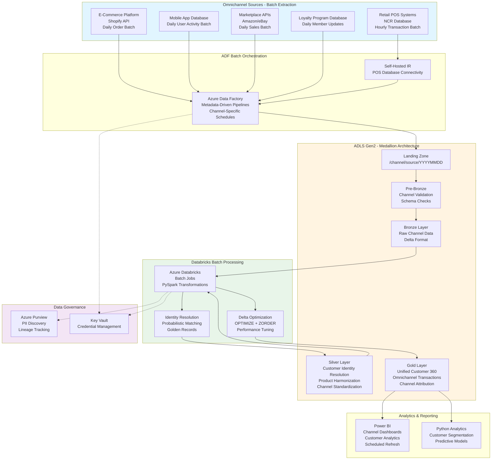

# Multi-Channel Retail Data Platform

## Standardized Azure Data Engineering Workflow

**This project follows the standard Azure Data Engineering architecture pattern:**

**Data Flow:** `Retail Channels → ADF Batch Orchestration → ADLS Medallion (Bronze → Silver → Gold) → Power BI / Python Analytics`

### Workflow Components:

1. **Azure Data Factory (ADF)** - Orchestrates omnichannel batch data ingestion
   - Channel-specific metadata-driven pipelines
   - Scheduled batch loads (hourly/daily per channel)
   - Watermark-based incremental extraction
   - Self-hosted IR for POS database connectivity

2. **ADLS Gen2 Medallion Architecture** - Channel-segregated data lake
   - **Landing**: Channel-specific batch file arrival (/channel/source/date)
   - **Pre-Bronze**: Channel validation with schema checks
   - **Bronze**: Raw channel data in Delta format
   - **Silver**: Customer identity resolution and product harmonization
   - **Gold**: Unified omnichannel analytics with customer 360

3. **Azure Databricks** - Customer MDM and channel integration batch jobs
   - Probabilistic customer matching across channels
   - Product catalog harmonization
   - Channel attribution logic
   - Scheduled job execution

4. **Power BI + Python** - Omnichannel analytics
   - Channel performance dashboards
   - Customer journey analytics
   - Python customer segmentation models

## Architecture Flow Diagram

## 1. Project Overview & Business Problem

The multi-channel retail organization faces critical challenges integrating data from online e-commerce platforms, brick-and-mortar stores, mobile applications, and third-party marketplace channels. Customers interact across multiple touchpoints expecting seamless experiences, but fragmented data systems prevent unified customer views and consistent inventory visibility. Marketing campaigns execute in silos without understanding cross-channel customer journeys leading to inefficient spend and missed personalization opportunities. Store managers lack real-time inventory visibility across channels causing stockouts in stores while online warehouses maintain excess inventory. This project establishes a unified Azure data platform consolidating all channel data enabling omnichannel analytics, personalized customer experiences, and optimized inventory allocation across the retail network.

The platform transforms retail operations by creating single customer views combining online browsing behavior, mobile app usage, in-store purchase history, and customer service interactions. By integrating point-of-sale systems, e-commerce platforms, mobile app backends, warehouse management systems, and marketing automation tools, the organization gains comprehensive visibility into customer preferences, channel performance, and inventory dynamics. The solution supports both batch processing for historical analysis and streaming ingestion for real-time personalization and inventory updates. Advanced analytics capabilities enable customer lifetime value prediction, next-best-action recommendations, demand forecasting across channels, and optimal inventory positioning. The centralized architecture increases online conversion rates through personalization, reduces inventory costs through better allocation, and improves customer satisfaction through consistent omnichannel experiences.

- **Data fragmentation across online, mobile, retail store, and marketplace channels prevents unified analytics.**
  Marketing and merchandising teams lack visibility into complete customer journeys across touchpoints.
- **Inconsistent inventory data across channels causes stockouts and excess inventory.**
  Customers experience frustration when online inventory shows availability but stores are out of stock.
- **Manual reporting consolidates channel data weekly delaying insights into campaign performance.**
  Marketing cannot optimize campaigns mid-flight lacking real-time visibility into channel effectiveness.
- **Azure Data Factory, Databricks, and Synapse enable scalable omnichannel data platform.**
  Cloud architecture integrates diverse channel systems supporting real-time and batch processing requirements.
- **Marketing, merchandising, store operations, and customer service teams benefit from unified insights.**
  Cross-functional collaboration improves through shared customer views and consistent metrics.

## 2. Requirement Gathering & Analysis

The requirements phase maps all channel data sources including Shopify e-commerce platform, retail POS systems from NCR, iOS and Android mobile app backends, Amazon and eBay marketplace APIs, and customer data from Salesforce Marketing Cloud. Each source requires documentation covering API specifications, data schemas, authentication methods, rate limits, and data refresh frequencies. Stakeholder workshops with marketing, merchandising, store operations, and customer service teams identify critical analytics use cases including customer journey analysis, inventory optimization, campaign attribution, and customer lifetime value modeling.

Business requirements emphasize real-time data availability for inventory visibility and personalization engines while batch processing suffices for historical trend analysis and forecasting models. The team documents calculation logic for key metrics including conversion rates by channel, average order value, customer retention rates, inventory turnover, and marketing ROI. Data quality requirements address customer identity resolution across channels, product catalog harmonization, and transaction reconciliation ensuring order totals match across systems.

Security and compliance requirements encompass PCI DSS for payment card data, GDPR and CCPA for customer privacy, access controls by business function, and audit trails for regulatory compliance. Integration requirements include real-time APIs for personalization engines, batch feeds for BI dashboards, and event streams for operational alerting systems.

- **Map e-commerce, POS, mobile app, marketplace, and marketing automation system data sources.**
  Document API specifications, authentication methods, rate limits, and network connectivity requirements.
- **Identify real-time streaming for inventory and customer events plus daily batch for transactions.**
  Define SLAs requiring inventory updates within 5 minutes and customer profile refresh within 1 hour.
- **Estimate processing 50TB historical data with 200 million daily customer interaction records.**
  Plan for 35% annual growth driven by store expansion and increasing mobile app adoption.
- **Define quality rules for customer identity resolution, product catalog matching, and order reconciliation.**
  Implement cross-channel customer matching and validation that order totals reconcile across systems.
- **Gather transformation logic for conversion rates, customer lifetime value, and inventory metrics.**
  Document calculation formulas for channel attribution, cart abandonment, and stock availability.
- **Enforce PCI DSS compliance with tokenization and GDPR consent tracking with audit logging.**
  Implement field-level encryption for payment data and right-to-erasure workflows for customer requests.
- **Plan integrations with personalization engines, BI tools, marketing automation, and alert systems.**
  Ensure sub-second API response for real-time personalization and event-driven inventory alerts.

## 3. Azure Architecture Setup

The architecture establishes Azure Data Lake Storage Gen2 as the centralized omnichannel data repository with hierarchical namespace and lifecycle management optimizing costs while maintaining performance. Zone-redundant storage ensures high availability for business-critical customer and inventory data. Azure Data Factory serves as the orchestration engine with integration runtime configurations supporting both cloud API connectivity and on-premises POS system extraction through self-hosted runtime deployed in retail data center.

Azure Databricks workspace deployment includes separate clusters for streaming ingestion processing real-time customer events and batch processing for historical analysis and machine learning model training. Unity Catalog provides centralized governance across all retail data assets. Azure Synapse Analytics workspace combines serverless SQL pools for ad-hoc exploration with dedicated SQL pools for high-performance dashboard queries supporting thousands of concurrent business users.

Event Hubs namespace ingests real-time streams from POS systems, mobile apps, and e-commerce platforms with partitioning enabling parallel consumption by downstream processors. Cosmos DB provides low-latency storage for customer profiles supporting personalization API requirements for sub-100ms response times. Azure Key Vault manages credentials for all source systems with automated secret rotation. Networking implements private endpoints for all services with traffic routed through hub-and-spoke virtual network topology secured by Azure Firewall.

- **Provision ADLS Gen2 with zone-redundant storage for customer and inventory data.**
  Configure lifecycle policies transitioning aged transaction history to cool tier after 90 days.
- **Deploy Azure Data Factory with self-hosted runtime in retail data center for POS connectivity.**
  Configure cloud runtime for e-commerce, mobile, and marketplace API integrations.
- **Set up Azure Databricks with dedicated streaming and batch processing clusters.**
  Configure streaming cluster for real-time event processing and batch cluster for ML workloads.
- **Create Synapse Analytics workspace with dedicated SQL pools for dashboard queries.**
  Size dedicated pools supporting thousands of concurrent marketing and operations users.
- **Deploy Event Hubs for real-time ingestion of POS, mobile, and e-commerce events.**
  Configure partition count supporting required throughput with appropriate retention policies.
- **Deploy Cosmos DB for customer profile storage supporting personalization APIs.**
  Configure global distribution and appropriate consistency levels for low-latency access.
- **Integrate Azure Key Vault for credential management with automated rotation.**
  Store e-commerce API keys, POS credentials, and database passwords with RBAC access control.
- **Configure Log Analytics workspace aggregating metrics from all channel integrations.**
  Enable diagnostic settings from ADF, Databricks, Event Hubs, and Synapse.
- **Implement private endpoints for ADLS, Synapse, Event Hubs, and Cosmos DB.**
  Disable public network access routing all traffic through virtual network private links.
- **Configure hub-and-spoke virtual network with Azure Firewall in hub.**
  Implement network security groups on spokes isolating channel data processing workloads.
- **Apply encryption at rest and in transit using Microsoft-managed keys.**
  Enable HTTPS-only access and secure transfer required on all storage accounts.
- **Register all retail data assets in Azure Purview with channel-based classifications.**
  Document data lineage from source channels through transformations to analytical models.

## 4. ADLS Folder Structure (Medallion Architecture)

The medallion architecture organizes omnichannel retail data with channel segregation supporting independent processing while enabling cross-channel analytics. Landing zone separates channel arrivals with structure /landing/{channel}/{source}/{date} ensuring proper isolation and lineage tracking. Pre-bronze layer implements channel-specific validation rules accommodating format variations across e-commerce platforms, POS systems, and mobile apps while enforcing consistent quality standards.

Bronze layer preserves immutable source data partitioned by channel and date /bronze/{channel}/{entity}/{year}/{month}/{day} maintaining complete audit trail for transaction reconciliation and regulatory compliance. Delta Lake format provides ACID guarantees essential for financial reconciliation across channels. Silver layer harmonizes data across channels applying customer identity resolution, product catalog matching, and transaction normalization creating unified customer and product views.

Gold layer contains omnichannel data models including unified customer dimension combining attributes from all channels, transaction fact tables with channel attribution, inventory snapshot tables aggregating across locations, and customer journey fact tables tracking cross-channel interactions. Pre-aggregated tables provide channel performance summaries accelerating executive dashboards. Archive layer retains historical transaction data beyond active analysis periods in cost-effective storage tiers.

- **Landing: Channel-segregated temporary storage /landing/{channel}/{source}/{YYYYMMDD}.**
  Separate online, mobile, retail, and marketplace data enabling independent processing pipelines.
- **Pre-Bronze: Channel-specific validation accommodating platform variations and format differences.**
  Validate Shopify JSON structures differently from NCR POS delimited files and mobile app events.
- **Bronze: Immutable channel data partitioned as /bronze/{channel}/{entity}/{YYYY}/{MM}/{DD}.**
  Maintain complete transaction audit trail supporting reconciliation and regulatory compliance.
- **Silver: Unified channel data with customer identity resolution and product matching applied.**
  Create golden customer records resolving identities across email, mobile ID, and loyalty numbers.
- **Gold: Omnichannel data models with unified customers, attributed transactions, and journey tracking.**
  Enable cross-channel analysis with pre-aggregated channel performance and customer segment tables.
- **Archive: Historical transaction data in compressed Parquet format for compliance retention.**
  Maintain 7-year purchase history in archive tier supporting customer service inquiries.

## 5. Source System Connectivity (ADF)

Source system connectivity integrates diverse retail channel platforms with appropriate authentication and error handling for each. Shopify e-commerce connectivity uses REST API linked service with OAuth 2.0 authentication, implementing pagination for order and customer data extraction with rate limit handling. Retail POS system connectivity leverages self-hosted integration runtime with ODBC connections to store databases, extracting transaction data using incremental queries based on transaction timestamps.

Mobile app backend APIs connect through REST linked services with JWT token authentication retrieved from Key Vault, implementing retry logic for transient network failures. Amazon and eBay marketplace integrations use platform-specific connectors with API credentials secured in Key Vault, handling rate limits and quota management. Salesforce Marketing Cloud connectivity leverages native connector with bulk API for efficient customer and campaign data extraction.

Event Hubs integration provides native streaming connectivity for real-time POS events, mobile app interactions, and website clickstream data. Connection monitoring implements health checks validating endpoint availability before pipeline execution. All connections encrypt data in transit using TLS 1.2 with certificate validation ensuring secure data transfer from channels.

- **Configure linked services for Shopify, POS systems, mobile backends, and marketplace APIs.**
  Store OAuth tokens, API keys, and database credentials securely in Azure Key Vault.
- **Deploy self-hosted integration runtime in retail data center for POS database connectivity.**
  Use Azure integration runtime for cloud-based e-commerce and marketplace integrations.
- **Validate connectivity testing API endpoints and database connections during setup.**
  Ensure firewall rules permit outbound HTTPS connections and POS database access.
- **Configure API retry policies with exponential backoff for e-commerce and marketplace rate limits.**
  Handle HTTP 429 responses gracefully with circuit breaker patterns preventing cascading failures.
- **Tune database extraction using parallel connections for large store transaction volumes.**
  Extract POS data using store ID partitioning maximizing throughput during nightly loads.
- **Encrypt all connections using TLS 1.2 with certificate pinning for external APIs.**
  Implement least-privilege service accounts for POS database access.
- **Document channel connectivity matrix with SLAs, data volumes, and support contacts.**
  Include maintenance windows and dependencies for operational planning.

## 6. Ingestion Framework (ADF – Metadata Driven)

The metadata-driven ingestion framework centralizes configuration for all channel integrations enabling agile onboarding of new channels and sources. Control tables store channel identifiers, source system details, extraction logic, incremental load watermarks, target ADLS paths, and processing schedules. The framework supports both batch and streaming patterns with batch pipelines for historical transaction loads and streaming pipelines for real-time event ingestion.

Lookup activities query control tables filtered by channel and schedule generating dynamic parameter sets for ForEach iterations. Copy activities leverage channel-specific schema mappings handling structural variations across e-commerce platforms and POS systems. Watermark-based incremental loading tracks extraction timestamps per channel and entity type, minimizing data transfer volumes and source system load.

Event-driven triggers respond to Event Hub messages for real-time processing of customer interactions and inventory updates. The framework implements comprehensive error handling with channel-specific retry policies and alerting to appropriate support teams. Reconciliation activities validate order totals and transaction counts across channels detecting discrepancies requiring investigation.

- **Design control tables storing channel, source details, extraction logic, and watermarks.**
  Enable dynamic configuration supporting new channel onboarding through metadata updates only.
- **Use Lookup activities querying control tables filtered by channel and schedule.**
  Generate channel-specific parameter sets driving ForEach iterations for each data source.
- **Configure Copy activities with channel-specific schema mappings and transformations.**
  Handle Shopify JSON structures differently from POS delimited files with appropriate parsing.
- **Implement watermark-based incremental extraction per channel and entity type.**
  Store channel watermark values in control tables updated after successful extractions.
- **Build Event Hub triggered pipelines for real-time customer event and inventory processing.**
  Process streaming data with micro-batch patterns ensuring exactly-once semantics.
- **Create channel-specific retry logic handling API rate limits and database connectivity issues.**
  Configure different retry patterns for e-commerce APIs versus POS batch extractions.
- **Add cross-channel reconciliation validating order totals match across systems.**
  Compare e-commerce order totals against payment gateway and financial system records.
- **Implement comprehensive audit logging capturing channel lineage and execution metrics.**
  Store detailed logs supporting channel performance monitoring and troubleshooting.
- **Design flexible triggers supporting batch schedules and event-driven real-time processing.**
  Enable hourly e-commerce order extraction and real-time inventory event processing.
- **Add channel dependency management ensuring customer data loads before transaction processing.**
  Implement synchronization ensuring master data availability before dependent fact loads.

## 7. Pre-Bronze Validations

Pre-bronze validation implements channel-specific quality checks preventing corrupt data from entering downstream processing. E-commerce order validation verifies required fields including order ID, customer ID, order total, and timestamp with format validation for email addresses and phone numbers. POS transaction validation checks store ID validity, product SKU references, payment tender types, and transaction totals reconciling line items against header amounts.

Mobile app event validation ensures event types match registered schemas with valid user IDs and session identifiers. Marketplace order validation confirms seller IDs, product IDs, and shipping addresses contain required elements. Schema validation compares incoming structures against channel-specific schemas registered in control tables detecting unexpected changes requiring schema evolution or indicating source system issues.

Validation results log to audit tables with channel attribution enabling channel-specific quality monitoring dashboards. Failed validations trigger alerts to channel integration teams with quarantined files moved to channel-specific reject folders. Validation performance optimization processes multiple files concurrently using parallelism settings maximizing throughput during peak periods.

- **Validate e-commerce order files verifying required fields and email format validation.**
  Check order totals match line item sums and payment amounts reconcile with order totals.
- **Validate POS transaction files checking store ID validity and SKU reference integrity.**
  Ensure transaction timestamps fall within expected ranges and tender types are valid.
- **Validate mobile event streams confirming event types match registered schemas.**
  Check user ID and session ID validity with timestamp sequencing validation.
- **Validate marketplace orders ensuring seller IDs, products, and addresses are complete.**
  Verify commission calculations and payment splits reconcile with order totals.
- **Store validation results in audit tables with channel attribution for quality monitoring.**
  Enable operational dashboards tracking data quality by channel and source system.
- **Move failed files to channel-specific quarantine folders with automated team alerts.**
  Route e-commerce failures to digital team and POS failures to store systems team.
- **Process validations concurrently across multiple files using parallelism optimization.**
  Handle peak holiday season volumes with scaled validation processing.

## 8. Bronze Layer Processing

Bronze layer establishes immutable audit trail of channel data with appropriate partitioning supporting both channel-specific and cross-channel analysis. E-commerce orders, POS transactions, mobile events, and marketplace orders land in Delta Lake tables partitioned by channel, date, and hour enabling efficient querying and retention management. Technical metadata columns capture channel identifier, source system, ingestion timestamp, and pipeline run ID supporting operational troubleshooting.

Streaming ingestion from Event Hubs uses Databricks Autoloader providing exactly-once processing semantics for real-time customer events and inventory updates. Checkpointing ensures processing resumes correctly after failures without data loss or duplication. Minimal transformations include timestamp normalization to UTC across channels and JSON parsing for nested event structures while preserving original raw payloads.

Partition strategy balances query performance with file management using daily partitions for high-volume channels like e-commerce and hourly partitions for real-time event streams. Schema evolution handles new fields introduced by channel platform upgrades without breaking ingestion pipelines.

- **Store immutable channel data in Delta format partitioned by channel and date.**
  Maintain complete transaction history supporting reconciliation and customer service inquiries.
- **Maintain streaming checkpoint state for Event Hub processing ensuring exactly-once semantics.**
  Prevent duplicate event processing and data loss during pipeline failures and restarts.
- **Track metadata including channel, source system, ingestion time, and pipeline run identifiers.**
  Support operational monitoring and lineage tracking for troubleshooting.
- **Apply minimal transformations limited to timestamp UTC conversion and JSON parsing.**
  Preserve original payloads for audit trail and potential future reprocessing needs.
- **Partition bronze tables by channel and date optimizing channel-specific queries.**
  Enable efficient data retention policies and channel performance analysis.
- **Enable schema evolution handling new fields from channel platform enhancements.**
  Accommodate e-commerce platform upgrades adding new order attributes without failures.

## 9. Silver Layer Transformations (Databricks + PySpark)

Silver layer transformations create unified omnichannel views through comprehensive data quality processing and entity resolution. Customer identity resolution implements probabilistic matching algorithms combining email addresses, phone numbers, physical addresses, and loyalty program identifiers creating golden customer records spanning all channels. Fuzzy matching handles name variations and typos consolidating customer records across e-commerce, mobile, retail, and marketplace interactions.

Product catalog harmonization maps channel-specific SKUs to universal product identifiers enabling cross-channel inventory visibility and sales analysis. E-commerce product IDs, retail SKUs, and marketplace ASINs resolve to unified product master enabling consolidated product performance reporting. Data cleansing standardizes formats for addresses, phone numbers, and currencies across channels ensuring consistency.

Transaction enrichment joins orders with customer and product dimensions, calculates channel attribution for multi-touch journeys, and determines customer lifetime value metrics. Slowly changing dimension logic maintains historical customer attribute changes and product information updates using SCD Type 2 approach. Referential integrity validation ensures all transactions link to valid customers and products flagging orphaned records.

- **Clean data standardizing addresses, phone numbers, customer names, and product titles.**
  Apply channel-specific format parsing handling e-commerce JSON versus POS delimited structures.
- **Remove duplicate customers across channels using probabilistic matching and survivorship rules.**
  Resolve email matches, fuzzy name matching, and address similarity creating golden records.
- **Perform product catalog harmonization mapping channel SKUs to universal identifiers.**
  Link e-commerce product IDs, retail SKUs, and marketplace ASINs to unified product master.
- **Implement customer identity resolution creating unified profiles across channels.**
  Apply matching rules prioritizing exact email matches then fuzzy name and address matching.
- **Apply data quality checks validating transaction integrity and referential consistency.**
  Ensure all orders link to valid customers and products with valid payment and shipping data.
- **Implement SCD Type 2 for customer and product master data tracking changes over time.**
  Maintain effective date ranges supporting point-in-time channel performance analysis.
- **Use MERGE INTO for efficient incremental processing of orders and customer updates.**
  Update existing records and insert new entries maintaining transactional consistency.
- **Use Autoloader for continuous processing of real-time event streams from channels.**
  Benefit from exactly-once processing and automatic schema evolution for event data.
- **Apply partition pruning using channel and date-based partitions optimizing queries.**
  Enable efficient channel-specific reporting and cross-channel aggregation workloads.
- **Enforce Delta constraints on business keys like order ID and customer ID uniqueness.**
  Reject duplicate records with constraint violations logged to exception tables.
- **Document transformation logic with channel-specific rules clearly annotated.**
  Maintain transparency for business users understanding data derivations.
- **Validate output comparing order counts and revenue totals by channel against bronze layer.**
  Implement reconciliation ensuring no data loss during transformation processing.

## 10. Gold Layer Aggregations

Gold layer delivers omnichannel analytical models optimized for retail analytics and reporting. Unified customer dimension combines attributes from all channels including first purchase channel, lifetime value, channel preferences, and segmentation attributes. Transaction fact table captures orders from all channels with channel attribution, customer journey stage, and marketing campaign linkage enabling comprehensive conversion funnel analysis.

Channel performance fact tables provide aggregated views of sales, orders, and customer metrics by channel and time period accelerating executive dashboards. Customer journey fact table tracks sequential touchpoints across channels supporting path analysis and attribution modeling. Inventory fact table consolidates stock levels across warehouses, stores, and e-commerce fulfillment centers providing unified inventory visibility.

Pre-aggregated tables compute daily channel performance summaries, weekly customer cohort metrics, and monthly product sales rankings eliminating expensive on-demand aggregations. KPI calculations implement formulas for conversion rates by channel, cart abandonment rates, average order value, customer retention rates, and marketing ROI. Z-ordering optimizes query performance for common filter combinations like channel, customer segment, and date ranges.

- **Build unified customer dimension with attributes from all channels and lifetime metrics.**
  Include first purchase channel, preferred channel, segment assignments, and lifetime value.
- **Build omnichannel transaction fact capturing orders with channel attribution and journey stage.**
  Link orders to customers, products, campaigns, and channel touchpoints enabling attribution analysis.
- **Build customer journey fact tracking sequential channel interactions and conversion paths.**
  Enable path analysis from awareness through consideration to purchase across channels.
- **Design star schema optimized for Power BI and Tableau with clean relationships.**
  Ensure referential integrity between facts and dimensions with surrogate key joins.
- **Create channel performance aggregations computing daily sales, orders, and customer metrics.**
  Pre-calculate complex attribution logic improving dashboard query response times.
- **Compute KPIs for channel conversion rates, cart abandonment, retention, and marketing ROI.**
  Apply consistent business formulas across channels ensuring metric comparability.
- **Use window functions for customer lifetime value, retention cohorts, and sequential analysis.**
  Enable advanced analytical patterns supporting customer journey and retention analysis.
- **Optimize gold tables using Z-ordering on channel, customer_segment, and date columns.**
  Cluster related data improving query performance for common dashboard filter patterns.

## 11. Delta Lake Optimization Techniques

Delta Lake optimization ensures omnichannel queries maintain high performance despite massive data volumes across channels. OPTIMIZE commands consolidate small files generated by continuous streaming ingestion and frequent micro-batches into right-sized files. ZORDER BY clauses organize data by frequently queried dimensions like channel, customer segment, and product category enabling aggressive data skipping.

VACUUM operations remove old file versions recovering storage space while maintaining 30-day retention supporting time-travel for transaction investigations and customer inquiries. Auto-optimize features enabled on high-velocity event tables automatically compact files during writes. Bloom filters on high-cardinality columns like customer ID and order ID provide fast point lookup capabilities for customer service queries.

Table caching stores frequently accessed dimension tables and recent transaction data in cluster memory accelerating dashboard queries. Partition strategy aligns with query patterns using date partitions for time-series analysis and channel partitions for channel performance reporting.

- **Use OPTIMIZE with ZORDER BY channel, customer_segment, product_category for skipping.**
  Cluster omnichannel data together enabling effective multi-column data skipping.
- **Use VACUUM removing snapshots older than 30-day retention requirement.**
  Recover storage space while maintaining time-travel for customer transaction investigations.
- **Enable auto-compaction on real-time event tables from mobile and e-commerce streams.**
  Automatically consolidate streaming micro-batch files without manual maintenance.
- **Use caching for customer dimension and recent transaction data supporting dashboards.**
  Store hot data in cluster memory eliminating disk I/O for frequently accessed queries.
- **Use data skipping via Delta statistics on channel, date, and customer segment columns.**
  Avoid scanning irrelevant data improving channel performance report response times.
- **Partition tables by channel for bronze, by date for silver, by channel for gold.**
  Align partitioning with access patterns optimizing both channel-specific and cross-channel queries.
- **Use schema evolution managing channel platform upgrades introducing new attributes.**
  Handle e-commerce platform enhancements gracefully without breaking pipelines.
- **Tune shuffle partitions based on cluster size and channel data volumes.**
  Optimize shuffle operations during cross-channel aggregations and customer identity resolution.

## 12. Consumption Layer (Synapse + Power BI)

The consumption layer delivers omnichannel insights through performant, secure interfaces supporting diverse business users. Synapse serverless SQL pools provide external tables referencing gold layer Delta files enabling T-SQL queries without data duplication. Views implement pre-computed channel attribution logic and customer journey path analysis simplifying Power BI model development.

Power BI semantic models leverage composite models combining DirectQuery for real-time inventory and recent orders with imported historical data and aggregations. Channel-specific reports share common semantic model with report-level filters ensuring consistent metrics across marketing, merchandising, and operations teams. Row-level security filters data by channel access permissions restricting marketplace data visibility to appropriate business units.

Real-time dashboards display current inventory levels, active customer sessions, and hourly sales metrics using DirectQuery connections to Synapse. Historical analysis leverages imported data models with incremental refresh optimizing refresh performance and memory consumption. DAX measures implement complex calculations for customer lifetime value, marketing attribution, and inventory optimization metrics.

- **Create external tables in Synapse serverless SQL referencing omnichannel gold Delta tables.**
  Enable T-SQL querying supporting diverse analytical tools and user preferences.
- **Use views pre-computing channel attribution and customer journey analysis.**
  Simplify Power BI models by encapsulating complex multi-touch attribution logic.
- **Enable DirectQuery for real-time inventory and order dashboards reflecting current state.**
  Use import mode for historical trend analysis and customer cohort reporting.
- **Build Power BI semantic models with measures calculating channel KPIs and customer metrics.**
  Apply DAX formulas for conversion rates, lifetime value, and attribution calculations.
- **Implement row-level security restricting channel data access by business unit.**
  Filter marketplace channel data to authorized users and store data by regional assignment.
- **Publish dashboards with incremental refresh for large transaction fact tables.**
  Refresh only recent date partitions reducing refresh time and resource consumption.
- **Optimize Power BI using aggregations for channel performance and customer segment summaries.**
  Use composite models combining DirectQuery detail with imported aggregations.

## 13. Monitoring & Alerting

Comprehensive monitoring ensures omnichannel data pipelines maintain reliability across all channel integrations. Azure Monitor collects metrics from channel-specific pipelines tracking success rates, execution duration, and data volumes by channel and source. Log Analytics aggregates diagnostic logs enabling correlation analysis of cross-channel failures and performance issues.

Event Hub monitoring tracks ingestion rates, consumer lag, and throughput ensuring real-time event processing keeps pace with channel activity. Databricks job monitoring captures streaming and batch processing performance with alerts for job failures or execution times exceeding baselines. Custom queries identify channel-specific data quality issues and reconciliation discrepancies requiring investigation.

Business metrics monitoring tracks order volumes, revenue trends, and inventory levels with anomaly detection alerting when channel performance deviates significantly from historical patterns. SLA tracking measures data freshness by channel ensuring business requirements are met. Cost monitoring attributes spending to specific channels informing optimization prioritization.

- **Monitor ADF pipelines by channel tracking success rates and data volume trends.**
  Create alerts for channel-specific pipeline failures impacting business operations.
- **Enable Event Hub monitoring tracking consumer lag and ingestion throughput.**
  Alert when real-time processing falls behind event arrival rates.
- **Enable Databricks monitoring capturing streaming job performance and batch execution metrics.**
  Track checkpoint processing times and identify bottleneck transformations.
- **Use Log Analytics for cross-channel queries correlating failures and quality issues.**
  Build dashboards visualizing platform health with channel-specific drill-down capabilities.
- **Configure alerts for critical channel failures with appropriate team routing.**
  Route e-commerce issues to digital team and POS failures to store systems team.
- **Implement SLA tracking measuring data freshness by channel against requirements.**
  Monitor real-time inventory update latency and order processing completion times.
- **Capture business metrics tracking order volumes and revenue by channel.**
  Implement anomaly detection alerting for unexpected channel performance changes.
- **Integrate Event Grid for event-driven alerting on critical inventory stockouts.**
  Trigger immediate notifications when high-demand products reach safety stock levels.
- **Monitor costs by channel with spending attribution and budget alerts.**
  Track Azure consumption by channel integration supporting cost optimization.
- **Build operational dashboards visualizing end-to-end omnichannel data flow health.**
  Provide unified monitoring across all channel integrations and processing stages.

## 14. Security & Governance

Security controls protect sensitive customer and payment data while enabling appropriate business access. Azure Key Vault stores credentials for all channel integrations with managed identity authentication for pipeline access. PCI DSS compliance requires payment card tokenization at ingestion with tokens stored in bronze layer while raw card data never persists in cloud storage.

Private endpoints ensure all channel data flows through virtual networks with network security groups restricting traffic between services. GDPR compliance features include consent tracking for marketing communications, data minimization practices, right-to-erasure workflows, and cross-border transfer logging for customer data. Field-level encryption protects sensitive customer attributes like social security numbers and payment information.

Azure Purview catalogs all retail data assets with automated lineage tracking from channel sources through transformations to analytical reports. Data classification tags identify PII, PCI, and business confidential data enabling policy-based access controls. Row-level security in Synapse and Power BI restricts data access by business unit and channel authorization.

- **Store channel credentials in Key Vault with RBAC restricting access to managed identities.**
  Eliminate hardcoded API keys and passwords in pipeline definitions and notebooks.
- **Use managed identities for ADF, Databricks, and Synapse authentication.**
  Avoid service principal credential management overhead and rotation requirements.
- **Enable private endpoints for all services with network isolation from public internet.**
  Disable public network access routing all traffic through virtual network private links.
- **Implement virtual networks with network security groups isolating channel workloads.**
  Segment processing into security zones with minimal required connectivity.
- **Apply NSGs permitting only required protocols with service tags for Azure services.**
  Block unauthorized access paths and log connection attempts for security monitoring.
- **Encrypt data in transit using HTTPS and TLS 1.2 for all channel connections.**
  Enforce secure transfer required on storage preventing unencrypted access.
- **Encrypt data at rest with field-level encryption for payment and sensitive customer data.**
  Tokenize payment cards and encrypt SSN fields meeting PCI DSS and privacy requirements.
- **Implement Azure Purview for data cataloging, lineage, and PII discovery.**
  Enable business users to discover retail datasets with appropriate governance controls.
- **Enable access auditing logging all operations for compliance and security monitoring.**
  Detect anomalous access patterns and support regulatory audit requirements.
- **Maintain PCI DSS, GDPR, and CCPA compliance with documented procedures.**
  Implement technical and administrative controls satisfying regulatory requirements.

## 15. CI/CD Pipeline Setup (Azure DevOps or GitHub Actions)

CI/CD pipelines automate deployment of channel integrations and analytical models ensuring consistency and quality. Azure DevOps repositories store Data Factory pipeline definitions, Databricks notebooks, Synapse scripts, and Power BI report definitions organized by channel. Branch protection requires code reviews from data architects before merging changes to main branch.

ARM templates define infrastructure with parameters supporting environment-specific configurations for development, test, and production. Release pipelines deploy to development first with automated integration tests validating end-to-end channel data flows. Approval gates require validation testing before promoting to production. Databricks Repos synchronizes notebooks with automated job configuration updates.

Automated testing includes unit tests for transformation logic, integration tests validating channel data flows, data quality tests comparing against expected metrics, and performance tests ensuring SLA requirements are met. Rollback procedures enable rapid reversion if production issues are detected post-deployment.

- **Use Git integration for ADF storing channel pipeline definitions with version control.**
  Enable code review workflows and change tracking for all integration modifications.
- **Use Databricks Repos syncing transformation notebooks across environments.**
  Support collaborative development with automated deployment from Git commits.
- **Use ARM templates deploying infrastructure consistently across environments.**
  Parameterize channel-specific configurations and resource sizing per environment.
- **Use YAML pipelines automating build, test, and deployment workflows.**
  Standardize CI/CD processes with reusable templates and environment promotion.
- **Parameterize deployments using variable groups for channel configurations.**
  Externalize channel-specific settings avoiding hardcoded values in code.
- **Use approval gates requiring validation before production channel deployments.**
  Implement manual checkpoints for critical infrastructure and pipeline changes.
- **Implement automated testing validating channel integrations end-to-end.**
  Test data flows from source systems through transformations to analytical models.
- **Deploy Synapse scripts using pipeline tasks with idempotent DDL.**
  Apply versioning supporting repeated deployments without errors.
- **Implement incremental deployment updating only changed artifacts.**
  Avoid unnecessary disruption to operational channel pipelines.
- **Document CI/CD workflows with channel-specific deployment procedures.**
  Provide operational guidance for release managers and support teams.

## 16. Performance Optimization

Performance optimization ensures omnichannel analytics deliver responsive experiences despite massive data volumes. Data Factory DIU tuning allocates appropriate resources per channel with higher allocation for high-volume e-commerce extractions. Parallel copy configurations partition POS database extractions across stores maximizing throughput.

Databricks cluster sizing uses memory-optimized VMs for customer identity resolution and aggregation workloads. Broadcast join optimization caches product and customer dimensions in executor memory eliminating shuffle operations. Delta Lake OPTIMIZE and ZORDER operations run on aggressive schedules maintaining query performance for real-time dashboards.

Synapse dedicated SQL pools use appropriate distribution strategies with hash distribution for large fact tables and replicated distribution for small dimension tables. Power BI optimization implements aggregation tables for channel performance and customer segment summaries dramatically improving dashboard refresh times.

- **Tune ADF DIUs allocating higher resources for high-volume e-commerce extractions.**
  Use auto-tuning features when available enabling dynamic resource optimization.
- **Use broadcast joins caching product and customer dimensions in executor memory.**
  Eliminate expensive shuffle operations when joining large transaction facts with dimensions.
- **Tune Databricks clusters with memory-optimized VMs for identity resolution workloads.**
  Enable autoscaling from 4 to 12 workers handling variable channel data volumes.
- **Use Delta Lake OPTIMIZE with ZORDER BY channel, customer_segment, product_category.**
  Cluster omnichannel data enabling effective data skipping for common queries.
- **Use caching for frequently accessed customer dimension and product catalog tables.**
  Store hot data in cluster memory supporting sub-second dashboard query response.
- **Tune Synapse queries with hash distribution for facts and replicated for dimensions.**
  Optimize join performance using appropriate distribution strategies.
- **Optimize Power BI using aggregation tables for channel and segment summaries.**
  Use composite models reducing query load on DirectQuery sources.

## 17. Cost Optimization

Cost optimization balances omnichannel analytics requirements with budget constraints. Databricks auto-termination policies shut down idle development clusters preventing unnecessary compute charges. Job clusters right-size resources based on actual channel data volumes rather than over-provisioning.

ADLS lifecycle management automatically transitions aged transaction history to cool tier after 90 days and archive tier after 2 years reducing storage costs while maintaining compliance. Event Hub throughput units scale dynamically based on channel activity with auto-inflate enabled during peak shopping periods. Synapse serverless SQL provides cost-effective querying for ad-hoc analysis avoiding dedicated pool costs.

Pipeline scheduling shifts non-critical channel loads to off-peak hours when compute costs are lower. Incremental loading minimizes data transfer volumes extracting only new or changed records. Power BI embedding with app-only authentication reduces per-user licensing costs for customer-facing analytical applications.

- **Enable auto-termination after 30 minutes for development and exploration clusters.**
  Prevent idle compute charges from analyst activities and testing workflows.
- **Use cool and archive storage tiers for aged transaction history.**
  Reduce storage costs by 50-80% for historical data accessed infrequently.
- **Optimize pipeline runtimes through performance improvements reducing execution costs.**
  Faster pipelines complete using fewer compute resources lowering overall costs.
- **Reduce ADF DIUs through efficiency gains enabling lower resource allocation.**
  Optimize channel extraction logic supporting reduced DIU configurations.
- **Use Synapse serverless SQL for ad-hoc queries avoiding dedicated pool costs.**
  Reserve dedicated pools for scheduled dashboard workloads requiring high performance.
- **Use Event Hub auto-inflate scaling throughput units dynamically based on activity.**
  Avoid over-provisioning for peak periods while maintaining performance during high volume.
- **Avoid excessive refresh frequency scheduling updates aligned with business needs.**
  Refresh channel dashboards hourly rather than every 5 minutes when requirements permit.

## 18. Documentation & KT

Comprehensive documentation ensures successful operation and support of omnichannel data platform. Architecture diagrams illustrate data flows from each channel through processing stages to analytical models using consistent notation. Channel integration guides document connection details, authentication procedures, and troubleshooting steps for each source system.

Runbooks provide step-by-step procedures for common operations including pipeline troubleshooting, source connectivity validation, customer identity resolution debugging, and disaster recovery. Data dictionaries document all gold layer tables with business definitions emphasizing omnichannel metrics and unified customer attributes. Business user guides explain self-service analytics capabilities and report usage.

Knowledge transfer sessions cover platform architecture, channel integration patterns, operational procedures, and troubleshooting with recorded presentations. Executive summary presents platform capabilities, business benefits including conversion rate improvements and inventory optimization results, and future enhancement roadmap including additional channel integrations and advanced analytics capabilities.

- **Prepare architecture diagrams showing omnichannel data flows from all channels.**
  Include channel-specific integration details and cross-channel transformation logic.
- **Create channel integration guides documenting connection procedures and troubleshooting.**
  Provide channel-specific runbooks for e-commerce, POS, mobile, and marketplace integrations.
- **Create operational procedures for routine maintenance and support by channel.**
  Define monitoring procedures, alert response workflows, and escalation paths.
- **Maintain data dictionaries for omnichannel gold tables and unified customer views.**
  Include business definitions for cross-channel metrics and attribution models.
- **Conduct knowledge transfer sessions covering operations and troubleshooting.**
  Record training for reference and onboarding new team members.
- **Provide executive summary documenting business value and future roadmap.**
  Include metrics on conversion improvement, inventory optimization, and customer satisfaction.

