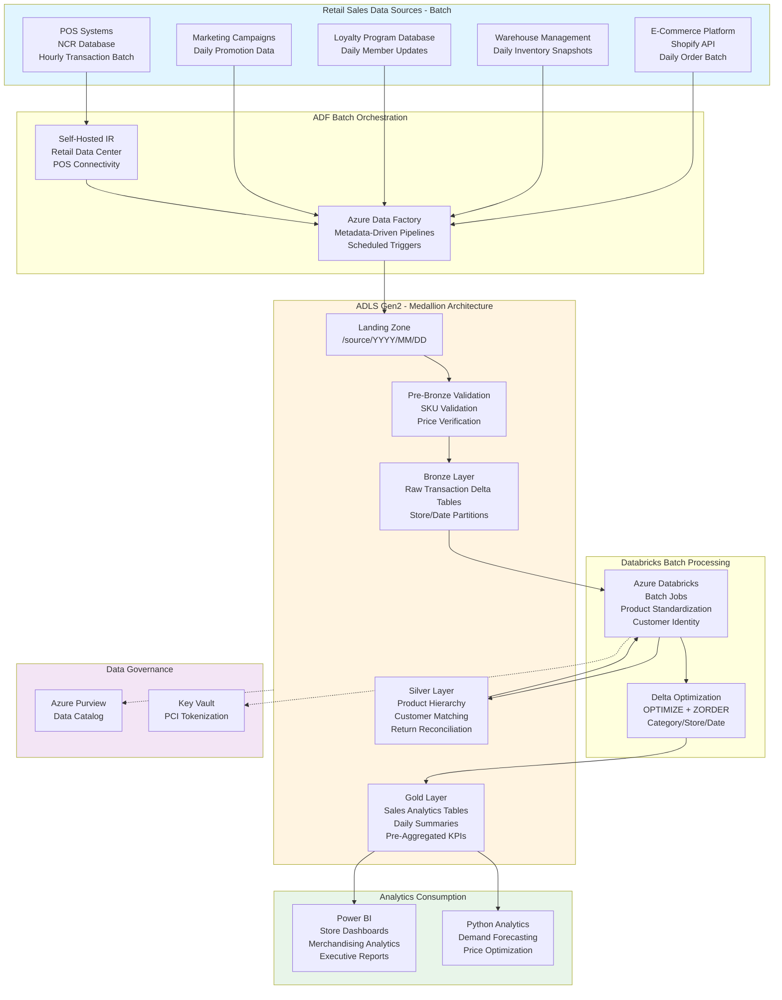

# Retail Sales Analytics Pipeline

## Standardized Azure Data Engineering Workflow

**This project follows the standard Azure Data Engineering architecture pattern:**

**Data Flow:** `POS/E-Commerce → ADF Batch Orchestration → ADLS Medallion (Bronze → Silver → Gold) → Power BI / Python Analytics`

### Workflow Components:

1. **Azure Data Factory (ADF)** - Retail sales batch data ingestion
   - Metadata-driven pipelines for POS, e-commerce, inventory
   - Hourly POS transaction batches, daily order batches
   - Watermark-based incremental loading
   - Self-hosted IR for retail data center POS connectivity

2. **ADLS Gen2 Medallion Architecture** - Retail data lake
   - **Landing**: Store/channel batch file arrival (/source/YYYY/MM/DD)
   - **Pre-Bronze**: SKU validation, price verification, store checks
   - **Bronze**: Raw transaction Delta tables (store/date partitions)
   - **Silver**: Product hierarchy standardization, customer matching
   - **Gold**: Sales analytics, daily summaries, pre-aggregated KPIs

3. **Azure Databricks** - Retail analytics batch processing
   - Product hierarchy standardization
   - Customer identity resolution
   - Promotional attribution logic
   - Delta Lake optimizations (ZORDER by category/store/date)

4. **Power BI + Python** - Retail analytics consumption
   - Store manager dashboards (comp sales, inventory)
   - Merchandising analytics (product performance)
   - Python demand forecasting and price optimization

## Architecture Flow Diagram

## 1. Project Overview & Business Problem

The retail organization faces critical challenges analyzing sales performance across stores, products, regions, and customer segments due to fragmented point-of-sale systems, inventory platforms, and customer data sources. Store managers lack real-time visibility into daily sales trends, top-selling products, and inventory turnover rates hindering merchandising decisions and operational adjustments. Marketing teams cannot measure campaign effectiveness across channels without integrated views of promotional activities, customer purchases, and attribution data. Manual weekly sales reporting aggregates data from multiple systems consuming significant analyst time while delivering insights too late to influence in-season merchandising strategies. This project establishes a modern Azure data pipeline consolidating all sales-related data enabling real-time dashboards, predictive analytics, and automated reporting supporting data-driven retail operations.

The platform transforms retail decision-making by providing unified sales visibility from transaction capture through analytical insight delivery. By integrating point-of-sale systems across stores, e-commerce platforms, inventory management systems, customer loyalty programs, and marketing automation tools, stakeholders gain comprehensive understanding of sales drivers, customer behavior, and operational performance. The solution supports both real-time streaming for same-day sales visibility and batch processing for comprehensive historical analysis. Advanced analytics capabilities enable demand forecasting, price optimization, customer segmentation, and promotional effectiveness measurement. The centralized architecture increases revenue through better merchandising decisions, reduces markdowns through improved inventory management, and enhances customer satisfaction through personalized experiences based on purchase history and preferences.

- **Sales data fragmentation across POS, e-commerce, and inventory systems prevents unified analysis.**
  Store managers and merchandising teams lack consolidated visibility into sales performance.
- **Manual weekly sales reporting delays insights missing opportunities for in-season adjustments.**
  Analysts spend days aggregating data from disparate systems producing stale reports.
- **Marketing cannot measure campaign ROI without integrated sales attribution data.**
  Campaign effectiveness remains unknown preventing optimization of marketing spend.
- **Azure Data Factory, Databricks, and Synapse enable scalable real-time sales analytics.**
  Cloud architecture supports high-volume transaction processing with real-time dashboard capabilities.
- **Merchandising, store operations, marketing, and finance teams benefit from unified insights.**
  Cross-functional collaboration improves through shared sales metrics and consistent reporting.

## 2. Requirement Gathering & Analysis

The requirements phase engages store operations, merchandising, marketing, finance, and IT teams to understand data sources, reporting needs, and analytical use cases. Data source mapping identifies NCR point-of-sale systems across stores, Shopify e-commerce platform, warehouse management system, loyalty program database, and marketing campaign management tools. Each source requires documentation covering transaction schemas, product hierarchies, customer identifiers, and data refresh frequencies. Stakeholder workshops identify critical reports including daily sales flash reports, same-store sales comparisons, product performance rankings, customer purchase behavior analysis, and promotional lift measurements.

Business requirements emphasize near-real-time availability for daily sales monitoring while batch processing suffices for comprehensive historical trend analysis and forecasting. The team documents calculation logic for key metrics including comp store sales growth, inventory turnover, gross margin, average transaction value, units per transaction, and customer retention rates. Data quality requirements address product master data consistency, transaction completeness, price accuracy, and customer identity resolution across channels.

Security requirements encompass access controls by role and region, PCI DSS compliance for payment data, customer privacy protections, and audit trails for financial reconciliation. Integration requirements include real-time APIs for store dashboards, batch feeds for financial systems, and event streams for inventory replenishment triggers based on sales velocity.

- **Map POS systems, e-commerce platform, WMS, loyalty database, and marketing tools.**
  Document transaction schemas, product hierarchies, customer attributes, and connectivity requirements.
- **Identify hourly sales data streaming plus daily batch for inventory and customer analytics.**
  Define SLAs requiring sales dashboard updates within 15 minutes and full reporting by 6am daily.
- **Estimate processing 5TB historical data with 10 million daily retail transactions.**
  Plan for 20% annual growth from store expansion and increasing e-commerce penetration.
- **Define quality rules for product matching, price validation, and transaction completeness.**
  Implement checks ensuring transaction totals reconcile and SKUs match product master.
- **Gather transformation logic for comp sales, margins, inventory turns, and customer metrics.**
  Document calculation formulas for same-store sales growth and promotional lift analysis.
- **Enforce PCI DSS with payment card tokenization and access controls by role and region.**
  Implement audit logging for financial reconciliation and customer privacy compliance.
- **Plan integrations with store dashboards, financial systems, and inventory platforms.**
  Ensure real-time API performance supporting operational decision-making.

## 3. Azure Architecture Setup

The architecture establishes Azure Data Lake Storage Gen2 as the centralized sales data repository with zone-redundant storage ensuring high availability for business-critical retail operations. Lifecycle management policies optimize costs transitioning aged transaction history to cool tier. Azure Data Factory serves as orchestration engine with self-hosted integration runtime deployed in retail data center for secure POS database connectivity and cloud runtime for e-commerce API integration.

Azure Databricks workspace deployment includes dedicated streaming cluster processing real-time transaction streams and batch cluster for historical analysis and machine learning model training. Delta Lake optimization enables efficient querying and ACID transactions for sales data. Azure Synapse Analytics workspace combines serverless SQL pools for ad-hoc queries with dedicated pools for high-performance dashboard queries supporting hundreds of concurrent business users.

Event Hubs namespace ingests real-time transaction streams from stores with partitioning enabling parallel processing. Power BI Premium capacity provides embedded analytics in retail operations portal with scheduled refresh and incremental refresh configurations. Azure Key Vault manages credentials with automated rotation. Networking implements private endpoints with hub-and-spoke virtual network topology providing security and performance.

- **Provision ADLS Gen2 with zone-redundant storage for sales transaction data.**
  Configure lifecycle policies transitioning transactions older than 2 years to cool tier.
- **Deploy Azure Data Factory with self-hosted runtime in retail data center for POS connectivity.**
  Configure cloud runtime for e-commerce, marketing, and external data source integrations.
- **Set up Azure Databricks with dedicated streaming and batch processing clusters.**
  Configure streaming cluster for real-time sales processing and batch for ML workloads.
- **Create Synapse Analytics workspace with dedicated pools for dashboard queries.**
  Size pools supporting concurrent access from store managers, merchants, and analysts.
- **Deploy Event Hubs for real-time transaction stream ingestion from stores.**
  Configure partition count supporting required throughput during peak shopping periods.
- **Deploy Power BI Premium capacity for embedded retail operations analytics.**
  Enable large dataset support and scheduled refresh capabilities.
- **Integrate Azure Key Vault for credential management with automated secret rotation.**
  Store POS credentials, e-commerce API keys, and database passwords with RBAC.
- **Configure Log Analytics workspace aggregating metrics from all data services.**
  Enable diagnostic settings from ADF, Databricks, Event Hubs, and Synapse.
- **Implement private endpoints for ADLS, Synapse, and Event Hubs.**
  Disable public network access routing all traffic through virtual network.
- **Configure hub-and-spoke virtual network with centralized security controls.**
  Implement network security groups isolating retail data processing workloads.
- **Apply encryption at rest and in transit using Microsoft-managed keys.**
  Enable HTTPS-only access and secure transfer required on all storage.
- **Register retail data assets in Azure Purview with data classifications.**
  Document lineage from POS systems through transformations to dashboards.

## 4. ADLS Folder Structure (Medallion Architecture)

The medallion architecture organizes retail sales data supporting both real-time operations and historical analytics. Landing zone receives POS transaction files, e-commerce order data, inventory snapshots, and marketing campaign exports with structure /landing/{source}/{date}/{hour} enabling efficient processing. Pre-bronze layer implements retail-specific validation including SKU verification against product master, price validation against approved pricing, and transaction completeness checks.

Bronze layer preserves immutable transaction data partitioned by source, date, and store enabling efficient querying and audit trail maintenance. Delta Lake format provides ACID guarantees essential for financial reconciliation. Silver layer harmonizes data across channels applying product hierarchy standardization, customer identity resolution, and promotional attribution creating unified sales views.

Gold layer contains retail data warehouse with sales fact tables including transactions, daily store summaries, and customer purchase history. Dimension tables provide product hierarchy, store attributes, customer segments, and calendar with retail-specific attributes like fiscal periods and holiday flags. Pre-aggregated tables accelerate dashboards with daily sales by category, weekly store performance, and monthly customer cohort analysis. Archive layer maintains historical data beyond active analysis periods in cost-effective storage.

- **Landing: Time-based partitioning /landing/{source}/{YYYY}/{MM}/{DD}/{HH} for hourly loads.**
  Structure supports concurrent ingestion from multiple stores and e-commerce platform.
- **Pre-Bronze: Retail-specific validation checking SKUs, prices, and transaction completeness.**
  Validate against product master, approved pricing, and tender type consistency.
- **Bronze: Immutable transaction data partitioned by source, date, and store.**
  Maintain complete audit trail supporting financial reconciliation and operations analysis.
- **Silver: Unified sales data with product standardization and customer resolution.**
  Create consistent product hierarchies and golden customer records across channels.
- **Gold: Retail data warehouse with sales facts, product dimensions, and store attributes.**
  Enable comprehensive merchandising analytics with pre-aggregated performance summaries.
- **Archive: Historical transaction data in compressed format for long-term retention.**
  Maintain 7-year history supporting trend analysis and regulatory compliance.

## 5. Source System Connectivity (ADF)

Source system connectivity integrates diverse retail platforms with appropriate error handling. POS system connectivity leverages ODBC linked service extracting transaction data from store databases through self-hosted integration runtime with incremental loading based on transaction timestamps. E-commerce connectivity uses Shopify REST API with OAuth authentication implementing pagination and rate limit handling.

Inventory system connectivity extracts stock levels, receipts, and transfers using database connections with parallel extraction across warehouses. Loyalty program database connectivity retrieves customer profiles, points balances, and redemption history. Marketing platform API connectivity extracts campaign definitions, customer segments, and email engagement metrics.

Event Hubs connectivity provides real-time transaction streaming from stores with POS middleware publishing transactions immediately after settlement. All connections implement comprehensive logging and monitoring validating data volumes and detecting failures before impacting downstream analytics.

- **Configure linked services for POS databases, e-commerce API, WMS, and marketing platforms.**
  Store credentials in Key Vault with managed identity access from Data Factory.
- **Deploy self-hosted integration runtime in retail data center for POS connectivity.**
  Use cloud runtime for e-commerce, marketing, and external data sources.
- **Validate connectivity testing database connections and API endpoints during setup.**
  Ensure firewall rules permit required protocols with network performance validation.
- **Configure API retry policies with exponential backoff for e-commerce rate limits.**
  Handle transient failures gracefully with circuit breaker patterns.
- **Tune database extraction using store ID partitioning for parallel POS data loads.**
  Extract transactions using date-based partitioning maximizing throughput.
- **Encrypt all connections using TLS 1.2 with certificate validation.**
  Implement least-privilege service accounts for database access.
- **Document connectivity matrix with system contacts, SLAs, and dependencies.**
  Include maintenance windows and business hour constraints.

## 6. Ingestion Framework (ADF – Metadata Driven)

The metadata-driven ingestion framework centralizes configuration for all retail source integrations enabling agile onboarding. Control tables store source details, extraction schedules, incremental load logic, data quality thresholds, and target paths. The framework supports both batch and streaming patterns with streaming for real-time sales and batch for comprehensive data loads.

Lookup activities query control tables filtered by schedule and priority generating dynamic parameters for ForEach iterations. Copy activities implement retail-specific schema mappings handling POS format variations across stores. Watermark-based incremental loading extracts only new transactions since last successful load minimizing data transfer and source system impact.

Event-driven triggers process Event Hub messages for real-time transaction streaming. The framework implements comprehensive error handling with automated retry for transient failures and alerting for persistent issues. Reconciliation activities validate transaction counts and sales totals against source systems detecting discrepancies.

- **Design control tables storing source details, schedules, watermarks, and quality thresholds.**
  Enable dynamic configuration supporting new store onboarding through metadata only.
- **Use Lookup activities querying control tables filtered by schedule and priority.**
  Generate source-specific parameters driving ForEach iterations for each data source.
- **Configure Copy activities with schema mappings handling POS format variations.**
  Implement consistent target schemas despite source system differences.
- **Implement watermark-based incremental extraction by store and transaction timestamp.**
  Store watermarks in control tables updated after successful loads.
- **Build Event Hub triggered pipelines for real-time transaction stream processing.**
  Process streaming data with micro-batch patterns ensuring exactly-once semantics.
- **Create automated retry logic handling network failures and source system unavailability.**
  Configure different retry policies based on source criticality and SLAs.
- **Add reconciliation validating transaction counts and sales totals match sources.**
  Compare extracted data against source system reports detecting discrepancies.
- **Implement comprehensive audit logging capturing extraction metrics and lineage.**
  Store detailed logs supporting operational monitoring and troubleshooting.
- **Design flexible triggers supporting hourly sales loads and daily batch processing.**
  Enable real-time operations dashboards while maintaining comprehensive analytics.
- **Add dependency management ensuring product master loads before transaction processing.**
  Implement synchronization ensuring referential integrity for sales data.

## 7. Pre-Bronze Validations

Pre-bronze validation implements retail-specific quality checks preventing corrupt data from entering analytics. Transaction validation verifies required fields including store ID, transaction ID, transaction date/time, SKU, quantity, price, and tender type. Product validation checks SKUs against product master database ensuring all sold items have valid references.

Price validation compares transaction prices against approved pricing files detecting unauthorized discounts or pricing errors. Store validation ensures store IDs match active locations preventing data from closed or invalid stores. Customer validation for loyalty transactions verifies member IDs exist in loyalty database.

Validation results log with severity classifications determining immediate operations notification versus batch error reporting. Failed validations potentially impacting financial close trigger immediate alerts to retail operations. Comprehensive validation metrics support data quality dashboards tracking issues by store and source system.

- **Validate transaction files verifying required fields and transaction total reconciliation.**
  Check transaction totals match line item sums and tender amounts reconcile.
- **Validate product SKUs against master ensuring all items sold have valid references.**
  Detect invalid SKUs preventing orphaned transactions in analytics.
- **Validate transaction prices against approved pricing detecting unauthorized discounts.**
  Flag prices outside acceptable ranges for pricing audit review.
- **Validate store IDs ensuring transactions reference active locations only.**
  Prevent data from closed stores or invalid locations polluting analytics.
- **Store validation results in audit tables with store attribution for quality monitoring.**
  Enable operational dashboards tracking data quality by store and POS system.
- **Move failed transactions to quarantine with retail operations team alerting.**
  Route validation failures to appropriate store systems or pricing teams.
- **Process validations concurrently across stores using parallelism optimization.**
  Handle peak holiday volumes with scaled validation processing.

## 8. Bronze Layer Processing

Bronze layer establishes immutable audit trail of retail transaction data with appropriate partitioning. POS transactions, e-commerce orders, inventory movements, and customer interactions land in Delta Lake tables partitioned by source, date, and store. Technical metadata includes store identifier, POS terminal, transaction timestamp, and pipeline run ID supporting operations troubleshooting.

Streaming ingestion from Event Hubs uses Databricks Autoloader with exactly-once processing semantics preventing duplicate transaction recording. Checkpointing ensures processing resumes correctly after failures. Minimal transformations include timestamp normalization and JSON parsing while preserving original transaction payloads for audit and financial reconciliation.

Partition strategy uses daily partitions for transaction data and store partitions enabling efficient store-level queries and corporate aggregations. Schema evolution handles POS system upgrades introducing new transaction types or tender methods without pipeline failures.

- **Store immutable transaction data in Delta format partitioned by source, date, and store.**
  Maintain complete transaction history supporting reconciliation and audit requirements.
- **Maintain streaming checkpoint state for Event Hub processing ensuring exactly-once semantics.**
  Prevent duplicate transactions impacting sales totals and financial reporting.
- **Track metadata including store, POS terminal, timestamp, and pipeline identifiers.**
  Support operational troubleshooting and transaction traceability.
- **Apply minimal transformations preserving original transaction payloads.**
  Maintain complete audit trail for financial close and dispute resolution.
- **Partition bronze tables by date and store optimizing query patterns.**
  Enable efficient store-level analysis and corporate-wide aggregations.
- **Enable schema evolution handling POS upgrades introducing new fields.**
  Accommodate new tender types and transaction attributes without failures.

## 9. Silver Layer Transformations (Databricks + PySpark)

Silver layer transformations create unified retail views through comprehensive data cleansing and enrichment. Product hierarchy standardization maps store-level SKUs to corporate product taxonomy enabling consolidated category performance analysis. Customer identity resolution links loyalty member purchases with anonymous transactions using probabilistic matching on transaction patterns and demographics.

Data cleansing addresses common retail data quality issues including return transaction matching with original sales, discount code validation and categorization, and tax calculation verification. Transaction enrichment joins sales with product attributes, store characteristics, marketing campaigns, and weather data creating comprehensive analytical datasets.

Promotional attribution assigns sales to campaigns based on customer segment membership, offer redemptions, and timing correlation. Customer lifetime value calculations aggregate historical purchases with predictive models estimating future value. Slowly changing dimension logic maintains historical product and store attribute changes supporting point-in-time analysis.

- **Clean retail data standardizing product names, customer identifiers, and transaction codes.**
  Apply retail-specific parsing handling SKU formats, tender types, and discount codes.
- **Remove duplicate transactions using business key matching and settlement validation.**
  Detect and eliminate duplicate submissions from POS systems preventing double counting.
- **Perform product hierarchy standardization mapping SKUs to corporate taxonomy.**
  Enable category-level analysis and consistent merchandising performance reporting.
- **Implement customer identity resolution linking loyalty and anonymous transactions.**
  Apply probabilistic matching creating comprehensive customer purchase histories.
- **Apply data quality checks validating transaction integrity and pricing accuracy.**
  Ensure returns match original sales and discount codes validate correctly.
- **Implement SCD Type 2 for product and store master tracking attribute changes.**
  Maintain effective date ranges supporting point-in-time promotional analysis.
- **Use MERGE INTO for efficient incremental processing of daily transactions.**
  Update existing records and insert new transactions maintaining consistency.
- **Use Autoloader for continuous transaction stream processing from stores.**
  Benefit from exactly-once processing and automatic schema evolution.
- **Apply partition pruning using date and store-based partitions optimizing queries.**
  Enable efficient store-level reporting and corporate aggregation workloads.
- **Enforce Delta constraints on transaction IDs and business date validity.**
  Reject duplicate transactions with constraint violations logged.
- **Document transformation logic with business rules clearly annotated.**
  Maintain transparency for merchants understanding sales metrics.
- **Validate output comparing transaction counts and sales totals against bronze.**
  Implement reconciliation ensuring no transaction loss during transformations.

## 10. Gold Layer Aggregations

Gold layer delivers retail analytics optimized for merchandising and operations. Sales fact table captures transactions with product, store, customer, date, and promotion foreign keys enabling flexible analysis. Daily store summary fact provides pre-aggregated sales, transactions, units, and customer counts accelerating flash reports.

Product dimension contains complete product hierarchy with category, department, class, and SKU levels including attributes like brand, size, color, and cost. Store dimension provides location details, square footage, format type, opening date, and regional assignment. Customer dimension includes loyalty tier, demographics, acquisition channel, and lifetime value segments.

Pre-aggregated tables compute weekly category performance, monthly store comps, and customer cohort analytics eliminating expensive on-demand calculations. KPI calculations implement formulas for comp store sales growth, inventory turnover, sell-through rates, average transaction value, and customer retention. Z-ordering optimizes performance for common filter patterns like category, store, and date ranges.

- **Build sales transaction fact with product, store, customer, date, and promotion keys.**
  Include measures for sales amount, units sold, discounts, and transaction counts.
- **Build daily store summary fact pre-aggregating key metrics by store and date.**
  Accelerate flash reporting with pre-calculated daily sales, traffic, and conversion.
- **Build product dimension with complete hierarchy and merchandising attributes.**
  Include category, brand, vendor, cost, and margin enabling comprehensive product analysis.
- **Design star schema optimized for Power BI with clean dimensional relationships.**
  Ensure referential integrity between facts and dimensions with surrogate keys.
- **Create pre-aggregated tables for weekly category sales and monthly store performance.**
  Eliminate expensive aggregations improving dashboard query response times.
- **Compute retail KPIs for comp sales, inventory turns, sell-through, and retention.**
  Apply consistent formulas across reports ensuring metric standardization.
- **Use window functions for rolling averages, year-over-year growth, and ranking.**
  Enable advanced analytical patterns supporting merchandising and operations analysis.
- **Optimize gold tables using Z-ordering on category, store, and date columns.**
  Cluster retail data improving query performance for common dashboard patterns.

## 11. Delta Lake Optimization Techniques

Delta Lake optimization ensures retail analytics maintain high performance during peak seasons. OPTIMIZE commands consolidate small files from streaming ingestion into right-sized files. ZORDER BY clauses organize data by category, store, and date enabling effective data skipping for dashboard queries.

VACUUM operations remove old file versions recovering storage space while maintaining 30-day retention for operational investigations. Auto-optimize features enabled on transaction tables automatically compact streaming files. Bloom filters on transaction ID and customer ID provide fast point lookups for customer service and returns processing.

Table caching stores frequently accessed product and store dimensions in memory accelerating dashboard queries. Partition strategy balances store-level reporting with corporate aggregations using date partitions for facts and no partitions for dimensions.

- **Use OPTIMIZE with ZORDER BY category, store, date for data skipping.**
  Cluster retail data enabling effective skipping for merchandising dashboards.
- **Use VACUUM removing snapshots older than 30-day retention requirement.**
  Recover storage space while maintaining time-travel for operations investigations.
- **Enable auto-compaction on transaction tables from streaming ingestion.**
  Automatically consolidate micro-batch files without manual maintenance.
- **Use caching for product and store dimension tables supporting dashboards.**
  Store master data in cluster memory enabling sub-second query response.
- **Use data skipping via Delta statistics on category, store, and date columns.**
  Avoid scanning irrelevant data improving dashboard refresh performance.
- **Partition fact tables by date and do not partition dimension tables.**
  Optimize for time-series queries while keeping dimensions unfragmented.
- **Use schema evolution managing POS system upgrades adding new fields.**
  Handle new tender types and transaction attributes without pipeline failures.
- **Tune shuffle partitions based on cluster size and transaction volumes.**
  Optimize shuffle operations during aggregations and customer matching.

## 12. Consumption Layer (Synapse + Power BI)

The consumption layer delivers retail insights through performant dashboards and reports. Synapse serverless SQL pools provide external tables referencing gold Delta files enabling T-SQL queries. Views implement pre-computed retail logic including comp sales calculations, inventory metrics, and promotional lift simplifying report development.

Power BI semantic models leverage composite models with DirectQuery for current day sales and imported historical data. Store-level dashboards filter by store assignment using row-level security. Real-time sales dashboards display hourly updates using DirectQuery while historical trend reports use imported models with incremental refresh.

Embedded Power BI in retail operations portal provides role-based dashboards for store managers, merchants, and executives. DAX measures implement retail calculations for conversion rates, basket size, margin percentages, and promotional effectiveness. Scheduled refresh executes overnight with incremental refresh reducing refresh time.

- **Create external tables in Synapse serverless SQL referencing retail gold Delta tables.**
  Enable T-SQL querying supporting diverse analytical tools and report builders.
- **Use views pre-computing comp sales, inventory turns, and promotional lift.**
  Simplify Power BI models encapsulating complex retail calculation logic.
- **Enable DirectQuery for real-time daily sales dashboards reflecting current performance.**
  Use import mode for historical trend analysis with incremental refresh.
- **Build Power BI semantic models with measures calculating retail KPIs.**
  Apply DAX formulas for comp growth, conversion rates, and basket metrics.
- **Implement row-level security filtering by store assignment and region.**
  Restrict store managers to assigned locations while enabling regional visibility.
- **Publish dashboards with scheduled refresh during overnight processing windows.**
  Configure incremental refresh for transaction facts reducing refresh times.
- **Optimize Power BI using aggregations for category and store summaries.**
  Use composite models balancing real-time needs with historical performance.

## 13. Monitoring & Alerting

Comprehensive monitoring ensures retail data pipeline reliability supporting operations. Azure Monitor collects metrics from retail pipelines tracking transaction processing rates, data volumes by store, and pipeline success rates. Log Analytics aggregates logs enabling correlation analysis of store-specific failures.

Event Hub monitoring tracks transaction stream throughput and consumer lag alerting when real-time processing falls behind. Databricks monitoring captures job performance with alerts for transformation failures or execution time anomalies. Data quality monitoring tracks validation failure rates by store identifying systemic issues.

Business metrics monitoring tracks sales volumes, transaction counts, and average values with anomaly detection alerting for unusual patterns. SLA tracking measures data freshness ensuring store dashboards reflect current-day performance. Cost monitoring attributes spending to specific workloads supporting optimization.

- **Monitor ADF pipelines tracking transaction processing rates by store.**
  Create alerts for store-specific pipeline failures impacting operations.
- **Enable Event Hub monitoring tracking transaction throughput and consumer lag.**
  Alert when real-time processing falls behind during peak shopping periods.
- **Enable Databricks monitoring capturing transformation job performance.**
  Track processing times and identify bottleneck operations.
- **Use Log Analytics for correlation analysis of store-specific failures.**
  Build dashboards visualizing pipeline health with store drill-down.
- **Configure alerts for critical pipeline failures with operations team notification.**
  Implement escalation for repeated failures impacting business reporting.
- **Implement SLA tracking measuring data freshness for store dashboards.**
  Monitor transaction latency ensuring real-time visibility requirements met.
- **Capture business metrics tracking sales volumes and transaction patterns.**
  Implement anomaly detection alerting for unusual store performance.
- **Integrate operational alerting for inventory triggers based on sales velocity.**
  Automate replenishment notifications when product sales exceed thresholds.
- **Monitor costs with attribution to retail workloads and optimization opportunities.**
  Track spending trends by pipeline and processing type.
- **Build operational dashboards visualizing end-to-end retail data flow.**
  Provide unified monitoring for retail IT and operations teams.

## 14. Security & Governance

Security controls protect customer and financial data while enabling business access. Azure Key Vault stores credentials with managed identity authentication for pipeline access. PCI DSS compliance requires payment card tokenization with tokens stored securely while raw card data never persists.

Private endpoints ensure data flows through virtual networks. Customer privacy protections include data minimization, consent tracking, and access logging. Azure Purview catalogs retail data assets with automated lineage tracking and data classification supporting governance.

Row-level security restricts data access by store assignment and region. Comprehensive audit logging captures all data access for compliance monitoring. Data retention policies maintain transaction history supporting financial and regulatory requirements.

- **Store credentials in Key Vault with RBAC restricting access to managed identities.**
  Eliminate hardcoded passwords in pipelines and configurations.
- **Use managed identities for ADF, Databricks, and Synapse authentication.**
  Avoid credential management overhead and security risks.
- **Enable private endpoints for all services with network isolation.**
  Disable public access routing traffic through virtual network.
- **Implement virtual networks with network security groups isolating workloads.**
  Segment retail processing into security zones.
- **Apply NSGs permitting only required protocols with logging.**
  Block unauthorized access and monitor connection attempts.
- **Encrypt data in transit using HTTPS and TLS 1.2.**
  Enforce secure transfer required on storage accounts.
- **Encrypt data at rest with tokenization for payment cards.**
  Meet PCI DSS requirements with field-level protection.
- **Implement Azure Purview for data cataloging and lineage.**
  Enable governance with automated data discovery and classification.
- **Enable access auditing logging all operations.**
  Support compliance monitoring and security investigations.
- **Maintain PCI DSS compliance with documented controls.**
  Implement technical safeguards satisfying payment card security requirements.

## 15. CI/CD Pipeline Setup (Azure DevOps or GitHub Actions)

CI/CD pipelines automate retail platform deployments ensuring consistency. Azure DevOps repositories store pipeline definitions, notebooks, scripts, and infrastructure templates with branch protection requiring code reviews. ARM templates define infrastructure with environment-specific parameters.

Release pipelines deploy to development first with automated testing including data quality validation and reconciliation checks. Approval gates require validation before production deployment. Databricks Repos synchronizes notebooks with automated job updates. Database scripts implement idempotent DDL supporting repeated deployments.

- **Use Git integration for ADF storing retail pipeline definitions.**
  Enable version control and code review workflows.
- **Use Databricks Repos syncing transformation notebooks.**
  Support collaborative development with automated deployment.
- **Use ARM templates deploying infrastructure consistently.**
  Parameterize configurations for different environments.
- **Use YAML pipelines automating build, test, and deployment.**
  Standardize CI/CD processes with validation gates.
- **Parameterize deployments using variable groups.**
  Externalize settings avoiding hardcoded values.
- **Use approval gates requiring validation before production.**
  Implement manual checkpoints for critical changes.
- **Implement automated testing validating data quality.**
  Test transformations and reconciliation before deployment.
- **Deploy Synapse scripts with idempotent DDL.**
  Apply versioning supporting repeated deployments.
- **Implement incremental deployment updating only changed artifacts.**
  Minimize disruption to operational pipelines.
- **Document CI/CD workflows with deployment procedures.**
  Provide operational guidance for release management.

## 16. Performance Optimization

Performance optimization ensures retail dashboards deliver responsive experiences. Data Factory DIU tuning allocates appropriate resources for transaction processing. Parallel configurations enable concurrent store extractions maximizing throughput.

Databricks cluster sizing uses appropriate VM types for workload characteristics. Broadcast joins cache dimensions eliminating shuffle operations. Delta Lake OPTIMIZE and ZORDER maintain query performance for dashboards.

Synapse pools use appropriate distribution strategies. Power BI optimization implements aggregation tables and composite models improving refresh times and query performance.

- **Tune ADF DIUs allocating sufficient resources for peak transaction processing.**
  Optimize performance during holiday shopping periods.
- **Use broadcast joins caching product and store dimensions.**
  Eliminate shuffle operations improving transformation performance.
- **Tune Databricks clusters with appropriate VM types for workloads.**
  Enable autoscaling handling variable transaction volumes.
- **Use Delta Lake OPTIMIZE with ZORDER BY category, store, date.**
  Cluster data enabling effective data skipping.
- **Use caching for frequently accessed dimension tables.**
  Support sub-second dashboard query response.
- **Tune Synapse queries with appropriate distribution.**
  Optimize aggregation performance for dashboards.
- **Optimize Power BI using aggregations and composite models.**
  Reduce refresh times and improve query performance.

## 17. Cost Optimization

Cost optimization balances retail analytics requirements with budgets. Databricks autoscaling adjusts cluster sizes based on workload with higher capacity during business hours. Job clusters right-size resources avoiding over-provisioning.

ADLS lifecycle management transitions aged data to cool tier reducing costs. Pipeline scheduling executes non-critical loads during off-peak hours. Synapse serverless SQL provides cost-effective ad-hoc querying. Cost allocation enables chargeback models.

- **Enable autoscaling with business hour-appropriate capacity.**
  Scale based on actual demand avoiding idle resources.
- **Use cool storage tiers for aged transaction history.**
  Reduce storage costs while maintaining accessibility.
- **Optimize runtimes through performance improvements.**
  Complete processing using fewer resources.
- **Schedule non-critical loads during off-peak hours.**
  Execute analytics overnight when costs lower.
- **Use Synapse serverless for ad-hoc queries.**
  Avoid dedicated pool costs for intermittent use.
- **Use appropriate cluster sizing based on workloads.**
  Right-size jobs avoiding resource waste.
- **Implement cost allocation tags.**
  Attribute costs to business units.

## 18. Documentation & KT

Comprehensive documentation ensures successful operations. Architecture diagrams illustrate retail data flows using standard notation. Runbooks provide operational procedures for common tasks and troubleshooting.

Data dictionaries document gold layer tables with business definitions. Operational guides explain monitoring, alerting, and support procedures. Knowledge transfer sessions cover architecture, operations, and analytics with recorded presentations.

- **Prepare architecture diagrams showing retail data flows.**
  Include source systems, transformations, and dashboards.
- **Create operational runbooks for troubleshooting and maintenance.**
  Document common issues and resolution procedures.
- **Create standard operating procedures for routine tasks.**
  Define maintenance schedules and support workflows.
- **Maintain data dictionaries for gold layer tables.**
  Include business definitions and calculation formulas.
- **Conduct knowledge transfer covering operations.**
  Record training sessions for reference.
- **Provide executive summary documenting benefits.**
  Include performance improvements and business value.

