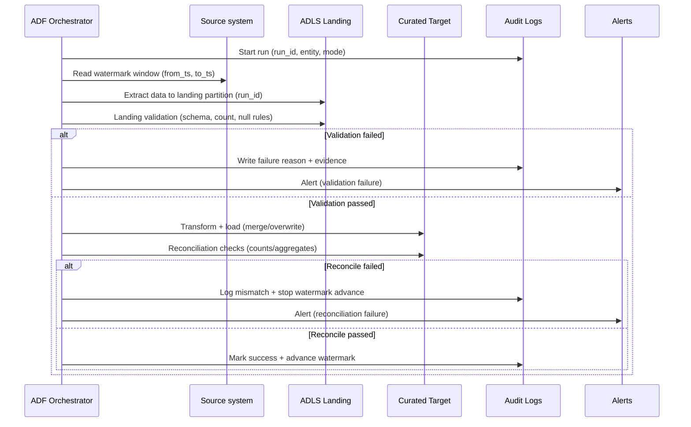
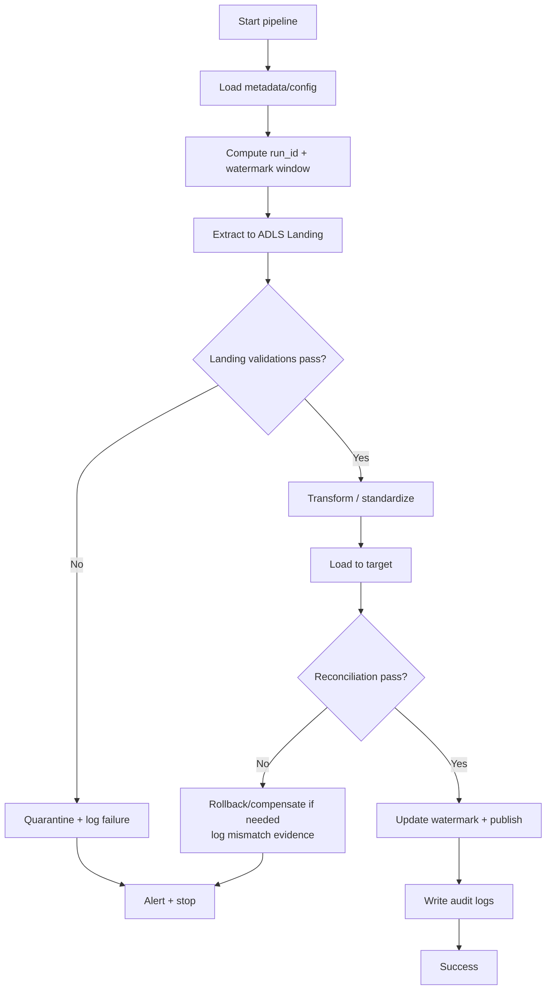
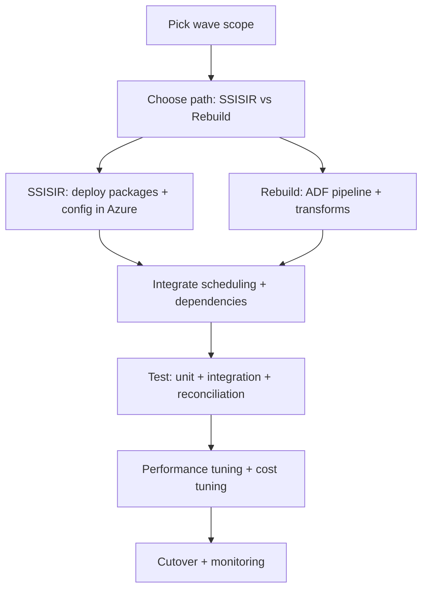

### Project 2 — Legacy ETL pipeline migration from SSIS to Azure Data Factory (Flow)

### Spoken English overview (3 short paragraphs)
This project is basically about taking an old ETL setup that runs on SSIS in an on‑prem environment, and moving it into Azure in a way that’s stable, secure, and easy to operate. The main reason companies do this is they’re tired of fragile jobs, hard-coded configs, and the constant “it works on that server only” problem.

The work starts by listing every SSIS package and understanding what it really does—where it reads data from, where it writes data to, how often it runs, and what breaks. Then we decide the best migration path for each one: some can be moved quickly by running SSIS in Azure (lift-and-shift), but the better long-term move is rebuilding them using ADF pipelines (and Spark/SQL where needed) so the whole platform is more modern and maintainable.

In the end, the goal is not just “run it in the cloud.” It’s to have clean, repeatable pipelines with proper monitoring, restartability, incremental loads, and reconciliation so the business trusts the new outputs. Once the new pipelines run in parallel and match the old results, we cut over and retire the legacy SSIS schedules and servers.

### Goal
Migrate on-premises **SSIS** workloads to Azure with improved observability, security, and maintainability—either by **lift-and-shift** (Azure-SSIS IR) or by **re-platforming** to native **ADF** (and Spark where needed).

### Objectives
- Migrate SSIS workloads with minimal disruption while meeting runtime and data SLA targets.
- Reduce operational risk via standardized orchestration, monitoring, and restartable loads.
- Improve security posture (managed identities, Key Vault, least privilege) and remove hard-coded secrets/paths.
- Enable incremental loading (watermarks/CDC) and reproducible backfills with run-id patterns.
- Decommission legacy schedules/servers once reconciliation and parallel-run sign-off completes.

### Migration decision tree (choose the main path per package)
- **A) Lift-and-shift** (fastest time-to-cloud):
  - Keep SSIS packages, run them on **Azure-SSIS Integration Runtime**
- **B) Re-platform** (best long-term):
  - Replace SSIS with **ADF pipelines** + **Mapping Data Flows** / **Databricks** / SQL
- **C) Hybrid** (common in real migrations):
  - Run some packages on Azure-SSIS IR while rebuilding others natively in waves

### Detailed flow diagrams
```mermaid
flowchart LR
  subgraph SSIS_World[SSIS world (typical patterns)]
    CF[Control Flow\n(Sequence/ForEach/Precedence)]
    DF[Data Flow\n(Sources/Transforms/Destinations)]
    ST[Script Task/Component]
    CFG[Config tables / Environments]
    JOB[SQL Agent schedules]
    LOG[SSIS logging]
  end

  subgraph Azure_World[Azure target (recommended mapping)]
    ADFP[ADF pipelines\n(If/ForEach/Until/Execute Pipeline)]
    COPY[ADF Copy activities]
    ELT[SQL ELT\n(Stored procs / MERGE)]
    MDF[ADF Mapping Data Flows\n(optional)]
    SPK[Databricks/Spark\n(for heavy/complex logic)]
    KV[Key Vault + parameters]
    TRG[ADF triggers / schedules]
    MON[Log Analytics + alerts]
  end

  CF --> ADFP
  DF --> COPY
  DF --> ELT
  DF --> MDF
  ST --> SPK
  CFG --> KV
  JOB --> TRG
  LOG --> MON
```

```mermaid
flowchart TD
  A[Select migration wave] --> B[Inventory + dependency mapping]
  B --> C[Choose strategy per package\nSSISIR vs rebuild]
  C --> D[Build landing zone patterns\nrun-id, watermarks, logging]
  D --> E[Implement packages/pipelines for the wave]
  E --> F[Reconciliation tests\n(counts, aggregates, checksums)]
  F --> G[Parallel run window]
  G --> H{Meets SLA + matches data?}
  H -- No --> E
  H -- Yes --> I[Cutover schedules to Azure]
  I --> J[Decommission legacy jobs/servers]
```

```mermaid
flowchart TD
  subgraph Orchestration[Dataset dependency orchestration]
    U1[Upstream dataset A] --> R1[(Ready flag A)]
    U2[Upstream dataset B] --> R2[(Ready flag B)]
    R1 --> CHK{All required\nready flags present?}
    R2 --> CHK
    CHK -- No --> WAIT[Wait / recheck\n(with timeout)]
    WAIT --> CHK
    CHK -- Yes --> RUN[Run downstream pipeline]
    RUN --> R3[(Ready flag downstream)]
  end
```



```mermaid
flowchart TD
  subgraph Failure_Handling[Failure handling and rerun safety]
    S[Start run_id] --> X[Extract to landing/run_id]
    X --> V{Validate landing}
    V -- Fail --> Q[Quarantine\n(bad rows/files)]
    Q --> A1[Alert + ticket]
    A1 --> RERUN[Rerun same window\n(new run_id)]
    V -- Pass --> T[Transform]
    T --> L[Load to curated]
    L --> RC{Reconcile}
    RC -- Fail --> HOLD[Hold publish\nno watermark advance]
    HOLD --> A2[Alert + investigation]
    A2 --> FIX[Fix logic/config]
    FIX --> RERUN
    RC -- Pass --> PUB[Publish + advance watermark]
  end
```

```mermaid
flowchart LR
  subgraph CICD[CI/CD promotion for ADF]
    DEV[Develop in Git branch] --> PR[Pull request + review]
    PR --> BUILD[Build/Validate\n(ARM/Bicep/Terraform)]
    BUILD --> DEP1[Deploy Dev]
    DEP1 --> SMK1[Smoke tests\n(connectivity + 1-2 critical runs)]
    SMK1 --> DEP2[Deploy Test]
    DEP2 --> IT[Integration tests\n(reconciliation samples)]
    IT --> APP{Approval gate}
    APP -- Approved --> DEP3[Deploy Prod]
    DEP3 --> EN[Enable triggers\n(change window)]
    APP -- Rejected --> DEV
  end
```

```mermaid
flowchart TD
  subgraph Monitoring[Monitoring and incident response loop]
    RUNS[Pipeline runs] --> MET[Metrics\n(duration, rows, freshness)]
    RUNS --> ERR[Errors\n(activity failures)]
    MET --> TH{Threshold breach?}
    ERR --> TH
    TH -- No --> OK[No action]
    TH -- Yes --> AL[Alert\nTeams/Email]
    AL --> TRIAGE[Triage\n(root cause)]
    TRIAGE --> FIX2[Fix\n(config/code/data)]
    FIX2 --> RE[Replay/backfill\n(windowed)]
    RE --> POST[Post-incident review\n(update runbook)]
    POST --> MET
  end
```

### Target architecture (high-level)
```mermaid
flowchart LR
  subgraph OnPrem
    SRC[(On-prem DBs / Files / Apps)]
    SSIS[SSIS Catalog / Packages]
  end

  subgraph Connectivity
    SHIR[Self-hosted Integration Runtime]
    VPN[VPN/ExpressRoute]
  end

  subgraph Azure
    KV[Key Vault]
    ADF[Azure Data Factory]
    SSISIR[Azure-SSIS IR (optional)]
    ADLS[(ADLS Gen2: Landing/Raw)]
    DBX[Databricks / Spark (optional)]
    SQL[(Azure SQL / Synapse / DW)]
    MON[Azure Monitor + Log Analytics]
  end

  SRC --> SHIR
  VPN --- SHIR
  ADF --> KV
  SHIR --> ADF
  ADF -->|Copy to Landing| ADLS
  SSIS -->|Lift & shift| SSISIR
  SSISIR --> ADLS
  ADLS --> DBX --> SQL
  ADF --> SQL
  ADF --> MON
  SSISIR --> MON
```

### Detailed workflows (execution-level)

### Workflow 0 — Run a migration wave (what the team actually does)
- **Inputs**: SSIS package list in scope, source/target details, SLAs, known issues, dependencies, owners.
- **Steps**:
  - Freeze scope for the wave (no “just one more package” changes mid-wave).
  - Map dependencies (upstream sources + downstream consumers) and define a cutover sequence.
  - Choose approach per package: **SSISIR** (temporary) vs **rebuild** (target state).
  - Build pipelines + logging + monitoring using a standard template.
  - Validate with reconciliation tests and performance baselines.
  - Run in **parallel** for an agreed window.
  - Cut over schedules and decommission legacy jobs for that wave.
- **Outputs**: migrated pipelines/packages, reconciliation evidence, runbooks, monitoring alerts, cutover sign-off.

### Workflow 1 — Standard ADF pipeline template (recommended)
Use this pattern for every dataset/table so operations are consistent.

- **Pipeline inputs (parameters)**:
  - `p_source_system`, `p_entity_name`, `p_load_mode` (full/incremental/backfill)
  - `p_watermark_column`, `p_watermark_value` (or CDC position)
  - `p_run_id`, `p_effective_date`, `p_target_zone` (landing/raw/curated)

- **Pipeline stages (activities)**:
  - **Init**: generate `run_id`, load config from metadata table, set paths.
  - **Acquire watermark / window**: compute `from_ts` / `to_ts` for incremental.
  - **Extract**: Copy activity (or SSISIR call) to ADLS Landing (partitioned by date/run id).
  - **Validate landing**: file count, row count, schema drift check, basic null checks.
  - **Transform**:
    - Prefer set-based **SQL ELT** for relational transforms
    - Use Data Flows for moderate transformations
    - Use Databricks for heavy logic / complex joins / large volumes
  - **Load**:
    - Dimensions: upsert/merge or truncate-load (based on size/needs)
    - Facts: incremental append + merge (by business key) or partition overwrite
  - **Reconcile**: compare counts/aggregates vs baseline (SSIS) or source control totals.
  - **Publish**: mark dataset “ready” for downstream dependencies.
  - **Update watermark**: only after successful load + reconcile.
  - **Log + alert**: write run summary (rows in/out, duration, status, error codes).



### Workflow 2 — Metadata-driven ingestion (scale migration fast)
Instead of building 200 near-duplicate pipelines, build **one template pipeline** + metadata.

- **Metadata table (typical columns)**:
  - `source_system`, `entity_name`, `source_type` (SQL/SFTP/API), `enabled`
  - `extract_query` or `source_path_pattern`
  - `watermark_column`, `watermark_type`, `initial_watermark`
  - `target_zone_path`, `file_format`, `partition_strategy`
  - `load_strategy` (append/merge/overwrite), `primary_keys`
  - `dq_ruleset_id`, `sla_minutes`, `owner_group`

- **How it runs**
  - Parent pipeline reads all enabled entities for a source system.
  - `ForEach` over entities (with concurrency controls).
  - Calls the standard pipeline template with parameters from metadata.

```mermaid
flowchart LR
  M[(Metadata table)] --> P[Parent pipeline\nGet enabled entities]
  P --> FE[ForEach entity\n(concurrency = N)]
  FE --> C1[Child: Extract + validate]
  C1 --> C2[Child: Transform + load]
  C2 --> C3[Child: Reconcile + publish]
  C3 --> L[(Audit/Run logs)]
  C1 -->|fail| L
  C2 -->|fail| L
  C3 -->|fail| L
```

### Workflow 3 — Incremental loads, backfills, and reruns (how to stay sane)
- **Incremental rule**: watermark only moves forward on a “green” run (load + reconcile passed).
- **Idempotency patterns**:
  - Landing: write to `.../run_id=.../` so reruns don’t overwrite previous attempts.
  - Curated tables:
    - Partition overwrite for date-partitioned facts (safe reprocessing of a window)
    - MERGE for upserts where late-arriving updates are expected
- **Backfill workflow**:
  - Run in backfill mode with `from_ts/to_ts` (or date range) and lower concurrency.
  - Validate with aggregate checks per day/week to catch gaps.
  - Publish only after the entire range completes (or publish per partition with clear flags).

### Workflow 4 — Lift-and-shift with Azure-SSIS IR (controlled)
- Provision SSISIR sized to concurrency and package runtime; document max parallelism.
- Deploy packages to SSISDB (or file-based deployment if required).
- Externalize configs:
  - Replace hard-coded paths with ADLS/Blob paths
  - Replace secrets with Key Vault-backed values (where possible)
- Orchestrate via ADF:
  - ADF pipeline triggers package execution (and captures status + logs).
- Stabilize:
  - Capture baseline runtime, failure modes, and resource usage before moving to rebuild.

### Workflow 5 — Re-platform (native ADF) per package
- Translate logic into a repeatable structure:
  - Ingest (Copy) → Validate → Transform (SQL/Data Flow/Spark) → Load → Reconcile → Publish
- Replace row-by-row patterns:
  - Convert to set-based SQL or Spark transforms
  - Use staging tables and MERGE instead of RBAR logic
- Replace “package coupling” with dataset readiness:
  - Use dependency checks (e.g., “gold table ready” flags) instead of fragile package chaining.

### Workflow 6 — CI/CD and environment promotion (Dev → Test → Prod)
- **Source control**:
  - Keep ADF in Git (collaboration branch strategy).
  - Parameterize all environment-specific values (endpoints, paths, IR names).
- **Release**:
  - Deploy ADF ARM/Bicep/Terraform + publish artifacts.
  - Apply environment parameter files.
  - Run smoke tests (connectivity + 1–2 critical pipelines) before enabling triggers.
- **Controls**:
  - Approvals for production promotion
  - Change windows for cutover waves

### Workflow 7 — Cutover (parallel run → switch → decommission)
- **Parallel run**:
  - Run SSIS and Azure pipelines side by side for a fixed window.
  - Compare outputs and record evidence (counts/aggregates/checksums).
- **Switch**:
  - Disable SSIS schedules.
  - Enable ADF triggers/schedules.
  - Monitor closely for the first few production cycles (hypercare period).
- **Decommission**:
  - Archive SSIS artifacts, update runbooks, remove credentials, shut down servers safely.

### End-to-end migration flow (phased)

### Phase 0 — Assessment & inventory
- Export SSIS inventory:
  - Package list, connections, environments, schedules, dependencies
  - Data sources/targets, volumes, runtime windows, failure history
- Classify packages by complexity and pattern:
  - **Copy/ELT** (good for ADF Copy + SQL)
  - **Row-by-row / Script tasks** (often needs Databricks / Functions)
  - **Complex transformations** (ADF Data Flows vs Spark)
  - **3rd-party components** (may force lift-and-shift or redesign)
- Define success criteria:
  - Runtime SLAs, cost targets, data reconciliation thresholds, cutover date

### Phase 1 — Azure foundation (landing zone)
- Networking (Private Link where possible), name resolution, firewall rules
- Set up:
  - **ADF** (with Git integration)
  - **ADLS Gen2** (landing/raw/curated zones)
  - **Key Vault** for secrets and linked service credentials
  - **Log Analytics** + alerting (pipeline failures, duration anomalies)
- Decide orchestration standard:
  - Parameter naming conventions, pipeline templates, retry policies, run-id strategy

### Phase 2 — Build the ingestion backbone
- For each source system:
  - Create ADF linked services + datasets
  - Implement **watermarking** (LastModifiedDate / CDC / sequence-based)
  - Land data to ADLS (partition by date/run-id)
- Add guardrails:
  - Schema drift detection, row count checks, checksum where feasible
  - Quarantine path for bad files/rows

### Phase 3 — Migration waves (package-by-package)


#### Option A — Lift-and-shift with Azure-SSIS IR
- Provision **Azure-SSIS IR** (sizing based on concurrency/runtime)
- Deploy SSIS projects/packages (SSISDB) and map configurations:
  - Convert connection strings to Key Vault-backed references where possible
  - Replace on-prem paths with Blob/ADLS paths
- Orchestrate executions:
  - ADF pipeline activities calling SSIS packages (or SQL Agent where used)
- Pros/cons:
  - **Pros**: faster, minimal rewrite
  - **Cons**: carries SSIS complexity/technical debt, higher ops cost, slower modernization

#### Option B — Re-platform to native ADF (recommended long-term)
- Rebuild package logic into:
  - **ADF Copy** (ingest)
  - **SQL-based ELT** (stored procedures, views)
  - **ADF Mapping Data Flows** (moderate transformations)
  - **Databricks/Spark** (heavy transforms, big data, complex logic)
- Standard pipeline pattern:
  - `Ingest -> Validate -> Transform -> Load -> Reconcile -> Publish`
- Implement reusable components:
  - Parameterized pipelines, metadata-driven ingestion, common logging tables

### Phase 4 — Testing & reconciliation
- **Data validation** (old vs new):
  - Row counts, null counts, duplicates
  - Aggregates by business keys (e.g., totals by date/product)
  - Checksums/hashes for critical tables
- **Operational validation**:
  - Runtime within SLA, failure handling, restartability, backfill approach

### Phase 5 — Cutover & decommission
- Run **parallel** for a defined window (e.g., 2–4 weeks)
- Switch schedules to ADF (or SSISIR) as system of record
- Decommission:
  - Disable SSIS jobs, archive packages, update runbooks, update ownership

### Operations model (day-2)
- Monitoring:
  - ADF pipeline run status + duration thresholds
  - SSISIR node health (if used)
  - Data freshness SLAs per dataset
- Incident handling:
  - Runbook for re-run, backfill, and partial replay
  - Clear ownership per domain/source
- Cost controls:
  - IR auto-pause where possible, concurrency caps, incremental loads

### Notes (design choices + migration tips)
- **Package triage is everything**: prioritize high-value/high-risk packages first (critical downstream dependencies, longest runtimes, most failures).
- **SSIS → ADF mapping**:
  - Control Flow → ADF pipeline control activities (If/ForEach/Until)
  - Data Flow tasks → ADF Copy + (SQL ELT or Mapping Data Flows) + Databricks where needed
  - Script Task/Component → Functions/Databricks or redesign to set-based SQL
- **Connectivity**: use **Self-hosted IR** for on-prem sources; validate firewall/DNS early to avoid late surprises.
- **Configuration & secrets**: replace SSIS environment variables/config tables with parameter files + Key Vault references.
- **Logging**: standardize run id, source watermark, rows read/written, and error reason codes across all pipelines.
- **Idempotency**: design loads so reruns are safe (truncate+load for small dims, MERGE/upsert for facts, partition overwrite for lake).
- **Testing**: build reconciliation queries up-front; keep evidence for sign-off (counts, aggregates, checksums for critical tables).
- **Cutover**: run parallel for a fixed window; freeze SSIS changes during parallel period to avoid chasing moving targets.

### Deliverables
- SSIS inventory + wave plan + migration decision log
- Target architecture diagram + landing zone design
- ADF pipeline set (metadata-driven templates + per-domain pipelines)
- Reconciliation test suite + sign-off evidence
- Cutover plan + operational runbooks
