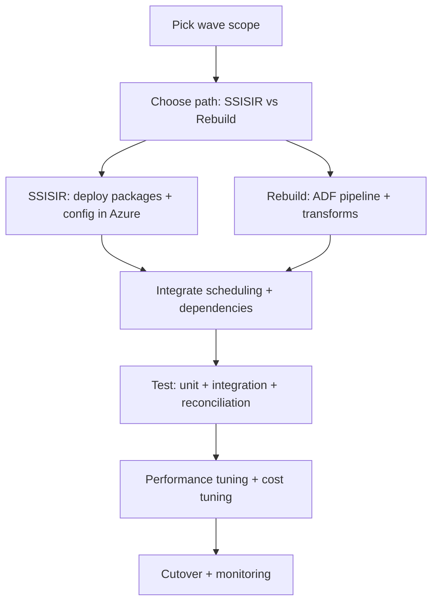

### Project 2 — Legacy ETL pipeline migration from SSIS to Azure Data Factory (Flow)

### Goal
Migrate on-premises **SSIS** workloads to Azure with improved observability, security, and maintainability—either by **lift-and-shift** (Azure-SSIS IR) or by **re-platforming** to native **ADF** (and Spark where needed).

### Objectives
- Migrate SSIS workloads with minimal disruption while meeting runtime and data SLA targets.
- Reduce operational risk via standardized orchestration, monitoring, and restartable loads.
- Improve security posture (managed identities, Key Vault, least privilege) and remove hard-coded secrets/paths.
- Enable incremental loading (watermarks/CDC) and reproducible backfills with run-id patterns.
- Decommission legacy schedules/servers once reconciliation and parallel-run sign-off completes.

### Migration decision tree (choose the main path per package)
- **A) Lift-and-shift** (fastest time-to-cloud):
  - Keep SSIS packages, run them on **Azure-SSIS Integration Runtime**
- **B) Re-platform** (best long-term):
  - Replace SSIS with **ADF pipelines** + **Mapping Data Flows** / **Databricks** / SQL
- **C) Hybrid** (common in real migrations):
  - Run some packages on Azure-SSIS IR while rebuilding others natively in waves

### Target architecture (high-level)
```mermaid
flowchart LR
  subgraph OnPrem
    SRC[(On-prem DBs / Files / Apps)]
    SSIS[SSIS Catalog / Packages]
  end

  subgraph Connectivity
    SHIR[Self-hosted Integration Runtime]
    VPN[VPN/ExpressRoute]
  end

  subgraph Azure
    KV[Key Vault]
    ADF[Azure Data Factory]
    SSISIR[Azure-SSIS IR (optional)]
    ADLS[(ADLS Gen2: Landing/Raw)]
    DBX[Databricks / Spark (optional)]
    SQL[(Azure SQL / Synapse / DW)]
    MON[Azure Monitor + Log Analytics]
  end

  SRC --> SHIR
  VPN --- SHIR
  ADF --> KV
  SHIR --> ADF
  ADF -->|Copy to Landing| ADLS
  SSIS -->|Lift & shift| SSISIR
  SSISIR --> ADLS
  ADLS --> DBX --> SQL
  ADF --> SQL
  ADF --> MON
  SSISIR --> MON
```

### End-to-end migration flow (phased)

### Phase 0 — Assessment & inventory
- Export SSIS inventory:
  - Package list, connections, environments, schedules, dependencies
  - Data sources/targets, volumes, runtime windows, failure history
- Classify packages by complexity and pattern:
  - **Copy/ELT** (good for ADF Copy + SQL)
  - **Row-by-row / Script tasks** (often needs Databricks / Functions)
  - **Complex transformations** (ADF Data Flows vs Spark)
  - **3rd-party components** (may force lift-and-shift or redesign)
- Define success criteria:
  - Runtime SLAs, cost targets, data reconciliation thresholds, cutover date

### Phase 1 — Azure foundation (landing zone)
- Networking (Private Link where possible), name resolution, firewall rules
- Set up:
  - **ADF** (with Git integration)
  - **ADLS Gen2** (landing/raw/curated zones)
  - **Key Vault** for secrets and linked service credentials
  - **Log Analytics** + alerting (pipeline failures, duration anomalies)
- Decide orchestration standard:
  - Parameter naming conventions, pipeline templates, retry policies, run-id strategy

### Phase 2 — Build the ingestion backbone
- For each source system:
  - Create ADF linked services + datasets
  - Implement **watermarking** (LastModifiedDate / CDC / sequence-based)
  - Land data to ADLS (partition by date/run-id)
- Add guardrails:
  - Schema drift detection, row count checks, checksum where feasible
  - Quarantine path for bad files/rows

### Phase 3 — Migration waves (package-by-package)


#### Option A — Lift-and-shift with Azure-SSIS IR
- Provision **Azure-SSIS IR** (sizing based on concurrency/runtime)
- Deploy SSIS projects/packages (SSISDB) and map configurations:
  - Convert connection strings to Key Vault-backed references where possible
  - Replace on-prem paths with Blob/ADLS paths
- Orchestrate executions:
  - ADF pipeline activities calling SSIS packages (or SQL Agent where used)
- Pros/cons:
  - **Pros**: faster, minimal rewrite
  - **Cons**: carries SSIS complexity/technical debt, higher ops cost, slower modernization

#### Option B — Re-platform to native ADF (recommended long-term)
- Rebuild package logic into:
  - **ADF Copy** (ingest)
  - **SQL-based ELT** (stored procedures, views)
  - **ADF Mapping Data Flows** (moderate transformations)
  - **Databricks/Spark** (heavy transforms, big data, complex logic)
- Standard pipeline pattern:
  - `Ingest -> Validate -> Transform -> Load -> Reconcile -> Publish`
- Implement reusable components:
  - Parameterized pipelines, metadata-driven ingestion, common logging tables

### Phase 4 — Testing & reconciliation
- **Data validation** (old vs new):
  - Row counts, null counts, duplicates
  - Aggregates by business keys (e.g., totals by date/product)
  - Checksums/hashes for critical tables
- **Operational validation**:
  - Runtime within SLA, failure handling, restartability, backfill approach

### Phase 5 — Cutover & decommission
- Run **parallel** for a defined window (e.g., 2–4 weeks)
- Switch schedules to ADF (or SSISIR) as system of record
- Decommission:
  - Disable SSIS jobs, archive packages, update runbooks, update ownership

### Operations model (day-2)
- Monitoring:
  - ADF pipeline run status + duration thresholds
  - SSISIR node health (if used)
  - Data freshness SLAs per dataset
- Incident handling:
  - Runbook for re-run, backfill, and partial replay
  - Clear ownership per domain/source
- Cost controls:
  - IR auto-pause where possible, concurrency caps, incremental loads

### Notes (design choices + migration tips)
- **Package triage is everything**: prioritize high-value/high-risk packages first (critical downstream dependencies, longest runtimes, most failures).
- **SSIS → ADF mapping**:
  - Control Flow → ADF pipeline control activities (If/ForEach/Until)
  - Data Flow tasks → ADF Copy + (SQL ELT or Mapping Data Flows) + Databricks where needed
  - Script Task/Component → Functions/Databricks or redesign to set-based SQL
- **Connectivity**: use **Self-hosted IR** for on-prem sources; validate firewall/DNS early to avoid late surprises.
- **Configuration & secrets**: replace SSIS environment variables/config tables with parameter files + Key Vault references.
- **Logging**: standardize run id, source watermark, rows read/written, and error reason codes across all pipelines.
- **Idempotency**: design loads so reruns are safe (truncate+load for small dims, MERGE/upsert for facts, partition overwrite for lake).
- **Testing**: build reconciliation queries up-front; keep evidence for sign-off (counts, aggregates, checksums for critical tables).
- **Cutover**: run parallel for a fixed window; freeze SSIS changes during parallel period to avoid chasing moving targets.

### Deliverables
- SSIS inventory + wave plan + migration decision log
- Target architecture diagram + landing zone design
- ADF pipeline set (metadata-driven templates + per-domain pipelines)
- Reconciliation test suite + sign-off evidence
- Cutover plan + operational runbooks
