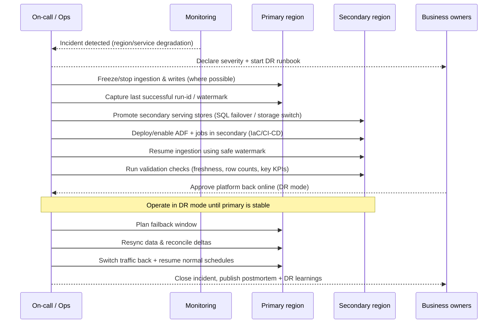

### Project 3 — Azure data platform disaster recovery (DR) and business continuity (BC) setup (Flow)

### Goal
Design and implement DR/BC so the data platform meets agreed **RTO/RPO**, supports controlled **failover/failback**, and can be operated reliably under incident conditions with validated runbooks and regular DR drills.

### Objectives
- Define and achieve **RTO/RPO targets** for critical data products and platform components.
- Implement repeatable, automated **failover/failback** procedures with validated runbooks.
- Ensure data protection (versioning/soft delete/backups) and controlled recovery for lake + serving stores.
- Make platform redeployable in secondary region using **IaC + CI/CD** (stateless components).
- Prove readiness via scheduled DR drills and measurable outcomes (time to recover, data validation success).

### Scope (typical Azure data platform)
- **Storage**: ADLS Gen2 / Blob (lakehouse)
- **Ingestion**: Azure Data Factory (ADF)
- **Compute**: Databricks / Synapse Spark (optional)
- **Serving**: Azure SQL / Synapse SQL / Fabric DW (choose what fits)
- **Governance & security**: Key Vault, Entra ID, Purview, networking (VNet/Private Endpoints)
- **Observability**: Log Analytics, Azure Monitor alerts, dashboards

### DR strategy — pick the platform tier
- **Backup/Restore (cheapest)**: restore from backups; higher RTO
- **Pilot Light**: minimal secondary footprint; scale up on failover
- **Warm Standby**: pre-provisioned, partially scaled; balanced RTO/cost
- **Active/Active**: dual-region serving; lowest RTO but higher complexity/cost

### Target DR architecture (high-level)
```mermaid
flowchart LR
  subgraph RegionA[Primary region]
    A_ADLS[(ADLS Gen2)]
    A_ADF[ADF (Git-backed)]
    A_DBX[Databricks/Synapse (optional)]
    A_SQL[(SQL/DW)]
    A_KV[Key Vault]
    A_MON[Log Analytics/Monitor]
  end

  subgraph RegionB[Secondary region]
    B_ADLS[(ADLS Gen2)]
    B_ADF[ADF (deployable)]
    B_DBX[Databricks/Synapse (optional)]
    B_SQL[(SQL/DW)]
    B_KV[Key Vault]
    B_MON[Log Analytics/Monitor]
  end

  A_ADLS <-->|replication / copy| B_ADLS
  A_SQL <-->|geo-replication| B_SQL
  A_KV -. backups/restore .-> B_KV
  A_ADF -. IaC redeploy .-> B_ADF
  A_DBX -. IaC redeploy .-> B_DBX
  A_MON --> B_MON
```

### Service-by-service DR patterns (practical)

### ADLS Gen2 / Blob (data lake)
- **Data protection**:
  - Enable **versioning** + **soft delete** (container/blob)
  - Use **immutable storage** where regulatory requirements exist
- **Regional resilience**:
  - Use **RA-GRS/GRS** where applicable (understand availability of features for HNS accounts)
  - For strict RPO, implement **near-real-time copy** (event-based replication) to secondary storage
- **Operational**:
  - Standardize paths (bronze/silver/gold) to support replay and validation

### Azure SQL / Synapse dedicated SQL / DW
- Use **failover groups** / **active geo-replication** (service-dependent)
- Define **RPO** based on replication mode and workload
- Backups:
  - Ensure **PITR** and long-term retention policies meet compliance

### Azure Data Factory (ADF)
- Treat ADF as **stateless**:
  - Store pipelines in **Git** (Azure DevOps/GitHub)
  - Deploy secondary ADF via **IaC** (Bicep/Terraform) + CI/CD
- DR considerations:
  - Externalize configuration (Key Vault, parameter files)
  - Use **region-agnostic** datasets/linked services where possible (or per-region config)

### Databricks / Spark compute
- Recreate compute via IaC:
  - Workspaces, cluster policies, jobs, secret scopes (backed by Key Vault)
- Data replication is the hard part:
  - Replicate **Delta tables** / curated datasets to secondary storage
  - Consider append-only + checkpointing patterns for recoverability

### Key Vault
- Enable **soft delete** + **purge protection**
- Back up secrets/certs/keys (automated export strategy if policy allows) and document restore steps
- Prefer **managed identities** to reduce secret sprawl

### Networking & DNS
- DR-ready network:
  - Secondary VNet/subnets/private endpoints (warm standby or pilot light)
  - Ensure DNS can switch endpoints (Azure DNS / Traffic Manager / Front Door, depending on use)
- Document firewall rules and dependency allowlists

### End-to-end DR flow (failover and failback)


### DR runbook checklist (operator-focused)
- **Pre-incident readiness**
  - Defined **RTO/RPO** per component and end-to-end data products
  - IaC exists and is tested for secondary deployment (ADF, networking, compute)
  - Replication jobs exist with monitoring (lake replication, DB geo-replication health)
  - Documented dependency map (sources, credentials, DNS, private endpoints)

- **Failover execution**
  - Stop ingestion/writes in primary (avoid split-brain)
  - Record last run id / watermark + reconcile backlog
  - Promote/failover serving layer (DB failover group, connection strings)
  - Enable secondary orchestration (ADF triggers, schedules)
  - Validate: freshness, row counts, business aggregates, key dashboards

- **Operate in DR mode**
  - Tighten change control (no non-critical releases)
  - Track data delays and communicate business impact

- **Failback**
  - Choose a controlled window
  - Resync primary, reconcile deltas, validate parity
  - Switch endpoints back, re-enable normal triggers

### DR testing cadence (recommended)
- **Quarterly**: tabletop exercise + runbook review
- **Semi-annually**: partial failover test (one domain/product)
- **Annually**: full DR drill (end-to-end) with documented results and action items

### Notes (design choices + common pitfalls)
- **Start from data products, not services**: define RTO/RPO per critical dataset/dashboard/API, then map to supporting services.
- **Avoid split-brain**: during failover, freeze writes in primary (or ensure strict single-writer controls) before promoting secondary.
- **Replication ≠ recoverability**: test restores and replays; ensure you can rebuild gold tables and re-run pipelines from known checkpoints.
- **Stateful vs stateless**:
  - Stateless: ADF definitions, compute clusters/jobs, dashboards (deploy via IaC/CI-CD)
  - Stateful: lake data, SQL/DW data, metadata catalogs (needs replication/backups)
- **Secrets and identities**: design so secondary has required access (managed identities, Key Vault policies) before an incident.
- **DNS/endpoint switching**: document exactly how connection strings and private endpoints switch (and who approves the change).
- **Validation gates**: define “platform healthy” checks (freshness, row counts, key KPIs) as a formal step before declaring DR success.
- **DR drills**: record timings and gaps; turn findings into backlog items with owners and target dates.

### Deliverables
- DR/BC architecture + service-by-service DR decisions
- RTO/RPO matrix per system and per critical data product
- IaC repo (networking + core services) + CI/CD pipelines
- DR runbooks (failover/failback) + validation queries/checklists
- DR drill evidence + improvement backlog
