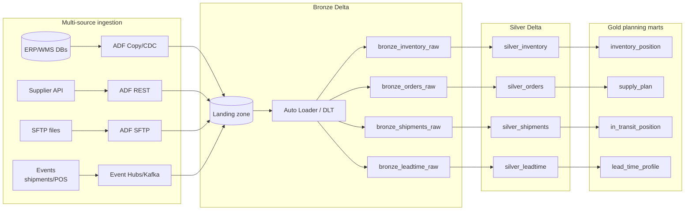
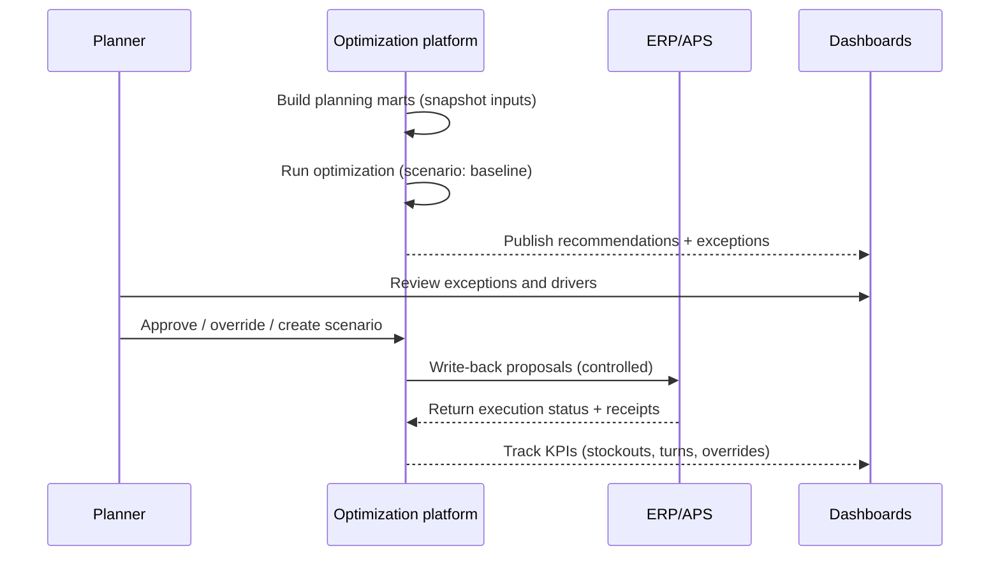

### Project 5 — Inventory Optimization for Global Supply Chain (Flow)

### Spoken English overview (3 short paragraphs)
This project is about having the right stock, in the right place, at the right time—without tying up too much money in inventory. In a global supply chain, demand changes, lead times vary, shipments get delayed, and planners end up firefighting. So the goal is to turn all those signals into clear replenishment decisions that are consistent and measurable.

The platform brings together inventory positions, open orders, forecasts/actual demand, supplier lead times, and cost/service targets. Then it builds planning-ready tables and runs an optimization step that recommends what to buy or move, how much safety stock to hold, and which items are at risk of stockouts or expiry. The most important part is that recommendations are explainable—planners should see why the system suggested something.

Finally, we publish the outputs to dashboards and write-back interfaces, and we measure whether the recommendations actually improved outcomes. If override rates are high or stockouts don’t improve, we adjust parameters, segmentation, or constraints. Over time, this becomes a continuous improvement loop rather than a one-time “optimization project.”

### Goal
Optimize global inventory (multi-echelon) by combining demand signals, lead times, constraints, and cost/service targets to produce **replenishment recommendations**, **safety stock**, and **exception management** with traceable KPIs.

### Objectives
- Improve target service levels (fill rate/OTIF) while reducing working capital and carrying costs.
- Provide consistent inventory policy parameters (safety stock, reorder point, min-max) by SKU-location and echelon.
- Generate explainable replenishment recommendations that planners can trust and override with audit trails.
- Enable scenario planning to quantify cost vs service trade-offs under disruptions.
- Establish monitoring to track realized outcomes (stockouts, overrides, turns) and continuously recalibrate parameters.

### Primary users and outputs
- **Supply planners**: reorder points, safety stock, recommended order quantities (ROQ)
- **Operations**: exceptions (at-risk stockouts, expiring inventory), expedite suggestions
- **Finance**: inventory value, carrying cost, working capital impacts
- **Executives**: service level, fill rate, OTIF, inventory turns

### Reference architecture (high-level)
```mermaid
flowchart LR
  subgraph Sources
    ERP[ERP\norders, shipments, purchase orders]
    WMS[WMS\non-hand, movements]
    TMS[TMS\nin-transit status]
    SUP[Supplier portal\nlead times, capacity, ASNs]
    DEM[Demand signals\nsales/POS/forecast]
    COST[Finance\nholding, ordering, shortage costs]
    CAL[Calendar\nholidays, fiscal periods]
    MDM[MDM\nitem, location, UoM]
    EXT[External\nweather, port delays (optional)]
  end

  subgraph Ingest[Ingestion (multiple paths)]
    ADF[ADF pipelines\nCopy/CDC/API]
    SHIR[Self-hosted IR\n(if on-prem)]
    EH[Event Hubs / Kafka\n(optional streaming)]
    SFTP[SFTP/Files\n(optional)]
  end

  subgraph Lakehouse[Databricks Medallion Lakehouse]
    ADLS[(ADLS Gen2 / OneLake)]
    UC[Unity Catalog\n(governance)]
    BR[Bronze Delta tables\nraw + audit]
    SL[Silver Delta tables\ncleaned + conformed]
    GL[Gold Delta tables\nplanning marts]
    DLT[DLT / Jobs\n(Auto Loader)]
  end

  subgraph Optimization
    DBX[Databricks compute\n(Spark/SQL)]
    RULES[Business rules + constraints]
    OPT[Optimization engine\n(heuristics/MIP as needed)]
    SIM[What-if scenarios]
  end

  subgraph Serve
    DW[(SQL/DW)]
    PBI[Power BI]
    API[Replenishment API/Exports]
    WB[Write-back to ERP/APS]
    MON[Monitoring/Alerts]
  end

  Sources --> Ingest --> ADLS
  ADF --> ADLS
  SHIR --> ADF
  EH --> ADLS
  SFTP --> ADLS

  ADLS --> DLT --> BR --> SL --> GL
  UC --- BR
  UC --- SL
  UC --- GL

  GL --> DBX --> RULES --> OPT --> SIM --> DW
  DW --> PBI
  DW --> API --> WB
  OPT --> MON
```

### Databricks Medallion architecture (Bronze → Silver → Gold)
- **Bronze (raw)**:
  - Store source extracts *as-is* in Delta with ingestion metadata (source system, load/run id, file date, watermark window).
  - Keep schemas flexible to handle source drift; do not apply business rules here.
- **Silver (conformed)**:
  - Standardize keys (item/location), units of measure, currencies, time zones, and statuses.
  - Apply DQ checks (e.g., negative on-hand, invalid statuses, missing lead times) and quarantine failures.
- **Gold (planning marts)**:
  - Publish analytics/planning-ready tables like `inventory_position`, `demand_plan`, `supply_plan`, `lead_time_profile`, `item_location_params`.
  - These Gold tables are the “contract” consumed by optimization, BI, and write-back processes.

### Detailed flow diagrams
```mermaid
flowchart TD
  subgraph Data[Planning data build]
    S[ERP/WMS/TMS/Suppliers/Demand/MDM] --> BR[Bronze]
    BR --> SL[Silver\nconformed keys + UoM]
    SL --> IP[inventory_position]
    SL --> DP[demand_plan]
    SL --> SP[supply_plan]
    SL --> LT[lead_time_profile]
    SL --> PAR[item_location_params]
    IP --> GL[Gold planning marts]
    DP --> GL
    SP --> GL
    LT --> GL
    PAR --> GL
  end

  subgraph Engine[Optimization]
    GL --> SEG[Segmentation\nABC/XYZ/criticality]
    SEG --> POL[Policy selection\n(min-max, EOQ, periodic)]
    POL --> OPT[Optimization run\nconstraints + objective]
    OPT --> REC[Recommendations\nROQ/SS/ROP]
    OPT --> EXC[Exceptions\nstockout/expiry/capacity]
  end

  subgraph Publish[Publish + learn]
    REC --> DW[DW/Delta outputs]
    EXC --> DW
    DW --> WB[Write-back/exports]
    DW --> BI[Dashboards]
    BI --> FB[Feedback\n(actual outcomes)]
    FB --> GL
  end
```





### End-to-end flow (detailed)
- **0) Planning scope & KPI definition**
  - Define planning levels:
    - SKU-location-day/week, and echelons (plant/DC/region/store)
  - Define KPIs and targets:
    - Service level, fill rate, OTIF, inventory turns, backorders, cost-to-serve

- **1) Ingestion to Bronze**
  - Bring in:
    - On-hand, on-order, in-transit, open sales orders, open POs
    - Lead times (planned vs actual), supplier constraints, MOQ/pack sizes
    - Demand inputs (actuals + forecasts), promotions/seasonality flags (optional)
  - Capture run id, source watermarks, and reconciliation counts

- **2) Standardize to Silver**
  - Conform item and location keys (MDM)
  - Normalize units of measure (UoM), currency, and time zones
  - Clean/validate:
    - Negative inventory, duplicate shipments, missing lead times, invalid statuses

- **3) Build Gold planning marts**
  - Core tables:
    - `inventory_position` (on_hand, on_order, in_transit, allocated)
    - `demand_plan` (forecast + overrides, by horizon)
    - `supply_plan` (POs, production orders, constraints)
    - `lead_time_profile` (distribution, variability)
    - `item_location_params` (MOQ, lot size, shelf life, review period)
  - Derived metrics:
    - Demand variability (std dev), lead time variability, historical bias

- **4) Parameter calibration**
  - Safety stock drivers:
    - Service target, demand std dev, lead time std dev
  - Reorder policy selection by segment:
    - (s, S), min-max, periodic review, EOQ variants
  - Segment SKUs:
    - ABC/XYZ, criticality, margin, shelf-life risk

- **5) Optimization & recommendations**
  - Inputs:
    - Current inventory position, projected demand, supply constraints, costs
  - Constraints:
    - MOQ, pack size, supplier capacity, warehouse capacity, budget
  - Outputs:
    - Recommended orders by supplier/DC, reorder points, safety stock, exception flags

- **6) Scenario simulation (what-if)**
  - Examples:
    - Lead time increase, supplier outage, port delays, promo uplift, demand spike
  - Compare scenarios:
    - Service level vs cost trade-offs, working capital impact

- **7) Publish & write-back**
  - Store outputs with run id, scenario id, and audit fields
  - Serve via:
    - DW tables for reporting
    - API/exports for planners and ERP ingestion
  - Write-back:
    - ERP replenishment proposals, planned orders, parameter updates (controlled)

- **8) Monitoring & continuous improvement**
  - Data monitoring:
    - Late sources, volume anomalies, missing lead time updates
  - Recommendation monitoring:
    - Override rate, planner acceptance, realized stockout reduction
  - KPI monitoring:
    - Service level trend, inventory turns, aging/expiry waste

### Orchestration pattern
- ADF triggers:
  - Ingest → Conform → Build marts → Optimize → Publish → Notify
- Make optimization runs reproducible using run id + snapshotting inputs.

### Notes (design choices + practical tips)
- **Garbage in, garbage out**: lead times, on-hand accuracy, and open order status quality typically drive most failure modes—monitor them as first-class KPIs.
- **Multi-echelon complexity**: start with single-echelon (DC → store) then extend to plants/suppliers once validation is stable.
- **Service targets by segment**: use differentiated targets (A items higher service, C items lower) to control cost.
- **Variability matters**: safety stock should reflect both demand and lead time variability; don’t rely only on averages.
- **Constraints are business rules**: MOQ/pack sizes/capacity often dominate “optimal”; keep constraint violations visible as exceptions.
- **Planner trust**: store recommendation explanations (top drivers, constraints hit) and track acceptance/override rates.
- **Scenario discipline**: snapshot inputs and label scenarios so comparisons are reproducible and auditable.
- **Backtesting**: simulate policies on historical data to compare turns/stockouts before deploying globally.

### Deliverables
- Architecture + end-to-end flow diagram
- Gold planning marts (inventory position, demand plan, supply plan, lead time profile)
- Optimization logic (constraints + objective) and scenario framework
- Serving layer (DW + Power BI dashboards) + write-back interface
- Monitoring: data freshness + exception alerts + KPI tracking
