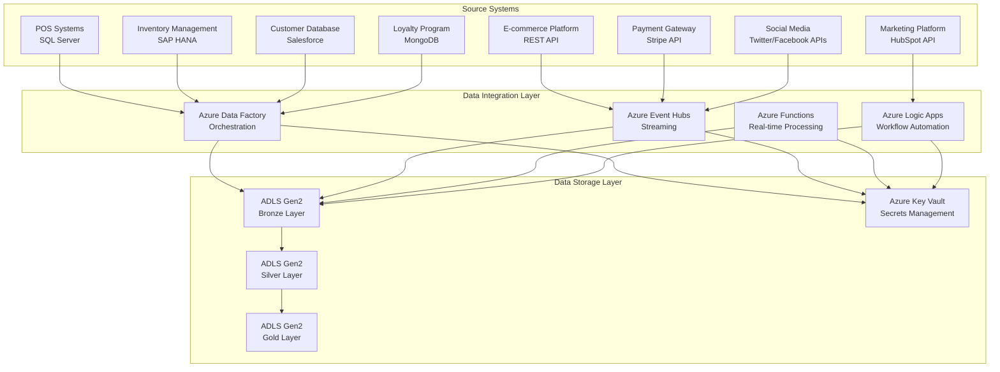
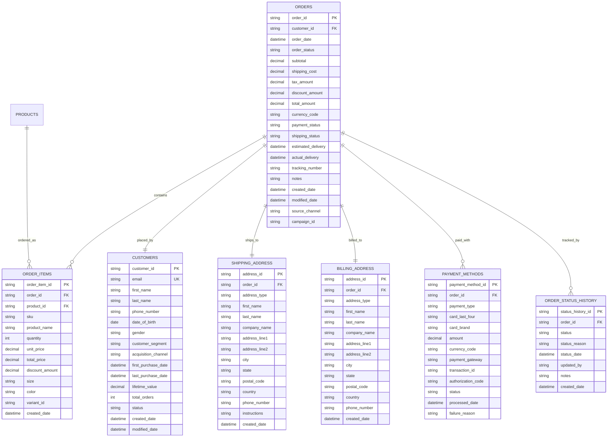

# Retail Data Pipeline - Azure Data Factory with Medallion Architecture

## Overview
This project implements an end-to-end retail data pipeline using Azure Data Factory (ADF) with a medallion architecture pattern. The pipeline processes retail data from multiple sources into ADLS Gen2, applying bronze, silver, and gold layer transformations for comprehensive data analytics.

## Comprehensive Architecture Overview

### Theoretical Foundation of Medallion Architecture

The medallion architecture, also known as the bronze-silver-gold architecture, is a data design pattern that implements a multi-layered approach to data processing and storage. This pattern is inspired by the concept of data refinement, where each layer represents an increasing level of data quality, structure, and business value.

#### Core Architectural Principles

**1. Data Lineage and Traceability**
The medallion architecture ensures complete data lineage from source to consumption, providing transparency and auditability. Each layer maintains metadata about data provenance, transformation history, and quality metrics.

**2. Incremental Data Processing**
Unlike traditional ETL approaches that reprocess entire datasets, the medallion architecture supports incremental processing, enabling efficient handling of large-scale data while maintaining performance and cost optimization.

**3. Schema Evolution and Flexibility**
The architecture accommodates changing business requirements and source system modifications through schema evolution capabilities, ensuring long-term maintainability and adaptability.

**4. Quality Gates and Validation**
Each layer implements quality gates that validate data before progression to the next layer, ensuring data integrity and business rule compliance throughout the pipeline.

### Detailed Medallion Architecture Flow


### Layer-by-Layer Architecture Theory

#### Bronze Layer: Raw Data Preservation

**Philosophy**: The bronze layer serves as the "data lake" within the medallion architecture, preserving raw data in its original form to maintain complete fidelity and enable future reprocessing or analysis that wasn't anticipated during initial design.

**Technical Implementation**:
- **Storage Format**: Delta Lake on ADLS Gen2 for ACID transactions and time travel capabilities
- **Partitioning Strategy**: Hierarchical partitioning by ingestion date (year/month/day/hour) to optimize query performance
- **Compression**: Snappy compression for Parquet files to balance compression ratio and query performance
- **Schema Management**: Schema evolution support through Delta Lake's schema enforcement and evolution features

**Data Quality Considerations**:
- **Minimal Validation**: Only basic structural validation (file format, encoding, basic schema compliance)
- **Completeness Checks**: Verify that expected files are received within SLA windows
- **Metadata Capture**: Comprehensive logging of ingestion timestamps, file sizes, record counts, and source system information

**Retention Policy**: 7-year retention for compliance and audit purposes, with automated lifecycle management moving older data to cooler storage tiers.

#### Silver Layer: Data Standardization and Enrichment

**Philosophy**: The silver layer represents the "data warehouse" concept within the medallion architecture, applying business rules, data quality standards, and transformations to create a clean, consistent, and reliable dataset for downstream consumption.

**Transformation Categories**:

**1. Structural Transformations**:
- **Schema Standardization**: Consistent data types, naming conventions, and field structures across all source systems
- **Data Type Conversion**: Ensure proper data types for analytical processing (dates, decimals, strings)
- **Field Mapping**: Standardize field names and structures across different source systems

**2. Quality Transformations**:
- **Null Value Handling**: Implement business-specific rules for handling missing data (defaults, interpolation, flagging)
- **Duplicate Detection and Removal**: Identify and resolve duplicate records based on business keys
- **Data Validation**: Apply business rules and constraints to ensure data quality
- **Outlier Detection**: Identify and handle statistical outliers based on business context

**3. Business Logic Transformations**:
- **Calculated Fields**: Derive new fields based on business requirements (totals, percentages, ratios)
- **Data Enrichment**: Enhance records with additional information from reference data
- **Business Rule Application**: Implement domain-specific logic and constraints
- **Data Classification**: Apply business taxonomies and categorizations

**Technical Implementation**:
- **Processing Engine**: Azure Data Factory Data Flows with Spark runtime for scalable transformation processing
- **Incremental Processing**: Delta Lake change data capture for efficient processing of only changed data
- **Error Handling**: Comprehensive error logging and alerting for data quality issues
- **Performance Optimization**: Column pruning, predicate pushdown, and adaptive query execution

#### Gold Layer: Business Intelligence and Analytics

**Philosophy**: The gold layer represents the "data mart" concept, creating business-ready datasets optimized for specific analytical use cases and reporting requirements.

**Aggregation Strategies**:

**1. Temporal Aggregations**:
- **Time-based Summaries**: Daily, weekly, monthly, quarterly, and annual aggregations
- **Rolling Windows**: Moving averages, cumulative totals, and trend calculations
- **Seasonal Analysis**: Year-over-year comparisons and seasonal pattern identification

**2. Dimensional Aggregations**:
- **Geographic Aggregations**: Sales by region, territory, store, and market
- **Product Aggregations**: Performance by category, brand, SKU, and product hierarchy
- **Customer Aggregations**: Behavior by segment, lifecycle stage, and demographic profile

**3. Cross-dimensional Analytics**:
- **Customer-Product Analysis**: Purchase patterns, cross-selling opportunities, and product affinity
- **Geographic-Product Analysis**: Regional preferences and market penetration
- **Temporal-Dimensional Analysis**: Trend analysis across multiple business dimensions

**Business Intelligence Features**:
- **Key Performance Indicators (KPIs)**: Pre-calculated business metrics for dashboard consumption
- **Predictive Indicators**: Leading indicators and early warning systems
- **Comparative Analysis**: Benchmarking and variance analysis capabilities
- **Drill-down Capabilities**: Hierarchical data structures supporting multi-level analysis

### Data Flow Architecture Theory

#### Source System Integration Patterns

**1. Batch Processing Pattern**:
```
Source System → Staging Area → Bronze Layer → Silver Layer → Gold Layer
```
- **Use Case**: High-volume, time-sensitive data requiring consistent processing windows
- **Implementation**: Scheduled ADF pipelines with dependency management
- **Benefits**: Predictable processing times, resource optimization, error recovery

**2. Near Real-time Processing Pattern**:
```
Source System → Streaming Ingestion → Bronze Layer → Continuous Processing → Silver/Gold Layers
```
- **Use Case**: Time-critical data requiring minimal latency
- **Implementation**: Azure Event Hubs + Stream Analytics + ADF triggers
- **Benefits**: Low latency, real-time insights, immediate anomaly detection

**3. Change Data Capture (CDC) Pattern**:
```
Source System → CDC Capture → Bronze Layer → Incremental Processing → Silver/Gold Layers
```
- **Use Case**: Large datasets with frequent updates requiring efficient processing
- **Implementation**: Database triggers, transaction log reading, watermark tables
- **Benefits**: Efficient processing, reduced resource consumption, accurate change tracking

#### Data Transformation Patterns

**1. Extract, Transform, Load (ETL)**:
- **Pattern**: Transform data before loading into target system
- **Use Case**: Complex transformations requiring significant processing power
- **Implementation**: ADF Data Flows with Spark runtime
- **Benefits**: Centralized transformation logic, optimized target storage

**2. Extract, Load, Transform (ELT)**:
- **Pattern**: Load raw data first, then transform within the target system
- **Use Case**: Large datasets with complex analytical transformations
- **Implementation**: Copy activities followed by SQL-based transformations
- **Benefits**: Leverages target system's processing power, reduces data movement

**3. Streaming Transformations**:
- **Pattern**: Continuous transformation of streaming data
- **Use Case**: Real-time analytics and monitoring
- **Implementation**: Azure Stream Analytics with custom functions
- **Benefits**: Low latency, continuous processing, real-time insights

### Scalability and Performance Architecture

#### Horizontal Scaling Strategies

**1. Data Partitioning**:
- **Temporal Partitioning**: Partition by date/time for time-series data
- **Functional Partitioning**: Partition by business function or domain
- **Geographic Partitioning**: Partition by geographic regions
- **Hash Partitioning**: Distribute data evenly across partitions

**2. Parallel Processing**:
- **Pipeline Parallelism**: Execute independent pipelines simultaneously
- **Activity Parallelism**: Run multiple activities within a pipeline in parallel
- **Data Parallelism**: Process different data partitions concurrently
- **Resource Parallelism**: Utilize multiple compute resources simultaneously

**3. Caching Strategies**:
- **Query Result Caching**: Cache frequently accessed query results
- **Reference Data Caching**: Cache lookup tables and reference data
- **Computed View Caching**: Pre-compute and cache materialized views
- **Session Caching**: Maintain session state for interactive applications

#### Vertical Scaling Considerations

**1. Compute Resource Optimization**:
- **Memory Allocation**: Optimize memory usage for data processing activities
- **CPU Utilization**: Maximize CPU efficiency through proper resource allocation
- **Storage I/O**: Optimize disk I/O patterns and storage performance
- **Network Bandwidth**: Minimize data movement and optimize network utilization

**2. Resource Management**:
- **Auto-scaling**: Dynamic resource allocation based on workload demands
- **Resource Pools**: Shared resource pools for cost optimization
- **Priority Queuing**: Prioritize critical workloads during resource contention
- **Load Balancing**: Distribute workloads across available resources

### Security Architecture Theory

#### Defense in Depth Strategy

**1. Network Security**:
- **Virtual Network Integration**: Isolate data processing within private networks
- **Private Endpoints**: Secure connections to Azure services
- **Network Security Groups**: Control traffic flow between network segments
- **Firewall Rules**: Restrict access based on source and destination

**2. Identity and Access Management**:
- **Role-Based Access Control (RBAC)**: Granular permissions based on user roles
- **Principle of Least Privilege**: Minimum required permissions for each role
- **Multi-Factor Authentication**: Additional security layer for sensitive operations
- **Service Principal Authentication**: Secure service-to-service communication

**3. Data Protection**:
- **Encryption at Rest**: AES-256 encryption for stored data
- **Encryption in Transit**: TLS 1.2+ for data in motion
- **Key Management**: Azure Key Vault for encryption key management
- **Data Classification**: Automatic classification and protection of sensitive data

**4. Audit and Compliance**:
- **Comprehensive Logging**: Complete audit trail of all data operations
- **Data Lineage Tracking**: Track data flow from source to consumption
- **Compliance Monitoring**: Automated compliance checking and reporting
- **Incident Response**: Rapid response procedures for security incidents

### Cost Optimization Architecture

#### Resource Efficiency Strategies

**1. Compute Optimization**:
- **Right-sizing**: Match compute resources to actual workload requirements
- **Reserved Instances**: Commit to long-term usage for predictable workloads
- **Spot Instances**: Use spot pricing for fault-tolerant batch processing
- **Auto-scaling**: Scale resources based on demand patterns

**2. Storage Optimization**:
- **Data Lifecycle Management**: Automatic tiering based on access patterns
- **Compression**: Efficient data compression to reduce storage costs
- **Deduplication**: Remove duplicate data to optimize storage utilization
- **Archive Policies**: Move infrequently accessed data to cheaper storage tiers

**3. Network Optimization**:
- **Data Locality**: Process data close to storage to minimize transfer costs
- **Batch Operations**: Group operations to reduce API call costs
- **Caching**: Reduce redundant data transfers through intelligent caching
- **Compression**: Compress data during transfer to reduce bandwidth costs

#### Cost Monitoring and Governance

**1. Cost Tracking**:
- **Resource Tagging**: Tag resources for accurate cost allocation
- **Cost Analysis**: Regular analysis of cost patterns and trends
- **Budget Alerts**: Automated alerts for cost threshold breaches
- **Chargeback Models**: Accurate cost allocation to business units

**2. Optimization Recommendations**:
- **Automated Recommendations**: AI-powered optimization suggestions
- **Performance vs. Cost Analysis**: Balance performance requirements with costs
- **Usage Pattern Analysis**: Identify optimization opportunities
- **Continuous Improvement**: Regular review and optimization of cost structure

## Project Structure
```
retail-data-pipeline/
├── README.md
├── infrastructure/
│   ├── arm-templates/
│   │   ├── data-factory.json
│   │   ├── storage-account.json
│   │   └── key-vault.json
│   └── terraform/
│       ├── main.tf
│       ├── variables.tf
│       └── outputs.tf
├── adf-pipelines/
│   ├── linked-services/
│   │   ├── adls-gen2.json
│   │   ├── key-vault.json
│   │   └── sql-database.json
│   ├── datasets/
│   │   ├── bronze/
│   │   │   ├── pos-transactions.json
│   │   │   ├── ecommerce-orders.json
│   │   │   ├── inventory-movement.json
│   │   │   └── customer-data.json
│   │   ├── silver/
│   │   │   ├── clean-transactions.json
│   │   │   ├── enriched-orders.json
│   │   │   ├── inventory-snapshot.json
│   │   │   └── customer-master.json
│   │   └── gold/
│   │       ├── daily-sales-summary.json
│   │       ├── customer-segments.json
│   │       ├── product-performance.json
│   │       └── inventory-alerts.json
│   └── pipelines/
│       ├── 01-bronze-ingestion.json
│       ├── 02-silver-transformation.json
│       ├── 03-gold-aggregation.json
│       ├── 04-monitoring-alerts.json
│       └── 99-master-orchestration.json
├── notebooks/
│   ├── bronze/
│   │   ├── data-quality-checks.ipynb
│   │   └── schema-validation.ipynb
│   ├── silver/
│   │   ├── data-cleansing.ipynb
│   │   └── business-rules.ipynb
│   └── gold/
│       ├── analytics-dashboard.ipynb
│       └── kpi-calculations.ipynb
├── scripts/
│   ├── sql/
│   │   ├── bronze-validation.sql
│   │   ├── silver-transformations.sql
│   │   └── gold-aggregations.sql
│   └── powershell/
│       ├── deploy-infrastructure.ps1
│       └── setup-permissions.ps1
├── config/
│   ├── environment-config.json
│   ├── data-quality-rules.json
│   └── business-rules.json
└── monitoring/
    ├── log-analytics-queries/
    ├── alert-rules/
    └── dashboard-templates/
```

## Comprehensive Data Sources and Metadata

### Source System Architecture Overview



### 1. Point of Sale (POS) Systems - SQL Server

**Source Metadata**:
```json
{
  "source_system": "POS_SQL_SERVER",
  "database_name": "RetailPOS",
  "connection_type": "SQL Server",
  "authentication": "SQL Authentication via Key Vault",
  "data_center": "Primary DC - East US",
  "backup_data_center": "Secondary DC - West US",
  "sla_availability": "99.9%",
  "maintenance_window": "Sunday 2:00 AM - 4:00 AM EST",
  "data_retention": "7 years",
  "compliance_requirements": ["PCI DSS", "SOX", "GDPR"],
  "contact_team": "Retail Operations",
  "technical_contact": "pos-dba@company.com"
}
```

**Table Structure and ER Diagram**:


**Data Volume and Processing**:
- **Daily Volume**: ~100K transactions/day per store (500 stores = 50M transactions/day)
- **Peak Volume**: 200% increase during holiday seasons
- **Processing Frequency**: Hourly batch processing
- **Data Size**: ~2GB/day per store
- **Retention**: 7 years for compliance
- **Compression Ratio**: 70% with Parquet + Snappy compression

### 2. E-commerce Platform - REST API

**Source Metadata**:
```json
{
  "source_system": "ECOMMERCE_API",
  "api_base_url": "https://api.ecommerce.company.com/v2",
  "authentication": "OAuth 2.0 with Client Credentials",
  "rate_limits": {
    "requests_per_minute": 1000,
    "requests_per_hour": 50000,
    "burst_limit": 200
  },
  "data_centers": ["US-East", "US-West", "EU-West"],
  "sla_availability": "99.95%",
  "maintenance_window": "Saturday 3:00 AM - 5:00 AM EST",
  "api_versioning": "Semantic Versioning",
  "webhook_support": true,
  "contact_team": "E-commerce Development",
  "technical_contact": "ecommerce-api@company.com"
}
```

**API Endpoints and Data Models**:



**Real-time Streaming Architecture**:


### 3. Inventory Management System - SAP HANA

**Source Metadata**:
```json
{
  "source_system": "SAP_HANA_INVENTORY",
  "database_name": "SAP_HANA_PROD",
  "connection_type": "SAP HANA",
  "authentication": "SAP User via Key Vault",
  "data_center": "SAP Data Center - Frankfurt",
  "sla_availability": "99.5%",
  "maintenance_window": "Saturday 10:00 PM - Sunday 2:00 AM CET",
  "data_retention": "10 years",
  "compliance_requirements": ["SOX", "IFRS", "Local Tax Regulations"],
  "contact_team": "Supply Chain Management",
  "technical_contact": "sap-hana@company.com"
}
```

**SAP HANA Tables and Relationships**:


### 4. Customer Database - Salesforce CRM

**Source Metadata**:
```json
{
  "source_system": "SALESFORCE_CRM",
  "org_id": "00D1234567890ABC",
  "api_version": "v58.0",
  "authentication": "OAuth 2.0 with JWT Bearer Token",
  "data_center": "Salesforce US East",
  "sla_availability": "99.9%",
  "maintenance_window": "Sunday 1:00 AM - 5:00 AM EST",
  "data_retention": "Unlimited",
  "compliance_requirements": ["GDPR", "CCPA", "SOX"],
  "contact_team": "Customer Success",
  "technical_contact": "salesforce-admin@company.com"
}
```

**Salesforce Objects and Relationships**:


### 5. Additional Source Systems

#### Payment Gateway - Stripe API
```json
{
  "source_system": "STRIPE_PAYMENT_GATEWAY",
  "api_version": "2023-10-16",
  "authentication": "API Key via Key Vault",
  "webhook_endpoints": ["payments.succeeded", "payments.failed", "charges.dispute.created"],
  "data_retention": "7 years",
  "compliance": ["PCI DSS Level 1", "SOC 2 Type II"]
}
```

#### Loyalty Program - MongoDB
```json
{
  "source_system": "LOYALTY_MONGODB",
  "database_name": "loyalty_program",
  "connection_type": "MongoDB Atlas",
  "authentication": "SCRAM-SHA-256 via Key Vault",
  "replica_set": "loyalty-cluster-0",
  "data_retention": "5 years"
}
```

#### Marketing Platform - HubSpot API
```json
{
  "source_system": "HUBSPOT_MARKETING",
  "api_version": "v3",
  "authentication": "Private App Token via Key Vault",
  "rate_limits": "100 requests per 10 seconds",
  "webhook_support": true,
  "data_retention": "3 years"
}
```

## Comprehensive Folder Structure

### Bronze Layer Folder Structure
```
adls-gen2-container/
├── bronze/
│   ├── pos_transactions/
│   │   ├── year=2024/
│   │   │   ├── month=01/
│   │   │   │   ├── day=15/
│   │   │   │   │   ├── hour=00/
│   │   │   │   │   │   ├── pos_transactions_20240115_000000.parquet
│   │   │   │   │   │   ├── pos_transactions_20240115_000000_metadata.json
│   │   │   │   │   │   └── pos_transactions_20240115_000000_checksum.md5
│   │   │   │   │   ├── hour=01/
│   │   │   │   │   └── hour=23/
│   │   │   │   ├── day=16/
│   │   │   │   └── day=31/
│   │   │   ├── month=02/
│   │   │   └── month=12/
│   │   │   ├── year=2023/
│   │   │   └── year=2025/
│   │   ├── _metadata/
│   │   │   ├── schema_evolution_log.json
│   │   │   ├── data_quality_reports/
│   │   │   └── ingestion_logs/
│   │   └── _temp/
│   │       └── staging_files/
│   ├── ecommerce_orders/
│   │   ├── year=2024/
│   │   │   ├── month=01/
│   │   │   │   ├── day=15/
│   │   │   │   │   ├── hour=00/
│   │   │   │   │   │   ├── minute=00/
│   │   │   │   │   │   │   ├── orders_20240115_000000.json.gz
│   │   │   │   │   │   │   └── orders_20240115_000000_metadata.json
│   │   │   │   │   │   ├── minute=15/
│   │   │   │   │   │   ├── minute=30/
│   │   │   │   │   │   └── minute=45/
│   │   │   │   │   ├── hour=01/
│   │   │   │   │   └── hour=23/
│   │   │   │   ├── day=16/
│   │   │   │   └── day=31/
│   │   │   ├── month=02/
│   │   │   └── month=12/
│   │   │   └── year=2023/
│   │   ├── _metadata/
│   │   └── _temp/
│   ├── inventory_movement/
│   │   ├── year=2024/
│   │   │   ├── month=01/
│   │   │   │   ├── day=15/
│   │   │   │   │   ├── inventory_movement_20240115.parquet
│   │   │   │   │   └── inventory_movement_20240115_metadata.json
│   │   │   │   ├── day=16/
│   │   │   │   └── day=31/
│   │   │   ├── month=02/
│   │   │   └── month=12/
│   │   │   └── year=2023/
│   │   ├── _metadata/
│   │   └── _temp/
│   ├── customer_data/
│   │   ├── year=2024/
│   │   │   ├── month=01/
│   │   │   │   ├── day=15/
│   │   │   │   │   ├── customer_data_20240115_delta.parquet
│   │   │   │   │   └── customer_data_20240115_metadata.json
│   │   │   │   ├── day=16/
│   │   │   │   └── day=31/
│   │   │   ├── month=02/
│   │   │   └── month=12/
│   │   │   └── year=2023/
│   │   ├── _metadata/
│   │   └── _temp/
│   ├── payment_data/
│   │   ├── year=2024/
│   │   │   ├── month=01/
│   │   │   │   ├── day=15/
│   │   │   │   │   ├── payment_data_20240115.parquet
│   │   │   │   │   └── payment_data_20240115_metadata.json
│   │   │   │   ├── day=16/
│   │   │   │   └── day=31/
│   │   │   ├── month=02/
│   │   │   └── month=12/
│   │   │   └── year=2023/
│   │   ├── _metadata/
│   │   └── _temp/
│   ├── loyalty_data/
│   │   ├── year=2024/
│   │   │   ├── month=01/
│   │   │   │   ├── day=15/
│   │   │   │   │   ├── loyalty_data_20240115.parquet
│   │   │   │   │   └── loyalty_data_20240115_metadata.json
│   │   │   │   ├── day=16/
│   │   │   │   └── day=31/
│   │   │   ├── month=02/
│   │   │   └── month=12/
│   │   │   └── year=2023/
│   │   ├── _metadata/
│   │   └── _temp/
│   ├── marketing_data/
│   │   ├── year=2024/
│   │   │   ├── month=01/
│   │   │   │   ├── day=15/
│   │   │   │   │   ├── marketing_data_20240115.parquet
│   │   │   │   │   └── marketing_data_20240115_metadata.json
│   │   │   │   ├── day=16/
│   │   │   │   └── day=31/
│   │   │   ├── month=02/
│   │   │   └── month=12/
│   │   │   └── year=2023/
│   │   ├── _metadata/
│   │   └── _temp/
│   └── social_media_data/
│       ├── year=2024/
│       │   ├── month=01/
│       │   │   ├── day=15/
│       │   │   │   ├── social_media_data_20240115.parquet
│       │   │   │   │   └── social_media_data_20240115_metadata.json
│       │   │   │   ├── day=16/
│       │   │   │   └── day=31/
│       │   │   ├── month=02/
│       │   │   └── month=12/
│       │   │   └── year=2023/
│       ├── _metadata/
│       └── _temp/
```

### Silver Layer Folder Structure
```
adls-gen2-container/
├── silver/
│   ├── clean_transactions/
│   │   ├── year=2024/
│   │   │   ├── month=01/
│   │   │   │   ├── day=15/
│   │   │   │   │   ├── clean_transactions_20240115.parquet
│   │   │   │   │   ├── clean_transactions_20240115_quality_report.json
│   │   │   │   │   └── clean_transactions_20240115_audit_log.json
│   │   │   │   ├── day=16/
│   │   │   │   └── day=31/
│   │   │   ├── month=02/
│   │   │   └── month=12/
│   │   │   └── year=2023/
│   │   ├── _metadata/
│   │   │   ├── schema_version.json
│   │   │   ├── business_rules_applied.json
│   │   │   ├── data_quality_metrics/
│   │   │   └── transformation_logs/
│   │   └── _temp/
│   ├── enriched_orders/
│   │   ├── year=2024/
│   │   │   ├── month=01/
│   │   │   │   ├── day=15/
│   │   │   │   │   ├── enriched_orders_20240115.parquet
│   │   │   │   │   ├── enriched_orders_20240115_quality_report.json
│   │   │   │   │   └── enriched_orders_20240115_audit_log.json
│   │   │   │   ├── day=16/
│   │   │   │   └── day=31/
│   │   │   ├── month=02/
│   │   │   └── month=12/
│   │   │   └── year=2023/
│   │   ├── _metadata/
│   │   └── _temp/
│   ├── inventory_snapshot/
│   │   ├── year=2024/
│   │   │   ├── month=01/
│   │   │   │   ├── day=15/
│   │   │   │   │   ├── inventory_snapshot_20240115.parquet
│   │   │   │   │   ├── inventory_snapshot_20240115_quality_report.json
│   │   │   │   │   └── inventory_snapshot_20240115_audit_log.json
│   │   │   │   ├── day=16/
│   │   │   │   └── day=31/
│   │   │   ├── month=02/
│   │   │   └── month=12/
│   │   │   └── year=2023/
│   │   ├── _metadata/
│   │   └── _temp/
│   ├── customer_master/
│   │   ├── year=2024/
│   │   │   ├── month=01/
│   │   │   │   ├── day=15/
│   │   │   │   │   ├── customer_master_20240115.parquet
│   │   │   │   │   ├── customer_master_20240115_quality_report.json
│   │   │   │   │   └── customer_master_20240115_audit_log.json
│   │   │   │   ├── day=16/
│   │   │   │   └── day=31/
│   │   │   ├── month=02/
│   │   │   └── month=12/
│   │   │   └── year=2023/
│   │   ├── _metadata/
│   │   └── _temp/
│   ├── payment_master/
│   │   ├── year=2024/
│   │   │   ├── month=01/
│   │   │   │   ├── day=15/
│   │   │   │   │   ├── payment_master_20240115.parquet
│   │   │   │   │   ├── payment_master_20240115_quality_report.json
│   │   │   │   │   └── payment_master_20240115_audit_log.json
│   │   │   │   ├── day=16/
│   │   │   │   └── day=31/
│   │   │   ├── month=02/
│   │   │   └── month=12/
│   │   │   └── year=2023/
│   │   ├── _metadata/
│   │   └── _temp/
│   ├── loyalty_master/
│   │   ├── year=2024/
│   │   │   ├── month=01/
│   │   │   │   ├── day=15/
│   │   │   │   │   ├── loyalty_master_20240115.parquet
│   │   │   │   │   ├── loyalty_master_20240115_quality_report.json
│   │   │   │   │   └── loyalty_master_20240115_audit_log.json
│   │   │   │   ├── day=16/
│   │   │   │   └── day=31/
│   │   │   ├── month=02/
│   │   │   └── month=12/
│   │   │   └── year=2023/
│   │   ├── _metadata/
│   │   └── _temp/
│   ├── marketing_master/
│   │   ├── year=2024/
│   │   │   ├── month=01/
│   │   │   │   ├── day=15/
│   │   │   │   │   ├── marketing_master_20240115.parquet
│   │   │   │   │   ├── marketing_master_20240115_quality_report.json
│   │   │   │   │   └── marketing_master_20240115_audit_log.json
│   │   │   │   ├── day=16/
│   │   │   │   └── day=31/
│   │   │   ├── month=02/
│   │   │   └── month=12/
│   │   │   └── year=2023/
│   │   ├── _metadata/
│   │   └── _temp/
│   └── social_media_master/
│       ├── year=2024/
│       │   ├── month=01/
│       │   │   ├── day=15/
│       │   │   │   ├── social_media_master_20240115.parquet
│       │   │   │   │   ├── social_media_master_20240115_quality_report.json
│       │   │   │   │   └── social_media_master_20240115_audit_log.json
│       │   │   │   ├── day=16/
│       │   │   │   └── day=31/
│       │   │   ├── month=02/
│       │   │   └── month=12/
│       │   │   └── year=2023/
│       ├── _metadata/
│       └── _temp/
```

### Gold Layer Folder Structure
```
adls-gen2-container/
├── gold/
│   ├── daily_sales_summary/
│   │   ├── year=2024/
│   │   │   ├── month=01/
│   │   │   │   ├── day=15/
│   │   │   │   │   ├── daily_sales_summary_20240115.parquet
│   │   │   │   │   ├── daily_sales_summary_20240115_kpi_report.json
│   │   │   │   │   └── daily_sales_summary_20240115_audit_log.json
│   │   │   │   ├── day=16/
│   │   │   │   └── day=31/
│   │   │   ├── month=02/
│   │   │   └── month=12/
│   │   │   └── year=2023/
│   │   ├── _metadata/
│   │   │   ├── kpi_definitions.json
│   │   │   ├── aggregation_rules.json
│   │   │   ├── business_metrics/
│   │   │   └── performance_logs/
│   │   └── _temp/
│   ├── customer_segments/
│   │   ├── year=2024/
│   │   │   ├── month=01/
│   │   │   │   ├── day=15/
│   │   │   │   │   ├── customer_segments_20240115.parquet
│   │   │   │   │   ├── customer_segments_20240115_segmentation_report.json
│   │   │   │   │   └── customer_segments_20240115_audit_log.json
│   │   │   │   ├── day=16/
│   │   │   │   └── day=31/
│   │   │   ├── month=02/
│   │   │   └── month=12/
│   │   │   └── year=2023/
│   │   ├── _metadata/
│   │   │   ├── segmentation_rules.json
│   │   │   ├── rfm_parameters.json
│   │   │   ├── customer_analytics/
│   │   │   └── performance_logs/
│   │   └── _temp/
│   ├── product_performance/
│   │   ├── year=2024/
│   │   │   ├── month=01/
│   │   │   │   ├── day=15/
│   │   │   │   │   ├── product_performance_20240115.parquet
│   │   │   │   │   ├── product_performance_20240115_performance_report.json
│   │   │   │   │   └── product_performance_20240115_audit_log.json
│   │   │   │   ├── day=16/
│   │   │   │   └── day=31/
│   │   │   ├── month=02/
│   │   │   └── month=12/
│   │   │   └── year=2023/
│   │   ├── _metadata/
│   │   │   ├── performance_metrics.json
│   │   │   ├── product_hierarchy.json
│   │   │   ├── sales_analytics/
│   │   │   └── performance_logs/
│   │   └── _temp/
│   ├── inventory_alerts/
│   │   ├── year=2024/
│   │   │   ├── month=01/
│   │   │   │   ├── day=15/
│   │   │   │   │   ├── inventory_alerts_20240115.parquet
│   │   │   │   │   ├── inventory_alerts_20240115_alert_report.json
│   │   │   │   │   └── inventory_alerts_20240115_audit_log.json
│   │   │   │   ├── day=16/
│   │   │   │   └── day=31/
│   │   │   ├── month=02/
│   │   │   └── month=12/
│   │   │   └── year=2023/
│   │   ├── _metadata/
│   │   │   ├── alert_rules.json
│   │   │   ├── reorder_points.json
│   │   │   ├── inventory_analytics/
│   │   │   └── performance_logs/
│   │   └── _temp/
│   ├── financial_summary/
│   │   ├── year=2024/
│   │   │   ├── month=01/
│   │   │   │   ├── day=15/
│   │   │   │   │   ├── financial_summary_20240115.parquet
│   │   │   │   │   ├── financial_summary_20240115_financial_report.json
│   │   │   │   │   └── financial_summary_20240115_audit_log.json
│   │   │   │   ├── day=16/
│   │   │   │   └── day=31/
│   │   │   ├── month=02/
│   │   │   └── month=12/
│   │   │   └── year=2023/
│   │   ├── _metadata/
│   │   │   ├── financial_metrics.json
│   │   │   ├── accounting_rules.json
│   │   │   ├── financial_analytics/
│   │   │   └── performance_logs/
│   │   └── _temp/
│   ├── marketing_performance/
│   │   ├── year=2024/
│   │   │   ├── month=01/
│   │   │   │   ├── day=15/
│   │   │   │   │   ├── marketing_performance_20240115.parquet
│   │   │   │   │   ├── marketing_performance_20240115_campaign_report.json
│   │   │   │   │   └── marketing_performance_20240115_audit_log.json
│   │   │   │   ├── day=16/
│   │   │   │   └── day=31/
│   │   │   ├── month=02/
│   │   │   └── month=12/
│   │   │   └── year=2023/
│   │   ├── _metadata/
│   │   │   ├── campaign_metrics.json
│   │   │   ├── attribution_rules.json
│   │   │   ├── marketing_analytics/
│   │   │   └── performance_logs/
│   │   └── _temp/
│   └── social_media_analytics/
│       ├── year=2024/
│       │   ├── month=01/
│       │   │   ├── day=15/
│       │   │   │   ├── social_media_analytics_20240115.parquet
│       │   │   │   │   ├── social_media_analytics_20240115_social_report.json
│       │   │   │   │   └── social_media_analytics_20240115_audit_log.json
│       │   │   │   ├── day=16/
│       │   │   │   └── day=31/
│       │   │   ├── month=02/
│       │   │   └── month=12/
│       │   │   └── year=2023/
│       ├── _metadata/
│       │   ├── social_metrics.json
│       │   ├── sentiment_rules.json
│       │   ├── social_analytics/
│       │   └── performance_logs/
│       └── _temp/
```

## Data Layers

### Bronze Layer (Raw Data Landing)
**Purpose**: Store raw data exactly as received from source systems

**Characteristics**:
- Minimal transformation (only partitioning and compression)
- Retain original data structure and schema
- Enable data lineage and audit trails
- Support for schema evolution

**Storage**: ADLS Gen2 with Delta Lake format
**Retention**: 7 years (compliance requirement)

**Bronze Tables**:
- `bronze.pos_transactions`
- `bronze.ecommerce_orders`
- `bronze.inventory_movement`
- `bronze.customer_data`

### Silver Layer (Cleaned and Validated Data)
**Purpose**: Apply data quality rules, standardization, and business logic

**Transformations**:
- Data type standardization
- Null value handling
- Duplicate removal
- Data validation and enrichment
- Business rule application

**Storage**: ADLS Gen2 with Delta Lake format
**Retention**: 5 years

**Silver Tables**:
- `silver.clean_transactions`
- `silver.enriched_orders`
- `silver.inventory_snapshot`
- `silver.customer_master`

### Gold Layer (Analytics Ready)
**Purpose**: Create business-ready datasets for reporting and analytics

**Aggregations**:
- Daily/monthly sales summaries
- Customer segmentation
- Product performance metrics
- Inventory optimization insights
- KPI calculations

**Storage**: ADLS Gen2 with Delta Lake format
**Retention**: 3 years

**Gold Tables**:
- `gold.daily_sales_summary`
- `gold.customer_segments`
- `gold.product_performance`
- `gold.inventory_alerts`

## Pipeline Components

### 1. Bronze Ingestion Pipeline
**Function**: Ingest raw data from all source systems

**Activities**:
- Data source connections
- Schema validation
- Data quality checks
- Partitioning and compression
- Metadata capture

### 2. Silver Transformation Pipeline
**Function**: Clean and standardize bronze data

**Activities**:
- Data cleansing rules
- Business logic application
- Data enrichment
- Quality validation
- Incremental processing

### 3. Gold Aggregation Pipeline
**Function**: Create analytics-ready datasets

**Activities**:
- Business metric calculations
- Aggregation logic
- KPI computations
- Data mart creation
- Performance optimization

### 4. Monitoring and Alerting Pipeline
**Function**: Monitor pipeline health and data quality

**Activities**:
- SLA monitoring
- Data quality alerts
- Performance metrics
- Error handling
- Notification triggers

## Key Features

### Data Quality Framework
- **Schema Validation**: Ensure data structure compliance
- **Business Rules**: Apply domain-specific validation
- **Completeness Checks**: Verify required fields are populated
- **Consistency Validation**: Cross-reference data across sources
- **Timeliness Monitoring**: Track data freshness

### Performance Optimization
- **Partitioning Strategy**: Optimize query performance
- **Compression**: Reduce storage costs
- **Incremental Processing**: Process only changed data
- **Parallel Execution**: Maximize resource utilization
- **Caching**: Improve query response times

### Security and Compliance
- **Access Control**: Role-based permissions
- **Data Encryption**: At rest and in transit
- **Audit Logging**: Complete data lineage tracking
- **PII Protection**: Sensitive data handling
- **Compliance**: GDPR, SOX, PCI DSS adherence

## Deployment Instructions

### Prerequisites
- Azure subscription with appropriate permissions
- Azure CLI or PowerShell installed
- Terraform (optional, for infrastructure as code)
- SQL Server Management Studio (for source connections)

### Step 1: Infrastructure Setup
```powershell
# Deploy infrastructure using ARM templates
.\scripts\powershell\deploy-infrastructure.ps1 -ResourceGroupName "rg-retail-data" -Location "East US"
```

### Step 2: Configure Linked Services
1. Update connection strings in `adf-pipelines/linked-services/`
2. Configure Key Vault references for secure connections
3. Test all linked service connections

### Step 3: Deploy ADF Pipelines
```powershell
# Import ADF pipelines
.\scripts\powershell\deploy-pipelines.ps1 -DataFactoryName "adf-retail-pipeline"
```

### Step 4: Configure Monitoring
1. Set up Log Analytics workspace
2. Configure alert rules
3. Deploy monitoring dashboards

## Monitoring and Maintenance
    
### Key Metrics
- **Pipeline Success Rate**: Target >99.5%
- **Data Freshness**: Bronze <1 hour, Silver <4 hours, Gold <24 hours
- **Data Quality Score**: Target >95%
- **Storage Costs**: Monitor and optimize monthly

### Alert Conditions
- Pipeline failures
- Data quality threshold breaches
- SLA violations
- Resource utilization spikes
- Security anomalies

### Maintenance Tasks
- **Daily**: Monitor pipeline execution
- **Weekly**: Review data quality reports
- **Monthly**: Optimize storage and performance
- **Quarterly**: Update business rules and transformations

## Business Value

### Analytics Capabilities
- **Real-time Dashboards**: Live business metrics
- **Predictive Analytics**: Demand forecasting
- **Customer Insights**: Behavior analysis and segmentation
- **Inventory Optimization**: Stock level recommendations
- **Performance Monitoring**: KPI tracking and alerts

### Operational Benefits
- **Data Consistency**: Single source of truth
- **Scalability**: Handle growing data volumes
- **Cost Optimization**: Efficient storage and processing
- **Compliance**: Audit-ready data lineage
- **Agility**: Rapid response to business changes

## Troubleshooting

### Common Issues
1. **Connection Failures**: Check linked service configurations
2. **Data Quality Issues**: Review validation rules and source data
3. **Performance Problems**: Optimize partitioning and indexing
4. **Storage Costs**: Implement data lifecycle policies
5. **Security Errors**: Verify permissions and access policies

### Support Contacts
- **Data Engineering Team**: data-eng@company.com
- **Infrastructure Team**: infra@company.com
- **Business Analysts**: analytics@company.com

## Version History
- **v1.0**: Initial implementation with basic bronze/silver/gold layers
- **v1.1**: Added monitoring and alerting capabilities
- **v1.2**: Enhanced data quality framework
- **v2.0**: Performance optimizations and cost improvements

## Comprehensive Business Rules and Transformations

### Business Rules Engine Configuration

#### 1. Data Quality Rules (config/data-quality-rules.json)
```json
{
  "data_quality_framework": {
    "version": "2.0",
    "last_updated": "2024-01-15",
    "rules_engine": "Azure Data Factory Data Flow",
    "validation_layers": {
      "bronze_validation": {
        "pos_transactions": {
          "required_fields": ["transaction_id", "store_id", "product_code", "amount", "transaction_date"],
          "data_types": {
            "transaction_id": "bigint",
            "store_id": "int",
            "product_code": "string",
            "amount": "decimal(18,2)",
            "transaction_date": "datetime",
            "customer_id": "int",
            "employee_id": "int"
          },
          "business_rules": {
            "amount_validation": {
              "min_amount": 0.01,
              "max_amount": 10000.00,
              "currency_code": "USD"
            },
            "store_validation": {
              "valid_stores": ["STORE001", "STORE002", "STORE003", "STORE004", "STORE005"],
              "store_status": "ACTIVE"
            },
            "date_validation": {
              "transaction_date_range": {
                "min_date": "2020-01-01",
                "max_date": "2030-12-31"
              },
              "future_date_threshold_hours": 24
            },
            "customer_validation": {
              "required_for_loyalty": true,
              "anonymous_customer_id": "CUST_ANON_000001"
            }
          },
          "completeness_threshold": 95.0,
          "accuracy_threshold": 98.0,
          "consistency_threshold": 99.0
        },
        "ecommerce_orders": {
          "required_fields": ["order_id", "customer_id", "order_date", "total_amount", "order_status"],
          "data_types": {
            "order_id": "string",
            "customer_id": "string",
            "order_date": "datetime",
            "total_amount": "decimal(18,2)",
            "order_status": "string",
            "currency_code": "string"
          },
          "business_rules": {
            "order_status_validation": {
              "valid_statuses": ["PENDING", "CONFIRMED", "SHIPPED", "DELIVERED", "CANCELLED", "REFUNDED"],
              "status_transitions": {
                "PENDING": ["CONFIRMED", "CANCELLED"],
                "CONFIRMED": ["SHIPPED", "CANCELLED"],
                "SHIPPED": ["DELIVERED"],
                "DELIVERED": ["REFUNDED"],
                "CANCELLED": [],
                "REFUNDED": []
              }
            },
            "amount_validation": {
              "min_amount": 0.01,
              "max_amount": 50000.00,
              "currency_code": "USD"
            },
            "shipping_validation": {
              "required_fields": ["shipping_address", "shipping_cost"],
              "max_shipping_cost": 1000.00
            }
          },
          "completeness_threshold": 98.0,
          "accuracy_threshold": 99.0,
          "consistency_threshold": 99.5
        },
        "inventory_movement": {
          "required_fields": ["material_number", "plant", "movement_type", "quantity", "posting_date"],
          "data_types": {
            "material_number": "string",
            "plant": "string",
            "movement_type": "string",
            "quantity": "decimal(15,3)",
            "posting_date": "datetime"
          },
          "business_rules": {
            "movement_type_validation": {
              "valid_types": ["101", "102", "103", "104", "105", "106", "107", "108", "109", "110"],
              "description": {
                "101": "Goods receipt from vendor",
                "102": "Transfer from plant to plant",
                "103": "Transfer from storage location to storage location",
                "104": "Goods issue to customer",
                "105": "Return from customer",
                "106": "Physical inventory count",
                "107": "Scrap",
                "108": "Return to vendor",
                "109": "Consumption",
                "110": "Production receipt"
              }
            },
            "quantity_validation": {
              "min_quantity": -999999.999,
              "max_quantity": 999999.999,
              "decimal_places": 3
            },
            "plant_validation": {
              "valid_plants": ["P001", "P002", "P003", "P004", "P005"],
              "plant_status": "ACTIVE"
            }
          },
          "completeness_threshold": 99.0,
          "accuracy_threshold": 99.5,
          "consistency_threshold": 99.8
        },
        "customer_data": {
          "required_fields": ["customer_id", "first_name", "last_name", "email", "created_date"],
          "data_types": {
            "customer_id": "string",
            "first_name": "string",
            "last_name": "string",
            "email": "string",
            "phone_number": "string",
            "created_date": "datetime"
          },
          "business_rules": {
            "email_validation": {
              "format": "RFC 5322 compliant",
              "domain_whitelist": ["company.com", "gmail.com", "yahoo.com", "outlook.com"],
              "max_length": 254
            },
            "phone_validation": {
              "format": "E.164 international format",
              "country_codes": ["+1", "+44", "+49", "+33", "+81"],
              "max_length": 15
            },
            "name_validation": {
              "min_length": 1,
              "max_length": 100,
              "allowed_characters": "A-Z, a-z, spaces, hyphens, apostrophes"
            },
            "privacy_compliance": {
              "gdpr_consent_required": true,
              "ccpa_opt_out_supported": true,
              "data_retention_years": 7
            }
          },
          "completeness_threshold": 90.0,
          "accuracy_threshold": 95.0,
          "consistency_threshold": 98.0
        }
      },
      "silver_validation": {
        "completeness_threshold": 98.0,
        "accuracy_threshold": 99.0,
        "consistency_threshold": 99.5,
        "timeliness_threshold": 99.0,
        "uniqueness_threshold": 100.0
      },
      "gold_validation": {
        "completeness_threshold": 99.0,
        "accuracy_threshold": 99.5,
        "consistency_threshold": 99.8,
        "timeliness_threshold": 99.5,
        "uniqueness_threshold": 100.0
      }
    }
  }
}
```

#### 2. Business Rules Configuration (config/business-rules.json)
```json
{
  "business_rules_engine": {
    "version": "2.0",
    "last_updated": "2024-01-15",
    "rule_categories": {
      "customer_segmentation": {
        "rfm_analysis": {
          "recency_parameters": {
            "r1_high": 30,
            "r2_medium": 90,
            "r3_low": 180,
            "r4_very_low": 365
          },
          "frequency_parameters": {
            "f1_high": 12,
            "f2_medium": 6,
            "f3_low": 3,
            "f4_very_low": 1
          },
          "monetary_parameters": {
            "m1_high": 1000.00,
            "m2_medium": 500.00,
            "m3_low": 200.00,
            "m4_very_low": 50.00
          },
          "segmentation_matrix": {
            "champions": {"r": [1, 2], "f": [1, 2], "m": [1, 2]},
            "loyal_customers": {"r": [1, 2], "f": [1, 2, 3], "m": [1, 2]},
            "potential_loyalists": {"r": [1, 2], "f": [1, 2], "m": [3, 4]},
            "new_customers": {"r": [1], "f": [1], "m": [1, 2, 3, 4]},
            "promising": {"r": [1], "f": [1, 2], "m": [1, 2, 3]},
            "need_attention": {"r": [2, 3], "f": [1, 2], "m": [1, 2]},
            "about_to_sleep": {"r": [2, 3], "f": [1, 2, 3], "m": [1, 2]},
            "at_risk": {"r": [3, 4], "f": [1, 2, 3], "m": [1, 2]},
            "cannot_lose_them": {"r": [3, 4], "f": [1, 2], "m": [1, 2]},
            "hibernating": {"r": [4], "f": [1, 2, 3, 4], "m": [1, 2, 3, 4]},
            "lost": {"r": [4], "f": [4], "m": [4]}
          }
        },
        "lifetime_value_calculation": {
          "average_order_value_window": 365,
          "purchase_frequency_window": 365,
          "customer_lifespan_days": 1095,
          "discount_rate": 0.10,
          "clv_formula": "AOV * PF * CL / (1 + DR - RR)",
          "retention_rate_window": 365
        },
        "behavioral_segmentation": {
          "purchase_patterns": {
            "seasonal_buyer": {"frequency": "quarterly", "consistency": 0.8},
            "regular_buyer": {"frequency": "monthly", "consistency": 0.9},
            "impulse_buyer": {"frequency": "irregular", "consistency": 0.3},
            "bulk_buyer": {"avg_order_size": 500.00, "frequency": "quarterly"}
          },
          "channel_preferences": {
            "online_only": {"online_percentage": 100},
            "store_only": {"store_percentage": 100},
            "omnichannel": {"both_channels": true}
          }
        }
      },
      "inventory_management": {
        "reorder_points": {
          "fast_moving": {"days_of_supply": 7, "safety_stock_percentage": 20},
          "medium_moving": {"days_of_supply": 14, "safety_stock_percentage": 15},
          "slow_moving": {"days_of_supply": 30, "safety_stock_percentage": 10}
        },
        "abc_analysis": {
          "a_class": {"percentage": 20, "value_threshold": 0.8},
          "b_class": {"percentage": 30, "value_threshold": 0.15},
          "c_class": {"percentage": 50, "value_threshold": 0.05}
        },
        "xyz_analysis": {
          "x_class": {"variability": 0.1, "demand_pattern": "stable"},
          "y_class": {"variability": 0.2, "demand_pattern": "moderate"},
          "z_class": {"variability": 0.3, "demand_pattern": "irregular"}
        },
        "stock_alerts": {
          "low_stock": {"threshold_percentage": 10},
          "overstock": {"threshold_percentage": 150},
          "zero_stock": {"threshold": 0},
          "negative_stock": {"threshold": -1}
        }
      },
      "financial_rules": {
        "revenue_recognition": {
          "point_of_sale": "immediate",
          "ecommerce_shipped": "shipping_date",
          "ecommerce_delivered": "delivery_date",
          "subscription": "monthly_anniversary"
        },
        "tax_calculations": {
          "sales_tax_rate": 0.0875,
          "exempt_categories": ["groceries", "prescription_drugs"],
          "tax_jurisdictions": ["state", "county", "city"]
        },
        "discount_rules": {
          "loyalty_tiers": {
            "bronze": {"discount_percentage": 0.05},
            "silver": {"discount_percentage": 0.10},
            "gold": {"discount_percentage": 0.15},
            "platinum": {"discount_percentage": 0.20}
          },
          "bulk_discounts": {
            "quantity_thresholds": [10, 25, 50, 100],
            "discount_percentages": [0.05, 0.10, 0.15, 0.20]
          }
        }
      },
      "data_transformation": {
        "standardization_rules": {
          "address_formatting": {
            "country_codes": {"US": "United States", "CA": "Canada", "MX": "Mexico"},
            "state_abbreviations": {"California": "CA", "New York": "NY", "Texas": "TX"},
            "postal_code_format": {"US": "XXXXX-XXXX", "CA": "XXX XXX"}
          },
          "phone_number_formatting": {
            "us_format": "+1 (XXX) XXX-XXXX",
            "international_format": "+XX XXX XXX XXXX"
          },
          "currency_standardization": {
            "base_currency": "USD",
            "exchange_rate_source": "Federal Reserve",
            "conversion_precision": 4
          }
        },
        "data_enrichment": {
          "geographic_enrichment": {
            "timezone_mapping": true,
            "demographic_data": true,
            "market_segmentation": true
          },
          "product_enrichment": {
            "category_hierarchy": true,
            "brand_mapping": true,
            "supplier_information": true
          }
        }
      }
    }
  }
}
```

### Comprehensive Data Transformation Logic

#### 1. Bronze to Silver Transformations

**POS Transactions Transformation**:
```sql
-- Data Flow Activity: bronze_to_silver_pos_transactions
WITH cleaned_transactions AS (
  SELECT 
    transaction_id,
    store_id,
    CASE 
      WHEN customer_id IS NULL THEN 'CUST_ANON_000001'
      ELSE CAST(customer_id AS STRING)
    END AS customer_id,
    employee_id,
    CAST(transaction_date AS TIMESTAMP) AS transaction_date,
    UPPER(TRIM(transaction_type)) AS transaction_type,
    CAST(subtotal AS DECIMAL(18,2)) AS subtotal,
    CAST(tax_amount AS DECIMAL(18,2)) AS tax_amount,
    CAST(discount_amount AS DECIMAL(18,2)) AS discount_amount,
    CAST(total_amount AS DECIMAL(18,2)) AS total_amount,
    UPPER(TRIM(payment_method)) AS payment_method,
    CASE 
      WHEN currency_code IS NULL THEN 'USD'
      ELSE UPPER(TRIM(currency_code))
    END AS currency_code,
    receipt_number,
    UPPER(TRIM(status)) AS status,
    created_date,
    modified_date,
    -- Business rule validations
    CASE 
      WHEN total_amount < 0.01 THEN 'INVALID_AMOUNT'
      WHEN total_amount > 10000.00 THEN 'EXCESSIVE_AMOUNT'
      WHEN transaction_date > CURRENT_TIMESTAMP() + INTERVAL 24 HOURS THEN 'FUTURE_DATE'
      WHEN store_id NOT IN ('STORE001', 'STORE002', 'STORE003', 'STORE004', 'STORE005') THEN 'INVALID_STORE'
      ELSE 'VALID'
    END AS validation_status,
    -- Calculated fields
    CASE 
      WHEN discount_amount > 0 THEN 'DISCOUNTED'
      ELSE 'FULL_PRICE'
    END AS pricing_type,
    EXTRACT(HOUR FROM transaction_date) AS transaction_hour,
    EXTRACT(DAYOFWEEK FROM transaction_date) AS day_of_week,
    EXTRACT(MONTH FROM transaction_date) AS month,
    EXTRACT(QUARTER FROM transaction_date) AS quarter,
    EXTRACT(YEAR FROM transaction_date) AS year
  FROM bronze.pos_transactions
  WHERE year = ${year} AND month = ${month} AND day = ${day}
),
deduplicated_transactions AS (
  SELECT *,
    ROW_NUMBER() OVER (
      PARTITION BY transaction_id, store_id, transaction_date 
      ORDER BY created_date DESC
    ) AS row_num
  FROM cleaned_transactions
)
SELECT *
FROM deduplicated_transactions
WHERE row_num = 1 AND validation_status = 'VALID'
```

**E-commerce Orders Transformation**:
```sql
-- Data Flow Activity: bronze_to_silver_ecommerce_orders
WITH parsed_orders AS (
  SELECT 
    order_id,
    customer_id,
    CAST(order_date AS TIMESTAMP) AS order_date,
    UPPER(TRIM(order_status)) AS order_status,
    CAST(subtotal AS DECIMAL(18,2)) AS subtotal,
    CAST(shipping_cost AS DECIMAL(18,2)) AS shipping_cost,
    CAST(tax_amount AS DECIMAL(18,2)) AS tax_amount,
    CAST(discount_amount AS DECIMAL(18,2)) AS discount_amount,
    CAST(total_amount AS DECIMAL(18,2)) AS total_amount,
    UPPER(TRIM(currency_code)) AS currency_code,
    UPPER(TRIM(payment_status)) AS payment_status,
    UPPER(TRIM(shipping_status)) AS shipping_status,
    CAST(estimated_delivery AS TIMESTAMP) AS estimated_delivery,
    CAST(actual_delivery AS TIMESTAMP) AS actual_delivery,
    tracking_number,
    notes,
    created_date,
    modified_date,
    UPPER(TRIM(source_channel)) AS source_channel,
    campaign_id,
    -- Address parsing
    JSON_EXTRACT(shipping_address, '$.city') AS shipping_city,
    JSON_EXTRACT(shipping_address, '$.state') AS shipping_state,
    JSON_EXTRACT(shipping_address, '$.country') AS shipping_country,
    JSON_EXTRACT(billing_address, '$.city') AS billing_city,
    JSON_EXTRACT(billing_address, '$.state') AS billing_state,
    JSON_EXTRACT(billing_address, '$.country') AS billing_country,
    -- Business rule validations
    CASE 
      WHEN total_amount < 0.01 THEN 'INVALID_AMOUNT'
      WHEN total_amount > 50000.00 THEN 'EXCESSIVE_AMOUNT'
      WHEN order_status NOT IN ('PENDING', 'CONFIRMED', 'SHIPPED', 'DELIVERED', 'CANCELLED', 'REFUNDED') THEN 'INVALID_STATUS'
      WHEN shipping_cost > 1000.00 THEN 'EXCESSIVE_SHIPPING'
      ELSE 'VALID'
    END AS validation_status,
    -- Calculated fields
    CASE 
      WHEN actual_delivery IS NOT NULL THEN 
        DATE_DIFF(actual_delivery, order_date, DAY)
      ELSE NULL
    END AS delivery_days,
    CASE 
      WHEN estimated_delivery IS NOT NULL AND actual_delivery IS NOT NULL THEN
        DATE_DIFF(actual_delivery, estimated_delivery, DAY)
      ELSE NULL
    END AS delivery_variance_days,
    EXTRACT(HOUR FROM order_date) AS order_hour,
    EXTRACT(DAYOFWEEK FROM order_date) AS day_of_week,
    EXTRACT(MONTH FROM order_date) AS month,
    EXTRACT(QUARTER FROM order_date) AS quarter,
    EXTRACT(YEAR FROM order_date) AS year
  FROM bronze.ecommerce_orders
  WHERE year = ${year} AND month = ${month} AND day = ${day}
)
SELECT *
FROM parsed_orders
WHERE validation_status = 'VALID'
```

**Inventory Movement Transformation**:
```sql
-- Data Flow Activity: bronze_to_silver_inventory_movement
WITH cleaned_movements AS (
  SELECT 
    material_number,
    plant,
    storage_location,
    UPPER(TRIM(movement_type)) AS movement_type,
    CAST(quantity AS DECIMAL(15,3)) AS quantity,
    UPPER(TRIM(unit)) AS unit,
    CAST(unit_cost AS DECIMAL(18,4)) AS unit_cost,
    CAST(total_cost AS DECIMAL(18,2)) AS total_cost,
    UPPER(TRIM(currency)) AS currency,
    reference_document,
    reference_number,
    CAST(posting_date AS DATE) AS posting_date,
    posting_time,
    posting_user,
    reason_code,
    batch_number,
    created_date,
    -- Business rule validations
    CASE 
      WHEN quantity < -999999.999 OR quantity > 999999.999 THEN 'INVALID_QUANTITY'
      WHEN movement_type NOT IN ('101', '102', '103', '104', '105', '106', '107', '108', '109', '110') THEN 'INVALID_MOVEMENT_TYPE'
      WHEN plant NOT IN ('P001', 'P002', 'P003', 'P004', 'P005') THEN 'INVALID_PLANT'
      WHEN posting_date > CURRENT_DATE() THEN 'FUTURE_DATE'
      ELSE 'VALID'
    END AS validation_status,
    -- Calculated fields
    CASE 
      WHEN quantity > 0 THEN 'INBOUND'
      WHEN quantity < 0 THEN 'OUTBOUND'
      ELSE 'ZERO'
    END AS movement_direction,
    EXTRACT(MONTH FROM posting_date) AS month,
    EXTRACT(QUARTER FROM posting_date) AS quarter,
    EXTRACT(YEAR FROM posting_date) AS year,
    EXTRACT(DAYOFWEEK FROM posting_date) AS day_of_week
  FROM bronze.inventory_movement
  WHERE year = ${year} AND month = ${month} AND day = ${day}
)
SELECT *
FROM cleaned_movements
WHERE validation_status = 'VALID'
```

**Customer Data Transformation**:
```sql
-- Data Flow Activity: bronze_to_silver_customer_data
WITH cleaned_customers AS (
  SELECT 
    customer_id,
    INITCAP(TRIM(first_name)) AS first_name,
    INITCAP(TRIM(last_name)) AS last_name,
    LOWER(TRIM(email)) AS email,
    CASE 
      WHEN phone_number IS NOT NULL THEN 
        REGEXP_REPLACE(phone_number, '[^0-9+]', '')
      ELSE NULL
    END AS phone_number,
    CAST(date_of_birth AS DATE) AS date_of_birth,
    UPPER(TRIM(gender)) AS gender,
    INITCAP(TRIM(address_line1)) AS address_line1,
    INITCAP(TRIM(address_line2)) AS address_line2,
    INITCAP(TRIM(city)) AS city,
    UPPER(TRIM(state)) AS state,
    TRIM(postal_code) AS postal_code,
    UPPER(TRIM(country)) AS country,
    loyalty_member_id,
    CAST(loyalty_tier AS INT) AS loyalty_tier,
    CAST(loyalty_points AS DECIMAL(10,2)) AS loyalty_points,
    created_date,
    modified_date,
    UPPER(TRIM(status)) AS status,
    UPPER(TRIM(privacy_consent)) AS privacy_consent,
    -- Business rule validations
    CASE 
      WHEN email IS NULL OR NOT REGEXP_CONTAINS(email, r'^[a-zA-Z0-9._%+-]+@[a-zA-Z0-9.-]+\.[a-zA-Z]{2,}$') THEN 'INVALID_EMAIL'
      WHEN phone_number IS NOT NULL AND NOT REGEXP_CONTAINS(phone_number, r'^\+?[1-9]\d{1,14}$') THEN 'INVALID_PHONE'
      WHEN first_name IS NULL OR LENGTH(TRIM(first_name)) = 0 THEN 'MISSING_FIRST_NAME'
      WHEN last_name IS NULL OR LENGTH(TRIM(last_name)) = 0 THEN 'MISSING_LAST_NAME'
      WHEN date_of_birth > CURRENT_DATE() THEN 'FUTURE_BIRTH_DATE'
      WHEN privacy_consent IS NULL OR privacy_consent NOT IN ('YES', 'NO') THEN 'INVALID_PRIVACY_CONSENT'
      ELSE 'VALID'
    END AS validation_status,
    -- Calculated fields
    CONCAT(INITCAP(TRIM(first_name)), ' ', INITCAP(TRIM(last_name))) AS full_name,
    CASE 
      WHEN date_of_birth IS NOT NULL THEN 
        DATE_DIFF(CURRENT_DATE(), date_of_birth, YEAR)
      ELSE NULL
    END AS age,
    CASE 
      WHEN loyalty_tier >= 4 THEN 'PLATINUM'
      WHEN loyalty_tier = 3 THEN 'GOLD'
      WHEN loyalty_tier = 2 THEN 'SILVER'
      WHEN loyalty_tier = 1 THEN 'BRONZE'
      ELSE 'NON_MEMBER'
    END AS loyalty_tier_name,
    EXTRACT(YEAR FROM created_date) AS registration_year,
    EXTRACT(MONTH FROM created_date) AS registration_month,
    EXTRACT(QUARTER FROM created_date) AS registration_quarter
  FROM bronze.customer_data
  WHERE year = ${year} AND month = ${month} AND day = ${day}
)
SELECT *
FROM cleaned_customers
WHERE validation_status = 'VALID'
```

#### 2. Silver to Gold Transformations

**Daily Sales Summary Aggregation**:
```sql
-- Data Flow Activity: silver_to_gold_daily_sales_summary
WITH daily_transactions AS (
  SELECT 
    transaction_date::DATE AS business_date,
    store_id,
    customer_id,
    COUNT(*) AS transaction_count,
    SUM(total_amount) AS total_sales,
    AVG(total_amount) AS avg_transaction_value,
    SUM(tax_amount) AS total_tax,
    SUM(discount_amount) AS total_discounts,
    COUNT(DISTINCT customer_id) AS unique_customers,
    COUNT(DISTINCT CASE WHEN customer_id != 'CUST_ANON_000001' THEN customer_id END) AS unique_registered_customers,
    COUNT(DISTINCT CASE WHEN customer_id = 'CUST_ANON_000001' THEN transaction_id END) AS anonymous_transactions
  FROM silver.clean_transactions
  WHERE year = ${year} AND month = ${month} AND day = ${day}
  GROUP BY transaction_date::DATE, store_id, customer_id
),
daily_orders AS (
  SELECT 
    order_date::DATE AS business_date,
    'ONLINE' AS store_id,
    customer_id,
    COUNT(*) AS transaction_count,
    SUM(total_amount) AS total_sales,
    AVG(total_amount) AS avg_transaction_value,
    SUM(tax_amount) AS total_tax,
    SUM(discount_amount) AS total_discounts,
    COUNT(DISTINCT customer_id) AS unique_customers,
    COUNT(DISTINCT customer_id) AS unique_registered_customers,
    0 AS anonymous_transactions
  FROM silver.enriched_orders
  WHERE year = ${year} AND month = ${month} AND day = ${day}
  GROUP BY order_date::DATE, customer_id
),
combined_sales AS (
  SELECT * FROM daily_transactions
  UNION ALL
  SELECT * FROM daily_orders
)
SELECT 
  business_date,
  store_id,
  SUM(transaction_count) AS total_transactions,
  SUM(total_sales) AS total_revenue,
  AVG(avg_transaction_value) AS avg_transaction_value,
  SUM(total_tax) AS total_tax_collected,
  SUM(total_discounts) AS total_discounts_given,
  SUM(unique_customers) AS total_unique_customers,
  SUM(unique_registered_customers) AS total_registered_customers,
  SUM(anonymous_transactions) AS total_anonymous_transactions,
  -- KPI Calculations
  CASE 
    WHEN SUM(total_transactions) > 0 THEN 
      SUM(total_sales) / SUM(total_transactions)
    ELSE 0
  END AS revenue_per_transaction,
  CASE 
    WHEN SUM(unique_customers) > 0 THEN 
      SUM(total_sales) / SUM(unique_customers)
    ELSE 0
  END AS revenue_per_customer,
  CASE 
    WHEN SUM(total_transactions) > 0 THEN 
      (SUM(unique_customers) * 100.0) / SUM(total_transactions)
    ELSE 0
  END AS customer_penetration_rate,
  -- Time-based metrics
  EXTRACT(DAYOFWEEK FROM business_date) AS day_of_week,
  EXTRACT(MONTH FROM business_date) AS month,
  EXTRACT(QUARTER FROM business_date) AS quarter,
  EXTRACT(YEAR FROM business_date) AS year,
  -- Comparison metrics
  LAG(SUM(total_sales), 1) OVER (PARTITION BY store_id ORDER BY business_date) AS previous_day_revenue,
  LAG(SUM(total_sales), 7) OVER (PARTITION BY store_id ORDER BY business_date) AS same_day_last_week_revenue,
  LAG(SUM(total_sales), 365) OVER (PARTITION BY store_id ORDER BY business_date) AS same_day_last_year_revenue
FROM combined_sales
GROUP BY business_date, store_id
ORDER BY business_date DESC, store_id
```

**Customer Segmentation Analysis**:
```sql
-- Data Flow Activity: silver_to_gold_customer_segments
WITH customer_transactions AS (
  SELECT 
    customer_id,
    transaction_date,
    total_amount,
    ROW_NUMBER() OVER (PARTITION BY customer_id ORDER BY transaction_date DESC) AS transaction_rank
  FROM silver.clean_transactions
  WHERE customer_id != 'CUST_ANON_000001'
    AND transaction_date >= CURRENT_DATE() - INTERVAL 365 DAYS
),
customer_orders AS (
  SELECT 
    customer_id,
    order_date AS transaction_date,
    total_amount,
    ROW_NUMBER() OVER (PARTITION BY customer_id ORDER BY order_date DESC) AS transaction_rank
  FROM silver.enriched_orders
  WHERE order_date >= CURRENT_DATE() - INTERVAL 365 DAYS
),
all_customer_activity AS (
  SELECT * FROM customer_transactions
  UNION ALL
  SELECT * FROM customer_orders
),
rfm_analysis AS (
  SELECT 
    customer_id,
    -- Recency (days since last transaction)
    DATE_DIFF(CURRENT_DATE(), MAX(transaction_date), DAY) AS recency_days,
    -- Frequency (number of transactions in last 365 days)
    COUNT(*) AS frequency_count,
    -- Monetary (total amount spent in last 365 days)
    SUM(total_amount) AS monetary_value
  FROM all_customer_activity
  GROUP BY customer_id
),
rfm_scores AS (
  SELECT 
    customer_id,
    recency_days,
    frequency_count,
    monetary_value,
    -- Recency Score (1-4, where 1 is most recent)
    CASE 
      WHEN recency_days <= 30 THEN 1
      WHEN recency_days <= 90 THEN 2
      WHEN recency_days <= 180 THEN 3
      ELSE 4
    END AS recency_score,
    -- Frequency Score (1-4, where 1 is most frequent)
    CASE 
      WHEN frequency_count >= 12 THEN 1
      WHEN frequency_count >= 6 THEN 2
      WHEN frequency_count >= 3 THEN 3
      ELSE 4
    END AS frequency_score,
    -- Monetary Score (1-4, where 1 is highest value)
    CASE 
      WHEN monetary_value >= 1000.00 THEN 1
      WHEN monetary_value >= 500.00 THEN 2
      WHEN monetary_value >= 200.00 THEN 3
      ELSE 4
    END AS monetary_score
  FROM rfm_analysis
),
customer_segments AS (
  SELECT 
    customer_id,
    recency_score,
    frequency_score,
    monetary_score,
    CONCAT(recency_score, frequency_score, monetary_score) AS rfm_score,
    -- Segment Assignment
    CASE 
      WHEN recency_score IN (1, 2) AND frequency_score IN (1, 2) AND monetary_score IN (1, 2) THEN 'Champions'
      WHEN recency_score IN (1, 2) AND frequency_score IN (1, 2, 3) AND monetary_score IN (1, 2) THEN 'Loyal Customers'
      WHEN recency_score IN (1, 2) AND frequency_score IN (1, 2) AND monetary_score IN (3, 4) THEN 'Potential Loyalists'
      WHEN recency_score = 1 AND frequency_score = 1 THEN 'New Customers'
      WHEN recency_score = 1 AND frequency_score IN (1, 2) THEN 'Promising'
      WHEN recency_score IN (2, 3) AND frequency_score IN (1, 2) AND monetary_score IN (1, 2) THEN 'Need Attention'
      WHEN recency_score IN (2, 3) AND frequency_score IN (1, 2, 3) AND monetary_score IN (1, 2) THEN 'About to Sleep'
      WHEN recency_score IN (3, 4) AND frequency_score IN (1, 2, 3) AND monetary_score IN (1, 2) THEN 'At Risk'
      WHEN recency_score IN (3, 4) AND frequency_score IN (1, 2) AND monetary_score IN (1, 2) THEN 'Cannot Lose Them'
      WHEN recency_score = 4 THEN 'Hibernating'
      ELSE 'Lost'
    END AS customer_segment,
    -- Additional metrics
    recency_days,
    frequency_count,
    monetary_value,
    -- Lifetime Value estimation
    (monetary_value / frequency_count) * (365 / CASE WHEN frequency_count > 0 THEN frequency_count ELSE 1 END) * 3 AS estimated_clv
  FROM rfm_scores
)
SELECT 
  customer_id,
  customer_segment,
  rfm_score,
  recency_score,
  frequency_score,
  monetary_score,
  recency_days,
  frequency_count,
  monetary_value,
  estimated_clv,
  -- Segment characteristics
  CASE 
    WHEN customer_segment IN ('Champions', 'Loyal Customers') THEN 'High Value'
    WHEN customer_segment IN ('Potential Loyalists', 'New Customers', 'Promising') THEN 'Growth Potential'
    WHEN customer_segment IN ('Need Attention', 'About to Sleep') THEN 'At Risk'
    WHEN customer_segment IN ('At Risk', 'Cannot Lose Them') THEN 'Critical'
    ELSE 'Lost'
  END AS segment_category,
  -- Action recommendations
  CASE 
    WHEN customer_segment = 'Champions' THEN 'Reward and upsell'
    WHEN customer_segment = 'Loyal Customers' THEN 'Retain and cross-sell'
    WHEN customer_segment = 'Potential Loyalists' THEN 'Promote and engage'
    WHEN customer_segment = 'New Customers' THEN 'Welcome and onboard'
    WHEN customer_segment = 'Promising' THEN 'Encourage repeat purchases'
    WHEN customer_segment = 'Need Attention' THEN 'Re-engage with offers'
    WHEN customer_segment = 'About to Sleep' THEN 'Win back campaign'
    WHEN customer_segment = 'At Risk' THEN 'Retention campaign'
    WHEN customer_segment = 'Cannot Lose Them' THEN 'VIP treatment'
    WHEN customer_segment = 'Hibernating' THEN 'Win back or let go'
    ELSE 'No action'
  END AS recommended_action,
  CURRENT_DATE() AS analysis_date
FROM customer_segments
```

## Data Validation Scenarios and Error Handling

### Comprehensive Data Validation Framework

#### 1. Bronze Layer Validation Scenarios

**Scenario 1: Missing Required Fields**
```json
{
  "validation_scenario": "missing_required_fields",
  "description": "Check for missing mandatory fields in source data",
  "validation_rules": {
    "pos_transactions": {
      "required_fields": ["transaction_id", "store_id", "product_code", "amount"],
      "action_on_failure": "REJECT_RECORD",
      "error_severity": "HIGH",
      "notification_required": true
    },
    "ecommerce_orders": {
      "required_fields": ["order_id", "customer_id", "total_amount"],
      "action_on_failure": "FLAG_AND_CONTINUE",
      "error_severity": "MEDIUM",
      "notification_required": true
    }
  },
  "error_handling": {
    "rejected_records_path": "bronze/errors/rejected_records/",
    "flagged_records_path": "bronze/errors/flagged_records/",
    "error_log_path": "bronze/errors/validation_logs/"
  }
}
```

**Scenario 2: Data Type Validation**
```json
{
  "validation_scenario": "data_type_validation",
  "description": "Validate data types and format compliance",
  "validation_rules": {
    "amount_fields": {
      "data_type": "decimal(18,2)",
      "range_validation": {
        "min_value": 0.01,
        "max_value": 100000.00
      },
      "null_handling": "NOT_ALLOWED"
    },
    "date_fields": {
      "data_type": "datetime",
      "format_validation": "ISO 8601",
      "range_validation": {
        "min_date": "2020-01-01",
        "max_date": "2030-12-31"
      }
    },
    "email_fields": {
      "data_type": "string",
      "format_validation": "RFC 5322",
      "domain_validation": true,
      "length_validation": {
        "max_length": 254
      }
    }
  }
}
```

**Scenario 3: Business Rule Validation**
```json
{
  "validation_scenario": "business_rule_validation",
  "description": "Apply business-specific validation rules",
  "validation_rules": {
    "transaction_amount_rules": {
      "rule_name": "minimum_transaction_amount",
      "condition": "total_amount >= 0.01",
      "error_message": "Transaction amount must be at least $0.01",
      "action": "REJECT_RECORD"
    },
    "store_validation_rules": {
      "rule_name": "valid_store_check",
      "condition": "store_id IN (SELECT store_code FROM reference.stores WHERE status = 'ACTIVE')",
      "error_message": "Store ID not found or inactive",
      "action": "FLAG_AND_CONTINUE"
    },
    "customer_validation_rules": {
      "rule_name": "customer_existence_check",
      "condition": "customer_id IN (SELECT customer_id FROM reference.customers) OR customer_id = 'CUST_ANON_000001'",
      "error_message": "Customer ID not found in master data",
      "action": "FLAG_AND_CONTINUE"
    }
  }
}
```

**Scenario 4: Data Quality Metrics**
```json
{
  "validation_scenario": "data_quality_metrics",
  "description": "Calculate and monitor data quality metrics",
  "quality_metrics": {
    "completeness": {
      "formula": "(non_null_records / total_records) * 100",
      "threshold": 95.0,
      "measurement_frequency": "daily"
    },
    "accuracy": {
      "formula": "(valid_records / total_records) * 100",
      "threshold": 98.0,
      "measurement_frequency": "daily"
    },
    "consistency": {
      "formula": "(consistent_records / total_records) * 100",
      "threshold": 99.0,
      "measurement_frequency": "daily"
    },
    "timeliness": {
      "formula": "(on_time_deliveries / total_deliveries) * 100",
      "threshold": 99.0,
      "measurement_frequency": "daily"
    },
    "uniqueness": {
      "formula": "(unique_records / total_records) * 100",
      "threshold": 100.0,
      "measurement_frequency": "daily"
    }
  }
}
```

#### 2. Silver Layer Validation Scenarios

**Scenario 5: Cross-Source Data Consistency**
```json
{
  "validation_scenario": "cross_source_consistency",
  "description": "Validate data consistency across multiple sources",
  "validation_rules": {
    "customer_id_consistency": {
      "sources": ["pos_transactions", "ecommerce_orders", "customer_data"],
      "validation_type": "referential_integrity",
      "action_on_failure": "FLAG_AND_CONTINUE",
      "reconciliation_required": true
    },
    "product_code_consistency": {
      "sources": ["pos_transactions", "ecommerce_orders", "inventory_movement"],
      "validation_type": "master_data_alignment",
      "action_on_failure": "REJECT_RECORD",
      "reconciliation_required": true
    },
    "amount_calculation_consistency": {
      "sources": ["pos_transactions", "ecommerce_orders"],
      "validation_type": "calculation_accuracy",
      "formula": "total_amount = subtotal + tax_amount - discount_amount",
      "tolerance": 0.01,
      "action_on_failure": "FLAG_AND_CONTINUE"
    }
  }
}
```

**Scenario 6: Data Enrichment Validation**
```json
{
  "validation_scenario": "data_enrichment_validation",
  "description": "Validate enriched data accuracy and completeness",
  "validation_rules": {
    "geographic_enrichment": {
      "required_fields": ["timezone", "region", "market_segment"],
      "validation_source": "reference.geographic_master",
      "accuracy_threshold": 99.0
    },
    "product_enrichment": {
      "required_fields": ["category_hierarchy", "brand_name", "supplier_info"],
      "validation_source": "reference.product_master",
      "accuracy_threshold": 99.5
    },
    "customer_enrichment": {
      "required_fields": ["demographic_segment", "loyalty_tier", "preferred_channel"],
      "validation_source": "reference.customer_master",
      "accuracy_threshold": 98.0
    }
  }
}
```

#### 3. Gold Layer Validation Scenarios

**Scenario 7: KPI Calculation Validation**
```json
{
  "validation_scenario": "kpi_calculation_validation",
  "description": "Validate business metric calculations",
  "validation_rules": {
    "revenue_calculations": {
      "kpi_name": "daily_revenue",
      "calculation_formula": "SUM(total_amount)",
      "validation_source": "silver.clean_transactions",
      "tolerance_percentage": 0.01,
      "action_on_failure": "ALERT_AND_RECALCULATE"
    },
    "customer_metrics": {
      "kpi_name": "customer_lifetime_value",
      "calculation_formula": "AOV * PF * CL / (1 + DR - RR)",
      "validation_source": "silver.customer_master",
      "tolerance_percentage": 5.0,
      "action_on_failure": "ALERT_AND_REVIEW"
    },
    "inventory_metrics": {
      "kpi_name": "inventory_turnover",
      "calculation_formula": "COGS / Average_Inventory",
      "validation_source": "silver.inventory_snapshot",
      "tolerance_percentage": 2.0,
      "action_on_failure": "ALERT_AND_REVIEW"
    }
  }
}
```

### Error Handling and Recovery Scenarios

#### 1. Pipeline Failure Scenarios

**Scenario 8: Source System Unavailability**
```json
{
  "failure_scenario": "source_system_unavailable",
  "description": "Handle source system connectivity issues",
  "recovery_strategies": {
    "immediate_actions": [
      "Retry with exponential backoff",
      "Switch to backup data center if available",
      "Use cached data from previous successful run"
    ],
    "escalation_criteria": [
      "More than 3 consecutive failures",
      "Failure duration > 2 hours",
      "Critical business impact"
    ],
    "notification_actions": [
      "Alert data engineering team",
      "Notify business stakeholders",
      "Update monitoring dashboard"
    ],
    "fallback_options": [
      "Process partial data if available",
      "Skip non-critical data sources",
      "Use historical data for trending"
    ]
  }
}
```

**Scenario 9: Data Quality Threshold Breach**
```json
{
  "failure_scenario": "data_quality_threshold_breach",
  "description": "Handle data quality below acceptable thresholds",
  "recovery_strategies": {
    "threshold_breach_actions": {
      "completeness_below_95": [
        "Flag data for manual review",
        "Continue processing with warnings",
        "Generate quality report"
      ],
      "accuracy_below_98": [
        "Stop processing immediately",
        "Investigate root cause",
        "Notify data stewards"
      ],
      "consistency_below_99": [
        "Run data reconciliation",
        "Identify inconsistent records",
        "Apply business rules for resolution"
      ]
    },
    "recovery_options": [
      "Reprocess with corrected data",
      "Use data from previous successful run",
      "Apply data cleansing rules"
    ]
  }
}
```

## Role-Based Access Control (RBAC) and Security

### Comprehensive RBAC Framework

#### 1. Role Definitions

**Data Engineer Role**:
```json
{
  "role_name": "DataEngineer",
  "role_description": "Full access to data pipeline development and maintenance",
  "permissions": {
    "azure_data_factory": {
      "pipelines": ["read", "write", "execute", "delete"],
      "datasets": ["read", "write", "delete"],
      "linked_services": ["read", "write", "delete"],
      "triggers": ["read", "write", "delete"],
      "data_flows": ["read", "write", "delete"]
    },
    "azure_storage": {
      "adls_gen2": ["read", "write", "delete", "list"],
      "containers": ["read", "write", "delete", "list"],
      "blobs": ["read", "write", "delete", "list"]
    },
    "azure_key_vault": {
      "secrets": ["read", "write", "delete", "list"],
      "keys": ["read", "write", "delete", "list"],
      "certificates": ["read", "write", "delete", "list"]
    },
    "azure_monitor": {
      "logs": ["read", "write"],
      "alerts": ["read", "write", "delete"],
      "metrics": ["read", "write"]
    }
  },
  "data_access_level": "full",
  "restrictions": {
    "production_access": true,
    "business_hours_only": false,
    "approval_required": false
  }
}
```

**Data Analyst Role**:
```json
{
  "role_name": "DataAnalyst",
  "role_description": "Read access to processed data for analysis and reporting",
  "permissions": {
    "azure_storage": {
      "adls_gen2": ["read", "list"],
      "containers": ["read", "list"],
      "blobs": ["read", "list"]
    },
    "azure_synapse": {
      "databases": ["read"],
      "tables": ["read"],
      "views": ["read"],
      "sql_pools": ["read"]
    },
    "power_bi": {
      "workspaces": ["read"],
      "datasets": ["read"],
      "reports": ["read", "write"],
      "dashboards": ["read", "write"]
    }
  },
  "data_access_level": "read_only",
  "restrictions": {
    "production_access": true,
    "business_hours_only": false,
    "approval_required": false,
    "sensitive_data_access": false
  }
}
```

**Business User Role**:
```json
{
  "role_name": "BusinessUser",
  "role_description": "Limited access to business reports and dashboards",
  "permissions": {
    "power_bi": {
      "workspaces": ["read"],
      "reports": ["read"],
      "dashboards": ["read"]
    },
    "azure_storage": {
      "adls_gen2": ["read"],
      "blobs": ["read"]
    }
  },
  "data_access_level": "dashboard_only",
  "restrictions": {
    "production_access": false,
    "business_hours_only": true,
    "approval_required": true,
    "sensitive_data_access": false,
    "raw_data_access": false
  }
}
```

**Data Steward Role**:
```json
{
  "role_name": "DataSteward",
  "role_description": "Data quality management and governance oversight",
  "permissions": {
    "azure_data_factory": {
      "pipelines": ["read", "execute"],
      "datasets": ["read"],
      "data_flows": ["read"]
    },
    "azure_storage": {
      "adls_gen2": ["read", "list"],
      "blobs": ["read", "list"]
    },
    "azure_monitor": {
      "logs": ["read"],
      "alerts": ["read"],
      "metrics": ["read"]
    },
    "data_quality_tools": {
      "profiles": ["read", "write"],
      "rules": ["read", "write"],
      "reports": ["read", "write"]
    }
  },
  "data_access_level": "quality_management",
  "restrictions": {
    "production_access": true,
    "business_hours_only": false,
    "approval_required": false,
    "sensitive_data_access": true
  }
}
```

#### 2. Data Classification and Access Control

**Data Classification Levels**:
```json
{
  "data_classification": {
    "public": {
      "description": "Publicly available data",
      "examples": ["product_catalog", "store_locations", "public_announcements"],
      "access_control": "no_restrictions",
      "encryption_required": false,
      "audit_required": false
    },
    "internal": {
      "description": "Internal business data",
      "examples": ["sales_metrics", "inventory_levels", "operational_reports"],
      "access_control": "employee_access_only",
      "encryption_required": true,
      "audit_required": true
    },
    "confidential": {
      "description": "Sensitive business data",
      "examples": ["customer_pii", "financial_data", "strategic_plans"],
      "access_control": "role_based_access",
      "encryption_required": true,
      "audit_required": true,
      "approval_required": true
    },
    "restricted": {
      "description": "Highly sensitive data",
      "examples": ["payment_card_data", "personal_health_info", "trade_secrets"],
      "access_control": "strict_role_based_access",
      "encryption_required": true,
      "audit_required": true,
      "approval_required": true,
      "multi_factor_authentication": true
    }
  }
}
```

#### 3. Access Control Policies

**Network Access Control**:
```json
{
  "network_access_control": {
    "allowed_ip_ranges": [
      "10.0.0.0/8",
      "172.16.0.0/12",
      "192.168.0.0/16"
    ],
    "vpn_required": true,
    "private_endpoints": true,
    "firewall_rules": {
      "inbound": {
        "allowed_ports": [443, 1433, 3306],
        "allowed_protocols": ["HTTPS", "TLS"],
        "source_restrictions": ["corporate_network"]
      },
      "outbound": {
        "allowed_ports": [443, 80],
        "allowed_protocols": ["HTTPS", "HTTP"],
        "destination_restrictions": ["azure_services", "approved_apis"]
      }
    }
  }
}
```

**Session Management**:
```json
{
  "session_management": {
    "session_timeout": {
      "inactive_timeout": 30,
      "absolute_timeout": 480,
      "timeout_unit": "minutes"
    },
    "concurrent_sessions": {
      "max_concurrent_sessions": 3,
      "session_conflict_action": "terminate_oldest"
    },
    "authentication": {
      "multi_factor_required": true,
      "password_policy": {
        "min_length": 12,
        "complexity_required": true,
        "expiration_days": 90
      },
      "account_lockout": {
        "max_failed_attempts": 5,
        "lockout_duration": 30,
        "lockout_unit": "minutes"
      }
    }
  }
}
```

## Azure Key Vault Integration and Security

### Comprehensive Key Vault Configuration

#### 1. Key Vault Setup and Configuration

**Key Vault Architecture**:
```json
{
  "key_vault_configuration": {
    "vault_name": "retail-data-pipeline-kv",
    "resource_group": "rg-retail-data-pipeline",
    "location": "East US",
    "sku": "standard",
    "access_policies": {
      "data_factory_managed_identity": {
        "permissions": {
          "secrets": ["get", "list"],
          "keys": ["get", "list"],
          "certificates": ["get", "list"]
        }
      },
      "data_engineers": {
        "permissions": {
          "secrets": ["get", "list", "set", "delete"],
          "keys": ["get", "list", "create", "delete"],
          "certificates": ["get", "list", "create", "delete"]
        }
      }
    },
    "secrets": {
      "database_connections": [
        {
          "name": "pos-sql-server-connection",
          "description": "POS SQL Server connection string",
          "value": "Server=tcp:pos-server.database.windows.net,1433;Initial Catalog=RetailPOS;Persist Security Info=False;User ID={username};Password={password};MultipleActiveResultSets=False;Encrypt=True;TrustServerCertificate=False;Connection Timeout=30;",
          "content_type": "application/json",
          "tags": {
            "environment": "production",
            "service": "pos",
            "database": "sql-server"
          }
        },
        {
          "name": "ecommerce-api-key",
          "description": "E-commerce API authentication key",
          "value": "Bearer eyJhbGciOiJIUzI1NiIsInR5cCI6IkpXVCJ9...",
          "content_type": "text/plain",
          "tags": {
            "environment": "production",
            "service": "ecommerce",
            "authentication": "jwt"
          }
        },
        {
          "name": "sap-hana-connection",
          "description": "SAP HANA connection string",
          "value": "ServerNode=sap-hana-server:30015;DatabaseName=SAP_HANA_PROD;UserID={username};Password={password};",
          "content_type": "application/json",
          "tags": {
            "environment": "production",
            "service": "sap",
            "database": "hana"
          }
        },
        {
          "name": "salesforce-oauth-token",
          "description": "Salesforce OAuth 2.0 token",
          "value": "00D1234567890ABC!AR8AQO...",
          "content_type": "text/plain",
          "tags": {
            "environment": "production",
            "service": "salesforce",
            "authentication": "oauth2"
          }
        }
      ],
      "api_keys": [
        {
          "name": "stripe-api-key",
          "description": "Stripe payment gateway API key",
          "value": "sk_live_51H...",
          "content_type": "text/plain",
          "tags": {
            "environment": "production",
            "service": "stripe",
            "type": "secret-key"
          }
        },
        {
          "name": "hubspot-api-key",
          "description": "HubSpot marketing platform API key",
          "value": "pat-na1-12345678-1234-1234-1234-123456789abc",
          "content_type": "text/plain",
          "tags": {
            "environment": "production",
            "service": "hubspot",
            "type": "private-app-token"
          }
        }
      ],
      "encryption_keys": [
        {
          "name": "data-encryption-key",
          "description": "Primary data encryption key",
          "key_type": "RSA",
          "key_size": 2048,
          "tags": {
            "environment": "production",
            "purpose": "data-encryption",
            "rotation_policy": "annual"
          }
        }
      ]
    }
  }
}
```

#### 2. Key Vault Access Patterns

**Data Factory Linked Service Configuration**:
```json
{
  "linked_service_configuration": {
    "pos_sql_server": {
      "type": "SqlServer",
      "typeProperties": {
        "connectionString": {
          "type": "SecureString",
          "value": "@Microsoft.KeyVault(SecretUri=https://retail-data-pipeline-kv.vault.azure.net/secrets/pos-sql-server-connection/)"
        }
      },
      "connectVia": {
        "referenceName": "AutoResolveIntegrationRuntime",
        "type": "IntegrationRuntimeReference"
      }
    },
    "ecommerce_api": {
      "type": "RestService",
      "typeProperties": {
        "url": "https://api.ecommerce.company.com/v2",
        "authenticationType": "Bearer",
        "token": {
          "type": "SecureString",
          "value": "@Microsoft.KeyVault(SecretUri=https://retail-data-pipeline-kv.vault.azure.net/secrets/ecommerce-api-key/)"
        }
      }
    },
    "sap_hana": {
      "type": "SapHana",
      "typeProperties": {
        "connectionString": {
          "type": "SecureString",
          "value": "@Microsoft.KeyVault(SecretUri=https://retail-data-pipeline-kv.vault.azure.net/secrets/sap-hana-connection/)"
        }
      }
    },
    "salesforce": {
      "type": "Salesforce",
      "typeProperties": {
        "environmentUrl": "https://company.salesforce.com",
        "username": "data-integration@company.com",
        "password": {
          "type": "SecureString",
          "value": "@Microsoft.KeyVault(SecretUri=https://retail-data-pipeline-kv.vault.azure.net/secrets/salesforce-password/)"
        },
        "securityToken": {
          "type": "SecureString",
          "value": "@Microsoft.KeyVault(SecretUri=https://retail-data-pipeline-kv.vault.azure.net/secrets/salesforce-oauth-token/)"
        }
      }
    }
  }
}
```

#### 3. Key Rotation and Management

**Key Rotation Policy**:
```json
{
  "key_rotation_policy": {
    "rotation_schedule": {
      "automatic_rotation": true,
      "rotation_interval": 90,
      "rotation_interval_unit": "days",
      "notification_days_before": 30
    },
    "rotation_process": {
      "backup_current_key": true,
      "create_new_key": true,
      "update_references": true,
      "test_new_key": true,
      "deploy_new_key": true,
      "monitor_new_key": true,
      "archive_old_key": true
    },
    "emergency_rotation": {
      "trigger_conditions": [
        "security_breach_detected",
        "key_compromise_suspected",
        "compliance_requirement"
      ],
      "immediate_actions": [
        "disable_current_key",
        "create_emergency_key",
        "notify_security_team",
        "update_all_references"
      ]
    }
  }
}
```

## Detailed Design Notes and Pipeline Flow

### ADF Pipeline Architecture Design

#### 1. Master Orchestration Pipeline (99-master-orchestration.json)
**Purpose**: Coordinate all data processing activities with proper sequencing and error handling

**Pipeline Flow**:
```
Start → Check System Health → Execute Bronze Ingestion → Validate Bronze Data → 
Execute Silver Transformation → Validate Silver Data → Execute Gold Aggregation → 
Send Completion Notifications → End
```

**Key Activities**:
- **System Health Check**: Verify all linked services and storage accounts
- **Conditional Execution**: Run pipelines based on data availability
- **Error Handling**: Implement retry logic and failure notifications
- **Dependency Management**: Ensure proper sequencing of data layers
- **Monitoring Integration**: Send metrics to Log Analytics

**Design Notes**:
- Use Execute Pipeline activities for modular approach
- Implement parallel execution where possible (independent data sources)
- Set appropriate timeouts and retry policies
- Include data freshness validation before proceeding to next layer

#### 2. Bronze Layer Ingestion Pipeline (01-bronze-ingestion.json)
**Purpose**: Ingest raw data from multiple retail sources into ADLS Gen2

**Data Sources and Processing**:

**POS Transactions (Hourly Batch)**:
```
SQL Server → Copy Data Activity → ADLS Gen2 (bronze/pos_transactions/)
Partitioning: /year={year}/month={month}/day={day}/hour={hour}/
Format: Parquet with Snappy compression
```

**E-commerce Orders (15-minute Batch)**:
```
REST API → Copy Data Activity → ADLS Gen2 (bronze/ecommerce_orders/)
Partitioning: /year={year}/month={month}/day={day}/hour={hour}/
Format: JSON with Gzip compression
```

**Inventory Movement (Daily Batch)**:
```
SAP HANA → Copy Data Activity → ADLS Gen2 (bronze/inventory_movement/)
Partitioning: /year={year}/month={month}/day={day}/
Format: Parquet with Snappy compression
```

**Customer Data (Daily Incremental)**:
```
Salesforce → Copy Data Activity → ADLS Gen2 (bronze/customer_data/)
Partitioning: /year={year}/month={month}/day={day}/
Format: Delta Lake format
```

**Pipeline Activities**:
1. **Pre-processing Validation**: Check source connectivity and data availability
2. **Parallel Data Copy**: Execute multiple copy activities simultaneously
3. **Metadata Capture**: Record ingestion timestamps, record counts, and file sizes
4. **Data Quality Checks**: Basic validation (non-null keys, data type consistency)
5. **Error Handling**: Log failures and send alerts for critical issues

**Design Notes**:
- Implement incremental loading where supported by source systems
- Use watermark tables for change data capture
- Apply basic partitioning strategy for query optimization
- Retain original data structure without transformation
- Capture comprehensive metadata for audit and lineage tracking

#### 3. Silver Layer Transformation Pipeline (02-silver-transformation.json)
**Purpose**: Clean, validate, and standardize bronze data for business consumption

**Transformation Logic**:

**POS Transactions Processing**:
```
bronze.pos_transactions → Data Flow Activity → silver.clean_transactions
Transformations:
- Standardize transaction_date format (ISO 8601)
- Validate product_codes against master data
- Calculate derived fields (total_amount, tax_amount, discount_amount)
- Handle null values (replace with defaults or flag for review)
- Deduplicate records based on transaction_id + timestamp
- Apply business rules (minimum transaction amount, valid payment methods)
```

**E-commerce Orders Processing**:
```
bronze.ecommerce_orders → Data Flow Activity → silver.enriched_orders
Transformations:
- Parse JSON nested structures (line_items, customer_info)
- Enrich customer data with CRM information
- Calculate shipping costs and delivery estimates
- Validate order status transitions
- Apply fraud detection rules
- Standardize product categorization
```

**Inventory Movement Processing**:
```
bronze.inventory_movement → Data Flow Activity → silver.inventory_snapshot
Transformations:
- Calculate running stock levels by SKU and location
- Identify stock discrepancies and anomalies
- Apply FIFO/LIFO costing methods
- Generate inventory aging reports
- Flag low stock and overstock situations
- Standardize warehouse and location codes
```

**Customer Data Processing**:
```
bronze.customer_data → Data Flow Activity → silver.customer_master
Transformations:
- Standardize address formats and postal codes
- Validate email addresses and phone numbers
- Calculate customer lifetime value (CLV)
- Apply customer segmentation rules
- Merge duplicate customer records
- Apply GDPR compliance rules (PII handling)
```

**Data Flow Activities**:
1. **Source Configuration**: Read from bronze tables with proper partitioning
2. **Data Quality Rules**: Apply validation rules from config/data-quality-rules.json
3. **Business Logic**: Implement transformations using business-rules.json
4. **Sink Configuration**: Write to silver tables with optimized partitioning
5. **Performance Tuning**: Use appropriate data flow runtime and memory allocation

**Design Notes**:
- Implement incremental processing to handle large data volumes efficiently
- Use parameterized data flows for reusability across different datasets
- Apply consistent error handling and logging across all transformations
- Implement data quality scoring and alerting for anomalies
- Use Delta Lake format for ACID transactions and time travel capabilities

#### 4. Gold Layer Aggregation Pipeline (03-gold-aggregation.json)
**Purpose**: Create business-ready datasets optimized for analytics and reporting

**Aggregation Logic**:

**Daily Sales Summary**:
```
silver.clean_transactions + silver.enriched_orders → Data Flow Activity → gold.daily_sales_summary
Aggregations:
- Total sales by store, region, product category
- Average transaction value and volume
- Payment method distribution
- Customer acquisition metrics
- Return and refund analysis
- Seasonal trend calculations
```

**Customer Segmentation**:
```
silver.customer_master + silver.clean_transactions → Data Flow Activity → gold.customer_segments
Segmentation:
- RFM Analysis (Recency, Frequency, Monetary)
- Behavioral segmentation (browsing patterns, purchase history)
- Demographic segmentation (age, location, income)
- Lifecycle stage (new, active, at-risk, churned)
- Propensity scoring (cross-sell, up-sell opportunities)
```

**Product Performance**:
```
silver.clean_transactions + silver.inventory_snapshot → Data Flow Activity → gold.product_performance
Metrics:
- Sales velocity and trend analysis
- Inventory turnover rates
- Profit margin analysis
- Seasonal demand patterns
- Cross-selling and upselling opportunities
- Price elasticity analysis
```

**Inventory Alerts**:
```
silver.inventory_snapshot → Data Flow Activity → gold.inventory_alerts
Alerts:
- Low stock warnings (below reorder point)
- Overstock identification (above maximum threshold)
- Slow-moving inventory (velocity analysis)
- Expiry date alerts (for perishable goods)
- Supplier performance metrics
- Cost optimization opportunities
```

**Data Flow Activities**:
1. **Multi-source Joins**: Combine data from multiple silver tables
2. **Window Functions**: Calculate running totals, rankings, and trends
3. **Statistical Calculations**: Implement business KPI formulas
4. **Optimized Partitioning**: Partition by business-relevant dimensions
5. **Index Creation**: Optimize for common query patterns

**Design Notes**:
- Implement materialized views for frequently accessed aggregations
- Use appropriate partitioning strategies (by date, region, product category)
- Apply data compression and optimization techniques
- Implement incremental updates for large historical datasets
- Create pre-calculated metrics for dashboard performance

#### 5. Monitoring and Alerting Pipeline (04-monitoring-alerts.json)
**Purpose**: Monitor pipeline health, data quality, and business metrics

**Monitoring Components**:

**Pipeline Execution Monitoring**:
```
Monitor Activities:
- Pipeline start/end times and duration
- Activity success/failure rates
- Data volume processed (records, MB)
- Resource utilization (CPU, memory, DTUs)
- Cost tracking and optimization alerts
```

**Data Quality Monitoring**:
```
Quality Checks:
- Completeness: Required fields populated
- Accuracy: Data validation against business rules
- Consistency: Cross-source data alignment
- Timeliness: Data freshness and SLA compliance
- Validity: Data type and format compliance
```

**Business Metric Monitoring**:
```
KPI Tracking:
- Daily sales targets vs actual
- Customer acquisition and retention rates
- Inventory turnover and stock levels
- Data processing SLA compliance
- Cost per transaction processed
```

**Alert Conditions**:
- Pipeline failure rate > 5%
- Data quality score < 95%
- Processing time > 2x baseline
- Storage cost increase > 20%
- SLA breach (data freshness > threshold)

**Design Notes**:
- Integrate with Azure Monitor and Log Analytics
- Implement automated alerting via email, Teams, and PagerDuty
- Create executive dashboards for business stakeholders
- Implement predictive monitoring for proactive issue resolution
- Track cost optimization opportunities and recommendations

### Data Quality Framework Design

#### Validation Rules Configuration (config/data-quality-rules.json)
```json
{
  "bronze_validation": {
    "pos_transactions": {
      "required_fields": ["transaction_id", "store_id", "product_code", "amount"],
      "data_types": {
        "transaction_id": "string",
        "amount": "decimal",
        "transaction_date": "datetime"
      },
      "business_rules": {
        "min_amount": 0.01,
        "max_amount": 10000.00,
        "valid_stores": ["STORE001", "STORE002", "STORE003"]
      }
    }
  },
  "silver_validation": {
    "completeness_threshold": 95,
    "accuracy_threshold": 98,
    "consistency_checks": ["customer_id_cross_reference", "product_code_validation"]
  }
}
```

#### Business Rules Configuration (config/business-rules.json)
```json
{
  "customer_segmentation": {
    "rfm_parameters": {
      "recency_days": [30, 90, 180, 365],
      "frequency_quartiles": [1, 2, 3, 4],
      "monetary_quartiles": [1, 2, 3, 4]
    },
    "lifetime_value_calculation": {
      "average_order_value_window": 365,
      "purchase_frequency_window": 365,
      "customer_lifespan_days": 1095
    }
  },
  "inventory_rules": {
    "reorder_points": {
      "fast_moving": 7,
      "medium_moving": 14,
      "slow_moving": 30
    },
    "safety_stock_days": 3
  }
}
```

### Performance Optimization Strategy

#### Partitioning Strategy
- **Bronze Layer**: Partition by ingestion date (year/month/day/hour)
- **Silver Layer**: Partition by business date and primary dimension (store, product, customer)
- **Gold Layer**: Partition by reporting period (year/month) and business hierarchy

#### Compression and Storage
- **Bronze**: Snappy compression for Parquet, Gzip for JSON
- **Silver**: Zstandard compression for better compression ratio
- **Gold**: Delta Lake with ZORDER optimization for query performance

#### Caching Strategy
- **Frequently accessed lookup tables**: Materialized in memory
- **Historical aggregations**: Pre-computed and cached
- **Real-time dashboards**: In-memory cache with TTL

### Security and Compliance Design

#### Access Control
- **Role-based access**: Data Engineer, Data Analyst, Business User, Admin
- **Data classification**: Public, Internal, Confidential, Restricted
- **Network security**: VNet integration, private endpoints
- **Encryption**: AES-256 at rest, TLS 1.2 in transit

#### Audit and Compliance
- **Data lineage**: Complete tracking from source to consumption
- **Change tracking**: All modifications logged with user and timestamp
- **PII handling**: Automatic detection and masking
- **Retention policies**: Automated data lifecycle management

### Cost Optimization Framework

#### Resource Management
- **Auto-scaling**: Dynamic resource allocation based on workload
- **Spot instances**: Use for non-critical batch processing
- **Reserved capacity**: For predictable workloads
- **Storage tiers**: Hot, cool, archive based on access patterns

#### Monitoring and Alerts
- **Cost thresholds**: Daily and monthly budget alerts
- **Resource utilization**: Identify underutilized resources
- **Storage optimization**: Automatic tiering and cleanup
- **Performance tuning**: Continuous optimization recommendations

## Contributing
1. Follow the established coding standards
2. Update documentation for any changes
3. Test all modifications thoroughly
4. Submit pull requests for review
5. Ensure compliance with security policies

## License
This project is proprietary and confidential. All rights reserved.
